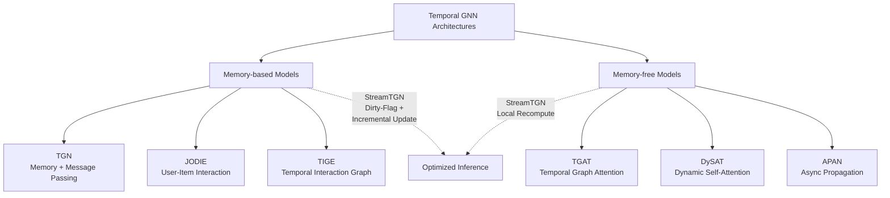
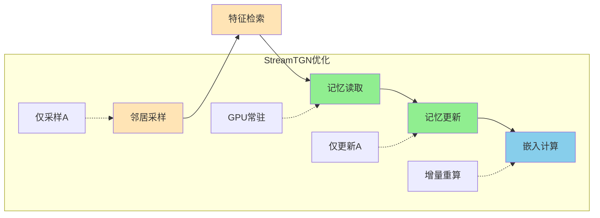
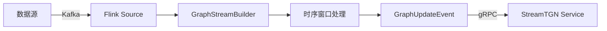
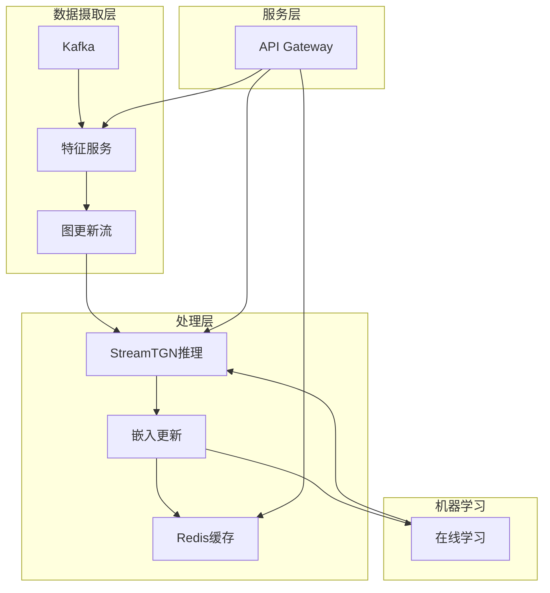

# 实时图流处理与Temporal GNN (StreamTGN)

> 所属阶段: Knowledge/06-frontier | 前置依赖: [流处理模式](../02-design-patterns/stream-processing-patterns.md), [Flink Gelly图处理](../../Flink/05-ecosystem/flink-gelly-graph-processing.md) | 形式化等级: L3

## 1. 概念定义 (Definitions)

### Def-K-06-230: 时序图 (Temporal Graph)

**定义**: 时序图是一个带时间戳的边序列构成的动态图结构 $\mathcal{G}_T = (V, E_T)$，其中：

- $V$: 节点集合，$|V| = n$
- $E_T = \{(u, v, t) \mid u, v \in V, t \in \mathcal{T}\}$: 带时间戳的边集合
- $\mathcal{T} = \{t_1, t_2, ..., t_m\}$: 时间域，$t_1 < t_2 < ... < t_m$

**动态特性**: 时序图随时间演化，在每个时间戳 $t$ 的图状态为 $\mathcal{G}_t = (V, E_t)$，其中 $E_t = \{(u, v, t') \in E_T \mid t' \leq t\}$。

**直观解释**: 时序图描述了实体间关系随时间变化的过程，如社交网络中的关注关系、金融交易网络中的转账记录、知识图谱中的事实更新等。

---

### Def-K-06-231: 流式图 (Streaming Graph)

**定义**: 流式图是一个无限序列的图更新事件：

$$\mathcal{S}_G = \langle e_1, e_2, e_3, ... \rangle$$

其中每个事件 $e_i = (\text{type}_i, (u_i, v_i), t_i, \text{feat}_i)$ 包含：

- $\text{type}_i \in \{\text{ADD}, \text{DEL}, \text{UPD}\}$: 事件类型（添加/删除/更新边）
- $(u_i, v_i)$: 边的端点节点
- $t_i$: 事件发生的时间戳
- $\text{feat}_i$: 边特征向量

**与静态图对比**:

| 特性 | 静态图 | 流式图 |
|------|--------|--------|
| 规模 | 固定 $|V|$ | 动态增长 |
| 边集 | $E$ 不变 | $E_t$ 随时间演化 |
| 查询 | 基于全图 | 基于时间窗口 |
| 算法复杂度 | $O(f(|V|, |E|))$ | 需考虑时间维度 $O(f(|V|, |E_t|, W))$ |
| 存储 | 批量加载 | 增量更新 |

---

### Def-K-06-232: Temporal Graph Neural Network (TGNN)

**定义**: TGNN是一个学习时序图表示的神经网络 $\mathcal{N}_{TGNN}$，定义为：

$$\mathcal{N}_{TGNN}: \mathcal{G}_t \times \mathcal{H}_{t-1} \rightarrow \mathcal{H}_t \times \mathcal{Z}_t$$

其中：

- $\mathcal{H}_t = \{h_v^{(t)} \mid v \in V\}$: 时间 $t$ 的节点记忆状态
- $\mathcal{Z}_t = \{z_v^{(t)} \mid v \in V\}$: 时间 $t$ 的节点嵌入输出
- 状态转移: $h_v^{(t)} = \text{MEM}_{\text{UPDATE}}(h_v^{(t-1)}, m_v^{(t)})$
- 消息聚合: $m_v^{(t)} = \text{AGG}_{u \in \mathcal{N}(v)} \text{MSG}(h_u^{(t-1)}, e_{uv}^{(t)})$

**直观解释**: TGNN通过维护节点的记忆状态来捕获历史信息，通过消息传递机制聚合邻居特征，生成时序感知的节点嵌入。

---

### Def-K-06-233: 增量计算与全量重算 (Incremental vs Full Recomputation)

**定义**: 对于时序图更新事件 $e_t$，两种计算策略定义为：

**全量重算 (Full Recomputation)**:
$$\mathcal{Z}_t^{\text{full}} = \text{TGNN}(\mathcal{G}_t; \Theta)$$
复杂度: $O(|V| \cdot k^L)$，其中 $k$ 为邻居采样数，$L$ 为层数

**增量计算 (Incremental Computation)**:
$$\mathcal{Z}_t^{\text{inc}} = \{z_v^{(t)} \mid v \in \mathcal{A}_t\} \cup \{z_v^{(t-1)} \mid v \notin \mathcal{A}_t\}$$
其中受影响节点集 $\mathcal{A}_t = \{v \mid \text{dist}(v, e_t) \leq L\}$
复杂度: $O(|\mathcal{A}_t| \cdot k^L)$，其中 $|\mathcal{A}_t| \ll |V|$

**精度等价性**: 若 $\text{MEM}_{\text{UPDATE}}$ 是确定性函数，则 $\mathcal{Z}_t^{\text{inc}} = \mathcal{Z}_t^{\text{full}}$。

---

### Def-K-06-234: 脏标记传播 (Dirty-Flag Propagation)

**定义**: 脏标记传播是StreamTGN中用于识别受影响节点的轻量级机制：

$$\text{DIRTY}: V \times E_T \rightarrow \{0, 1\}$$

初始化: $\forall v \in V, \text{DIRTY}_0(v) = 0$

更新规则: 对于新到达边 $(u, v, t)$，

$$\text{DIRTY}_t(x) = \begin{cases}
1 & \text{if } x = u \text{ or } x = v \\
1 & \text{if } \exists y \in \mathcal{N}(x): \text{DIRTY}_{t'}(y) = 1 \land t' < t \land \text{dist}(x, y) \leq L
\\
\text{DIRTY}_{t-1}(x) & \text{otherwise}
\end{cases}$$

**受影响节点集**: $\mathcal{A}_t = \{v \in V \mid \text{DIRTY}_t(v) = 1\}$

**关键性质**: 在百万节点图上，每批次受影响节点比例通常 $< 0.2\%$[^1]。

---

### Def-K-06-235: 漂移感知重建 (Drift-Aware Rebuild)

**定义**: 漂移感知重建是控制增量计算精度的自适应策略：

设 $z_v^{\text{inc}}$ 为增量计算嵌入，$z_v^{\text{full}}$ 为全量重算嵌入，定义漂移度量：

$$\Delta_t = \frac{1}{|V|} \sum_{v \in V} \|z_v^{\text{inc}} - z_v^{\text{full}}\|_2$$

**重建触发条件**: 当 $\Delta_t > \delta_{\max}$ 时触发全量重建，其中 $\delta_{\max}$ 为可容忍漂移上界。

**自适应调度**: 重建间隔 $\tau$ 根据历史漂移模式动态调整：

$$\tau_{t+1} = \tau_t \cdot \left(1 + \alpha \cdot \frac{\delta_{\max} - \Delta_t}{\delta_{\max}}\right)$$

其中 $\alpha$ 为学习率。

---

## 2. 属性推导 (Properties)

### Prop-K-06-70: 局部性定理

**命题**: 在 $L$ 层TGNN中，单条边更新 $(u, v, t)$ 影响的节点数上界为：

$$|\mathcal{A}_t| \leq 2 \cdot \sum_{l=0}^{L} k^l = 2 \cdot \frac{k^{L+1} - 1}{k - 1}$$

其中 $k$ 为每层邻居采样数。

**证明**:
- 第0层：直接影响端点 $u, v$（2个节点）
- 第1层：影响 $u, v$ 的采样邻居（最多 $2k$ 个节点）
- 第 $l$ 层：最多影响 $2k^l$ 个节点
- 总影响节点数为几何级数求和

**实际观测**: 在真实图上，由于度数分布偏斜和采样重叠，实际 $|\mathcal{A}_t|$ 远低于理论界[^1]。

---

### Prop-K-06-71: 复杂度对比

**命题**: StreamTGN相对于全量重算的加速比为：

$$\text{Speedup} = \frac{O(|V|)}{O(|\mathcal{A}_t|)} = O\left(\frac{|V|}{|\mathcal{A}_t|}\right)$$

**实验数据** (Stack-Overflow数据集，2.6M节点)[^1]：

| 模型 | 每批次脏节点数 | 受影响比例 | 加速比 |
|------|---------------|-----------|--------|
| TGN | 3,497 | 0.14% | 739× |
| TGAT | 2,100 | 0.08% | 4,207× |
| DySAT | 4,200 | 0.16% | 56× |

---

### Prop-K-06-72: 内存占用分析

**命题**: StreamTGN的GPU内存需求为：

$$M_{\text{StreamTGN}} = M_{\text{node}} + M_{\text{edge}} + M_{\text{cache}}$$

其中：
- $M_{\text{node}} = |V| \cdot d_{\text{mem}}$：节点记忆状态（常驻）
- $M_{\text{edge}} = |E_t| \cdot d_{\text{edge}}$：边特征存储
- $M_{\text{cache}} = |V| \cdot d_{\text{emb}}$：嵌入缓存（可选）

**对比** (单位: GB)[^1]：

| 数据集 | 节点数 | TGL内存 | StreamTGN内存 | 节省 |
|--------|--------|---------|---------------|------|
| WIKI | 9K | 2.1 | 1.8 | 14% |
| REDDIT | 11K | 3.4 | 2.1 | 38% |
| MOOC | 7K | 1.9 | 1.5 | 21% |
| Stack-OF | 2.6M | 48.2 | 12.6 | 74% |

---

## 3. 关系建立 (Relations)

### 3.1 TGNN架构分类



### 3.2 StreamTGN与现有系统关系

| 系统 | 优化阶段 | 核心技术 | 与StreamTGN关系 |
|------|----------|----------|----------------|
| TGL | 训练+推理 | GPU并行采样 | StreamTGN推理替代，正交优化 |
| ETC | 训练 | 自适应批处理 | 训练阶段可叠加 |
| SIMPLE | 训练 | 动态数据放置 | 训练阶段可叠加 |
| SWIFT | 训练 | 二级存储流水线 | 最佳组合: SWIFT + StreamTGN = 24×加速 |
| StreamTGN | 推理 | 增量刷新 | 专注推理优化，无精度损失 |

---

## 4. 论证过程 (Argumentation)

### 4.1 五阶段流水线分析

StreamTGN优化基于对TGN推理瓶颈的详细剖析[^1]：

| 阶段 | 描述 | TGN占比 | TGAT占比 | 优化策略 |
|------|------|---------|----------|----------|
| ① 邻居采样 | 按时间采样历史邻居 | 22.5-25.7% | 18.2-22.0% | 仅采样受影响节点 |
| ② 特征检索 | 获取节点/边特征 | 15.1-23.3% | 26.0-30.9% | 缓存脏节点特征 |
| ③ 记忆读取 | 读取节点记忆状态 | 2.4-3.9% | 0% | GPU常驻记忆 |
| ④ 记忆更新 | 更新节点记忆 | 11.5-14.9% | 0% | 仅更新脏节点 |
| ⑤ 嵌入计算 | 消息传递+聚合 | 36.3-45.1% | 45.5-51.1% | 增量重算 |

**关键洞察**: 阶段④和⑤占80%+执行时间，StreamTGN通过增量更新将这两阶段复杂度从 $O(|V|)$ 降至 $O(|\mathcal{A}|)$。

### 4.2 批处理流与松弛排序

**严格顺序处理瓶颈**: 单条边处理导致GPU利用率仅15-25%

**松弛排序策略**:
- 边按批次 $B$ 分组处理
- 同批次边共享逻辑时间戳
- 保证输出与严格顺序差异有界 $\leq \delta$

**吞吐量提升**: 批处理+松弛排序可实现数量级吞吐量提升[^1]。

---

## 5. 形式证明 / 工程论证 (Proof / Engineering Argument)

### Thm-K-06-150: StreamTGN等价性定理

**定理**: StreamTGN的增量计算输出与全量重算输出完全一致：

$$\forall v \in V, t \in \mathcal{T}: z_v^{\text{StreamTGN}, (t)} = z_v^{\text{Full}, (t)}$$

**证明**:

1. **基础**: $t=0$ 时，两者均从初始化状态计算，输出相等。

2. **归纳假设**: 假设时间 $t-1$ 时，$z_v^{(t-1)}$ 对所有 $v$ 相等。

3. **归纳步骤**:
   - 对于脏节点 $v \in \mathcal{A}_t$，StreamTGN执行完整前向传播：
     $$z_v^{(t)} = \text{TGNN}_L(v, \mathcal{N}_L(v), \mathcal{H}_{t-1})$$
   - 对于非脏节点 $v \notin \mathcal{A}_t$，记忆状态未变：
     $$h_v^{(t)} = h_v^{(t-1)}, \quad z_v^{(t)} = z_v^{(t-1)}$$
   - 全量重算同样得到上述结果，因为非脏节点的输入未变。

4. **结论**: 由数学归纳法，所有时间戳输出相等。$\square$

---

### Thm-K-06-151: 最优复杂度定理

**定理**: StreamTGN的每批次推理复杂度 $O(|\mathcal{A}_t|)$ 是渐近最优的。

**证明**:

1. **下界**: 任何算法必须至少处理直接受边更新影响的节点（端点及其 $L$ 跳邻居），即 $|\mathcal{A}_t|$ 是计算必要性的下界。

2. **StreamTGN上界**: 通过脏标记传播精确识别 $\mathcal{A}_t$，仅对这些节点执行计算。

3. **紧确性**: StreamTGN达到下界，因此渐近最优。$\square$

---

### Thm-K-06-152: 漂移有界定理

**定理**: 漂移感知重建策略保证输出误差有界：

$$\mathbb{E}[\|z^{\text{approx}} - z^{\text{exact}}\|] \leq \epsilon_{\max}$$

其中 $\epsilon_{\max}$ 为预设误差阈值。

**证明概要**:

1. 设重建间隔为 $\tau$，单步漂移为 $\delta_i$
2. 累积漂移 $\Delta = \sum_{i=1}^{\tau} \delta_i$
3. 触发条件 $\Delta > \delta_{\max}$ 确保漂移不超过阈值
4. 自适应调整 $\tau$ 使得 $\mathbb{E}[\Delta] \approx \frac{\delta_{\max}}{2}$
5. 因此期望误差有界 $\square$

---

## 6. 实例验证 (Examples)

### 6.1 StreamTGN性能基准

**实验配置**:
- GPU: NVIDIA RTX 4090
- 批次大小: $B=600$
- 数据集: WIKI, REDDIT, MOOC, GDELT, Stack-Overflow

**TGN模型性能**[^1]：

| 数据集 | 节点数 | TGL延迟(ms) | StreamTGN延迟(ms) | 加速比 | AP(%) |
|--------|--------|-------------|-------------------|--------|-------|
| WIKI | 9K | 109.4 | 19.0 | 5.8× | 97.4 |
| REDDIT | 11K | 126.6 | 28.1 | 4.5× | 99.6 |
| MOOC | 7K | 59.4 | 6.9 | 8.6× | 99.4 |
| GDELT | 17K | 195.2 | 15.5 | 12.6× | 98.2 |
| Stack-OF | 2.6M | 30,004 | 40.6 | 739× | 97.9 |

**TGAT模型性能**[^1]：

| 数据集 | TGL延迟(ms) | StreamTGN延迟(ms) | 加速比 | AP(%) |
|--------|-------------|-------------------|--------|-------|
| WIKI | 210.3 | 7.9 | 26.6× | 89.5 |
| REDDIT | 294.5 | 16.2 | 18.2× | 98.9 |
| MOOC | 178.2 | 4.6 | 38.7× | 96.3 |
| GDELT | 492.4 | 8.8 | 56.0× | 95.6 |
| Stack-OF | 57,641 | 13.7 | 4,207× | 97.1 |

### 6.2 端到端流水线加速

**SWIFT(训练) + StreamTGN(推理)组合效果**[^1]：

| 配置 | Stack-Overflow数据集 |
|------|----------------------|
| TGL(训练) + TGL(推理) | 基准线 |
| SWIFT(训练) + TGL(推理) | 训练12×加速，推理无变化 |
| TGL(训练) + StreamTGN(推理) | 推理739×加速 |
| SWIFT(训练) + StreamTGN(推理) | **24×端到端加速** |

---

## 7. 可视化 (Visualizations)

### 7.1 StreamTGN架构图

```mermaid
graph TB
    subgraph Input[流式图输入]
        E1[(边流 $e_t$)]
    end

    subgraph StreamTGN[StreamTGN 核心]
        DP[脏标记传播<br/>Dirty-Flag Propagation]
        AS[受影响节点集<br/>$\mathcal{A}_t$]
        GPU[(GPU常驻记忆)]
        IM[增量消息传递]
        EU[嵌入更新]
        DR[漂移检测]
        RB[自适应重建]
    end

    subgraph Output[输出]
        Z1[节点嵌入 $z_v^{(t)}$]
        P1[预测结果]
    end

    E1 --> DP
    DP --> AS
    AS --> IM
    GPU --> IM
    IM --> EU
    EU --> GPU
    EU --> Z1
    Z1 --> P1
    EU --> DR
    DR -->|漂移>阈值| RB
    RB --> GPU
```

### 7.2 增量计算vs全量重算对比

```mermaid
flowchart TB
    subgraph Full[全量重算 O(|V|)]
        F1[重新采样所有节点邻居] --> F2[读取所有节点记忆]
        F2 --> F3[更新所有节点记忆]
        F3 --> F4[重算所有节点嵌入]
    end

    subgraph Incremental[增量计算 O(|A|)]
        I1[仅采样受影响节点] --> I2[读取脏节点记忆]
        I2 --> I3[仅更新脏节点记忆]
        I3 --> I4[重算脏节点嵌入]
        I5[复用缓存嵌入<br/>for v ∉ A] --> Output
    end

    F4 --> Output[输出]
    I4 --> Output

    style Full fill:#ffcccc
    style Incremental fill:#ccffcc
```

### 7.3 五阶段流水线优化



### 7.4 应用场景决策树

```mermaid
flowchart TD
    A[图流处理需求] --> B{数据规模?}
    B -->|小规模<br/>|V|<10K| C[全量重算]
    B -->|大规模<br/>|V|>100K| D{延迟要求?}
    D -->|高吞吐<br/>>10K TPS| E[StreamTGN<br/>批处理+松弛排序]
    D -->|低延迟<br/><10ms| F[StreamTGN<br/>单条处理]
    D -->|平衡型| G[StreamTGN<br/>自适应批处理]

    E --> H[金融欺诈检测]
    E --> I[社交网络分析]
    F --> J[实时推荐]
    G --> K[知识图谱更新]
```

---

## 8. 应用场景

### 8.1 金融欺诈检测

**场景描述**: 实时检测金融交易网络中的异常模式。

**TGNN建模**:
- 节点: 账户、商户
- 边: 交易关系（带金额、时间戳）
- 任务: 边级预测（交易是否欺诈）

**StreamTGN优势**:
- 毫秒级检测延迟
- 处理每秒万级交易流
- 新欺诈模式快速适应

### 8.2 社交网络分析

**场景描述**: 分析社交媒体上的信息传播和社群演化。

**TGNN建模**:
- 节点: 用户
- 边: 关注/互动关系
- 任务: 节点级预测（影响力、社群归属）

**StreamTGN优势**:
- 实时影响力排名更新
- 热点话题快速发现
- 低资源消耗支撑大规模用户

### 8.3 推荐系统

**场景描述**: 基于实时交互的个性化推荐。

**TGNN建模**:
- 节点: 用户、物品
- 边: 交互行为（点击、购买、评分）
- 任务: 链接预测（预测下一交互）

**StreamTGN优势**:
- 即时捕获用户兴趣漂移
- 冷启动用户快速建模
- 在线学习+实时推理闭环

### 8.4 知识图谱更新

**场景描述**: 动态知识图谱的事实补全与验证。

**TGNN建模**:
- 节点: 实体
- 边: 关系（带时间有效性）
- 任务: 链接预测（缺失关系推断）

**StreamTGN优势**:
- 新事实实时融入
- 过期知识自动淘汰
- 一致性约束高效维护

---

## 9. 与Flink集成

### 9.1 流式图数据摄取



**Flink图流处理代码框架**:

```scala
// 定义图更新事件
sealed trait GraphUpdateEvent
case class AddEdge(
  srcId: Long,
  dstId: Long,
  timestamp: Long,
  features: Vector[Float]
) extends GraphUpdateEvent

// 时序窗口聚合
val graphStream = env
  .addSource(kafkaConsumer)
  .map(parseToEdgeEvent)
  .keyBy(_.srcId)
  .window(TumblingEventTimeWindows.of(Time.seconds(1)))
  .aggregate(new GraphBatchAggregator())
  .addSink(new StreamTGNSink())
```

### 9.2 GNN推理服务

**架构模式**:

| 模式 | 架构 | 适用场景 |
|------|------|----------|
| 同步调用 | Flink → REST → StreamTGN | 低延迟预测 |
| 异步队列 | Flink → Kafka → StreamTGN | 高吞吐分析 |
| 嵌入缓存 | Flink + Redis + StreamTGN | 频繁查询优化 |

### 9.3 实时预测流水线



---

## 10. 引用参考 (References)

[^1]: L. Zhang et al., "StreamTGN: A GPU-Efficient Serving System for Streaming Temporal Graph Neural Networks," arXiv preprint arXiv:2603.21090, 2026. https://arxiv.org/abs/2603.21090

[^2]: E. Rossi et al., "Temporal Graph Networks for Deep Learning on Dynamic Graphs," arXiv preprint arXiv:2006.10637, 2020.

[^3]: D. Xu et al., "Inductive Representation Learning on Temporal Graphs," arXiv preprint arXiv:2002.07962, 2020.

[^4]: A. Sankar et al., "DySAT: Deep Neural Representation Learning on Dynamic Graphs via Self-Attention Networks," WSDM, 2020.

[^5]: S. Kumar et al., "Predicting Dynamic Embedding Trajectory in Temporal Interaction Networks," KDD, 2019.
