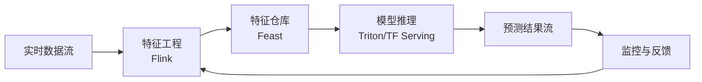

# 实时 ML 推理专题 — 目录导航

> **所属阶段**: Knowledge/06-frontier/ | **形式化等级**: L3-L4
> **最后更新**: 2026-04-13

---

## 文档列表

| 编号 | 文档 | 描述 | 状态 |
|------|------|------|------|
| 06.04.01 | [ML Model Serving](./06.04.01-ml-model-serving.md) | 流式模型服务架构、TensorFlow Serving / TorchServe / Triton 集成 | ✅ 已完成 |
| 06.04.02 | [Feature Store Streaming](./06.04.02-feature-store-streaming.md) | 实时特征仓库、Feast 与 Flink 集成、在线/离线特征一致性 | ✅ 已完成 |
| 06.04.03 | [ML Pipeline Orchestration](./06.04.03-ml-pipeline-orchestration.md) | 流式 ML Pipeline 编排、A/B 测试、模型版本管理 | ✅ 已完成 |
| 06.04.04 | [ML Observability](./06.04.04-ml-observability.md) | 实时模型监控、漂移检测、性能退化告警 | ✅ 已完成 |

---

## 架构概览

---

*Realtime ML Inference Index*
