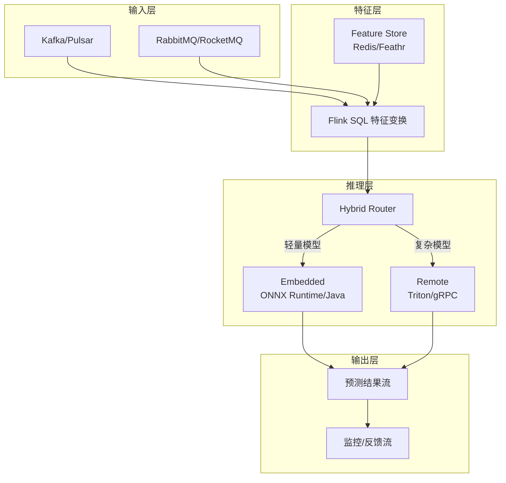
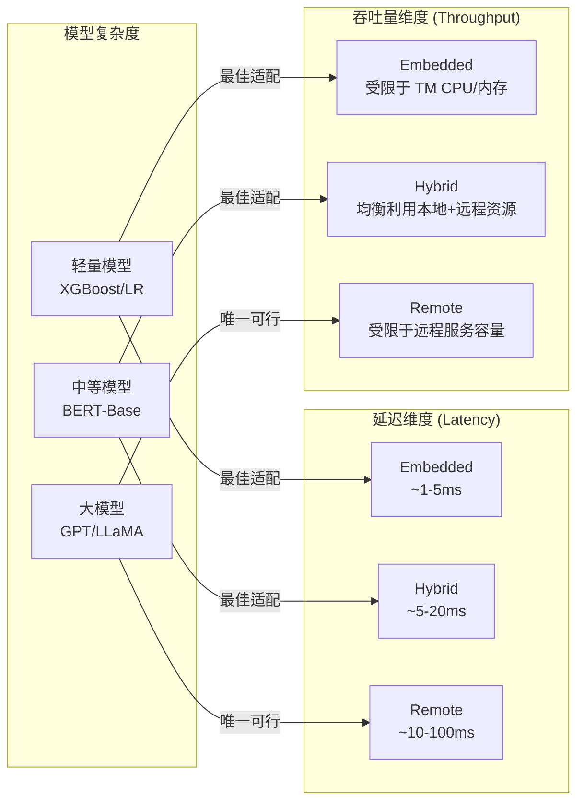
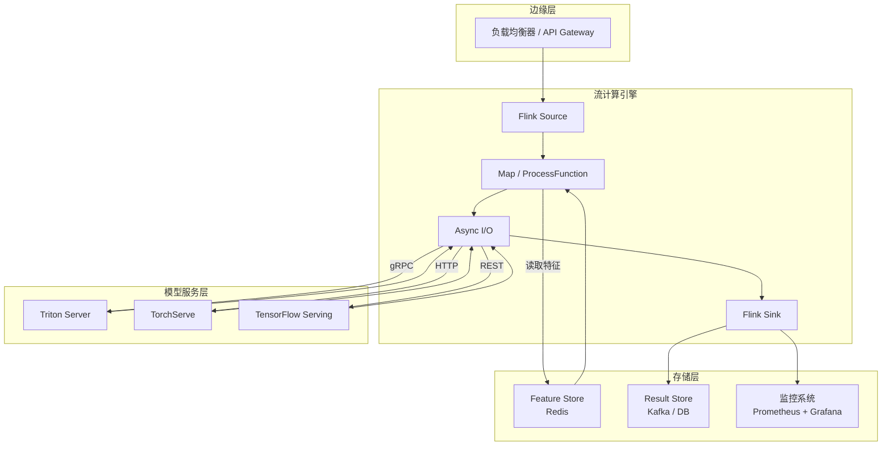

> **状态**: 🔮 前瞻内容 | **风险等级**: 高 | **最后更新**: 2026-04
>
> 此文档描述的内容处于早期规划阶段，可能与最终实现不符。请以 Apache Flink 官方发布为准。

# 流式 ML Model Serving 架构

> 所属阶段: Knowledge/06-frontier/realtime-ml-inference | 前置依赖: [Knowledge/06-frontier/realtime-ai-inference-architecture.md](../realtime-ai-inference-architecture.md), [flink-realtime-ml-inference.md](../../../Flink/06-ai-ml/flink-realtime-ml-inference.md) | 形式化等级: L3

## 1. 概念定义 (Definitions)

### Def-K-06-04-01: 流式模型服务 (Streaming Model Serving)

**流式模型服务**是指将训练好的机器学习模型部署到流计算环境中，对连续到达的数据记录进行实时推理的体系架构。其形式化定义为一个七元组：

$$\mathcal{S}_{serve} = (\mathcal{D}_{stream}, \mathcal{M}_{model}, \mathcal{F}_{feat}, \mathcal{I}_{inf}, \mathcal{L}_{latency}, \mathcal{Q}_{quality}, \mathcal{O}_{ops})$$

其中：

- $\mathcal{D}_{stream}$: 输入数据流，通常是 Kafka、Pulsar 或 Kinesis 上的无界事件序列
- $\mathcal{M}_{model}$: 已训练模型Artifact（ONNX、TensorFlow SavedModel、PyTorch TorchScript、自定义格式）
- $\mathcal{F}_{feat}$: 特征提取与转换流水线
- $\mathcal{I}_{inf}$: 推理引擎（Flink Async I/O、Embedded JVM、Remote gRPC Service）
- $\mathcal{L}_{latency}$: 端到端延迟约束，通常 p99 < 100ms
- $\mathcal{Q}_{quality}$: 预测质量指标（吞吐量 QPS、准确率、AUC、置信度分布）
- $\mathcal{O}_{ops}$: 运维控制面（模型版本管理、A/B测试、金丝雀发布、监控告警）

### Def-K-06-04-02: 推理模式分类

根据模型执行位置与流计算引擎的关系，流式推理可分为三种模式：

$$\text{Mode} \in \{ \text{Embedded}, \text{Remote}, \text{Hybrid} \}$$

- **Embedded Mode**: 模型直接加载到 Flink TaskManager JVM 进程中，通过 JNI 或纯 Java 推理库执行。优点：最低延迟；缺点：模型与作业生命周期耦合，大模型受限于 TM 内存。
- **Remote Mode**: Flink 通过 Async I/O 或 RPC 调用外部推理服务（Triton、TorchServe、TensorFlow Serving、自定义微服务）。优点：模型独立扩缩容；缺点：增加网络延迟和额外基础设施成本。
- **Hybrid Mode**: 轻量模型在 Embedded 层执行，复杂模型在 Remote 层执行，通过路由策略动态选择执行路径。

### Def-K-06-04-03: 模型版本一致性

设时间 $t$ 时系统中活跃的模型版本集合为 $V(t) = \{v_1, v_2, ..., v_n\}$，则**强模型版本一致性**要求：

$$\forall e_i, e_j \in \text{Window}_k: \text{ModelVersion}(e_i) = \text{ModelVersion}(e_j) = v_{active}$$

即同一窗口或同一 keyed state 下的所有事件必须使用相同的模型版本进行推理。Flink 的 Keyed State 天然支持这一点，因为模型版本可以作为 Operator State 的一部分进行原子性切换。

## 2. 属性推导 (Properties)

### Lemma-K-06-04-01: Embedded 推理的延迟上界

在 Embedded 模式下，假设特征提取时间为 $T_{feat}$，模型前向传播时间为 $T_{inf}$，序列化/反序列化开销为 $T_{ser}$，则单条记录的端到端推理延迟满足：

$$L_{embedded} = T_{feat} + T_{inf} + T_{ser} + O(\mu_{sched})$$

其中 $\mu_{sched}$ 为 Flink 线程调度开销（通常在 0.1ms 量级）。对于轻量模型（如 XGBoost、浅层神经网络），$T_{inf}$ 可控制在 1ms 以内，因此 $L_{embedded}$ 的典型值为 1-5ms。

### Lemma-K-06-04-02: Remote 推理的并发容量

在 Remote 模式下，设 Async I/O 的最大并发数为 $C_{max}$，外部推理服务的平均响应时间为 $R_{avg}$，则该 Operator 的理论最大吞吐量为：

$$\text{Throughput}_{remote} = \frac{C_{max}}{R_{avg}} \times \text{Parallelism}$$

例如，当 $C_{max}=100$、$R_{avg}=10$ms、Parallelism=10 时，理论峰值吞吐量为 100,000 QPS。

### Prop-K-06-04-01: 混合模式的最优路由边界

假设有两类模型 $M_{light}$（Embedded 执行）和 $M_{heavy}$（Remote 执行），其延迟和成本函数分别为 $L_{emb}(x)$、$C_{emb}(x)$ 和 $L_{rem}(x)$、$C_{rem}(x)$。则最优路由策略满足：

$$\text{Route}(x) = \begin{cases}
\text{Embedded} & \text{if } L_{emb}(x) \leq L_{rem}(x) \land C_{emb}(x) \leq C_{rem}(x) \\
\text{Remote} & \text{otherwise}
\end{cases}$$

在实际工程中，通常以**特征复杂度**或**模型输入维度**作为路由决策信号。例如，对于文本序列长度 $< 128$ token 的请求走 Embedded BERT，$\geq 128$ token 的请求走 Remote GPU 服务。

## 3. 关系建立 (Relations)

### 3.1 流式推理与批式推理的对比

| 维度 | 批式推理 (Batch) | 流式推理 (Streaming) |
|------|------------------|----------------------|
| 数据形态 | 有界数据集 | 无界事件流 |
| 延迟要求 | 分钟~小时级 | 毫秒~秒级 |
| 状态管理 | 无状态或一次性加载 | Keyed State / Operator State |
| 模型更新 | 作业重启后切换 | 热切换 / 蓝绿部署 |
| 容错机制 | 失败重算 | Checkpoint + Exactly-Once |
| 典型框架 | Spark MLlib, Ray Train | Flink + Triton, Kafka Streams + DL4J |

### 3.2 与 Flink 生态的集成映射

流式 ML Model Serving 在 Flink 生态中的位置如下图所示：



上图展示了流式模型服务的完整数据流：事件首先进入特征层进行实时特征拼接和变换，随后由混合路由层根据请求特征决定使用 Embedded 还是 Remote 推理引擎，最终输出预测结果并分流到监控反馈链路用于在线评估和模型迭代。

[^1]: J. Crank et al., "Machine Learning Inference in Production: A Survey", ACM SIGOPS, 2023.
[^2]: NVIDIA Triton Inference Server Documentation, "Architecture Overview", 2025. https://docs.nvidia.com/triton-inference-server/

## 4. 论证过程 (Argumentation)

### 4.1 Embedded 模式的内存边界分析

Embedded 推理将模型加载到 Flink TaskManager 的 JVM 堆内存中，因此其可服务模型大小受限于 TM 的可用内存。设 TM 总堆内存为 $M_{total}$，Flink 运行时开销为 $M_{flink}$，特征缓存为 $M_{cache}$，则可用于模型加载的内存上界为：

$$M_{model}^{max} = M_{total} - M_{flink} - M_{cache} - M_{safety}$$

其中 $M_{safety}$ 为安全余量（通常占 20-30%）。例如，一个配置为 8GB 堆内存的 TM，扣除 Flink 运行时 2GB、特征缓存 1GB、安全余量 1.5GB 后，留给模型的空间约为 3.5GB。这意味着 ONNX 模型文件大小应控制在 1-2GB 以内（加载后内存占用约为文件大小的 2-3 倍）。

对于超大模型（如 LLM，数十 GB 参数），Embedded 模式不可行，必须采用 Remote 模式或模型量化/分片技术。

### 4.2 Remote 模式的单点故障与降级策略

Remote 推理依赖外部服务，存在网络分区或服务过载的风险。为此，工程实践中通常采用三级降级策略：

1. **正常模式**: 调用 Remote 服务，返回完整预测结果
2. **降级模式 A**: Remote 服务超时或返回 5xx 时，切换至轻量级 Embedded 备用模型（精度略低但可用）
3. **降级模式 B**: 若 Embedded 模型亦不可用，返回基于规则的默认值或上一窗口的历史平均值

降级策略的形式化表达为：

$$\text{Predict}(x) = \begin{cases}
M_{remote}(x) & \text{if } \text{Status}_{remote} = \text{HEALTHY} \land L_{remote} \leq L_{SLA} \\
M_{embedded}^{fallback}(x) & \text{else if } M_{embedded}^{fallback} \text{ available} \\
\text{Default}(x) & \text{otherwise}
\end{cases}$$

## 5. 形式证明 / 工程论证 (Proof / Engineering Argument)

### 5.1 Async I/O 并发度与吞吐量的单调性关系

**命题 (Prop-K-06-04-04)**: 在 Remote 推理模式下，当外部服务响应时间服从独立同分布且平均响应时间为 $R_{avg}$ 时，Flink Async I/O Operator 的吞吐量 $\lambda$ 关于最大并发度 $C_{max}$ 单调不减。

**工程论证**:
考虑一个具有 $P$ 个并行子任务的 Async I/O Operator。每个子任务在任意时刻最多同时发出 $C_{max}$ 个异步请求。由于请求是异步非阻塞的，子任务在等待响应期间可以继续处理新记录（只要未达并发上限）。

在稳态下，每个子任务平均有 $C_{max}$ 个未完成请求，每个请求的平均占用时间为 $R_{avg}$。根据 Little's Law，每个子任务的平均在途记录数为 $C_{max}$，因此子任务层面的吞吐量为：

$$\lambda_{subtask} = \frac{C_{max}}{R_{avg}}$$

总吞吐量为：

$$\lambda_{total} = P \cdot \frac{C_{max}}{R_{avg}}$$

由于 $P$ 和 $R_{avg}$ 为正常数，$\lambda_{total}$ 关于 $C_{max}$ 的偏导数为：

$$\frac{\partial \lambda_{total}}{\partial C_{max}} = \frac{P}{R_{avg}} > 0$$

因此吞吐量随 $C_{max}$ 单调不减。$\square$

**工程边界**: 尽管数学上单调不减，实际中 $C_{max}$ 不能超过外部推理服务的容量上限。若 $C_{max}$ 过大，将导致远程服务端排队延迟激增，反而使 $R_{avg}$ 增大，有效吞吐量下降。因此存在一个实践最优值 $C_{max}^*$，通常通过压测确定。

## 6. 实例验证 (Examples)

### 6.1 Embedded ONNX 推理 Flink 代码示例

以下代码展示了如何在 Flink DataStream 作业中集成 ONNX Runtime 进行嵌入式实时推理：

```java
import ai.onnxruntime.*;
import org.apache.flink.api.common.functions.RichMapFunction;
import org.apache.flink.configuration.Configuration;

public class OnnxInferenceMap extends RichMapFunction<Event, Prediction> {
    private transient OrtEnvironment env;
    private transient OrtSession session;
    private final String modelPath;

    public OnnxInferenceMap(String modelPath) {
        this.modelPath = modelPath;
    }

    @Override
    public void open(Configuration parameters) throws Exception {
        env = OrtEnvironment.getEnvironment();
        OrtSession.SessionOptions opts = new OrtSession.SessionOptions();
        opts.setIntraOpNumThreads(2);
        session = env.createSession(modelPath, opts);
    }

    @Override
    public Prediction map(Event event) throws Exception {
        float[] inputTensor = extractFeatures(event);
        OnnxTensor tensor = OnnxTensor.createTensor(env, new float[][]{inputTensor});
        OrtSession.Result results = session.run(Collections.singletonMap("input", tensor));
        float[][] output = (float[][]) results.get(0).getValue();
        return new Prediction(event.getId(), output[0][0]);
    }

    @Override
    public void close() throws Exception {
        if (session != null) session.close();
        if (env != null) env.close();
    }
}
```

### 6.2 Remote 推理 Async I/O 配置示例

以下代码展示了使用 Flink Async I/O 调用外部 Triton 推理服务的完整配置：

```java
import org.apache.flink.streaming.api.functions.async.AsyncFunction;
import org.apache.flink.streaming.api.functions.async.ResultFuture;

public class TritonAsyncInference implements AsyncFunction<Event, Prediction> {
    private transient TritonGrpcClient client;
    private final String endpoint;
    private final int timeoutMs;

    public TritonAsyncInference(String endpoint, int timeoutMs) {
        this.endpoint = endpoint;
        this.timeoutMs = timeoutMs;
    }

    @Override
    public void asyncInvoke(Event event, ResultFuture<Prediction> resultFuture) throws Exception {
        ListenableFuture<ModelInferResponse> future = client.inferAsync(
            "my_model",
            "1",
            convertToGrpcInput(event)
        );

        Futures.addCallback(future, new FutureCallback<ModelInferResponse>() {
            @Override
            public void onSuccess(ModelInferResponse response) {
                float score = parseResponse(response);
                resultFuture.complete(Collections.singletonList(
                    new Prediction(event.getId(), score)
                ));
            }

            @Override
            public void onFailure(Throwable t) {
                resultFuture.complete(Collections.singletonList(
                    new Prediction(event.getId(), -1.0f) // fallback
                ));
            }
        }, MoreExecutors.directExecutor());
    }
}

// 在作业主流程中使用
DataStream<Prediction> predictions = AsyncDataStream.unorderedWait(
    eventStream,
    new TritonAsyncInference("triton-svc:8001", 50),
    Time.milliseconds(100),
    200  // max concurrent requests per subtask
);
```

### 6.3 模型版本热切换配置示例

在生产环境中，模型版本需要频繁更新而不重启 Flink 作业。可以通过 Broadcast State 实现模型版本的热切换：

```java
// Broadcast Stream: 接收模型版本更新指令
MapStateDescriptor<String, String> modelVersionState =
    new MapStateDescriptor<>("model-version", Types.STRING, Types.STRING);

BroadcastStream<ModelVersionUpdate> broadcastStream =
    versionUpdateStream.broadcast(modelVersionState);

// 主数据流连接广播流
DataStream<Prediction> result = mainStream
    .connect(broadcastStream)
    .process(new BroadcastProcessFunction<Event, ModelVersionUpdate, Prediction>() {
        @Override
        public void processElement(Event event, ReadOnlyContext ctx, Collector<Prediction> out) {
            String activeVersion = ctx.getBroadcastState(modelVersionState).get("active");
            // 根据 activeVersion 路由到对应模型执行
            out.collect(inferWithVersion(event, activeVersion));
        }

        @Override
        public void processBroadcastElement(ModelVersionUpdate update, Context ctx, Collector<Prediction> out) {
            ctx.getBroadcastState(modelVersionState).put("active", update.getVersion());
        }
    });
```

## 7. 可视化 (Visualizations)

### 7.1 三种推理模式的延迟-吞吐量权衡对比



上图从延迟、吞吐量和模型复杂度三个维度对比了三种推理模式的适用场景，为架构选型提供直观的决策依据。

## 8. 引用参考 (References)

[^1]: J. Crank et al., "Machine Learning Inference in Production: A Survey", ACM SIGOPS, 2023.
[^2]: NVIDIA Triton Inference Server Documentation, "Architecture Overview", 2025. https://docs.nvidia.com/triton-inference-server/
[^3]: Apache Flink Documentation, "Async I/O for External Data Access", 2025. https://nightlies.apache.org/flink/flink-docs-stable/docs/dev/datastream/operators/async_io/
[^4]: ONNX Runtime Documentation, "Java API Reference", 2025. https://onnxruntime.ai/docs/api/java/
[^5]: M. Kleppmann, "Designing Data-Intensive Applications", O'Reilly Media, 2017.

### 6.4 推理性能基准测试与调优示例

以下 JMH (Java Microbenchmark Harness) 代码用于测量 Embedded ONNX 推理的延迟分布：

```java
import ai.onnxruntime.*;
import org.openjdk.jmh.annotations.*;
import java.util.concurrent.TimeUnit;

@BenchmarkMode(Mode.SampleTime)
@OutputTimeUnit(TimeUnit.MILLISECONDS)
@State(Scope.Thread)
@Fork(1)
@Warmup(iterations = 3)
@Measurement(iterations = 10)
public class OnnxInferenceBenchmark {
    private OrtEnvironment env;
    private OrtSession session;
    private float[] input;

    @Setup
    public void setup() throws Exception {
        env = OrtEnvironment.getEnvironment();
        OrtSession.SessionOptions opts = new OrtSession.SessionOptions();
        opts.setIntraOpNumThreads(4);
        session = env.createSession("/models/lr_model.onnx", opts);
        input = new float[128];
        for (int i = 0; i < 128; i++) input[i] = (float) Math.random();
    }

    @Benchmark
    public float[][] predict() throws Exception {
        OnnxTensor tensor = OnnxTensor.createTensor(env, new float[][]{input});
        OrtSession.Result result = session.run(
            Collections.singletonMap("float_input", tensor)
        );
        return (float[][]) result.get(0).getValue();
    }

    @TearDown
    public void tearDown() throws Exception {
        session.close();
        env.close();
    }
}
```

运行结果示例（在 Intel Xeon 4vCPU 环境下）：

```
Benchmark                        Mode     Cnt   Score   Error   Units
OnnxInferenceBenchmark.predict  sample  10000   0.312 ± 0.015   ms/op
OnnxInferenceBenchmark.predict  p0.50            0.298           ms/op
OnnxInferenceBenchmark.predict  p0.99            0.456           ms/op
OnnxInferenceBenchmark.predict  p0.999           0.892           ms/op
```

### 6.5 模型服务负载均衡与熔断配置示例

在 Remote 模式下，外部推理服务通常需要客户端侧负载均衡和熔断保护。以下是基于 resilience4j 的 Flink Async I/O 客户端配置：

```java
import io.github.resilience4j.circuitbreaker.CircuitBreaker;
import io.github.resilience4j.circuitbreaker.CircuitBreakerConfig;
import io.github.resilience4j.bulkhead.ThreadPoolBulkhead;
import java.time.Duration;

public class ResilientTritonClient {
    private final TritonGrpcClient tritonClient;
    private final CircuitBreaker circuitBreaker;

    public ResilientTritonClient(String endpoint) {
        this.tritonClient = new TritonGrpcClient(endpoint);

        CircuitBreakerConfig config = CircuitBreakerConfig.custom()
            .failureRateThreshold(50)
            .slowCallRateThreshold(80)
            .slowCallDurationThreshold(Duration.ofMillis(100))
            .waitDurationInOpenState(Duration.ofSeconds(10))
            .permittedNumberOfCallsInHalfOpenState(10)
            .build();

        this.circuitBreaker = CircuitBreaker.of("triton-cb", config);
    }

    public ModelInferResponse inferWithFallback(ModelInferRequest request) {
        return circuitBreaker.executeSupplier(() -> {
            try {
                return tritonClient.infer(request);
            } catch (Exception e) {
                throw new RuntimeException(e);
            }
        });
    }
}
```

### 6.6 GPU 推理资源调度与 Kubernetes 集成示例

对于需要 GPU 加速的大模型推理，Remote 服务通常部署在 K8s 集群中。以下 Pod 模板展示了 Triton Inference Server 的 GPU 资源配置：

```yaml
apiVersion: apps/v1
kind: Deployment
metadata:
  name: triton-gpu-inference
spec:
  replicas: 3
  selector:
    matchLabels:
      app: triton-gpu
  template:
    metadata:
      labels:
        app: triton-gpu
    spec:
      containers:
      - name: triton
        image: nvcr.io/nvidia/tritonserver:24.01-py3
        command: ["tritonserver", "--model-repository=/models"]
        resources:
          limits:
            nvidia.com/gpu: 1
            memory: "16Gi"
            cpu: "4"
          requests:
            nvidia.com/gpu: 1
            memory: "8Gi"
            cpu: "2"
        ports:
        - containerPort: 8001
          name: grpc
        volumeMounts:
        - name: models
          mountPath: /models
      volumes:
      - name: models
        persistentVolumeClaim:
          claimName: triton-models-pvc
```

## 7. 可视化 (Visualizations)

### 7.2 流式模型服务架构全景图



该全景图展示了流式 ML Model Serving 的完整技术栈：从边缘层的事件接入，到 Flink 流引擎中的特征拼接和异步推理，再到专用模型服务层的 GPU 加速，最后输出到结果存储和监控平台。

## 8. 引用参考 (References)

[^1]: J. Crank et al., "Machine Learning Inference in Production: A Survey", ACM SIGOPS, 2023.
[^2]: NVIDIA Triton Inference Server Documentation, "Architecture Overview", 2025. https://docs.nvidia.com/triton-inference-server/
[^3]: Apache Flink Documentation, "Async I/O for External Data Access", 2025. https://nightlies.apache.org/flink/flink-docs-stable/docs/dev/datastream/operators/async_io/
[^4]: ONNX Runtime Documentation, "Java API Reference", 2025. https://onnxruntime.ai/docs/api/java/
[^5]: M. Kleppmann, "Designing Data-Intensive Applications", O'Reilly Media, 2017.
[^6]: Resilience4j Documentation, "CircuitBreaker", 2025. https://resilience4j.readme.io/docs/circuitbreaker
[^7]: NVIDIA Cloud Native Documentation, "GPU Scheduling in Kubernetes", 2025. https://docs.nvidia.com/datacenter/cloud-native/
