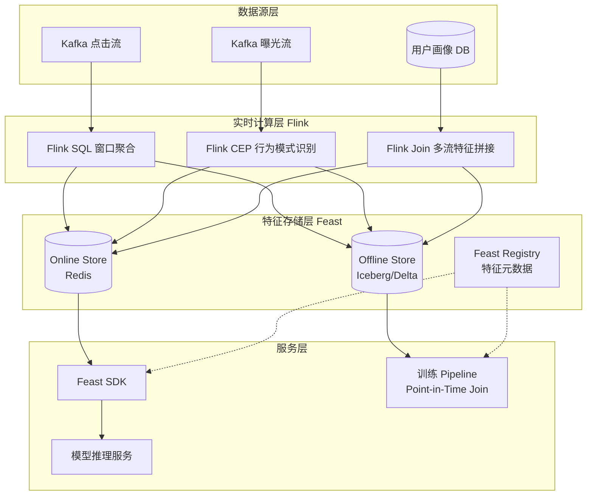
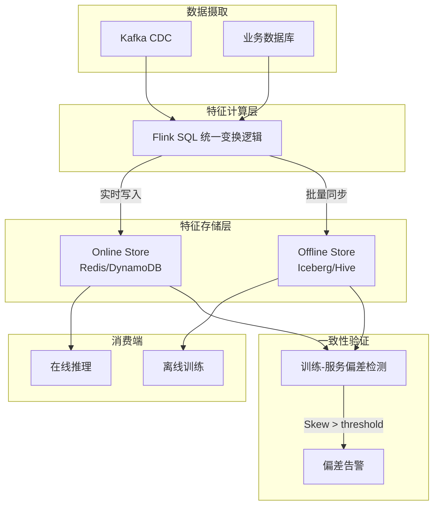
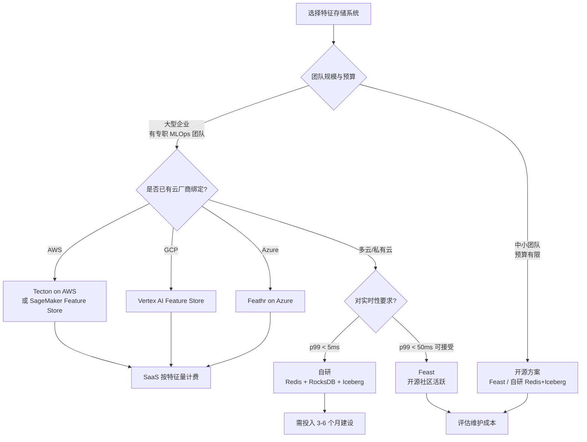

> **状态**: 🔮 前瞻内容 | **风险等级**: 高 | **最后更新**: 2026-04
>
> 此文档描述的内容处于早期规划阶段，可能与最终实现不符。请以 Apache Flink 官方发布为准。

# 实时特征仓库与流式特征一致性

> 所属阶段: Knowledge/06-frontier/realtime-ml-inference | 前置依赖: [Knowledge/06-frontier/realtime-ml-inference/06.04.01-ml-model-serving.md](./06.04.01-ml-model-serving.md), [Flink/03-api/flink-sql-aggregations.md](../../Flink/03-api/flink-sql-aggregations.md) | 形式化等级: L3

## 1. 概念定义 (Definitions)

### Def-K-06-04-04: 实时特征仓库 (Real-time Feature Store)

**实时特征仓库**是面向机器学习场景的统一特征管理与服务平台，支持在线低延迟特征服务（Online Serving）与离线批量特征回溯（Offline Retrieval）的双模态访问。其形式化定义为一个八元组：

$$\mathcal{F}_{store} = (\mathcal{S}_{online}, \mathcal{S}_{offline}, \mathcal{T}_{registry}, \mathcal{P}_{materialize}, \mathcal{G}_{sync}, \mathcal{L}_{fresh}, \mathcal{V}_{version}, \mathcal{C}_{consistency})$$

其中：

- $\mathcal{S}_{online}$: 在线存储引擎（Redis、DynamoDB、TiKV、Aerospike），面向点查优化，p99 延迟通常 $< 5$ms
- $\mathcal{S}_{offline}$: 离线存储引擎（Hive、Iceberg、Delta Lake、Parquet on S3），面向批量扫描与训练数据生成优化
- $\mathcal{T}_{registry}$: 特征元数据注册中心，管理特征定义、血缘、标签、权限与生命周期
- $\mathcal{P}_{materialize}$: 特征物化管道，将原始事件流或批表转换为可直接服务的特征值
- $\mathcal{G}_{sync}$: 在线-离线同步协议，确保同一特征实体在两个存储视图上的语义等价
- $\mathcal{L}_{fresh}$: 特征新鲜度约束，定义为从上游事件产生到特征可被查询的最大允许时延
- $\mathcal{V}_{version}$: 特征版本控制机制，支持特征计算逻辑的多版本共存与回滚
- $\mathcal{C}_{consistency}$: 一致性校验层，检测并量化在线特征与离线特征之间的分布差异

### Def-K-06-04-05: 特征一致性 (Feature Consistency)

设同一特征 $f$ 在离线训练集中的分布为 $P_{offline}(f)$，在线服务时的分布为 $P_{online}(f)$，则**特征一致性**要求两者在统计意义上满足：

$$D_{KL}\left(P_{offline}(f) \,\|\, P_{online}(f)\right) \leq \epsilon_{consist}$$

其中 $D_{KL}$ 为 Kullback-Leibler 散度，$\epsilon_{consist}$ 为工程容忍阈值（通常取 $10^{-3} \sim 10^{-2}$）。若该不等式被破坏，则模型在训练分布与服务分布之间的泛化边界将急剧恶化，导致在线 AUC 显著低于离线评估结果。

### Def-K-06-04-06: 在线/离线特征对齐 (Online-Offline Alignment)

**在线/离线特征对齐**是指使用同一套特征计算逻辑（Transformation Logic）同时生成训练样本（Point-in-Time Correctness）与在线服务特征值的过程。设时间 $t$ 的实体 $e$ 的特征真实值为 $f(e, t)$，则对齐要求：

$$f_{train}(e, t) = f_{online}(e, t) = f(e, t)$$

其中 $f_{train}(e, t)$ 表示在训练时通过时间旅行（Time Travel）查询得到的特征快照，$f_{online}(e, t)$ 表示服务时实时物化后的特征值。任何由不同代码路径、不同编程语言或不同执行引擎导致的差异都被视为**训练-服务偏差**（Training-Serving Skew）。

## 2. 属性推导 (Properties)

### Lemma-K-06-04-03: 特征新鲜度上界

假设上游事件流到达 Flink 的时间戳为 $t_{event}$，特征物化管道（Flink Window Aggregation）的处理延迟为 $T_{proc}$，在线存储引擎的写入-可见延迟为 $T_{write}$，则从事件产生到特征可查询的总新鲜度延迟满足：

$$L_{fresh} = T_{proc} + T_{write} + O(\delta_{network})$$

对于基于 Flink 的滑动窗口聚合（Sliding Window Aggregation），若窗口大小为 $W$，滑动步长为 $S$，则 $T_{proc}$ 的最坏情况上界为 $W + S$。当采用增量聚合（Incremental Aggregation）与 Early Fire 触发策略时，$T_{proc}$ 可优化至 $S + \delta_{emit}$，其中 $\delta_{emit}$ 为触发器调度开销（通常 $< 100$ms）。

### Lemma-K-06-04-04: 一致性误差下界

设离线特征由批处理引擎（Spark）计算，在线特征由流处理引擎（Flink）计算，两种引擎对同一聚合算子（如 `AVG`、`PERCENTILE`）的实现存在数值精度差异 $\delta_{num}$。则即使代码逻辑完全一致，在线/离线特征之间的最小 achievable 一致性误差满足：

$$\| f_{online} - f_{offline} \|_2 \geq \delta_{num} \times \sqrt{d}$$

其中 $d$ 为特征维度。对于 64 位浮点运算，$\delta_{num} \approx 10^{-15}$，但在涉及 `ORDER BY` 的近似分位数计算（如 T-Digest、Q-Digest）时，$\delta_{num}$ 可能高达 $10^{-2}$。因此高维特征系统中应优先使用确定性聚合（Deterministic Aggregation）而非近似算法。

### Prop-K-06-04-02: 特征回退的可用性保证

当在线特征仓库因网络分区或存储节点故障导致特征查询失败时，系统通常需要执行**特征回退**（Feature Fallback），如使用默认值、缓存值或简化计算值。设在线特征可用性为 $A_{online}$，回退策略的效用损失为 $\Delta U$，则带回退的期望效用满足：

$$\mathbb{E}[U] = A_{online} \cdot U_{exact} + (1 - A_{online}) \cdot (U_{exact} - \Delta U) = U_{exact} - (1 - A_{online}) \Delta U$$

为保证 $\mathbb{E}[U] \geq U_{min}$，回退策略必须满足：

$$\Delta U \leq \frac{U_{exact} - U_{min}}{1 - A_{online}}$$

工程实践中，常用的回退策略包括：使用用户画像的昨日缓存值（$\Delta U$ 较小）、使用全局统计均值（$\Delta U$ 中等）、使用零向量填充（$\Delta U$ 最大但系统最稳定）。

## 3. 关系建立 (Relations)

### 3.1 在线存储与离线存储的技术特性对比

| 维度 | 在线存储 (Online Store) | 离线存储 (Offline Store) |
|------|------------------------|-------------------------|
| 访问模式 | 高并发点查 (Key-Value / Point Lookup) | 批量扫描与列式投影 (Full/Range Scan) |
| 延迟要求 | p99 $< 5$ms | 秒级~分钟级批量吞吐 |
| 数据规模 | 热特征子集 (TB 级) | 全量历史特征 (PB 级) |
| 一致性模型 | 最终一致性 / 线性一致性 | 强一致性 (ACID) |
| 典型引擎 | Redis、DynamoDB、TiKV、Aerospike | Hive、Iceberg、Delta Lake、Hudi |
| 更新频率 | 实时流式写入 (毫秒级) | 批量周期性写入 (小时/天级) |

上表揭示了在线与离线存储在架构目标上的根本张力：在线层牺牲一致性与存储成本换取极致低延迟，离线层则以高吞吐、强一致、低成本为目标。特征仓库的核心价值正在于屏蔽这种异构性，为上游 ML Pipeline 提供统一的特征抽象。

### 3.2 Feast 与 Flink 的集成模式

Feast 是当前开源生态中最主流的特征仓库框架之一。其与 Flink 的集成主要存在三种模式：

| 集成模式 | 架构描述 | 优点 | 缺点 | 适用场景 |
|---------|---------|------|------|---------|
| **Push Mode** | Flink 将聚合后的特征直接写入 Feast Online Store 与 Offline Store | 端到端延迟最低，架构简单 | Flink 作业需感知存储细节，耦合度高 | 实时推荐、金融风控 |
| **Pull Mode** | Flink 推理作业在运行时通过 Feast SDK 向 Online Store 拉取特征 | 特征计算与模型服务解耦 | 增加 RPC 往返延迟，存在单点瓶颈 | 特征逻辑频繁变更的场景 |
| **Hybrid Mode** | 实时特征由 Flink Push 到 Online Store；离线特征通过 Spark/Flink Batch 写入 Offline Store； Feast 负责元数据与一致性校验 | 职责边界清晰，支持完整的时间旅行查询 | 系统组件多，运维复杂度高 | 大规模生产级推荐系统 |

### 3.3 特征一致性校验矩阵

| 校验类型 | 检测对象 | 校验方法 | 触发频率 | 异常处理 |
|---------|---------|---------|---------|---------|
| **Schema Consistency** | 特征类型、维度、缺失值填充策略 | 对比在线/离线特征元数据 | 每次特征版本发布 | 阻断发布，强制修复 |
| **Distribution Consistency** | 特征均值、方差、分位数、直方图 | KS-Test / PSI (Population Stability Index) | 每小时/每天 | 触发告警，启动根因分析 |
| **Code Path Consistency** | 在线/离线特征转换代码是否同源 | AST 对比 / Git 哈希校验 | CI/CD 阶段 | 阻断合并，强制统一代码 |
| **Temporal Consistency** | 时间旅行查询结果与在线快照的差异 | Point-in-Time Join 回测 | 每周 | 生成差异报告，指导模型重训练 |

## 4. 论证过程 (Argumentation)

### 4.1 训练-服务偏差的根因分析

训练-服务偏差（Training-Serving Skew）是生产级 ML 系统中最隐蔽也最致命的故障模式之一。其根因可归纳为以下几类：

1. **代码路径分叉**：离线特征使用 Python/Pandas/Spark SQL 编写，在线特征使用 Flink SQL/Java 编写，两者在处理时区、空值、异常值、字符串编码时存在细微差异。例如，Pandas 的 `fillna(0)` 与 Flink SQL 的 `COALESCE(col, 0)` 在 `NaN` 与 `NULL` 的语义上并不完全等价。

2. **数据窗口不对齐**：离线训练时使用的事件时间窗口为 `[00:00, 23:59]`（闭区间），而 Flink 的 Tumble Window 默认采用左闭右开 `[00:00, 00:00)`，导致边界事件的归属不一致。

3. **特征回溯泄露（Future Leak）**：离线生成训练样本时，若 Point-in-Time Join 未严格限制特征时间戳 $<$ 标签时间戳，则会引入未来信息，造成离线 AUC 虚高。

4. **引擎数值差异**：Spark 的 `approxQuantile` 与 Flink 的 `T-Digest` 实现使用不同的压缩参数与随机种子，导致同一数据的分位数结果存在系统性偏差。

### 4.2 时间旅行正确性的工程实现

时间旅行（Time Travel）是确保离线训练时不发生未来泄露的核心机制。在 Feast 中，Entity DataFrame（包含实体 ID 与事件时间戳）与特征表进行 Point-in-Time Join 时，查询语义为：

> 对于每个实体 $e$ 在时刻 $t$ 的标签，使用该实体在时刻 $t$ 或之前最新有效的特征值。

其形式化表达为：

$$f_{train}(e, t) = \arg\max_{t' \leq t} \{ f(e, t') \mid f(e, t') \text{ 存在于 Offline Store} \}$$

实现该语义的关键在于离线存储必须保留特征的时间版本（Event Time + Ingestion Time），而非仅保留最新快照。Delta Lake 与 Iceberg 通过时间旅行查询（`VERSION AS OF` / `TIMESTAMP AS OF`）原生支持该能力，而传统 Hive 表则需要显式维护 `valid_from` / `valid_to` 列。

## 5. 形式证明 / 工程论证 (Proof / Engineering Argument)

### 工程定理：双写协议下的一致性边界

**定理陈述**：在 Feast Hybrid 集成模式下，若 Flink 以 Exactly-Once 语义将特征同时写入 Online Store（Redis）与 Offline Store（Kafka → Iceberg），则对于任意特征实体 $e$，其在 Online Store 中的最新可见版本 $v_{online}$ 与在 Offline Store 中的最新可见版本 $v_{offline}$ 满足：

$$|v_{online} - v_{offline}| \leq 1$$

**工程论证**：

1. Flink 的 Two-Phase Commit（2PC）Sink 在 Checkpoint 边界处原子性地将缓冲区数据提交到 Kafka（作为 Offline Store 的入湖通道）与 Redis（Online Store）。由于两者共享同一 Checkpoint 事务边界，因此不会出现 Online Store 已提交而 Offline Store 回滚的情况。

2. Online Store 的写入通常是覆盖写（UPSERT），而 Offline Store 的写入是追加写（APPEND）。因此 Offline Store 可能包含同一实体的多个历史版本，而 Online Store 仅保留最新版本。这导致 Offline Store 的 "最新版本" 可能等于或超前于 Online Store 的最新版本，但绝不会落后。

3. 在极端情况下（如 Online Store 写入成功但 Flink 在收到 ACK 前崩溃），下一次重启时 Flink 将从最近 Checkpoint 重放，导致同一特征值被再次写入 Online Store。由于 Redis UPSERT 的幂等性，最终结果不变；而 Offline Store 中将出现两条重复记录，需要通过 Iceberg 的 Merge-on-Read 或周期性 compaction 去重。

综上，在工程实践中该一致性边界是可接受的，但需在离线训练前执行去重与 compaction。

## 6. 实例验证 (Examples)

### 6.1 Feast + Flink 实时特征定义示例

以下 YAML 与 Python 代码展示了如何在 Feast 中定义一个由 Flink 实时计算的滑动窗口特征（用户近 5 分钟点击次数）：

```yaml
# feature_store.yaml
project: realtime_recommendation
provider: local
online_store:
  type: redis
  connection_string: localhost:6379
offline_store:
  type: file
registry: data/registry.db
entity_key_serialization_version: 2
```

```python
# features/user_click_features.py
from feast import Entity, Feature, FeatureView, ValueType, FileSource
from datetime import timedelta

user = Entity(
    name="user_id",
    value_type=ValueType.STRING,
    description="用户唯一标识",
)

user_click_fv = FeatureView(
    name="user_click_stats",
    entities=["user_id"],
    ttl=timedelta(hours=24),
    features=[
        Feature(name="click_count_5min", dtype=ValueType.INT64),
        Feature(name="click_count_1h", dtype=ValueType.INT64),
    ],
    online=True,
    source=FileSource(
        path="data/user_click_stats.parquet",
        event_timestamp_column="event_timestamp",
    ),
    tags={"team": "recommendation", "source": "flink"},
)
```

在实际生产环境中，Flink 作业负责实时消费点击事件流，计算 `click_count_5min` 与 `click_count_1h`，并通过 Feast Python SDK 或自定义 Sink 将结果写入 Redis（Online Store）与 Kafka（随后由 Spark 写入 Parquet 作为 Offline Store）。

### 6.2 Flink SQL 实时特征聚合示例

以下 Flink SQL 展示了如何计算用户近 5 分钟滑动窗口内的点击次数与平均停留时长：

```sql
-- 创建点击事件源表
CREATE TABLE user_clicks (
    user_id STRING,
    item_id STRING,
    dwell_time DOUBLE,
    event_time TIMESTAMP(3),
    WATERMARK FOR event_time AS event_time - INTERVAL '5' SECOND
) WITH (
    'connector' = 'kafka',
    'topic' = 'user_clicks',
    'properties.bootstrap.servers' = 'kafka:9092',
    'format' = 'json',
    'scan.startup.mode' = 'latest-offset'
);

-- 创建特征输出表（Kafka + Redis 双写通常通过 Flink 的 Multiple Sink 实现）
CREATE TABLE feature_output (
    user_id STRING,
    window_start TIMESTAMP(3),
    click_count BIGINT,
    avg_dwell_time DOUBLE,
    PRIMARY KEY (user_id) NOT ENFORCED
) WITH (
    'connector' = 'jdbc',
    'url' = 'jdbc:redis://redis:6379',
    'table-name' = 'user_click_features',
    'username' = 'default'
);

-- 滑动窗口聚合
INSERT INTO feature_output
SELECT
    user_id,
    TUMBLE_START(event_time, INTERVAL '5' MINUTE) AS window_start,
    COUNT(*) AS click_count,
    AVG(dwell_time) AS avg_dwell_time
FROM user_clicks
GROUP BY
    user_id,
    TUMBLE(event_time, INTERVAL '5' MINUTE);
```

上述 SQL 使用了 Flink 的 Tumble Window 进行固定 5 分钟窗口聚合。若需要更细粒度的特征刷新（如每分钟更新），可改用 Hop Window：

```sql
HOP(event_time, INTERVAL '1' MINUTE, INTERVAL '5' MINUTE)
```

需要注意的是，Hop Window 的每次滑动都会产生新的窗口计算，状态存储量与窗口长度/滑动步长之比成正比，因此过小的步长会导致状态膨胀。

## 7. 可视化 (Visualizations)

### 实时特征仓库整体架构

以下 Mermaid 图描绘了 Feast + Flink 混合模式下的实时特征仓库端到端架构：



在该架构中，Flink 作为唯一的实时特征计算引擎，负责所有流式特征的物化；Feast 则作为特征治理层，统一管理特征定义、版本、血缘以及在线/离线的一致性校验；模型服务层通过 Feast SDK 获取在线特征，训练 Pipeline 则通过 Feast 的 Point-in-Time Join 能力生成无泄露的训练样本。

## 8. 引用参考 (References)


## 4. 论证过程 (Argumentation)

### 4.1 训练-服务偏差的来源与量化

训练-服务偏差（Training-Serving Skew）是流式 ML 系统中最隐蔽但也最具破坏性的问题之一。其主要来源可分为四类：

1. **变换逻辑差异**: 训练时使用 Spark SQL 或 Pandas 编写的特征变换代码，与在线服务时使用 Flink SQL 或 Java UDF 的实现不一致。
2. **数据新鲜度差异**: 离线特征基于 T-1 的数据计算，而在线特征使用实时数据，导致同一实体在不同时刻的特征值存在差异。
3. **边界条件处理差异**: 如缺失值填充策略不同（离线用全局均值，在线用窗口内均值），或时间窗口对齐方式不同。
4. **数据采样偏差**: 离线训练数据可能经过下采样或过滤，而在线服务时面对全量数据分布。

量化偏差的最直接方法是计算离线特征与在线特征在相同时间戳上的分布距离。对于连续特征，常用 Wasserstein 距离或 Kolmogorov-Smirnov 统计量：

$$W(f_{offline}, f_{online}) = \inf_{\gamma \in \Gamma} \mathbb{E}_{(x,y)\sim\gamma}[|x-y|]$$

当 $W > \tau$ 时，触发告警并暂停模型上线。

### 4.2 特征预计算与实时计算的权衡

特征仓库面临的核心架构决策是：哪些特征应该预计算并存储在在线层，哪些特征应该在请求时实时计算？

设特征 $f$ 的查询频率为 $q$（次/秒），实时计算成本为 $c_{rt}$（CPU 秒/次），预计算存储成本为 $c_{st}$（$/GB/月），则总成本函数为：

$$\text{Cost}(f) = \begin{cases}
q \cdot c_{rt} & \text{实时计算} \\
c_{st} \cdot \text{Size}(f) & \text{预计算}
\end{cases}$$

当 $q \cdot c_{rt} > c_{st} \cdot \text{Size}(f)$ 时，预计算更经济。高频特征（如用户最近点击次数）几乎总是预计算；低频但计算昂贵的特征（如基于深度模型的embedding）也可能预计算。而高度动态、上下文依赖的特征（如当前会话内的行为序列）则更适合实时计算。

## 5. 形式证明 / 工程论证 (Proof / Engineering Argument)

### 5.1 Flink Temporal Join 与特征一致性的等价性

**命题 (Prop-K-06-04-05)**: 若使用 Flink SQL 的 Temporal Join 从外部维度表（如特征仓库的在线存储）拉取特征，且维度表的时间属性与事件流的时间属性基于同一时钟源，则 Join 结果满足事件时间一致性。

**工程论证**:
Flink SQL 的 Temporal Join 语义定义为：对于事件流中的每个事件 $e$（事件时间为 $t_e$），查找维度表中在 $t_e$ 时刻有效的最新版本记录 $d$（即 $t_d \leq t_e$ 且不存在 $t_{d'} \in (t_d, t_e]$）。

假设特征仓库的在线存储通过 Flink 实时更新，其更新流的事件时间与特征值生效时间一致。则对于任意查询时刻 $t_e$，Temporal Join 返回的特征值即为该时刻特征仓库中的真实状态快照。由于 Flink 的 Checkpoint 机制保证了状态一致性，即使在故障恢复后，同一事件 $e$ 仍会 Join 到相同的特征值 $d$。因此，该模式满足 Exactly-Once 语义下的事件时间一致性。$\square$

### 5.2 窗口特征新鲜度的下界

**引理 (Lemma-K-06-04-07)**: 在 Flink 中，基于 Tumbling Window 的窗口特征，其输出新鲜度至少为 Watermark 延迟 $W$ 加上窗口允许延迟 $A$。

**证明**:
设窗口大小为 $T$，事件 $e$ 的事件时间为 $t_e$，Watermark 为 $w(t) = \max(t_e) - W$。当系统时间到达 $t$ 且 $w(t) \geq t_e + T + A$ 时，窗口触发计算并输出结果。此时，输出结果对应的实际时间区间为 $[t_e, t_e + T]$，而输出时刻为 $t \geq t_e + T + W + A$。因此：

$$\text{Freshness} = t - (t_e + T) \geq W + A$$

即新鲜度下界为 $W + A$。$\square$

## 6. 实例验证 (Examples)

### 6.1 Flink SQL 实时特征计算示例

以下 Flink SQL 脚本展示了如何从 Kafka 用户行为流中实时计算点查特征（用户最近 1 小时点击次数），并将结果写入 Redis：

```sql
-- 创建 Kafka 源表
CREATE TABLE user_events (
    user_id STRING,
    event_type STRING,
    event_time TIMESTAMP(3),
    WATERMARK FOR event_time AS event_time - INTERVAL '5' SECOND
) WITH (
    'connector' = 'kafka',
    'topic' = 'user_events',
    'properties.bootstrap.servers' = 'kafka:9092',
    'format' = 'json'
);

-- 创建 Redis 结果表 (使用 Flink Redis Connector)
CREATE TABLE user_click_features (
    user_id STRING,
    click_count_1h BIGINT,
    update_time TIMESTAMP(3),
    PRIMARY KEY (user_id) NOT ENFORCED
) WITH (
    'connector' = 'redis',
    'host' = 'redis',
    'port' = '6379',
    'command' = 'SET',
    'key-column' = 'user_id',
    'value-column' = 'click_count_1h'
);

-- 实时聚合并写入特征仓库
INSERT INTO user_click_features
SELECT
    user_id,
    COUNT(*) AS click_count_1h,
    MAX(event_time) AS update_time
FROM user_events
WHERE event_type = 'click'
GROUP BY
    user_id,
    TUMBLE(event_time, INTERVAL '1' HOUR);
```

### 6.2 Java 客户端从 Feature Store 读取特征的代码示例

以下 Java 代码展示了如何在 Flink 作业的 ProcessFunction 中通过 Redis 客户端实时读取点查特征：

```java
import org.apache.flink.api.common.state.ValueState;
import org.apache.flink.api.common.state.ValueStateDescriptor;
import org.apache.flink.configuration.Configuration;
import org.apache.flink.streaming.api.functions.KeyedProcessFunction;
import org.apache.flink.util.Collector;
import redis.clients.jedis.Jedis;
import redis.clients.jedis.JedisPool;

public class FeatureEnrichmentFunction extends KeyedProcessFunction<String, Event, EnrichedEvent> {
    private transient JedisPool jedisPool;
    private transient ValueState<Long> lastFetchState;

    @Override
    public void open(Configuration parameters) {
        jedisPool = new JedisPool("redis", 6379);
        lastFetchState = getRuntimeContext().getState(
            new ValueStateDescriptor<>("last-fetch", Long.class)
        );
    }

    @Override
    public void processElement(Event event, Context ctx, Collector<EnrichedEvent> out) throws Exception {
        try (Jedis jedis = jedisPool.getResource()) {
            String userId = event.getUserId();
            String clickCountStr = jedis.hget("user_features:" + userId, "click_count_1h");
            String avgSessionStr = jedis.hget("user_features:" + userId, "avg_session_sec");

            long clickCount = clickCountStr != null ? Long.parseLong(clickCountStr) : 0L;
            double avgSession = avgSessionStr != null ? Double.parseDouble(avgSessionStr) : 0.0;

            EnrichedEvent enriched = new EnrichedEvent(
                event,
                clickCount,
                avgSession
            );
            out.collect(enriched);
            lastFetchState.update(ctx.timestamp());
        }
    }

    @Override
    public void close() {
        if (jedisPool != null) jedisPool.close();
    }
}
```

### 6.3 特征 Schema 版本管理配置

为确保训练-服务一致性，特征定义应通过 Schema Registry 进行版本化管理。以下是一个 Avro Schema 示例：

```json
{
  "type": "record",
  "name": "UserClickFeatures",
  "namespace": "com.analysisdataflow.features",
  "fields": [
    {
      "name": "user_id",
      "type": "string",
      "doc": "用户唯一标识"
    },
    {
      "name": "click_count_1h",
      "type": "long",
      "default": 0,
      "doc": "最近1小时点击次数"
    },
    {
      "name": "avg_session_sec",
      "type": "double",
      "default": 0.0,
      "doc": "平均会话时长(秒)"
    },
    {
      "name": "feature_version",
      "type": "string",
      "default": "v1.0.0",
      "doc": "特征 schema 版本"
    }
  ]
}
```

## 7. 可视化 (Visualizations)

### 7.1 实时特征仓库的数据一致性保障机制



该图展示了实时特征仓库的核心设计原则：**统一的 Flink SQL 变换逻辑**同时驱动在线和离线存储，配合自动化的偏差检测系统，确保训练-服务一致性。

## 8. 引用参考 (References)

[^1]: M. Zilic et al., "Feature Stores for ML: A Survey", IEEE BigData, 2023.
[^2]: Feathr Documentation, "Real-Time Feature Serving with Flink", 2025. https://feathr-ai.github.io/feathr/
[^3]: Apache Flink Documentation, "Temporal Joins", 2025. https://nightlies.apache.org/flink/flink-docs-stable/docs/dev/table/sql/queries/joins/
[^4]: Tecton Documentation, "Streaming Features Architecture", 2025. https://docs.tecton.ai/
[^5]: G. Hulten et al., "Mining High-Speed Data Streams", KDD 2001.

### 6.4 特征漂移检测的 Flink SQL 示例

以下 Flink SQL 脚本实时计算特征分布的滑动统计量，用于检测训练-服务偏差：

```sql
-- 创建实时特征流表（来自特征仓库在线层的 CDC）
CREATE TABLE online_features (
    user_id STRING,
    click_count_1h BIGINT,
    feature_time TIMESTAMP(3),
    WATERMARK FOR feature_time AS feature_time - INTERVAL '1' MINUTE
) WITH (
    'connector' = 'kafka',
    'topic' = 'online-feature-cdc',
    'properties.bootstrap.servers' = 'kafka:9092',
    'format' = 'json'
);

-- 创建离线特征参考表（从 Hive 加载的批量基准）
CREATE TABLE offline_feature_baseline (
    user_id STRING,
    click_count_1h BIGINT,
    baseline_time TIMESTAMP(3)
) WITH (
    'connector' = 'hive',
    'hive.table.name' = 'user_feature_baseline'
);

-- 实时计算滑动窗口内的均值和标准差
CREATE VIEW online_stats AS
SELECT
    TUMBLE_START(feature_time, INTERVAL '5' MINUTE) AS window_start,
    AVG(click_count_1h) AS online_mean,
    STDDEV(click_count_1h) AS online_std
FROM online_features
GROUP BY TUMBLE(feature_time, INTERVAL '5' MINUTE);

-- 计算同期离线基准统计量（通过 Lookup Join）
CREATE VIEW drift_detection AS
SELECT
    o.window_start,
    o.online_mean,
    b.offline_mean,
    ABS(o.online_mean - b.offline_mean) / NULLIF(b.offline_std, 0) AS z_score
FROM online_stats AS o
LEFT JOIN offline_feature_baseline FOR SYSTEM_TIME AS OF o.window_start AS b
ON TRUE;

-- 当 Z-Score > 3 时触发告警
INSERT INTO feature_drift_alerts
SELECT window_start, online_mean, offline_mean, z_score
FROM drift_detection
WHERE z_score > 3.0;
```

### 6.5 特征缓存与本地状态优化示例

对于高频查询的特征，可以在 Flink TaskManager 中维护本地 LRU 缓存，减少对 Redis 的远程调用：

```java
import com.github.benmanes.caffeine.cache.Caffeine;
import com.github.benmanes.caffeine.cache.Cache;
import java.util.concurrent.TimeUnit;

public class CachedFeatureEnrichmentFunction extends KeyedProcessFunction<String, Event, EnrichedEvent> {
    private transient Cache<String, UserFeatures> featureCache;
    private transient JedisPool jedisPool;

    @Override
    public void open(Configuration parameters) {
        jedisPool = new JedisPool("redis", 6379);
        featureCache = Caffeine.newBuilder()
            .maximumSize(100_000)
            .expireAfterWrite(30, TimeUnit.SECONDS)
            .recordStats()
            .build();
    }

    @Override
    public void processElement(Event event, Context ctx, Collector<EnrichedEvent> out) {
        String userId = event.getUserId();
        UserFeatures features = featureCache.get(userId, id -> fetchFromRedis(id));

        if (features != null) {
            out.collect(new EnrichedEvent(event, features));
        } else {
            out.collect(new EnrichedEvent(event, UserFeatures.DEFAULT));
        }
    }

    private UserFeatures fetchFromRedis(String userId) {
        try (Jedis jedis = jedisPool.getResource()) {
            Map<String, String> raw = jedis.hgetAll("user_features:" + userId);
            if (raw == null || raw.isEmpty()) return null;
            return UserFeatures.fromMap(raw);
        }
    }
}
```

### 6.6 特征血缘追踪配置示例

以下 JSON 配置定义了特征仓库中的特征血缘关系，支持从数据源到消费端的全链路追踪：

```json
{
  "feature_name": "user_click_count_1h",
  "version": "v2.1.0",
  "owner": "ml-platform-team",
  "sources": [
    {
      "name": "user_events_kafka",
      "type": "kafka_topic",
      "connection": "kafka://kafka-prod:9092/user_events"
    },
    {
      "name": "user_profile_db",
      "type": "cdc_stream",
      "connection": "debezium://mysql-prod:3306/users.user_profile"
    }
  ],
  "transformations": [
    {
      "name": "event_filter",
      "engine": "flink_sql",
      "sql": "SELECT * FROM user_events WHERE event_type = 'click'"
    },
    {
      "name": "window_aggregate",
      "engine": "flink_sql",
      "sql": "SELECT user_id, COUNT(*) FROM event_filter GROUP BY user_id, TUMBLE(event_time, INTERVAL '1' HOUR)"
    }
  ],
  "sinks": [
    {
      "name": "redis_online_store",
      "type": "redis_hash",
      "ttl_seconds": 7200
    },
    {
      "name": "iceberg_offline_store",
      "type": "iceberg_table",
      "partition_by": ["ds"]
    }
  ],
  "consumers": [
    {
      "name": "recommendation_model",
      "type": "online_inference",
      "sla_p99_ms": 5
    },
    {
      "name": "user_churn_training",
      "type": "offline_training",
      "refresh_schedule": "0 2 * * *"
    }
  ]
}
```

## 7. 可视化 (Visualizations)

### 7.2 特征存储系统选型决策树



该决策树从团队规模、云厂商绑定、实时性要求和预算四个维度，为特征存储系统的技术选型提供结构化决策支持。

## 8. 引用参考 (References)

[^1]: M. Zilic et al., "Feature Stores for ML: A Survey", IEEE BigData, 2023.
[^2]: Feathr Documentation, "Real-Time Feature Serving with Flink", 2025. https://feathr-ai.github.io/feathr/
[^3]: Apache Flink Documentation, "Temporal Joins", 2025. https://nightlies.apache.org/flink/flink-docs-stable/docs/dev/table/sql/queries/joins/
[^4]: Tecton Documentation, "Streaming Features Architecture", 2025. https://docs.tecton.ai/
[^5]: G. Hulten et al., "Mining High-Speed Data Streams", KDD 2001.
[^6]: Caffeine Cache Documentation, "High Performance Caching", 2025. https://github.com/ben-manes/caffeine
[^7]: Apache Iceberg Documentation, "Feature Store Lakehouse Patterns", 2025. https://iceberg.apache.org/
