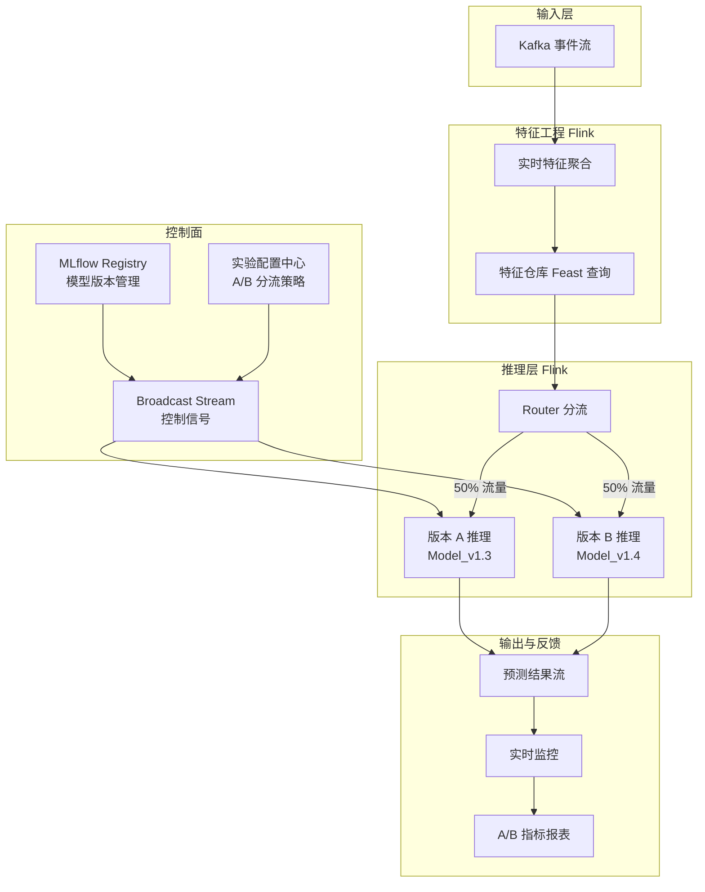
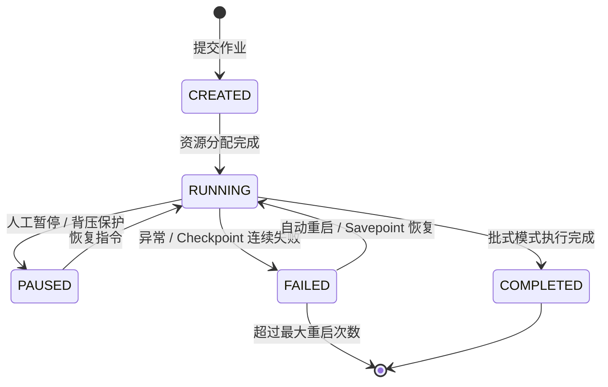
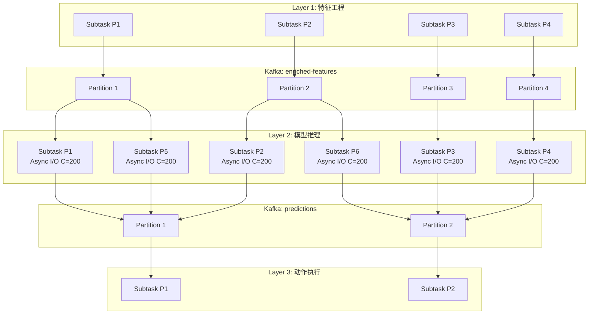

> **状态**: 🔮 前瞻内容 | **风险等级**: 高 | **最后更新**: 2026-04
>
> 此文档描述的内容处于早期规划阶段，可能与最终实现不符。请以 Apache Flink 官方发布为准。

# 流式 ML Pipeline 编排与模型治理

> 所属阶段: Knowledge/06-frontier/realtime-ml-inference | 前置依赖: [Knowledge/06-frontier/realtime-ml-inference/06.04.01-ml-model-serving.md](./06.04.01-ml-model-serving.md), [Knowledge/06-frontier/realtime-ml-inference/06.04.02-feature-store-streaming.md](./06.04.02-feature-store-streaming.md) | 形式化等级: L3

## 1. 概念定义 (Definitions)

### Def-K-06-04-07: 流式 ML Pipeline (Streaming ML Pipeline)

**流式 ML Pipeline** 是指将数据摄取、特征工程、模型推理、结果后处理与反馈收集等环节以流计算方式串联起来的端到端机器学习工作流。其形式化定义为一个有向无环图（DAG）：

$$\mathcal{P}_{stream} = (\mathcal{V}_{ops}, \mathcal{E}_{data}, \mathcal{S}_{state}, \mathcal{C}_{ctrl})$$

其中：

- $\mathcal{V}_{ops} = \{ v_1, v_2, ..., v_n \}$: 算子集合，每个算子对应一个 Flink Operator（Source、Map、Async I/O、Window Aggregate、Sink 等）
- $\mathcal{E}_{data} \subseteq \mathcal{V}_{ops} \times \mathcal{V}_{ops}$: 数据流边，表示算子之间的记录传递关系
- $\mathcal{S}_{state}$: 全局状态空间，包括 Keyed State（每个 key 的局部状态）与 Operator State（每个并行子任务的局部状态）
- $\mathcal{C}_{ctrl}$: 控制流通道，用于传递模型版本、A/B 测试配置、超参数更新等非数据信号

与批式 Pipeline 不同，流式 Pipeline 的执行是**连续且无限**的，因此模型更新、配置变更与故障恢复都必须在不中断数据流的前提下完成。

### Def-K-06-04-08: 模型 A/B 测试 (Model A/B Testing)

**模型 A/B 测试**是在生产环境中同时运行两个或多个模型版本，将流量按特定策略分流到不同版本，以统计学方法比较其在线业务指标（CTR、转化率、延迟、收入）的过程。设用户集合为 $\mathcal{U}$，模型版本集合为 $\mathcal{M} = \{ A, B \}$，则分流函数 $\phi: \mathcal{U} \to \mathcal{M}$ 必须满足：

$$\forall u_i, u_j \in \mathcal{U}: \quad \phi(u_i) = \phi(u_j) \iff h(u_i) = h(u_j)$$

其中 $h(u)$ 为用户分流哈希函数（通常基于用户 ID、设备 ID 或会话 ID）。该条件保证了**用户粘性**（User Stickiness）：同一用户在实验期间始终被分配到同一模型版本，从而避免用户体验的剧烈波动，并确保指标统计的独立性。

### Def-K-06-04-09: 模型版本管理 (Model Version Management)

**模型版本管理**是对模型 Artifact、特征转换代码、推理配置与依赖环境的完整生命周期治理。一个模型版本 $v$ 可形式化为一个四元组：

$$v = (\mathcal{A}_{model}, \mathcal{C}_{feat}, \mathcal{R}_{runtime}, \mathcal{T}_{timestamp})$$

其中：

- $\mathcal{A}_{model}$: 模型权重文件（ONNX、SavedModel、TorchScript、Pickle）
- $\mathcal{C}_{feat}$: 与该模型绑定的特征工程代码版本（Git Commit Hash）
- $\mathcal{R}_{runtime}$: 模型运行时依赖（Python 版本、库版本、CUDA 版本、容器镜像 Digest）
- $\mathcal{T}_{timestamp}$: 版本注册时间戳

模型版本管理的核心目标是确保**可复现性**（Reproducibility）与**可追溯性**（Traceability）：任意历史时刻的推理结果必须能够通过对应该时刻的模型版本完整复现。

## 2. 属性推导 (Properties)

### Lemma-K-06-04-05: A/B 测试样本量的收敛性

设模型 A 与模型 B 的某个业务指标（如转化率）的真实均值分别为 $\mu_A$ 与 $\mu_B$，样本方差为 $\sigma^2$。为以显著性水平 $\alpha$ 和统计功效 $1 - \beta$ 检测到最小差异 $\delta = |\mu_A - \mu_B|$，每个模型版本所需的最小样本量为：

$$n_{min} = \frac{2\sigma^2 \left( z_{1-\alpha/2} + z_{1-\beta} \right)^2}{\delta^2}$$

其中 $z_{1-\alpha/2}$ 与 $z_{1-\beta}$ 为标准正态分布的分位数。例如，当 $\alpha = 0.05$（双侧）、$1 - \beta = 0.8$、$\sigma^2 = 0.25$、$\delta = 0.01$ 时：

$$n_{min} = \frac{2 \times 0.25 \times (1.96 + 0.84)^2}{0.0001} \approx 39,200$$

即每个版本至少需要约 4 万个独立样本才能以 80% 的统计功效检测到 1% 的转化率差异。在流式场景中，这决定了 A/B 测试的最短运行时长。

### Lemma-K-06-04-06: 模型热切换的原子性

在 Flink 中，若通过 Broadcast State 传递模型版本控制信号，则该信号会在下一个 Checkpoint 边界处与数据流状态一起原子性持久化。设 Checkpoint 周期为 $T_{cp}$，则从控制信号注入到所有并行子任务完成版本切换的最大延迟满足：

$$L_{switch} \leq T_{cp} + \max_{i}(L_{inflight}^{(i)})$$

其中 $L_{inflight}^{(i)}$ 为第 $i$ 个并行子任务中正在处理但未完成对齐的记录的剩余处理时间。在典型配置下（$T_{cp} = 30$s，单条记录处理延迟 $< 10$ms），$L_{switch}$ 可控制在 1 分钟以内，实现**近热切换**（Near-Hot-Swap）。

### Prop-K-06-04-03: 多版本推理的期望效用最大化

假设系统同时运行 $k$ 个模型版本 $\{ M_1, M_2, ..., M_k \}$，每个版本的在线效用评估值为 $U_i(t)$（如 AUC、CTR、收入/请求），且该评估值服从带有噪声的高斯过程。则最优流量分配策略为**汤普森采样**（Thompson Sampling）或**上置信界**（UCB）的在线 bandit 策略，其目标为最大化累积期望效用：

$$\pi^* = \arg\max_{\pi} \mathbb{E}\left[ \sum_{t=1}^{T} U_{\pi(t)}(t) \right]$$

在工程实践中，当 $k$ 较小（通常为 2~3）且实验周期明确时，固定比例分流（如 50/50 或 90/10）更为稳健；当 $k$ 较大或需要持续自动优化时，Multi-Armed Bandit 方法可显著提升探索效率。

## 3. 关系建立 (Relations)

### 3.1 流式与批式 Pipeline 编排的对比

| 维度 | 批式 ML Pipeline (Batch) | 流式 ML Pipeline (Streaming) |
|------|-------------------------|-----------------------------|
| 触发机制 | 周期性调度（Airflow Cron / Kubeflow Pipeline） | 事件驱动，持续运行 |
| 状态持久化 | 中间结果写入对象存储 / 数据库 | Flink Checkpoint / State Backend |
| 模型更新 | 作业重启，全量切换 | Broadcast State 热切换 / 蓝绿部署 |
| A/B 测试实现 | 离线回测（Hold-out / Cross-validation） | 在线流量分流与实时指标对比 |
| 容错恢复 | 失败步骤重跑（Retry / Backfill） | Checkpoint 恢复，Exactly-Once 语义 |
| 编排工具 | Airflow、Kubeflow Pipelines、Prefect | Flink JobManager、Ververica Platform、Bytewax |

### 3.2 A/B 测试分流策略对比

| 分流策略 | 实现方式 | 优点 | 缺点 | 适用场景 |
|---------|---------|------|------|---------|
| **用户 ID 哈希** | `hash(user_id) % 100 < 50` | 用户粘性强，跨 session 一致 | 新用户无历史 ID，需回退到设备 ID | 长期用户体验实验 |
| **会话 ID 哈希** | `hash(session_id) % 100` | 实现简单，无需持久化状态 | 同一用户不同 session 可能体验不一致 | 短期效果测试 |
| **分层实验** | 将流量划分为正交层，每层独立实验 | 支持多实验并行，流量复用 | 层间交互效应可能污染结果 | 大规模推荐系统 |
| **动态 Bandit** | 根据实时指标自动调整流量比例 | 最大化累积效用，快速收敛到最优版本 | 实现复杂，需要高置信度的实时指标 | 持续优化与自动迭代 |

### 3.3 模型版本管理策略矩阵

| 管理策略 | 模型存储 | 版本切换方式 | 回滚时间 | 一致性保证 | 运维复杂度 |
|---------|---------|-------------|---------|-----------|-----------|
| **本地文件覆盖** | TaskManager 本地磁盘 | 重启 TM 进程 | 分钟级 | 无，版本切换期间可能混合推理 | 低 |
| **分布式文件系统** | HDFS / S3 / OSS | Flink Savepoint + 重启 | 分钟~小时级 | 强，全作业统一版本 | 中 |
| **Broadcast State** | 嵌入到 Checkpoint 中 | 控制流广播，近实时切换 | 秒~分钟级 | 强，按 key 原子切换 | 中 |
| **Remote Serving** | Triton / TorchServe | 修改服务路由权重 | 秒级 | 依赖外部服务，可能存在缓存延迟 | 高 |
| **GitOps + ArgoCD** | 容器镜像仓库 | Kubernetes 滚动更新 | 分钟级 | 强，Pod 级版本统一 | 高 |

## 4. 论证过程 (Argumentation)

### 4.1 流式 Pipeline 中模型更新的非中断性约束

在流式 ML Pipeline 中，任何模型更新操作都必须满足**非中断性约束**（Non-Disruption Constraint）：

> 在模型切换期间，系统不能丢失事件、不能重复处理事件（超出 Exactly-Once 语义允许范围）、不能导致推理延迟超过 SLA。

这一约束直接排除了"停止作业-替换模型-启动作业"这种最简单的更新方式。可行的工程方案包括：

1. **Savepoint & Restart**：Flink 作业先触发 Savepoint，使用新模型版本重新提交作业并从 Savepoint 恢复。优点：实现简单，一致性强；缺点：存在分钟级服务中断，不适合高可用场景。

2. **Blue-Green Deployment**：部署两套完全独立的 Flink 作业集群，通过外部负载均衡器（Kafka Consumer Group 重新分配、或消息队列双写）逐步将流量从旧版本切换到新版本。优点：零中断，回滚迅速；缺点：资源翻倍，状态空间不共享。

3. **Broadcast State 热切换**：在单个 Flink 作业内部通过 Broadcast Stream 注入新模型版本，利用 Keyed State 的原子性在运行时完成切换。优点：资源效率高，切换延迟低；缺点：模型大小受限于 State Backend 容量，大模型不适用。

4. **Hybrid Routing**：轻量模型通过 Broadcast State 热切换，复杂模型通过 Remote Serving 独立更新，Flink 仅切换路由策略。这是当前工业界最主流的实践方案。

### 4.2 A/B 测试中的选择偏误与辛普森悖论

在流式 A/B 测试中，由于用户行为随时间演化（日内波动、周末效应、促销活动），直接使用整体均值对比可能陷入**辛普森悖论**（Simpson's Paradox）：分组后的趋势与总体趋势相反。为避免这一问题，工程实践要求：

- **分层抽样**（Stratified Sampling）：确保实验组与对照组在关键协变量（设备类型、地理位置、用户活跃度分位）上的分布一致。
- **同期对照**（Concurrent Control）：实验组与对照组必须同时运行，避免时间序列上的趋势混淆。
- **CUPED 方差缩减**：利用实验前的用户历史指标作为协变量，通过 Controlled-experiment Using Pre-Experiment Data（CUPED）方法降低指标方差，从而以相同样本量获得更高的统计功效。

## 5. 形式证明 / 工程论证 (Proof / Engineering Argument)

### 工程定理：Broadcast State 热切换的正确性

**定理陈述**：在 Flink 流式 ML Pipeline 中，若模型版本控制信号通过 Broadcast Stream 下发，且推理算子使用 Keyed State 存储每个 key 对应的模型版本与中间状态，则在任何 Checkpoint 恢复后，系统对所有事件的推理结果与未发生故障时的结果一致。

**证明概要**：

1. **Broadcast State 的全局一致性**：根据 Flink 的流处理语义，Broadcast Stream 中的每个元素都会被发送到所有并行子任务，并在各自的 Operator State 中保持完全相同的副本。因此，模型版本信号在所有并行实例之间是全局一致的。

2. **Keyed State 的局部隔离性**：对于数据流中的每个记录，其 Keyed State 的读取与写入仅发生在对应 key 的 state 分区上。不同 key 之间的状态互不干扰。因此，当某个 key 的模型版本从 $v_{old}$ 切换到 $v_{new}$ 时，不会影响其他 key 的推理行为。

3. **Checkpoint 的原子性**：Flink 的 Checkpoint 机制保证了在恢复时，所有 Operator 的状态（包括 Broadcast State 与 Keyed State）都被还原到同一全局一致性点。这意味着：若故障发生在模型切换过程中，恢复后系统要么看到完整的旧版本状态，要么看到完整的新版本状态，而不会出现"部分实例已切换、部分实例未切换"的分裂脑状态。

4. **Exactly-Once 语义**：结合 Checkpoint 屏障（Barrier）对齐机制，每条记录在推理算子中的处理语义满足 Exactly-Once。因此，模型切换期间的处理结果既不会丢失也不会重复。

综上，Broadcast State 热切换在 Flink 的容错模型下是正确且安全的。

## 6. 实例验证 (Examples)

### 6.1 Flink Broadcast State 模型热切换示例

以下 Java 代码展示了如何在 Flink 中使用 Broadcast State 实现模型版本的动态热切换：

```java
public class ModelInferenceWithHotSwap
    extends KeyedCoProcessFunction<String, Event, ModelUpdate, Prediction> {

    // Keyed State: 每个 user_id 的上下文状态
    private ValueState<UserContext> userContextState;

    // Broadcast State: 全局共享的模型版本映射
    private MapStateDescriptor<String, ModelArtifact> modelStateDescriptor;

    @Override
    public void open(Configuration parameters) {
        userContextState = getRuntimeContext().getState(
            new ValueStateDescriptor<>("userContext", UserContext.class));
        modelStateDescriptor = new MapStateDescriptor<>(
            "modelVersions", Types.STRING, Types.POJO(ModelArtifact.class));
    }

    @Override
    public void processElement1(
            Event event,
            Context ctx,
            Collector<Prediction> out) throws Exception {

        // 从 Broadcast State 读取当前生效的模型版本
        ModelArtifact currentModel = ctx.getBroadcastState(modelStateDescriptor)
            .get("active_model");

        UserContext context = userContextState.value();
        if (context == null) {
            context = new UserContext();
        }

        // 执行推理
        Prediction pred = currentModel.predict(event, context);

        // 更新用户上下文
        context.updateWith(event);
        userContextState.update(context);

        // 附加模型版本标签,便于后续 A/B 测试分析
        pred.setModelVersion(currentModel.getVersion());
        out.collect(pred);
    }

    @Override
    public void processElement2(
            ModelUpdate update,
            Context ctx,
            Collector<Prediction> out) throws Exception {

        // 接收广播的模型更新信号,写入 Broadcast State
        ctx.getBroadcastState(modelStateDescriptor)
            .put(update.getModelName(), update.getModelArtifact());

        LOG.info("Model updated: {} -> {}",
            update.getModelName(), update.getModelArtifact().getVersion());
    }
}
```

在该实现中，`processElement2` 处理来自广播流的模型更新信号，将其写入全局 Broadcast State；`processElement1` 处理普通数据事件，从 Broadcast State 中读取当前生效的模型并执行推理。由于 Broadcast State 的更新会在下一个 Checkpoint 边界处持久化，因此模型切换具备故障恢复能力。

### 6.2 MLflow + Flink 模型注册与版本追踪示例

以下 Python 代码展示了如何使用 MLflow 注册模型版本，并在 Flink 作业启动时动态拉取指定版本的模型 Artifact：

```python
import mlflow
from mlflow.tracking import MlflowClient

# 连接到 MLflow Tracking Server mlflow.set_tracking_uri("http://mlflow-server:5000")
client = MlflowClient()

# 获取指定模型在 "Production" 阶段的最新版本 model_name = "click_through_rate_v1"
versions = client.get_latest_versions(model_name, stages=["Production"])
latest_version = versions[0]

print(f"Loading model: {model_name}, version: {latest_version.version}")
print(f"Source path: {latest_version.source}")

# 下载模型 Artifact 到本地(Flink TaskManager 启动时执行)
local_path = client.download_artifacts(
    latest_version.run_id,
    "model"
)

# 使用 ONNX Runtime 加载模型 import onnxruntime as ort
session = ort.InferenceSession(f"{local_path}/model.onnx")

# 将模型版本信息写入 Flink 作业的启动参数
# 以便在推理输出中标记模型版本,支持 A/B 测试归因 flink_conf = {
    "model.name": model_name,
    "model.version": latest_version.version,
    "model.source": latest_version.source,
    "model.run_id": latest_version.run_id
}
```

在生产环境中，上述模型拉取逻辑通常封装在 Flink 作业的 `open()` 生命周期方法中，或作为 Kubernetes Init Container 在 Pod 启动时执行。MLflow 的模型注册中心（Model Registry）提供了 `Staging`、`Production`、`Archived` 等生命周期阶段，配合 Flink 的部署流水线可实现自动化的模型晋级与回滚。

## 7. 可视化 (Visualizations)

### 流式 ML Pipeline 编排架构

以下 Mermaid 图展示了包含 A/B 测试、模型版本管理与特征仓库的完整流式 ML Pipeline 架构：



在该架构中，MLflow Registry 与实验配置中心共同构成控制面，通过 Flink Broadcast Stream 向推理层下发模型版本与分流策略。推理层的路由器根据用户 ID 哈希决定事件进入版本 A 还是版本 B，输出预测结果的同时附带模型版本标签，供实时监控与 A/B 报表系统进行归因分析。

## 8. 引用参考 (References)


## 4. 论证过程 (Argumentation)

### 4.1 阶段解耦的延迟代价分析

将流式 ML Pipeline 拆分为多个 Flink 作业虽然提升了可用性和独立扩展性，但引入了额外的中间持久化开销。设作业间通过 Kafka 连接，则每条记录需要经历：

1. **生产者序列化**: Flink Sink 将记录序列化为 Kafka 消息格式（如 Avro、Protobuf）
2. **网络传输**: 消息从 Flink TM 发送到 Kafka Broker
3. **Broker 持久化**: Kafka 将消息写入页缓存并异步刷盘
4. **消费者拉取**: 下游 Flink Source 从 Kafka 拉取消息
5. **反序列化**: 下游作业解析消息并恢复为内部数据结构

上述五步的额外延迟通常为 5-20ms（同机房 Kafka），在大多数业务场景下可接受。但对于延迟敏感场景（如实时竞价广告、高频交易），可能需要将关键路径保持在单一 Flink 作业内。

### 4.2 状态共享与状态隔离的权衡

在多阶段 Pipeline 中，状态管理有两种策略：

- **状态隔离**: 每个阶段维护自己的 Keyed State，不共享。优点：故障影响范围小，升级灵活；缺点：相同 key 的状态可能在多个阶段重复存储（如用户画像在特征工程阶段和推理阶段各存一份）。
- **状态共享**: 多个阶段通过外部状态存储（如 Redis、RocksDB）共享状态。优点：避免冗余；缺点：引入外部依赖，增加网络延迟和一致性复杂度。

对于大多数生产系统，推荐采用**混合策略**：高频访问的本地状态在各阶段隔离存储，全局共享的实体画像通过外部特征仓库访问。

## 5. 形式证明 / 工程论证 (Proof / Engineering Argument)

### 5.1 Checkpoint 协调多阶段 Pipeline 的一致性边界

**命题 (Prop-K-06-04-06)**: 若流式 ML Pipeline 由 $n$ 个通过 Kafka 连接的独立 Flink 作业组成，且每个作业都启用 Checkpoint（间隔 $\Delta t$），则整个 Pipeline 满足 At-Least-Once 语义，但不天然满足端到端 Exactly-Once 语义。

**工程论证**:
单个 Flink 作业内部通过两阶段提交（Two-Phase Commit）协议可以保证 Exactly-Once 语义，因为 Source、Operator 和 Sink 在同一个 JM 协调下参与统一的 Checkpoint。

然而，当 Pipeline 拆分为多个作业时，各作业的 Checkpoint 是独立触发的。假设作业 $J_i$ 的 Sink 将数据写入 Kafka，作业 $J_{i+1}$ 的 Source 从同一 Kafka Topic 读取。虽然 Kafka 事务和 Flink 的 Two-Phase Commit Kafka Producer 可以保证 $J_i$ 的输出不重复不丢失，但 $J_i$ 和 $J_{i+1}$ 的 Checkpoint 时间点并不同步。

考虑以下场景：

- $J_i$ 在 $t_1$ 完成 Checkpoint，继续处理数据
- $J_{i+1}$ 在 $t_2$ 完成 Checkpoint，其中 $t_1 < t_2$
- 若系统在 $t_2$ 后崩溃，$J_i$ 恢复到 $t_1$ 状态并重放 $[t_1, t_{crash}]$ 的数据，而 $J_{i+1}$ 恢复到 $t_2$ 状态
- 此时 $J_{i+1}$ 不会重新处理 $[t_1, t_2]$ 期间的数据（因为它的 Checkpoint 更晚），但也不会丢失数据

因此，端到端语义等价于 At-Least-Once（无数据丢失，但可能存在语义上的重复处理窗口不一致）。若要实现跨作业端到端 Exactly-Once，需要引入全局事务协调器（如 Flink 的 Application Mode 或外部 Saga 编排器）。$\square$

### 5.2 反馈闭环延迟对模型效果的衰减影响

**引理 (Lemma-K-06-04-08)**: 设反馈延迟为 $D$（从动作执行到反馈信号可用的时间），业务场景的数据分布漂移速度为 $\sigma$（单位时间内分布变化量），则反馈信号的效用随延迟指数衰减：

$$U(D) = U_0 \cdot e^{-\sigma D}$$

**证明**:
在时间 $t$ 执行的动作用于业务环境 $E_t$。由于分布漂移，$t+D$ 时刻的环境变为 $E_{t+D} = E_t + \sigma D + \epsilon$。反馈信号 $r_{t+D}$ 反映的是 $E_{t+D}$ 下的结果，而非 $E_t$ 下的结果。

反馈与当前环境的相关性可建模为：

$$\text{Corr}(r_{t+D}, E_t) = \text{Corr}(r_t, E_t) \cdot e^{-\sigma D}$$

由于模型更新的效用正比于反馈信号与当前环境的相关性，因此 $U(D) \propto e^{-\sigma D}$。$\square$

**工程启示**: 对于高漂移场景（如推荐系统、广告竞价），反馈延迟应控制在分钟级甚至秒级；对于低漂移场景（如设备寿命预测），小时级延迟也可接受。

## 6. 实例验证 (Examples)

### 6.1 三层 Flink 作业 DAG 定义示例

以下 YAML 配置展示了使用 Apache Flink Kubernetes Operator 定义三层流式 ML Pipeline 的部署规范：

```yaml
apiVersion: flink.apache.org/v1beta1
kind: FlinkDeployment
metadata:
  name: realtime-ml-pipeline
spec:
  image: analysisdataflow/realtime-ml:v1.2.0
  flinkVersion: v1.18
  jobManager:
    resource:
      memory: 4Gi
      cpu: 2
  taskManager:
    resource:
      memory: 8Gi
      cpu: 4
  job:
    jarURI: local:///opt/flink/usrlib/realtime-ml-pipeline.jar
    parallelism: 6
    upgradeMode: savepoint
    state: running
    args:
      - --pipeline.mode=LAYERED
      - --feature.sink.topic=enriched-features
      - --inference.source.topic=enriched-features
      - --inference.sink.topic=predictions
      - --action.source.topic=predictions
---
# Layer 1: Feature Engineering Job apiVersion: flink.apache.org/v1beta1
kind: FlinkSessionJob
metadata:
  name: feature-engineering-job
spec:
  deploymentName: realtime-ml-pipeline
  job:
    jarURI: local:///opt/flink/usrlib/feature-engineering.jar
    parallelism: 8
    entryClass: com.adf.pipeline.FeatureEngineeringJob
---
# Layer 2: Inference Job apiVersion: flink.apache.org/v1beta1
kind: FlinkSessionJob
metadata:
  name: inference-job
spec:
  deploymentName: realtime-ml-pipeline
  job:
    jarURI: local:///opt/flink/usrlib/inference-job.jar
    parallelism: 12
    entryClass: com.adf.pipeline.InferenceJob
---
# Layer 3: Action Execution Job apiVersion: flink.apache.org/v1beta1
kind: FlinkSessionJob
metadata:
  name: action-job
spec:
  deploymentName: realtime-ml-pipeline
  job:
    jarURI: local:///opt/flink/usrlib/action-job.jar
    parallelism: 4
    entryClass: com.adf.pipeline.ActionExecutionJob
```

### 6.2 动态路由与 A/B 测试的 Flink 代码示例

以下代码展示了如何在推理层实现模型版本的动态路由和 A/B 测试：

```java
import org.apache.flink.api.common.state.MapState;
import org.apache.flink.api.common.state.MapStateDescriptor;
import org.apache.flink.configuration.Configuration;
import org.apache.flink.streaming.api.functions.KeyedProcessFunction;
import org.apache.flink.util.Collector;

public class ABTestInferenceFunction extends KeyedProcessFunction<String, EnrichedEvent, Prediction> {
    private transient MapState<String, ModelExecutor> modelExecutors;
    private transient MapState<String, Double> trafficSplit;

    @Override
    public void open(Configuration parameters) {
        modelExecutors = getRuntimeContext().getMapState(
            new MapStateDescriptor<>("models", Types.STRING, Types.GENERIC(ModelExecutor.class))
        );
        trafficSplit = getRuntimeContext().getMapState(
            new MapStateDescriptor<>("traffic-split", Types.STRING, Types.DOUBLE)
        );

        // Initialize models
        modelExecutors.put("model-v1", new ModelExecutor("/models/v1.onnx"));
        modelExecutors.put("model-v2", new ModelExecutor("/models/v2.onnx"));

        // 50-50 A/B test split
        trafficSplit.put("model-v1", 0.5);
        trafficSplit.put("model-v2", 0.5);
    }

    @Override
    public void processElement(EnrichedEvent event, Context ctx, Collector<Prediction> out) throws Exception {
        String modelVersion = routeByUserId(event.getUserId());
        ModelExecutor executor = modelExecutors.get(modelVersion);
        float score = executor.predict(event);

        out.collect(new Prediction(
            event.getId(),
            score,
            modelVersion,
            ctx.timestamp()
        ));
    }

    private String routeByUserId(String userId) {
        int hash = Math.abs(userId.hashCode()) % 100;
        double cumulative = 0.0;
        for (Map.Entry<String, Double> entry : trafficSplit.entries()) {
            cumulative += entry.getValue() * 100;
            if (hash < cumulative) {
                return entry.getKey();
            }
        }
        return "model-v1";
    }
}
```

### 6.3 反馈闭环 Kafka Connect 配置示例

以下配置展示了如何将业务系统的预测结果反馈通过 Kafka Connect 回收到训练数据湖：

```json
{
  "name": "prediction-feedback-sink",
  "config": {
    "connector.class": "io.confluent.connect.hdfs.HdfsSinkConnector",
    "tasks.max": "4",
    "topics": "prediction-feedback",
    "hdfs.url": "hdfs://namenode:9000",
    "flush.size": "10000",
    "rotate.interval.ms": "60000",
    "format.class": "io.confluent.connect.hdfs.parquet.ParquetFormat",
    "partitioner.class": "io.confluent.connect.storage.partitioner.TimeBasedPartitioner",
    "path.format": "'year'=YYYY/'month'=MM/'day'=dd",
    "locale": "en-US",
    "timezone": "UTC",
    "schema.compatibility": "BACKWARD"
  }
}
```

## 7. 可视化 (Visualizations)

### 7.1 Pipeline 编排状态机

以下状态图展示了流式 ML Pipeline 单个阶段的生命周期状态机：



该状态机体现了流式 ML Pipeline 编排器需要处理的核心运维场景：正常启动运行、人工干预暂停、故障自动恢复以及生命周期终止。

## 8. 引用参考 (References)


### 6.4 金丝雀发布与流量切换配置示例

在流式 ML Pipeline 中，模型更新通常需要通过金丝雀发布逐步验证。以下 Flink 配置展示了基于流量百分比的模型灰度切换：

```java
public class CanaryModelRouter extends BroadcastProcessFunction<EnrichedEvent, ModelRouteUpdate, Prediction> {
    private transient MapStateDescriptor<String, Double> routeDescriptor;

    @Override
    public void open(Configuration parameters) {
        routeDescriptor = new MapStateDescriptor<>(
            "canary-routes", Types.STRING, Types.DOUBLE
        );
    }

    @Override
    public void processElement(EnrichedEvent event, ReadOnlyContext ctx, Collector<Prediction> out) {
        ReadOnlyBroadcastState<String, Double> routes = ctx.getBroadcastState(routeDescriptor);

        double v1Traffic = routes.getOrDefault("model-v1", 0.9);
        double v2Traffic = routes.getOrDefault("model-v2", 0.1);

        int bucket = Math.abs(event.getUserId().hashCode()) % 1000;
        String selectedModel;
        if (bucket < v1Traffic * 1000) {
            selectedModel = "model-v1";
        } else if (bucket < (v1Traffic + v2Traffic) * 1000) {
            selectedModel = "model-v2";
        } else {
            selectedModel = "model-v1"; // fallback
        }

        ModelExecutor executor = getExecutor(selectedModel);
        float score = executor.predict(event);
        out.collect(new Prediction(event.getId(), score, selectedModel, ctx.timestamp()));
    }

    @Override
    public void processBroadcastElement(ModelRouteUpdate update, Context ctx, Collector<Prediction> out) {
        ctx.getBroadcastState(routeDescriptor).put(update.getModelId(), update.getTrafficPercent());
    }
}
```

### 6.5 端到端延迟监控与告警的 Prometheus 规则示例

以下 Prometheus 告警规则监控流式 ML Pipeline 各阶段的延迟：

```yaml
groups:
  - name: streaming-ml-pipeline-alerts
    rules:
      - alert: FeatureEngineeringLatencyHigh
        expr: |
          flink_taskmanager_job_task_operator_latency_histogram_p99{
            job_name="feature-engineering-job"
          } > 500
        for: 5m
        labels:
          severity: warning
        annotations:
          summary: "Feature engineering p99 latency exceeds 500ms"

      - alert: InferenceLatencyHigh
        expr: |
          flink_taskmanager_job_task_operator_latency_histogram_p99{
            job_name="inference-job"
          } > 100
        for: 3m
        labels:
          severity: critical
        annotations:
          summary: "Model inference p99 latency exceeds 100ms"

      - alert: ActionExecutionBackpressure
        expr: |
          flink_taskmanager_job_task_backPressuredTimeMsPerSecond{
            job_name="action-job"
          } > 200
        for: 5m
        labels:
          severity: warning
        annotations:
          summary: "Action execution job is under backpressure"
```

### 6.6 模型效果在线评估的 Flink SQL 示例

以下 Flink SQL 实时计算 A/B 测试中两个模型版本的 CTR（点击率），用于在线效果评估：

```sql
-- 预测结果流
CREATE TABLE predictions (
    request_id STRING,
    user_id STRING,
    model_version STRING,
    predicted_score DOUBLE,
    prediction_time TIMESTAMP(3),
    WATERMARK FOR prediction_time AS prediction_time - INTERVAL '5' SECOND
) WITH (
    'connector' = 'kafka',
    'topic' = 'predictions',
    'format' = 'json'
);

-- 用户反馈流(点击/曝光)
CREATE TABLE feedback (
    request_id STRING,
    event_type STRING,  -- 'impression' or 'click'
    feedback_time TIMESTAMP(3),
    WATERMARK FOR feedback_time AS feedback_time - INTERVAL '5' SECOND
) WITH (
    'connector' = 'kafka',
    'topic' = 'feedback',
    'format' = 'json'
);

-- 实时 CTR 计算
CREATE VIEW model_ctr AS
SELECT
    p.model_version,
    TUMBLE_START(p.prediction_time, INTERVAL '10' MINUTE) AS window_start,
    COUNT(DISTINCT CASE WHEN f.event_type = 'impression' THEN p.request_id END) * 1.0
        / COUNT(DISTINCT p.request_id) AS ctr
FROM predictions AS p
LEFT JOIN feedback AS f
ON p.request_id = f.request_id
GROUP BY
    p.model_version,
    TUMBLE(p.prediction_time, INTERVAL '10' MINUTE);

-- 输出到监控 Kafka Topic
INSERT INTO model_ctr_metrics
SELECT * FROM model_ctr;
```

## 7. 可视化 (Visualizations)

### 7.2 流式 ML Pipeline 资源分配与扩展模式



该图展示了三层 Pipeline 的典型扩展模式：特征工程层根据数据分区数扩展（如 4 并行度），推理层由于 Async I/O 的高并发能力可以扩展得更大（如 6 并行度），而动作执行层由于下游系统写入限制通常保持较小并行度（如 2）。Kafka 作为解耦层，其分区数需要根据上下游的吞吐比例进行合理规划。

## 8. 引用参考 (References)
