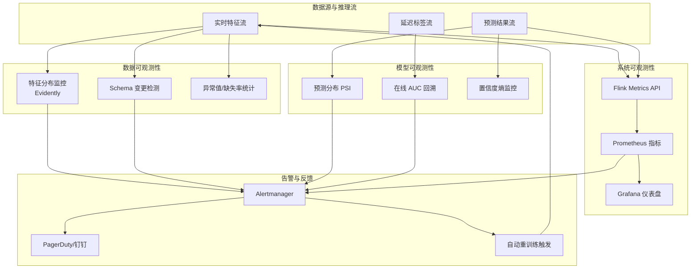

> **状态**: 🔮 前瞻内容 | **风险等级**: 高 | **最后更新**: 2026-04
>
> 此文档描述的内容处于早期规划阶段，可能与最终实现不符。请以 Apache Flink 官方发布为准。

# 实时 ML 可观测性与漂移检测

> 所属阶段: Knowledge/06-frontier/realtime-ml-inference | 前置依赖: [Knowledge/06-frontier/realtime-ml-inference/06.04.01-ml-model-serving.md](./06.04.01-ml-model-serving.md), [Knowledge/06-frontier/realtime-ml-inference/06.04.03-ml-pipeline-orchestration.md](./06.04.03-ml-pipeline-orchestration.md) | 形式化等级: L3

## 1. 概念定义 (Definitions)

### Def-K-06-04-10: 实时模型可观测性 (Real-time ML Observability)

**实时模型可观测性**是指对流式机器学习系统在生产环境中的行为进行持续监测、度量和诊断的能力集合，涵盖数据质量、模型性能、系统延迟与业务指标四个维度。其形式化定义为一个四元组：

$$\mathcal{O}_{ml} = (\mathcal{D}_{data}, \mathcal{P}_{perf}, \mathcal{S}_{sys}, \mathcal{B}_{biz})$$

其中：

- $\mathcal{D}_{data}$: 数据可观测性，包括输入分布、特征缺失率、异常值比例、模式漂移（Schema Drift）
- $\mathcal{P}_{perf}$: 模型性能可观测性，包括预测分布、置信度熵、校准误差、在线 AUC / LogLoss（在有延迟标签的场景下通过回溯计算）
- $\mathcal{S}_{sys}$: 系统可观测性，包括端到端延迟 p50/p99、吞吐量 QPS、资源利用率（CPU / GPU / 内存）、Flink Checkpoint 成功率与对齐时间
- $\mathcal{B}_{biz}$: 业务可观测性，包括 CTR、转化率、客单价、用户留存等受模型直接影响的业务 KPI

### Def-K-06-04-11: 数据漂移 (Data Drift)

**数据漂移**是指模型服务时接收到的输入数据分布 $P_{t}(X)$ 与训练时的数据分布 $P_{train}(X)$ 之间发生统计偏离的现象。设时间 $t$ 的输入特征分布为 $P_t(X)$，则数据漂移量可量化为：

$$\Delta_{data}(t) = D\left( P_t(X) \,\|\, P_{train}(X) \right)$$

其中 $D(\cdot \| \cdot)$ 为某种分布距离度量，如 Kullback-Leibler 散度、Jensen-Shannon 散度、Wasserstein 距离或最大均值差异（MMD）。当 $\Delta_{data}(t) > \theta_{drift}$（漂移阈值）时，系统应触发告警并启动根因分析。

数据漂移可进一步细分为：

- **协变量漂移**（Covariate Drift）：$P(X)$ 改变而 $P(Y|X)$ 不变
- **特征漂移**（Feature Drift）：单个特征的统计性质改变
- **标签漂移**（Label Drift）：$P(Y)$ 改变

### Def-K-06-04-12: 概念漂移 (Concept Drift)

**概念漂移**是指特征与标签之间的条件概率分布 $P(Y|X)$ 随时间发生变化，即模型所学习到的输入-输出映射关系本身发生了演化。设训练时的条件分布为 $P_{train}(Y|X)$，时间 $t$ 时的条件分布为 $P_t(Y|X)$，则概念漂移量为：

$$\Delta_{concept}(t) = D\left( P_t(Y|X) \,\|\, P_{train}(Y|X) \right)$$

概念漂移是比数据漂移更根本的问题：即使输入特征分布保持不变，$P(Y|X)$ 的变化也会导致模型预测的系统性错误。典型的概念漂移场景包括用户偏好季节性变化、竞品策略调整、宏观经济波动、以及推荐系统中"兴趣演化"现象。

## 2. 属性推导 (Properties)

### Lemma-K-06-04-07: 漂移检测的延迟-准确率权衡

设漂移检测算法以大小为 $W$ 的滑动窗口处理流式数据，窗口内样本数为 $n$。根据中心极限定理，窗口内样本均值的方差为 $\sigma^2 / n$。为以置信水平 $1 - \alpha$ 拒绝"无漂移"的原假设 $H_0$，检测阈值需满足：

$$\theta_{detect} = z_{1-\alpha/2} \cdot \frac{\sigma}{\sqrt{n}} = z_{1-\alpha/2} \cdot \frac{\sigma}{\sqrt{\lambda \cdot W}}$$

其中 $\lambda$ 为事件到达率。由此可知：

1. **窗口越大**（$W$ 增加），$\theta_{detect}$ 越小，检测灵敏度越高，但检测延迟 $L_{detect}$ 与 $W$ 成正比。
2. **窗口越小**，检测延迟越低，但统计波动增大，误报率上升。

因此，漂移检测存在一个不可调和的 **延迟-准确率权衡**（Latency-Accuracy Tradeoff）。工程实践中常采用分层窗口策略：小窗口（1~5 分钟）用于快速告警，大窗口（1~24 小时）用于高置信度的根因确认。

### Lemma-K-06-04-08: 告警阈值与误报率关系

设漂移检测指标服从标准正态分布 $N(0, 1)$ 下的原假设，告警阈值为 $\theta$，则单日误报期望次数为：

$$E[FP] = 24 \times 60 \times f \times P(Z > \theta) = 1440 f \cdot \left( 1 - \Phi(\theta) \right)$$

其中 $f$ 为检测频率（次/分钟），$\Phi$ 为标准正态累积分布函数。若 $\theta = 3$（3-sigma 规则），$f = 1$，则 $E[FP] \approx 1440 \times 0.00135 \approx 1.94$。即即使系统完全正常，平均每天也会收到约 2 次误报警。为降低误报，可采用**多窗口连续触发策略**：要求连续 $k$ 个窗口均超出阈值才产生告警。

### Prop-K-06-04-04: 反馈闭环的收敛条件

设模型在检测到漂移后启动重训练，新模型 $M_{new}$ 的泛化误差为 $\epsilon_{new}$，旧模型 $M_{old}$ 在漂移后的误差为 $\epsilon_{old}(t)$，且 $\epsilon_{old}(t)$ 随时间线性增长：$\epsilon_{old}(t) = \epsilon_0 + \gamma t$。重训练周期为 $T_{retrain}$，则长期平均误差满足：

$$\bar{\epsilon} = \frac{1}{T_{retrain}} \int_{0}^{T_{retrain}} \epsilon_{old}(t) \, dt = \epsilon_0 + \frac{\gamma T_{retrain}}{2}$$

只要重训练后的模型满足 $\epsilon_{new} < \epsilon_{old}(T_{retrain})$，反馈闭环就能持续降低系统误差。最优重训练频率的权衡在于：重训练过频导致计算成本过高，重训练过稀导致平均误差累积。

## 3. 关系建立 (Relations)

### 3.1 数据漂移、概念漂移与特征漂移的对比

| 漂移类型 | 定义 | 检测对象 | 对模型的影响 | 典型根因 | 检测难度 |
|---------|------|---------|------------|---------|---------|
| **数据漂移 (Data Drift)** | $P(X)$ 改变 | 输入特征分布 | 中等，模型可能在新的输入区域表现不佳 | 上游系统变更、采样策略变化、季节性波动 | 低 |
| **概念漂移 (Concept Drift)** | $P(Y\|X)$ 改变 | 输入-输出映射关系 | 严重，模型学到的规律已过时 | 用户偏好演化、市场竞争、政策法规变化 | 高（需标签） |
| **特征漂移 (Feature Drift)** | 单个特征的统计量改变 | 特征级分布 | 取决于该特征的重要性 | 传感器老化、特征工程代码变更、数据清洗逻辑更新 | 低 |

上表说明，概念漂移是最危险但最难检测的漂移类型，因为它通常需要延迟到达的真实标签才能确认。而在高延迟标签场景（如信贷违约预测、长期用户留存预测）中，数据漂移检测成为提前预警的主要手段。

### 3.2 实时监控指标矩阵

| 监控层级 | 核心指标 | 采集频率 | 异常模式 | 告警策略 |
|---------|---------|---------|---------|---------|
| **数据层** | 特征缺失率、异常值比例、特征均值/方差、Schema 变更 | 每 1~5 分钟 | 缺失率突增、均值偏移超过 3-sigma | 实时 PagerDuty / 钉钉 |
| **模型层** | 预测分布、置信度熵、KS-Test PSI、在线 AUC（延迟计算） | 每 5~15 分钟 | PSI > 0.25（显著漂移）、AUC 下降 > 5% | 邮件 + IM 通知 |
| **系统层** | p50/p99 延迟、吞吐量、CPU/GPU 利用率、Checkpoint 时长 | 每 1 分钟 | p99 延迟 > SLA、Checkpoint 超时 | 自动扩缩容 / 紧急告警 |
| **业务层** | CTR、转化率、GMV、用户留存 | 每 1 小时 | CTR 连续 3 小时下降 > 10% | 业务值班群 + 根因会议 |

### 3.3 漂移检测算法对比

| 算法 | 适用场景 | 优点 | 缺点 | 计算复杂度 |
|------|---------|------|------|-----------|
| **KS-Test** | 单变量连续特征 | 非参数，无需分布假设 | 仅适用于单变量，对尾部不敏感 | $O(n \log n)$ |
| **Population Stability Index (PSI)** | 评分卡、风控模型 | 金融行业标准，解释性强 | 对分组方式敏感，非严格统计检验 | $O(n)$ |
| **Wasserstein Distance** | 多模态分布、生成模型 | 考虑分布几何结构，对平移敏感 | 多维推广计算成本高 | $O(n^3)$（一维） |
| **Maximum Mean Discrepancy (MMD)** | 高维特征、核方法 | 可检测复杂高维漂移 | 核函数选择敏感，需要足够样本 | $O(n^2)$ |
| **Page-Hinkley Test** | 在线流式检测 | 增量计算，内存占用低 | 对超参数敏感，误报率较高 | $O(1)$ 每样本 |
| **KL Divergence** | 概率分布对比 | 信息论解释清晰 | 对零概率事件敏感，需平滑处理 | $O(k)$（离散分布） |

## 4. 论证过程 (Argumentation)

### 4.1 为什么模型性能退化不总是能被立即察觉

在实时流式推理场景中，模型输出的预测值通常不会立即得到真实标签的验证。例如：

- 推荐系统的点击率标签需要用户实际点击后才能产生，延迟为秒级到分钟级。
- 金融反欺诈模型的欺诈确认需要数小时到数天的案件调查。
- 信贷违约预测的最终标签需要数月甚至数年才能观察到。

这种**标签延迟**（Label Delay）导致了模型性能监控的"盲区"：在漂移发生到标签确认之间，系统可能已经基于退化模型做出了数百万次错误决策。因此，**无监督的输入漂移检测**成为填补盲区的重要手段。通过持续监控输入特征的分布变化，可以在性能指标下降之前提前数小时甚至数天发出预警。

### 4.2 漂移检测中的多重比较问题

当特征维度 $d$ 较大时（如推荐系统中有数百个特征），对每个特征独立运行漂移检测会引入**多重比较问题**（Multiple Comparison Problem）。在原假设下，若每个特征的误报率为 $\alpha$，则至少有一个特征误报的概率为：

$$P(\text{至少一次误报}) = 1 - (1 - \alpha)^d \approx d\alpha \quad (\text{当 } \alpha \ll 1 \text{ 时})$$

当 $d = 100$、$\alpha = 0.05$ 时，整体误报率高达 $99.4\%$。为控制族错误率（Family-Wise Error Rate），应采用 Bonferroni 校正：将每个特征的显著性水平调整为 $\alpha' = \alpha / d$。或者，更现代的做法是使用**主成分分析**（PCA）或**自编码器**（Autoencoder）将高维特征投影到低维隐空间，在低维空间上执行统一的漂移检测。

## 5. 形式证明 / 工程论证 (Proof / Engineering Argument)

### 工程定理：分层窗口漂移检测的误报控制

**定理陈述**：设系统采用两层窗口漂移检测策略——快速检测层使用窗口 $W_1$ 与阈值 $\theta_1$，确认检测层使用窗口 $W_2 > W_1$ 与阈值 $\theta_2 > \theta_1$。只有当两层同时触发时才产生正式告警。则在原假设成立（无漂移）的情况下，整体误报率满足：

$$\alpha_{overall} \leq \alpha_1 \cdot \alpha_2$$

其中 $\alpha_1 = P(\text{触发 } W_1 \mid H_0)$，$\alpha_2 = P(\text{触发 } W_2 \mid H_0)$。

**工程论证**：

1. 快速检测层 $W_1$ 的误报事件构成一个概率为 $\alpha_1$ 的伯努利试验序列。由于 $W_2$ 窗口包含多个 $W_1$ 窗口，当 $W_1$ 触发时，系统进入"预告警"状态，要求在随后的 $W_2$ 窗口内 $W_2$ 也触发。

2. 由于 $W_1$ 与 $W_2$ 的统计量均基于独立同分布的样本（在原假设下），两层触发事件近似独立。因此联合误报概率为两者乘积。

3. 若取 $\alpha_1 = 0.05$、$\alpha_2 = 0.01$，则 $\alpha_{overall} \leq 0.0005$，即平均每天（假设每小时检测一次）的误报期望仅为 $0.012$ 次，显著优于单层检测。

4. 该策略的检测延迟为 $W_2$，但能通过 $W_1$ 实现早期预警，在延迟与误报率之间取得了工程上可接受的平衡。

## 6. 实例验证 (Examples)

### 6.1 Flink + Evidently 实时漂移检测示例

Evidently 是一个开源的 ML 模型与数据漂移检测库。以下代码展示了如何在 Flink 作业的侧输出流（Side Output）中集成 Evidently 进行实时特征漂移检测：

```python
from evidently import ColumnMapping
from evidently.report import Report
from evidently.metric_preset import DataDriftPreset
import json

# 初始化 Evidently 漂移报告 column_mapping = ColumnMapping(
    numerical_features=["user_age", "click_count_1h", "avg_dwell_time"],
    categorical_features=["device_type", "geo_region"]
)

drift_report = Report(metrics=[DataDriftPreset()])

# 参考数据集(训练时的特征分布快照)
reference_data = load_reference_features("s3://ml-bucket/reference/feat.parquet")

class DriftDetectionProcessFunction(ProcessFunction):
    def __init__(self, reference_data, column_mapping, window_size=1000):
        self.reference_data = reference_data
        self.column_mapping = column_mapping
        self.window_size = window_size
        self.buffer = []

    def process_element(self, event, ctx):
        features = extract_features(event)
        self.buffer.append(features)

        if len(self.buffer) >= self.window_size:
            current_data = pd.DataFrame(self.buffer)

            # 运行 Evidently 漂移检测
            drift_report.run(
                reference_data=self.reference_data,
                current_data=current_data,
                column_mapping=self.column_mapping
            )

            result = drift_report.as_dict()
            drift_score = result["metrics"][0]["result"]["dataset_drift"]

            if drift_score:
                # 发送漂移告警到 Kafka 告警主题
                alert = {
                    "timestamp": ctx.timestamp(),
                    "drift_detected": True,
                    "drift_share": result["metrics"][0]["result"]["drift_share"],
                    "number_of_drifted_columns": result["metrics"][0]["result"]["number_of_drifted_columns"]
                }
                ctx.output(drift_alert_tag, json.dumps(alert))

            # 清空缓冲区,开始下一个窗口
            self.buffer = []

        # 原始事件继续向下游传递
        yield event
```

上述实现中，`DriftDetectionProcessFunction` 维护一个大小为 `window_size` 的滑动缓冲区，每累积足够样本后运行一次 Evidently 的 `DataDriftPreset` 检测。若检测到漂移，则通过 Flink Side Output 将告警信息发送到专门的 Kafka 告警主题，供下游告警系统消费。

### 6.2 Prometheus Alertmanager 模型性能退化告警规则

以下 PromQL 告警规则展示了如何监控 Flink ML 推理作业的关键系统指标与模型性能指标：

```yaml
groups:
  - name: realtime_ml_observability
    interval: 30s
    rules:
      # 规则 1: 推理 p99 延迟超过 SLA
      - alert: MLInferenceLatencyHigh
        expr: |
          histogram_quantile(0.99,
            sum(rate(flink_taskmanager_job_task_operator_inference_latency_bucket[5m])) by (le, job_name)
          ) > 100
        for: 2m
        labels:
          severity: critical
          team: ml-platform
        annotations:
          summary: "ML 推理 p99 延迟超过 100ms"
          description: "Job {{ $labels.job_name }} 的推理 p99 延迟为 {{ $value }}ms,超过 SLA。"

      # 规则 2: 模型预测分布发生显著偏移 (PSI > 0.25)
      - alert: ModelPredictionDrift
        expr: |
          ml_model_prediction_psi{model_name=~".*"} > 0.25
        for: 5m
        labels:
          severity: warning
          team: ml-scientists
        annotations:
          summary: "模型预测分布发生漂移"
          description: "模型 {{ $labels.model_name }} 的预测 PSI 为 {{ $value }},建议启动根因分析。"

      # 规则 3: Checkpoint 失败率升高
      - alert: FlinkCheckpointFailureRate
        expr: |
          (
            sum(rate(flink_jobmanager_checkpoint_numberOfFailedCheckpoints[5m])) by (job_name)
            /
            sum(rate(flink_jobmanager_checkpoint_numberOfCompletedCheckpoints[5m])) by (job_name)
          ) > 0.1
        for: 3m
        labels:
          severity: critical
          team: flink-platform
        annotations:
          summary: "Flink Checkpoint 失败率超过 10%"
          description: "Job {{ $labels.job_name }} 的 Checkpoint 失败率异常,可能导致状态丢失。"

      # 规则 4: 特征缺失率突增
      - alert: FeatureMissingRateSpike
        expr: |
          (
            sum(rate(ml_feature_missing_total[5m])) by (feature_name, job_name)
            /
            sum(rate(ml_feature_total[5m])) by (feature_name, job_name)
          ) > 0.05
        for: 5m
        labels:
          severity: warning
          team: data-engineering
        annotations:
          summary: "特征缺失率超过 5%"
          description: "特征 {{ $labels.feature_name }} 在 Job {{ $labels.job_name }} 中的缺失率为 {{ $value }}。"
```

上述规则覆盖了从系统层（延迟、Checkpoint）到数据层（特征缺失）再到模型层（预测漂移）的完整监控矩阵。Prometheus 每 30 秒评估一次规则，当条件持续满足 `for` 字段指定的时长后，通过 Alertmanager 路由到不同的值班团队。

## 7. 可视化 (Visualizations)

### 实时 ML 可观测性架构

以下 Mermaid 图展示了覆盖数据层、模型层、系统层与业务层的端到端实时 ML 可观测性架构：



在该架构中，特征流、预测结果流与延迟标签流分别进入数据可观测性、模型可观测性与系统可观测性三个监控平面。Evidently 负责特征漂移检测，Prometheus + Grafana 负责系统级指标采集与可视化，Alertmanager 负责告警路由与升级。当检测到严重漂移或性能退化时，告警系统可自动触发模型重训练 Pipeline，形成完整的"监控-告警-修复"闭环。

## 8. 引用参考 (References)

---

*文档版本: v1.0 | 创建日期: 2026-04-18*
