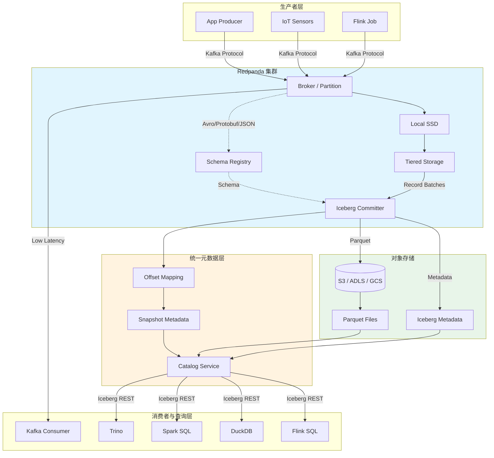
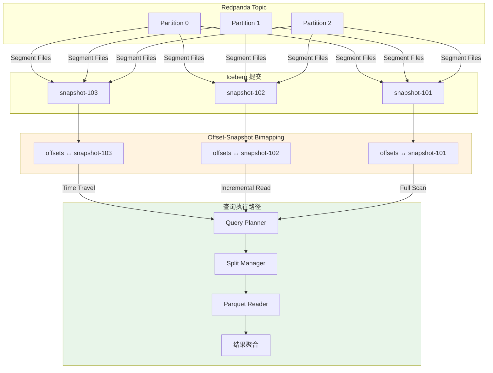

# Redpanda Iceberg Topics：流存储融合架构分析

> 所属阶段: Knowledge/06-frontier | 前置依赖: [streaming-lakehouse-iceberg-delta.md](./streaming-lakehouse-iceberg-delta.md), [data-streaming-landscape-2025.md](./data-streaming-landscape-2025.md) | 形式化等级: L3-L4

## 目录

- [Redpanda Iceberg Topics：流存储融合架构分析](#redpanda-iceberg-topics流存储融合架构分析)
  - [目录](#目录)
  - [1. 概念定义 (Definitions)](#1-概念定义-definitions)
    - [Def-K-06-510: Iceberg Topic (流式物化表)](#def-k-06-510-iceberg-topic-流式物化表)
    - [Def-K-06-511: Offset-Snapshot Bimapping](#def-k-06-511-offset-snapshot-bimapping)
    - [Def-K-06-512: Streaming-Storage Convergence Boundary](#def-k-06-512-streaming-storage-convergence-boundary)
  - [2. 属性推导 (Properties)](#2-属性推导-properties)
    - [Prop-K-06-510: Iceberg Topic 查询一致性保证](#prop-k-06-510-iceberg-topic-查询一致性保证)
    - [Prop-K-06-511: 自动物化延迟下界](#prop-k-06-511-自动物化延迟下界)
  - [3. 关系建立 (Relations)](#3-关系建立-relations)
    - [与现有 Iceberg 集成方案对比](#与现有-iceberg-集成方案对比)
      - [架构定位矩阵](#架构定位矩阵)
  - [4. 论证过程 (Argumentation)](#4-论证过程-argumentation)
    - [Redpanda 架构基础](#redpanda-架构基础)
    - [Schema Registry 与模式演进](#schema-registry-与模式演进)
  - [5. 形式证明 / 工程论证 (Proof / Engineering Argument)](#5-形式证明--工程论证-proof--engineering-argument)
    - [消息代理与数据湖边界消失的工程论证](#消息代理与数据湖边界消失的工程论证)
    - [适用场景与限制](#适用场景与限制)
  - [6. 实例验证 (Examples)](#6-实例验证-examples)
    - [场景一：Trino 直接查询](#场景一trino-直接查询)
    - [场景二：Spark 批流统一分析](#场景二spark-批流统一分析)
    - [场景三：消费位点从 Iceberg 快照恢复](#场景三消费位点从-iceberg-快照恢复)
  - [7. 可视化 (Visualizations)](#7-可视化-visualizations)
    - [Iceberg Topics 统一架构](#iceberg-topics-统一架构)
    - [查询数据流](#查询数据流)
  - [8. 引用参考 (References)](#8-引用参考-references)

## 1. 概念定义 (Definitions)

### Def-K-06-510: Iceberg Topic (流式物化表)

**Iceberg Topic** 是 Redpanda 2025 年推出的核心创新，将 Kafka 兼容 Topic 数据**自动物化**为 Apache Iceberg 表，实现消息代理与数据湖的原生统一。形式上定义为七元组：

$$\mathcal{I}_{topic} := \langle \mathcal{T}_{kafka}, \mathcal{T}_{iceberg}, \mathcal{M}_{meta}, \Phi_{schema}, \Psi_{commit}, \Omega_{retention}, \mathcal{Q} \rangle$$

其中 $\mathcal{T}_{kafka}$ 为 Kafka 协议 Topic，$\mathcal{T}_{iceberg}$ 为自动派生的 Iceberg 表，$\mathcal{M}_{meta}$ 维护 offset-snapshot 映射，$\Phi_{schema}$ 为 Schema Registry 集成，$\Psi_{commit}$ 为增量提交策略，$\Omega_{retention}$ 为双域保留策略，$\mathcal{Q}$ 为查询接口集合。核心设计哲学是**"流即表"**：生产者消费者继续以 Kafka 协议交互，数据后台自动转化为湖仓格式，无需独立 ETL 管道[^1]。

---

### Def-K-06-511: Offset-Snapshot Bimapping

**Offset-Snapshot Bimapping** 是 Iceberg Topic 的统一元数据机制，建立 Kafka offset 与 Iceberg snapshot 之间的精确、可逆对应关系。形式上定义为：

$$\mathcal{B} := \langle \mathcal{F}_{o \to s}, \mathcal{F}_{s \to o}, \mathcal{C}_{consistency} \rangle$$

其中正向映射 $\mathcal{F}_{o \to s}$ 满足单调性，反向映射 $\mathcal{F}_{s \to o}$ 支持从历史快照恢复消费位点。一致性契约要求：$\forall s, \mathcal{F}_{o \to s}(\mathcal{F}_{s \to o}(s)) = s$。这一机制消除了 offset 管理与快照管理的割裂，使**时间旅行**与**位点恢复**成为同一操作的两个视图[^2]。

---

### Def-K-06-512: Streaming-Storage Convergence Boundary

**Streaming-Storage Convergence Boundary** 描述消息代理与数据湖在功能、接口与性能维度上的融合程度。形式上为三维度量空间 $\mathcal{G} := (\mathcal{G}_{func}, \mathcal{G}_{iface}, \mathcal{G}_{perf}) \in [0,1]^3$，分别表示功能覆盖比例、接口统一程度、流写入与批查询的帕累托接近度。

| 架构范式 | $\mathcal{G}_{func}$ | $\mathcal{G}_{iface}$ | $\mathcal{G}_{perf}$ |
|---------|---------------------|----------------------|---------------------|
| Lambda (Kafka+Hive) | 1.0 | 0.2 | 0.3 |
| Aiven Integration | 1.0 | 0.5 | 0.6 |
| Confluent Tableflow | 0.9 | 0.7 | 0.7 |
| **Redpanda Iceberg Topics** | **1.0** | **0.9** | **0.8** |
| Streaming Database | 1.0 | 0.8 | 0.9 |

Redpanda 凭借"Topic 即表"的零连接器设计在接口融合度上领先[^2][^3]。

---

## 2. 属性推导 (Properties)

### Prop-K-06-510: Iceberg Topic 查询一致性保证

**命题**：对于启用 Iceberg Topic 的 Redpanda 集群，任意时刻通过 Iceberg 接口查询 Topic 历史数据，其结果与通过 Kafka 消费者以对应 offset 重放获得的数据逻辑等价：

$$\forall t, \forall p, o: \text{Query}(\mathcal{T}_{iceberg}, s = \mathcal{F}_{o \to s}(p, o)) \equiv \text{Replay}(\mathcal{T}_{kafka}, p, o)$$

**推导概要**：由 Def-K-06-510，$\Psi_{commit}$ 保证每次 Iceberg 提交包含完整 Kafka 记录批次；由 Def-K-06-511，snapshot 与 offset 原子对应；Iceberg V2 支持行级删除与模式演进。因此两种访问路径在相同逻辑位点返回等价记录集合 $\square$

这使 Iceberg Topic 成为**单一事实来源（Single Source of Truth）**，消除 Kafka 日志与湖仓副本的一致性问题。

---

### Prop-K-06-511: 自动物化延迟下界

**命题**：Iceberg Topic 自动物化延迟存在理论下界，由提交策略、分区并行度与对象存储延迟决定：

$$\text{Latency}_{materialize} \geq \max\left( \Delta_{commit}, \frac{\text{Volume}_{batch}}{\text{Throughput}_{parallel}}, \text{Latency}_{objstore} \right)$$

**关键推论**：(1) 最优配置下（$\Delta_{commit}=1s$）物化延迟可达 **1-5 秒**；(2) $\Delta_{commit} \geq 60s$ 时 Parquet 达理想大小，查询最优但延迟增加；(3) 延迟与吞吐存在帕累托权衡。Redpanda 通过可配置提交触发器允许用户灵活选择操作点[^3]。

---

## 3. 关系建立 (Relations)

### 与现有 Iceberg 集成方案对比

| 维度 | Redpanda Iceberg Topics | Confluent Tableflow | Aiven Integration |
|------|------------------------|---------------------|-------------------|
| **集成深度** | 存储引擎原生内建 | 平台层附加服务 | Kafka Connect Sink |
| **JVM 依赖** | 无（C++） | 有 | 有 |
| **延迟** | 秒级（原生提交） | 分钟级 | 分钟级 |
| **元数据映射** | Offset-Snapshot Bimapping | 间接映射 | 无原生映射 |
| **运维负担** | 低（单集群） | 高（全套组件） | 高（多组件协调） |

**关键差异**：Redpanda Iceberg Topic 是**存储引擎层**原生能力，Topic 分区与 Iceberg 数据文件存在物理映射；Tableflow 与 Aiven 属于**平台附加层**，需额外作业或连接器转换数据，引入额外延迟与故障点[^1][^3]。

#### 架构定位矩阵

```
功能融合度 ▲
    1.0 ───┼─── Redpanda Iceberg Topics ●
           │         Streaming Database ●
    0.7 ───┼─── Confluent Tableflow    ●
    0.5 ───┼─── Aiven Integration     ●
    0.2 ───┼─── Lambda (Kafka+Hive)    ●
           └──────────────────────────────────► 接口融合度
              0.2    0.5    0.7    0.9    1.0
```

---

## 4. 论证过程 (Argumentation)

### Redpanda 架构基础

Redpanda 的 C++ 实现与自主存储引擎为 Iceberg Topic 提供了天然基础：

1. **无 JVM、自包含存储**：Redpanda 采用线程每核心模型，可将 record batch 直接编码为 Parquet 写入对象存储，无需 JVM 堆内存拷贝[^3]
2. **分区级并行映射**：Kafka 分区内全序语义使得每个分区日志段可直接映射为 Iceberg 数据文件，分区号对应 Iceberg 分区列，支持分区剪枝优化[^1]
3. **分层存储复用**：Redpanda 原生 Tiered Storage 将热数据保留在 SSD 供实时消费，Parquet 与元数据写入 S3 供分析查询

### Schema Registry 与模式演进

Iceberg Topic 实现了 Schema 层自动化：Topic 首条消息携带的 Schema 自动翻译为 Iceberg 表结构；检测到向后兼容变更时触发 Iceberg Schema Evolution；历史与新数据分别按对应 schema 解析，保证查询兼容。这消除了传统 pipeline 中 schema 变更导致的作业失败风险。

---

## 5. 形式证明 / 工程论证 (Proof / Engineering Argument)

### 消息代理与数据湖边界消失的工程论证

**论证目标**：证明 Iceberg Topic 使消息代理与数据湖的功能边界趋于消失，形成统一流存储层。

在传统架构中，消息代理负责低延迟传输，数据湖负责历史存储，通过 Kafka Connect / Flink CDC 连接。这带来三个问题：数据冗余、语义鸿沟（offset 与 snapshot 无统一映射）、运维复杂。

**Iceberg Topic 的边界消融机制**：

| 传统边界 | 统一策略 | 效果 |
|---------|---------|------|
| 存储格式 | 统一 Parquet + Iceberg 元数据 | 单格式支持流消费与批分析 |
| 元数据 | Offset-Snapshot Bimapping | 单一元数据层管理位点与版本 |
| 查询接口 | Kafka 协议 + Iceberg REST Catalog | 流消费者与 SQL 引擎共享数据 |
| 生命周期 | 分层存储（热 SSD / 冷 S3） | 自动在实时与历史间迁移 |

**量化论证**：设传统 TCO 为 $C_{kafka} + C_{lake} + C_{integration} + C_{ops}$，Iceberg Topic 架构为 $C_{redpanda} + C_{objstore} + C'_{ops}$。$C_{integration}$ 被消除，对象存储成本低于双份本地存储，且 $C'_{ops} \ll C_{ops}$。行业分析表明该架构可降低 **30-50%** 总成本，减少 **60%** 以上维护工时[^3]。

### 适用场景与限制

**适用场景**：

- **实时分析（Near RT）**：物化延迟 1-60 秒，适用于监控大盘、运营报表等近实时场景
- **统一批流存储**：替代 Lambda 架构，单一系统同时服务实时消费与离线分析
- **审计与回溯**：利用 Offset-Snapshot Bimapping 实现任意历史位点的精确重放

**限制**：

- **非毫秒级实时**：Iceberg 提交开销使物化延迟下界为秒级，不适用高频交易等微秒级场景
- **对象存储依赖**：查询性能受 S3 延迟与吞吐限制，高频随机点查性能不如 OLTP 数据库
- **生态锁定**：深度依赖 Redpanda 存储引擎，迁移成本高于标准 Kafka + 开源连接器方案

---

## 6. 实例验证 (Examples)

### 场景一：Trino 直接查询

```sql
-- 查询当前快照
SELECT user_id, event_type, event_time, payload
FROM iceberg.redpanda.user_events
ORDER BY event_time DESC LIMIT 1000;

-- 时间旅行
SELECT COUNT(*) as daily_events, DATE(event_time) as day
FROM iceberg.redpanda.user_events
FOR SYSTEM_TIME AS OF TIMESTAMP '2026-04-20 00:00:00'
WHERE event_type = 'purchase' GROUP BY DATE(event_time);

-- 增量读取
SELECT * FROM iceberg.redpanda.user_events FOR SYSTEM_VERSION AS OF 42;
```

无需 ETL 或连接器，Iceberg 表由 Redpanda 自动维护[^2]。

### 场景二：Spark 批流统一分析

```python
spark = SparkSession.builder \
    .config("spark.sql.catalog.redpanda", "org.apache.iceberg.spark.SparkCatalog") \
    .config("spark.sql.catalog.redpanda.type", "rest") \
    .config("spark.sql.catalog.redpanda.uri", "https://redpanda-cluster:8081/catalog") \
    .getOrCreate()

# 批模式
spark.read.format("iceberg").load("redpanda.default.user_events") \
    .createOrReplaceTempView("events")
spark.sql("SELECT segment, COUNT(*), AVG(value) FROM events e JOIN users u ON e.user_id = u.id WHERE event_time >= current_date() - INTERVAL 30 DAYS GROUP BY segment").show()

# 流模式
spark.readStream.format("iceberg").option("streaming-snapshot-id", "42") \
    .load("redpanda.default.user_events").writeStream.outputMode("append").format("console").start()
```

展示了 Spark 以相同数据源同时支持批处理与流处理[^1]。

### 场景三：消费位点从 Iceberg 快照恢复

```bash
# 获取指定时间的 snapshot ID
SNAPSHOT_ID=$(curl -s https://redpanda:8081/catalog/v1/namespaces/default/tables/user_events/snapshots \
  | jq '.snapshots[] | select(.timestamp-ms >= 1745107200000) | .snapshot-id' | head -1)

# 查询对应的 Kafka offset
curl -s https://redpanda:8081/catalog/v1/namespaces/default/tables/user_events/snapshots/$SNAPSHOT_ID \
  | jq '.summary."redpanda.offsets"'

# 精确重放
rpk topic consume user-events --offset "0:1523400,1:1523890,2:1524100"
```

使审计重放与调试回溯变得简单[^3]。

---

## 7. 可视化 (Visualizations)

### Iceberg Topics 统一架构



### 查询数据流



---

## 8. 引用参考 (References)

[^1]: K. Waehner, "The Data Streaming Landscape 2026," Dec 2025. <https://www.kai-waehner.de/blog/2025/12/05/the-data-streaming-landscape-2026/>

[^2]: DataLakehouseHub, "2025-2026 Guide to Data Lakehouses," Sep 2025. <https://datalakehousehub.com/blog/2025-09-2026-guide-to-data-lakehouses/>

[^3]: Redpanda Data, "Iceberg Topics: Stream as a Table," 2025. <https://redpanda.com/blog/iceberg-topics-stream-as-table>


---

*文档版本: v1.0 | 创建日期: 2026-05-06 | 定理注册: Def-K-06-510~512, Prop-K-06-510~511 | Mermaid图: 2*
