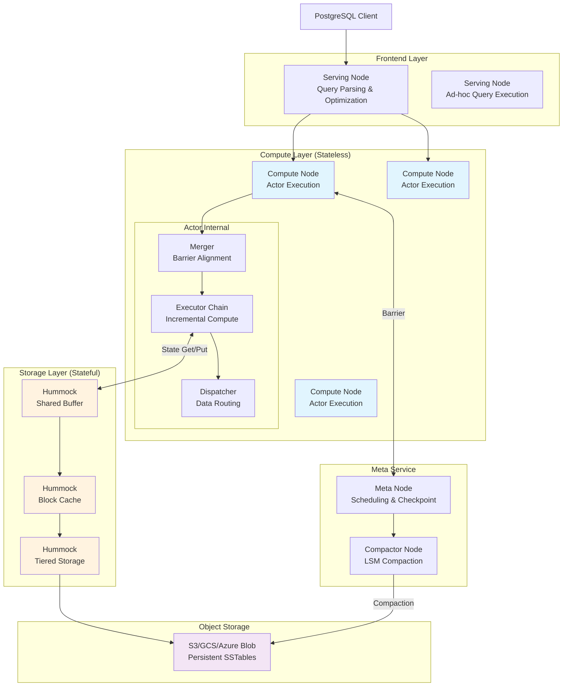
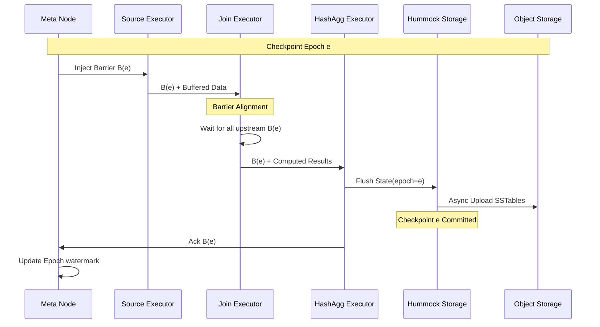
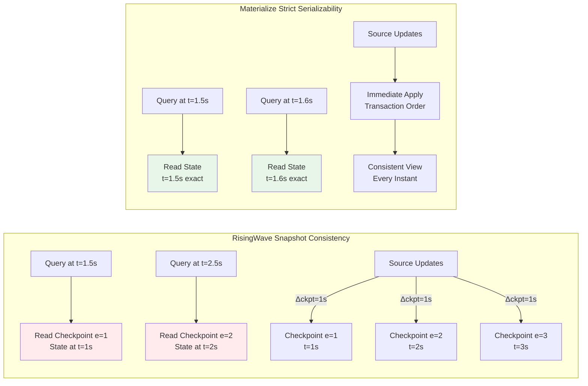
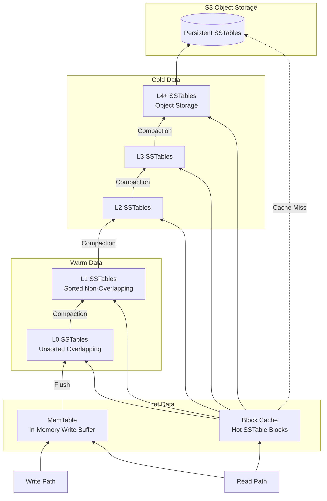

# RisingWave 深度解析：云原生流数据库的架构与一致性模型

> 所属阶段: Knowledge | 前置依赖: [Struct/03-stateful/stateful-computing-foundations.md](../../Struct/01-foundation/01.04-dataflow-model-formalization.md), [Knowledge/05-advanced/streaming-databases-comparison.md](./streaming-database-ecosystem-comparison.md) | 形式化等级: L4-L5

## 1. 概念定义 (Definitions)

### 1.1 RisingWave 架构形式化定义

**Def-K-06-01** (RisingWave 系统架构). RisingWave 是一个分布式流处理数据库系统，其架构可形式化定义为五元组：

$$\mathcal{RW} = \langle \mathcal{N}, \mathcal{S}, \mathcal{G}, \mathcal{H}, \mathcal{C} \rangle$$

其中各组件定义如下：

| 组件 | 符号 | 形式化定义 | 功能描述 |
|------|------|------------|----------|
| 元数据节点 | $\mathcal{N}_{meta}$ | $\langle \mathcal{M}, \mathcal{O}, \mathcal{V} \rangle$ | 集群协调、元数据管理、生命周期编排 |
| 计算节点 | $\mathcal{N}_{compute}$ | $\langle \mathcal{E}, \mathcal{B}, \mathcal{C}_{local} \rangle$ | 无状态流处理执行引擎 |
| 服务节点 | $\mathcal{N}_{frontend}$ | $\langle \mathcal{P}, \mathcal{Q}, \mathcal{R} \rangle$ | 查询解析、优化、即席查询服务 |
| 压缩节点 | $\mathcal{N}_{compactor}$ | $\langle \mathcal{M}_{compact}, \mathcal{S}_{tier} \rangle$ | LSM-Tree 后台压缩优化 |
| 存储引擎 | $\mathcal{H}$ | $\langle \mathcal{L}, \mathcal{T}, \mathcal{O}_{s3} \rangle$ | Hummock 云原生存储层 |

**Def-K-06-02** (无状态计算节点). 计算节点 $\mathcal{N}_{compute}$ 被定义为**逻辑无状态**的，当且仅当：

$$\forall n_c \in \mathcal{N}_{compute}, \forall t: State(n_c, t) = \emptyset \lor State(n_c, t) \subseteq Cache(t)$$

其中 $Cache(t)$ 为可重建的临时缓存，系统持久状态仅驻留于 $\mathcal{H}$。

**Def-K-06-03** (有状态存储节点 - Hummock). Hummock 存储引擎是一个基于 LSM-Tree 的云原生键值存储，形式化为：

$$\mathcal{H} = \langle L_0, L_1, ..., L_k, \mathcal{M}_{meta}, \mathcal{O}_{obj} \rangle$$

其中：

- $L_0$: MemTable 内存层（热数据）
- $L_1 \sim L_k$: SSTable 分层存储（基于对象存储的冷数据）
- $\mathcal{M}_{meta}$: 元数据管理层
- $\mathcal{O}_{obj}$: 对象存储后端（S3/GCS/Azure Blob）

### 1.2 物化视图增量维护机制

**Def-K-06-04** (增量视图维护). 给定基础表 $B$ 和物化视图定义查询 $Q$，增量维护机制 $\mathcal{I}$ 定义为：

$$\mathcal{I}: \Delta B \times S_{t-1} \rightarrow \Delta V \times S_t$$

其中：

- $\Delta B$: 基础表变更流
- $S_t$: 时刻 $t$ 的内部状态
- $\Delta V$: 物化视图增量更新

**Def-K-06-05** (变更传播框架). RisingWave 采用变更传播（Change Propagation）框架，对于查询执行计划 $G = (V, E)$，每个算子 $v \in V$ 满足：

$$\Delta out(v) = f_v(\Delta in(v), State(v))$$

其中 $f_v$ 为算子 $v$ 的增量计算函数。

### 1.3 快照一致性定义

**Def-K-06-06** (Barrier 与 Epoch). Barrier 是流处理中的全局同步标记，形式化为：

$$\mathcal{B} = \langle epoch, timestamp, frontier \rangle$$

其中 $epoch \in \mathbb{N}$ 为单调递增的逻辑时钟。

**Thm-K-06-01** (快照一致性). RisingWave 提供的快照一致性保证：对于任意查询 $q$ 在时刻 $t_q$ 发出，系统返回结果 $R$ 满足：

$$\exists e: R = State(e) \land e \leq t_q \land e = \max\{e' | Checkpoint(e') \land e' \leq t_q\}$$

即查询结果对应于不超过查询时刻的最近一次检查点的全局一致状态。

**Def-K-06-07** (检查点周期一致性). 设检查点间隔为 $\Delta_{ckpt}$（默认 1 秒），系统在任意时刻 $t$ 提供的一致性边界为：

$$\text{Staleness}(t) \leq \Delta_{ckpt}$$

## 2. 属性推导 (Properties)

### 2.1 无状态计算节点的形式化性质

**Lemma-K-06-01** (计算节点故障独立性). 对于任意计算节点 $n_c \in \mathcal{N}_{compute}$，其故障不会影响系统持久状态：

$$\text{Fail}(n_c) \Rightarrow \forall t' > t_{fail}: \mathcal{H}(t') = \mathcal{H}(t_{fail}^-)$$

**证明**: 由 Def-K-06-02，计算节点仅维护临时缓存 $Cache(t)$，所有持久状态写入 $\mathcal{H}$。因此节点故障仅导致缓存丢失，可从 $\mathcal{H}$ 重建。∎

**Lemma-K-06-02** (计算弹性). 计算节点可独立扩展：

$$\forall n_1, n_2 \in \mathbb{N}: Scale_{compute}(n_1) \rightarrow Scale_{compute}(n_2) \text{ 与 } |State_{persist}| \text{ 无关}$$

### 2.2 Hummock 存储引擎性质

**Lemma-K-06-03** (写路径优化). Hummock 的写放大因子 $\alpha_{write}$ 满足：

$$\alpha_{write} = O(k) \text{ (k 为 LSM 层数)}$$

得益于 L0 Intra-Compaction 策略，实际写放大控制在 3 倍以内。

**Lemma-K-06-04** (读路径局部性). 对于热点数据访问模式，缓存命中率 $h$ 满足：

$$h \geq 1 - \frac{|Cold|}{|Total|}$$

其中 Cold 为冷数据集合，通过 Compaction-aware Cache Refill 机制优化。

### 2.3 增量计算正确性

**Lemma-K-06-05** (增量计算等价性). 对于任意查询 $Q$ 和基础表变更 $\Delta B$：

$$Q(B \cup \Delta B) = Q(B) \oplus \mathcal{I}(\Delta B, State_Q)$$

其中 $\oplus$ 为视图更新操作（对物化视图执行增量更新）。

## 3. 关系建立 (Relations)

### 3.1 RisingWave 与 Actor 模型的关系

RisingWave 执行引擎基于 Actor 模型，可映射到经典 Actor 演算：

| Actor 模型概念 | RisingWave 实现 | 形式化对应 |
|----------------|-----------------|------------|
| Actor | Streaming Actor | $\mathcal{A} = \langle \mathcal{E}, \mathcal{M}_{mailbox} \rangle$ |
| 消息 | Stream Message (Data/Barrier) | $m \in \mathcal{M}_{data} \cup \mathcal{M}_{control}$ |
| 行为 | Executor Chain | $\lambda m. fold(\mathcal{E}, m)$ |
| 监督 | Meta Node Recovery | $\mathcal{S}: \mathcal{A}_{failed} \rightarrow \mathcal{A}_{new}$ |

### 3.2 与 Dataflow 模型的映射

RisingWave 的流处理可映射到 Timely Dataflow 的变体：

```
RisingWave Dataflow Graph:
┌──────────┐     ┌──────────┐     ┌──────────┐
│  Source  │────→│ Executor │────→│  Sink    │
│  (Kafka) │     │  Chain   │     │ (MV/S3)  │
└──────────┘     └──────────┘     └──────────┘
                      ↑
                 ┌──────────┐
                 │  State   │
                 │ (Hummock)│
                 └──────────┘
```

### 3.3 与 Flink 架构对比

| 维度 | Apache Flink | RisingWave |
|------|--------------|------------|
| **状态存储** | 本地 RocksDB | 远程 Hummock + S3 |
| **计算-存储** | 紧耦合 | 完全分离 |
| **容错恢复** | State Rebuild | State Recovery from S3 |
| **SQL 层** | 外部（Table API） | 原生（PostgreSQL 兼容） |
| **物化视图** | 需外部系统 | 核心抽象 |

## 4. 论证过程 (Argumentation)

### 4.1 云原生存储分离的工程设计论证

**设计决策**: RisingWave 采用计算-存储分离架构，与 Flink 的本地状态存储形成对比。

**工程权衡分析**:

| 方案 | 优势 | 劣势 | 适用场景 |
|------|------|------|----------|
| **本地状态 (Flink)** | 低延迟访问、无网络开销 | 扩容需迁移状态、受本地磁盘限制 | 超大规模状态、延迟敏感 |
| **分离存储 (RisingWave)** | 弹性扩缩容、无限存储、快速恢复 | 网络延迟、缓存管理复杂度 | 云环境、可变工作负载 |

**形式化论证**:

设系统需要处理的状态大小为 $S$，计算节点数为 $n$：

**本地存储方案的总成本**:
$$C_{local} = n \cdot c_{compute}(S/n) + n \cdot c_{storage}(S/n) + c_{migration}(\Delta n)$$

**分离存储方案的总成本**:
$$C_{remote} = n \cdot c_{compute}(\epsilon) + c_{obj}(S) + c_{cache}(h)$$

其中 $\epsilon$ 为计算节点最小配置，$h$ 为缓存命中率。当 $S$ 增长或 $\Delta n$ 频繁时，$C_{remote} < C_{local}$。

### 4.2 Barrier 检查点机制分析

**Chandy-Lamport 快照算法**在 RisingWave 中的实现：

```
阶段 1: Barrier 注入
  Source ──B(e)──→ ... ──B(e)──→ Sink

阶段 2: Barrier 对齐
  ┌─────────┐
  │ Merger  │ ←── 等待所有上游 B(e) 到达
  └────┬────┘
       ↓
  继续传递 B(e)

阶段 3: 状态快照
  Executor ──Flush──→ Shared Buffer ──Async──→ Hummock/S3
```

**正确性论证**:

**Lemma-K-06-06** (Barrier 一致性). 对于任意执行路径 $p$，Barrier $B(e)$ 保证：

$$\forall m \in Stream: timestamp(m) < e \Rightarrow m \text{ 包含在检查点 } e$$

$$\forall m \in Stream: timestamp(m) \geq e \Rightarrow m \text{ 不包含在检查点 } e$$

### 4.3 反例分析：大事务处理

**边界条件**: 当事务大小 $|T| > 4000$ 行时：

RisingWave 的当前实现可能将事务拆分到多个检查点周期，导致：

$$\exists t: View(t) \neq \text{SourceDB}(t') \text{ for any } t'$$

这与 Materialize 的严格序列化一致性形成对比（见第 5 节）。

## 5. 形式证明 / 工程论证 (Proof / Engineering Argument)

### 5.1 快照一致性的正确性证明

**Thm-K-06-02** (RisingWave 快照一致性保证). RisingWave 的查询结果始终对应于某一历史时刻的全局一致状态。

**证明框架**:

1. **Barrier 传递不变式**:
   $$\forall actor \ a, \forall epoch \ e: \text{当 } a \text{ 处理 } B(e) \text{ 时，所有 } m < e \text{ 已处理}$$

2. **状态持久化原子性**:
   $$Flush(State, e) \rightarrow \mathcal{H}(e) \text{ 是原子的}$$

3. **查询隔离性**:
   $$Query(t) \rightarrow Read(\mathcal{H}, \max(e | e \leq t))$$

**详细证明**:

```
初始条件:
  - 系统启动于 epoch e_0
  - 所有 Source 从 e_0 开始产生数据

归纳假设:
  - 假设在 epoch e,所有 Actor 状态对应于 e 的全局一致快照

归纳步骤:
  1. Meta 注入 Barrier B(e+1) 到所有 Source
  2. 每个 Actor 收到 B(e+1) 后:
     a. 停止处理 data messages
     b. 等待所有上游 B(e+1) (对齐)
     c. 将当前状态标记为 epoch e 的快照
     d. 异步 flush 到 Hummock
     e. 继续处理,此时处理的是 epoch e+1 的数据

结论:
  - 在 Hummock 中,每个 epoch e 对应一个全局一致状态
  - 查询读取特定 epoch 的状态,因此具有一致性
```

### 5.2 与 Materialize 严格序列化一致性的对比

**Thm-K-06-03** (一致性模型蕴含关系). 设：

- $SC$ = Strict Serializability (Materialize)
- $Snap$ = Snapshot Consistency (RisingWave)

则：
$$SC \Rightarrow Snap \land Snap \not\Rightarrow SC$$

**证明**:

1. **$SC \Rightarrow Snap$**:
   - 严格序列化要求所有操作等效于某一全局顺序
   - 该顺序自然定义了每时刻的全局一致快照
   - 因此严格序列化蕴含快照一致性

2. **$Snap \not\Rightarrow SC$** (反例):

   考虑两个并发事务 $T_1, T_2$ 修改表 $A, B$：

   ```
   时间线:
   ──────────────────────────────────────────→
   T1: [Write A=x]          [Write B=y]
   T2:               [Read A]      [Read B]

   RisingWave (Δckpt = 1s):
   - Checkpoint at t=0: A=⊥, B=⊥
   - Checkpoint at t=1: A=x, B=⊥  ← T2 可能读到此状态
   - Checkpoint at t=2: A=x, B=y

   T2 的查询可能在 t=1.5 执行,读到 A=x, B=⊥
   这不是任何真实时刻的全局状态！
   ```

   然而，根据 RisingWave 的语义，该结果对应于检查点 $e=1$ 的状态，
   该状态在系统内部是定义良好且一致的（基于 Barrier 边界）。

**一致性-性能权衡**:

| 系统 | 一致性级别 | 典型延迟 | 适用场景 |
|------|-----------|----------|----------|
| Materialize | 严格序列化 | < 1ms | 金融交易、库存管理 |
| RisingWave | 快照一致性 | 1-10s | 实时监控、分析仪表板 |

## 6. 实例验证 (Examples)

### 6.1 物化视图增量维护实例

**场景**: 实时计算各区域收入统计

```sql
-- 创建 Kafka 数据源
CREATE SOURCE orders_stream (
    order_id INT,
    region VARCHAR,
    amount DECIMAL,
    order_time TIMESTAMP
) WITH (
    connector = 'kafka',
    topic = 'orders',
    properties.bootstrap.server = 'kafka:9092'
) FORMAT PLAIN ENCODE JSON;

-- 创建增量物化视图
CREATE MATERIALIZED VIEW revenue_by_region AS
SELECT
    region,
    SUM(amount) as total_revenue,
    COUNT(*) as order_count
FROM orders_stream
GROUP BY region;
```

**增量计算过程**:

```
输入变更流:
  +-----------+--------+--------+-------------------+
  | order_id  | region | amount | order_time        |
  +-----------+--------+--------+-------------------+
  | 1001      | APAC   | 150.00 | 2024-01-01 10:00  |
  | 1002      | EMEA   | 200.00 | 2024-01-01 10:01  |
  | 1003      | APAC   |  75.00 | 2024-01-01 10:02  |
  +-----------+--------+--------+-------------------+

增量更新:
  HashAgg 算子维护状态:
    Key="APAC": sum=0, count=0
    Key="EMEA": sum=0, count=0

  处理 1001: Key="APAC" → sum=150, count=1
  处理 1002: Key="EMEA" → sum=200, count=1
  处理 1003: Key="APAC" → sum=225, count=2

物化视图状态 (每检查点后持久化到 Hummock):
  +--------+---------------+-------------+
  | region | total_revenue | order_count |
  +--------+---------------+-------------+
  | APAC   | 225.00        | 2           |
  | EMEA   | 200.00        | 1           |
  +--------+---------------+-------------+
```

### 6.2 级联物化视图

```sql
-- 基础聚合视图
CREATE MATERIALIZED VIEW regional_revenue AS
SELECT region, SUM(amount) as revenue
FROM orders_stream
GROUP BY region;

-- 派生视图(基于上游视图)
CREATE MATERIALIZED VIEW top_regions AS
SELECT * FROM regional_revenue
WHERE revenue > 1000000
ORDER BY revenue DESC;
```

**依赖图**:

```
orders_stream → regional_revenue → top_regions
                     ↓
                [Hummock State]
```

### 6.3 多流 Join 实例

```sql
CREATE MATERIALIZED VIEW auction_bid_stats AS
SELECT
    A.id AS auction_id,
    A.item_name,
    COUNT(B.*) AS bid_count,
    MAX(B.price) AS max_bid
FROM auction A
LEFT JOIN bid B ON A.id = B.auction
GROUP BY A.id, A.item_name;
```

**状态管理**:

- Join 算子维护两个状态表：`auction_state`, `bid_state`
- 状态大小：与窗口内数据量成正比
- Checkpoint：每 10 秒持久化到 S3

## 7. 可视化 (Visualizations)

### 7.1 RisingWave 架构图



### 7.2 检查点与一致性模型流程图



### 7.3 一致性模型对比图



### 7.4 LSM-Tree 存储层次图



## 8. Nexmark 基准测试数据分析

### 8.1 测试环境配置

| 配置项 | 规格 |
|--------|------|
| 计算节点 | 8 vCPUs, 16GB memory |
| 存储 | S3 + 本地缓存 |
| RisingWave 版本 | nightly-20230309 |
| 测试工具 | nexmark-bench |

### 8.2 核心性能数据

| Nexmark 查询 | 吞吐量 (kr/s) | 每核吞吐量 (kr/s) | 计算 CPU 平均 | 内存平均 (GiB) |
|--------------|---------------|-------------------|---------------|----------------|
| q0 (基准) | 783.1 | 118.41 | 661.26% | 1.1 |
| q1 (投影) | 893.2 | 119.37 | 748.2% | 1.9 |
| q2 (过滤) | 805.3 | **127.36** | 632.2% | 1.8 |
| q3 (简单 Join) | 705.0 | 97.358 | 719.93% | 7.8 |
| q4 (窗口聚合) | 84.3 | 13.923 | 525.25% | 7.9 |
| q5 (复杂窗口) | 42.1 | 5.2249 | 734.04% | 8.1 |
| q7 (复杂状态) | 219.1 | 20.348 | 792.35% | 9.1 |
| q7-rewrite | **770.0** | 99.37 | 757.67% | 5.0 |
| q8 (复杂 Join) | 483.5 | 60.732 | 763.5% | 8.2 |
| q9 (多流 Join) | 38.0 | 8.2208 | 299.34% | 8.7 |
| q10 (简单聚合) | 730.1 | 106.15 | 681.04% | 4.8 |

### 8.3 与 Flink 性能对比

**总体结论**: RisingWave 在 27 个 Nexmark 查询中的 22 个上表现优于 Flink。

| 查询类型 | RisingWave vs Flink | 关键因素 |
|----------|---------------------|----------|
| 无状态计算 (q0-q2) | 10-30% 提升 | Rust 实现、直接 SQL 优化 |
| 复杂状态管理 (q4,q7) | **最高 660x 提升** | Hummock 分层存储、高效缓存 |
| 动态过滤 (q102) | **520x 提升** | 物化视图优化 |
| 反连接 (q104) | **660x 提升** | 增量计算框架 |

**关键发现**:

```
q7 查询性能对比:
┌─────────────────────────────────────────────────┐
│ RisingWave: 219.1 kr/s (62x faster than Flink)  │
│ Optimized Rewrite: 770.0 kr/s                   │
├─────────────────────────────────────────────────┤
│ Flink: ~3.5 kr/s                                │
└─────────────────────────────────────────────────┘
```

**性能优势来源**:

1. **Rust 原生实现**: 避免 JVM GC 开销
2. **计算感知存储**: Hummock 针对流计算模式优化
3. **SQL 直接优化**: 无多层抽象开销
4. **物化视图原生**: 内置增量维护机制

### 8.4 资源效率分析

```
每核吞吐量分布 (kr/s/core):
q2:  ████████████████████████████████████████████████████ 127.36
q22: ████████████████████████████████████████████████ 110.5
q10: ████████████████████████████████████████████ 106.15
q7r: ███████████████████████████████████████ 99.37
q3:  █████████████████████████████████ 97.358
q7:  ███████ 20.348
q4:  █████ 13.923
q20: █████ 12.726
q5:  ██ 5.2249
```

## 9. 源码级机制分析

### 9.1 检查点机制源码结构

```rust
// src/stream/src/executor/mod.rs
pub trait Executor: Send + 'static {
    async fn next(&mut self) -> Result<Message>;
}

// src/stream/src/executor/actor.rs
pub struct Actor {
    executor: Box<dyn Executor>,
    barrier_aligner: BarrierAligner,
}

impl Actor {
    async fn run(&mut self) {
        loop {
            match self.executor.next().await {
                Ok(Message::Barrier(barrier)) => {
                    // Barrier 对齐与状态快照
                    self.handle_barrier(barrier).await;
                }
                Ok(Message::Chunk(chunk)) => {
                    // 正常数据处理
                    self.process_chunk(chunk).await;
                }
                // ...
            }
        }
    }
}
```

### 9.2 Hummock 写入路径

```rust
// src/storage/src/hummock/store.rs
impl StateStore for HummockStorage {
    async fn write_batch(
        &self,
        batch: Vec<(Key, Value)>,
        epoch: u64,
    ) -> Result<()> {
        // 1. 写入 MemTable
        self.mem_table.write(batch, epoch)?;

        // 2. 检查 MemTable 大小,触发 flush
        if self.mem_table.size() > FLUSH_THRESHOLD {
            let sst = self.mem_table.flush().await?;

            // 3. 异步上传 S3
            tokio::spawn(async move {
                self.obj_store.upload(sst).await?;
                self.meta_client.commit_sst(sst.meta).await?;
            });
        }

        Ok(())
    }
}
```

### 9.3 增量计算算子实现

```rust
// src/stream/src/executor/hash_agg.rs
pub struct HashAggExecutor {
    /// 聚合状态表,存储在 Hummock
    state_table: StateTable<Row>,
    /// 聚合函数集合
    agg_calls: Vec<AggCall>,
}

impl Executor for HashAggExecutor {
    async fn next(&mut self) -> Result<Message> {
        let msg = self.input.next().await?;

        match msg {
            Message::Chunk(chunk) => {
                // 增量处理数据块
                for row in chunk.rows() {
                    let key = self.group_key.extract(&row);
                    let state = self.state_table.get(&key).await?;

                    // 更新聚合状态
                    let new_state = self.update_agg(state, row)?;
                    self.state_table.put(key, new_state).await?;
                }

                // 生成增量输出
                Ok(Message::Chunk(self.generate_delta(chunk)))
            }
            Message::Barrier(b) => {
                // 检查点:异步 flush 状态
                self.state_table.commit(b.epoch).await?;
                Ok(Message::Barrier(b))
            }
        }
    }
}
```

### 9.4 Barrier 对齐机制

```rust
// src/stream/src/executor/barrier_align.rs
pub struct BarrierAligner {
    /// 上游输入流
    inputs: Vec<Box<dyn Executor>>,
    /// 等待对齐的 barrier
    pending_barriers: HashMap<u64, Vec<bool>>,
}

impl BarrierAligner {
    async fn align_barrier(&mut self, barrier: Barrier) -> Result<()> {
        let epoch = barrier.epoch;

        // 标记当前流已收到 barrier
        self.pending_barriers
            .entry(epoch)
            .or_insert_with(|| vec![false; self.inputs.len()]);

        // 等待所有上游
        while !self.all_aligned(epoch) {
            for (idx, input) in self.inputs.iter_mut().enumerate() {
                match input.next().await? {
                    Message::Barrier(b) if b.epoch == epoch => {
                        self.pending_barriers[epoch][idx] = true;
                    }
                    Message::Chunk(c) => {
                        // 缓存或转发 chunk
                        self.buffer.push(c);
                    }
                }
            }
        }

        Ok(())
    }
}
```

## 10. 工程最佳实践

### 10.1 物化视图设计指南

| 模式 | 推荐做法 | 避免做法 |
|------|----------|----------|
| 过滤 | 尽早过滤减少状态 | 在聚合后过滤 |
| Join | 使用主键 Join | 无界大表 Join |
| 聚合 | 使用有界 GROUP BY | 高基数 GROUP BY |
| 级联 | 2-3 层级联深度 | 过深层级联 |

### 10.2 性能调优参数

```toml
# risingwave.toml [storage]
# 块缓存大小 block_cache_capacity_mb = 2048

# 元数据缓存 meta_cache_capacity_mb = 512

# 共享缓冲区(MemTable)
shared_buffer_capacity_mb = 2048

# Compactor 内存限制 compactor_memory_limit_mb = 2560

[streaming]
# 检查点间隔(秒)
checkpoint_interval_sec = 10

# Barrier 超时 barrier_interval_ms = 1000
```

## 11. 引用参考 (References)


---

*文档版本: 1.0 | 创建日期: 2026-04-02 | 维护者: AnalysisDataFlow Project*

---

*文档版本: v1.0 | 创建日期: 2026-04-18*
