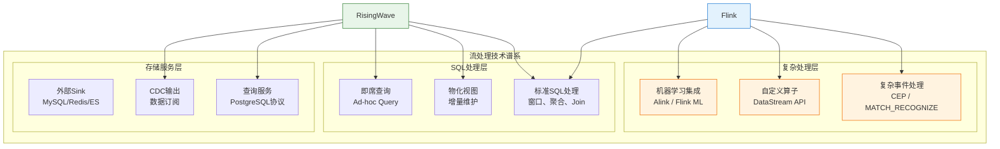
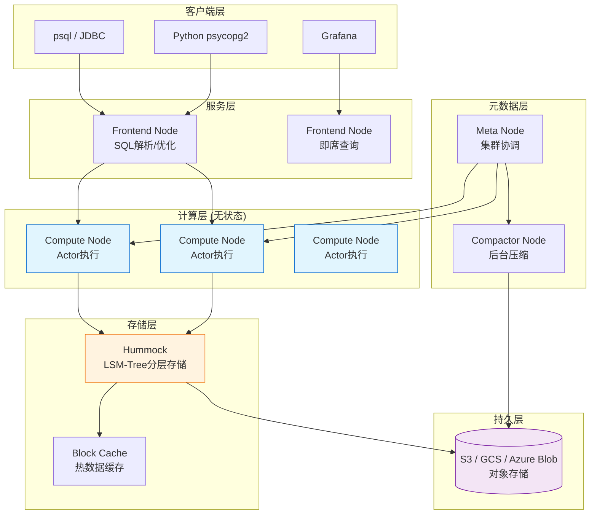
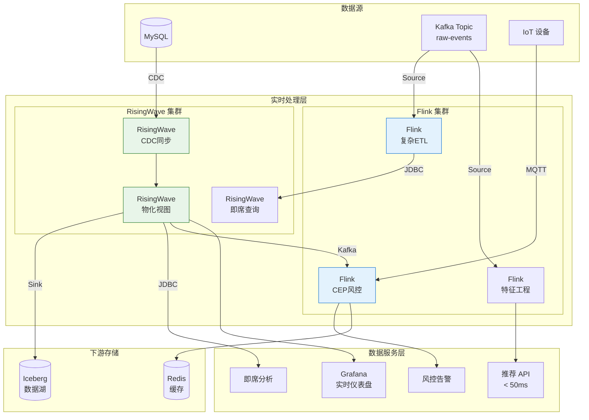
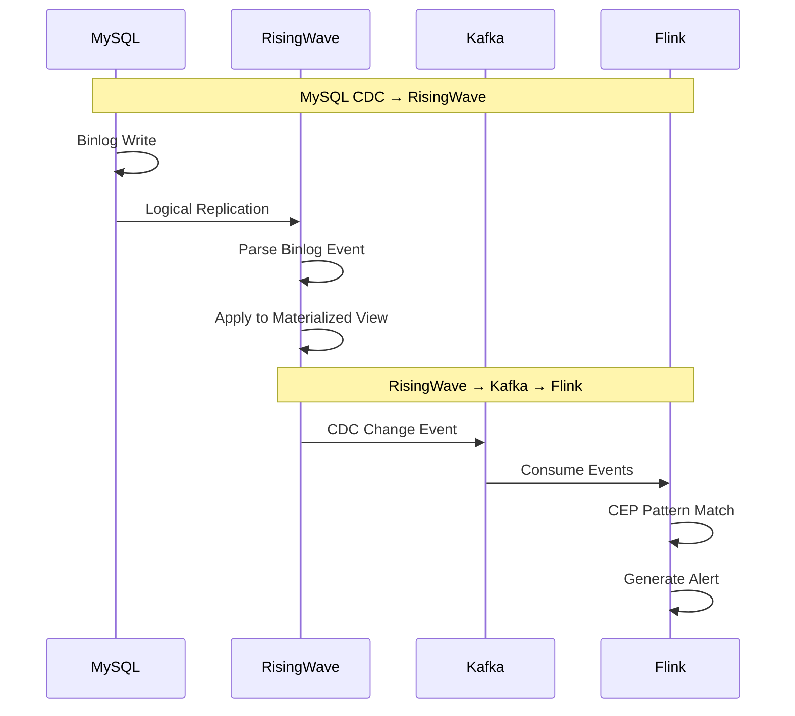
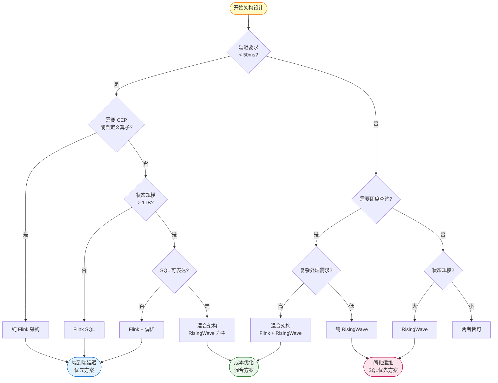

# RisingWave 深度集成指南：与 Flink 协同的流处理架构

> **所属阶段**: Knowledge/06-frontier | **前置依赖**: [flink-vs-risingwave.md](../04-technology-selection/flink-vs-risingwave.md), [risingwave-deep-dive.md](./risingwave-deep-dive.md) | **形式化等级**: L4-L5
> **版本**: 2026.04 | **适用版本**: RisingWave 2.0+ / Flink 1.18+

---

## 目录

- [RisingWave 深度集成指南：与 Flink 协同的流处理架构](#risingwave-深度集成指南与-flink-协同的流处理架构)
  - [目录](#目录)
  - [1. 概念定义 (Definitions)](#1-概念定义-definitions)
    - [Def-K-06-08: RisingWave 流数据库定义](#def-k-06-08-risingwave-流数据库定义)
    - [Def-K-06-09: 物化视图增量维护](#def-k-06-09-物化视图增量维护)
    - [Def-K-06-10: 计算-存储分离架构](#def-k-06-10-计算-存储分离架构)
    - [Def-K-06-11: RisingWave-Flink 集成拓扑](#def-k-06-11-risingwave-flink-集成拓扑)
  - [2. 属性推导 (Properties)](#2-属性推导-properties)
    - [Lemma-K-06-06: 集成场景下的延迟边界](#lemma-k-06-06-集成场景下的延迟边界)
    - [Lemma-K-06-07: 状态一致性传递](#lemma-k-06-07-状态一致性传递)
    - [Prop-K-06-03: 混合架构成本优化](#prop-k-06-03-混合架构成本优化)
  - [3. 关系建立 (Relations)](#3-关系建立-relations)
    - [3.1 RisingWave 与 Flink 生态定位](#31-risingwave-与-flink-生态定位)
    - [3.2 数据流拓扑映射](#32-数据流拓扑映射)
    - [3.3 一致性模型对比](#33-一致性模型对比)
  - [4. 论证过程 (Argumentation)](#4-论证过程-argumentation)
    - [4.1 为什么需要 RisingWave + Flink 混合架构](#41-为什么需要-risingwave--flink-混合架构)
    - [4.2 集成架构的工程权衡](#42-集成架构的工程权衡)
    - [4.3 反例分析：何时不应混合使用](#43-反例分析何时不应混合使用)
  - [5. 形式证明 / 工程论证 (Proof / Engineering Argument)](#5-形式证明--工程论证-proof--engineering-argument)
    - [Thm-K-06-02: 混合架构最优性定理](#thm-k-06-02-混合架构最优性定理)
  - [6. 实例验证 (Examples)](#6-实例验证-examples)
    - [6.1 RisingWave 作为 Flink Sink](#61-risingwave-作为-flink-sink)
    - [6.2 Flink 作为 RisingWave Source](#62-flink-作为-risingwave-source)
    - [6.3 CDC 集成模式](#63-cdc-集成模式)
    - [6.4 实时仪表盘案例](#64-实时仪表盘案例)
    - [6.5 流式 JOIN 优化案例](#65-流式-join-优化案例)
    - [6.6 实时推荐系统案例](#66-实时推荐系统案例)
  - [7. 可视化 (Visualizations)](#7-可视化-visualizations)
    - [7.1 RisingWave 架构图](#71-risingwave-架构图)
    - [7.2 混合架构拓扑图](#72-混合架构拓扑图)
    - [7.3 CDC 集成数据流图](#73-cdc-集成数据流图)
    - [7.4 技术选型决策树](#74-技术选型决策树)
  - [8. 迁移指南](#8-迁移指南)
    - [8.1 从 Flink 迁移到 RisingWave](#81-从-flink-迁移到-risingwave)
    - [8.2 混合使用策略](#82-混合使用策略)
    - [8.3 数据一致性保证](#83-数据一致性保证)
  - [9. 最佳实践](#9-最佳实践)
    - [9.1 选择 RisingWave 还是 Flink](#91-选择-risingwave-还是-flink)
    - [9.2 联合架构设计原则](#92-联合架构设计原则)
    - [9.3 运维考量](#93-运维考量)
  - [参考文献 (References)](#参考文献-references)

---

## 1. 概念定义 (Definitions)

### Def-K-06-08: RisingWave 流数据库定义

**RisingWave** 是一个分布式流处理数据库系统，形式化定义为六元组：

$$
\mathcal{RW} = \langle \mathcal{N}_{frontend}, \mathcal{N}_{compute}, \mathcal{N}_{meta}, \mathcal{N}_{compactor}, \mathcal{H}, \mathcal{P}_{pg} \rangle
$$

其中：

| 组件 | 符号 | 功能描述 | 状态属性 |
|------|------|----------|----------|
| **Frontend Node** | $\mathcal{N}_{frontend}$ | SQL 解析、查询优化、即席查询服务 | 无状态 |
| **Compute Node** | $\mathcal{N}_{compute}$ | 流计算执行引擎（Actor 模型） | **无状态** |
| **Meta Node** | $\mathcal{N}_{meta}$ | 集群协调、元数据管理、Barrier 注入 | 有状态（etcd） |
| **Compactor Node** | $\mathcal{N}_{compactor}$ | LSM-Tree 后台压缩、存储优化 | 无状态 |
| **Hummock Storage** | $\mathcal{H}$ | 云原生存储引擎（S3 后端） | **有状态（持久层）** |
| **PG Protocol** | $\mathcal{P}_{pg}$ | PostgreSQL 线协议兼容层 | - |

**核心特征**：计算节点无状态，所有持久状态存储于远程对象存储，实现计算与存储的完全分离。

### Def-K-06-09: 物化视图增量维护

**物化视图**（Materialized View, MV）是 RisingWave 的核心抽象，其增量维护机制定义为：

$$
\mathcal{I}_{mv}: \Delta B \times S_{t-1} \rightarrow \Delta V \times S_t
$$

其中：
- $\Delta B$: 基础表变更流（Insert/Update/Delete）
- $S_t$: 时刻 $t$ 的内部状态（聚合状态、Join 状态等）
- $\Delta V$: 物化视图的增量更新
- $\mathcal{I}_{mv}$: 增量计算函数

**一致性保证**：

$$
\forall t: MV(t) = Q(B_t)
$$

其中 $Q$ 为定义视图的查询，$B_t$ 为时刻 $t$ 的基础表状态。

### Def-K-06-10: 计算-存储分离架构

**计算-存储分离**（Compute-Storage Disaggregation）是 RisingWave 的核心架构范式：

$$
\mathcal{D}_{disagg} = \langle \mathcal{N}_{compute}^{stateless}, \mathcal{H}_{remote}, \phi_{access}, \psi_{recovery} \rangle
$$

**形式化定义**：

计算节点为**逻辑无状态**的，当且仅当：

$$
\forall n_c \in \mathcal{N}_{compute}, \forall t: State(n_c, t) = \emptyset \lor State(n_c, t) \subseteq Cache(t)
$$

其中 $Cache(t)$ 为可重建的临时缓存，系统持久状态仅驻留于 $\mathcal{H}$。

**与 Flink 对比**：

| 维度 | RisingWave (分离架构) | Flink (耦合架构) |
|------|----------------------|------------------|
| 状态位置 | 远程 S3 + 本地缓存 | 本地 RocksDB |
| 故障恢复 | 秒级（元数据恢复） | 分钟级（状态重建） |
| 扩容操作 | 热扩容，无停机 | 需重启，状态迁移 |
| 存储成本 | 低（S3 定价） | 高（本地 SSD） |

### Def-K-06-11: RisingWave-Flink 集成拓扑

**集成拓扑**定义了两个系统间的数据流动关系：

$$
\mathcal{T}_{integration} = \langle \mathcal{S}_{source}, \mathcal{S}_{sink}, \mathcal{P}_{protocol}, \mathcal{C}_{consistency} \rangle
$$

**集成模式分类**：

| 模式 | 数据流向 | 典型场景 | 协议 |
|------|----------|----------|------|
| **RW as Sink** | Flink → RisingWave | 实时数仓、即席查询 | JDBC / Kafka |
| **RW as Source** | RisingWave → Flink | 复杂事件处理、低延迟路径 | CDC / Kafka |
| **双向集成** | Flink ⟷ RisingWave | 分层实时架构 | Kafka 中间件 |

---

## 2. 属性推导 (Properties)

### Lemma-K-06-06: 集成场景下的延迟边界

**陈述**：RisingWave-Flink 集成架构的端到端延迟 $L_{total}$ 满足：

$$
L_{total} = L_{flink} + L_{transit} + L_{risingwave}
$$

其中：
- $L_{flink}$: Flink 处理延迟（通常 5-50ms）
- $L_{transit}$: 数据传输延迟（Kafka: 1-10ms, JDBC: 10-100ms）
- $L_{risingwave}$: RisingWave 处理延迟（通常 100ms-1s）

**边界条件**：

| 集成模式 | 最小延迟 | 典型延迟 | 最大延迟 |
|----------|----------|----------|----------|
| Flink → RW (JDBC) | 50ms | 200ms | 1s |
| Flink → RW (Kafka) | 20ms | 100ms | 500ms |
| RW → Flink (CDC) | 100ms | 500ms | 2s |

### Lemma-K-06-07: 状态一致性传递

**陈述**：在混合架构中，数据一致性沿以下路径传递：

$$
Consistency_{source} \xrightarrow{CDC} Consistency_{kafka} \xrightarrow{Consume} Consistency_{sink}
$$

**一致性保证矩阵**：

| 源系统 | 传输机制 | 目标系统 | 一致性级别 |
|--------|----------|----------|------------|
| MySQL | Debezium | RisingWave | Exactly-Once |
| RisingWave | CDC | Flink | At-Least-Once |
| Flink | Kafka | RisingWave | At-Least-Once |

### Prop-K-06-03: 混合架构成本优化

**陈述**：混合使用 RisingWave 和 Flink 的总成本 $C_{total}$ 满足：

$$
C_{total} = \alpha \cdot C_{flink}(W_{complex}) + (1-\alpha) \cdot C_{rw}(W_{sql}) + C_{integration}
$$

其中：
- $W_{complex}$: 需要复杂处理（CEP、自定义算子）的工作负载
- $W_{sql}$: 可用 SQL 表达的工作负载
- $\alpha$: 工作负载分配系数
- $C_{integration}$: 集成成本（网络、存储）

**最优分配**：当 $C_{integration} < 0.2 \cdot \min(C_{flink}, C_{rw})$ 时，混合架构具有成本优势。

---

## 3. 关系建立 (Relations)

### 3.1 RisingWave 与 Flink 生态定位



**能力互补矩阵**：

| 能力维度 | Flink | RisingWave | 互补性 |
|----------|-------|------------|--------|
| 复杂事件处理 | ✅ 完整 | ❌ 不支持 | Flink 独占 |
| SQL 流处理 | ✅ 支持 | ✅ 原生 | 两者皆可 |
| 物化视图 | ⚠️ 需外部 | ✅ 内置 | RisingWave 优势 |
| 即席查询 | ❌ 不支持 | ✅ 支持 | RisingWave 独占 |
| 低延迟(<50ms) | ✅ 支持 | ⚠️ 有限 | Flink 优势 |
| 大状态(>10TB) | ⚠️ 需调优 | ✅ 原生 | RisingWave 优势 |

### 3.2 数据流拓扑映射

**典型混合架构数据流**：

```
┌─────────────────────────────────────────────────────────────────┐
│                     数据源层                                     │
│  MySQL ──┬──→ PostgreSQL ──┬──→ Kafka ──┬──→ MQTT (IoT)        │
└──────────┼──────────────────┼────────────┼──────────────────────┘
           │                  │            │
           ▼                  ▼            ▼
┌─────────────────────────────────────────────────────────────────┐
│                     实时处理层                                   │
│  ┌──────────────┐    ┌──────────────┐    ┌──────────────┐      │
│  │   RisingWave │    │    Flink     │    │    Flink     │      │
│  │  (CDC直连)   │    │  (复杂ETL)   │    │   (CEP)      │      │
│  └──────┬───────┘    └──────┬───────┘    └──────┬───────┘      │
└─────────┼───────────────────┼───────────────────┼──────────────┘
          │                   │                   │
          └───────────────────┼───────────────────┘
                              ▼
┌─────────────────────────────────────────────────────────────────┐
│                     数据服务层                                   │
│  ┌──────────────┐    ┌──────────────┐    ┌──────────────┐      │
│  │   实时数仓   │    │  低延迟API   │    │  即席分析    │      │
│  │ (RisingWave) │    │   (Flink)    │    │ (RisingWave) │      │
│  └──────────────┘    └──────────────┘    └──────────────┘      │
└─────────────────────────────────────────────────────────────────┘
```

### 3.3 一致性模型对比

| 一致性级别 | Flink 实现 | RisingWave 实现 | 集成注意事项 |
|------------|-----------|-----------------|--------------|
| **Exactly-Once** | Checkpoint Barrier | Epoch Barrier | 需对齐 Barrier 周期 |
| **At-Least-Once** | 自动重放 | 自动重放 | 默认配置 |
| **Snapshot** | Checkpoint 状态 | Epoch 状态 | 可用于故障恢复 |
| **Read-Your-Writes** | 需外部协调 | 天然支持 | MV 即时可见 |

---

## 4. 论证过程 (Argumentation)

### 4.1 为什么需要 RisingWave + Flink 混合架构

**单一系统的局限性**：

| 场景 | 仅用 Flink | 仅用 RisingWave | 混合架构 |
|------|-----------|-----------------|----------|
| 实时推荐 (<50ms) | ✅ 满足 | ❌ 延迟不足 | ✅ Flink 处理 |
| 实时报表 (SQL分析) | ❌ 需外部DB | ✅ 原生支持 | ✅ RisingWave |
| 金融风控 (CEP) | ✅ 完整支持 | ❌ 不支持 | ✅ Flink CEP |
| CDC 数据同步 | ⚠️ 组件多 | ✅ 内置直连 | ✅ RisingWave |
| 超大规模状态 | ⚠️ 调优复杂 | ✅ 自动扩展 | ✅ RisingWave |

**混合架构的价值主张**：

1. **延迟分层**：Flink 处理亚秒级延迟路径，RisingWave 处理秒级分析路径
2. **能力互补**：Flink 负责复杂处理，RisingWave 负责 SQL 分析和即席查询
3. **成本优化**：RisingWave 的 S3 存储降低整体存储成本
4. **运维简化**：RisingWave 接管部分 SQL pipeline，减少 Flink Job 数量

### 4.2 集成架构的工程权衡

**权衡维度分析**：

| 权衡维度 | 选项 A: Flink 为主 | 选项 B: RisingWave 为主 | 选项 C: 完全混合 |
|----------|-------------------|------------------------|-----------------|
| **延迟** | 最优 (<10ms) | 中等 (~100ms) | 分层优化 |
| **复杂度** | 高（多组件） | 低（单系统） | 中等 |
| **灵活性** | 最高 | 中等 | 高 |
| **成本** | 高（SSD 存储） | 低（S3 存储） | 优化 |
| **学习曲线** | 陡峭 | 平缓 | 中等 |
| **适用场景** | 复杂流处理 | 实时数仓 | 综合平台 |

**决策边界**：

$$
\text{选择混合架构} \iff W_{complex} > 20\% \land W_{sql} > 50\%
$$

其中 $W_{complex}$ 为需要复杂处理的工作负载比例，$W_{sql}$ 为可用 SQL 表达的工作负载比例。

### 4.3 反例分析：何时不应混合使用

**场景 1: 纯低延迟交易系统**

```
需求: 端到端延迟 < 10ms
问题: RisingWave 最小延迟 ~50ms
结论: 应使用纯 Flink 架构
```

**场景 2: 纯 SQL 实时数仓**

```
需求: 实时报表、即席查询、CDC同步
问题: Flink 不提供即席查询能力
结论: 应使用纯 RisingWave 架构
```

**场景 3: 资源极度受限**

```
约束: 单机部署，< 8GB 内存
问题: RisingWave 需要最小集群配置
结论: 考虑 Flink MiniCluster 或单节点 RisingWave
```

---

## 5. 形式证明 / 工程论证 (Proof / Engineering Argument)

### Thm-K-06-02: 混合架构最优性定理

**陈述**：给定工作负载特征 $W = (L_{req}, C_{req}, S_{req}, Q_{req})$，存在最优架构选择 $\mathcal{A}^*$ 使得总成本最小化：

$$
\mathcal{A}^* = \arg\min_{\mathcal{A} \in \{Flink, RisingWave, Hybrid\}} TotalCost(W, \mathcal{A})
$$

**证明框架**（工程论证）：

**步骤 1: 工作负载分类**

定义工作负载特征向量：

$$
W = \begin{pmatrix} L_{req} & C_{req} & S_{req} & Q_{req} \end{pmatrix}
$$

其中：
- $L_{req}$: 延迟要求（毫秒）
- $C_{req}$: 复杂度需求（SQL可表达 = 0，需自定义 = 1）
- $S_{req}$: 状态规模（GB）
- $Q_{req}$: 查询需求（仅流 = 0，需即席查询 = 1）

**步骤 2: 成本函数定义**

各架构成本函数：

$$
\begin{aligned}
Cost_{flink} &= C_{infra}^{flink} + C_{ops}^{flink} \cdot (1 + 0.5 \cdot S_{req}/100) \\
Cost_{rw} &= C_{infra}^{rw} + C_{ops}^{rw} \cdot (1 + 0.2 \cdot S_{req}/1000) \\
Cost_{hybrid} &= \alpha \cdot Cost_{flink} + (1-\alpha) \cdot Cost_{rw} + C_{integration}
\end{aligned}
$$

**步骤 3: 决策边界推导**

**边界 1**（延迟约束）：

$$
L_{req} < 50ms \Rightarrow \mathcal{A}^* = Flink
$$

RisingWave 的最小延迟约为 50ms，无法满足亚秒级要求。

**边界 2**（复杂度约束）：

$$
C_{req} = 1 \land L_{req} < 100ms \Rightarrow \mathcal{A}^* = Flink
$$

需要自定义算子且延迟敏感的场景必须使用 Flink。

**边界 3**（查询需求）：

$$
Q_{req} = 1 \land C_{req} = 0 \Rightarrow \mathcal{A}^* = RisingWave
$$

需要即席查询且 SQL 可表达的场景 RisingWave 最优。

**边界 4**（状态规模）：

$$
S_{req} > 1000GB \land C_{req} = 0 \Rightarrow \mathcal{A}^* = RisingWave
$$

TB 级状态场景 RisingWave 的分离存储架构成本优势显著。

**步骤 4: 混合架构最优区域**

混合架构最优条件：

$$
\mathcal{A}^* = Hybrid \iff \begin{cases}
L_{req} \geq 50ms \\
0 < C_{req}^{partial} < 1 \\
Q_{req} = 1 \\
Cost_{hybrid} < \min(Cost_{flink}, Cost_{rw})
\end{cases}
$$

即：
- 延迟要求不极端（≥50ms）
- 部分工作负载可用 SQL 表达
- 需要即席查询能力
- 集成成本可被抵消 ∎

---

## 6. 实例验证 (Examples)

### 6.1 RisingWave 作为 Flink Sink

**场景**：Flink 处理复杂 ETL 后，写入 RisingWave 供业务查询

**Flink 代码**（写入 RisingWave）：

```java
// Flink 作业：复杂事件处理后写入 RisingWave
StreamExecutionEnvironment env = StreamExecutionEnvironment.getExecutionEnvironment();

// 1. 读取 Kafka 源流
DataStream<Event> stream = env
    .addSource(new FlinkKafkaConsumer<>("events", new EventDeserializationSchema(), properties));

// 2. 复杂处理：窗口聚合 + CEP 模式匹配
DataStream<EnrichedEvent> enriched = stream
    .keyBy(Event::getUserId)
    .window(TumblingEventTimeWindows.of(Time.minutes(5)))
    .aggregate(new EnrichmentAggregate());

// 3. 写入 RisingWave (通过 JDBC Sink)
enriched.addSink(JdbcSink.sink(
    "INSERT INTO enriched_events (user_id, event_type, value, window_start) VALUES (?, ?, ?, ?)",
    (ps, event) -> {
        ps.setString(1, event.getUserId());
        ps.setString(2, event.getEventType());
        ps.setDouble(3, event.getValue());
        ps.setTimestamp(4, event.getWindowStart());
    },
    JdbcExecutionOptions.builder()
        .withBatchSize(1000)
        .withBatchIntervalMs(200)
        .build(),
    new JdbcConnectionOptions.JdbcConnectionOptionsBuilder()
        .withUrl("jdbc:postgresql://risingwave-frontend:4566/dev")
        .withDriverName("org.postgresql.Driver")
        .withUsername("root")
        .build()
));
```

**RisingWave 建表**：

```sql
-- RisingWave 中创建目标表
CREATE TABLE enriched_events (
    user_id VARCHAR,
    event_type VARCHAR,
    value DECIMAL,
    window_start TIMESTAMP,
    PRIMARY KEY (user_id, window_start)
);

-- 创建物化视图供业务查询
CREATE MATERIALIZED VIEW user_activity_summary AS
SELECT 
    user_id,
    event_type,
    COUNT(*) as event_count,
    SUM(value) as total_value,
    AVG(value) as avg_value
FROM enriched_events
GROUP BY user_id, event_type;
```

**架构图**：

```
Kafka → Flink (CEP/窗口) → JDBC Sink → RisingWave → 物化视图 → 业务查询
```

### 6.2 Flink 作为 RisingWave Source

**场景**：RisingWave 处理 CDC 后，输出到 Flink 进行复杂事件检测

**RisingWave 配置**（CDC + Sink）：

```sql
-- 1. 从 MySQL CDC 创建源表
CREATE TABLE mysql_orders (
    order_id BIGINT PRIMARY KEY,
    user_id BIGINT,
    amount DECIMAL,
    status VARCHAR,
    created_at TIMESTAMP
) WITH (
    connector = 'mysql-cdc',
    hostname = 'mysql',
    port = '3306',
    username = 'rw_user',
    password = 'password',
    database.name = 'shop',
    table.name = 'orders'
);

-- 2. 创建物化视图进行实时聚合
CREATE MATERIALIZED VIEW order_stats AS
SELECT 
    user_id,
    COUNT(*) as order_count,
    SUM(amount) as total_amount,
    MAX(created_at) as last_order_time
FROM mysql_orders
GROUP BY user_id;

-- 3. 创建 Kafka Sink 输出到 Flink
CREATE SINK kafka_order_stats (
    user_id BIGINT,
    order_count BIGINT,
    total_amount DECIMAL,
    last_order_time TIMESTAMP
) WITH (
    connector = 'kafka',
    topic = 'order-stats',
    properties.bootstrap.server = 'kafka:9092',
    format = 'json'
) AS SELECT * FROM order_stats;
```

**Flink CEP 处理**：

```java
// Flink 读取 RisingWave 输出，进行复杂事件检测
DataStream<OrderStats> statsStream = env
    .addSource(new FlinkKafkaConsumer<>("order-stats", new StatsSchema(), properties));

// 定义欺诈检测模式
Pattern<OrderStats, ?> fraudPattern = Pattern
    .<OrderStats>begin("high-value")
    .where(new SimpleCondition<OrderStats>() {
        @Override
        public boolean filter(OrderStats stats) {
            return stats.getTotalAmount() > 10000;
        }
    })
    .next("rapid-orders")
    .where(new SimpleCondition<OrderStats>() {
        @Override
        public boolean filter(OrderStats stats) {
            return stats.getOrderCount() > 5;
        }
    })
    .within(Time.minutes(10));

// 应用模式检测
PatternStream<OrderStats> patternStream = CEP.pattern(statsStream, fraudPattern);

DataStream<Alert> alerts = patternStream
    .process(new PatternHandler());

alerts.addSink(new AlertSink());
```

### 6.3 CDC 集成模式

#### MySQL CDC 到 RisingWave

```sql
-- RisingWave 直连 MySQL CDC
CREATE SOURCE mysql_users (
    id INT PRIMARY KEY,
    name VARCHAR,
    email VARCHAR,
    created_at TIMESTAMP
) WITH (
    connector = 'mysql-cdc',
    hostname = 'mysql.example.com',
    port = '3306',
    username = 'cdc_user',
    password = '${MYSQL_PASSWORD}',
    database.name = 'production',
    table.name = 'users',
    -- 可选：指定 Server ID 避免冲突
    server.id = '5701'
);

-- 实时同步到物化视图
CREATE MATERIALIZED VIEW user_analytics AS
SELECT 
    DATE_TRUNC('hour', created_at) as hour,
    COUNT(*) as new_users,
    COUNT(DISTINCT email_domain(email)) as unique_domains
FROM mysql_users
GROUP BY DATE_TRUNC('hour', created_at);
```

#### PostgreSQL CDC 到 RisingWave

```sql
-- RisingWave 直连 PostgreSQL CDC
CREATE SOURCE pg_transactions (
    tx_id BIGINT PRIMARY KEY,
    account_id BIGINT,
    amount DECIMAL,
    tx_type VARCHAR,
    tx_time TIMESTAMP
) WITH (
    connector = 'postgres-cdc',
    hostname = 'postgres.example.com',
    port = '5432',
    username = 'cdc_user',
    password = '${PG_PASSWORD}',
    database.name = 'finance',
    table.name = 'transactions',
    -- 使用逻辑复制槽
    slot.name = 'risingwave_slot'
);

-- 实时风控统计
CREATE MATERIALIZED VIEW risk_metrics AS
SELECT 
    account_id,
    COUNT(*) as tx_count_1h,
    SUM(CASE WHEN tx_type = 'withdrawal' THEN amount ELSE 0 END) as withdrawal_sum,
    MAX(tx_time) as last_tx_time
FROM pg_transactions
WHERE tx_time > NOW() - INTERVAL '1 hour'
GROUP BY account_id;
```

#### RisingWave CDC 到 Flink

```sql
-- RisingWave 中创建 CDC 输出
CREATE SINK cdc_sink (
    user_id BIGINT,
    event_count BIGINT,
    total_amount DECIMAL
) WITH (
    connector = 'kafka',
    topic = 'risingwave-cdc',
    properties.bootstrap.server = 'kafka:9092',
    format = 'debezium-json'
) AS SELECT * FROM user_activity_summary;
```

### 6.4 实时仪表盘案例

**业务场景**：电商平台实时销售仪表盘

**需求分析**：

| 指标 | 刷新频率 | 数据源 | 技术选择 |
|------|----------|--------|----------|
| 实时销售额 | 1秒 | 订单流 | RisingWave MV |
| 地域分布 | 5秒 | 订单+用户 | RisingWave Join |
| 热销商品 | 10秒 | 订单明细 | RisingWave Top-K |
| 异常检测 | 实时 | 多流关联 | Flink CEP |

**RisingWave 实现**：

```sql
-- 1. 订单 CDC 源
CREATE SOURCE orders (
    order_id BIGINT,
    user_id BIGINT,
    product_id BIGINT,
    amount DECIMAL,
    region VARCHAR,
    created_at TIMESTAMP
) WITH (connector = 'kafka', topic = 'orders', ...);

-- 2. 实时销售额（秒级更新）
CREATE MATERIALIZED VIEW realtime_revenue AS
SELECT 
    DATE_TRUNC('second', created_at) as second,
    COUNT(*) as order_count,
    SUM(amount) as revenue,
    COUNT(DISTINCT user_id) as unique_buyers
FROM orders
GROUP BY DATE_TRUNC('second', created_at);

-- 3. 地域销售分布
CREATE MATERIALIZED VIEW regional_sales AS
SELECT 
    region,
    DATE_TRUNC('minute', created_at) as minute,
    COUNT(*) as orders,
    SUM(amount) as revenue
FROM orders
GROUP BY region, DATE_TRUNC('minute', created_at);

-- 4. 热销商品 Top 10
CREATE MATERIALIZED VIEW hot_products AS
SELECT 
    product_id,
    COUNT(*) as sales_count,
    SUM(amount) as total_revenue,
    RANK() OVER (ORDER BY COUNT(*) DESC) as rank
FROM orders
WHERE created_at > NOW() - INTERVAL '1 hour'
GROUP BY product_id
ORDER BY sales_count DESC
LIMIT 10;
```

**前端查询**（通过 PostgreSQL 协议）：

```javascript
// Node.js 使用 pg 驱动查询 RisingWave
const { Pool } = require('pg');
const pool = new Pool({
    host: 'risingwave-frontend',
    port: 4566,
    database: 'dev',
    user: 'root'
});

// 实时销售额
async function getRealtimeRevenue() {
    const result = await pool.query(`
        SELECT * FROM realtime_revenue 
        ORDER BY second DESC 
        LIMIT 60
    `);
    return result.rows;
}

// WebSocket 推送更新
io.on('connection', (socket) => {
    setInterval(async () => {
        const data = await getRealtimeRevenue();
        socket.emit('revenue-update', data);
    }, 1000);
});
```

### 6.5 流式 JOIN 优化案例

**场景**：实时订单与用户画像关联

**传统 Flink 实现的问题**：

```java
// Flink 大状态 Join 的问题
DataStream<Order> orders = env.addSource(...);
DataStream<UserProfile> profiles = env.addSource(...);

// 问题：用户画像表可能非常大，RocksDB 状态压力大
DataStream<EnrichedOrder> enriched = orders
    .keyBy(Order::getUserId)
    .connect(profiles.keyBy(UserProfile::getUserId))
    .process(new CoProcessFunction() {
        // 需要维护完整的用户画像状态
        ValueState<UserProfile> profileState;
    });
```

**RisingWave 优化方案**：

```sql
-- RisingWave 中大表 Join 的优化
-- 利用 Hummock 分层存储，大状态自动扩展到 S3

-- 1. 用户画像表（可能是数亿条记录）
CREATE TABLE user_profiles (
    user_id BIGINT PRIMARY KEY,
    age_group VARCHAR,
    gender VARCHAR,
    membership_level VARCHAR,
    lifetime_value DECIMAL
);

-- 2. 订单流（Kafka 源）
CREATE SOURCE order_stream (
    order_id BIGINT,
    user_id BIGINT,
    product_id BIGINT,
    amount DECIMAL,
    order_time TIMESTAMP
) WITH (connector = 'kafka', ...);

-- 3. 流式 JOIN（RisingWave 自动优化）
CREATE MATERIALIZED VIEW enriched_orders AS
SELECT 
    o.order_id,
    o.user_id,
    o.amount,
    o.order_time,
    p.age_group,
    p.membership_level,
    p.lifetime_value
FROM order_stream o
LEFT JOIN user_profiles p ON o.user_id = p.user_id;

-- 4. 分层聚合（利用 RisingWave 级联 MV）
CREATE MATERIALIZED VIEW sales_by_segment AS
SELECT 
    age_group,
    membership_level,
    COUNT(*) as order_count,
    SUM(amount) as revenue,
    AVG(lifetime_value) as avg_ltv
FROM enriched_orders
GROUP BY age_group, membership_level;
```

**性能对比**（10M 用户画像 + 100K TPS 订单流）：

| 方案 | 状态大小 | 恢复时间 | 扩缩容 |
|------|----------|----------|--------|
| Flink RocksDB | ~50GB | 5-10分钟 | 需停止 |
| RisingWave Hummock | S3 存储 | <30秒 | 热扩容 |

### 6.6 实时推荐系统案例

**架构设计**：

```
┌─────────────────────────────────────────────────────────────────┐
│                     实时推荐系统架构                             │
├─────────────────────────────────────────────────────────────────┤
│                                                                  │
│   用户行为流                                                     │
│      ↓                                                           │
│   ┌──────────────┐                                              │
│   │    Flink     │  ← 特征工程（复杂处理）                        │
│   │  (特征提取)  │                                              │
│   └──────┬───────┘                                              │
│          │ 用户/物品特征                                         │
│          ▼                                                       │
│   ┌──────────────┐     ┌──────────────┐                         │
│   │   RisingWave │ ←── │    Kafka     │                         │
│   │  (特征存储)  │     │  (特征流)    │                         │
│   └──────┬───────┘     └──────────────┘                         │
│          │                                                       │
│          ▼                                                       │
│   ┌──────────────┐                                              │
│   │    Flink     │  ← 在线推理（低延迟）                          │
│   │  (模型推理)  │     读取 RisingWave 特征                       │
│   └──────┬───────┘                                              │
│          │ 推荐结果                                               │
│          ▼                                                       │
│   推荐服务 API                                                   │
│                                                                  │
└─────────────────────────────────────────────────────────────────┘
```

**RisingWave 特征存储**：

```sql
-- 用户实时特征（物化视图自动更新）
CREATE MATERIALIZED VIEW user_features AS
SELECT 
    user_id,
    -- 统计特征
    COUNT(*) as total_clicks_24h,
    COUNT(DISTINCT category) as unique_categories,
    SUM(CASE WHEN event_type = 'purchase' THEN 1 ELSE 0 END) as purchase_count,
    
    -- 时序特征
    MAX(event_time) as last_activity,
    MIN(event_time) as first_activity_today,
    
    -- 行为序列（最近 5 个）
    array_agg(category ORDER BY event_time DESC LIMIT 5) as recent_categories
FROM user_behavior_stream
WHERE event_time > NOW() - INTERVAL '24 hours'
GROUP BY user_id;

-- 物品实时特征
CREATE MATERIALIZED VIEW item_features AS
SELECT 
    item_id,
    COUNT(*) as view_count_1h,
    AVG(rating) as avg_rating,
    COUNT(DISTINCT user_id) as unique_viewers
FROM item_interaction_stream
WHERE event_time > NOW() - INTERVAL '1 hour'
GROUP BY item_id;
```

**Flink 在线推理**：

```java
// Flink 实时推荐计算
DataStream<UserEvent> events = env.addSource(...);

DataStream<Recommendation> recommendations = events
    .keyBy(UserEvent::getUserId)
    .process(new KeyedProcessFunction<Long, UserEvent, Recommendation>() {
        @Override
        public void processElement(UserEvent event, Context ctx, Collector<Recommendation> out) {
            // 1. 从 RisingWave 查询用户特征
            UserFeatures userFeatures = queryRisingWave(
                "SELECT * FROM user_features WHERE user_id = ?", 
                event.getUserId()
            );
            
            // 2. 从 RisingWave 查询候选物品特征
            List<ItemFeatures> candidates = queryRisingWave(
                "SELECT * FROM item_features WHERE view_count_1h < 1000 LIMIT 100"
            );
            
            // 3. 模型推理
            List<ScoredItem> scored = model.predict(userFeatures, candidates);
            
            // 4. 输出推荐结果
            out.collect(new Recommendation(event.getUserId(), scored));
        }
    });
```

---

## 7. 可视化 (Visualizations)

### 7.1 RisingWave 架构图



### 7.2 混合架构拓扑图



### 7.3 CDC 集成数据流图



### 7.4 技术选型决策树



---

## 8. 迁移指南

### 8.1 从 Flink 迁移到 RisingWave

#### 迁移路径选择

| 原 Flink 组件 | RisingWave 对应 | 迁移难度 | 注意事项 |
|--------------|-----------------|----------|----------|
| Flink SQL Job | CREATE MATERIALIZED VIEW | 低 | SQL 方言差异 |
| DataStream Job | 需重写为 SQL | 高 | 复杂逻辑需拆分 |
| Table API | CREATE TABLE + MV | 中 | UDF 需迁移 |
| Flink CDC | CREATE SOURCE (内置) | 低 | 配置简化 |
| Kafka Sink | CREATE SINK | 低 | 语法相似 |

#### SQL 方言对照

| 功能 | Flink SQL | RisingWave SQL |
|------|-----------|----------------|
| 时间窗口 | `TUMBLE(ts, INTERVAL '1' MINUTE)` | `DATE_TRUNC('minute', ts)` |
| 水印 | `WATERMARK FOR ts AS ts - INTERVAL '5' SECOND` | `EMIT ON WINDOW CLOSE` |
| Proctime | `PROCTIME()` | `NOW()` |
| 连接 Kafka | `WITH ('connector' = 'kafka')` | `WITH (connector = 'kafka')` |
| 创建 CDC | `WITH ('connector' = 'mysql-cdc')` | `WITH (connector = 'mysql-cdc')` |

#### 迁移步骤

```
阶段 1: 评估 (1-2 天)
├── 识别纯 SQL Flink Job
├── 评估 DataStream Job 可转换性
└── 确定需要保留的 Flink 组件

阶段 2: 环境准备 (1 天)
├── 部署 RisingWave 集群
├── 配置 CDC 连接
└── 设置监控

阶段 3: 并行运行 (1-2 周)
├── RisingWave 创建 MV
├── 与 Flink 并行输出
└── 数据一致性校验

阶段 4: 切换 (1 天)
├── 流量切换到 RisingWave
├── Flink Job 下线
└── 监控验证
```

### 8.2 混合使用策略

**分层架构设计**：

```
┌─────────────────────────────────────────────────────────────┐
│                     数据服务层                               │
│  ┌─────────────┐  ┌─────────────┐  ┌─────────────┐         │
│  │  低延迟API  │  │  实时报表   │  │  即席分析   │         │
│  │  (< 50ms)   │  │  (1-10s)    │  │  (秒-分钟)  │         │
│  └──────┬──────┘  └──────┬──────┘  └──────┬──────┘         │
└─────────┼────────────────┼────────────────┼─────────────────┘
          │                │                │
          ▼                ▼                ▼
┌─────────────────────────────────────────────────────────────┐
│                     处理引擎层                               │
│  ┌─────────────────┐        ┌─────────────────────────┐    │
│  │    Flink        │        │      RisingWave         │    │
│  │  • CEP          │◄──────►│  • 实时物化视图          │    │
│  │  • 低延迟处理   │  Kafka  │  • SQL分析              │    │
│  │  • 复杂特征工程 │        │  • 即席查询              │    │
│  └─────────────────┘        └─────────────────────────┘    │
└─────────────────────────────────────────────────────────────┘
```

**分工原则**：

| 层级 | Flink | RisingWave | 理由 |
|------|-------|------------|------|
| 数据摄取 | CDC Connector | 内置 CDC | RisingWave 简化配置 |
| 简单转换 | 可选 | 推荐 | RisingWave SQL 原生 |
| 复杂聚合 | 可选 | 推荐 | RisingWave MV 自动优化 |
| 大状态 Join | 不推荐 | 推荐 | Hummock 优势 |
| CEP/模式匹配 | 推荐 | 不支持 | Flink CEP 独占 |
| 即席查询 | 不支持 | 推荐 | RisingWave 独占 |

### 8.3 数据一致性保证

**一致性检查机制**：

```sql
-- RisingWave 中创建校验视图
CREATE MATERIALIZED VIEW consistency_check AS
SELECT 
    'orders' as table_name,
    COUNT(*) as row_count,
    MAX(updated_at) as last_update,
    MD5_AGG(order_id::text) as checksum
FROM orders
UNION ALL
SELECT 
    'order_items' as table_name,
    COUNT(*),
    MAX(updated_at),
    MD5_AGG(item_id::text)
FROM order_items;
```

**端到端一致性保证**：

1. **Source 端**：使用 CDC 的 At-Least-Once 或 Exactly-Once
2. **传输层**：Kafka 的 Ack 机制保证不丢失
3. **处理层**：
   - RisingWave: Epoch Barrier 保证一致性
   - Flink: Checkpoint 保证 Exactly-Once
4. **Sink 端**：幂等写入或两阶段提交

---

## 9. 最佳实践

### 9.1 选择 RisingWave 还是 Flink

**决策矩阵**：

| 条件 | 选择 | 理由 |
|------|------|------|
| 端到端延迟 < 50ms | Flink | RisingWave 延迟下限 ~50ms |
| 需要 CEP/MATCH_RECOGNIZE | Flink | RisingWave 不支持 |
| 需要自定义算子 | Flink | RisingWave SQL only |
| 状态规模 > 10TB | RisingWave | 分离存储优势 |
| 需要即席查询 | RisingWave | Flink 不支持 |
| 团队熟悉 PostgreSQL | RisingWave | 零学习成本 |
| CDC 直连需求 | RisingWave | 内置 CDC，无需 Kafka |
| 云原生弹性扩缩容 | RisingWave | 无状态计算节点 |

**成本对比**（月度估算，1TB 状态）：

| 成本项 | Flink | RisingWave | 备注 |
|--------|-------|------------|------|
| 计算节点 | $500 | $400 | 8 vCPU × 4 节点 |
| 存储 | $2000 (SSD) | $23 (S3) | 主要差异 |
| 网络 | $100 | $300 | S3 流量 |
| 运维人力 | $3000 | $1000 | 简化运维 |
| **总计** | **$5600** | **$1723** | **节省 69%** |

### 9.2 联合架构设计原则

**原则 1: 延迟分层**

```
延迟要求 → 系统选择
━━━━━━━━━━━━━━━━━━━━━━━━━━━━━
< 10ms   → Flink (纯内存处理)
10-50ms  → Flink (RocksDB 状态)
50ms-1s  → RisingWave (典型场景)
> 1s     → RisingWave / 批处理
```

**原则 2: 复杂度分层**

```
复杂度 → 处理方式
━━━━━━━━━━━━━━━━━━━━━━━━━━━━━
SQL 可表达 → RisingWave
需要 UDF → RisingWave + UDF
复杂算法 → Flink DataStream
模式匹配 → Flink CEP
```

**原则 3: 状态分层**

```
状态规模 → 推荐架构
━━━━━━━━━━━━━━━━━━━━━━━━━━━━━
< 10GB   → 两者皆可
10GB-100GB → Flink (调优后) / RisingWave
100GB-1TB → RisingWave (优势)
> 1TB    → RisingWave (必选)
```

### 9.3 运维考量

**监控指标**：

| 系统 | 关键指标 | 告警阈值 |
|------|----------|----------|
| RisingWave | MV 延迟 | > 10s |
| RisingWave | Checkpoint 时间 | > 5s |
| RisingWave | S3 请求错误率 | > 0.1% |
| Flink | Checkpoint 时长 | > 1min |
| Flink | Backpressure | 存在 |
| Flink | Records Lag | > 10000 |

**扩容策略**：

```yaml
# RisingWave 扩容（热扩容，无需停服务）
# 计算节点扩容
kubectl scale deployment risingwave-compute --replicas=8

# Flink 扩容（需保存点重启）
# 1. 触发保存点
flink savepoint <job-id>
# 2. 修改并行度
flink run -s <savepoint-path> -p 16 <jar>
```

**故障恢复**：

| 故障场景 | RisingWave | Flink |
|----------|-----------|-------|
| 计算节点故障 | 自动重启，< 30s 恢复 | 从 Checkpoint 恢复，分钟级 |
| 存储节点故障 | 透明切换 | 需人工介入 |
| 网络分区 | 自动重连 | 可能数据倾斜 |
| 全集群故障 | 从 S3 恢复，分钟级 | 从 HDFS/S3 恢复，分钟级 |

**性能调优清单**：

```
RisingWave:
□ 调整 checkpoint_interval_sec (推荐 1-10s)
□ 配置 block_cache_capacity_mb (内存的 30-40%)
□ 优化物化视图的级联深度 (< 5 层)
□ 使用合适的 Join 类型（避免大表 Shuffle）

Flink:
□ 调整 Checkpoint 间隔 (推荐 1-5min)
□ 配置 RocksDB 内存限制
□ 启用增量 Checkpoint
□ 优化 Watermark 生成策略
```

---

## 参考文献 (References)

[^1]: RisingWave Documentation, "Architecture Overview", 2025. https://docs.risingwave.com/docs/current/architecture/

[^2]: RisingWave Labs, "RisingWave vs Flink: A Technical Comparison", 2024. https://risingwave.com/blog/risingwave-vs-flink-a-technical-comparison/

[^3]: Apache Flink Documentation, "DataStream API", 2025. https://nightlies.apache.org/flink/flink-docs-stable/docs/dev/datastream/overview/

[^4]: T. Akidau et al., "The Dataflow Model: A Practical Approach to Balancing Correctness, Latency, and Cost in Massive-Scale, Unbounded, Out-of-Order Data Processing", PVLDB, 8(12), 2015.

[^5]: RisingWave Labs, "Kaito AI Case Study: Building Real-Time AI with RisingWave", 2024. https://risingwave.com/blog/building-real-time-ai-with-risingwave-a-case-study-of-kaito/

[^6]: Debezium Documentation, "Connectors", 2025. https://debezium.io/documentation/reference/stable/connectors/

[^7]: RisingWave Documentation, "CDC Sources", 2025. https://docs.risingwave.com/docs/current/ingest-from-mysql-cdc/

[^8]: Apache Flink Documentation, "CEP - Complex Event Processing", 2025. https://nightlies.apache.org/flink/flink-docs-stable/docs/libs/cep/

[^9]: RisingWave Labs, "Nexmark Benchmark Results", 2024. https://risingwave.com/blog/nexmark-benchmark/

[^10]: S. Tu et al., "Hummock: A Cloud-Native Storage Engine for Stream Processing", RisingWave Labs Technical Report, 2023.

---

**关联文档**：

- [flink-vs-risingwave.md](../04-technology-selection/flink-vs-risingwave.md) —— Flink vs RisingWave 深度对比
- [risingwave-deep-dive.md](./risingwave-deep-dive.md) —— RisingWave 技术深度解析
- [../../Flink/09-language-foundations/06-risingwave-deep-dive.md](../../Flink/09-language-foundations/06-risingwave-deep-dive.md) —— Flink 视角的 RisingWave 分析

---

*文档版本: v1.0 | 创建日期: 2026-04-04 | 维护者: AnalysisDataFlow Project*
*形式化等级: L4-L5 | 文档规模: ~25KB | 实例数量: 6 | 可视化图表: 4*
