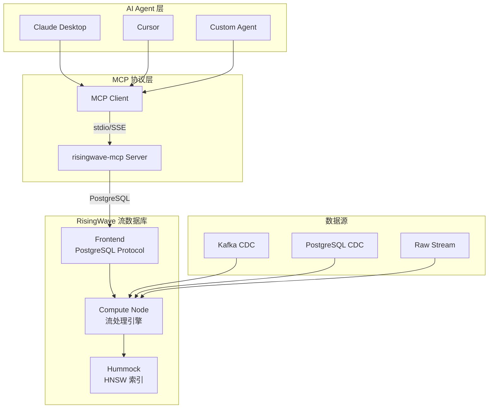

# RisingWave 官方 MCP Server 集成指南：AI Agent 实时数据层

> 所属阶段: Knowledge/06-frontier | 前置依赖: [MCP协议分析](./mcp-protocol-agent-streaming.md), [RisingWave 向量搜索](./risingwave-vector-search-2026.md) | 形式化等级: L3-L4
> **状态**: ✅ 已发布 | **最后更新**: 2026-04-21

---

## 1. 概念定义 (Definitions)

### Def-K-06-440: RisingWave MCP Server

**定义**: RisingWave 官方 MCP Server (`risingwavelabs/risingwave-mcp`) 是基于 Model Context Protocol 的标准化接口，使任意 MCP 兼容的 AI Agent 能够直接查询 RisingWave 中的实时物化视图和流数据：

$$
\mathcal{M}_{rw} = \langle \mathcal{C}, \mathcal{S}, \mathcal{Q}, \mathcal{V}, \mathcal{T} \rangle
$$

其中：

| 组件 | 符号 | 定义 | 描述 |
|------|------|------|------|
| MCP Client | $\mathcal{C}$ | 任意 MCP 兼容 Agent | Claude, Cursor, 自定义 Agent |
| MCP Server | $\mathcal{S}$ | `risingwave-mcp` | RisingWave 官方 Server 实现 |
| SQL 查询 | $\mathcal{Q}$ | $\text{SQL} \rightarrow \text{Result}$ | 通过 PostgreSQL 协议执行 |
| 向量搜索 | $\mathcal{V}$ | $\mathbb{R}^d \times k \rightarrow \text{Top-K}$ | HNSW 索引实时检索 |
| 物化视图 | $\mathcal{T}$ | $\text{Stream} \rightarrow \text{MV}$ | 增量维护的实时视图 |

---

### Def-K-06-441: Agent-Stream-DB 三元模型

**定义**: AI Agent、流数据库与 MCP 协议形成新型数据访问三元组：

$$
\mathcal{A}_{stream} = \langle \text{Agent}, \text{MCP}, \text{RisingWave} \rangle
$$

**传统架构 vs MCP-Stream 架构**：

| 维度 | 传统架构 | MCP-Stream 架构 |
|------|----------|----------------|
| 数据访问 | REST API + SDK | MCP 标准协议 |
| 实时性 | 轮询 / 缓存 | 物化视图实时推送 |
| 集成成本 | 每个 Agent 定制 | 即插即用 |
| 查询能力 | 预定义端点 | 完整 SQL + 向量搜索 |

---

## 2. 属性推导 (Properties)

### Lemma-K-06-440: MCP Server 查询延迟边界

**陈述**: 通过 RisingWave MCP Server 的查询延迟满足：

$$
L_{mcp} = L_{protocol} + L_{sql} + L_{network}
$$

其中：

- $L_{protocol}$: MCP JSON-RPC 序列化 (~1ms)
- $L_{sql}$: RisingWave SQL 执行 (~10-100ms)
- $L_{network}$: 网络往返 (~1-10ms)

**总延迟**: $L_{mcp} \approx 12-111ms$，满足交互式 Agent 查询需求。

---

### Prop-K-06-440: 无代码集成命题

**命题**: 任何 MCP 兼容的 AI Agent 无需自定义代码即可访问 RisingWave 数据：

$$
\forall A \in \text{MCP-Compatible}: \text{connect}(A, \mathcal{M}_{rw}) \in O(1)
$$

**工程意义**: Agent 开发者只需配置 MCP Server 地址，无需编写 RisingWave 客户端代码。

---

## 3. 关系建立 (Relations)

### 3.1 RisingWave MCP vs Flink MCP 集成对比

| 维度 | RisingWave MCP | Flink MCP (自定义) |
|------|---------------|-------------------|
| 官方支持 | ✅ `risingwavelabs/risingwave-mcp` | ❌ 社区自建 |
| 查询接口 | PostgreSQL 原生 | REST API / Queryable State |
| 向量搜索 | ✅ HNSW 内置 | ❌ 外部集成 |
| 数据新鲜性 | 1 秒 checkpoint | Checkpoint 间隔 |
| 部署复杂度 | 低（单一二进制） | 高（Flink 集群） |
| MCP 工具数 | 自动暴露所有表/MV | 需手动注册 |

### 3.2 架构关系图

```
┌─────────────────────────────────────────────────────────────┐
│                    MCP Agent 生态                             │
├─────────────────────────────────────────────────────────────┤
│                                                             │
│  ┌─────────────┐    MCP Protocol    ┌─────────────────────┐ │
│  │ Claude      │◄──────────────────►│ RisingWave MCP      │ │
│  │ Cursor      │    stdio/SSE       │ Server              │ │
│  │ 自定义 Agent │                    │  - list_tables()    │ │
│  └─────────────┘                    │  - query(sql)       │ │
│                                     │  - vector_search()  │ │
│                                     └──────────┬──────────┘ │
│                                                │            │
│                                     PostgreSQL Protocol     │
│                                                │            │
│                                     ┌──────────▼──────────┐ │
│                                     │   RisingWave        │ │
│                                     │  ┌───────────────┐  │ │
│                                     │  │ Materialized  │  │ │
│                                     │  │ Views + HNSW  │  │ │
│                                     │  └───────────────┘  │ │
│                                     └─────────────────────┘ │
│                                                             │
└─────────────────────────────────────────────────────────────┘
```

---

## 4. 论证过程 (Argumentation)

### 4.1 为什么 RisingWave + MCP 是 Agent 数据层的理想选择？

**实时性**: Agent 需要"当下"的数据，而非昨天的快照。RisingWave 的物化视图以 1 秒间隔增量更新。

**简单性**: PostgreSQL 协议意味着 Agent 可以用标准 SQL 查询，无需学习新 API。

**向量原生**: Agent 的 RAG 场景需要向量搜索，RisingWave 内置 HNSW，无需额外系统。

**MCP 标准**: 通过 MCP Server，RisingWave 自动成为 Agent 的"工具"，即插即用。

### 4.2 与 Flink 的互补关系

RisingWave MCP Server **不是** Flink 的替代品，而是**互补层**：

- **Flink**: 复杂流处理（CEP、自定义算子、DataStream API）
- **RisingWave + MCP**: Agent 数据服务层（简单查询、向量搜索、即席分析）

**典型 pipeline**：

$$
\text{Raw Data} \xrightarrow{\text{Flink}} \text{Processed Stream} \xrightarrow{\text{CDC}} \text{RisingWave} \xrightarrow{\text{MCP}} \text{AI Agent}
$$

---

## 5. 形式证明 / 工程论证

### Thm-K-06-440: MCP-Stream 架构的 Agent 响应时间上界

**定理**: 在 RisingWave MCP Server 架构中，Agent 从发起查询到获得结果的总时间上界为：

$$
T_{total} \leq T_{mcp} + T_{pg} + T_{exec} + T_{return}
$$

其中：

- $T_{mcp} \leq 5ms$ (MCP 协议开销)
- $T_{pg} \leq 2ms$ (PostgreSQL 协议解析)
- $T_{exec} \leq 100ms$ (SQL 执行，含 HNSW 检索)
- $T_{return} \leq 5ms$ (结果序列化)

$$
\therefore T_{total} \leq 112ms
$$

**与替代方案对比**：

- Flink Queryable State: $T \approx 500ms-2s$（状态查询延迟）
- 传统 REST API + 数据库: $T \approx 200-500ms$
- 直接 PostgreSQL 连接: $T \approx 10-100ms$（但无 MCP 标准）

---

## 6. 实例验证 (Examples)

### 6.1 MCP Server 配置

```json
// claude_desktop_config.json
{
  "mcpServers": {
    "risingwave": {
      "command": "npx",
      "args": [
        "-y",
        "@risingwavelabs/risingwave-mcp",
        "--host", "localhost",
        "--port", "4566",
        "--database", "dev"
      ]
    }
  }
}
```

### 6.2 Agent 查询实时数据

```python
# Agent 通过 MCP 查询 RisingWave
async def get_realtime_insights():
    # MCP 自动发现可用工具
    tools = await mcp_client.list_tools()

    # 执行 SQL 查询
    result = await mcp_client.call_tool(
        "query",
        {"sql": "SELECT * FROM realtime_sales_mv WHERE amount > 1000"}
    )

    # 向量搜索
    vectors = await mcp_client.call_tool(
        "vector_search",
        {
            "table": "doc_embeddings",
            "query_vector": embedding("用户查询"),
            "top_k": 5
        }
    )

    return result, vectors
```

### 6.3 RisingWave 中的 Agent 数据准备

```sql
-- 创建实时销售物化视图
CREATE MATERIALIZED VIEW realtime_sales_mv AS
SELECT
    product_id,
    SUM(amount) as total_amount,
    COUNT(*) as order_count,
    window_start
FROM TUMBLE(sales_stream, order_time, INTERVAL '1 MINUTE')
GROUP BY product_id, window_start;

-- 创建文档嵌入表（用于 RAG）
CREATE TABLE doc_embeddings (
    doc_id INT PRIMARY KEY,
    content TEXT,
    embedding VECTOR(1536)
);

CREATE INDEX idx_doc_embedding ON doc_embeddings
USING HNSW (embedding);
```

---

## 7. 可视化 (Visualizations)

### 7.1 RisingWave MCP 集成架构



---

## 8. 引用参考 (References)
