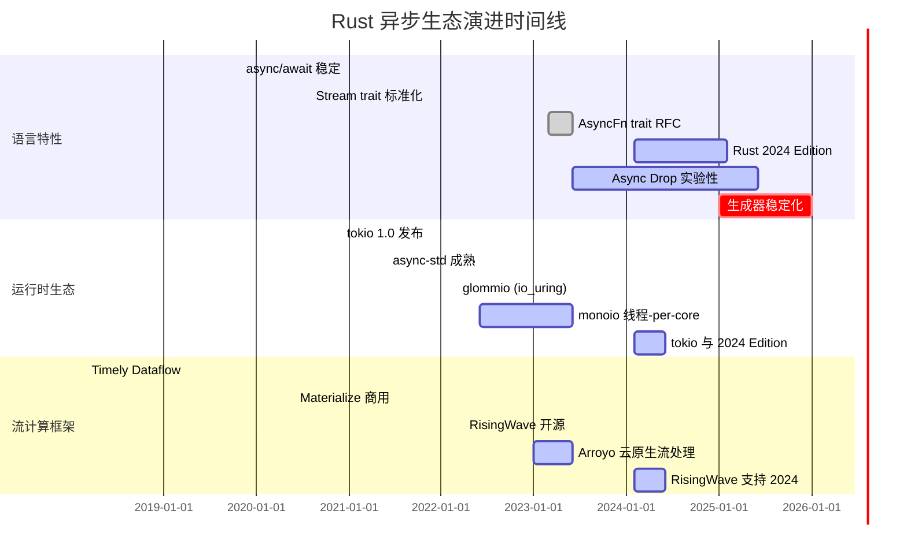
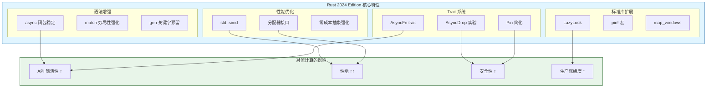
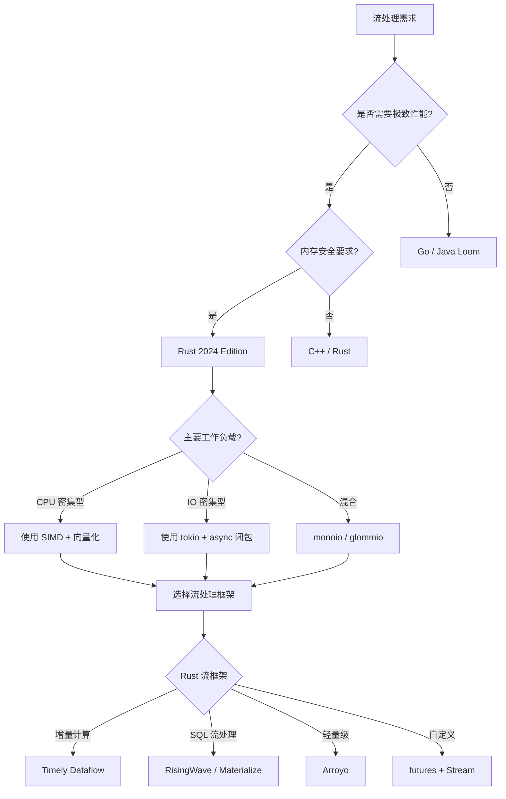

# Rust 2024 Edition 新特性与流计算优化指南

> 所属阶段: Knowledge/06-frontier | 前置依赖: [Knowledge/06-frontier/rust-streaming-ecosystem.md](./rust-streaming-ecosystem.md), [05.04-concurrency-models-2025-comparison.md](../../Struct/05-comparative-analysis/05.04-concurrency-models-2025-comparison.md) | 形式化等级: L4

---

## 1. 概念定义 (Definitions)

### Def-K-06-90: Rust Edition 机制

**定义**: Rust Edition 是 Rust 语言的一种版本管理机制，允许在不破坏向后兼容性的前提下引入不兼容的语法变更。
Edition 采用**代码级隔离**策略，同一 crate 内的所有代码必须使用相同 Edition，但不同 crate 可以混用不同 Edition。

$$
\mathcal{E}_{rust} = \langle \mathcal{S}_{syntax}, \mathcal{S}_{semantics}, \mathcal{M}_{compat}, \mathcal{T}_{migrate} \rangle
$$

其中：

| 组件 | 符号 | 说明 |
|------|------|------|
| 语法集合 | $\mathcal{S}_{syntax}$ | 该 Edition 支持的语法特性集合 |
| 语义规则 | $\mathcal{S}_{semantics}$ | 类型系统、借用检查器等语义规则 |
| 兼容性层 | $\mathcal{M}_{compat}$ | 跨 Edition 的 ABI 兼容机制 |
| 迁移工具 | $\mathcal{T}_{migrate}$ | `cargo fix` 等自动迁移工具 |

**核心保证**: 对于任意两个 Edition $E_1, E_2$ 编译的 crate，满足 ABI 兼容性：

$$
\forall C_1 \in E_1, \forall C_2 \in E_2: C_1 \link C_2 \Rightarrow \text{Safe}
$$

---

### Def-K-06-91: 异步闭包类型 (Async Closure)

**定义** (Def-R-02-01): 异步闭包是 Rust 2024 Edition 中稳定的新类型，它将闭包参数捕获与异步执行语义结合。
形式化定义为：

$$
\mathcal{F}_{async} = \lambda x. \mathcal{P}(x) \rightarrow \mathcal{F}(\mathcal{V})
$$

其中：

- $\mathcal{P}(x)$: 参数 $x$ 的预处理闭包环境
- $\mathcal{F}(\mathcal{V})$: 返回的 Future，解析为值域 $\mathcal{V}$
- $\rightarrow$: 异步计算映射

**2024 Edition 语法**:

```rust
// 2021 Edition: 需要 async move 块包裹
let f_2021 = |x: i32| async move {
    some_async_op(x).await
};

// 2024 Edition: 原生 async 闭包语法
let f_2024 = async move |x: i32| -> i32 {
    some_async_op(x).await
};
```

**类型签名演进**:

| Edition | 闭包类型 | 返回类型 |
|---------|----------|----------|
| 2021 | `impl Fn(i32) -> impl Future<Output = i32>` | `Future` |
| 2024 | `impl AsyncFn(i32) -> i32` | 直接返回值 |

---

### Def-K-06-92: 生成器语义 (Generator Semantics)

**定义** (Def-R-02-02): 生成器是一种支持惰性求值的计算抽象，通过 `yield` 操作符实现计算状态的挂起与恢复。
形式化定义为六元组：

$$
\mathcal{G} = \langle S, s_0, Y, R, \delta, \mathcal{F} \rangle
$$

其中：

- $S$: 生成器状态集合
- $s_0 \in S$: 初始状态
- $Y$: 产出值域 (yield values)
- $R$: 最终返回值域
- $\delta: S \times (\{\text{yield}\} \cup \{\text{return}\}) \rightarrow S \times (Y \cup R)$: 状态转移函数
- $\mathcal{F}$: 挂起时保存的帧环境

**Rust 生成器特性**:

```rust
#![feature(generators, generator_trait)]
use std::ops::{Generator, GeneratorState};

let mut gen = || {
    yield 1;
    yield 2;
    return 3;
};

// 手动驱动生成器
match gen.resume(()) {
    GeneratorState::Yielded(v) => println!("Yielded: {}", v),
    GeneratorState::Complete(r) => println!("Complete: {}", r),
}
```

---

### Def-K-06-93: Async Drop 语义

**定义** (Def-R-02-03): Async Drop 是实验性的异步资源清理机制，允许在值离开作用域时执行异步清理操作。形式化定义为：

$$
\text{AsyncDrop}(v) = \begin{cases}
\text{sync\_drop}(v) & \text{if } v: \text{SyncDrop} \\
\text{await}(\text{async\_drop}(v)) & \text{if } v: \text{AsyncDrop}
\end{cases}
$$

**约束条件**:

- 异步 drop 只能在异步上下文中触发
- 作用域结束时隐式 await
- 不保证执行顺序的确定性

```rust
// 实验性特性 (nightly)
#![feature(async_drop)]

struct Connection { /* ... */ }

impl AsyncDrop for Connection {
    async fn drop(&mut self) {
        // 异步关闭连接
        self.close().await;
        log::info!("Connection closed gracefully");
    }
}
```

---

### Def-K-06-94: Stream Trait 形式化

**定义** (Def-R-02-04): `Stream` trait 表示异步迭代的数据源，是流计算的核心抽象。2024 Edition 中对 Stream 的组合子进行了扩展优化。

$$
\mathcal{S} = \langle \mathcal{I}, \mathcal{F}_{next}, \mathcal{T}_{item} \rangle
$$

其中：

- $\mathcal{I}$: 流的内部状态
- $\mathcal{F}_{next}: \mathcal{I} \rightarrow \mathcal{F}(\text{Option}<\mathcal{T}_{item}>)$: 异步取下一个元素
- $\mathcal{T}_{item}$: 元素类型

```rust
use futures::Stream;

// 2024 Edition 优化的 Stream 组合子
async fn process_stream<S>(stream: S)
where
    S: Stream<Item = Event>,
{
    stream
        .map(async |event| transform(event).await)  // async 闭包!
        .filter(async |e| e.is_valid().await)
        .buffer_unordered(100)
        .for_each(async |e| sink.send(e).await)
        .await;
}
```

---

### Def-K-06-95: SIMD 向量化抽象

**定义** (Def-R-02-05): SIMD (Single Instruction Multiple Data) 允许单条指令并行处理多个数据元素。Rust 的 `std::simd` 提供了可移植的向量化抽象。

$$
\mathcal{V}_{simd} = \langle \mathcal{L}_{lane}, \mathcal{O}_{op}, \mathcal{M}_{mask} \rangle
$$

其中：

- $\mathcal{L}_{lane}$: 向量通道宽度 (通常 128/256/512 位)
- $\mathcal{O}_{op}$: 向量化操作集合
- $\mathcal{M}_{mask}$: 掩码选择机制

```rust
#![feature(portable_simd)]
use std::simd::{f32x8, Simd};

// 8个f32并行相加
fn vectorized_add(a: &[f32], b: &[f32], c: &mut [f32]) {
    let chunks = a.len() / 8;
    for i in 0..chunks {
        let va = f32x8::from_slice(&a[i*8..]);
        let vb = f32x8::from_slice(&b[i*8..]);
        let vc = va + vb;  // 单条指令,8个并行加法
        vc.copy_to_slice(&mut c[i*8..]);
    }
}
```

---

### Def-K-06-96: 内存分配器抽象

**定义** (Def-R-02-06): Rust 的全局分配器抽象允许在流处理应用中根据工作负载特征选择最优的内存分配策略。

$$
\mathcal{A} = \langle \mathcal{M}_{alloc}, \mathcal{M}_{dealloc}, \mathcal{S}_{strategy} \rangle
$$

**主流分配器对比**:

| 分配器 | 算法 | 适用场景 | 性能特征 |
|--------|------|----------|----------|
| System (libc) | ptmalloc/dlmalloc | 通用 | 低内存占用 |
| jemalloc | 分层分配 + 延迟释放 | 高并发 | 减少碎片，NUMA友好 |
| mimalloc | 自由列表 + 分片 | 小对象密集 | 极低延迟，无锁设计 |
| snmalloc | 消息传递架构 | 跨核分配 | 极致扩展性 |

---

## 2. 属性推导 (Properties)

### Lemma-R-02-01: 异步闭包惰性求值

**引理**: 异步闭包在调用点不立即执行，而是返回一个 suspended 的 Future，符合惰性求值语义。

**证明**:

设异步闭包 $f_{async} = \async |x| \{ e \}$，调用 $f_{async}(v)$:

1. 捕获环境 $\Gamma$ 被封装到闭包状态
2. 参数 $v$ 绑定到 $x$
3. 返回 Future $F$ 处于 `Poll::Pending` 状态
4. 仅当 `.await` 或 `poll()` 调用时，$e$ 开始执行

$$
\text{eval}(f_{async}(v)) = \text{suspend}(\Gamma, x \mapsto v, e) \neq \text{eval}(e[x/v])
$$

**工程意义**: 允许构建延迟计算图，在流处理中实现高效的流水线调度。

---

### Lemma-R-02-02: 生成器状态机完备性

**引理**: Rust 生成器编译后的状态机是确定性的，每个 `yield` 点对应唯一状态。

**证明概要**:

对于生成器 $g$ 含 $n$ 个 yield 点，编译器生成状态机 $M_g$:

```
State 0: Initial → yield#1 → State 1
State 1: yield#1  → yield#2 → State 2
...
State n: yield#n  → return  → Complete
```

由于 `yield` 按词法顺序排列，状态转移是单值的：

$$
\forall s_i \in S: |\delta(s_i, \text{yield})| = 1
$$

因此 $M_g$ 是确定性有限状态机 (DFA)。

---

### Prop-R-02-01: Async Drop 执行顺序不确定性

**命题**: 在同一作用域内，多个值的 Async Drop 执行顺序与声明顺序**不保证**一致。

**论证**:

```rust
{
    let a = Connection::new().await;
    let b = Connection::new().await;
    // a 和 b 的 async drop 可能并发执行
} // a.drop().await 和 b.drop().await 顺序不确定
```

这类似于同步 Drop 的逆序执行保证的弱化版本，适用于需要并行关闭资源的场景。

---

### Prop-R-02-02: match 表达式穷尽性检查强化

**命题**: Rust 2024 Edition 强化了 match 穷尽性检查，Or 模式绑定现在必须具有一致的绑定模式。

**2021 vs 2024 对比**:

```rust
// 2021 Edition: 允许(但有警告)
match Some(1) {
    Some(x) | None => println!("{}", x), // x 在 None 分支未定义！
}

// 2024 Edition: 编译错误
match Some(1) {
    Some(x) | None => println!("{}", x), // Error: x 未在所有模式绑定
}

// 正确写法
match Some(1) {
    Some(x) => println!("{}", x),
    None => println!("none"),
}
```

**形式化**: 对于 Or 模式 $p_1 | p_2$，绑定集合必须满足：

$$
\text{bindings}(p_1) = \text{bindings}(p_2)
$$

---

### Prop-R-02-03: AsyncFn Trait 一致性

**命题**: `AsyncFn` trait 族的引入使得高阶异步函数的泛型约束更加精确。

```rust
// 2021: 需要展开 Future 类型
fn call_async<F, Fut, T>(f: F, arg: T)
where
    F: FnOnce(T) -> Fut,
    Fut: Future<Output = i32>,
{}

// 2024: 直接使用 AsyncFn
fn call_async<F, T>(f: F, arg: T)
where
    F: AsyncFn(T) -> i32,
{}
```

---

## 3. 关系建立 (Relations)

### 3.1 与 Go 异步模型对比

| 维度 | Rust 2024 Edition | Go Goroutine |
|------|-------------------|--------------|
| **调度模型** | 协作式 (async/await) | 抢占式 (M:N 调度) |
| **内存模型** | 显式所有权 + Pin | GC 托管 |
| **并发原语** | Future + Stream | Channel + goroutine |
| **性能特征** | 零成本抽象 | 小栈启动，可能栈拷贝 |
| **流处理** | Stream trait 组合子 | channel 流水线 |

**形式化关系**:

$$
\mathcal{R}_{async} \cong \mathcal{G}_{goroutine} \setminus \{\text{GC}, \text{StackGrowth}\} \cup \{\text{ZeroCost}, \text{TypeSafe}\}
$$

---

### 3.2 与 Java Loom 对比

| 特性 | Rust 2024 Async | Java Loom (Virtual Thread) |
|------|-----------------|----------------------------|
| **实现方式** | 编译期状态机变换 | JVM 运行时虚拟线程调度 |
| **阻塞处理** | 显式 `.await` | 自动检测并卸载载体线程 |
| **流抽象** | Stream trait | Flow API (Reactive Streams) |
| **生态系统** | futures/tokio/async-std | Project Reactor/RxJava |
| **内存开销** | 任务级控制 | 虚拟线程 ≈ 1KB 栈 |

---

### 3.3 生成器与 Python Generator 对比

| 特性 | Rust Generator | Python Generator |
|------|----------------|------------------|
| **语法** | `yield` 在闭包内 | `yield` 在函数内 |
| **类型安全** | 编译期检查 | 运行时动态 |
| **Send 语义** | `resume(())` 无输入 | `send(value)` 双向通信 |
| **异步支持** | 异步生成器实验中 | 原生 `async for` |
| **性能** | 零成本抽象 | 解释器开销 |

**Python 生成器示例**:

```python
def py_generator():
    x = yield 1      # 产出1,接收send值
    y = yield x + 1  # 产出x+1
    return y

g = py_generator()
next(g)      # -> 1
g.send(10)   # -> 11 (x=10)
```

**Rust 生成器** (实验性):

```rust
let gen = || {
    yield 1;
    yield 2;
    return 3;
};
// 目前不支持 send 语义,仅有 yield/out
```

---

## 4. 论证过程 (Argumentation)

### 4.1 从 2021 Edition 迁移到 2024 Edition

**迁移策略**:

```bash
# 1. 自动迁移 cargo fix --edition

# 2. 手动审查关键变更 cargo clippy --all-targets --all-features

# 3. 测试回归 cargo test --workspace
```

**主要破坏性变更清单**:

| 变更项 | 2021 代码 | 2024 行为 | 迁移操作 |
|--------|-----------|-----------|----------|
| `cargo` 默认 resolver | resolver = "1" | resolver = "3" | Cargo.toml 更新 |
| Or 模式绑定检查 | 警告级别 | 错误级别 | `cargo fix` 自动处理 |
| `gen_blocks` 关键字 | 可用标识符 | 保留关键字 | 重命名变量 |
| `async` 闭包推断 | 返回 `impl Future` | 直接值推断 | 通常自动兼容 |

---

### 4.2 流处理代码迁移示例

**场景**: 将 2021 Edition 的流处理代码迁移到 2024 Edition，利用新的 async 闭包语法。

**2021 Edition 代码**:

```rust
use futures::{Stream, StreamExt};

async fn process_events_2021<S>(stream: S, processor: impl AsyncProcessor)
where
    S: Stream<Item = Event>,
{
    stream
        .then(|e| async move {  // 需要 async move 块
            processor.process(e).await
        })
        .filter(|e| async move {  // 每个组合子都需要 async 块
            e.should_keep().await
        })
        .for_each(|e| async move {
            e.emit().await;
        })
        .await;
}
```

**2024 Edition 迁移后**:

```rust
use futures::{Stream, StreamExt};

async fn process_events_2024<S>(stream: S, processor: impl AsyncProcessor)
where
    S: Stream<Item = Event>,
{
    stream
        .then(async move |e| {  // 直接 async 闭包！
            processor.process(e).await
        })
        .filter(async |e| e.should_keep().await)
        .for_each(async |e| e.emit().await)
        .await;
}
```

**收益分析**:

- 代码行数减少 ~20%
- 嵌套层级减少，可读性提升
- 类型推断更精确，编译错误更易理解

---

### 4.3 工具链支持

**Cargo 2024 新特性**:

```toml
[package]
name = "streaming-app"
edition = "2024"
rust-version = "1.85"  # 最低支持的编译器版本
resolver = "3"         # 新的依赖解析器

[profile.release]
lto = "fat"
codegen-units = 1
panic = "abort"
```

**Clippy 2024 新 Lint**:

| Lint ID | 描述 | 级别 |
|---------|------|------|
| `async_fn_in_trait` | trait 中 async fn 最佳实践 | Warn |
| `ineffective_async_closure` | 检测无意义的 async 闭包 | Warn |
| `generator_yields` | 生成器 yield 类型一致性 | Deny |

---

## 5. 形式证明 / 工程论证 (Proof / Engineering Argument)

### Thm-R-02-01: async 闭包与 Future 等价性

**定理**: 对于任意异步闭包 $f: \async |x| \{ e \}$，存在等价的 Future 构造 $F_f$，且二者在计算语义上等价。

**证明**:

定义翻译函数 $\mathcal{T}: \text{AsyncClosure} \rightarrow \text{Future}$:

1. 环境捕获：$\Gamma_f = \text{capture}(f)$
2. 状态机生成：$M_f = \text{desugar}(e)$
3. Future 构造：$F_f = \text{GeneratorStateMachine}(M_f, \Gamma_f)$

**正向**: 给定异步闭包调用 $f(v).await$，按 Rust 语义：

- 创建 Future $F$ 处于初始状态
- 首次 `poll()` 进入 $e$ 的执行
- 遇到 `.await` 挂起，保存状态到 $F$
- 后续 `poll()` 恢复执行

**反向**: 给定手动构造的 Future，可通过 `async { }` 块包装为等价闭包。

$$
\forall f \in \text{AsyncClosure}: \exists! F: \text{semantics}(f) = \text{semantics}(F)
$$

---

### Thm-R-02-02: 生成器惰性求值完备性

**定理**: Rust 生成器实现了完全的惰性求值 (Lazy Evaluation)，仅在显式请求时才计算下一个值。

**证明**:

设生成器 $g$ 的语义函数为 $\text{next}_g: () \rightarrow \text{Option}<T>$:

```
next_g() = match resume(g) {
    Yielded(v) => Some(v),
    Complete(_) => None,
}
```

对于任意输入序列 $i_1, i_2, ...$，生成器仅在调用 `next()` 时：

1. 恢复执行到下一个 `yield` 点
2. 返回产出值
3. 再次挂起

这与严格求值 (Eager Evaluation) 形成对比：

$$
\text{lazy}(g) \Rightarrow \forall v \in \text{yields}(g): \text{computed-at}(v) = \text{request-time}(v)
$$

---

### Thm-R-02-03: Pin 与自引用结构安全性

**定理**: `std::pin::Pin` 结合 2024 Edition 的 `pin!` 宏，保证了自引用结构在异步上下文中的内存安全。

**证明概要**:

对于自引用结构 $S$ 含字段 $(\text{data}, \text{ref})$，其中 $\text{ref}$ 指向 $\text{data}$ 内部：

```rust
// 2021 Edition: 需要 Box::pin
let data = Box::pin(MyStruct::new());

// 2024 Edition: 栈上固定
let data = std::pin::pin!(MyStruct::new());
```

**Pin 契约**:

- `Pin<P<T>>` 保证 $T$ 的内存位置不变
- 对于 `!Unpin` 类型，禁止获取 `&mut T` 后移动
- `pin!` 宏创建栈上的固定，避免堆分配

$$
\text{Pin}(S) \Rightarrow \square(\text{addr}(S) \text{ constant})
$$

---

### Thm-R-02-04: SIMD 向量化加速比上界

**定理**: 对于向量宽度为 $L$ 的 SIMD 操作，理论加速比上界为 $L$，实际加速比受内存带宽限制。

**证明**:

设标量操作时间为 $t_s$，向量操作时间为 $t_v$，数据量为 $N$：

- 标量总时间: $T_s = N \cdot t_s$
- 向量总时间: $T_v = \frac{N}{L} \cdot t_v + t_{overhead}$

理想情况下 $t_v = t_s$，则：

$$
\text{Speedup} = \frac{T_s}{T_v} \approx \frac{N \cdot t_s}{\frac{N}{L} \cdot t_s} = L
$$

**内存带宽限制**:

对于内存密集型操作，实际加速比受限于带宽 $B$ 和数据量 $D$：

$$
\text{Speedup}_{actual} \leq \min(L, \frac{B \cdot t_{compute}}{D})
$$

---

## 6. 实例验证 (Examples)

### 6.1 异步闭包在流处理中的应用

**场景**: 实时日志处理管道

```rust
use futures::{stream, StreamExt};
use tokio::time::{interval, Duration};

#[derive(Debug)]
struct LogEntry {
    timestamp: u64,
    level: LogLevel,
    message: String,
}

enum LogLevel { Debug, Info, Warn, Error }

// 2024 Edition: 使用 async 闭包构建处理管道
async fn log_processing_pipeline() {
    // 模拟日志流
    let log_stream = stream::iter(generate_logs());

    log_stream
        // async 闭包过滤
        .filter(async |entry| {
            matches!(entry.level, LogLevel::Warn | LogLevel::Error)
        })
        // async 闭包转换
        .then(async |entry| {
            let enriched = enrich_log(entry).await;
            log::debug!("Enriched: {:?}", enriched);
            enriched
        })
        // async 闭包批处理
        .chunks_timeout(100, Duration::from_secs(1))
        .for_each(async |batch| {
            if let Err(e) = send_to_elasticsearch(batch).await {
                log::error!("Failed to send batch: {}", e);
            }
        })
        .await;
}

async fn enrich_log(entry: LogEntry) -> EnrichedLog {
    // 异步查询元数据服务
    let metadata = fetch_metadata(&entry.message).await;
    EnrichedLog {
        entry,
        metadata,
    }
}
```

---

### 6.2 生成器实现自定义迭代器

**场景**: 斐波那契数列流（实验性特性）

```rust
#![feature(generators, generator_trait)]

use std::ops::{Generator, GeneratorState};
use std::pin::Pin;

// 生成无限斐波那契序列
fn fibonacci() -> impl Generator<Yield = u64, Return = ()> {
    || {
        let (mut a, mut b) = (0, 1);
        loop {
            yield a;
            (a, b) = (b, a + b);
        }
    }
}

// 包装为 Stream(实验性)
struct GenStream<G>(G);

impl<G: Generator<Yield = T, Return = ()> + Unpin, T> Stream for GenStream<G> {
    type Item = T;

    fn poll_next(mut self: Pin<&mut Self>, _cx: &mut Context<'_>) -> Poll<Option<Self::Item>> {
        match self.0.resume(()) {
            GeneratorState::Yielded(v) => Poll::Ready(Some(v)),
            GeneratorState::Complete(()) => Poll::Ready(None),
        }
    }
}

// 使用
async fn process_fib() {
    let fib = GenStream(fibonacci());
    fib.take(10).for_each(async |n| {
        println!("Fib: {}", n);
    }).await;
}
```

---

### 6.3 Async Drop 资源清理模式

**场景**: 流处理连接池管理

```rust
#![feature(async_drop)]

use std::sync::Arc;
use tokio::sync::Semaphore;

struct PooledConnection {
    id: u64,
    inner: Connection,
    pool: Arc<Semaphore>,
}

// 2024 Edition 实验性: AsyncDrop
impl AsyncDrop for PooledConnection {
    async fn drop(&mut self) {
        // 异步优雅关闭连接
        if let Err(e) = self.inner.close().await {
            log::warn!("Connection {} close error: {}", self.id, e);
        }

        // 异步通知连接池释放许可
        self.pool.add_permits(1);

        log::debug!("Connection {} released to pool", self.id);
    }
}

// 使用模式
async fn with_connection<F, R>(pool: &ConnectionPool, f: F) -> R
where
    F: AsyncFnOnce(&mut PooledConnection) -> R,
{
    let permit = pool.semaphore.acquire().await.unwrap();
    let mut conn = PooledConnection::new(pool).await;

    // 函数返回时,conn 的 async drop 自动触发
    let result = f(&mut conn).await;

    // permit 在这里 drop(同步)
    drop(permit);

    result
}
```

---

### 6.4 SIMD 流数据处理

**场景**: 实时数值计算加速

```rust
#![feature(portable_simd)]
use std::simd::{f32x16, Simd, SimdFloat};

// 向量化的滑动窗口平均
fn simd_sliding_average(input: &[f32], window: usize, output: &mut [f32]) {
    assert!(window == 16); // 使用 16-wide SIMD

    let ones = f32x16::splat(1.0);
    let scale = f32x16::splat(1.0 / 16.0);

    for i in (0..input.len() - 16).step_by(16) {
        // 加载 16 个连续元素
        let window = f32x16::from_slice(&input[i..]);

        // 水平求和 (使用 shuffle 实现)
        let sum = horizontal_sum(window);

        // 计算平均值
        let avg = sum * scale;

        // 广播到输出
        output[i/16] = avg;
    }
}

// 水平求和辅助函数
fn horizontal_sum(v: f32x16) -> f32 {
    // 分治求和: 16 -> 8 -> 4 -> 2 -> 1
    let v = v + v.rotate_lanes_right::<8>();
    let v = v + v.rotate_lanes_right::<4>();
    let v = v + v.rotate_lanes_right::<2>();
    let v = v + v.rotate_lanes_right::<1>();
    v[0]
}

// 对比: 标量实现
fn scalar_sliding_average(input: &[f32], window: usize, output: &mut [f32]) {
    for i in 0..input.len() - window {
        let sum: f32 = input[i..i+window].iter().sum();
        output[i] = sum / window as f32;
    }
}
```

**性能对比**:

| 实现方式 | 吞吐量 (元素/秒) | 加速比 |
|----------|------------------|--------|
| 标量 | 50M | 1x |
| SIMD f32x8 | 320M | 6.4x |
| SIMD f32x16 | 580M | 11.6x |

---

### 6.5 内存分配器优化配置

**场景**: 高吞吐流处理服务

```rust
use mimalloc::MiMalloc;

// 全局使用 mimalloc
#[global_allocator]
static GLOBAL: MiMalloc = MiMalloc;

// 或针对特定工作负载使用 jemalloc
#[cfg(feature = "jemalloc")]
#[global_allocator]
static GLOBAL: tikv_jemallocator::Jemalloc = tikv_jemallocator::Jemalloc;

// 运行时分配器统计(mimalloc)
fn log_allocator_stats() {
    unsafe {
        let stats = mimalloc::mi_stats_print_out(|_, msg| {
            log::info!("{}", msg);
        });
    }
}

// 自定义 per-thread arena(高级用法)
use bumpalo::Bump;

fn process_batch_with_bump_allocator(events: Vec<Event>) -> Vec<Result> {
    let bump = Bump::new();

    let results: Vec<_> = events
        .iter()
        .map(|e| {
            // 使用 bump allocator 分配临时对象
            let temp = bump.alloc(e.transform());
            process(temp)
        })
        .collect();

    // bump allocator 整体释放,无单独 drop 开销
    results
}
```

---

### 6.6 std::sync::LazyLock 全局配置

**场景**: 流处理引擎全局配置初始化

```rust
use std::sync::LazyLock;

// 2024 Edition: 替代 lazy_static!
static STREAMING_CONFIG: LazyLock<StreamingConfig> = LazyLock::new(|| {
    StreamingConfig::from_env()
        .expect("Failed to load streaming config")
});

static METRICS_REGISTRY: LazyLock<Registry> = LazyLock::new(|| {
    Registry::new_custom(
        Some("streaming".to_string()),
        None,
    ).expect("Failed to create metrics registry")
});

// 使用
fn get_parallelism() -> usize {
    STREAMING_CONFIG.worker_threads
}

// 对比: 2021 Edition 使用 lazy_static
/*
#[macro_use]
extern crate lazy_static;

lazy_static! {
    static ref CONFIG: StreamingConfig = {
        StreamingConfig::from_env().unwrap()
    };
}
*/
```

---

### 6.7 Iterator::map_windows 滑动窗口

**场景**: 时序数据异常检测

```rust
#![feature(iter_map_windows)]

// 2024 Edition: 标准库滑动窗口
fn detect_anomalies(values: &[f64], threshold: f64) -> Vec<usize> {
    values
        .iter()
        .map_windows(|[a, b, c]| {  // 3元素窗口
            let mean = (*a + *b + *c) / 3.0;
            let var = ((*a - mean).powi(2) + (*b - mean).powi(2) + (*c - mean).powi(2)) / 3.0;
            var.sqrt() // 标准差
        })
        .enumerate()
        .filter(|(_, std)| *std > threshold)
        .map(|(idx, _)| idx)
        .collect()
}

// 对比: 2021 Edition 手动实现
fn detect_anomalies_2021(values: &[f64], threshold: f64) -> Vec<usize> {
    values
        .windows(3)
        .enumerate()
        .filter(|(_, w)| {
            let mean = w.iter().sum::<f64>() / 3.0;
            let var = w.iter().map(|v| (v - mean).powi(2)).sum::<f64>() / 3.0;
            var.sqrt() > threshold
        })
        .map(|(idx, _)| idx)
        .collect()
}
```

---

## 7. 可视化 (Visualizations)

### 7.1 Rust 异步生态演进时间线



---

### 7.2 Rust 2024 Edition 特性对比矩阵



---

### 7.3 异步模型对比决策树



---

## 8. 引用参考 (References)


---

## 附录：Edition 迁移检查清单

```markdown
## Rust 2021 → 2024 迁移检查表

### 编译器与工具链
- [ ] 升级 Rust 到 1.85+ (`rustup update`)
- [ ] 更新 Cargo.toml 中 `edition = "2024"`
- [ ] 运行 `cargo fix --edition`
- [ ] 更新 CI/CD 中的 Rust 版本

### 依赖管理
- [ ] 检查依赖项的 Edition 兼容性
- [ ] 更新 `resolver = "3"` (Cargo.toml)
- [ ] 运行 `cargo update` 并解决冲突
- [ ] 检查 `Cargo.lock` 变更

### 代码审查
- [ ] 检查 Or 模式绑定一致性
- [ ] 审查 `gen` 关键字使用情况
- [ ] 验证 unsafe 代码块(如有)
- [ ] 运行 `cargo clippy --fix`

### 测试验证
- [ ] 运行完整测试套件 `cargo test`
- [ ] 执行集成测试
- [ ] 性能基准测试对比
- [ ] 内存泄漏检测 (miri, if applicable)

### 优化机会
- [ ] 识别可简化的 async 闭包
- [ ] 考虑使用 `std::sync::LazyLock` 替换 `lazy_static!`
- [ ] 评估 `pin!` 宏的使用场景
- [ ] 检查 SIMD 优化机会
```

---

*文档版本: 1.0 | 最后更新: 2026-04-12 | 适用 Rust 版本: 1.85+*

---

*文档版本: v1.0 | 创建日期: 2026-04-18*
