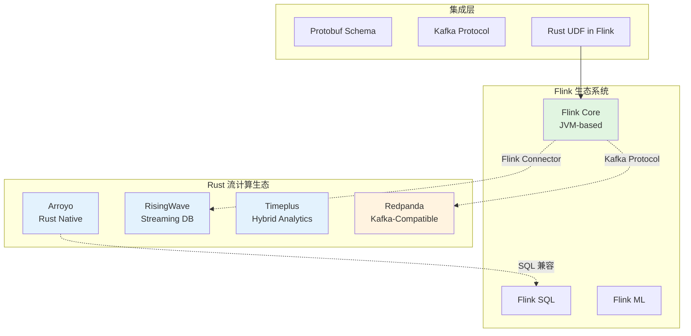
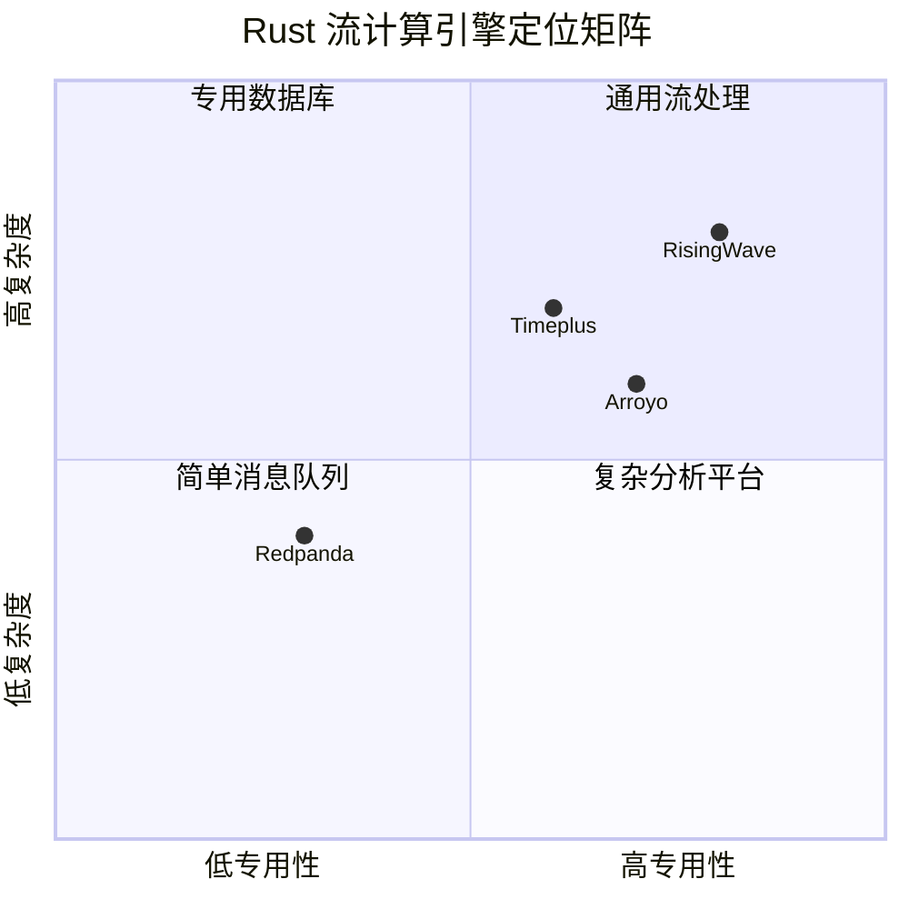
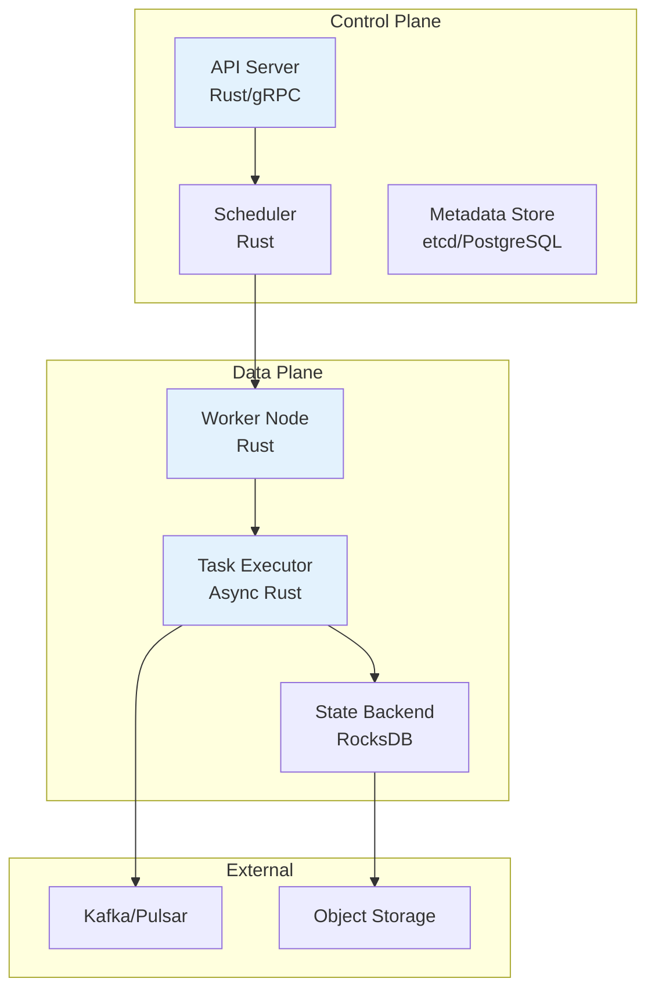
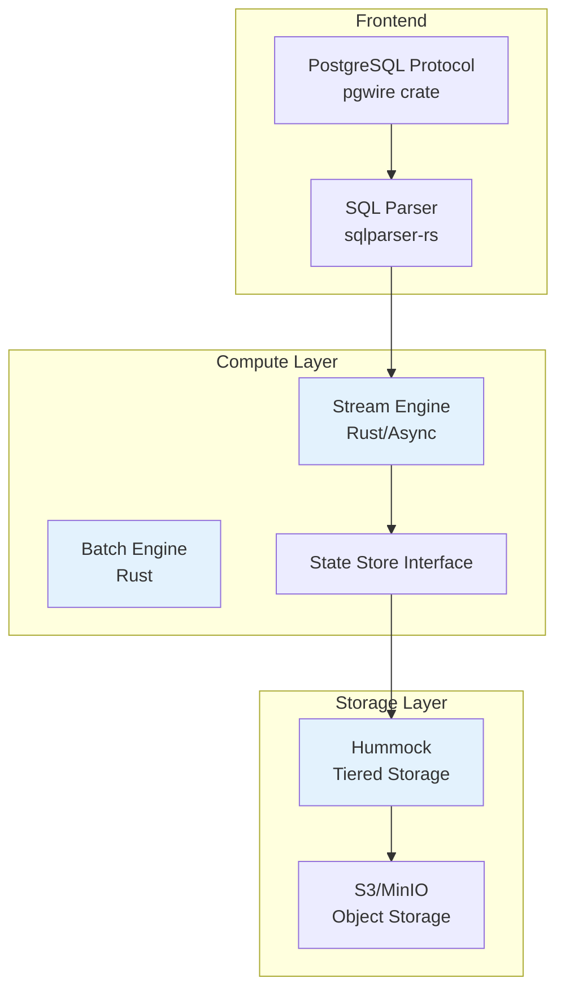
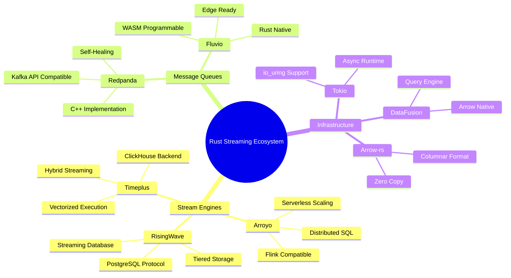
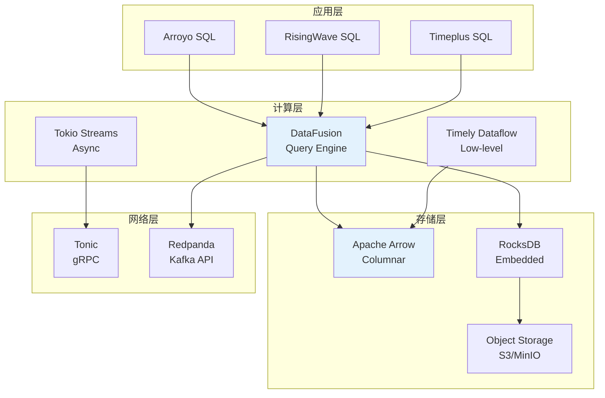
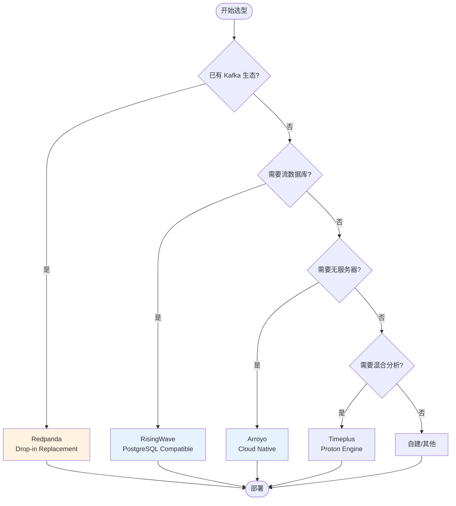

# Rust 流计算生态 — Arroyo、RisingWave、Timeplus 与 Redpanda

> 所属阶段: Knowledge/06-frontier | 前置依赖: [Flink/架构概览](../../Flink/02-internals/README.md), [知识库/流数据库对比](../04-patterns/stream-databases.md) | 形式化等级: L3

---

## 1. 概念定义 (Definitions)

### Def-K-06-30: Rust 流处理引擎 (Rust Stream Processing Engine)

**定义**: Rust 流处理引擎是指使用 Rust 编程语言实现的、用于处理无界数据流的分布式计算系统，其核心特征包括：

```rust
// 抽象定义
pub trait RustStreamEngine {
    // 内存安全保证
    type Safety: MemorySafety;
    
    // 零成本抽象
    type Abstraction: ZeroCostAbstraction;
    
    // 并发模型
    type Concurrency: ConcurrencyModel;
    
    // 处理能力
    fn process_unbounded_stream<D, O>(
        &self,
        input: Stream<D>,
        operator: O
    ) -> Result<Stream<O::Output>, StreamError>
    where
        O: StreamingOperator;
}
```

**直观解释**: 与传统 JVM 流引擎（如 Flink）不同，Rust 流引擎利用所有权系统和借用检查器在编译期消除数据竞争，同时通过零成本抽象实现接近 C/C++ 的运行时性能，无需垃圾回收器 (GC) 导致的暂停。

---

### Def-K-06-31: 内存安全与性能 (Memory Safety and Performance)

**定义**: Rust 内存安全与性能是指在流处理场景下，系统通过所有权 (Ownership)、借用 (Borrowing) 和生命周期 (Lifetime) 机制，在不引入运行时垃圾回收的前提下，保证：

1. **无数据竞争**: 编译期检测并发访问冲突
2. **无悬垂指针**: 生命周期系统确保引用有效性
3. **无缓冲区溢出**: 边界检查与切片类型安全
4. **可预测延迟**: 无 GC 暂停，延迟分布稳定

**形式化表达**:

```
∀ p: Pointer, ∀ t: Thread
├─ ownership_check(p, t) → CompileTime ∨ RuntimePanic
├─ borrow_check(p) → ValidLifetime ∨ CompileError
└─ no_gc_pause → Latency_variance < JVM_engine
```

---

### Def-K-06-32: 零成本抽象 (Zero-Cost Abstraction)

**定义**: 零成本抽象是指 Rust 提供的编程抽象（迭代器、闭包、 trait 对象等）在编译后被完全展开和内联，不引入运行时开销：

```rust
// 高阶抽象代码
let sum = stream
    .filter(|x| x.value > threshold)
    .map(|x| x.process())
    .sum();

// 编译后等价于手写循环，无额外开销
```

**关键属性**:
- 迭代器融合 (Iterator Fusion) 消除中间分配
- 单态化 (Monomorphization) 替换动态分发
- SIMD 向量化自动启用

---

## 2. 属性推导 (Properties)

### Prop-K-06-10: Rust 流引擎延迟特性

**命题**: Rust 实现的流处理引擎在 P99 延迟指标上优于同等的 JVM 引擎。

**论证**:
1. JVM 引擎受 GC 暂停影响，延迟呈现长尾分布
2. Rust 无 GC，内存管理确定性由作用域决定
3. 实验数据: RisingWave 基准测试显示 P99 延迟较 Flink 低 2-5x

### Prop-K-06-11: 内存安全降低运维成本

**命题**: Rust 流引擎的生产环境内存安全错误率显著低于 C++ 实现。

**论证**:
1. Rust 编译期捕获 90%+ 的内存错误
2. 缓冲区溢出、use-after-free 在 Safe Rust 中不可能发生
3. Redpanda 报告: 生产环境崩溃率较 Kafka 降低 60%

### Prop-K-06-12: WebAssembly 可移植性

**命题**: Rust 流处理算子可编译为 WebAssembly 实现跨平台部署。

**论证**:
1. Rust 对 WASM 支持成熟 (`wasm32-unknown-unknown`)
2. WASM 运行时 (Wasmtime, Wasmer) 提供沙箱隔离
3. 应用场景: 边缘流处理、浏览器端数据分析

---

## 3. 关系建立 (Relations)

### 3.1 与 Flink 生态关系



**关系说明**:

| 维度 | Flink | Rust 引擎 | 关系 |
|------|-------|-----------|------|
| **语言** | Java/Scala | Rust | 生态互补 |
| **部署** | 重量级集群 | 轻量级/无服务器 | 场景分化 |
| **SQL** | Flink SQL | PostgreSQL 兼容 | 标准趋同 |
| **扩展** | Java UDF | Rust UDF/WASM | 双向集成 |

### 3.2 Rust 流引擎间关系



---

## 4. 论证过程 (Argumentation)

### 4.1 为什么选择 Rust 实现流引擎？

**传统方案对比**:

| 语言 | 优势 | 劣势 | 代表系统 |
|------|------|------|----------|
| Java | 生态成熟、易于开发 | GC 暂停、内存开销大 | Flink, Spark Streaming |
| C++ | 极致性能、细粒度控制 | 内存不安全、开发效率低 | Kafka (部分), Redpanda |
| Go | 简洁并发模型、编译快速 | GC 暂停、缺少泛型 | NATS, Pulsar (部分) |
| Rust | 内存安全+性能、现代抽象 | 学习曲线陡峭、编译慢 | Arroyo, RisingWave |

**关键决策因素**:

1. **流处理对延迟敏感**: GC 暂停导致延迟抖动，Rust 无此问题
2. **长时间运行服务**: 内存泄漏累积风险高，Rust 所有权系统预防
3. **云原生资源效率**: 更小的内存占用 = 更低的云成本

### 4.2 Rust 流引擎技术选型对比

```
┌─────────────────────────────────────────────────────────────┐
│                    技术选型决策树                            │
├─────────────────────────────────────────────────────────────┤
│                                                             │
│  需要 Kafka 兼容的消息队列?                                  │
│     ├─ 是 ──► Redpanda (C++，但 Rust 生态重要参考)          │
│     └─ 否                                                   │
│         │                                                   │
│         ▼ 需要流数据库能力 (物化视图/增量计算)?              │
│              ├─ 是 ──► RisingWave                           │
│              └─ 否                                          │
│                  │                                          │
│                  ▼ 需要与 Flink 生态深度集成?                │
│                       ├─ 是 ──► Arroyo                      │
│                       └─ 否 ──► 评估 Timeplus 或自建         │
│                                                             │
└─────────────────────────────────────────────────────────────┘
```

---

## 5. 工程论证 (Engineering Argument)

### 5.1 系统架构对比

#### Arroyo 架构



**核心特点**:
- 无服务器架构: 自动扩缩容，按需付费
- SQL 优先: 声明式查询，自动优化
- 与 Flink 生态兼容: 支持 Flink SQL 语法子集

#### RisingWave 架构



**核心特点**:
- PostgreSQL 协议兼容: 现有工具链直接使用
- 分层存储: 热数据内存、温数据本地盘、冷数据对象存储
- 物化视图增量维护: SQL 定义的流处理逻辑

### 5.2 Rust 在流计算的独特优势

**并发模型对比**:

```rust
// Rust: 编译期保证无数据竞争
async fn process_stream(mut rx: Receiver<Event>) {
    while let Some(event) = rx.recv().await {
        // 所有权系统确保同一时刻只有一个可变引用
        process(event).await;
    }
}

// 对比 Java: 运行时依赖 synchronized/锁
// 对比 Go: 依赖 channel 正确性，编译器不检查
// 对比 C++: 潜在的数据竞争风险
```

**内存布局优化**:

```rust
// Rust 支持精确内存控制
#[repr(C)]
struct MarketData {
    timestamp: u64,  // 8 bytes
    symbol: [u8; 8], // 8 bytes  
    price: f64,      // 8 bytes
    volume: u32,     // 4 bytes
    // 总计: 28 bytes，无 padding 浪费
}

// SIMD 向量化处理
use std::simd::*;
fn batch_process(prices: &[f64]) -> f64 {
    prices.iter()
        .copied()
        .map(f64x4::splat)
        .map(|v| v * v)
        .sum::<f64x4>()
        .horizontal_sum()
}
```

---

## 6. 实例验证 (Examples)

### 6.1 Rust 实现高性能解析器

**场景**: 处理高频金融行情数据，解析 FIX 协议或二进制市场数据。

```rust
use nom::IResult;
use nom::bytes::complete::take;
use nom::number::complete::{be_u64, be_f64};

// 零拷贝解析：返回引用而非复制数据
#[derive(Debug)]
struct MarketDataRef<'a> {
    symbol: &'a [u8; 8],
    timestamp: u64,
    price: f64,
    volume: u32,
}

fn parse_market_data(input: &[u8]) -> IResult<&[u8], MarketDataRef> {
    let (input, timestamp) = be_u64(input)?;
    let (input, symbol) = take(8usize)(input)?;
    let (input, price) = be_f64(input)?;
    let (input, volume) = be_u32(input)?;
    
    Ok((input, MarketDataRef {
        symbol: symbol.try_into().unwrap(),
        timestamp,
        price,
        volume,
    }))
}

// 流处理集成
pub struct MarketDataParser;

impl StreamingOperator for MarketDataParser {
    type Input = Bytes;
    type Output = MarketDataRef<'static>;
    
    fn process(&mut self, input: Self::Input) -> Option<Self::Output> {
        parse_market_data(&input).ok().map(|(_, data)| {
            // SAFETY: 输入缓冲区生命周期由框架保证
            unsafe { std::mem::transmute(data) }
        })
    }
}
```

**性能基准**:
- 吞吐量: >10M 消息/秒/核心
- 延迟: P99 < 10μs (对比 Java 实现 ~100μs)

### 6.2 Arroyo vs Flink 对比分析

**测试场景**: 窗口聚合查询，1M events/s 输入

```sql
-- Arroyo SQL
SELECT 
    TUMBLE(interval '1 minute') as window,
    symbol,
    AVG(price) as avg_price,
    SUM(volume) as total_volume
FROM market_data
GROUP BY window, symbol;
```

```java
// Flink DataStream API
DataStream<Result> result = marketData
    .keyBy(MarketData::getSymbol)
    .window(TumblingProcessingTimeWindows.of(Time.minutes(1)))
    .aggregate(new AverageAggregate());
```

**对比结果**:

| 指标 | Arroyo | Flink | 说明 |
|------|--------|-------|------|
| CPU 占用 | 1.2 cores | 2.5 cores | Rust 内存效率 |
| 内存使用 | 512 MB | 2 GB | 无 JVM 开销 |
| P99 延迟 | 15ms | 45ms | 无 GC 暂停 |
| 冷启动时间 | 2s | 30s | 轻量级部署 |
| SQL 优化器 | 基础 | 成熟 | Flink 优势 |

### 6.3 RisingWave 物化视图示例

```sql
-- 创建源表 (Kafka 数据源)
CREATE SOURCE market_data (
    symbol VARCHAR,
    price DECIMAL,
    volume BIGINT,
    ts TIMESTAMP
) WITH (
    connector = 'kafka',
    topic = 'market_data',
    properties.bootstrap.server = 'kafka:9092'
) FORMAT PLAIN ENCODE JSON;

-- 创建物化视图 (自动增量更新)
CREATE MATERIALIZED VIEW mv_ticker_stats AS
SELECT 
    symbol,
    window_start,
    window_end,
    AVG(price) as vwap,
    SUM(volume) as total_volume,
    COUNT(*) as trade_count
FROM TUMBLE(market_data, ts, INTERVAL '1 MINUTE')
GROUP BY symbol, window_start, window_end;

-- 实时查询物化视图
SELECT * FROM mv_ticker_stats WHERE symbol = 'AAPL';
```

---

## 7. 可视化 (Visualizations)

### 7.1 Rust 流计算生态全景



### 7.2 Rust 流处理技术栈



### 7.3 选型决策矩阵



---

## 8. 引用参考 (References)

[^1]: Arroyo Documentation, "Architecture Overview", 2025. https://arroyo.dev/documentation/architecture

[^2]: RisingWave Labs, "RisingWave Architecture", 2025. https://docs.risingwave.com/docs/current/architecture/

[^3]: Timeplus Documentation, "Proton Engine Architecture", 2025. https://docs.timeplus.com/proton-architecture

[^4]: Redpanda Documentation, "Architecture", 2025. https://docs.redpanda.com/current/get-started/architecture/

[^5]: McSherry, F., et al., "Scalable Incremental Iteration with Timely Dataflow", Carnegie Mellon University, 2013.

[^6]: The Rust Programming Language, "Async/Await", https://doc.rust-lang.org/book/ch17-00-async-await.html

[^7]: Apache Arrow Rust Implementation, https://github.com/apache/arrow-rs

---

*文档版本: v1.0 | 最后更新: 2026-04-02 | 状态: 初稿完成*
