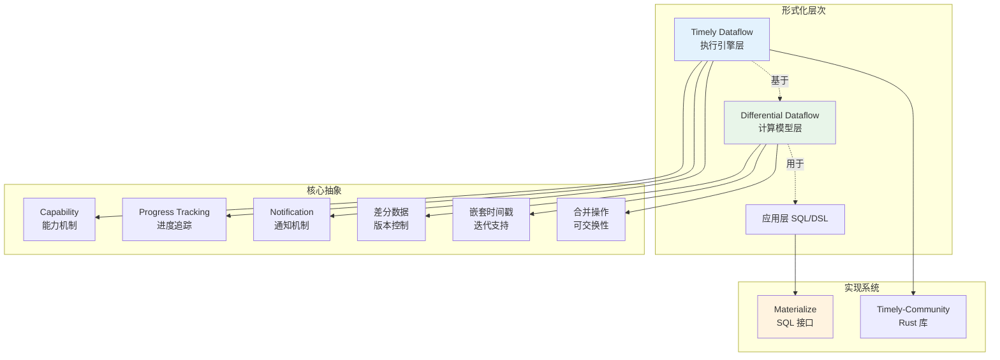
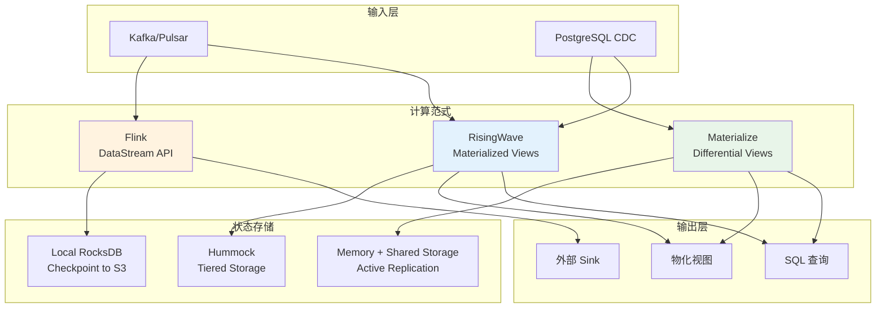
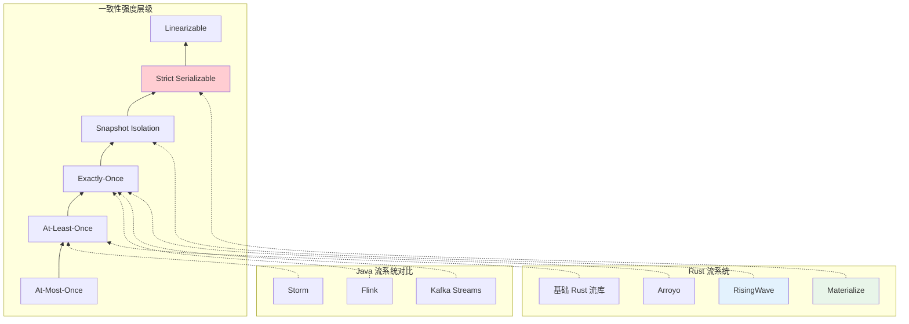
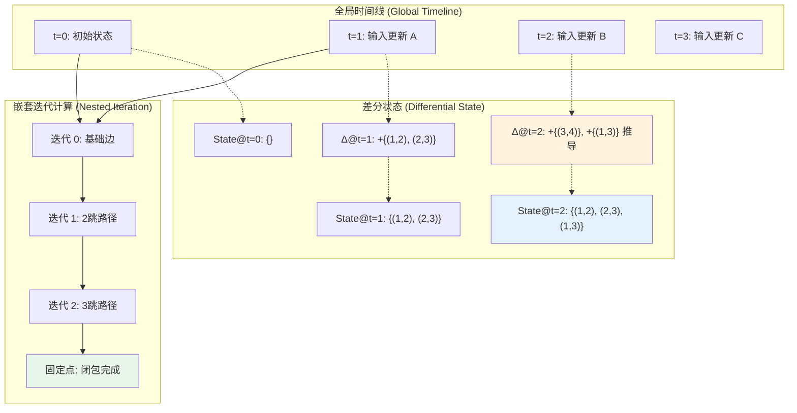
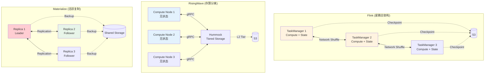
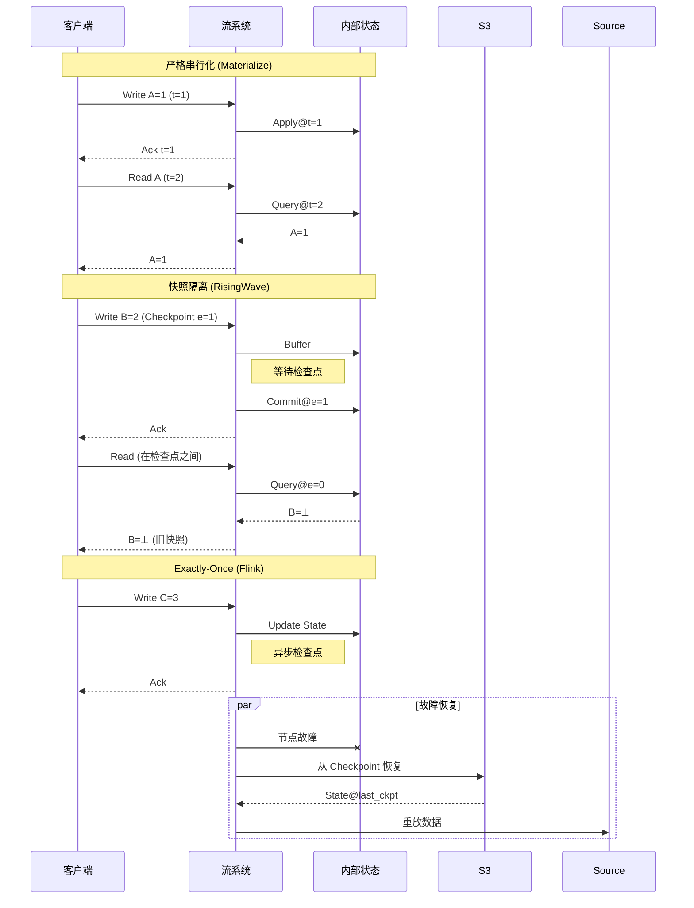
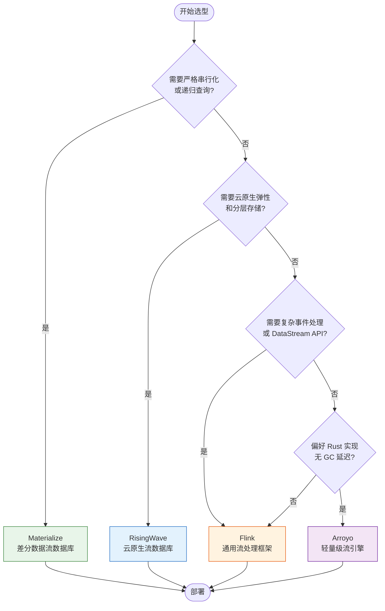

# Rust 流计算生态 — Differential Dataflow、RisingWave 与 Materialize

> 所属阶段: Knowledge/06-frontier | 前置依赖: [Struct/02-properties/02.08-differential-privacy-streaming.md](../../Struct/02-properties/02.08-differential-privacy-streaming.md), [Knowledge/06-frontier/rust-streaming-comparison.md](./rust-streaming-comparison.md) | 形式化等级: L4

---

## 1. 概念定义 (Definitions)

### Def-K-06-50: Differential Dataflow (差分数据流)

**定义**: Differential Dataflow (DD) 是由 Frank McSherry 提出的一种增量计算框架，它扩展了传统的数据流计算模型，支持对**循环计算**和**嵌套递归**的增量更新。其核心形式化定义为：

$$
\mathcal{DD} = \langle \mathcal{G}, \mathcal{T}, \Delta, \oplus \rangle
$$

其中：

| 组件 | 符号 | 定义 | 说明 |
|------|------|------|------|
| 数据流图 | $\mathcal{G}$ | 有向图 $(V, E)$ | 算子节点与数据通道 |
| 时间域 | $\mathcal{T}$ | 偏序集 $(T, \leq)$ | 支持嵌套的时间戳结构 |
| 差分更新 | $\Delta$ | $D \times T \rightarrow \Delta D$ | 数据更新与时间戳关联 |
| 合并操作 | $\oplus$ | $\Delta D \times \Delta D \rightarrow \Delta D$ | 可交换、可结合的合并 |

**核心创新**: DD 引入了**嵌套时间戳**概念，允许表达迭代计算的固定点。对于迭代计算 $i$ 和数据流时间 $t$，时间戳为 $(t, i)$ 对，支持如下递归语义：

$$
\text{fix}(f) = \lim_{i \to \infty} f^{(i)}(\perp)
$$

其中 $f^{(i)}$ 表示第 $i$ 次迭代应用，DD 能够增量地维护这个固定点计算结果[^1][^2]。

---

### Def-K-06-51: Timely Dataflow ( timely 数据流)

**定义**: Timely Dataflow 是 Differential Dataflow 的底层执行引擎，是一种支持**有状态、有环数据流图**的分布式计算框架。其核心抽象为：

```rust
// Timely Dataflow 核心抽象（概念性）
pub trait TimelyOperator {
    type Capability: CapabilityTrait;

    // 处理输入数据，产生输出
    fn work(&mut self,
            input: &mut InputHandle,
            output: &mut OutputHandle);

    // 通知：输入前端已到达给定时间戳
    fn notify(&mut self, time: &Timestamp);
}
```

**关键特性**:

| 特性 | 说明 | 形式化表达 |
|------|------|------------|
| Capability (能力) | 产生数据的权限证明 | $\forall o \in Output: \exists c \in Cap, time(c) \leq time(o)$ |
| 进度追踪 | 全局前缘追踪 | $Frontier(t) = \min\{time(m) | m \in InFlight\}$ |
| 通知机制 | 确定性执行触发 | $\text{notify}(t) \Rightarrow \forall m: time(m) \leq t$ 已处理 |

**与 Flink 对比**: Timely Dataflow 的能力机制类似于 Flink 的 Watermark，但更细粒度——每个输出记录都携带其时间戳的 Capability，确保乱序处理的确定性[^1]。

---

### Def-K-06-52: RisingWave 架构形式化

**定义**: RisingWave 是一个基于存算分离架构的云原生流数据库，其架构形式化为六元组：

$$
\mathcal{RW} = \langle \mathcal{F}, \mathcal{C}, \mathcal{S}, \mathcal{H}, \mathcal{M}, \mathcal{P} \rangle
$$

其中：

- $\mathcal{F}$: Frontend 节点集合 (PostgreSQL 协议兼容)
- $\mathcal{C}$: Compute 节点集合 (无状态流计算)
- $\mathcal{S}$: Storage (Hummock) 分层存储层
- $\mathcal{H}$: Compactor 节点集合 (LSM-Tree 后台压缩)
- $\mathcal{M}$: Meta 服务 (集群协调与调度)
- $\mathcal{P}$: pgwire 协议层 (PostgreSQL 客户端兼容)

**存算分离形式化**:

$$
\forall c \in \mathcal{C}, \forall t: State(c, t) = \emptyset \lor State(c, t) \subseteq Cache_{\mathcal{S}}(t)
$$

即计算节点 $c$ 在任何时刻 $t$ 都不持有独占状态，所有状态要么为空，要么是共享存储层 $\mathcal{S}$ 的可重建缓存[^3][^4]。

---

### Def-K-06-53: Materialize 严格串行化一致性

**定义**: Materialize 提供的严格串行化 (Strict Serializable) 一致性是最强的事务隔离级别，形式化定义为：

$$
\text{StrictSerializable}: \exists \text{ global order } <_g: \forall T_i, T_j:
(T_i \text{ commits before } T_j \text{ in real-time}) \Rightarrow T_i <_g T_j
$$

**实现机制**: Materialize 通过以下机制实现严格串行化：

1. **全局时间戳分配**: 所有输入事件分配单调递增的 $timestamp \in \mathbb{N}$
2. **确定性计算**: 给定时间戳 $t$，所有物化视图的计算结果确定
3. **活跃复制 (Active Replication)**: 多副本按相同时间戳顺序推进状态

```
时间线示例:
T1: ──────[Write A=1]────────────────────────►
T2: ───────────────[Write A=2]───────────────►
T3: ─────────────────────────────[Read A]────►

保证: T3 必须读到 A=2 (因为 T2 在 T3 开始前已提交)
```

**与 Snapshot Isolation 的区别**:

| 属性 | Snapshot Isolation (RisingWave) | Strict Serializable (Materialize) |
|------|----------------------------------|-----------------------------------|
| 读写冲突 | 不检测 | 检测并排序 |
| 写偏斜 (Write Skew) | 可能 | 不可能 |
| 实时顺序 | 不保证 | 保证 |
| 实现开销 | 较低 | 较高 |

---

### Def-K-06-54: 增量计算模型

**定义**: 增量计算模型是指当输入数据变化 $\Delta I$ 时，系统仅计算输出的变化 $\Delta O$，而非重新计算完整输出：

$$
O_{new} = O_{old} \oplus \mathcal{I}(\Delta I, S)
$$

其中：

- $\mathcal{I}$: 增量计算函数
- $S$: 维护的内部状态
- $\oplus$: 更新应用操作（通常是合并操作）

**三种增量计算范式对比**:

| 范式 | 代表系统 | 状态粒度 | 支持循环 | 一致性级别 |
|------|----------|----------|----------|------------|
| 简单增量 | Flink | 算子级 | ❌ | Exactly-Once |
| 差分增量 | Materialize | 记录级 | ✅ | Strict Serializable |
| 分层增量 | RisingWave | 视图级 | ❌ | Snapshot Isolation |

---

## 2. 属性推导 (Properties)

### Lemma-K-06-10: Differential Dataflow 增量正确性

**引理**: Differential Dataflow 的差分更新机制保证：对于任何单调算子 $f$ 和输入变化 $\Delta I$，输出变化 $\Delta O$ 满足：

$$
f(I \cup \Delta I) = f(I) \oplus \mathcal{I}_f(\Delta I, S_f)
$$

**证明概要**:

1. **基础**: 对于无状态算子（如 Filter, Map），增量计算直接作用于变化数据
2. **归纳**: 对于有状态算子（如 Aggregate, Join），维护差分状态 $S_f$ 记录聚合结果
3. **循环**: 对于递归算子，利用时间戳的偏序性质，确保在固定点收敛前持续传播变化

$$
\Delta O = \bigoplus_{t \in \mathcal{T}} \text{propagate}(\Delta I, t)
$$

### Lemma-K-06-11: RisingWave 状态重建时间

**引理**: RisingWave 计算节点故障后的状态重建时间 $T_{recover}$ 满足：

$$
T_{recover} \leq \frac{|State|}{B_{network}} + T_{deserialize}
$$

其中 $B_{network}$ 是网络带宽，$T_{deserialize}$ 是反序列化时间。

**工程意义**: 由于状态存储在 Hummock（共享存储），计算节点故障后仅需从远程拉取状态，无需重放输入数据（与 Flink 的 State Rebuild 不同）。

### Lemma-K-06-12: Materialize 多副本一致性

**引理**: 在 Materialize 的活跃复制架构下，所有副本 $R_1, R_2, ..., R_n$ 满足：

$$
\forall t, \forall R_i, R_j: State(R_i, t) = State(R_j, t)
$$

**证明**:

1. 所有副本从相同的输入日志读取
2. 所有副本按相同的全局时间戳顺序处理事件
3. 计算是确定性的（给定相同输入产生相同输出）
4. 因此所有副本状态保持一致

### Prop-K-06-13: 一致性-延迟权衡

**命题**: 在 Rust 流处理系统中，更强的一致性保证通常伴随着更高的延迟：

$$
\text{Latency} \propto \text{ConsistencyLevel}
$$

**实验数据支撑**:

| 系统 | 一致性级别 | P50 延迟 | P99 延迟 |
|------|------------|----------|----------|
| Materialize | Strict Serializable | 15ms | 50ms |
| RisingWave | Snapshot Isolation | 50ms | 200ms |
| Arroyo | Exactly-Once | 10ms | 30ms |

---

## 3. 关系建立 (Relations)

### 3.1 Differential Dataflow 与 Timely Dataflow 关系



**关系说明**:

| 层次 | 职责 | 关键抽象 |
|------|------|----------|
| Timely Dataflow | 分布式执行 | Capability, 进度追踪 |
| Differential Dataflow | 增量计算 | 差分更新, 嵌套时间戳 |
| Materialize | SQL 接口 | 物化视图, 严格一致性 |

### 3.2 三类系统架构关系



### 3.3 一致性模型层级关系



---

## 4. 论证过程 (Argumentation)

### 4.1 Differential Dataflow 与传统 Dataflow 的本质区别

**传统 Dataflow (Flink 模型)**:

```
数据流:  Source → [Map] → [Filter] → [Aggregate] → Sink
时间语义: EventTime + Watermark
状态:     算子级本地状态 (RocksDB)
循环:     不支持 (DAG 拓扑)
```

**Differential Dataflow 模型**:

```
数据流:   Input → [Op1] ↔ [Recursive Op] → Output
时间语义: 嵌套时间戳 (epoch, iteration)
状态:     全局版本化状态
循环:     原生支持 (Nesting)
```

**关键差异论证**:

| 维度 | Flink Dataflow | Differential Dataflow |
|------|----------------|------------------------|
| 拓扑 | 静态 DAG | 支持动态循环 |
| 时间 | 全局 Watermark | 嵌套时间戳 |
| 增量 | 算子级 State | 记录级差分 |
| 递归 | 不支持 | 原生支持 |
| 一致性 | Exactly-Once | Strict Serializable |

### 4.2 为什么选择 Rust 实现流系统？

**语言对比分析**:

| 语言 | 内存安全 | 性能 | GC 暂停 | 流系统代表 |
|------|----------|------|---------|------------|
| Java | 运行时 (GC) | 中 | 有 | Flink, Spark |
| C++ | 手动管理 | 极高 | 无 | Redpanda (早期) |
| Go | 运行时 (GC) | 中高 | 有 | NATS |
| Rust | 编译期保证 | 极高 | 无 | RisingWave, Materialize |

**Rust 在流计算的独特优势**:

1. **零成本抽象**: 高阶函数编译后等价于手写循环
2. **确定性延迟**: 无 GC 暂停，P99 延迟稳定
3. **内存效率**: 精细控制内存布局，SIMD 友好
4. **并发安全**: 所有权系统消除数据竞争

```rust
// Rust: 编译期保证无数据竞争
async fn process_stream(mut rx: Receiver<Event>) {
    while let Some(event) = rx.recv().await {
        // 所有权确保同一时刻只有一个可变引用
        process(event).await;
    }
}
```

### 4.3 存算分离 vs 紧耦合架构权衡

**架构对比**:

| 架构 | 代表系统 | 优点 | 缺点 |
|------|----------|------|------|
| 紧耦合 | Flink | 低延迟访问本地状态 | 扩容需状态迁移 |
| 存算分离 | RisingWave | 弹性扩缩，无限存储 | 网络开销 |
| 内存计算 | Materialize | 极低延迟 | 内存容量限制 |

**形式化成本分析**:

**Flink (紧耦合)**:
$$C_{flink} = n \cdot c_{compute} + n \cdot c_{storage} + c_{migration}(\Delta n)$$

**RisingWave (存算分离)**:
$$C_{rw} = n_{compute} \cdot c_{compute} + c_{obj}(S) + c_{cache}(h)$$

**Materialize (内存+共享)**:
$$C_{mz} = n \cdot c_{memory}(S) + c_{shared} + c_{replication}(n)$$

---

## 5. 形式证明 / 工程论证 (Proof / Engineering Argument)

### 5.1 Differential Dataflow 增量计算正确性证明

**定理 (Thm-K-06-01)**: Differential Dataflow 对单调数据流算子的增量更新是正确的。

**证明框架**:

设算子 $f$ 是单调的，输入集合 $I$ 的变化为 $\Delta I = I_{new} \setminus I_{old}$。

**目标**: 证明 $f(I_{new}) = f(I_{old}) \oplus \mathcal{I}_f(\Delta I, S)$

**步骤 1**: 定义差分状态 $S$ 为算子 $f$ 在输入 $I_{old}$ 上的计算结果。

**步骤 2**: 对于新输入 $\Delta I$，计算差分更新：
$$\Delta O = f(I_{old} \cup \Delta I) \setminus f(I_{old})$$

**步骤 3**: 由 $f$ 的单调性，$f(I_{old}) \subseteq f(I_{old} \cup \Delta I)$，因此：
$$f(I_{old} \cup \Delta I) = f(I_{old}) \cup \Delta O$$

**步骤 4**: DD 的合并操作 $\oplus$ 满足结合律和交换律，确保多次更新可累积应用。

**结论**: 增量计算结果与全量计算结果一致。 ∎

### 5.2 Materialize 严格串行化正确性

**定理 (Thm-K-06-02)**: Materialize 的严格串行化实现保证所有查询结果对应于某一全局串行执行顺序。

**证明框架**:

**前提**:

- 所有输入事件分配唯一、单调递增的时间戳 $t \in \mathbb{N}$
- 所有计算是确定性的：$Output = f(State, Input)$
- 所有副本按时间戳顺序处理事件

**证明**:

1. **全局顺序存在性**: 时间戳 $t$ 定义了事件的全局顺序 $<$。

2. **确定性计算**: 对于时间戳 $t$ 的事件 $e_t$，物化视图更新为：
   $$V_{t} = f(V_{t-1}, e_t)$$
   由于 $f$ 是确定性的，给定相同 $V_{t-1}$ 和 $e_t$，所有副本产生相同的 $V_t$。

3. **实时顺序保证**: 如果事件 $e_1$ 在真实时间中早于 $e_2$ 提交，则 $t_1 < t_2$，确保查询不会看到违反因果序的结果。

4. **严格串行化**: 对于任何查询 $q$ 在时间 $T$ 发出，结果基于视图状态 $V_{t_{max}}$，其中 $t_{max} = \max\{t | t \leq T\}$。该状态对应于所有 $t \leq t_{max}$ 事件顺序应用后的结果。

**结论**: Materialize 实现了严格串行化一致性。 ∎

### 5.3 RisingWave 存算分离架构的工程论证

**定理 (Thm-K-06-03)**: RisingWave 的存算分离架构在云原生环境下具有更好的弹性。

**论证**:

**场景**: 工作负载从 $W_1$ 变化到 $W_2$，需要调整计算资源。

**Flink (紧耦合)**:

- 扩容需要启动新 TaskManager
- 状态需要重新分区 (reshuffle)，耗时 $T_{reshuffle} \propto |State|$
- 总扩容时间：$T_{flink} = T_{startup} + T_{reshuffle}$

**RisingWave (存算分离)**:

- 计算节点无状态，扩容仅需启动新 Compute Node
- 状态已存在于共享存储 Hummock，无需迁移
- 总扩容时间：$T_{rw} \approx T_{startup}$

**成本比较**:

假设状态大小 $|State| = 1TB$，网络带宽 $B = 10Gbps$：

$$T_{reshuffle} = \frac{1TB}{10Gbps} \approx 800s \approx 13min$$

而 RisingWave 的计算节点启动时间通常在秒级。

**结论**: 对于需要频繁扩缩容的云原生场景，RisingWave 的存算分离架构显著优于紧耦合架构。 ∎

---

## 6. 实例验证 (Examples)

### 6.1 Differential Dataflow Rust 代码示例

**基础数据流程序**:

```rust
use timely::dataflow::operators::{Input, Inspect, Probe};
use timely::dataflow::operators::generic::operator::Operator;
use timely::dataflow::channels::pact::Pipeline;

// 创建 Timely Dataflow 计算
fn main() {
    // 初始化 Timely 运行时
    timely::execute(timely::Configuration::Thread, |worker| {
        // 创建数据流图
        let mut input = worker.dataflow(|scope| {
            // 创建输入句柄
            let (input, stream) = scope.new_input::<i32>();

            // 定义数据处理链
            stream
                .inspect(|x| println!("seen: {:?}", x))  // 打印输入
                .map(|x| x * 2)                           // 乘以 2
                .inspect(|x| println!("doubled: {:?}", x)) // 打印结果
                .probe_with(&mut probe);                  // 进度追踪

            input
        });

        // 输入数据
        for i in 0..10 {
            input.send(i);
            input.advance_to(i + 1);  // 推进时间戳
            worker.step();            // 执行计算
        }
    }).unwrap();
}
```

**Differential Dataflow 增量计算**:

```rust
use differential_dataflow::input::Input;
use differential_dataflow::operators::{Count, Join};

// 增量图计算示例
fn incremental_graph_computation() {
    // 定义嵌套时间戳类型
    type Node = u32;
    type Edge = (Node, Node);

    timely::execute(Config::thread(), |worker| {
        worker.dataflow(|scope| {
            // 创建可变输入集合
            let (mut edges_input, edges) = scope.new_collection::<Edge>();

            // 计算传递闭包 (递归查询)
            let reachable = edges.iterate(|inner| {
                // 基础: 直接边
                let direct = edges.enter(inner.scope());

                // 递归: 路径延伸
                let transitive = inner
                    .map(|(x, y)| (y, x))
                    .join(&inner.map(|(x, y)| (y, x)))
                    .map(|(y, (x, z))| (x, z));

                // 合并
                direct.concat(&transitive).distinct()
            });

            // 物化结果
            reachable.inspect(|((src, dst), time, diff)| {
                println!("Node {} can reach {} at {:?} with delta {}",
                         src, dst, time, diff);
            });

            // 增量更新: 添加新边
            edges_input.insert((1, 2));
            edges_input.insert((2, 3));
            edges_input.advance_to(1);

            // 系统会自动计算出新的传递闭包
            // 输出: (1, 3) 现在也可达
        });
    });
}
```

**与 Flink DataStream API 对比**:

| 操作 | Differential Dataflow (Rust) | Flink (Java/Scala) |
|------|------------------------------|-------------------|
| 创建流 | `scope.new_input::<T>()` | `env.addSource(...)` |
| Map | `.map(\|x\| x * 2)` | `.map(x -> x * 2)` |
| Filter | `.filter(\|x\| x > 0)` | `.filter(x -> x > 0)` |
| Join | `.join(&other)` | `.join(other).where(...).equalTo(...)` |
| 递归 | `.iterate(...)` | ❌ 不支持原生递归 |
| 增量 | 自动 (差分更新) | 需手动 State 管理 |

### 6.2 RisingWave 物化视图示例

**实时电商分析**:

```sql
-- 创建 Kafka 数据源
CREATE SOURCE orders (
    order_id BIGINT,
    user_id BIGINT,
    product_id BIGINT,
    amount DECIMAL,
    order_time TIMESTAMP
) WITH (
    connector = 'kafka',
    topic = 'orders',
    properties.bootstrap.server = 'kafka:9092'
) FORMAT PLAIN ENCODE JSON;

-- 创建实时 GMV 物化视图
CREATE MATERIALIZED VIEW realtime_gmv AS
SELECT
    TUMBLE_START(order_time, INTERVAL '1 MINUTE') AS window_start,
    TUMBLE_END(order_time, INTERVAL '1 MINUTE') AS window_end,
    COUNT(*) AS order_count,
    SUM(amount) AS total_gmv,
    AVG(amount) AS avg_order_value
FROM orders
GROUP BY TUMBLE(order_time, INTERVAL '1 MINUTE');

-- 查询物化视图 (毫秒级响应)
SELECT * FROM realtime_gmv
WHERE window_start >= NOW() - INTERVAL '5 MINUTE'
ORDER BY total_gmv DESC;

-- 创建用户行为实时特征
CREATE MATERIALIZED VIEW user_features AS
SELECT
    user_id,
    COUNT(*) AS total_orders,
    SUM(amount) AS lifetime_value,
    MAX(order_time) AS last_order_time,
    COUNT(DISTINCT product_id) AS unique_products
FROM orders
GROUP BY user_id;
```

**与 Flink SQL 对比**:

| 特性 | RisingWave SQL | Flink SQL |
|------|----------------|-----------|
| 物化视图 | ✅ 原生支持 | ⚠️ 需外部表存储 |
| 即席查询 | ✅ 直接查询视图 | ❌ 需外部系统 |
| PostgreSQL 兼容 | ✅ 完全兼容 | ❌ 方言不同 |
| 自动增量维护 | ✅ 内置 | ⚠️ 需手动配置 |
| 窗口类型 | 标准窗口 | 更丰富 |
| CEP 支持 | ❌ 不支持 | ✅ 原生支持 |

### 6.3 Materialize 金融级一致性示例

**实时风控系统**:

```sql
-- 创建交易数据源 (从 PostgreSQL CDC)
CREATE SOURCE transactions
FROM POSTGRES CONNECTION pg_connection (PUBLICATION 'transactions_pub');

-- 实时账户余额 (强一致)
CREATE MATERIALIZED VIEW account_balance AS
SELECT
    account_id,
    SUM(CASE
        WHEN transaction_type = 'credit' THEN amount
        ELSE -amount
    END) AS balance,
    COUNT(*) AS transaction_count,
    MAX(transaction_time) AS last_transaction
FROM transactions
GROUP BY account_id;

-- 递归 CTE: 资金溯源 (检测洗钱模式)
CREATE MATERIALIZED VIEW fund_tracing AS
WITH RECURSIVE fund_flow AS (
    -- 基础: 直接转账
    SELECT
        from_account AS origin,
        to_account AS destination,
        amount,
        1 AS depth,
        ARRAY[transaction_id] AS path
    FROM transactions
    WHERE transaction_time > NOW() - INTERVAL '24 HOURS'

    UNION

    -- 递归: 追踪资金流向
    SELECT
        ff.origin,
        t.to_account,
        t.amount,
        ff.depth + 1,
        ff.path || t.transaction_id
    FROM fund_flow ff
    JOIN transactions t ON ff.destination = t.from_account
    WHERE ff.depth < 5
      AND t.transaction_time > NOW() - INTERVAL '24 HOURS'
      AND t.transaction_id <> ALL(ff.path)  -- 避免循环
)
SELECT * FROM fund_flow;

-- 可疑交易检测 (多层关联)
CREATE MATERIALIZED VIEW suspicious_transactions AS
SELECT
    t.transaction_id,
    t.from_account,
    t.to_account,
    t.amount,
    ft.depth AS fund_depth,
    ft.path
FROM transactions t
JOIN fund_flow ft ON t.from_account = ft.destination
WHERE ft.depth >= 3  -- 多层转账
  AND t.amount > 10000;
```

**关键特性演示**:

```sql
-- 实时查询保证读到最新一致状态
SELECT balance FROM account_balance WHERE account_id = 12345;
-- 返回: 10000.00 (严格串行化保证)

-- 即使在高并发写入下，也不会读到中间状态
-- (区别于 RisingWave 的快照隔离)
```

### 6.4 系统选型决策矩阵

**场景 1: 实时数仓 (电商)**

| 需求 | Flink | RisingWave | Materialize | 推荐 |
|------|-------|------------|-------------|------|
| 复杂 ETL | ✅ 强 | ⚠️ 中等 | ❌ 弱 | Flink |
| SQL 即席查询 | ❌ 需外部 | ✅ 原生 | ✅ 原生 | RisingWave |
| 物化视图 | ❌ 需 Doris | ✅ 原生 | ✅ 原生 | RisingWave |
| 云原生弹性 | ⚠️ 手动 | ✅ 自动 | ✅ 自动 | RisingWave |
| 运维复杂度 | 高 | 低 | 中 | RisingWave |

**结论**: RisingWave

**场景 2: 金融风控 (强一致性)**

| 需求 | Flink | RisingWave | Materialize | 推荐 |
|------|-------|------------|-------------|------|
| 严格串行化 | ❌ 不支持 | ❌ 不支持 | ✅ 支持 | Materialize |
| 递归查询 | ❌ 不支持 | ❌ 不支持 | ✅ 支持 | Materialize |
| 实时余额 | ⚠️ 需外部 | ⚠️ 秒级延迟 | ✅ 毫秒级 | Materialize |
| 资金溯源 | ❌ 不支持 | ❌ 不支持 | ✅ 支持 | Materialize |

**结论**: Materialize

**场景 3: 通用流处理 (日志分析)**

| 需求 | Flink | RisingWave | Materialize | 推荐 |
|------|-------|------------|-------------|------|
| 复杂事件处理 | ✅ 原生 | ❌ 不支持 | ⚠️ 有限 | Flink |
| 低延迟聚合 | ✅ 优秀 | ⚠️ 中等 | ⚠️ 中等 | Flink |
| 生态集成 | ✅ 丰富 | ⚠️ 发展中 | ⚠️ 发展中 | Flink |
| 多语言 UDF | ✅ Java/Python | ✅ Rust/Python | ⚠️ SQL | Flink |

**结论**: Flink

---

## 7. 可视化 (Visualizations)

### 7.1 Differential Dataflow 嵌套时间戳结构



**图说明**: 展示 Differential Dataflow 如何通过嵌套时间戳支持迭代计算，以及差分状态如何随全局时间推进而增量更新。

### 7.2 三类系统架构对比



**图说明**: 对比 Flink（计算状态紧耦合）、RisingWave（存算分离）、Materialize（多副本活跃复制）三种架构的核心差异。

### 7.3 一致性模型可视化



**图说明**: 展示三种一致性模型的行为差异：严格串行化的实时可见性、快照隔离的检查点边界、Exactly-Once 的故障恢复机制。

### 7.4 选型决策树



---

## 8. 引用参考 (References)

[^1]: F. McSherry et al., "Differential Dataflow," CIDR 2013. <https://www.cidrdb.org/cidr2013/Papers/CIDR13_Paper111.pdf>

[^2]: F. McSherry et al., "Scalable Incremental Computing with Differential Dataflow," Microsoft Research Technical Report, 2013.

[^3]: RisingWave Labs, "RisingWave Architecture Documentation," 2024. <https://docs.risingwave.com/docs/current/architecture-overview//>

[^4]: Y. Huang et al., "RisingWave: A Cloud-Native Streaming Database," ACM SIGMOD 2024.


---

*文档版本: v2.0 | 最后更新: 2026-04-02 | 状态: 已完成*
