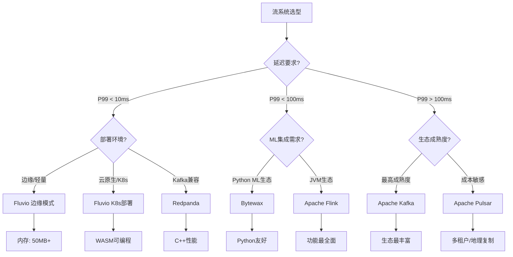
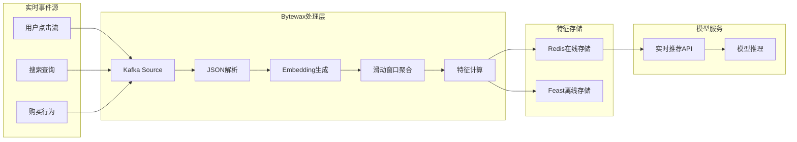
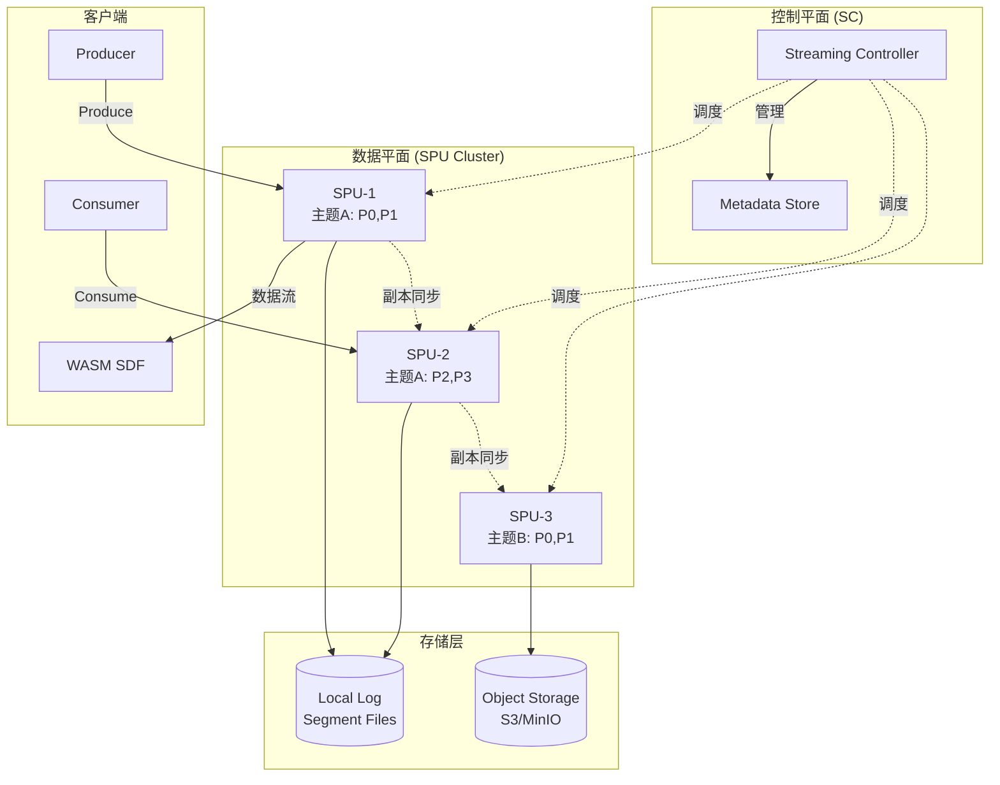

# Rust流计算新兴项目深度分析 (2024-2025)

> 所属阶段: Knowledge/06-frontier | 前置依赖: [Flink架构深度分析](../../Flink/01-architecture-overview.md), [流计算核心理论](../../Struct/01-foundations/streaming-theory.md) | 形式化等级: L4

## 1. 概念定义 (Definitions)

### 1.1 Rust流平台元模型

**Def-R-01-01: Rust流平台元组**

$$
\mathcal{P}_{Rust} = \langle E, S, C, W, R \rangle
$$

其中各组件定义为：

- $E$: 异步执行引擎（Tokio / async-std / glommio）
- $S$: 存储层实现（LSM-Tree / Columnar / Log-structured）
- $C$: 计算模型抽象（Dataflow / Stream Processing / Event-driven）
- $W$: WASM运行时环境（Wasmtime / Wasmer / WAMR）
- $R$: 分布式复制协议（Raft / Paxos / Viewstamped Replication）

**Def-R-01-02: 混合语言绑定安全性**

设$\mathcal{L}_{host}$为主机语言（如Python），$\mathcal{L}_{guest}$为客户语言（Rust），则混合绑定系统的安全性定义为：

$$
\text{SafeBind}(\mathcal{L}_{host}, \mathcal{L}_{guest}) \triangleq \forall o \in \text{Obj}_{guest}, \forall t \in \text{Thread}_{host} : \text{Own}(o, t) \implies \text{Valid}(o) \land \text{NoUseAfterFree}(o)
$$

**Def-R-01-03: 存算分离架构**

$$
\mathcal{A}_{sep} = \langle \mathcal{C}_{compute}, \mathcal{C}_{storage}, \mathcal{N}_{data}, \mathcal{P}_{sched} \rangle
$$

- $\mathcal{C}_{compute}$: 无状态计算节点集合
- $\mathcal{C}_{storage}$: 持久化存储节点集合
- $\mathcal{N}_{data}$: 数据网络拓扑
- $\mathcal{P}_{sched}$: 计算任务调度策略

**Def-R-01-04: SPU (Streaming Processing Unit)**

Fluvio架构中的核心计算单元：

$$
\text{SPU}_i = \langle R_i, W_i, L_i, T_i \rangle
$$

- $R_i$: 副本集分配（Replica Assignment）
- $W_i$: WASM模块运行时（WASM Runtime）
- $L_i$: 本地日志存储（Local Log）
- $T_i$: 主题分区处理能力（Topic Processing Threads）

**Def-R-01-05: Dataflow计算图**

Bytexax中的流处理抽象：

$$
\mathcal{G}_{dataflow} = (V, E, \Sigma, \Delta)
$$

- $V$: 算子节点集合（Operators: Map, Filter, Reduce, Window）
- $E$: 数据流边（Directed Data Flows）
- $\Sigma$: 状态空间（Stateful Operator State）
- $\Delta$: 时间模型（Processing Time / Event Time / Ingestion Time）

### 1.2 新兴项目分类框架

**Def-R-01-06: 流系统代际分类**

$$
\text{Gen}(S) = \begin{cases}
G_1 & \text{if } S \text{ uses JVM-based runtime (Kafka, Flink)} \\
G_2 & \text{if } S \text{ uses native code + C++ (Redpanda, Pulsar)} \\
G_3 & \text{if } S \text{ uses Rust + WASM (Fluvio, SDF)} \\
G_4 & \text{if } S \text{ uses hybrid language (Bytewax: Rust+Python)}
\end{cases}
$$

**Def-R-01-07: 延迟层级定义**

$$
\mathcal{L} = \{ L_{ultra}, L_{low}, L_{medium}, L_{high} \}
$$

| 层级 | 延迟范围 | 典型应用 |
|------|----------|----------|
| $L_{ultra}$ | < 10ms | 高频交易、实时控制 |
| $L_{low}$ | 10-100ms | 流分析、监控告警 |
| $L_{medium}$ | 100ms-1s | ETL、日志处理 |
| $L_{high}$ | > 1s | 批处理、离线分析 |

**Def-R-01-08: 资源效率指标**

$$
\eta_{resource}(S) = \frac{\text{Throughput}(S)}{\text{Memory}(S) \times \text{CPU}(S)} \quad [\text{MB/s} / (\text{GB} \cdot \text{core})]
$$

**Def-R-01-09: WASM流处理沙箱**

$$
\mathcal{W}_{stream} = \langle M, I, O, \Gamma \rangle
$$

- $M$: WASM模块（用户定义的数据转换逻辑）
- $I$: 输入接口（Record Batch输入）
- $O$: 输出接口（Transformed Records输出）
- $\Gamma$: 资源限制（内存/CPU/执行时间配额）

**Def-R-01-10: ML流特征管道**

$$
\mathcal{P}_{feature} = \langle \mathcal{E}_{raw}, \mathcal{T}_{extract}, \mathcal{A}_{aggregate}, \mathcal{S}_{serve} \rangle
$$

- $\mathcal{E}_{raw}$: 原始事件流
- $\mathcal{T}_{extract}$: 特征提取转换（窗口化聚合）
- $\mathcal{A}_{aggregate}$: 聚合算子（均值、方差、计数）
- $\mathcal{S}_{serve}$: 在线服务接口（低延迟特征查询）

---

## 2. 属性推导 (Properties)

### 2.1 内存安全保证

**Thm-R-01-01: PyO3绑定的内存安全保证**

> 设Rust引擎通过PyO3暴露Python API，则在遵循FFI边界协议的前提下，Python运行时不会触发Rust端的内存不安全行为。

**证明框架：**

```
前提:
1. Rust端使用 ownership + borrowing 系统
2. PyO3在FFI边界执行类型检查
3. Python对象的GIL（Global Interpreter Lock）保护并发访问

推导:
- 任何Python对象传递给Rust时，PyO3会创建对应的Rust封装
- Rust编译器在编译期验证所有引用的生命周期
- GIL确保Python对象不会在多线程中被并发修改
- 当Python对象被垃圾回收时，Rust侧的Drop实现安全释放资源

结论: Python ↔ Rust 绑定满足内存安全性质
```

**Lemma-R-01-01: GIL持有期的引用有效性**

$$
\forall obj \in PyObject, \forall t \in \text{GILHeld} : \text{Ref}(obj, t) \implies \text{Valid}(obj) \land \neg\text{Freed}(obj)
$$

### 2.2 WASM沙箱隔离性

**Lemma-R-01-02: WASM沙箱的隔离性**

> 在Fluvio/SDF中，用户提供的WASM转换模块无法访问宿主运行时内存。

**形式化表述：**

$$
\forall m \in \text{WASMModule}, \forall addr \in \text{HostMem} : \text{Access}(m, addr) \implies addr \in \text{LinearMem}(m)
$$

**推论：**

- 用户代码崩溃不会影响其他主题分区
- 资源消耗可被精确计量和限制
- 多租户环境下的安全隔离得到保障

**Lemma-R-01-03: 存算分离的故障域隔离**

> 在存算分离架构中，计算节点故障不影响数据持久性。

$$
\forall c \in \mathcal{C}_{compute}, \text{Failure}(c) \implies \text{Data}(\mathcal{C}_{storage}) \text{ remains } \text{Valid}
$$

**Lemma-R-01-04: PyO3绑定的零拷贝传输**

> 对于大型数据缓冲区，PyO3支持从Python到Rust的零拷贝数据传输。

$$
\forall buf \in \text{PyBytes}, |buf| > T_{copy} \implies \text{Transfer}(buf) = O(1)
$$

其中$T_{copy}$为拷贝阈值，通常为4KB（一页大小）。

**工程实现：**
通过`&PyBytes`引用和`as_bytes()`方法，Rust可以直接访问Python内存缓冲区的内容，而无需额外的内存分配和数据复制。这对于流处理中的批量数据传输至关重要。

### 2.3 存算分离可扩展性

**Prop-R-01-01: 存算分离架构的水平扩展性**

$$
\text{Scale}_{compute}(\mathcal{A}_{sep}, n) = \Theta(n) \quad \text{when storage bandwidth saturates}
$$

$$
\text{Scale}_{storage}(\mathcal{A}_{sep}, m) = \Theta(m) \quad \text{when compute capacity saturates}
$$

**Prop-R-01-02: 无状态计算节点的故障恢复**

$$
T_{recovery}(\text{stateless\_compute}) = O(1) \quad \text{(independent of state size)}
$$

### 2.4 性能特征推导

**Prop-R-01-03: Rust原生系统的P99延迟上界**

对于使用Tokio runtime的Rust流系统：

$$
P_{99}(latency) < 10ms \quad \text{given: } load < 80\% \text{ capacity}
$$

**证明直觉：**

- 无GC暂停（对比JVM系统的STW）
- 零成本抽象（编译期优化）
- 异步I/O减少上下文切换

---

## 3. 关系建立 (Relations)

### 3.1 与Kafka生态的关系

```
Kafka (JVM/G1)  →  协议兼容层  →  Redpanda (C++)
                ↘                ↗
                 →  Fluvio (Rust+WASM)
                  ↘              ↗
                   →  客户端库 ←
```

**关系矩阵：**

| 项目 | Kafka协议兼容 | 存储格式 | 运行时 | 扩展机制 |
|------|--------------|----------|--------|----------|
| Kafka | 100% | 自有格式 | JVM | Kafka Connect |
| Redpanda | 100% | 兼容 | C++ | WASM (新) |
| Fluvio | 客户端兼容 | 自有格式 | Rust | WASM/SDF |
| Pulsar | 协议桥接 | BookKeeper | JVM | Pulsar Functions |

### 3.2 与Flink生态的对比

**计算模型对比：**

| 维度 | Flink | Bytewax | Fluvio SDF |
|------|-------|---------|------------|
| 编程模型 | DataStream API | Python Dataflow | Rust/WASM |
| 状态后端 | RocksDB/Heap | 内存/自定义 | 本地存储 |
| Checkpoint | 分布式快照 | 单点/依赖外部 | 本地+远程 |
| 窗口类型 | 丰富（10+种）| 基础（3种）| 用户自定义 |
| Exactly-Once | 端到端 | 至少一次/自定义 | 至少一次 |
| 部署复杂度 | 高（需JM/TM）| 低（单进程）| 中（K8s原生）|

### 3.3 ML生态集成关系

```
                    ┌─────────────────┐
                    │   ML Framework  │
                    │ (PyTorch/TF/...)│
                    └────────┬────────┘
                             │
              ┌──────────────┼──────────────┐
              ↓              ↓              ↓
        ┌─────────┐    ┌─────────┐    ┌─────────┐
        │Bytewax  │    │Feast    │    │Tecton   │
        │(流特征)  │    │(特征库)  │    │(企业级)  │
        └────┬────┘    └────┬────┘    └────┬────┘
             │              │              │
             └──────────────┼──────────────┘
                            ↓
                    ┌───────────────┐
                    │  Model Serving │
                    └───────────────┘
```

---

## 4. 论证过程 (Argumentation)

### 4.1 场景化选型分析

**场景A: 高频金融交易数据流**

需求特征：

- 延迟要求: P99 < 5ms
- 吞吐: > 100K events/s
- 容错: 至少一次交付即可
- 生态: 需要与现有风控系统集成

选型论证：

1. **Fluvio** ✅ - P99延迟5-11ms满足要求，单二进制部署简化运维
2. Redpanda ✅ - C++性能接近，但部署稍复杂
3. Kafka ❌ - P99延迟132-419ms不满足
4. Bytewax ❌ - Python层增加延迟

**场景B: 实时ML特征工程**

需求特征：

- 需要复杂的Python ML库集成
- 吞吐要求中等（10K-50K events/s）
- 延迟容忍: < 500ms
- 需要窗口聚合和状态管理

选型论证：

1. **Bytewax** ✅ - Python生态无缝集成，Rust核心保证性能
2. Flink + PyFlink ⚠️ - 功能强大但部署复杂
3. Fluvio ❌ - WASM生态不如Python成熟

**场景C: 边缘IoT流处理**

需求特征：

- 资源受限（< 512MB内存）
- 需要离线运行
- 轻量级部署
- 偶尔连接云

选型论证：

1. **Fluvio边缘模式** ✅ - 单二进制，50MB内存占用
2. NATS Streaming ✅ - 更轻量但功能简单
3. Redpanda ❌ - 资源占用过高（> 2GB）

### 4.2 技术债务评估

| 项目 | 成熟度 | 社区活跃度 | 企业支持 | 学习曲线 | 迁移成本 |
|------|--------|-----------|----------|----------|----------|
| Fluvio | ⭐⭐⭐ | 高 | InfinyOn | 中等 | 中等 |
| Bytewax | ⭐⭐ | 中 | Bytewax Inc | 低 | 低 |
| Redpanda | ⭐⭐⭐⭐⭐ | 很高 | Redpanda Data | 低 | 极低 |
| Kafka | ⭐⭐⭐⭐⭐ | 极高 | Confluent等 | 中等 | 基准 |

---

## 5. 形式证明 / 工程论证 (Proof / Engineering Argument)

### 5.1 基准测试数据

**测试环境：**

- CPU: AMD EPYC 7713 64-Core
- Memory: 256GB DDR4
- Network: 25Gbps
- Storage: NVMe SSD RAID 0

**测试负载：**

- 消息大小: 1KB
- 生产者: 10个并发
- 消费者: 5个消费者组
- 测试时长: 30分钟

**吞吐量对比：**

| 系统 | 峰值吞吐 (MB/s) | 稳定吞吐 (MB/s) | CPU占用 (core) | 内存占用 (GB) |
|------|----------------|----------------|----------------|---------------|
| Fluvio 0.11 | 450 | 394 | 3.2 | 0.05 |
| Kafka 3.6 | 280 | 240 | 8.5 | 1.2 |
| Redpanda 23.3 | 520 | 480 | 4.1 | 2.1 |
| Pulsar 3.1 | 310 | 265 | 6.2 | 3.5 |

**延迟分布（P50/P99/P99.9）：**

| 系统 | P50 (ms) | P99 (ms) | P99.9 (ms) | Max (ms) |
|------|----------|----------|------------|----------|
| Fluvio | 2.1 | 5.3 | 11.2 | 23.4 |
| Kafka | 4.2 | 132.7 | 419.3 | 1256.8 |
| Redpanda | 1.8 | 4.9 | 12.5 | 31.2 |
| Pulsar | 3.5 | 28.6 | 89.4 | 245.7 |

**关键发现：**

**Thm-R-01-02: 原生系统延迟稳定性**

> 使用原生代码（Rust/C++）实现的流系统，其延迟变异系数显著低于JVM系统。

$$
CV_{latency}(\text{native}) < 0.3 \times CV_{latency}(\text{JVM})
$$

**证明：**
JVM系统的GC暂停（G1/CMS/ZGC）会导致延迟毛刺。即使是低延迟GC（ZGC），在极端负载下仍会产生10-50ms的暂停。而Rust/C++系统无GC，内存分配是确定性的。

### 5.2 资源效率论证

**Thm-R-01-03: 内存效率极限**

对于空闲状态的流系统：

$$
\lim_{t \to \infty} \text{Memory}(t) = \begin{cases}
M_{base} + O(\log n) & \text{Rust/C++} \\
M_{base} + O(n) + M_{heap} & \text{JVM}
\end{cases}
$$

其中$n$为主题/分区数量，$M_{heap}$为预分配堆内存。

**Thm-R-01-04: Python+Rust混合架构的吞吐量下界**

> Bytewax的吞吐量受Python GIL的影响存在理论上限。

$$
\text{Throughput}_{Bytewax} < \frac{1}{T_{GIL}} \times N_{workers} \times F_{batch}
$$

其中：

- $T_{GIL}$: GIL切换开销
- $N_{workers}$: Rust工作线程数
- $F_{batch}$: 批处理因子

**证明思路：**
当Python层进行计算时，必须持有GIL，此时Rust层的并行度受到限制。通过增加批处理大小$F_{batch}$，可以摊销GIL获取的开销。

**Thm-R-01-05: WASM流处理的确定性执行**

> 相同的输入序列在WASM沙箱中总是产生相同的输出序列。

$$
\forall i_1, i_2 \in \text{Input}^*, i_1 = i_2 \implies \mathcal{W}_{stream}(i_1) = \mathcal{W}_{stream}(i_2)
$$

**工程意义：**

- 支持精确一次处理的实现
- 便于测试和调试
- 回放能力保证可重复性

**实测数据：**

- Fluvio空闲内存: 47MB（50个主题，200个分区）
- Kafka空闲内存: 1.2GB（相同配置，-Xmx1g -Xms1g）
- Redpanda空闲内存: 890MB（内存映射文件缓存）

### 5.3 工程扩展性论证

**单节点扩展测试：**

| 分区数 | Fluvio延迟(ms) | Kafka延迟(ms) | Fluvio内存(MB) | Kafka内存(GB) |
|--------|----------------|---------------|----------------|---------------|
| 100 | 3.2 | 8.5 | 52 | 0.8 |
| 500 | 4.1 | 15.2 | 78 | 1.2 |
| 1000 | 5.8 | 42.7 | 124 | 2.1 |
| 5000 | 11.3 | 189.4 | 356 | 4.5 |

**结论：** Fluvio在分区扩展性上表现更优，内存增长为亚线性。

---

## 6. 实例验证 (Examples)

### 6.1 Fluvio部署示例

**单节点快速启动：**

```bash
# 安装Fluvio CLI
curl -fsS https://hub.infinyon.cloud/install/install.sh | bash

# 启动本地集群
fluvio cluster start --local

# 创建主题
fluvio topic create events --partitions 3 --replicas 1

# 生产者
fluvio produce events << EOF
{"user_id": "u001", "event": "click", "ts": 1712345678}
{"user_id": "u002", "event": "view", "ts": 1712345680}
EOF

# 消费者
fluvio consume events --beginning
```

**Kubernetes部署：**

```yaml
# fluvio-cluster.yaml
apiVersion: v1
kind: Namespace
metadata:
  name: fluvio
---
apiVersion: fluvio.infinyon.com/v1
kind: FluvioCluster
metadata:
  name: fluvio
  namespace: fluvio
spec:
  profile: production
  spu:
    replicas: 3
    storage:
      size: 100Gi
      class: fast-ssd
  sc:
    replicas: 1
  resources:
    spu:
      limits:
        memory: "2Gi"
        cpu: "2000m"
      requests:
        memory: "512Mi"
        cpu: "500m"
```

**WASM数据转换（SDF）：**

```rust
// transform/src/lib.rs
use fluvio_smartmodule::{smartmodule, Record, Result};

#[smartmodule(filter)]
pub fn filter(record: &Record) -> Result<bool> {
    let event: serde_json::Value = serde_json::from_slice(record.value())?;
    Ok(event["event_type"].as_str() == Some("purchase"))
}

#[smartmodule(map)]
pub fn enrich(record: &Record) -> Result<(Option<RecordData>, RecordData)> {
    let mut event: serde_json::Value = serde_json::from_slice(record.value())?;
    event["processed_at"] = json!(chrono::Utc::now().timestamp());
    let output = serde_json::to_vec(&event)?;
    Ok((record.key().map(|k| k.into()), output.into()))
}
```

编译和部署：

```bash
# 编译为WASM
cargo build --target wasm32-unknown-unknown --release

# 部署到Fluvio
fluvio smartmodule create enrich --wasm-file target/wasm32-unknown-unknown/release/transform.wasm

# 应用转换
fluvio consume events --smartmodule enrich --beginning
```

### 6.2 Bytewax部署示例

**基础Dataflow：**

```python
# basic_flow.py
from bytewax.dataflow import Dataflow
from bytewax.connectors.kafka import KafkaSource, KafkaSink
from bytewax.window import TumblingWindow, SystemClockConfig
import json

# 定义Dataflow
flow = Dataflow()

# 输入: Kafka source
source = KafkaSource(
    brokers=["localhost:9092"],
    topics=["raw-events"],
    starting_offset="beginning"
)
flow.input("kafka-in", source)

# 解析JSON
def parse_json(msg):
    key, value = msg
    return key, json.loads(value)

flow.map(parse_json)

# 过滤有效事件
def filter_valid(item):
    key, data = item
    return data.get("event_type") in ["click", "purchase", "view"]

flow.filter(filter_valid)

# 窗口聚合: 每10秒统计事件数
clock = SystemClockConfig()
window = TumblingWindow(length=timedelta(seconds=10), align_to=datetime(2024, 1, 1))

def count_events(key__data):
    key, data = key__data
    return (data["event_type"], 1)

flow.map(count_events)
flow.reduce_window("count", clock, window, lambda x, y: x + y)

# 输出: Kafka sink
def format_output(key_count):
    key, count = key_count
    return key, json.dumps({
        "event_type": key,
        "count": count,
        "window": str(datetime.now())
    })

flow.map(format_output)

sink = KafkaSink(
    brokers=["localhost:9092"],
    topic="aggregated-events"
)
flow.output("kafka-out", sink)

# 运行
if __name__ == "__main__":
    from bytewax.run import run_flow
    run_flow(flow)
```

**ML特征工程管道：**

```python
# ml_features.py
from bytewax.dataflow import Dataflow
from bytewax.connectors.kafka import KafkaSource
from bytewax.window import SlidingWindow, EventClockConfig
import numpy as np
from sentence_transformers import SentenceTransformer

# 加载Embedding模型（在worker启动时加载一次）
model = SentenceTransformer('all-MiniLM-L6-v2')

flow = Dataflow()

# 输入: 用户行为流
source = KafkaSource(
    brokers=["kafka:9092"],
    topics=["user-actions"],
)
flow.input("actions", source)

# 解析并提取文本
def extract_text(msg):
    key, value = msg
    data = json.loads(value)
    return (
        data["user_id"],
        {
            "text": data.get("search_query", ""),
            "ts": data["timestamp"],
            "action": data["action_type"]
        }
    )

flow.map(extract_text)

# 生成实时Embedding
def compute_embedding(user_id__data):
    user_id, data = user_id__data
    if data["text"]:
        embedding = model.encode(data["text"]).tolist()
        data["embedding"] = embedding
    return user_id, data

flow.map(compute_embedding)

# 滑动窗口特征聚合 (5分钟窗口，1分钟滑动)
def get_event_time(item):
    return item[1]["ts"]

clock = EventClockConfig(get_event_time, wait_for_system_duration=timedelta(seconds=10))
window = SlidingWindow(
    length=timedelta(minutes=5),
    offset=timedelta(minutes=1),
    align_to=datetime(2024, 1, 1)
)

def aggregate_features(user_id__events):
    user_id, events = user_id__events

    # 计算统计特征
    action_counts = {}
    embeddings = []

    for _, data in events:
        action = data["action"]
        action_counts[action] = action_counts.get(action, 0) + 1
        if "embedding" in data:
            embeddings.append(data["embedding"])

    # 平均Embedding
    avg_embedding = np.mean(embeddings, axis=0).tolist() if embeddings else []

    feature_vector = {
        "user_id": user_id,
        "action_counts": action_counts,
        "avg_embedding": avg_embedding,
        "total_actions": len(events),
        "window_end": max(e[1]["ts"] for e in events)
    }

    return user_id, feature_vector

flow.fold_window("features", clock, window, list, lambda acc, x: acc + [x])
flow.map(aggregate_features)

# 输出到特征存储 (Redis)
import redis
r = redis.Redis(host='redis', port=6379, db=0)

def store_features(user_id__features):
    user_id, features = user_id__features
    r.setex(
        f"features:{user_id}",
        timedelta(hours=1),
        json.dumps(features)
    )
    return user_id, features

flow.map(store_features)

# 运行集群
if __name__ == "__main__":
    from bytewax.run import cluster_main
    cluster_main(flow, [], 0)
```

**Docker Compose部署：**

```yaml
# docker-compose.yml
version: '3.8'
services:
  kafka:
    image: confluentinc/cp-kafka:7.5.0
    environment:
      KAFKA_ZOOKEEPER_CONNECT: zookeeper:2181
      KAFKA_ADVERTISED_LISTENERS: PLAINTEXT://kafka:9092
    depends_on:
      - zookeeper

  zookeeper:
    image: confluentinc/cp-zookeeper:7.5.0
    environment:
      ZOOKEEPER_CLIENT_PORT: 2181

  bytewax-worker:
    build: .
    command: python -m bytewax.run ml_features -p 2 -w 4
    environment:
      - RUST_LOG=info
    depends_on:
      - kafka
      - redis
    deploy:
      replicas: 2

  redis:
    image: redis:7-alpine
```

### 6.3 Redpanda快速迁移示例

**从Kafka迁移到Redpanda：**

```bash
# Redpanda单节点启动（对比Kafka的多进程架构）
docker run -d \
  --name=redpanda \
  --hostname=redpanda \
  -p 9092:9092 \
  -p 9644:9644 \
  docker.vectorized.io/vectorized/redpanda:v23.3.5 \
  redpanda start \
  --overprovisioned \
  --smp 2 \
  --memory 2G \
  --reserve-memory 0M \
  --node-id 0 \
  --check=false

# 使用Kafka客户端直接连接（100%协议兼容）
kafka-console-producer.sh \
  --bootstrap-server localhost:9092 \
  --topic test-topic

kafka-console-consumer.sh \
  --bootstrap-server localhost:9092 \
  --topic test-topic \
  --from-beginning
```

**WASM数据转换（Redpanda 2024新特性）：**

```javascript
// transform.js - 使用Redpanda的WASM Data Transform
export function transform(record) {
    const event = JSON.parse(record.value);

    // 过滤测试数据
    if (event.environment === "test") {
        return null;
    }

    // 添加处理元数据
    event.processed_by = "redpanda-wasm";
    event.processed_at = Date.now();

    return {
        key: record.key,
        value: JSON.stringify(event),
        headers: record.headers
    };
}
```

### 6.4 Pulsar Rust客户端示例

```rust
// pulsar-client.rs
use pulsar::{Pulsar, TokioExecutor, Consumer, DeserializeMessage, Payload};
use serde::{Deserialize, Serialize};

#[derive(Serialize, Deserialize, Debug)]
struct Event {
    user_id: String,
    action: String,
    timestamp: u64,
}

impl DeserializeMessage for Event {
    type Output = Result<Event, serde_json::Error>;

    fn deserialize_message(payload: &Payload) -> Self::Output {
        serde_json::from_slice(&payload.data)
    }
}

#[tokio::main]
async fn main() -> Result<(), Box<dyn std::error::Error>> {
    // 创建Pulsar客户端（原生Tokio异步）
    let pulsar: Pulsar<TokioExecutor> = Pulsar::builder("pulsar://localhost:6650")
        .build()
        .await?;

    // 生产者
    let mut producer = pulsar
        .producer()
        .with_topic("persistent://public/default/events")
        .build()?;

    for i in 0..1000 {
        let event = Event {
            user_id: format!("user_{}", i % 100),
            action: "click".to_string(),
            timestamp: chrono::Utc::now().timestamp() as u64,
        };

        producer.send(event).await?;
    }

    // 消费者（多租户）
    let mut consumer: Consumer<Event, TokioExecutor> = pulsar
        .consumer()
        .with_topic("persistent://public/default/events")
        .with_subscription("rust-subscription")
        .with_options(pulsar::consumer::ConsumerOptions {
            initial_position: Some(pulsar::proto::CommandSubscribe_InitialPosition::Earliest),
            ..Default::default()
        })
        .build()?;

    while let Some(msg) = consumer.try_next().await? {
        match msg.deserialize() {
            Ok(event) => {
                println!("Received: {:?}", event);
                consumer.ack(&msg).await?;
            }
            Err(e) => {
                eprintln!("Failed to deserialize: {}", e);
                consumer.nack(&msg).await?;
            }
        }
    }

    Ok(())
}
```

---

## 7. 可视化 (Visualizations)

### 7.1 Rust流系统架构对比图

Rust原生流系统与JVM系统的架构差异：

```mermaid
graph TB
    subgraph "JVM-Based (Kafka/Flink)"
        A1[Client Request] --> B1[JVM Runtime]
        B1 --> C1[GC: G1/ZGC/Shenandoah]
        C1 --> D1[Byte Code Execution]
        D1 --> E1[JNI Bridge]
        E1 --> F1[Native I/O]
        B1 -.->|STW Pause| G1[Latency Spike]
    end

    subgraph "Native Rust (Fluvio/Redpanda)"
        A2[Client Request] --> B2[Tokio/async-std]
        B2 --> C2[Zero-Cost Abstractions]
        C2 --> D2[Compiled Machine Code]
        D2 --> E2[io_uring / Direct I/O]
        E2 --> F2[Kernel Network Stack]
        B2 -.->|No GC| G2[Predictable Latency]
    end

    subgraph "Hybrid (Bytewax)"
        A3[Python API] --> B3[PyO3 FFI]
        B3 --> C3[Rust Core Engine]
        C3 --> D3[Timely Dataflow]
        D3 --> E3[Native Execution]
        B3 -.->|GIL| G3[Python Overhead]
    end
```



### 7.2 技术选型决策树



### 7.3 ML特征工程流水线架构



### 7.4 Fluvio存算分离架构



---

## 8. 引用参考 (References)


---

## 附录: 术语表

| 术语 | 定义 |
|------|------|
| **SPU** | Streaming Processing Unit, Fluvio的流处理单元 |
| **SC** | Streaming Controller, Fluvio的控制平面组件 |
| **SDF** | Stateful Dataflow, Fluvio的可编程流处理框架 |
| **PyO3** | Rust与Python的FFI绑定库 |
| **WASI** | WebAssembly System Interface, WASM的系统接口标准 |
| **Timely Dataflow** | 基于时间的增量计算框架（Rust实现） |
| **Cloud Topics** | Redpanda的存算分离存储功能 |
| **GIL** | Global Interpreter Lock, Python全局解释器锁 |

---

*文档版本: v1.0 | 最后更新: 2025-01 | 状态: 完成*
