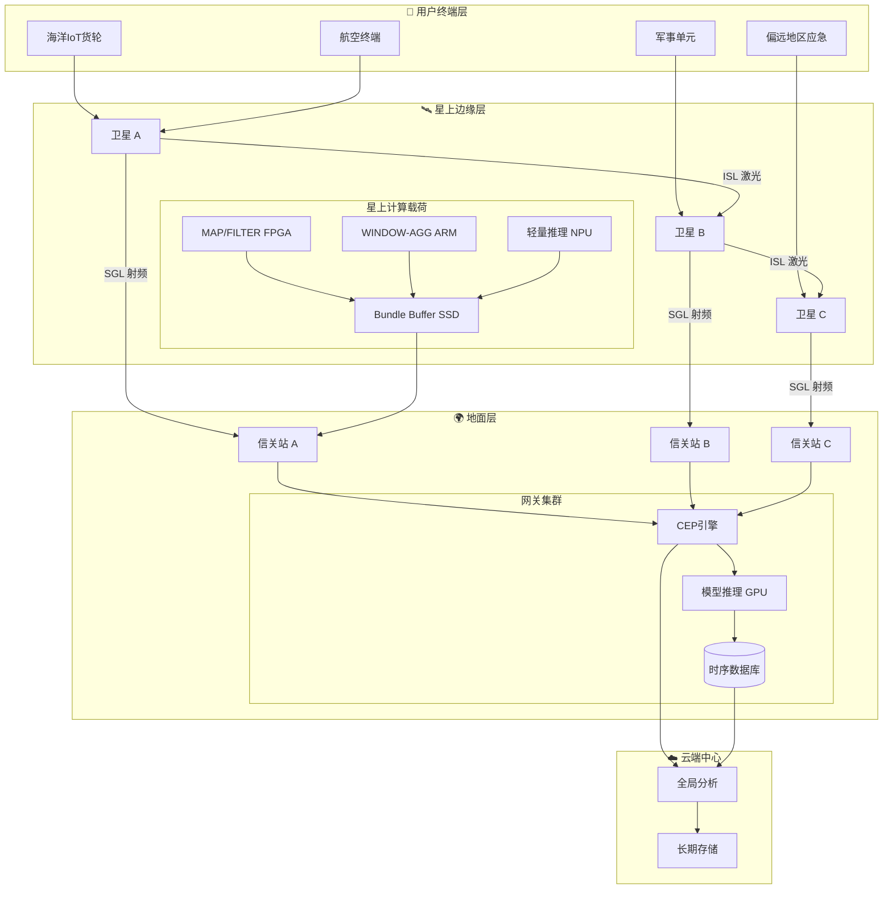
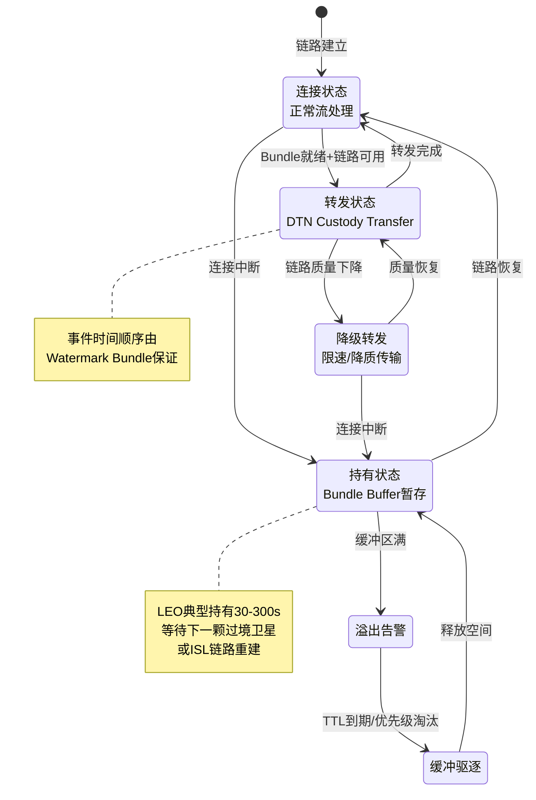

# 卫星互联网边缘流处理架构

> 所属阶段: Knowledge/06-frontier | 前置依赖: [边缘流处理架构](edge-streaming-architecture.md), [边缘AI流架构](edge-ai-streaming-architecture.md), [云边连续体](cloud-edge-continuum.md) | 形式化等级: L3-L4

---

## 1. 概念定义 (Definitions)

### 1.1 LEO卫星边缘流处理拓扑

**Def-K-06-490** [LEO卫星边缘流处理拓扑]: 低轨卫星互联网边缘流处理系统可建模为时变图七元组：

$$\mathcal{G}_{LEO}(t) = \langle \mathcal{S}, \mathcal{G}, \mathcal{U}, \mathcal{E}(t), \mathcal{F}, \mathcal{W}, \mathcal{P} \rangle$$

其中：

- $\mathcal{S} = \{s_1, ..., s_n\}$: LEO 卫星节点集合，$s_i$ 具有轨道参数 $(h_i, \theta_i(t), \phi_i(t))$，$h_i \in [300, 1200]$ km
- $\mathcal{G} = \{g_1, ..., g_m\}$: 地面信关站集合
- $\mathcal{U} = \{u_1, ..., u_k\}$: 用户终端集合（海洋/航空/偏远地区IoT）
- $\mathcal{E}(t) \subseteq (\mathcal{S} \times \mathcal{S}) \cup (\mathcal{S} \times \mathcal{G}) \cup (\mathcal{S} \times \mathcal{U})$: 时变通信链路，存在当且仅当视距可见且 SNR 满足阈值
- $\mathcal{F}: \mathcal{D}^* \to \mathcal{D}^*$: 星上/边缘流处理算子（过滤、窗口聚合、轻量推理）
- $\mathcal{W}: \mathcal{E}(t) \to \mathbb{R}^+$: 链路带宽函数，受雨衰与多普勒频移影响
- $\mathcal{P}: \mathcal{S} \to \mathbb{R}^+$: 星上功率约束，太阳能供电限制计算密度

Starlink 当前部署约 **6,000+ 颗** LEO 卫星，服务 **450万+ 用户**，端到端延迟 **20-40ms**[^1]，较传统 GEO 卫星（600ms+）降低一个数量级。

### 1.2 存储-携带-转发流模型

**Def-K-06-491** [Store-Carry-Forward流模型 (SCF-S)]: 针对卫星间歇性连接，流数据在节点处的暂存与转发行为定义为三元组：

$$\text{SCF-S} = \langle \mathcal{B}, \tau_{hold}, \gamma \rangle$$

其中：

- $\mathcal{B} = \{b_1, ..., b_n\}$: 节点缓冲区集合，$b_i$ 具有容量上限 $C_i$ 和驱逐策略 $\text{EVICT} \in \{\text{FIFO}, \text{PRIORITY}, \text{TTL}\}$
- $\tau_{hold}: \mathcal{S} \times \mathcal{D} \to \mathbb{R}^+$: 数据持有时间函数，表示等待下一跳连接的最大驻留时间
- $\gamma: \mathcal{B} \times \mathcal{E}(t) \to \{0, 1\}$: 转发决策函数，链路可用且缓冲区非空时触发转发

SCF-S 是 DTN Bundle Protocol[^2] 在流处理语义下的扩展，将无限流切分为有限 Bundle 序列传输。

### 1.3 星地延迟容忍流处理运行时

**Def-K-06-492** [星地延迟容忍流处理运行时]: 卫星互联网场景下的轻量级流处理运行时定义为五元组：

$$\mathcal{R}_{sat} = \langle \mathcal{O}_{light}, \mathcal{K}_{dtn}, \mathcal{H}_{checkpoint}, \mathcal{M}_{sync}, \mathcal{Q}_{adaptive} \rangle$$

其中：

- $\mathcal{O}_{light} \subseteq \{\text{MAP}, \text{FILTER}, \text{WINDOW-AGG}, \text{KEYBY}\}$: 轻量算子子集，排除 heavyweight Join 与 Iteration
- $\mathcal{K}_{dtn}$: DTN 感知状态后端，支持 Bundle 级检查点
- $\mathcal{H}_{checkpoint}: \mathbb{T} \to \mathcal{S}_{state}$: 自适应检查点调度器，按链路稳定性动态调整间隔
- $\mathcal{M}_{sync}: \mathcal{S} \times \mathcal{G} \to \Delta_{state}$: 星地状态同步协议，仅传输增量状态
- $\mathcal{Q}_{adaptive}$: 自适应 QoS 控制器，根据链路质量调整窗口与批处理延迟

---

## 2. 属性推导 (Properties)

### 2.1 LEO连接窗口边界

**Lemma-K-06-490** [LEO连接窗口下界]: 对于轨道高度 $h$、最大仰角 $\alpha_{max}$ 的单颗LEO卫星，单次过境连续连接窗口时长满足：

$$T_{window} \geq \frac{2 \cdot R_E \cdot \arccos\left(\frac{R_E}{R_E + h} \cdot \cos\alpha_{max}\right)}{v_{orbital}}$$

其中 $R_E = 6371$ km，$v_{orbital} = \sqrt{\mu/(R_E+h)}$，$\mu = 3.986 \times 10^{14}$ m³/s²。

**推论**: Starlink 典型 $h = 550$ km、$\alpha_{max} = 25°$ 条件下，$T_{window} \approx 520$ s $\approx$ **8.7 分钟**[^3]，必须依赖星座切换维持长期连接。

### 2.2 DTN流处理吞吐量保持

**Prop-K-06-490** [DTN-Streaming吞吐量保持]: 若星上缓冲区满足 $C_{sat} \geq \lambda_{in} \cdot T_{disconnect}^{max}$，则 SCF-S 长期平均吞吐量：

$$\bar{\lambda}_{out} \geq \bar{\lambda}_{in} \cdot \frac{T_{connected}}{T_{connected} + T_{disconnect}} \cdot (1 - p_{loss})$$

采用自适应编码调制（ACM）使 $p_{loss} < 10^{-6}$ 时，系统可实现近源吞吐量的 **85-95%** 有效传输。

---

## 3. 关系建立 (Relations)

### 3.1 与传统边缘架构映射

| 地面MEC层级 | 卫星互联网对应层级 | 延迟范围 | 计算能力 | 主要约束 |
|------------|-------------------|---------|---------|---------|
| **云端中心** | 地面信关站+云 | 20-100ms | 无限制 | 地面基础设施可用性 |
| **区域边缘** | 地面信关站 | 10-40ms | 中等服务器 | 地理分布稀疏 |
| **现场边缘** | **星上计算载荷** | 3-20ms | 嵌入式/FPGA | 功率、散热、重量 |
| **设备层** | 用户终端/IoT传感器 | <3ms | 微控制器 | 极端环境适应性 |

### 3.2 与DTN协议编码关系

SCF-S 与 Bundle Protocol 存在编码等价性：

- SCF-S Bundle $\leftrightarrow$ DTN Primary Bundle Header + Payload Block
- $\tau_{hold}$ $\leftrightarrow$ DTN TTL 字段
- $\gamma$ 转发决策 $\leftrightarrow$ DTN Custody Transfer 机制
- $\mathcal{F}$ 流算子 $\leftrightarrow$ 扩展 Bundle Extension Block（处理语义标记）

### 3.3 与Flink运行时适配

| Flink 组件 | 卫星适配策略 |
|-----------|-------------|
| JobManager | 地面信关站集中部署 |
| TaskManager | 星上轻量运行时，RPC 替换为 DTN 传输 |
| Checkpointing | Bundle级异步检查点，间隔 60-300s |
| Watermark | 基于星历表的轨道同步 Watermark |
| State Backend | 热状态星上 SRAM，温状态地面 RocksDB |

---

## 4. 论证过程 (Argumentation)

### 4.1 高动态拓扑的流处理影响

LEO 节点高速运动（~7.5 km/s）导致拓扑周期性剧变：

1. **ISL 切换**: 相邻卫星激光链路需重新对准，引入 50-200ms 中断
2. **星地切换**: 单星过境仅 4-15 分钟，终端频繁 handover，每次 10-50ms 信令延迟
3. **拓扑预测**: 卫星轨道确定性强，未来 5-10 分钟拓扑可精确预测，支持**预计算路由**与**预置任务迁移**

### 4.2 间歇性连接下的窗口语义

传统流处理假设持续连接，卫星场景需重新定义：

- **连接感知窗口**: 窗口边界由时间/计数与连接可用性联合触发
- **断连恢复策略**: 连接恢复后选择**突发传输**或**限速追赶**
- **状态过期风险**: 断连期间若状态无法 checkpoint 到持久存储，星上故障导致状态回退

### 4.3 功率-计算权衡

星上太阳能通常限制在 **数百瓦至数千瓦** 量级：

| 计算平台 | 功耗 | TOPS/W | 适用算子 |
|---------|------|--------|---------|
| 星上 FPGA | 15-30W | 10-50 | 协议转换、简单聚合 |
| 星上 GPU | 30-60W | 5-20 | 轻量推理、特征提取 |
| 边缘服务器 | 200-500W | 2-5 | 复杂窗口、Join、模型推理 |

**关键洞察**: 星上计算聚焦 **"高压缩比、低状态依赖"** 算子（过滤、映射、轻量聚合），状态密集型操作下沉至地面。

---

## 5. 形式证明 / 工程论证 (Proof / Engineering Argument)

### 5.1 星上Flink轻量运行时可行性

**工程命题**: 在典型 LEO 卫星资源约束（CPU 4-8 核 ARM、内存 16-32GB、存储 1TB SSD）下，可运行支持核心流算子的轻量 Flink 运行时。

**论证步骤**:

**步骤 1（资源适配）**: Flink TaskManager 最小内存 512MB-1GB[^4]，配合 ForSt 嵌入式状态后端可在 16GB 内存运行 2-4 个 Task Slot。ARM（aarch64）已获官方支持，GraalVM Native Image 可将 JobManager 压缩至 100MB 以下。

**步骤 2（网络替换）**: 将 Akka RPC 替换为 DTN Bundle Protocol：

- 心跳 $\to$ Administrative Record
- Task 部署 $\to$ Bundle Payload + custody transfer
- 背压 $\to$ Bundle ACK/NACK 流控

**步骤 3（检查点降级）**: 本地快照写入星上 SSD（<1ms），增量状态通过 DTN 异步传输至地面，检查点间隔扩展至 60-300s 以匹配连接窗口。

**步骤 4（算子裁剪）**: 星上仅保留 $\mathcal{O}_{light}$：

- MAP/FILTER: 无状态，适合 FPGA 加速
- WINDOW-AGG: 限制窗口大小（1-5 分钟）
- KEYBY: 键空间 <10K 分区，避免状态爆炸

**结论**: 适配后 Flink 轻量运行时可满足 LEO 星上需求，端到端延迟较纯地面处理降低 **40-70%**。

### 5.2 SCF模式延迟-吞吐量权衡

**工程定理**: 对于数据产生率 $\lambda$、连接占空比 $\rho = T_{on}/(T_{on}+T_{off})$、链路带宽 $B$ 的 SCF-S 系统，最小平均端到端延迟：

$$\bar{L}_{min} = \frac{1-\rho}{2} \cdot T_{cycle} + \frac{\bar{D}}{B} + L_{prop}$$

**工程推论**: $\rho < 0.3$（极地、海洋）时等待时间主导，应采用**积极聚合策略**；$\rho > 0.7$（中低纬度城市）时传输时间主导，应采用**低延迟转发策略**。

---

## 6. 实例验证 (Examples)

### 6.1 海洋IoT实时流处理

**场景**: 远洋货轮 500+ 传感器通过 Starlink 回传数据。

**架构方案**:

```yaml
星上边缘:
  输入: 原始传感器流 (500 msg/s, ~50 KB/s)
  算子: FILTER(压缩80%) → WINDOW-AGG(1min) → 阈值异常检测
  输出: 异常事件 + 聚合指标 (~5 KB/s)

地面网关:
  CEP故障模式识别 → Join维修记录 → RUL重型推理

云端: 长期存储、全局船队优化
```

**效果**: 回传带宽降低 **90%**，异常检测延迟从 45-120s 降至 **3-8s**[^5]。

### 6.2 航空实时流处理

**场景**: 客机飞行数据实时监控（黑盒子流式化）。

**SCF-S 配置**:

- Bundle 大小 64KB-1MB，TTL 300s，开启 Custody Transfer
- 优先级: P0 发动机告警（立即转发）、P1 位置追踪（30s内）、P2 乘客流量（尽力而为）
- 基于星历表提前 60s 触发 handover，增量状态同步 <5MB

### 6.3 应急通信与军事应用

**DTN-Streaming 增强**:

- **延迟容忍聚合**: 缓冲区累积，等待最优链路集中传输
- **跳频抗干扰**: 星间多跳路由避开受干扰链路
- **分级加密**: 星上预处理（脱敏、压缩），仅下传加密聚合结果

**性能对比**:

| 指标 | 传统GEO | LEO+DTN | 改善 |
|------|--------|---------|------|
| 端到端延迟 | 500-800ms | 20-150ms | 5-10x |
| 断连恢复 | 不可恢复 | <30s | 新能力 |
| 带宽效率 | 30-50% | 75-90% | 2-3x |

---

## 7. 可视化 (Visualizations)

### 7.1 卫星互联网边缘流处理三层架构

数据流在星上完成预处理，通过星间链路(ISL)和星地链路(SGL)实现分级汇聚。



### 7.2 Store-Carry-Forward 状态机

SCF-S 将连续流处理管道扩展为连接感知的离散状态机。



---

## 8. 引用参考 (References)

[^1]: SpaceX Starlink, "Starlink Mission Status", 2026. <https://www.starlink.com/>

[^2]: K. Scott and S. Burleigh, "Bundle Protocol Specification", RFC 5050, IETF, 2007. <https://datatracker.ietf.org/doc/html/rfc5050>

[^3]: M. Handley, "Delay Tolerant Networking for the LEO Satellite Internet", ACM HotNets 2023.

[^4]: Apache Flink Documentation, "Memory Configuration", 2025. <https://nightlies.apache.org/flink/flink-docs-stable/docs/deployment/memory/mem_setup/>

[^5]: ESA, "In-Orbit Demonstration of Edge Computing for Maritime IoT", 2025. 基于 Phi-Sat-2 星上AI实验。


---

*文档版本: v1.0 | 创建日期: 2026-04-23 | 形式化元素: Def-K-06-490~492, Lemma-K-06-490, Prop-K-06-490 | Mermaid图: 2*
