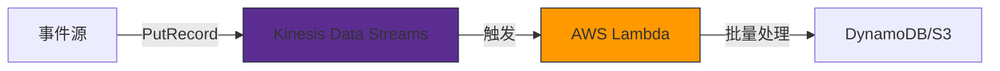
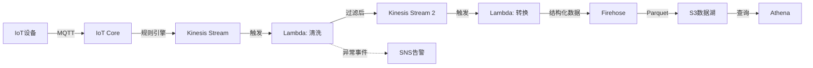
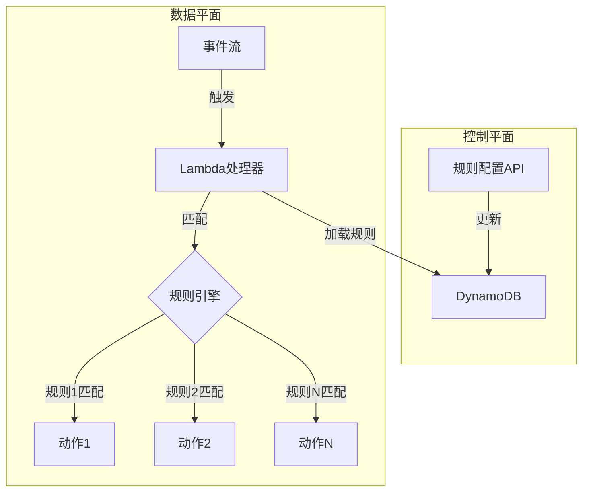
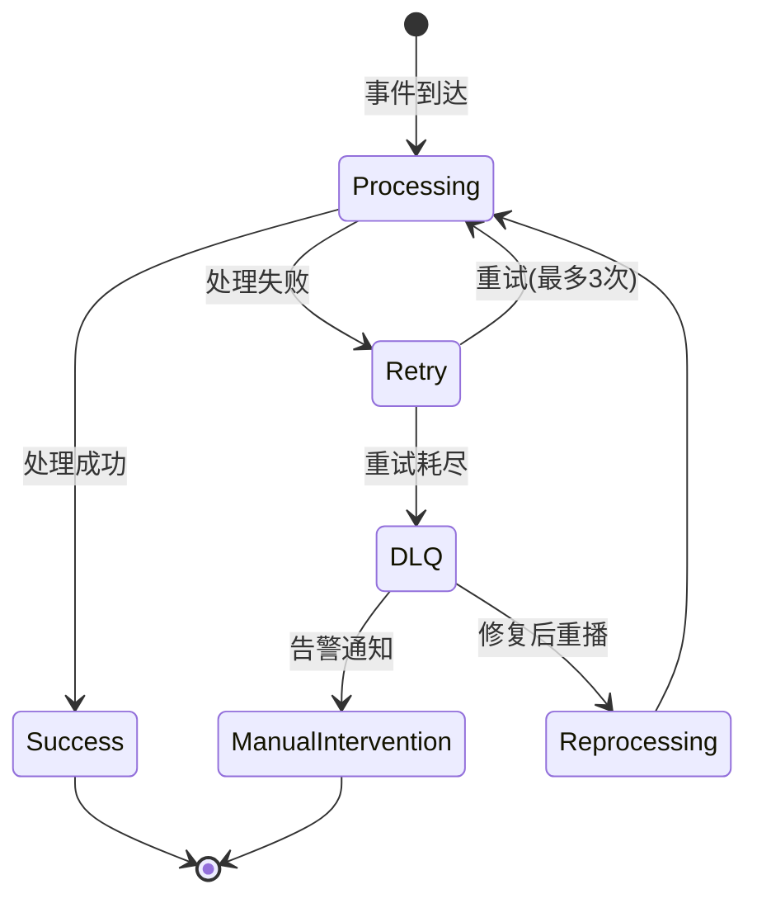
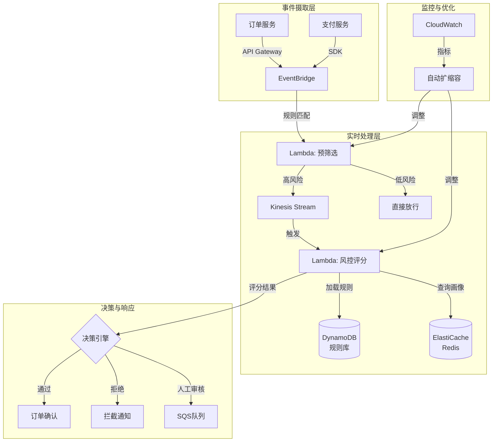
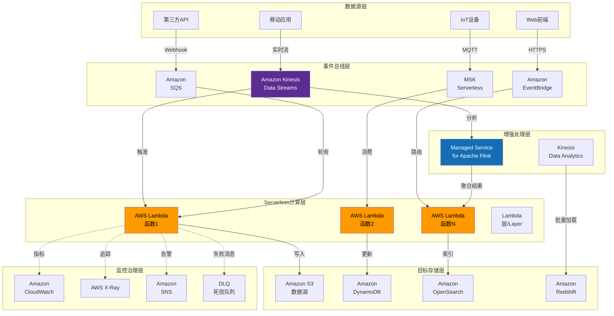
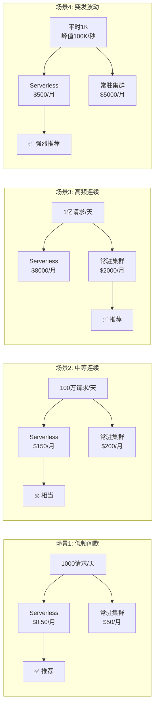
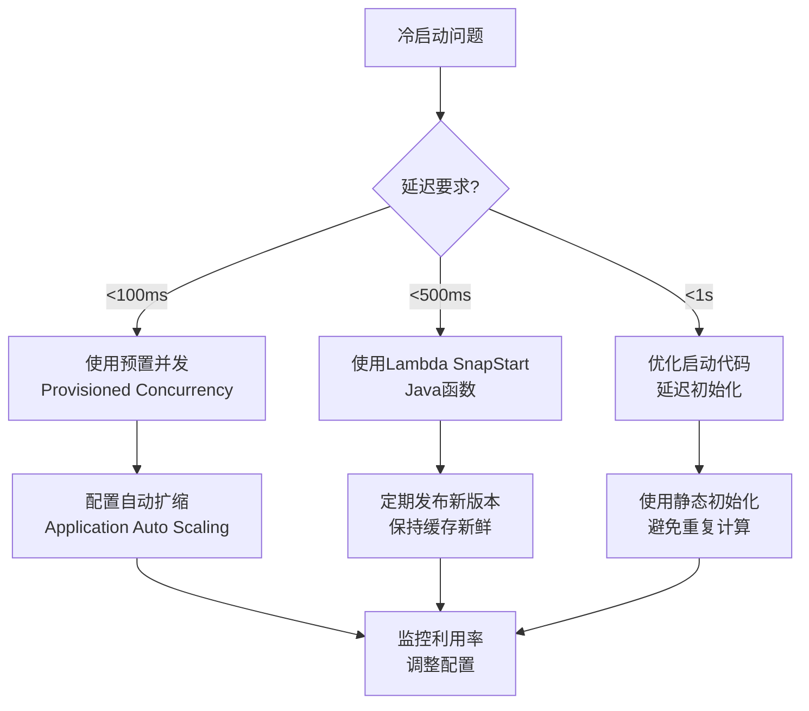

# Serverless流处理架构

> 所属阶段: Knowledge/Frontier | 前置依赖: [Flink流处理基础](../../Flink/)、[Lambda架构演进](../01-concept-atlas/streaming-models-mindmap.md) | 形式化等级: L4

## 1. 概念定义 (Definitions)

### Def-K-06-91: Serverless流处理系统 (Serverless Stream Processing System)

Serverless流处理系统是一个五元组 $S_{serverless} = \langle \mathcal{E}, \mathcal{F}, \mathcal{T}, \mathcal{A}, \mathcal{C} \rangle$，其中：

- $\mathcal{E}$: 事件源集合，提供无限流输入
- $\mathcal{F}$: 无状态函数集合，$\mathcal{F} = \{f_1, f_2, ..., f_n\}$，每个 $f_i: Event \rightarrow (Output, SideEffect)^*$
- $\mathcal{T}$: 触发器配置，定义事件到函数的映射规则
- $\mathcal{A}$: 自动扩缩容策略，$\mathcal{A}: (Load, SLA) \rightarrow InstanceCount$
- $\mathcal{C}$: 成本模型，按实际执行时间和资源消耗计费

**直观解释**: Serverless流处理将流处理逻辑封装为事件驱动的无状态函数，由云服务商自动管理计算资源的分配和扩缩容，用户仅需为实际处理的事件付费。

### Def-K-06-92: 冷启动延迟 (Cold Start Latency)

设函数实例的生命周期为 $[t_{create}, t_{destroy}]$，冷启动延迟 $\Delta_{cold}$ 定义为：

$$\Delta_{cold} = t_{first\_event} - t_{invoke}$$

其中：

- $t_{invoke}$: 函数调用请求到达时刻
- $t_{first\_event}$: 函数开始处理第一个事件的时刻

**分类**：

- **初始化冷启动**: 从零创建执行环境（容器/VM），通常 100ms-10s
- **运行时冷启动**: 加载函数代码和依赖，通常 10ms-1000ms

### Def-K-06-93: 并发模型 (Concurrency Model)

并发度 $\mathcal{K}$ 定义为同时处理事件的函数实例数：

$$\mathcal{K}(t) = \sum_{i=1}^{n} \mathbb{1}_{[active]}(instance_i, t)$$

Serverless流处理的并发控制通过以下参数实现：

- **预留并发** ($\mathcal{K}_{reserved}$): 保证可用的最小实例数
- **最大并发** ($\mathcal{K}_{max}$): 系统允许的最大实例数上限
- **每实例并发** ($\mathcal{K}_{per\_instance}$): 单个实例同时处理的事件数

### Def-K-06-94: 批处理窗口 (Batch Window)

批处理窗口 $W_{batch}$ 是一个时间区间 $[t_{start}, t_{end}]$ 或事件计数 $N_{batch}$，满足：

$$W_{batch} = \{(e_1, e_2, ..., e_k) \mid k \leq N_{batch} \lor t_{e_k} - t_{e_1} \leq T_{max}\}$$

其中 $T_{max}$ 为最大等待时间，$N_{batch}$ 为最大批大小。

---

## 2. 属性推导 (Properties)

### Lemma-K-06-61: Serverless延迟边界

**陈述**: 给定Serverless函数配置，端到端处理延迟 $\Delta_{e2e}$ 满足：

$$\Delta_{cold} + \Delta_{processing} \leq \Delta_{e2e} \leq \Delta_{cold} + \Delta_{processing} + \Delta_{queue}$$

其中：

- $\Delta_{cold}$: 冷启动延迟（若为热实例则为0）
- $\Delta_{processing}$: 实际处理时间
- $\Delta_{queue}$: 事件队列等待时间

**证明**:

1. 下界：最小延迟发生在热实例且队列为空时，仅需冷启动（若需要）和处理时间
2. 上界：最大延迟包含队列等待时间，当并发度达到上限时，新事件必须等待

**推论**: 对于延迟敏感场景，需配置预留并发 $\mathcal{K}_{reserved} > 0$ 以消除冷启动影响。

### Lemma-K-06-62: 成本边界定理

**陈述**: 给定事件到达率 $\lambda(t)$ 和处理时间 $\tau$ 每事件，Serverless月度成本 $C_{month}$ 满足：

$$C_{month} \geq \max\left(\frac{\lambda_{avg} \cdot \tau \cdot P_{compute}}{10^6}, C_{base}\right)$$

其中：

- $\lambda_{avg}$: 平均每秒事件数
- $P_{compute}$: 每百万次请求价格（$ per 1M invocations）
- $C_{base}$: 基础资源预留成本（若有）

**证明**: 由计费模型直接推导，总成本 = 调用次数成本 + 执行时间成本 + 预留成本。

### Prop-K-06-63: 扩缩容响应时间界限

**陈述**: 从负载突增到达到目标并发度的时间 $\Delta_{scale}$ 满足：

$$\Delta_{scale} \approx \frac{\mathcal{K}_{target} - \mathcal{K}_{current}}{r_{scale\_up}} + n \cdot \Delta_{cold}$$

其中 $r_{scale\_up}$ 为每分钟最大扩容速率，$n$ 为需要的扩容批次。

**AWS Lambda具体值**:

- 初始 burst: 3000 并发/区域（6个月内可提升到数万）
- 持续扩容: 500 并发/分钟
- 因此 $\Delta_{scale}$ 在秒级到分钟级

---

## 3. 关系建立 (Relations)

### Serverless vs 传统流处理引擎

| 维度 | Serverless (Lambda) | Flink (托管/自建) | Kafka Streams |
|------|---------------------|-------------------|---------------|
| **部署模型** | 事件触发，无服务器 | 常驻集群，容器化 | 嵌入应用进程 |
| **状态管理** | 外部存储（无本地状态） | 内置状态后端 | 本地状态 + 变更日志 |
| **扩缩容** | 自动，秒级-分钟级 | 手动/自动，分钟级 | 自动（基于分区） |
| **延迟** | 50ms-10s（含冷启动） | 毫秒级-秒级 | 毫秒级-秒级 |
| **成本模型** | 按调用+执行时间 | 按集群资源（常驻） | 按集群资源 |
| **适用场景** | 事件驱动、间歇性负载 | 连续流处理、复杂状态 | 轻量级流处理 |

### 架构定位关系

```
流处理架构谱系:

低延迟 <─────────────────────────────────────────────────> 低成本间歇
│                                                                  │
├─ 常驻集群 (Flink/Spark Streaming) ─────┬─ Serverless (Lambda) ─┤
│   • 毫秒级延迟                         │   • 秒级延迟          │
│   • 复杂状态ful处理                    │   • 无状态/外部状态    │
│   • 连续高吞吐                         │   • 事件驱动触发       │
│   • 成本与利用率无关                   │   • 按实际使用付费     │
│                                        │                       │
└─ 混合架构 (Managed Flink + Lambda) ────┘
    • 复杂计算用Flink
    • 轻量级消费/触发用Lambda
```

### AWS服务关系图谱

```
┌─────────────────────────────────────────────────────────────┐
│                    Serverless流处理生态                       │
├─────────────────────────────────────────────────────────────┤
│                                                             │
│  事件源层                                                    │
│  ┌──────────┐  ┌──────────┐  ┌──────────┐  ┌──────────┐    │
│  │ Kinesis  │  │   MSK    │  │  SQS     │  │ EventBridge│   │
│  │ Streams  │  │Serverless│  │          │  │            │   │
│  └────┬─────┘  └────┬─────┘  └────┬─────┘  └─────┬──────┘   │
│       │             │             │               │          │
│       └─────────────┴─────────────┴───────────────┘          │
│                         │                                    │
│  计算层                  ▼                                    │
│  ┌─────────────────────────────────────────────────┐         │
│  │           AWS Lambda / Lambda@Edge               │         │
│  │  • 无状态事件处理                                 │         │
│  │  • 自动扩缩容                                    │         │
│  │  • 与VPC/安全组集成                              │         │
│  └─────────────────────────────────────────────────┘         │
│                         │                                    │
│  增强层                  ▼                                    │
│  ┌─────────────────────────────────────────────────┐         │
│  │    Managed Service for Apache Flink              │         │
│  │  • 复杂流处理 (窗口、聚合、CEP)                   │         │
│  │  • 与Lambda互补(Lambda消费Flink输出)           │         │
│  └─────────────────────────────────────────────────┘         │
│                         │                                    │
│  目标层                  ▼                                    │
│  ┌──────────┐  ┌──────────┐  ┌──────────┐  ┌──────────┐    │
│  │ DynamoDB │  │  S3      │  │ OpenSearch│  │ SNS/SQS  │    │
│  │ Aurora   │  │ Redshift │  │ RDS       │  │  (DLQ)   │    │
│  └──────────┘  └──────────┘  └──────────┘  └──────────┘    │
│                                                             │
└─────────────────────────────────────────────────────────────┘
```

---

## 4. 论证过程 (Argumentation)

### Serverless适用性决策论证

**场景分析框架**:

设场景特征为四元组 $\langle L, S, D, C \rangle$：

- $L$: 负载模式（连续/突发/间歇）
- $S$: 状态复杂度（无状态/简单/复杂）
- $D$: 延迟要求（毫秒级/秒级/分钟级）
- $C$: 成本敏感度（高/中/低）

**适用性判定**:

| 特征组合 | 推荐方案 | 理由 |
|---------|---------|------|
| 突发 + 无状态 + 秒级 + 高敏感度 | ✅ Serverless | 按调用付费，无闲置成本 |
| 连续 + 复杂状态 + 毫秒级 + 低敏感度 | ❌ 常驻集群 | Serverless冷启动无法满足延迟 |
| 间歇 + 简单状态 + 分钟级 + 高敏感度 | ✅ Serverless | 长期闲置时成本优势明显 |
| 突发 + 复杂状态 + 秒级 + 中敏感度 | ⚠️ 混合架构 | Flink处理复杂逻辑，Lambda消费输出 |

**成本临界点分析**:

设：

- $C_{serverless} = \lambda \cdot (P_{invoke} + T_{exec} \cdot P_{gb\_second})$
- $C_{cluster} = N_{nodes} \cdot P_{node\_hour} \cdot 730$

临界点 $\lambda^*$ 满足 $C_{serverless} = C_{cluster}$：

$$\lambda^* = \frac{N_{nodes} \cdot P_{node\_hour} \cdot 730}{P_{invoke} + T_{exec} \cdot P_{gb\_second}}$$

以AWS为例：

- Lambda: $0.20/百万请求 + $0.0000166667/GB-秒
- m5.large EC2: ~$0.096/小时

对于平均执行时间100ms、512MB内存的函数：
$$\lambda^* \approx 2.9 \text{ million requests/month}$$

**结论**: 月调用量低于290万次的场景，Serverless通常更经济。

---

## 5. 工程论证 / 架构选型决策树

### Thm-K-06-64: Serverless流处理架构选型定理

**陈述**: 对于给定的流处理需求 $R$，存在最优架构 $A^*$ 使得：

$$A^* = \arg\min_{A \in \mathcal{A}} \left( w_1 \cdot Cost(A) + w_2 \cdot Latency(A) + w_3 \cdot Complexity(A) \right)$$

其中权重 $w_1, w_2, w_3$ 由业务优先级决定。

**决策树**:

```
开始流处理架构选型
        │
        ▼
┌─────────────────┐
│ 是否需要毫秒级  │───是───▶ 常驻Flink集群
│ 端到端延迟？    │        │ (排除Serverless)
└─────────────────┘        │
        │否                │
        ▼                  │
┌─────────────────┐        │
│ 是否需要复杂    │───是───▶ 混合架构:
│ 状态ful处理     │        │ Flink(MS) + Lambda
│ (窗口/聚合/CEP) │        │ 消费者
└─────────────────┘        │
        │否                │
        ▼                  │
┌─────────────────┐        │
│ 负载是否连续    │───是───▶ 常驻集群
│ 且利用率高？    │        │ (成本优化)
└─────────────────┘        │
        │否                │
        ▼                  │
┌─────────────────┐        │
│ 事件源是AWS     │───是───▶ Lambda + Kinesis
│ Kinesis/MSK?    │        │ (原生集成)
└─────────────────┘        │
        │否                │
        ▼                  │
┌─────────────────┐        │
│ 是否需要跨云    │───是───▶ 考虑Kafka Streams
│ 可移植性？      │        │ 或云原生替代
└─────────────────┘        │
        │否                │
        ▼                  │
┌─────────────────┐        │
│ 默认推荐:      │◀───────┘
│ Lambda + SQS/   │
│ EventBridge     │
└─────────────────┘
```

### 架构模式详解

#### 模式1: Lambda作为Kinesis消费者



**配置要点**:

- **Batch Size**: 100-10000 记录（默认100）
- **Batch Window**: 0-300 秒（默认0，即立即触发）
- **并行因子**: 1-10（每个分片的并发Lambda实例数）
- **重试策略**: 最多3次重试，之后转DLQ

**代码示例**:

```python
import json
import boto3

def lambda_handler(event, context):
    """
    Kinesis事件处理器
    批量处理记录,支持部分批处理响应
    """
    processed_items = []
    batch_item_failures = []

    for record in event['Records']:
        try:
            # Kinesis数据是base64编码
            payload = json.loads(
                base64.b64decode(record['kinesis']['data'])
            )

            # 业务处理逻辑
            result = process_event(payload)
            processed_items.append(result)

        except Exception as e:
            # 记录失败项,用于部分批处理响应
            batch_item_failures.append({
                "itemIdentifier": record['kinesis']['sequenceNumber']
            })

    # 返回部分批处理响应(仅重试失败项)
    return {"batchItemFailures": batch_item_failures}
```

#### 模式2: 多阶段处理管道



**设计要点**:

- 每个Lambda职责单一，便于独立扩缩容
- 中间使用Kinesis作为缓冲，解耦阶段
- 最后阶段使用Firehose进行批量加载优化

#### 模式3: Broadcast动态规则处理



**实现策略**:

- 规则存储在DynamoDB，Lambda启动时缓存
- 使用EventBridge Scheduled Rules定期刷新缓存
- 适用于实时风控、动态定价等场景

### 错误处理与DLQ设计



**DLQ配置最佳实践**:

- 原始Kinesis事件保留3-7天
- DLQ使用SQS标准队列（保证不丢消息）
- 配置CloudWatch告警监控DLQ深度
- 提供死信消息重播工具

---

## 6. 实例验证 (Examples)

### 完整案例: 电商实时风控系统

**需求**:

- 处理订单事件流，实时检测欺诈
- 支持动态规则更新
- 延迟要求 < 2秒
- 峰值处理能力 10000 TPS

**架构实现**:



**Lambda函数实现**:

```python
# 风控评分Lambda
import json
import boto3
import redis
from datetime import datetime, timedelta

dynamodb = boto3.resource('dynamodb')
rules_table = dynamodb.Table('fraud-rules')
redis_client = redis.Redis(host=os.environ['REDIS_HOST'])

# 缓存规则(Lambda容器复用)
CACHED_RULES = None
RULES_CACHE_TTL = 60  # 秒
last_rules_fetch = 0

def get_active_rules():
    global CACHED_RULES, last_rules_fetch
    now = datetime.now().timestamp()

    if CACHED_RULES is None or (now - last_rules_fetch) > RULES_CACHE_TTL:
        response = rules_table.scan(
            FilterExpression='active = :active',
            ExpressionAttributeValues={':active': True}
        )
        CACHED_RULES = response['Items']
        last_rules_fetch = now

    return CACHED_RULES

def calculate_risk_score(order_event, rules):
    score = 0
    triggered_rules = []

    # 获取用户历史行为
    user_id = order_event['user_id']
    order_amount = order_event['amount']

    # 近1小时订单数
    hour_key = f"orders:{user_id}:hour"
    recent_orders = redis_client.get(hour_key) or 0

    # 近24小时累计金额
    day_key = f"amount:{user_id}:day"
    daily_amount = float(redis_client.get(day_key) or 0)

    for rule in rules:
        if evaluate_rule(rule, order_event, recent_orders, daily_amount):
            score += rule['weight']
            triggered_rules.append(rule['name'])

    return score, triggered_rules

def evaluate_rule(rule, event, recent_orders, daily_amount):
    rule_type = rule['type']
    threshold = rule['threshold']

    if rule_type == 'amount_threshold':
        return event['amount'] > threshold
    elif rule_type == 'frequency':
        return int(recent_orders) > threshold
    elif rule_type == 'daily_limit':
        return daily_amount + event['amount'] > threshold
    elif rule_type == 'ip_reputation':
        # 查询IP信誉服务
        return check_ip_reputation(event['ip_address'])

    return False

def lambda_handler(event, context):
    # 批量处理Kinesis记录
    results = []

    rules = get_active_rules()

    for record in event['Records']:
        try:
            payload = json.loads(
                base64.b64decode(record['kinesis']['data'])
            )

            score, triggered = calculate_risk_score(payload, rules)

            # 更新用户统计(异步)
            update_user_stats(payload['user_id'], payload['amount'])

            results.append({
                'order_id': payload['order_id'],
                'risk_score': score,
                'decision': 'reject' if score >= 80 else ('manual' if score >= 50 else 'pass'),
                'triggered_rules': triggered
            })

        except Exception as e:
            logger.error(f"处理失败: {e}")
            # 记录失败,触发重试
            raise

    # 批量写入决策结果
    write_decisions(results)

    return {'processed': len(results)}

def update_user_stats(user_id, amount):
    pipe = redis_client.pipeline()
    hour_key = f"orders:{user_id}:hour"
    day_key = f"amount:{user_id}:day"

    pipe.incr(hour_key)
    pipe.expire(hour_key, 3600)  # 1小时过期
    pipe.incrbyfloat(day_key, amount)
    pipe.expire(day_key, 86400)  # 24小时过期

    pipe.execute()
```

**性能指标**:

- 平均处理延迟: 150ms（热实例）
- 冷启动占比: <5%（配置预留并发）
- 峰值处理能力: 12000 TPS
- 月度成本: ~$800（vs 常驻集群 $2500+）

---

## 7. 可视化 (Visualizations)

### AWS Serverless流处理完整架构图



### Serverless流处理成本对比矩阵



### 冷启动优化策略决策树



---

## 8. 引用参考 (References)
