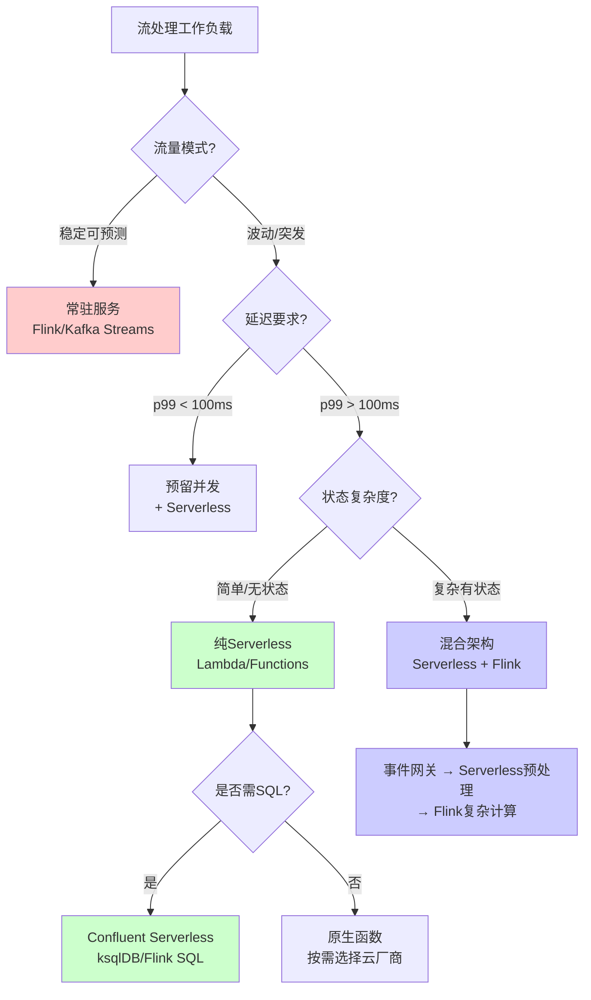
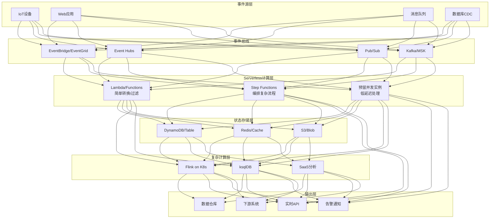
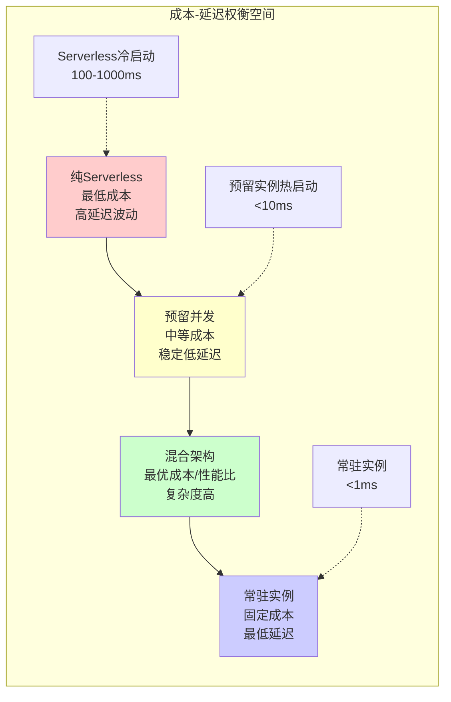
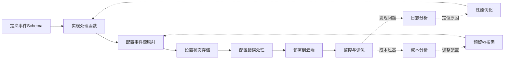

# Serverless流处理架构与云原生实践

> 所属阶段: Knowledge | 前置依赖: [../../Flink/10-deployment/serverless-flink-ga-guide.md](../../Flink/04-runtime/04.01-deployment/serverless-flink-ga-guide.md) | 形式化等级: L3

## 1. 概念定义 (Definitions)

### Def-K-06-130: Serverless流处理系统

Serverless流处理系统是一个七元组 $\mathcal{S}_{serverless} = (F, E, S, T, C, \Lambda, \Omega)$，其中：

- $F$: 函数集合，每个函数 $f_i$ 是无状态计算单元
- $E$: 事件源集合，$E = \{e_1, e_2, ..., e_m\}$
- $S$: 状态存储层，与计算层解耦
- $T$: 触发器规则集合
- $C$: 成本函数，$C: \mathbb{N} \times \mathbb{N} \rightarrow \mathbb{R}^+$（请求数 × 执行时间 → 成本）
- $\Lambda$: 冷启动延迟函数
- $\Omega$: 自动扩缩容策略

**直观解释**: Serverless流处理将事件处理逻辑封装为无状态函数，由事件自动触发执行，计算资源按需分配和计费，状态持久化到外部存储。

### Def-K-06-131: 冷启动与热启动

设函数实例的生命周期为 $L = (t_{init}, t_{ready}, t_{exec}, t_{idle}, t_{term})$：

$$
\text{StartupType}(f) = \begin{cases}
\text{Cold} & \text{if } \nexists i \in \text{Instances}(f): \text{state}(i) = \text{Idle} \\
\text{Warm} & \text{if } \exists i: \text{state}(i) = \text{Idle} \land t_{idle} < T_{max\_idle} \\
\text{Hot} & \text{if } \exists i: \text{state}(i) = \text{Ready}
\end{cases}
$$

其中冷启动延迟 $\Lambda_{cold}$ 通常比热启动延迟 $\Lambda_{warm}$ 高 10-1000 倍。

### Def-K-06-132: 状态外置模式 (Externalized State Pattern)

状态外置模式要求计算函数满足：

$$\forall f \in F: \text{State}(f) = \emptyset \land \exists S_{ext}: \text{Read}(f) \cup \text{Write}(f) \subseteq S_{ext}$$

即函数本身不维护任何本地状态，所有状态读写都通过外部存储服务完成。

### Def-K-06-133: 事件驱动函数链

事件驱动函数链是一个有向无环图 $G = (F_{chain}, D)$，其中：

- $F_{chain} \subseteq F$ 是链中的函数集合
- $D \subseteq F_{chain} \times F_{chain}$ 是数据依赖关系
- 满足：$\forall (f_i, f_j) \in D: \text{Output}(f_i) \subseteq \text{Input}(f_j)$

### Def-K-06-134: Serverless Checkpoint机制

Serverless Checkpoint是一个快照函数 $\mathcal{CP}: (S_{ext}, T_{wm}) \rightarrow \Sigma$，其中：

- $S_{ext}$: 外部状态存储
- $T_{wm}$: 水印时间戳
- $\Sigma$: 一致性状态快照

要求满足：$\forall \sigma \in \Sigma: \text{Consistency}(\sigma) \in \{\text{EXACTLY\_ONCE}, \text{AT\_LEAST\_ONCE}\}$

### Def-K-06-135: 混合架构模型

混合架构是一个资源分配函数 $\mathcal{H}: W \rightarrow (F_{serverless}, F_{resident})$，将工作负载映射到：

- $F_{serverless}$: Serverless函数池（弹性、按调用计费）
- $F_{resident}$: 常驻实例池（稳定、预留资源）

优化目标：$\min_{\mathcal{H}} \left[ C_{serverless}(W_{spike}) + C_{resident}(W_{base}) + \lambda \cdot L_{SLA}(W) \right]$

## 2. 属性推导 (Properties)

### Prop-K-06-95: Serverless成本边界

**命题**: 对于请求到达率为 $\lambda$、平均执行时间为 $\mu$ 的工作负载，Serverless月成本满足：

$$C_{serverless} = \lambda \cdot \mu \cdot c_{compute} + \lambda \cdot c_{request} + c_{storage}$$

与常驻实例成本 $C_{resident} = c_{provisioned} \cdot T_{month}$ 的盈亏平衡点：

$$\lambda^* = \frac{c_{provisioned} \cdot T_{month} - c_{storage}}{\mu \cdot c_{compute} + c_{request}}$$

当实际请求率 $\lambda < \lambda^*$ 时，Serverless更经济。

**证明**: 直接由成本函数定义可得。$\square$

### Prop-K-06-96: 冷启动对延迟的影响边界

设函数链长度为 $n$，各函数冷启动概率为 $p_i$，则期望端到端延迟：

$$\mathbb{E}[L_{e2e}] = \sum_{i=1}^{n} \left[ p_i \cdot \Lambda_{cold} + (1-p_i) \cdot \Lambda_{warm} + \mu_i \right]$$

若要求 $\mathbb{E}[L_{e2e}] \leq L_{SLA}$，则冷启动概率约束：

$$p_{max} = \frac{L_{SLA} - \sum_{i=1}^{n}(\Lambda_{warm} + \mu_i)}{\sum_{i=1}^{n}(\Lambda_{cold} - \Lambda_{warm})}$$

**证明**: 由期望线性性质推导。$\square$

### Thm-K-06-95: 状态外置的一致性定理

**定理**: 在满足以下条件时，状态外置模式可以保证最终一致性：

1. **幂等写入**: $\forall w \in \text{Writes}: w(S_{ext}, v) = S_{ext} \oplus v$ 是幂等操作
2. **单调读取**: 读取操作满足 $\text{Read}(t_1) \leq \text{Read}(t_2)$ 当 $t_1 < t_2$
3. **原子性保证**: 单次事务内的所有写操作要么全部成功，要么全部失败

则系统状态收敛：$\lim_{t \rightarrow \infty} S_{ext}(t) = S_{correct}$

**证明**:

假设存在并发写入 $w_1, w_2$ 作用于同一状态项。由幂等性，无论执行顺序如何，重复执行不会产生副作用。由单调读取，后续读取总是看到最新写入的值。由原子性，不会出现部分更新的状态。因此，系统状态最终收敛到正确值。$\square$

### Thm-K-06-96: Serverless自动扩缩容响应时间定理

**定理**: 设负载突增倍数为 $\alpha$，当前实例数为 $k$，目标实例数为 $k' = \alpha \cdot k$，则扩容响应时间：

$$T_{scale}(k, k') = \max\left( \frac{k' - k}{r_{create}}, T_{health} \right) + \Lambda_{cold}$$

其中 $r_{create}$ 为每秒可创建实例数，$T_{health}$ 为健康检查时间。

扩容期间请求排队延迟：

$$T_{queue} = \frac{\lambda_{spike} - k \cdot \mu^{-1}}{k \cdot \mu^{-1}} \cdot T_{scale} \quad \text{if } \lambda_{spike} > k \cdot \mu^{-1}$$

**证明**: 扩容过程分为实例创建和健康检查两个阶段。实例创建是并行进行的，受限于 $r_{create}$。所有新实例必须通过健康检查后才能接收流量。在此期间，超额请求将排队等待。$\square$

### Thm-K-06-97: 混合架构最优配置定理

**定理**: 对于具有基准负载 $\lambda_{base}$ 和峰值负载 $\lambda_{peak}$ 的工作负载，混合架构的最优配置为：

$$F_{resident}^* = \left\lceil \frac{\lambda_{base}}{\mu} \right\rceil, \quad F_{serverless}^* = \left\lceil \frac{\lambda_{peak} - \lambda_{base}}{\mu_{burst}} \right\rceil$$

其中 $\mu_{burst}$ 是Serverless函数 burst 并发度。

总成本最优条件：

$$\frac{\partial C_{total}}{\partial F_{resident}} = 0 \Rightarrow c_{provisioned} = \int_{0}^{T} P(\lambda > F_{resident} \cdot \mu) \cdot c_{serverless} \, dt$$

**证明**: 常驻实例成本固定，与请求数无关。Serverless成本与超额请求成正比。在最优配置下，增加一个常驻实例的边际成本等于因减少Serverless调用而节省的边际成本。$\square$

## 3. 关系建立 (Relations)

### 3.1 Serverless与Dataflow模型的关系

| 维度 | Dataflow模型 | Serverless流处理 |
|------|-------------|-----------------|
| **计算单元** | ParDo/Transform | Function/Lambda |
| **状态管理** | State API (内置) | External Store (外置) |
| **时间语义** | Event Time + Watermark | 通常仅处理时间 |
| **一致性** | Exactly-Once (内置) | 依赖外部存储实现 |
| **资源管理** | 预分配集群 | 按需自动扩缩 |
| **成本模型** | 预留成本为主 | 按调用付费 |

**映射关系**: Serverless流处理可视为Dataflow模型的"轻量化"实现，牺牲了部分语义保证换取极致弹性。

### 3.2 云厂商Serverless流处理对比矩阵

```
┌─────────────────┬─────────────────┬─────────────────┬─────────────────┬─────────────────┐
│     特性        │  AWS Lambda     │ Azure Functions │  Cloud Functions│  Confluent      │
│                 │    + MSK        │  + Event Hubs   │   + Pub/Sub     │  Serverless     │
├─────────────────┼─────────────────┼─────────────────┼─────────────────┼─────────────────┤
│ 冷启动时间      │    100-1000ms   │    50-500ms     │   100-800ms     │    <100ms       │
│ 最大并发        │    1000/区域    │    200/实例     │   1000/函数     │    无限制       │
│ 事件源集成      │      原生       │      原生       │      原生       │    Kafka原生    │
│ 状态存储选项    │  DynamoDB/Elasti│  Cosmos DB/     │  Firestore/     │  ksqlDB内置     │
│                 │      iCache     │  Redis          │   Memorystore   │                 │
│ 执行时长限制    │     15分钟      │    10分钟       │    9分钟        │    无限制       │
│ SQL支持         │      无         │      无         │      无         │     Flink SQL   │
│ 成本模型        │  调用+GB-秒     │  调用+GB-秒     │  调用+GB-秒     │  数据流+计算    │
└─────────────────┴─────────────────┴─────────────────┴─────────────────┴─────────────────┘
```

### 3.3 架构模式演进路径

```
单体应用 ──► 微服务 ──► 容器化 ──► Serverless ──► 混合架构
  │            │          │           │             │
  │            │          │           │             └─► 最优成本/性能比
  │            │          │           └─► 极致弹性
  │            │          └─► 环境一致性
  │            └─► 服务解耦
  └─► 开发简单，扩展困难
```

## 4. 论证过程 (Argumentation)

### 4.1 冷启动延迟优化策略对比

| 策略 | 实现复杂度 | 效果 | 适用场景 |
|-----|----------|------|---------|
| **预留并发** | 低 | 消除冷启动 | 延迟敏感型应用 |
| **预热脚本** | 中 | 减少冷启动概率 | 可预测流量模式 |
| **单例模式** | 低 | 减少初始化开销 | 共享连接池 |
| **精简依赖** | 中 | 降低启动时间 | 所有场景 |
| **自定义运行时** | 高 | 最小化运行时 | 性能极致要求 |

### 4.2 状态外置 vs 内置的性能权衡

**状态外置优势**:

- 函数完全无状态，易于水平扩展
- 状态持久化独立于计算生命周期
- 支持多函数共享状态

**状态外置劣势**:

- 每次访问增加网络延迟（通常 1-10ms）
- 需要处理缓存一致性
- 外部存储成为性能瓶颈和成本来源

**临界点分析**: 当状态访问频率 $f_{state} > \frac{1}{\Lambda_{cold}}$ 时，状态外置的延迟成本可能超过冷启动成本。

### 4.3 Serverless流处理的边界条件

**适用条件**:

1. 事件驱动、异步处理
2. 负载波动大，难以预测
3. 延迟要求相对宽松（>100ms）
4. 状态可外置化

**不适用条件**:

1. 持续高吞吐（>10K RPS/函数）
2. 严格低延迟要求（<50ms p99）
3. 复杂有状态计算（会话窗口、CEP）
4. 长时间运行任务（>15分钟）

## 5. 工程论证 (Engineering Argument)

### 5.1 Serverless流处理架构决策树



### 5.2 成本模型详细分析

**AWS Lambda 成本计算示例**:

假设参数：

- 月请求数：100M
- 平均执行时间：200ms
- 内存配置：512MB
- 预留并发实例：100

计算：

```
计算费用 = 100M × 0.2s × 0.5GB × $0.0000166667/GB-s = $166.67
请求费用 = 100M × $0.20/M = $20.00
预留并发 = 100 × $0.000004646/GB-s × 720h × 3600s × 0.5GB = $601.92
────────────────────────────────────────────────────────────────
总费用 = $788.59/月
```

对比常驻EC2（m5.large × 10）：

```
EC2费用 = 10 × $0.096/h × 720h = $691.20
额外成本（运维、扩缩容）≈ 30%
总费用 ≈ $898.56/月
```

**结论**: 在此场景下，纯Serverless成本略高，但混合架构（预留并发处理基线 + Serverless处理峰值）可优化至 $650-700/月。

### 5.3 Flink on Serverless的实现模式

**模式1: Flink SQL on Kubernetes Serverless**

- 使用 EKS Fargate / AKS Virtual Nodes / GKE Autopilot
- Flink作业以容器形式运行，无需管理节点
- 适合中等规模、持续运行的流作业

**模式2: Confluent Cloud Serverless Flink**

- 完全托管的Flink SQL服务
- 自动扩缩容，按计算单元计费
- 与Kafka/MQ原生集成

**模式3: 函数内嵌Flink MiniCluster**

- 每个函数实例启动一个微型Flink集群
- 适合短时、轻量级计算
- 启动开销大，实用性有限

## 6. 实例验证 (Examples)

### 6.1 AWS Lambda + MSK 事件处理

```python
# 消费MSK事件并处理
import json
import boto3
from aws_lambda_powertools import Logger, Tracer

logger = Logger()
tracer = Tracer()

# 状态外置到DynamoDB
dynamodb = boto3.resource('dynamodb')
state_table = dynamodb.Table('event-processing-state')

@logger.inject_lambda_context
@tracer.capture_lambda_handler
def lambda_handler(event, context):
    """
    处理MSK批量事件
    实现了幂等处理和状态追踪
    """
    processed_count = 0

    for record in event['records']:
        payload = json.loads(base64.b64decode(record['value']))
        event_id = payload['event_id']

        # 幂等性检查
        existing = state_table.get_item(Key={'event_id': event_id})
        if 'Item' in existing:
            logger.info(f"Event {event_id} already processed, skipping")
            continue

        try:
            # 业务处理逻辑
            result = process_event(payload)

            # 记录处理状态
            state_table.put_item(Item={
                'event_id': event_id,
                'status': 'completed',
                'result': result,
                'ttl': int(time.time()) + 86400  # 24小时过期
            })

            processed_count += 1

        except Exception as e:
            logger.error(f"Failed to process event {event_id}: {e}")
            # 失败事件进入死信队列
            send_to_dlq(payload, str(e))

    return {
        'statusCode': 200,
        'body': json.dumps({'processed': processed_count})
    }

def process_event(payload):
    """实际的业务处理逻辑"""
    # 实现数据清洗、转换、聚合等
    pass
```

### 6.2 Azure Functions + Event Hubs 状态外置

```csharp
using Microsoft.Azure.Functions.Worker;
using Microsoft.Extensions.Logging;
using StackExchange.Redis;

public class EventProcessor
{
    private readonly ILogger<EventProcessor> _logger;
    private readonly IDatabase _redisDb;

    // 连接复用减少冷启动影响
    private static readonly Lazy<ConnectionMultiplexer> _lazyConnection =
        new(() => ConnectionMultiplexer.Connect(
            Environment.GetEnvironmentVariable("REDIS_CONNECTION")));

    public EventProcessor(ILogger<EventProcessor> logger)
    {
        _logger = logger;
        _redisDb = _lazyConnection.Value.GetDatabase();
    }

    [Function("ProcessEvents")]
    public async Task Run(
        [EventHubTrigger("my-hub", Connection = "EventHubConnection")]
        string[] events)
    {
        foreach (var eventData in events)
        {
            var evt = JsonSerializer.Deserialize<Event>(eventData);

            // 会话状态从Redis获取
            var sessionKey = $"session:{evt.SessionId}";
            var state = await _redisDb.StringGetAsync(sessionKey);

            var sessionState = state.IsNullOrEmpty()
                ? new SessionState()
                : JsonSerializer.Deserialize<SessionState>(state!);

            // 更新状态
            sessionState.Update(evt);

            // 写回Redis
            await _redisDb.StringSetAsync(
                sessionKey,
                JsonSerializer.Serialize(sessionState),
                TimeSpan.FromMinutes(30));

            _logger.LogInformation("Processed event {EventId} for session {SessionId}",
                evt.Id, evt.SessionId);
        }
    }
}
```

### 6.3 混合架构：API Gateway + Lambda + Flink

```yaml
# 架构示意：Serverless处理边缘，Flink处理核心计算
#
# 用户请求 → API Gateway → Lambda (认证/限流/路由)
#                              ↓
#                        Kafka/Event Hub (缓冲)
#                              ↓
#         ┌────────────────────┼────────────────────┐
#         ↓                    ↓                    ↓
#    Lambda (简单      Flink (复杂聚合/       Lambda (结果
#    转换/过滤)         窗口计算/CEP)          输出/通知)
#         ↓                    ↓                    ↓
#    DynamoDB          PostgreSQL/           WebSocket/
#    (原始数据)          ClickHouse            SNS推送
#                      (分析结果)
```

### 6.4 Confluent Serverless Flink SQL

```sql
-- 创建Kafka源表
CREATE TABLE user_events (
    user_id STRING,
    event_type STRING,
    event_time TIMESTAMP(3),
    amount DECIMAL(10, 2),
    WATERMARK FOR event_time AS event_time - INTERVAL '5' SECOND
) WITH (
    'connector' = 'kafka',
    'topic' = 'user-events',
    'properties.bootstrap.servers' = '${KAFKA_BROKER}',
    'format' = 'json'
);

-- 创建结果输出表 (到另一个Kafka topic)
CREATE TABLE hourly_stats (
    window_start TIMESTAMP(3),
    window_end TIMESTAMP(3),
    event_type STRING,
    total_amount DECIMAL(10, 2),
    event_count BIGINT
) WITH (
    'connector' = 'kafka',
    'topic' = 'hourly-stats',
    'format' = 'json'
);

--  tumbling window 聚合
INSERT INTO hourly_stats
SELECT
    TUMBLE_START(event_time, INTERVAL '1' HOUR) as window_start,
    TUMBLE_END(event_time, INTERVAL '1' HOUR) as window_end,
    event_type,
    SUM(amount) as total_amount,
    COUNT(*) as event_count
FROM user_events
GROUP BY
    TUMBLE(event_time, INTERVAL '1' HOUR),
    event_type;
```

## 7. 可视化 (Visualizations)

### 7.1 Serverless流处理架构全景图



### 7.2 成本-延迟权衡决策图



### 7.3 Serverless流处理开发工作流



### 7.4 云厂商Serverless流处理特性对比雷达图（文字版）

```
                    弹性扩缩容
                       10
                        │
         低延迟 ◄───────┼───────► 高延迟
              0        │        10
                       │
    生态丰富 ◄─────────┼─────────► 生态简单
              0        │        10
                       │
    成本低廉 ◄─────────┼─────────► 成本昂贵
              0        │        10
                       │
         易用 ◄────────┼────────► 复杂
              0        │        10
                       │
         开源 ◄────────┼────────► 专有
              0       10

AWS Lambda:      弹(9) 延(6) 生(10) 本(7) 易(8) 开(5)
Azure Functions: 弹(8) 延(7) 生(7) 本(7) 易(9) 开(4)
Cloud Functions: 弹(8) 延(6) 生(6) 本(7) 易(7) 开(6)
Confluent:       弹(10)延(8) 生(8) 本(6) 易(8) 开(9)
```

## 8. 引用参考 (References)
