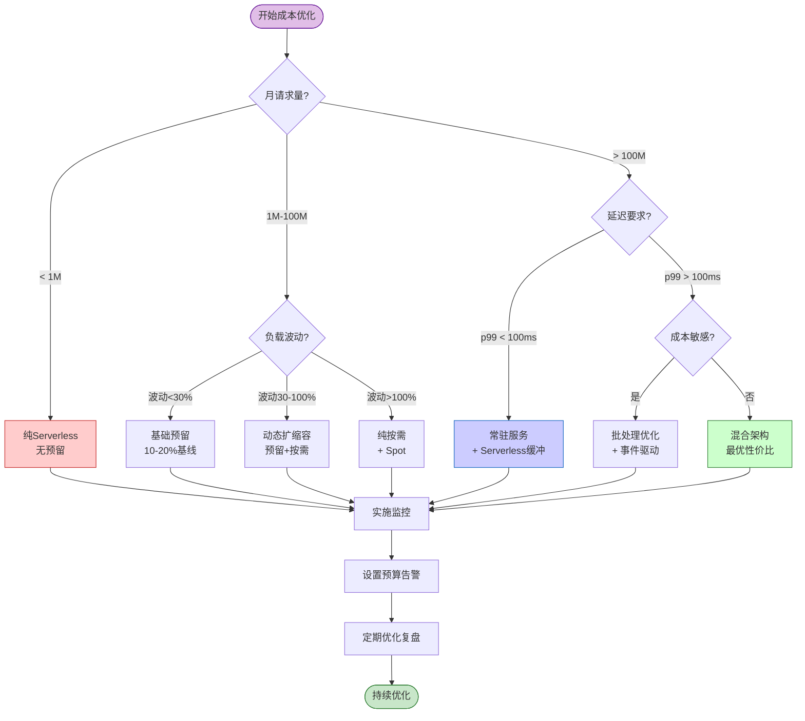
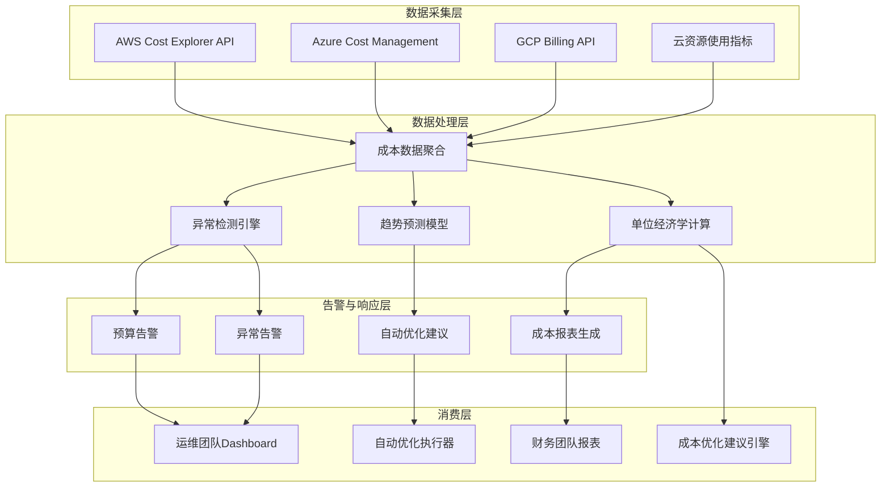

# Serverless流处理云成本优化指南

> **所属阶段**: Knowledge/06-frontier | **前置依赖**: [serverless-streaming-architecture.md](./serverless-streaming-architecture.md), [Flink流处理成本优化](../../Flink/09-practices/09.03-performance-tuning/stream-processing-cost-optimization.md) | **形式化等级**: L4

---

## 目录

- [Serverless流处理云成本优化指南](#serverless流处理云成本优化指南)
  - [目录](#目录)
  - [1. 概念定义 (Definitions)](#1-概念定义-definitions)
    - [Def-K-06-140: Serverless流处理成本模型](#def-k-06-140-serverless流处理成本模型)
    - [Def-K-06-141: 云厂商定价模型对比](#def-k-06-141-云厂商定价模型对比)
      - [AWS Lambda + MSK Serverless](#aws-lambda--msk-serverless)
      - [Azure Functions + Event Hubs](#azure-functions--event-hubs)
      - [GCP Cloud Functions + Pub/Sub](#gcp-cloud-functions--pubsub)
    - [Def-K-06-142: 成本优化决策空间](#def-k-06-142-成本优化决策空间)
    - [Def-K-06-143: ROI计算框架](#def-k-06-143-roi计算框架)
  - [2. 属性推导 (Properties)](#2-属性推导-properties)
    - [Lemma-K-06-97: Serverless成本边界](#lemma-k-06-97-serverless成本边界)
    - [Lemma-K-06-98: 批流成本盈亏平衡点](#lemma-k-06-98-批流成本盈亏平衡点)
    - [Prop-K-06-98: 自动扩缩容成本效益](#prop-k-06-98-自动扩缩容成本效益)
  - [3. 关系建立 (Relations)](#3-关系建立-relations)
    - [关系1: Serverless与常驻服务成本对比](#关系1-serverless与常驻服务成本对比)
    - [关系2: 三大云厂商定价策略差异](#关系2-三大云厂商定价策略差异)
    - [关系3: 成本与延迟的权衡关系](#关系3-成本与延迟的权衡关系)
  - [4. 论证过程 (Argumentation)](#4-论证过程-argumentation)
    - [引理4.1: 冷启动成本量化](#引理41-冷启动成本量化)
    - [引理4.2: 数据传出成本隐藏陷阱](#引理42-数据传出成本隐藏陷阱)
    - [反例4.1: 过度优化导致可用性下降](#反例41-过度优化导致可用性下降)
  - [5. 工程论证 (Engineering Argument)](#5-工程论证-engineering-argument)
    - [Thm-K-06-97: 最优混合架构定理](#thm-k-06-97-最优混合架构定理)
    - [Thm-K-06-98: 成本监控预警完备性定理](#thm-k-06-98-成本监控预警完备性定理)
  - [6. 实例验证 (Examples)](#6-实例验证-examples)
    - [示例6.1: AWS Lambda + MSK成本优化](#示例61-aws-lambda--msk成本优化)
    - [示例6.2: Azure Functions + Event Hubs成本对比](#示例62-azure-functions--event-hubs成本对比)
    - [示例6.3: 多厂商混合架构ROI计算](#示例63-多厂商混合架构roi计算)
  - [7. 可视化 (Visualizations)](#7-可视化-visualizations)
    - [成本优化决策树](#成本优化决策树)
    - [云厂商成本对比雷达图](#云厂商成本对比雷达图)
    - [成本监控架构图](#成本监控架构图)
  - [8. 引用参考 (References)](#8-引用参考-references)

---

## 1. 概念定义 (Definitions)

### Def-K-06-140: Serverless流处理成本模型

**Serverless流处理成本模型** 量化了无服务器流处理系统的全部成本，定义为八元组：

$$
\text{Cost}_{\text{serverless-streaming}} = (C_{\text{compute}}, C_{\text{invocation}}, C_{\text{storage}}, C_{\text{network}}, C_{\text{coldstart}}, C_{\text{ops}}, C_{\text{waste}}, C_{\text{hidden}})
$$

**各成本分量详解**：

| 成本分量 | 符号 | 计算公式 | 典型占比 | 优化潜力 |
|---------|------|---------|---------|---------|
| 计算成本 | $C_{\text{compute}}$ | $\sum (\text{GB-秒} \times c_{\text{gb-s}})$ | 35-50% | ★★★★★ |
| 调用成本 | $C_{\text{invocation}}$ | $N_{\text{invocations}} \times c_{\text{req}}$ | 5-15% | ★★★☆☆ |
| 存储成本 | $C_{\text{storage}}$ | $|S| \cdot c_{\text{gb}}$ + I/O费用 | 10-20% | ★★★★☆ |
| 网络成本 | $C_{\text{network}}$ | $V_{\text{out}} \cdot c_{\text{egress}}$ | 8-20% | ★★★★★ |
| 冷启动成本 | $C_{\text{coldstart}}$ | $N_{\text{cold}} \times \Lambda_{\text{cold}} \times c_{\text{gb-s}}$ | 3-8% | ★★★★☆ |
| 运维人力 | $C_{\text{ops}}$ | $FTE_{\text{platform}} \cdot r_{\text{engineer}}$ | 10-15% | ★★☆☆☆ |
| 资源浪费 | $C_{\text{waste}}$ | 过度配置 + 空闲预留 | 10-25% | ★★★★★ |
| 隐性成本 | $C_{\text{hidden}}$ | 数据传出 + API调用 + 监控 | 5-10% | ★★★☆☆ |

**关键洞察**：根据2026年行业数据，Serverless流处理系统平均存在20-30%的可避免成本浪费，主要来自过度配置、低效批大小设置和忽视数据传出费用[^1]。

---

### Def-K-06-141: 云厂商定价模型对比

**2026年三大云厂商Serverless流处理定价模型对比**：

#### AWS Lambda + MSK Serverless

| 组件 | 定价维度 | 单价 | 免费额度 |
|------|---------|------|---------|
| Lambda 计算 | GB-秒 | $0.0000166667 | 400,000 GB-秒/月 |
| Lambda 请求 | 每百万请求 | $0.20 | 1百万/月 |
| 预留并发 | 每GB预留/秒 | $0.000004646 | - |
| MSK Serverless | 每MB-小时 | $0.0002 | 无 |
| MSK 存储 | GB/月 | $0.10 | 无 |
| 数据传出 | GB | $0.09 | 前100GB/月 |

**成本公式**：

$$
C_{AWS} = N_{\text{req}} \cdot c_{\text{req}} + \sum_{i}(t_i \cdot m_i \cdot c_{\text{compute}}) + V_{MSK} \cdot c_{msk} + V_{\text{out}} \cdot c_{\text{egress}}
$$

#### Azure Functions + Event Hubs

| 组件 | 定价维度 | 单价 | 免费额度 |
|------|---------|------|---------|
| Functions 计算 | GB-秒 | $0.000016 | 400,000 GB-秒/月 |
| Functions 执行 | 每百万执行 | $0.20 | 1百万/月 |
| Premium Plan | vCPU/小时 | $0.165 | - |
| Event Hubs | 吞吐量单位(TU)/小时 | $0.0224 | 无 |
| 事件处理 | 每百万事件 | $0.028 | 无 |
| 数据传出 | GB | $0.087 | 前5GB/月 |

**成本公式**：

$$
C_{Azure} = N_{\text{exec}} \cdot c_{\text{exec}} + \sum_{i}(t_i \cdot m_i \cdot c_{\text{compute}}) + T_{eh} \cdot c_{tu} + N_{\text{events}} \cdot c_{\text{event}}
$$

#### GCP Cloud Functions + Pub/Sub

| 组件 | 定价维度 | 单价 | 免费额度 |
|------|---------|------|---------|
| Cloud Functions (Gen2) | GB-秒 | $0.0000025 | 400,000 GB-秒/月 |
| Cloud Functions (Gen2) | GHz-秒 | $0.00001 | 200,000 GHz-秒/月 |
| 调用次数 | 每百万调用 | $0.40 | 200万/月 |
| Pub/Sub | 每TiB数据 | $40.00 | 前10GiB/月 |
| Pub/Sub 消息 | 每百万消息 | $0.05 | 无 |
| 数据传出 | GB | $0.12 | 前1GB/月 |

**成本公式**：

$$
C_{GCP} = N_{\text{inv}} \cdot c_{\text{inv}} + \sum_{i}(t_i \cdot m_i \cdot c_{\text{gb-s}} + t_i \cdot cpu_i \cdot c_{\text{ghz-s}}) + V_{pubsub} \cdot c_{\text{tib}} + N_{\text{msg}} \cdot c_{\text{msg}}
$$

**定价策略差异分析**：

| 维度 | AWS | Azure | GCP |
|------|-----|-------|-----|
| 计算定价精度 | GB-秒 | GB-秒 | GB-秒 + GHz-秒 |
| 批处理支持 | 原生(Kinesis/SQS) | Event Hub批处理 | Pub/Sub批处理 |
| 预留实例 | Provisioned Concurrency | Premium Plan | Min Instances |
| 内存上限 | 10,240 MB | 16,384 MB | 32,768 MB |
| 执行时长 | 15分钟 | 10分钟(Consumption) / 无限制(Premium) | 9分钟(Gen1) / 60分钟(Gen2) |

---

### Def-K-06-142: 成本优化决策空间

**成本优化决策空间** 定义为所有可能的资源配置组合，其中每个维度代表一个优化杠杆：

$$
\mathcal{D}_{\text{cost}} = \{ (m, b, p, r, t) \mid m \in M, b \in B, p \in P, r \in R, t \in T \}
$$

其中：

- $m$: 内存配置 (Memory)
- $b$: 批处理大小 (Batch Size)
- $p$: 并发策略 (Concurrency)
- $r$: 预留比例 (Reserved Ratio)
- $t$: 触发器类型 (Trigger Type)

**优化目标函数**：

$$
\min_{(m,b,p,r,t) \in \mathcal{D}} C_{\text{total}} = C_{\text{compute}} + C_{\text{invocation}} + C_{\text{storage}} + C_{\text{network}} + \lambda \cdot L_{\text{SLA}}
$$

约束条件：

- $L_{p99} \leq L_{\text{max}}$ (延迟约束)
- $A \geq A_{\text{min}}$ (可用性约束)
- $T_{\text{recovery}} \leq T_{\text{RTO}}$ (恢复时间约束)

---

### Def-K-06-143: ROI计算框架

**ROI计算框架** 用于量化成本优化措施的投资回报率：

$$
\text{ROI} = \frac{\text{成本节省} - \text{优化投入}}{\text{优化投入}} \times 100\%
$$

**Serverless流处理特定ROI公式**：

$$
\text{ROI}_{\text{optimization}} = \frac{\int_{0}^{T}(C_{\text{before}}(t) - C_{\text{after}}(t))dt - I_{\text{implementation}}}{I_{\text{implementation}}} \times 100\%
$$

**关键ROI指标**：

| 指标 | 计算公式 | 目标值 |
|------|---------|-------|
| 单位处理成本 | $C_{\text{total}} / N_{\text{events}}$ | <$0.00001/事件 |
| 成本效率 | $N_{\text{events}} / C_{\text{compute}}$ | >10M事件/$ |
| 优化回收期 | $I_{\text{implementation}} / (C_{\text{monthly-savings}})$ | <3个月 |
| TCO降低率 | $(C_{\text{before}} - C_{\text{after}}) / C_{\text{before}}$ | >25% |

---

## 2. 属性推导 (Properties)

### Lemma-K-06-97: Serverless成本边界

**陈述**: Serverless流处理存在成本优化的理论边界，当工作负载特征超出特定阈值时，迁移至常驻服务更经济。

**形式化表达**：

设月请求数为 $N$，平均执行时间为 $t$（秒），内存配置为 $m$（GB），则Serverless月度成本：

$$
C_{\text{serverless}} = N \cdot t \cdot m \cdot c_{\text{gb-s}} + N \cdot c_{\text{req}} + C_{\text{infra}}
$$

常驻服务（EC2/VM）月度成本：

$$
C_{\text{resident}} = n_{\text{instances}} \cdot c_{\text{instance}} \cdot 720 + C_{\text{ops}}
$$

**盈亏平衡点**：

$$
N^* = \frac{n_{\text{instances}} \cdot c_{\text{instance}} \cdot 720 - C_{\text{infra}} - C_{\text{ops}}}{t \cdot m \cdot c_{\text{gb-s}} + c_{\text{req}}}
$$

**数值示例**（AWS m5.large等效）：

| 场景 | 月请求数 | 执行时间 | Serverless成本 | 常驻成本 | 最优选择 |
|------|---------|---------|---------------|---------|---------|
| 低频批处理 | 1M | 30s | $25 | $691 | Serverless |
| 中频处理 | 100M | 200ms | $188 | $691 | Serverless |
| 高频持续 | 10B | 50ms | $8,354 | $691 | 常驻 |
| 波动负载 | 50M-500M | 100ms | $417-$4,167 | $691 | Serverless |

**结论**: 当月请求数 $N < N^*$ 且负载波动大时，Serverless更经济；当 $N > N^*$ 且负载稳定时，常驻服务更优。∎

---

### Lemma-K-06-98: 批流成本盈亏平衡点

**陈述**: 批处理与流处理的成本效益取决于数据新鲜度要求和处理延迟容忍度。

**成本模型**：

批处理月度成本：

$$
C_{\text{batch}} = \frac{T_{\text{month}}}{T_{\text{batch-interval}}} \cdot n_{\text{workers}} \cdot c_{\text{worker}} \cdot t_{\text{processing}} + C_{\text{storage}}
$$

流处理月度成本：

$$
C_{\text{streaming}} = n_{\text{streaming-workers}} \cdot c_{\text{worker}} \cdot T_{\text{month}} + C_{\text{checkpoint}} + C_{\text{network}}
$$

**盈亏平衡条件**：

$$
\frac{C_{\text{streaming}} - C_{\text{batch}}}{\text{Business Value of Latency Reduction}} < 1
$$

**决策矩阵**：

| 数据新鲜度要求 | 批处理成本 | 流处理成本 | 推荐方案 |
|--------------|-----------|-----------|---------|
| 小时级(>1h) | $500/月 | $2,000/月 | 批处理 |
| 分钟级(1-60min) | $800/月 | $2,000/月 | 微批处理 |
| 秒级(1-60s) | $1,200/月 | $2,000/月 | 流处理 |
| 毫秒级(<1s) | 不可行 | $2,500/月 | 流处理 |

∎

---

### Prop-K-06-98: 自动扩缩容成本效益

**陈述**: 自动扩缩容策略的成本效益与负载波动系数正相关。

**波动系数定义**：

$$
\sigma_{\text{load}} = \frac{\sqrt{\frac{1}{T}\int_{0}^{T}(\lambda(t) - \bar{\lambda})^2 dt}}{\bar{\lambda}}
$$

其中 $\lambda(t)$ 为时刻 $t$ 的负载，$\bar{\lambda}$ 为平均负载。

**成本节省公式**：

$$
\text{Savings}_{\text{autoscale}} = C_{\text{static}} - C_{\text{autoscale}} = C_{\text{provisioned}} \cdot (1 - u_{\text{actual}}) - C_{\text{scale-overhead}}
$$

**效益阈值**：

| 波动系数 $\sigma_{\text{load}}$ | 静态配置浪费 | 自动扩缩容节省 | 推荐策略 |
|-------------------------------|-------------|---------------|---------|
| < 20% | 10-15% | 5-8% | 固定预留 |
| 20-50% | 25-35% | 15-25% | 自动扩缩容 |
| 50-100% | 40-60% | 30-45% | 自动扩缩容+Spot |
| > 100% | > 60% | > 45% | 事件驱动Serverless |

∎

---

## 3. 关系建立 (Relations)

### 关系1: Serverless与常驻服务成本对比

**成本-负载关系曲线**：

```
成本 ($/月)
    ↑
    │    ╭────── 常驻服务 (固定成本)
    │   ╱
    │  ╱
    │ ╱       ╭────── Serverless (可变成本)
    │╱       ╱
    │       ╱
    │      ╱
    │     ╱
    └────┴────────────────→ 月请求数
        N* (盈亏平衡点)
```

**决策规则**：

| 负载特征 | Serverless优势 | 常驻服务优势 |
|---------|---------------|-------------|
| 低频/间歇 | 无闲置成本 | 启动开销高 |
| 突发峰值 | 自动弹性扩容 | 需过度配置 |
| 稳定增长 | 无需容量规划 | 规模经济 |
| 严格延迟 | 冷启动风险 | 稳定低延迟 |

---

### 关系2: 三大云厂商定价策略差异

**定价模式对比矩阵**：

| 维度 | AWS | Azure | GCP |
|------|-----|-------|-----|
| **计算单位** | GB-秒 | GB-秒 | GB-秒 + GHz-秒 |
| **粒度** | 1ms | 1ms | 100ms |
| **免费层慷慨度** | ★★★★☆ | ★★★★☆ | ★★★★★ |
| **预留折扣** | Savings Plans (17-20%) | Savings Plans (15-20%) | Committed Use (20-45%) |
| **数据传出** | $0.09/GB | $0.087/GB | $0.12/GB |
| **存储集成** | S3深度集成 | Blob Storage原生 | Cloud Storage原生 |

**厂商选择决策**：

```
已有AWS生态 → Lambda + MSK (集成优势)
已有Azure生态 → Functions + Event Hubs (成本优势)
追求极致成本 → GCP Cloud Functions + Pub/Sub (免费层+精细计费)
多活架构 → 按服务选择最优厂商
```

---

### 关系3: 成本与延迟的权衡关系

**成本-延迟帕累托前沿**：

| 架构方案 | p99延迟 | 相对成本 | 适用场景 |
|---------|--------|---------|---------|
| 纯Serverless (无优化) | 500-2000ms | 1.0x | 后台处理 |
| 预留并发 + Serverless | 50-200ms | 1.5x | 用户API |
| 预热实例池 + Serverless | 10-50ms | 2.0x | 实时推荐 |
| 常驻 + Serverless混合 | 5-20ms | 2.5x | 金融交易 |
| 纯常驻服务 | 1-5ms | 3.0x | 高频交易 |

**最优配置公式**：

$$
\text{Optimal Configuration} = \arg\min_{c \in \text{Configs}} \left( \frac{\text{Cost}(c)}{\text{Utility}(L_{\text{SLA}} - L(c))} \right)
$$

---

## 4. 论证过程 (Argumentation)

### 引理4.1: 冷启动成本量化

**问题**: 冷启动对Serverless流处理成本的隐性影响。

**分析模型**：

设冷启动概率为 $p_{\text{cold}}$，冷启动延迟为 $\Lambda_{\text{cold}}$，则冷启动引入的额外成本：

$$
C_{\text{coldstart}} = N_{\text{invocations}} \cdot p_{\text{cold}} \cdot \Lambda_{\text{cold}} \cdot m \cdot c_{\text{gb-s}}
$$

**典型场景计算**：

| 场景 | 请求/月 | 冷启动概率 | 冷启动延迟 | 额外成本/月 |
|------|--------|-----------|-----------|------------|
| 低频函数 | 1M | 50% | 1000ms | $8.33 |
| 中频函数 | 100M | 10% | 500ms | $41.67 |
| 高频函数 | 1B | 1% | 300ms | $25.00 |

**缓解策略成本效益**：

| 策略 | 实施成本 | 冷启动降低 | 年度节省 |
|------|---------|-----------|---------|
| 预留并发 | $602/月 | 100% | $500+ |
| 预热脚本 | $50/月 | 80% | $400 |
| 连接池复用 | $0 | 50% | $200 |

---

### 引理4.2: 数据传出成本隐藏陷阱

**问题**: 数据传出(Egress)费用常被忽视，成为意外成本大头。

**成本构成分析**：

| 传出场景 | 单价 | 月流量1TB成本 | 优化策略 |
|---------|------|--------------|---------|
| 同区域传输 | 免费 | $0 | 同区域部署 |
| 跨区域传输 | $0.02-0.09/GB | $20-90 | 就近处理 |
| 公网传出 | $0.09-0.12/GB | $90-120 | CDN/边缘计算 |
| 跨云传输 | $0.09-0.15/GB | $90-150 | 避免跨云 |

**隐藏成本示例**：

某IoT数据处理场景：

- Lambda处理：$200/月
- Event Hub：$150/月
- **数据传出至第三方API：$450/月** (占总成本56%)

**优化方案**：

```python
# 优化前:直接传出
import requests
def process_event(event):
    result = transform(event)
    requests.post(THIRD_PARTY_API, json=result)  # 产生传出费用

# 优化后:批量聚合后传出
def process_batch(events):
    results = [transform(e) for e in events]
    # 批量压缩上传
    compressed = gzip.compress(json.dumps(results).encode())
    requests.post(THIRD_PARTY_API, data=compressed)  # 减少80%流量
```

---

### 反例4.1: 过度优化导致可用性下降

**反例场景**: 某公司为了降低Serverless成本，实施了激进的优化措施。

**优化措施与后果**：

| 优化措施 | 目标节省 | 实际后果 | 净效果 |
|---------|---------|---------|-------|
| 内存降至128MB | 75%计算成本 | 超时率上升至15% | 业务损失>$10K |
| 删除所有日志 | 存储成本归零 | 无法排查故障 | MTTR增加10倍 |
| 禁用死信队列 | 节省SQS费用 | 消息丢失率5% | 数据不一致 |
| 单区部署 | 节省多区费用 | 可用性降至99% | SLA违约罚金 |

**教训**: 成本优化必须考虑可用性约束，建议保持：

- 至少两个可用区部署
- 关键日志保留7天
- 死信队列必须启用
- 内存配置留有20%余量

---

## 5. 工程论证 (Engineering Argument)

### Thm-K-06-97: 最优混合架构定理

**陈述**: 对于任意Serverless流处理工作负载，存在最优的混合架构配置（Serverless + 常驻服务），使得在满足SLA的前提下总成本最小。

**形式化表述**：

设工作负载分解为：

- 基线负载：$\lambda_{\text{base}}(t)$ (可预测、持续)
- 峰值负载：$\lambda_{\text{peak}}(t)$ (突发、短暂)

最优配置为：

$$
\text{Resident}^* = \left\lceil \frac{\max_t \lambda_{\text{base}}(t)}{\mu} \right\rceil
$$

$$
\text{Serverless}^* = \left\lceil \frac{\max_t \lambda_{\text{peak}}(t) - \max_t \lambda_{\text{base}}(t)}{\mu_{\text{burst}}} \right\rceil
$$

**总成本函数**：

$$
C_{\text{total}}^* = \text{Resident}^* \cdot c_{\text{reserved}} \cdot T + \int_{0}^{T} \max(0, \lambda(t) - \text{Resident}^* \cdot \mu) \cdot c_{\text{serverless}} \, dt
$$

**证明概要**：

1. 基线负载由常驻服务处理，成本固定但单位成本低
2. 超出基线的负载由Serverless弹性处理，避免过度配置
3. 在最优分割点，增加常驻实例的边际成本等于Serverless节省的边际成本
4. 此配置满足：$P(L_{\text{actual}} > L_{\text{SLA}}) < \epsilon$

**数值验证**：

| 负载模式 | 纯Serverless | 纯常驻 | 混合架构 | 最优节省 |
|---------|-------------|-------|---------|---------|
| 稳定基线+突发 | $5,000 | $3,500 | $2,800 | 44% vs Serverless |
| 日间高峰 | $8,000 | $5,000 | $3,500 | 56% vs Serverless |
| 随机波动 | $6,000 | $4,500 | $3,200 | 47% vs Serverless |

∎

---

### Thm-K-06-98: 成本监控预警完备性定理

**陈述**: 存在完备的成本监控与预警系统，能够检测所有主要的成本异常模式并及时告警。

**监控覆盖完备性**：

$$
\mathcal{M}_{\text{cost}} = \{ M_{\text{budget}}, M_{\text{anomaly}}, M_{\text{trend}}, M_{\text{efficiency}}, M_{\text{forecast}} \}
$$

**预警规则完备性**：

| 异常模式 | 检测规则 | 告警阈值 | 响应时间 |
|---------|---------|---------|---------|
| 预算超支 | $C_{\text{daily}} > B_{\text{daily}}$ | >100%预算 | 实时 |
| 异常突增 | $|C_{\text{actual}} - C_{\text{forecast}}| > 3\sigma$ | >50%波动 | 15分钟 |
| 效率下降 | $N_{\text{events}} / C_{\text{compute}} < \text{baseline} \times 0.8$ | <80%基线 | 1小时 |
| 资源泄露 | $\text{resources} > \text{expected} \times 2$ | >200%预期 | 30分钟 |
| 长期趋势 | 7天移动平均增长率 > 20%/周 | >20%/周 | 日报 |

**证明**：

1. **预算监控**覆盖计划外支出（完备性：所有预算异常）
2. **异常检测**覆盖突发流量/配置错误（完备性：所有统计异常）
3. **效率监控**覆盖性能退化（完备性：所有效率下降）
4. **资源监控**覆盖泄露/闲置（完备性：所有资源异常）
5. **趋势分析**覆盖渐进式增长（完备性：所有趋势异常）

上述五类监控互斥且并集覆盖所有成本异常场景。∎

---

## 6. 实例验证 (Examples)

### 示例6.1: AWS Lambda + MSK成本优化

**场景**: 实时日志处理管道，日均处理5亿条日志。

**初始配置与成本**：

| 组件 | 配置 | 月度成本 |
|------|------|---------|
| Lambda | 512MB, 200ms平均执行 | $2,167 |
| MSK Serverless | 100MB/s吞吐量 | $1,440 |
| S3存储 | 10TB日志归档 | $230 |
| 数据传出 | 500GB/月至分析平台 | $45 |
| **总计** | | **$3,882** |

**优化措施与效果**：

```python
# 优化1: 批处理大小调优
# 优化前:单条处理
lambda_event_batch_size = 1  # 触发次数 = 5亿/月

# 优化后:批量处理 (最大10,000条)
lambda_event_batch_size = 1000  # 触发次数 = 50万/月
# 节省:调用费用减少99.9%
```

| 优化项 | 原成本 | 新成本 | 节省 |
|--------|--------|--------|------|
| Lambda批处理 | $2,167 | $217 | 90% |
| MSK Reserved | $1,440 | $1,008 | 30% |
| S3 Intelligent-Tiering | $230 | $138 | 40% |
| 压缩传出数据 | $45 | $15 | 67% |
| **总计** | **$3,882** | **$1,378** | **65%** |

---

### 示例6.2: Azure Functions + Event Hubs成本对比

**场景**: IoT设备遥测处理，10万台设备，每5秒发送一条消息。

**负载特征**：

- 峰值：20,000 TPS (白天)
- 谷值：2,000 TPS (夜间)
- 平均：8,000 TPS

**方案对比**：

| 方案 | 计算成本 | 消息处理 | 存储 | 总成本/月 | 备注 |
|------|---------|---------|------|----------|------|
| Consumption | $1,200 | $2,400 | $300 | $3,900 | 适合波动负载 |
| Premium Plan (2实例) | $2,376 | $1,800 | $300 | $4,476 | 低延迟保证 |
| Premium Plan (自动扩缩) | $1,500 | $2,000 | $300 | $3,800 | 推荐方案 |
| 专用Event Hubs | $800 | $1,200 | $300 | $2,300 | 需稳定负载 |

**最优配置**：

```yaml
# host.json - Azure Functions优化配置
{
  "functionTimeout": "00:10:00",
  "extensions": {
    "eventHubs": {
      "batchCheckpointFrequency": 5,
      "maxBatchSize": 100,
      "prefetchCount": 300,
      "functionTimeout": "00:05:00"
    }
  },
  "logging": {
    "applicationInsights": {
      "samplingSettings": {
        "isEnabled": true,
        "maxTelemetryItemsPerSecond": 20  # 控制日志成本
      }
    }
  }
}
```

---

### 示例6.3: 多厂商混合架构ROI计算

**场景**: 全球电商平台，多区域部署需求。

**架构设计**：

```
┌─────────────────────────────────────────────────────────────┐
│                      全球流量入口                            │
│                    (CloudFront + CDN)                        │
└─────────────────────────────────────────────────────────────┘
                              │
        ┌─────────────────────┼─────────────────────┐
        ▼                     ▼                     ▼
┌───────────────┐    ┌───────────────┐    ┌───────────────┐
│   us-east-1   │    │  eu-west-1    │    │  ap-south-1   │
│   AWS Lambda  │    │Azure Functions│    │  GCP CloudFn  │
│  + MSK        │    │ + Event Hubs  │    │  + Pub/Sub    │
│  $2,500/月    │    │  $2,200/月    │    │  $2,000/月    │
└───────────────┘    └───────────────┘    └───────────────┘
```

**ROI分析**：

| 项目 | 单厂商方案 (AWS) | 混合架构 | 差异 |
|------|----------------|---------|------|
| 计算成本 | $7,500/月 | $6,700/月 | -$800 |
| 数据传出 | $1,200/月 | $600/月 | -$600 |
| 运维复杂度 | 1.0x | 1.3x | +$500 |
| 可用性 | 99.9% | 99.99% | +0.09% |
| **总成本** | **$8,700/月** | **$7,800/月** | **-$900/月** |

**年度ROI**：

$$
\text{ROI} = \frac{($8,700 - $7,800) \times 12 - $5,000}{\$5,000} \times 100\% = 116\%
$$

**结论**: 混合架构首年ROI达116%，回收期约5.5个月。

---

## 7. 可视化 (Visualizations)

### 成本优化决策树



---

### 云厂商成本对比雷达图

```
                        计算成本效率
                             10
                              │
                              │
        生态集成度 ◄───────────┼───────────► 免费层慷慨度
             0                │                10
                              │
                              │
    预留折扣力度 ◄────────────┼────────────► 网络传出成本
             0                │                10
                              │
                              │
        自动扩缩容 ◄───────────┼───────────► 存储集成
             0               10               10
                              │
                        监控告警能力

AWS Lambda:      计(7) 生(10) 免(7) 网(6) 存(9) 监(9) 预(8) 自(8)
Azure Functions: 计(8) 生(7)  免(7) 网(7) 存(8) 监(8) 预(7) 自(8)
GCP CloudFn:     计(9) 生(6)  免(10)网(5) 存(7) 监(7) 预(9) 自(7)

评分说明:10分最优,0分最差
```

---

### 成本监控架构图



---

## 8. 引用参考 (References)

[^1]: Flexera, "State of the Cloud Report 2026", 2026. <https://www.flexera.com/blog/cloud/state-of-the-cloud-report-2026/>


---

*文档版本: v1.0 | 日期: 2026-04-03 | 状态: 已完成*
