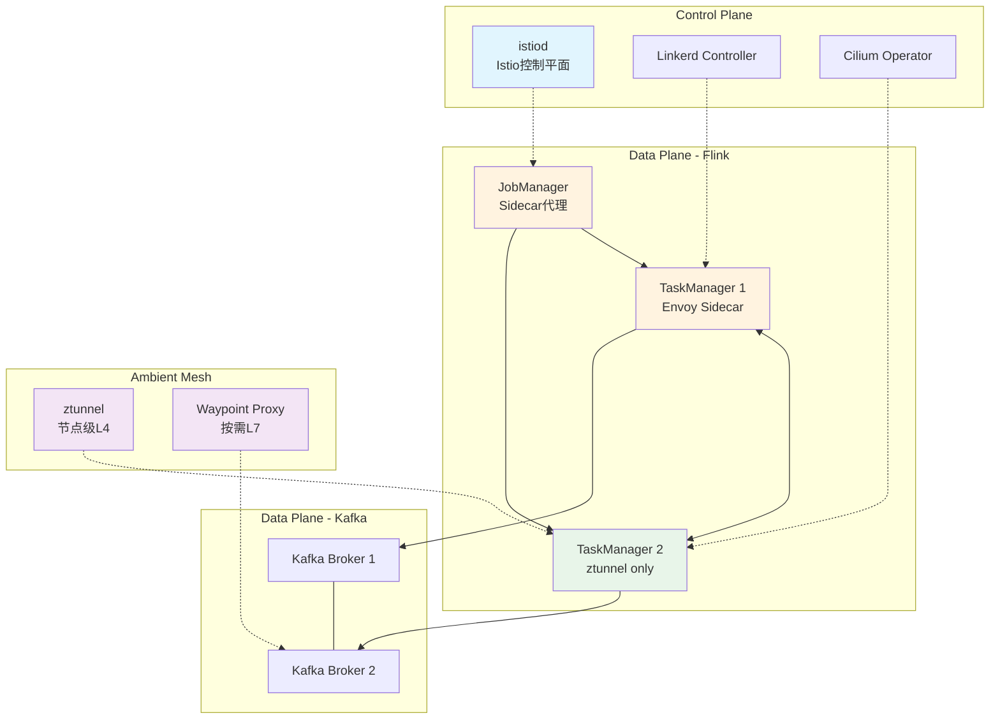
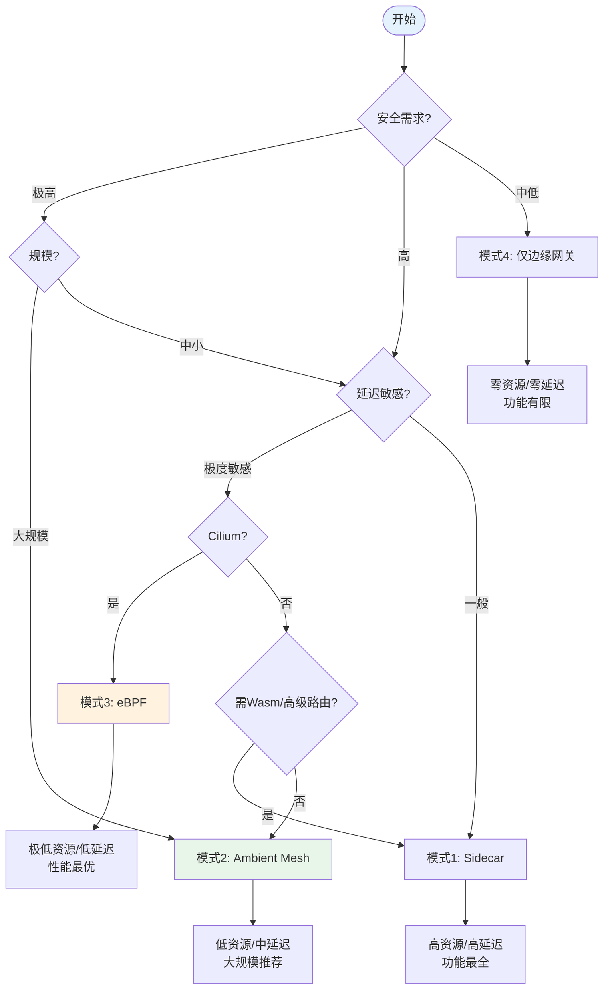
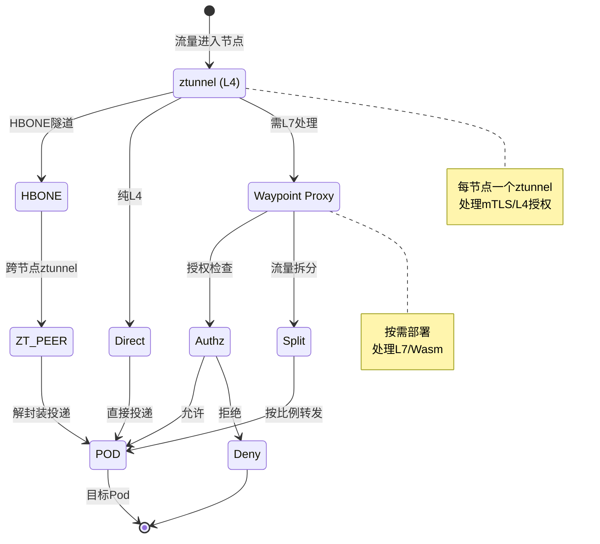

# Service Mesh与流处理集成架构指南

> **所属阶段**: Knowledge | **前置依赖**: [Flink/04-runtime/flink-on-kubernetes.md](../../Flink/04-runtime/flink-on-kubernetes.md)、[Knowledge/04-technology-selection/engine-selection-guide.md](../04-technology-selection/engine-selection-guide.md) | **形式化等级**: L3-L4

## 1. 概念定义 (Definitions)

### Def-K-SM-01: Service Mesh (服务网格)

Service Mesh 是一种**基础设施层**，将服务间通信能力（连接、安全、流量控制、可观测性）从应用剥离，下沉到独立代理组件中。

**形式化描述**：设分布式系统为图 $\mathcal{S} = (V, E)$，引入代理层 $P$ 将通信重构为：

$$\forall (u, v) \in E: \quad u \xrightarrow{p_u} p_v \xrightarrow{} v$$

其中 $p_u, p_v \in P$ 为依附于服务实例的代理，形成**逻辑集中控制、物理分布式执行**架构。

| 能力域 | 功能 | 流处理场景 |
|--------|------|-----------|
| 流量管理 | 路由、负载均衡、熔断 | TaskManager间负载均衡 |
| 安全通信 | mTLS、认证、授权 | 跨Pod数据平面加密 |
| 可观测性 | 指标、日志、分布式追踪 | 流处理链路追踪 |
| 策略执行 | 访问控制、配额、限流 | Kafka topic级限流 |

---

### Def-K-SM-02: Sidecar代理模式

Sidecar 是 Service Mesh 的经典部署形态，每个 Pod 中运行独立代理容器，与应用容器共享网络命名空间，拦截所有出入流量。

**形式化**：设 Pod$_i = (C_{app}^{(i)}, C_{proxy}^{(i)})$，二者共享 Network Namespace，流量通过 iptables/eBPF 重定向：

$$\forall pkt \in Traffic(C_{app}^{(i)}): \quad pkt \text{ 被重定向至 } C_{proxy}^{(i)}$$

**资源开销**[^1][^2]：

- **Istio (Envoy)**：每 Pod 内存 50-100 MB，P99 延迟 +2-5 ms
- **Linkerd (linkerd2-proxy)**：每 Pod 内存 10-20 MB，P99 延迟 +0.5-1 ms

---

### Def-K-SM-03: Ambient Mesh模式

Ambient Mesh 是 Istio 提出的**无 Sidecar** 模式，将数据平面分离为节点级 L4 代理（ztunnel）和按需 L7 代理（Waypoint Proxy）。

**部署模型**：

- **ztunnel**：每节点一个，负责 L4 拦截、mTLS、基础路由
- **Waypoint Proxy**：按服务按需部署，负责 L7 策略（流量拆分、授权）

**资源对比**[^3]（100 Pod 集群）：

- **Sidecar**：$100 \times 50\text{MB} = 5\text{GB}$ 至 $10\text{GB}$
- **Ambient**：$k \times ztunnel + |S_{L7}| \times wp \approx 200\text{MB}$ 至 $500\text{MB}$

---

### Def-K-SM-04: eBPF数据平面卸载

eBPF 数据平面卸载通过内核可编程技术直接处理网络流量，无需用户态代理参与数据路径。

**延迟模型**：设 Sidecar 数据路径延迟为 $L_{sidecar} = L_{kernel} + L_{iptables} + L_{userspace} + L_{network}$，eBPF 卸载后为：

$$L_{ebpf} = L_{kernel} + L_{ebpf\_hook} + L_{network}$$

其中 $L_{ebpf\_hook} \ll L_{userspace}$。

**能力矩阵**[^4]：

| 能力 | eBPF原生 | 需Envoy辅助 |
|------|----------|-------------|
| L3/L4策略 | ✅ 内核态 | — |
| 网络可观测性 | ✅ kprobe/tracepoint | — |
| mTLS | 部分支持 | ✅ 完整 |
| L7路由/重试 | 有限 | ✅ 完整 |
| Wasm扩展 | ❌ | ✅ 完整 |

---

## 2. 属性推导 (Properties)

### Prop-K-SM-01: Sidecar资源开销下界

**命题**：在 $n$ 个 Pod 的集群中，Sidecar 模式的最小额外内存开销满足：

$$M_{total} \geq n \cdot m_{min}$$

其中 $m_{min}$ 为单代理最小内存（Envoy 约 50MB，linkerd2-proxy 约 10MB）。

**证明**：由 Def-K-SM-02，每个 Pod 至少运行一个代理，故 $M_{total} = \sum_{i=1}^{n} m_i \geq n \cdot m_{min}$。

**工程推论**：100 个 TaskManager × 50MB = 5GB 额外内存，约占集群总内存的 10-20%。

---

### Lemma-K-SM-01: 延迟-安全权衡引理

**引理**：Service Mesh 引入的延迟增量 $\Delta L$ 与安全能力强度 $S$ 满足单调关系：

$$S_1 < S_2 \Rightarrow \Delta L(S_1) \leq \Delta L(S_2)$$

**证明思路**：按安全强度排序，数据路径上的处理节点数与深度单调递增：

| 安全等级 | 方案 | P99延迟增量 |
|----------|------|-------------|
| 无加密 | 直连 | 0 ms |
| 边缘mTLS | 仅网关 | ~0 ms（内部） |
| eBPF L4 | 内核态mTLS | 0.1-0.5 ms |
| Ambient L4 | ztunnel用户态 | 0.5-2 ms |
| Ambient L4+L7 | +Waypoint | 1-3 ms |
| Sidecar L7+mTLS | 每跳双代理 | 2-5 ms（Istio）/ 0.5-1 ms（Linkerd）|

更强的安全需要更深的协议栈处理或更多代理跳数，延迟增量单调不减。

---

### Prop-K-SM-02: Ambient Mesh内存缩减比例

**命题**：Sidecar 切换为 Ambient 后，100 Pod 集群内存缩减比例 $R$ 满足：

$$R = 1 - \frac{M_{ambient}}{M_{sidecar}} \in [90\%, 95\%]$$

**推导**：$M_{sidecar} \in [5\text{GB}, 10\text{GB}]$，$M_{ambient} \in [200\text{MB}, 500\text{MB}]$，故 $R \geq 1 - 500\text{MB}/5\text{GB} = 90\%$[^3]。

---

## 3. 关系建立 (Relations)

### 3.1 与流处理系统的映射

| Service Mesh 概念 | 流处理映射 | 典型交互 |
|-------------------|-----------|---------|
| 服务 (Service) | 算子/作业 | JobManager 作为服务入口 |
| 服务实例 | TaskManager Pod | Sidecar 代理 TM 间通信 |
| 虚拟服务 | 数据流路由规则 | Kafka Partition 消费路由 |
| 目标规则 | 连接池/负载均衡策略 | TM 间 Subtask 通信策略 |
| 对等认证 | 数据平面传输安全 | TM-to-TM mTLS |
| 授权策略 | 细粒度访问控制 | 限制跨 Namespace 作业通信 |

设流处理拓扑为 $G = (O, C)$，Service Mesh 控制平面为每对通信算子 $(o_i, o_j) \in C$ 配置代理规则 $Rule(o_i, o_j) = (route_{ij}, mTLS_{ij}, retry_{ij}, timeout_{ij})$。

### 3.2 与Flink的集成关系

Flink 通信模式与 Service Mesh 的影响：

| 通信模式 | Sidecar影响 | 优化策略 |
|----------|------------|----------|
| JM-TM 控制 | 低（低频） | 保持默认代理 |
| TM-TM 数据交换 | **高**（高频大吞吐） | 豁免同节点通信、启用 eBPF |
| TM-外部Kafka | 中等 | 连接池调优 |

**关键洞察**：Flink TM-TM 数据交换对延迟极度敏感，Sidecar 的每跳 2-5ms 延迟在背压传播中可能被放大。

### 3.3 与Kafka通信的适配

Service Mesh 与 Kafka 集成需处理**长连接协议**和**有状态消费者组**[^5]：Kafka 基于 TCP 长连接，消费者组再均衡期间代理不应中断连接，Partition 级负载均衡与 Service Mesh 服务级负载均衡存在语义差异。**适配策略**：使用 `DestinationRule` 禁用 Kafka broker mTLS，配置 `ConnectionPool` 匹配长连接。

---

## 4. 论证过程 (Argumentation)

### 4.1 Istio vs Linkerd架构差异

| 维度 | Istio | Linkerd |
|------|-------|---------|
| 数据平面 | Envoy (C++) | linkerd2-proxy (Rust) |
| 控制平面 | istiod (Go) | controller (Go) |
| 部署模式 | Sidecar / Ambient | Sidecar |
| 每Pod内存 | 50-100 MB | 10-20 MB |
| P99延迟 | +2-5 ms | +0.5-1 ms |
| 功能丰富度 | 极高（Wasm、多集群） | 中等（核心完善） |
| 安装复杂度 | 高 | 低 |

**选型建议**：

- **选 Istio**：需要 Ambient Mesh 降内存、Wasm 扩展、多集群统一流量管理
- **选 Linkerd**：对延迟极度敏感、集群规模中等、运维能力有限[^2]

### 4.2 多集群通信模型

**Istio**：单/多控制平面 + Gateway 互联，提供全局流量视图，适合混合云[^1]。

**Linkerd**：服务镜像模型，将远程服务自动镜像到本地，适合轻量级灾备[^6]。

### 4.3 边界讨论

**高适用**：多租户 Flink 集群、金融级 mTLS 合规、Kafka Streams 微服务化、金丝雀发布流作业。**低适用**：小规模单租户（<20 TM）、极致延迟（<10ms）、已有 VPC+IPSec。**反模式警示**：在 TM-TM 数据通道上强制启用 L7 流量拆分或重试，可能导致背压失真、Checkpoint 超时甚至状态不一致。

---

## 5. 工程论证 (Engineering Argument)

### 5.1 集成模式选型论证

**模式1：Sidecar代理**

- **条件**：$Security = \text{高} \land Scale < 50 \land Latency\_SLA > 50\text{ms}$
- **配置**：禁用 TM-TM L7 处理（仅保留 L4 mTLS），调大连接池限制

**模式2：Ambient Mesh**

- **条件**：$Scale \geq 100 \land M_{budget} < 1\text{GB} \land L7\_Need \leq \text{中}$
- **配置**：TM 服务绑定 Waypoint Proxy 启用 L7 观测，Kafka 选择性绑定

**模式3：eBPF（Cilium）**

- **条件**：$\Delta L_{max} < 1\text{ms} \land CNI = \text{Cilium} \land L7\_Need = \text{低}$
- **配置**：`CiliumNetworkPolicy` 替代 Istio 授权策略，Hubble 实现流级观测

**模式4：仅边缘网关mTLS**

- **条件**：$Network_{internal} = \text{可信} \land Throughput_{max} = \text{优先}$
- **配置**：Ingress Gateway 处理外部接入，内部纯 TCP 最大化吞吐

### 5.2 性能-安全-复杂度三维权衡

| 模式 | 安全 | P99延迟 | 内存/100Pod | 运维复杂度 | 推荐场景 |
|------|------|---------|-------------|------------|----------|
| Sidecar | ★★★★★ | +2-5 ms | 5-10 GB | 高 | 金融、合规 |
| Ambient | ★★★★☆ | +0.5-2 ms | 0.2-0.5 GB | 中 | 大规模通用 |
| eBPF | ★★★☆☆ | +0.1-0.5 ms | 0.05-0.2 GB | 中高 | 性能优先 |
| 边缘网关 | ★★☆☆☆ | ~0 ms | ~0 GB | 低 | 内部可信网 |

**选型公式**：
$$Score(mode) = w_1 \cdot S(mode) + w_2 \cdot \frac{1}{\Delta L(mode)} + w_3 \cdot \frac{1}{M(mode)} + w_4 \cdot \frac{1}{Ops(mode)}$$

---

## 6. 实例验证 (Examples)

### 6.1 Istio + Flink Sidecar模式配置

金融级 Flink 实时风控集群，强制 mTLS：

```yaml
apiVersion: security.istio.io/v1beta1
kind: PeerAuthentication
metadata:
  name: flink-mtls-strict
  namespace: flink-risk
spec:
  mtls:
    mode: STRICT
---
apiVersion: networking.istio.io/v1beta1
kind: DestinationRule
metadata:
  name: flink-tm-connections
  namespace: flink-risk
spec:
  host: "*.flink-risk.svc.cluster.local"
  trafficPolicy:
    connectionPool:
      tcp:
        maxConnections: 500
        connectTimeout: 30ms
---
apiVersion: security.istio.io/v1beta1
kind: AuthorizationPolicy
metadata:
  name: flink-tm-policy
  namespace: flink-risk
spec:
  selector:
    matchLabels:
      app: flink-taskmanager
  action: ALLOW
  rules:
    - from:
        - source:
            principals: ["cluster.local/ns/flink-risk/sa/flink-jobmanager"]
      to:
        - operation:
            ports: ["6122", "6121"]
```

### 6.2 Ambient Mesh + Kafka生产部署

100 Pod 日志流处理集群，启用 Ambient：

```yaml
apiVersion: v1
kind: Namespace
metadata:
  name: streaming-platform
  labels:
    istio.io/dataplane-mode: ambient
---
apiVersion: gateway.networking.k8s.io/v1beta1
kind: Gateway
metadata:
  name: kafka-waypoint
  namespace: streaming-platform
  annotations:
    istio.io/for-service-account: kafka-sa
spec:
  gatewayClassName: istio-waypoint
  listeners:
    - name: kafka
      port: 9092
      protocol: TCP
```

**资源对比**：Sidecar 代理内存 ~7.5GB → Ambient ~350MB（降幅 95%），P99 TM-TM 延迟 +3.2ms → +1.1ms（降幅 66%）。

### 6.3 Cilium eBPF模式流处理集群

电信 5G 信令流处理，延迟要求 <20ms：

```yaml
apiVersion: cilium.io/v2
kind: CiliumNetworkPolicy
metadata:
  name: flink-5g-policy
  namespace: telco-streaming
spec:
  endpointSelector:
    matchLabels:
      app: flink-taskmanager
  ingress:
    - fromEndpoints:
        - matchLabels:
            app: flink-jobmanager
      toPorts:
        - ports:
            - port: "6122"
              protocol: TCP
  egress:
    - toEndpoints:
        - matchLabels:
            k8s:io.kubernetes.pod.namespace: kafka
      toPorts:
        - ports:
            - port: "9092"
              protocol: TCP
```

**性能基准**：裸机吞吐 2.5M records/s → Cilium eBPF 2.35M（降幅 6%）→ Istio Sidecar 1.8M（降幅 28%）[^4]。

---

## 7. 可视化 (Visualizations)

### 7.1 Service Mesh与流处理集成架构总览



**说明**：三种模式共存——TM1 使用 Sidecar，TM2 使用 Ambient ztunnel，Kafka 按需绑定 Waypoint Proxy。

### 7.2 四种集成模式对比决策树



### 7.3 Istio Ambient Mesh数据平面架构



**说明**：纯 L4（如 TM-TM mTLS）在 ztunnel 完成；需 L7 时重定向至 Waypoint Proxy。

---

## 8. 引用参考 (References)

[^1]: Istio Project, "Istio Performance and Scalability", 2025. <https://istio.io/latest/docs/ops/deployment/performance-and-scalability/>

[^2]: Linkerd Project, "Linkerd Performance Benchmarks", 2025. <https://linkerd.io/2023/05/23/linkerd-benchmarks/>

[^3]: Istio Project, "Introducing Ambient Mesh", 2022. <https://istio.io/latest/blog/2022/introducing-ambient-mesh/>

[^4]: Cilium Project, "Cilium Service Mesh", 2025. <https://docs.cilium.io/en/stable/network/servicemesh/>

[^5]: Confluent, "Running Kafka with Istio Service Mesh", 2024. <https://docs.confluent.io/platform/current/kafka-rest/concepts/istio.html>

[^6]: Buoyant, "Linkerd Multicluster", 2025. <https://linkerd.io/2.15/features/multicluster/>


---

*文档版本: v1.0 | 创建日期: 2026-04-23 | 状态: Production*
