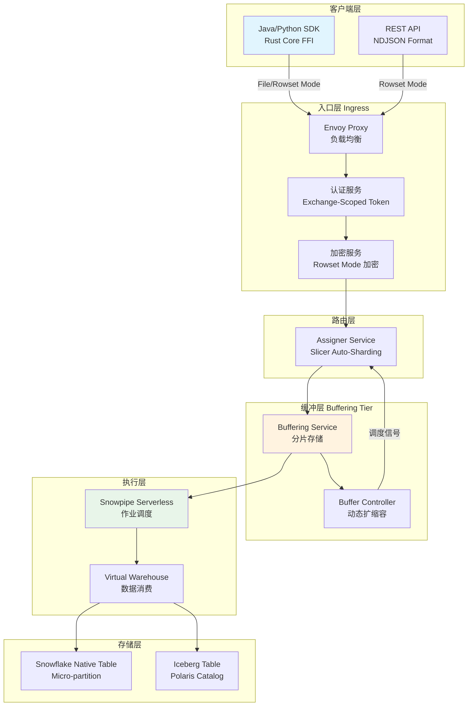
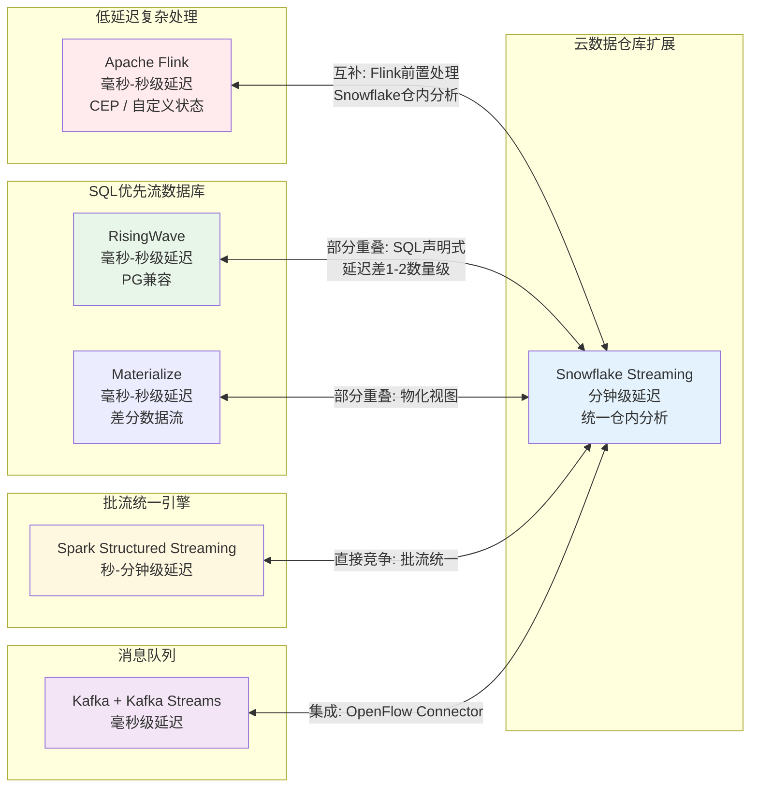

# Snowflake Streaming 架构与流处理生态定位分析

> **所属阶段**: Knowledge/06-frontier | **前置依赖**: [streaming-databases.md](./streaming-databases.md), [streaming-database-ecosystem-comparison.md](./streaming-database-ecosystem-comparison.md) | **形式化等级**: L3-L4

---

## 1. 概念定义 (Definitions)

### Def-K-06-480: Snowflake 流处理平台

Snowflake 流处理平台是一个**以云原生数据仓库为核心、通过增量计算和实时摄入扩展至流处理领域**的混合数据管理系统。

**形式化定义**：六元组 $\mathcal{SSP} = (\mathcal{I}, \mathcal{T}, \mathcal{D}, \mathcal{O}, \Lambda, \mathcal{C})$，其中：

- $\mathcal{I}$：Snowpipe Streaming 摄入通道集合
- $\mathcal{T}$：目标表集合（原生表、Dynamic Tables、Iceberg Tables）
- $\mathcal{D}$：Dynamic Tables 集合，每个 $dt \in \mathcal{D}$ 由 SQL 查询、TARGET_LAG 和刷新模式定义
- $\mathcal{O}$：OpenFlow 连接器集合
- $\Lambda: \mathcal{T} \times \delta\mathcal{I} \rightarrow \mathcal{T}$：增量更新函数
- $\mathcal{C}$：一致性配置集合

**核心约束**：$\forall dt \in \mathcal{D}, \forall t \in \mathbb{T}: \quad dt_t = q(S_{\leq t}) \land \text{lag}(dt_t, S_t) \leq \tau_{target}$

**关键组件**：

| 组件 | 功能定位 | 延迟特征 |
|------|---------|---------|
| Snowpipe Streaming | 实时行级数据摄入 | 5-10 秒端到端 |
| Dynamic Tables | 增量物化视图 | 最低 60 秒 TARGET_LAG |
| OpenFlow | 集成连接器框架 | 取决于源系统 |
| Iceberg Tables | 开放湖仓格式 | 与 Dynamic Tables 一致 |

---

### Def-K-06-481: Snowpipe Streaming 下一代架构

Snowpipe Streaming 下一代架构是 Snowflake 于 2025 年推出的**基于服务端缓冲和无服务器执行**的高性能实时摄入系统，支持高达 10 GB/s 的单表吞吐量[^1]。

**形式化定义**：七元组 $\mathcal{SPS} = (\mathcal{E}, \mathcal{A}, \mathcal{B}, \mathcal{P}, \mathcal{W}, \mathcal{R}, \mathcal{F})$，其中：

- $\mathcal{E}$：入口层（Ingress），基于 Envoy 代理实现负载均衡
- $\mathcal{A}$：认证服务，管理 exchange-scoped token
- $\mathcal{B} = (B_{svc}, B_{ctrl})$：缓冲层，含分片缓冲服务与缓冲控制器
- $\mathcal{P}$：Assigner 服务，基于 Slicer Auto-Sharding 动态分配缓冲节点
- $\mathcal{W}$：Snowpipe 无服务器执行仓库
- $\mathcal{R}$：Rust 核心 SDK，通过 FFI 暴露 Java/Python 接口
- $\mathcal{F} = \{file, rowset\}$：传输模式（File Mode 高吞吐优化，Rowset Mode 低延迟灵活）

**状态转换**：$\text{Data}_{in} \xrightarrow{\mathcal{E}} \text{Auth} \xrightarrow{\mathcal{A}} \text{Encrypt} \xrightarrow{\mathcal{P}} \mathcal{B} \xrightarrow{\mathcal{W}} \mathcal{T}$

---

### Def-K-06-482: Dynamic Tables 增量物化机制

Dynamic Tables 是 Snowflake 的**声明式增量物化视图**机制，用户通过 SQL 定义数据转换管道，系统自动跟踪上游变更并维护依赖 DAG。

**形式化定义**：五元组 $dt = (q, \tau, w, \rho, \delta)$，其中 $q$ 为 SQL 查询，$\tau$ 为 TARGET_LAG，$w$ 为 Virtual Warehouse，$\rho \in \{\text{INCREMENTAL}, \text{FULL}, \text{AUTO}\}$ 为刷新模式，$\delta$ 为变更类型集合。

**增量刷新约束**：$\rho = \text{INCREMENTAL} \Rightarrow dt_{t+1} = dt_t \oplus \Delta(\delta_t, q)$，其中 $\Delta$ 是基于 Stream 元数据的变更追踪函数。

---

## 2. 属性推导 (Properties)

### Prop-K-06-480: Snowflake 流处理延迟下界

**命题**：Snowflake 流处理平台的端到端延迟存在由设计决策决定的下界，且高于专用流处理引擎。

**形式化表述**：$L_{Snowflake} = L_{ingest} + L_{buffer} + L_{schedule} + L_{compute} + L_{commit}$

各分量下界：$L_{ingest} \geq 5s$，$L_{schedule} \geq 1s$，$L_{commit} \geq 0.5s$。

对于 Dynamic Tables，最小 TARGET_LAG 为 60 秒[^2]，故 $\forall dt \in \mathcal{D}: L_{dt} \geq 60s$。

与 Flink 对比：$L_{Flink} \approx 10ms \text{ -- } 1s \ll L_{Snowflake} \geq 60s$。

**推论**：Snowflake 不适合亚秒级决策用例（如高频交易风控），而适合近实时分析和 ELT 管道。

---

### Prop-K-06-481: Dynamic Tables 刷新模式成本权衡

**命题**：三种刷新模式在计算成本、数据新鲜度和实现复杂性之间存在三元权衡。

**成本函数**：

$$C(\rho) = \begin{cases} c_{inc} \cdot |\delta_t| & \rho = \text{INCREMENTAL} \\ c_{full} \cdot |S_t| & \rho = \text{FULL} \\ \min(C_{inc}^*, C_{full}^*) & \rho = \text{AUTO} \end{cases}$$

其中 $c_{inc} \gg c_{full}$，但 $|\delta_t| \ll |S_t|$。

**权衡关系**：INCREMENTAL 使 $C \downarrow$、$F \uparrow$、$X \uparrow$（但不支持非确定性函数）；FULL 使 $C \uparrow$、$F \downarrow$、$X \downarrow$；AUTO 在创建时固定决策，上游变更可能导致刷新失败。

---

## 3. 关系建立 (Relations)

### 3.1 Snowflake 与专用流处理引擎的架构映射

| Snowflake 组件 | 对应 Flink 概念 | 对应 RisingWave 概念 | 关键差异 |
|--------------|----------------|-------------------|---------|
| Snowpipe Streaming | Source Connector | Source Connector | 无状态转换能力有限 |
| Dynamic Tables | Materialized Table | Materialized View | 最小延迟 60s，RisingWave 毫秒级 |
| OpenFlow Kafka Connector | Kafka Connector | CREATE SOURCE | 基于 NiFi，功能丰富但延迟更高 |
| Iceberg Tables | Flink Iceberg Sink | 外部表 | 深度集成 Polaris Catalog |
| Stream (CDC) | Debezium Connector | 内置 CDC | 仅追踪 DML 元数据 |

**形式化映射**：对于仅含窗口聚合、流-流 JOIN 和过滤的 $\mathcal{Q}_{simple}$，$q_F \approx q_S$；对于含 MATCH_RECOGNIZE 或自定义状态算子的 $\mathcal{Q}_{CEP}$，不存在等价的 $q_S$。

### 3.2 Snowflake 在流处理生态中的竞争定位

- **与 Flink**：**互补关系**。Flink 覆盖低延迟复杂处理，Snowflake 覆盖高吞吐仓内分析。混合架构中 Flink 处理前置复杂逻辑，Snowflake 承接聚合结果[^5]。
- **与 RisingWave/Materialize**：**部分重叠**。三者均支持 SQL 声明式流处理，但 Snowflake 延迟高 1-2 数量级。
- **与 Spark Structured Streaming**：**直接竞争**。两者均定位批流统一、分钟级延迟。Snowflake 优势在于与数据仓库的零 ETL 集成，Spark 优势在于生态广度。

### 3.3 OpenFlow 与 Apache NiFi 的技术继承

$$\text{OpenFlow} = \text{NiFi}_{core} + \text{Snowflake}_{security} + \text{Snowpipe}_{streaming}$$

OpenFlow 支持 SPCS（Snowflake Deployment，原生集成认证授权）和 BYOC（数据处理引擎在用户云环境）两种部署模式[^4]。

---

## 4. 论证过程 (Argumentation)

### 4.1 Snowflake 流处理竞争优势的边界分析

**优势领域**：零 ETL 集成（流数据摄入后直接 JOIN 历史数据）、弹性计算（Virtual Warehouse 独立扩缩容）、治理一致性（Horizon Catalog 统一 RBAC 和审计）、SQL 友好（完全声明式接口）。

**边界限制**：延迟边界（Dynamic Tables 最小 60 秒）、状态管理边界（无显式有状态算子）、CEP 边界（不支持 MATCH_RECOGNIZE）、开源生态边界（社区贡献不及 Flink）。

### 4.2 延迟-弹性权衡的工程约束

**约束一：冷启动成本**。无服务器仓库空闲后需冷启动，对持续低延迟流处理是反模式的。

**约束二：事务提交粒度**。Snowflake 基于不可变微分区，Dynamic Tables 每次刷新涉及新微分区生成和元数据更新。当刷新频率超过阈值后开销成为瓶颈：$\text{Refresh Frequency} > \frac{1}{t_{partition} + t_{metadata}} \Rightarrow \text{Overhead dominates}$。

**约束三：资源隔离**。多个 Dynamic Tables 共享仓库时，资源竞争可能导致 TARGET_LAG 无法保证：$\sum_{dt \in \mathcal{D}_w} \frac{1}{\tau_{dt}} > \frac{1}{t_{avg}(w)} \Rightarrow \exists dt: \text{lag}(dt) > \tau_{dt}$。

### 4.3 复杂事件处理（CEP）能力缺失的影响评估

| 场景 | 影响等级 | 替代方案 |
|------|---------|---------|
| 欺诈检测（序列模式） | 高 | 前置 Flink 处理，Snowflake 承接聚合结果 |
| 设备故障预测（时序模式） | 高 | 外部 ML 模型 + Snowflake 存储 |
| 实时推荐（会话行为） | 中 | 简化特征工程，牺牲部分实时性 |
| 日志异常检测（频率突变） | 低 | Dynamic Tables + 阈值告警可满足 |

---

## 5. 形式证明 / 工程论证

### Lemma-K-06-480: Dynamic Tables 与 Flink Materialized Tables 功能等价性边界

**引理**：对于仅含投影、选择、内连接、分组聚合和滚动窗口的查询集合 $\mathcal{Q}_{eq}$，Snowflake Dynamic Tables 与 Flink Materialized Tables 在最终一致性语义下功能等价；对于含会话窗口、模式匹配或自定义状态算子的 $\mathcal{Q}_{neq}$，二者不存在功能等价映射。

**证明**：

**部分一（$\mathcal{Q}_{eq}$ 等价性）**：设 $q \in \mathcal{Q}_{eq}$。Flink 输出 $M_F(t) = q(S_{[t - \tau, t]})$，Snowflake 输出 $M_S(t) = q(S_{\leq t})$ 在 TARGET_LAG $\tau$ 约束下。$\mathcal{Q}_{eq}$ 中操作满足单调性和增量可计算性，存在增量更新函数 $\Delta_q$ 使得 $M(t + \delta) = \Delta_q(M(t), \delta S)$。Flink 的 Incremental Materialized Table 和 Snowflake 的 INCREMENTAL Dynamic Table 均实现了等价的 $\Delta_q$，故 $M_F \equiv M_S$（最终一致性语义下）。

**部分二（$\mathcal{Q}_{neq}$ 非等价性）**：

1. **会话窗口**：边界由数据间隙动态决定，需维护状态检测超时。Snowflake 刷新机制是时间驱动（TARGET_LAG），非事件驱动，无法表达动态边界语义。
2. **模式匹配**：MATCH_RECOGNIZE 需维护 NFA 状态。Snowflake 缺乏显式有状态算子抽象，无法实现 NFA 状态管理。
3. **自定义状态算子**：Flink ProcessFunction 支持 KeyedState 和 TimerService。Snowflake SQL 接口是封闭的，无扩展点实现任意状态机。

综上：$\exists q \in \mathcal{Q}_{neq}: \nexists \phi: M_F \xrightarrow{\phi} M_S$。

**工程推论**：若 workload 完全落在 $\mathcal{Q}_{eq}$ 内，Dynamic Tables 可简化运维；若涉及 $\mathcal{Q}_{neq}$，必须引入 Flink 作为前置处理层。

---

## 6. 实例验证 (Examples)

### 6.1 Cboe Global Markets 实时市场数据摄入

Cboe 在 Snowpipe Streaming 预览阶段进行了生产验证[^1]：日摄入 >100 TB 未压缩数据、>1900 亿行，P95 查询延迟 <30 秒。关键设计是利用 pre-clustering 在数据飞行中按查询维度聚类，并通过 serverless 执行弹性应对流量峰值。该场景属于**高吞吐、中等延迟容忍**用例，验证了 Snowflake 在金融市场数据仓库化中的可行性。

### 6.2 Dynamic Tables 声明式管道定义

**传统 Streams + Tasks 方式**（3+ 对象）：

```sql
CREATE STREAM raw_events_stream ON TABLE raw_events;
CREATE TASK clean_events_task
  WAREHOUSE = etl_wh SCHEDULE = '1 MINUTE'
AS MERGE INTO clean_events ...;
```

**Dynamic Tables 方式**（1 个对象）：

```sql
CREATE DYNAMIC TABLE clean_events
  TARGET_LAG = '1 MINUTE'
  WAREHOUSE = etl_wh
  REFRESH_MODE = INCREMENTAL
AS SELECT user_id, event_type, PARSE_JSON(payload) as data
   FROM raw_events WHERE event_type IN ('click', 'purchase');
```

Dynamic Tables 将变更追踪、依赖管理和增量刷新内聚为单一对象，显著降低管道复杂性[^7][^8]。

### 6.3 OpenFlow Kafka 连接器配置

OpenFlow Kafka 连接器实现 Kafka 到 Snowflake 的实时数据流[^4][^6]：Source 为 Kafka Topic（Confluent Cloud、AWS MSK、Azure Event Hubs），Format 为 JSON/AVRO 并支持自动 Schema Evolution，Security 支持 SASL_SSL / SCRAM-SHA-256 / AWS_MSK_IAM，Destination 通过 Snowpipe Streaming 写入 Snowflake 表。OpenFlow 还支持 Snowflake → Kafka 的 CDC 输出。

---

## 7. 可视化 (Visualizations)

### 7.1 Snowpipe Streaming 下一代架构层次图



**说明**：核心演进在于将缓冲从客户端迁移至服务端 Buffering Tier，通过 Assigner 实现动态分片，支持 File Mode（高吞吐低成本）和 Rowset Mode（低延迟灵活）两种传输策略。

---

### 7.2 流处理生态竞争定位矩阵



**说明**：Snowflake Streaming 的核心差异化在于**与数据仓库的零摩擦集成**。对于已深度使用 Snowflake 的企业，Dynamic Tables 提供了最低复杂度的流处理路径；但对于延迟敏感或需要 CEP 的场景，仍需与 Flink、RisingWave 形成混合架构。

---

## 8. 引用参考 (References)

[^1]: Snowflake Engineering Blog, "Introducing Our Next-Gen Snowpipe Streaming Architecture", 2025-10. <https://www.snowflake.com/en/engineering-blog/next-gen-snowpipe-streaming-architecture/>

[^2]: Snowflake Documentation, "Dynamic Tables", 2025. <https://docs.snowflake.com/en/user-guide/dynamic-tables-about>


[^4]: Snowflake Documentation, "OpenFlow Connector for Kafka", 2025. <https://docs.snowflake.com/en/user-guide/data-integration/openflow/connectors/kafka/about>

[^5]: RisingWave Blog, "When to Use Flink vs When to Use a Streaming Database", 2026-04. <https://risingwave.com/blog/when-to-use-flink-vs-streaming-database/>

[^6]: Snowflake Quickstart, "Getting Started with Openflow Kafka Connector", 2025-10. <https://www.snowflake.com/en/developers/guides/getting-started-with-openflow-kafka-connector/>

[^7]: Yuki Data, "Everything to Know About Snowflake Dynamic Tables", 2025-12. <https://yukidata.com/snowflake-dynamic-tables-guide/>

[^8]: Analytics Today, "ELT Pipeline Design with Snowflake Dynamic Tables and Target Lag", 2025-08. <https://articles.analytics.today/how-snowflake-dynamic-tables-simplify-etl-pipelines>
