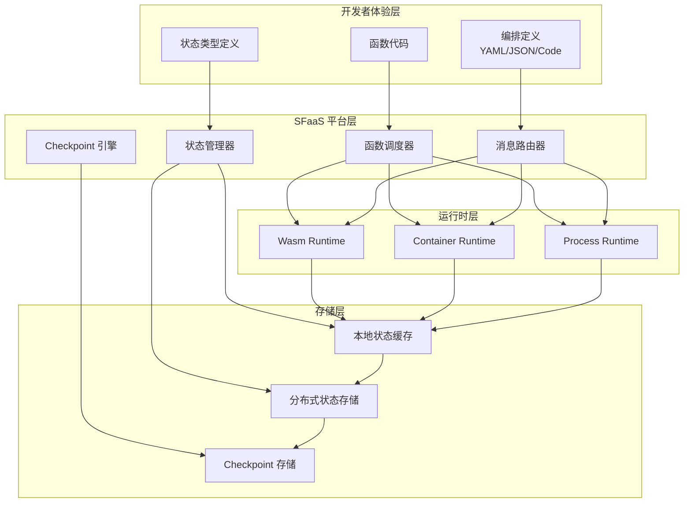
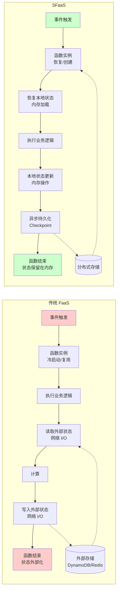
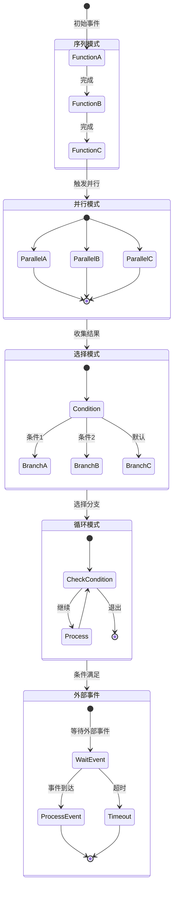
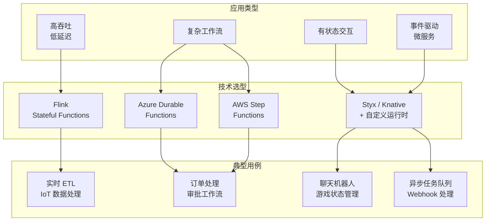

# Stateful Serverless - 有状态函数即服务

> 所属阶段: Knowledge/06-frontier | 前置依赖: [../01-concept-atlas/streaming-models-mindmap.md](../01-concept-atlas/streaming-models-mindmap.md), [../../Flink/02-core-mechanisms/checkpoint-mechanism-deep-dive.md](../../Flink/02-core-mechanisms/checkpoint-mechanism-deep-dive.md) | 形式化等级: L3-L4

## 目录

- [Stateful Serverless - 有状态函数即服务](#stateful-serverless-有状态函数即服务)
  - [目录](#目录)
  - [1. 概念定义 (Definitions)](#1-概念定义-definitions)
    - [Def-K-06-01: Stateful Serverless (有状态无服务器计算)](#def-k-06-01-stateful-serverless-有状态无服务器计算)
    - [Def-K-06-02: SFaaS (Stateful Functions as a Service)](#def-k-06-02-sfaas-stateful-functions-as-a-service)
    - [Def-K-06-03: 函数编排 (Function Orchestration)](#def-k-06-03-函数编排-function-orchestration)
    - [Def-K-06-04: 轻量级虚拟化 (WebAssembly)](#def-k-06-04-轻量级虚拟化-webassembly)
  - [2. 属性推导 (Properties)](#2-属性推导-properties)
    - [Prop-K-06-01: 状态共置的收益界限](#prop-k-06-01-状态共置的收益界限)
    - [Prop-K-06-02: 函数编排的组合性](#prop-k-06-02-函数编排的组合性)
    - [Prop-K-06-03: 状态分区与负载均衡的权衡](#prop-k-06-03-状态分区与负载均衡的权衡)
  - [3. 关系建立 (Relations)](#3-关系建立-relations)
    - [3.1 SFaaS 与流计算的关系](#31-sfaas-与流计算的关系)
    - [3.2 与 Actor 模型的关系](#32-与-actor-模型的关系)
    - [3.3 与微服务架构的关系](#33-与微服务架构的关系)
  - [4. 论证过程 (Argumentation)](#4-论证过程-argumentation)
    - [4.1 为什么传统 FaaS 不够？](#41-为什么传统-faas-不够)
    - [4.2 SFaaS 的解决方案](#42-sfaas-的解决方案)
    - [4.3 状态共置 vs 分离的决策矩阵](#43-状态共置-vs-分离的决策矩阵)
  - [5. 工程论证 (Engineering Argument)](#5-工程论证-engineering-argument)
    - [5.1 关键系统架构分析](#51-关键系统架构分析)
      - [5.1.1 Styx (TU Delft, PVLDB 2025)](#511-styx-tu-delft-pvldb-2025)
      - [5.1.2 Azure Durable Functions](#512-azure-durable-functions)
      - [5.1.3 AWS Step Functions](#513-aws-step-functions)
      - [5.1.4 Apache Flink Stateful Functions](#514-apache-flink-stateful-functions)
    - [5.2 粗粒度容错设计](#52-粗粒度容错设计)
  - [6. 实例验证 (Examples)](#6-实例验证-examples)
    - [6.1 电商订单处理工作流](#61-电商订单处理工作流)
    - [6.2 IoT 规则引擎](#62-iot-规则引擎)
    - [6.3 实时风控决策](#63-实时风控决策)
  - [7. 可视化 (Visualizations)](#7-可视化-visualizations)
    - [7.1 SFaaS 整体架构图](#71-sfaas-整体架构图)
    - [7.2 传统 FaaS vs SFaaS 对比图](#72-传统-faas-vs-sfaas-对比图)
    - [7.3 函数编排模式图](#73-函数编排模式图)
    - [7.4 典型应用场景矩阵](#74-典型应用场景矩阵)
  - [8. 引用参考 (References)](#8-引用参考-references)

## 1. 概念定义 (Definitions)

### Def-K-06-01: Stateful Serverless (有状态无服务器计算)

**形式化定义**: Stateful Serverless 是一种云计算范式，其中：

$$\text{Stateful Serverless} = (F, S, \phi, \tau, \gamma)$$

- $F$: 无状态函数集合 $F = \{f_1, f_2, ..., f_n\}$，每个函数 $f: I \times S \rightarrow O \times S$
- $S$: 持久化状态空间，支持键值寻址 $S: K \rightarrow V$
- $\phi: F \times S \rightarrow \{0,1\}$: 状态共置函数，决定函数与状态的物理位置关系
- $\tau: E \rightarrow F$: 事件路由函数，将事件映射到目标函数
- $\gamma: F^* \rightarrow \mathcal{W}$: 工作流组合算子，支持函数链、分支、并行

**直观解释**: 传统 FaaS 要求函数无状态，每次调用后状态必须外部化到存储服务（如 DynamoDB、Redis）。Stateful Serverless 允许函数在执行期间保持本地状态，平台负责状态的持久化、恢复和迁移，同时保留"无服务器"的弹性伸缩特性。

### Def-K-06-02: SFaaS (Stateful Functions as a Service)

**形式化定义**: SFaaS 是 Stateful Serverless 的工程实现形态：

$$\text{SFaaS} = (\mathcal{G}, \mathcal{M}, \mathcal{R}, \mathcal{C})$$

- $\mathcal{G}$: 函数图（Function Graph），有向图 $G = (V, E)$，顶点为函数实例，边为状态/事件流
- $\mathcal{M}$: 消息传递机制，支持异步事件、直接调用、状态订阅
- $\mathcal{R}$: 路由层，基于状态键的亲和性路由 $\text{route}(k) \rightarrow \text{worker}_i$
- $\mathcal{C}$: 一致性模型，通常提供至少一次（at-least-once）或恰好一次（exactly-once）语义

**类型系统视角**: SFaaS 可视为在 FaaS 之上增加了 **State Effect**：

$$\Gamma \vdash f: A \times \text{State}_K \rightarrow B \times \text{State}_K$$

其中 $\text{State}_K$ 表示带有键 $K$ 的状态句柄。

### Def-K-06-03: 函数编排 (Function Orchestration)

**形式化定义**: 函数编排定义函数间的控制流与数据流：

$$\mathcal{O} = (\mathcal{F}, \prec, \mathcal{D}, \mathcal{T})$$

- $\mathcal{F}$: 参与编排的函数集合
- $\prec \subseteq \mathcal{F} \times \mathcal{F}$: 偏序关系，定义执行顺序
- $\mathcal{D}: \mathcal{F} \times \mathcal{F} \rightarrow \mathcal{P}(\text{Data})$: 数据流映射
- $\mathcal{T}: \mathcal{F} \times \mathcal{F} \rightarrow \mathbb{T}$: 转换函数，定义数据格式转换

**编排模式分类**:

| 模式 | 符号表示 | 示例 |
|------|----------|------|
| 序列 | $f_1 \gg f_2$ | 订单验证 → 库存扣减 |
| 并行 | $f_1 \| f_2$ | 并发调用支付网关 |
| 分支 | $\text{if } p \text{ then } f_1 \text{ else } f_2$ | 风控通过/拒绝 |
| 循环 | $\mu X. (f \gg X)$ | 重试逻辑 |
| 扇出/扇入 | $\text{scatter}(f_i) \gg \text{gather}(g)$ | MapReduce |

### Def-K-06-04: 轻量级虚拟化 (WebAssembly)

**形式化定义**: WebAssembly (Wasm) 作为 SFaaS 的运行时基础：

$$\text{Wasm Runtime} = (\mathcal{M}, \mathcal{S}, \mathcal{I}, \mathcal{L})$$

- $\mathcal{M}$: 线性内存模型， sandboxed 的 4GB 地址空间
- $\mathcal{S}$: 模块系统，支持导入/导出函数与内存
- $\mathcal{I}$: 指令集，基于栈的虚拟机指令
- $\mathcal{L}$: 实例化延迟，冷启动时间 $< 1\text{ms}$

**与容器对比**:

| 维度 | Docker 容器 | WebAssembly |
|------|-------------|-------------|
| 启动延迟 | 100ms - 数秒 | < 1ms |
| 内存占用 | 10-100MB | 1-10MB |
| 隔离机制 | OS 命名空间/ cgroup | 软件故障隔离 |
| 可移植性 | 依赖宿主机内核版本 | 一次编译，到处运行 |
| 冷启动开销 | 高（需加载镜像） | 极低（字节码直接执行）|

---

## 2. 属性推导 (Properties)

### Prop-K-06-01: 状态共置的收益界限

**命题**: 状态与计算共置将延迟上界从 $O(\text{network})$ 降低到 $O(\text{memory})$。

**推导**:

- 传统 FaaS: $T_{total} = T_{compute} + 2 \times T_{network\_roundtrip} + T_{storage}$
- SFaaS (共置): $T_{total} = T_{compute} + T_{local\_memory}$

当 $T_{compute} \ll T_{network}$ 时（如简单转换函数），收益比 $\frac{T_{traditional}}{T_{sfaas}} \approx \frac{T_{network}}{T_{memory}} \approx 10^2 \sim 10^4$。

### Prop-K-06-02: 函数编排的组合性

**命题**: 若 $\mathcal{O}_1$ 和 $\mathcal{O}_2$ 分别满足性质 $P_1$ 和 $P_2$，则组合编排 $\mathcal{O}_1 \gg \mathcal{O}_2$ 满足 $P_1 \land P_2$（在性质可组合的前提下）。

**约束条件**:

- 性质需满足 **合流性 (Confluence)**: 并行执行顺序不影响最终状态
- 需满足 **单调性**: 组合不降低原有性质强度

### Prop-K-06-03: 状态分区与负载均衡的权衡

**命题**: 给定 $n$ 个工作节点，$m$ 个状态键（$m \gg n$），最优分区策略需在以下目标间权衡：

$$\min_{\pi} \left( \alpha \cdot \text{LoadImbalance}(\pi) + \beta \cdot \text{StateMigration}(\pi) \right)$$

其中 $\pi: K \rightarrow \{1..n\}$ 为分区函数，$\alpha, \beta$ 为权重系数。

**边界情况**:

- 当 $\alpha \gg \beta$: 优先负载均衡，可能增加状态迁移
- 当 $\beta \gg \alpha$: 优先状态局部性，可能出现热点

---

## 3. 关系建立 (Relations)

### 3.1 SFaaS 与流计算的关系

Stateful Serverless 与流计算（Stream Processing）存在深层的理论同构：

```
┌─────────────────────────────────────────────────────────────────┐
│                    计算模型映射关系                               │
├─────────────────────────────────────────────────────────────────┤
│                                                                 │
│   SFaaS Layer          │    Streaming Layer                      │
│   ─────────────────────┼────────────────────                     │
│   Function Instance    │    Stateful Operator                    │
│   Function Input       │    Data Stream Event                    │
│   Function State       │    Operator State                       │
│   Function Output      │    Downstream Event                     │
│   Function Graph       │    Job Graph / DAG                      │
│   Event Trigger        │    Watermark / Timer                    │
│   Durable Execution    │    Checkpoint / Savepoint               │
│                                                                 │
└─────────────────────────────────────────────────────────────────┘
```

**核心洞察**:

- **Stateful Dataflow 是底层执行模型**: Flink、Spark Streaming 等系统提供的 Dataflow 语义是 SFaaS 的高效执行基础
- **FaaS 是上层编程抽象**: SFaaS 将 Dataflow 的底层复杂性封装为函数式编程模型

**形式化对应**:

| SFaaS 概念 | Dataflow 概念 | 形式化对应 |
|------------|---------------|------------|
| 函数调用 | Record 处理 | $f(e) \sim \text{process}(r)$ |
| 状态访问 | State Backend 读写 | $\text{read}(k) \sim \text{getState}(k)$ |
| 函数间消息 | 数据流分区 | $\text{send}(f_j, m) \sim \text{emit}(r')$ |
| 持久化执行 | Checkpoint 恢复 | $\text{replay} \sim \text{restore}$ |

### 3.2 与 Actor 模型的关系

$$\text{SFaaS} \cong \text{Actor} + \text{Persistence} + \text{Serverless\ Scheduling}$$

- **Actor 相似性**: 函数实例 ≈ Actor，状态封装 ≈ Actor 状态，异步消息 ≈ Actor 邮箱
- **差异点**: SFaaS 强调弹性伸缩（scale-to-zero），Actor 通常长期运行；SFaaS 强调事务性持久化，Actor 持久化为可选

### 3.3 与微服务架构的关系

```
演进谱系:

Monolithic ──► Microservices ──► FaaS ──► SFaaS
     │              │            │         │
     │              │            │         ├─ 细粒度部署单元
     │              │            ├─ 事件驱动 │
     │              ├─ 独立部署    │         ├─ 状态内聚
     └─ 单一进程    │            │         │
                   └─ 网络通信   └─ 无状态   └─ 自动扩缩容
```

---

## 4. 论证过程 (Argumentation)

### 4.1 为什么传统 FaaS 不够？

**问题分析**:

1. **状态外部化开销**: 每个函数调用需 2-4 次网络往返（读取输入状态、写入输出状态）
2. **冷启动放大**: 无状态假设下，平台倾向于激进缩容，导致频繁冷启动
3. **编程模型受限**: 无法表达有状态模式（会话、聚合、模式匹配）

**案例**: 一个典型的订单处理流程

```
传统 FaaS:
┌─────────┐    ┌─────────┐    ┌─────────┐    ┌─────────┐
│  API    │───►│ Validate│───►│  Check  │───►│  Charge │
│ Gateway │    │  Order  │    │ Inventory│    │ Payment │
└─────────┘    └────┬────┘    └────┬────┘    └────┬────┘
                    │              │              │
                    ▼              ▼              ▼
               ┌─────────┐   ┌─────────┐   ┌─────────┐
               │ DynamoDB│   │  Redis  │   │ Stripe  │
               │ (state) │   │ (cache) │   │  (ext)  │
               └─────────┘   └─────────┘   └─────────┘

问题: 6 次网络调用，高延迟，分布式事务复杂
```

### 4.2 SFaaS 的解决方案

```
SFaaS:
┌─────────┐    ┌──────────────────────────────────────┐
│  API    │───►│         Stateful Function             │
│ Gateway │    │  ┌─────────┐  ┌─────────┐  ┌────────┐ │
└─────────┘    │  │ Validate│─►│  Check  │─►│ Charge │ │
               │  │  Order  │  │Inventory│  │Payment │ │
               │  └────┬────┘  └────┬────┘  └───┬────┘ │
               │       └────────────┴───────────┘      │
               │              Local State               │
               └──────────────────────────────────────┘

优势: 单次调用，本地状态访问，平台管理持久化
```

### 4.3 状态共置 vs 分离的决策矩阵

| 场景特征 | 推荐策略 | 理由 |
|----------|----------|------|
| 高频读写、低计算 | 共置 | 网络开销主导，需最小化延迟 |
| 大状态、低频次 | 分离 | 内存成本高，远程存储更经济 |
| 共享状态多 | 分离 | 避免复制一致性开销 |
| 严格事务要求 | 共置 + 复制 | 减少分布式事务复杂度 |
| 跨地域部署 | 分离 + 缓存 | 状态就近访问，全局一致性 |

---

## 5. 工程论证 (Engineering Argument)

### 5.1 关键系统架构分析

#### 5.1.1 Styx (TU Delft, PVLDB 2025)

**核心创新**: Dataflow-native Stateful Serverless

```
Styx 架构:
┌─────────────────────────────────────────────────────────────┐
│                      Application Layer                        │
│  ┌─────────────┐  ┌─────────────┐  ┌─────────────────────┐  │
│  │   Query     │  │ Transaction │  │   Event Handlers    │  │
│  │   Service   │  │   Manager   │  │                     │  │
│  └──────┬──────┘  └──────┬──────┘  └──────────┬──────────┘  │
└─────────┼────────────────┼────────────────────┼─────────────┘
          │                │                    │
          ▼                ▼                    ▼
┌─────────────────────────────────────────────────────────────┐
│                      Styx Runtime                             │
│  ┌─────────────┐  ┌─────────────┐  ┌─────────────────────┐  │
│  │   Worker    │  │   Worker    │  │       Worker        │  │
│  │  (Function) │  │  (Function) │  │     (Function)      │  │
│  │  + Local    │  │  + Local    │  │     + Local State   │  │
│  │    State    │  │    State    │  │                     │  │
│  └──────┬──────┘  └──────┬──────┘  └──────────┬──────────┘  │
│         │                │                    │             │
│         └────────────────┼────────────────────┘             │
│                          │                                  │
│                   ┌──────┴──────┐                          │
│                   │   Dataflow   │                          │
│                   │   Engine     │  (Checkpoint, Recovery)   │
│                   └─────────────┘                          │
└─────────────────────────────────────────────────────────────┘
                              │
                              ▼
                    ┌─────────────────┐
                    │  Distributed    │
                    │  State Backend  │
                    └─────────────────┘
```

**事务性保证**: Styx 支持跨函数的事务，使用 Dataflow 的恰好一次语义作为基础，通过两阶段提交协议实现分布式事务的原子性。

#### 5.1.2 Azure Durable Functions

**编程模型**: Event Sourcing + Orchestrator Pattern

```csharp
// Durable Function 示例: 订单处理工作流
[FunctionName("OrderWorkflow")]
public static async Task<string> RunOrchestrator(
    [OrchestrationTrigger] IDurableOrchestrationContext context)
{
    var order = context.GetInput<Order>();

    // 1. 验证订单 (自动持久化检查点)
    var validated = await context.CallActivityAsync<bool>(
        "ValidateOrder", order);

    if (!validated) return "INVALID";

    // 2. 并行检查库存和计算价格
    var tasks = new Task[2];
    tasks[0] = context.CallActivityAsync<bool>("CheckInventory", order);
    tasks[1] = context.CallActivityAsync<decimal>("CalculatePrice", order);

    await Task.WhenAll(tasks);

    // 3. 支付（外部事件等待）
    var paymentResult = await context.WaitForExternalEvent<PaymentResult>(
        "PaymentComplete", timeout: TimeSpan.FromMinutes(30));

    // 4. 发货
    await context.CallActivityAsync("ShipOrder", order);

    return "COMPLETED";
}
```

**关键技术**:

- **History Replay**: Orchestrator 函数是确定性的，执行历史被持久化，故障后通过重放历史恢复状态
- **Async/Await 持久化**: 标准 async/await 语义被扩展为持久化检查点

#### 5.1.3 AWS Step Functions

**状态机模型**: Amazon States Language (ASL)

```json
{
  "Comment": "Order Processing State Machine",
  "StartAt": "ValidateOrder",
  "States": {
    "ValidateOrder": {
      "Type": "Task",
      "Resource": "arn:aws:lambda:...:validate",
      "Next": "CheckInventory"
    },
    "CheckInventory": {
      "Type": "Task",
      "Resource": "arn:aws:lambda:...:inventory",
      "Next": "IsAvailable"
    },
    "IsAvailable": {
      "Type": "Choice",
      "Choices": [
        {
          "Variable": "$.available",
          "BooleanEquals": true,
          "Next": "ProcessPayment"
        }
      ],
      "Default": "OutOfStock"
    },
    "ProcessPayment": {
      "Type": "Task",
      "Resource": "arn:aws:lambda:...:payment",
      "Retry": [{
        "ErrorEquals": ["PaymentFailed"],
        "IntervalSeconds": 2,
        "MaxAttempts": 3
      }],
      "Next": "ShipOrder"
    },
    "ShipOrder": {
      "Type": "Task",
      "Resource": "arn:aws:lambda:...:ship",
      "End": true
    },
    "OutOfStock": {
      "Type": "Fail",
      "Error": "OutOfStockError",
      "Cause": "Product not available"
    }
  }
}
```

**执行特性**:

- Express Workflows: 高吞吐、无事件溯源，适合流处理场景
- Standard Workflows: 恰好一次执行、完整执行历史，适合关键业务流程

#### 5.1.4 Apache Flink Stateful Functions

**架构定位**: Flink 生态系统中的 SFaaS 层

```
Flink Stateful Functions 架构:

┌─────────────────────────────────────────────────────────────┐
│                     Function Modules                          │
│  ┌──────────┐ ┌──────────┐ ┌──────────┐ ┌──────────────────┐│
│  │  User    │ │  User    │ │  User    │ │      User        ││
│  │ Function │ │ Function │ │ Function │ │    Function      ││
│  │  (Java)  │ │ (Python) │ │   (Go)   │ │    (Remote)      ││
│  └────┬─────┘ └────┬─────┘ └────┬─────┘ └────────┬─────────┘│
└───────┼────────────┼────────────┼────────────────┼──────────┘
        │            │            │                │
        └────────────┴────────────┘                │
                     │                             │
                     ▼                             ▼
        ┌──────────────────────┐      ┌──────────────────────┐
        │   Embedded Runtime   │      │   Remote Function    │
        │   (In-JVM)           │      │   (gRPC)             │
        └──────────┬───────────┘      └──────────┬───────────┘
                   │                              │
                   └──────────────┬───────────────┘
                                  │
                    ┌─────────────┴─────────────┐
                    │   Flink Runtime           │
                    │   (Checkpoint, State)     │
                    └───────────────────────────┘
```

**独特特性**:

- **多语言支持**: 支持 Java（内嵌）、Python/Go（远程 gRPC）
- **动态消息路由**: 函数可以向逻辑地址发送消息，由路由表解析到物理实例
- **与 Flink SQL 集成**: 流处理与函数计算无缝衔接

### 5.2 粗粒度容错设计

**核心思想**: 相比传统微服务的事务日志，SFaaS 使用 **Checkpoint** 作为统一的容错机制。

```
容错机制对比:

微服务容错:
┌─────────┐    ┌─────────┐    ┌─────────┐
│ Service │───►│  Saga   │───►│ Compensating│
│   A     │    │  Log    │    │ Transaction │
└─────────┘    └─────────┘    └─────────────┘
     │                              │
     ▼                              ▼
┌─────────┐                   ┌─────────┐
│  DB     │                   │ Service │
│  Log    │                   │   B     │
└─────────┘                   └─────────┘

特点: 补偿逻辑复杂，最终一致性，开发者责任重

SFaaS 容错:
┌─────────┐    ┌─────────┐    ┌─────────┐
│Function │───►│Checkpoint├──►│ Restore │
│   A     │    │ (Periodic)│   │ State   │
└─────────┘    └─────────┘    └─────────┘
     │                              │
     ▼                              ▼
┌─────────┐                   ┌─────────┐
│  Local  │                   │Function │
│  State  │                   │   A'    │
└─────────┘                   └─────────┘

特点: 自动状态恢复，恰好一次语义，平台托管
```

---

## 6. 实例验证 (Examples)

### 6.1 电商订单处理工作流

**业务场景**: 用户下单 → 风控检查 → 库存扣减 → 支付 → 发货

```python
# 使用 Durable Functions Python API 的伪代码

def order_workflow(context, order):
    """订单处理工作流 - 展示持久化执行和外部事件"""

    # 步骤 1: 风控检查 (并行执行多个检查)
    risk_checks = [
        context.call_activity('check_fraud', order),
        context.call_activity('check_credit_limit', order.user_id),
        context.call_activity('check_suspicious_ip', order.ip_address)
    ]
    risk_results = yield context.task_all(risk_checks)

    if not all(risk_results):
        yield context.call_activity('block_order', order)
        return {'status': 'REJECTED', 'reason': 'RISK_CHECK_FAILED'}

    # 步骤 2: 预留库存 ( Saga 模式 )
    try:
        inventory_result = yield context.call_activity('reserve_inventory', order.items)
    except Exception as e:
        yield context.call_activity('release_inventory_reservation', order.items)
        return {'status': 'FAILED', 'reason': 'INVENTORY_ERROR'}

    # 步骤 3: 等待支付完成 ( 外部事件 )
    payment_deadline = context.current_utc_datetime + timedelta(minutes=30)

    try:
        payment_result = yield context.wait_for_external_event(
            'PaymentCompleted',
            timeout=payment_deadline
        )
    except TimeoutError:
        # 超时未支付，释放库存
        yield context.call_activity('release_inventory_reservation', order.items)
        return {'status': 'EXPIRED', 'reason': 'PAYMENT_TIMEOUT'}

    # 步骤 4: 确认订单并触发发货
    if payment_result.success:
        yield context.call_activity('confirm_order', order)
        yield context.call_activity('trigger_shipment', order)
        return {'status': 'COMPLETED', 'order_id': order.id}
    else:
        yield context.call_activity('release_inventory_reservation', order.items)
        return {'status': 'PAYMENT_FAILED'}
```

**关键特性展示**:

- **持久化等待**: 等待支付期间，函数实例可缩容至零，事件到达后恢复执行
- **超时处理**: 自动化的 Saga 补偿
- **并行执行**: 多个风控检查并发执行

### 6.2 IoT 规则引擎

**业务场景**: 实时处理传感器数据，触发告警或控制指令

```python
# Flink Stateful Functions 风格

class TemperatureMonitor:
    """有状态的温度监控函数"""

    def __init__(self):
        self.reading_count = 0
        self.sum_temperature = 0.0
        self.max_temperature = float('-inf')
        self.alert_cooldown = None

    def on_sensor_reading(self, reading):
        """处理传感器读数"""
        self.reading_count += 1
        self.sum_temperature += reading.temperature
        self.max_temperature = max(self.max_temperature, reading.temperature)

        # 滑动窗口平均
        avg_temp = self.sum_temperature / self.reading_count

        # 状态机: 检测异常模式
        if reading.temperature > 80:
            if self.can_alert():
                self.send_alert(
                    f"高温告警: 设备 {reading.device_id} "
                    f"温度 {reading.temperature}°C，"
                    f"平均 {avg_temp:.1f}°C"
                )
                self.set_cooldown(minutes=5)

        # 维护窗口大小
        if self.reading_count > 100:
            self.reading_count = 50
            self.sum_temperature = avg_temp * 50

    def can_alert(self):
        """检查是否可以发送告警（防抖动）"""
        if self.alert_cooldown is None:
            return True
        return datetime.now() > self.alert_cooldown

    def set_cooldown(self, minutes):
        """设置告警冷却时间"""
        self.alert_cooldown = datetime.now() + timedelta(minutes=minutes)

    def send_alert(self, message):
        """发送告警消息到下游"""
        # 向告警服务发送消息
        context.send(
            address=Address('alert-service', 'notifications'),
            message={'level': 'WARNING', 'message': message}
        )
```

### 6.3 实时风控决策

**业务场景**: 金融交易实时风险评估

```
风控决策流程:

┌─────────────┐     ┌─────────────┐     ┌─────────────┐
│ Transaction │────►│ Risk Engine │────►│  Decision   │
│   Event     │     │  (Stateful) │     │   (Allow/   │
│             │     │             │     │   Block)    │
└─────────────┘     └──────┬──────┘     └─────────────┘
                           │
          ┌────────────────┼────────────────┐
          │                │                │
          ▼                ▼                ▼
   ┌─────────────┐  ┌─────────────┐  ┌─────────────┐
   │   Velocity  │  │  Behavioral │  │   Device    │
   │   Check     │  │   Profile   │  │   Trust     │
   │             │  │             │  │   Score     │
   │ - tx/hour   │  │ - usual amt │  │             │
   │ - amt trend │  │ - geo pattern│ │ - fingerprint│
   └─────────────┘  └─────────────┘  └─────────────┘
          │                │                │
          └────────────────┼────────────────┘
                           │
                    ┌──────┴──────┐
                    │ State Store │
                    │  (Aggregate)│
                    └─────────────┘
```

---

## 7. 可视化 (Visualizations)

### 7.1 SFaaS 整体架构图



### 7.2 传统 FaaS vs SFaaS 对比图



### 7.3 函数编排模式图



### 7.4 典型应用场景矩阵



---

## 8. 引用参考 (References)
