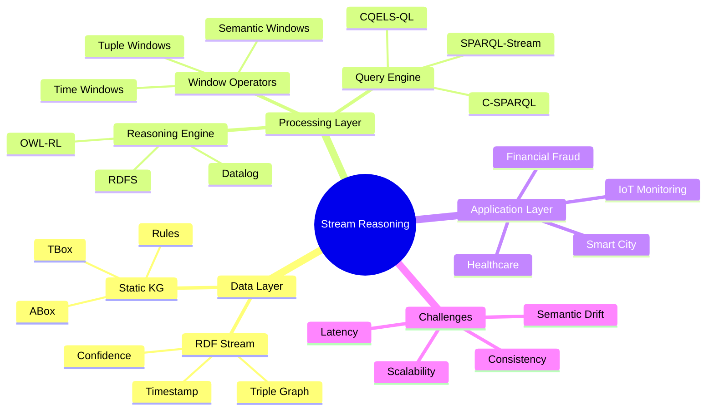
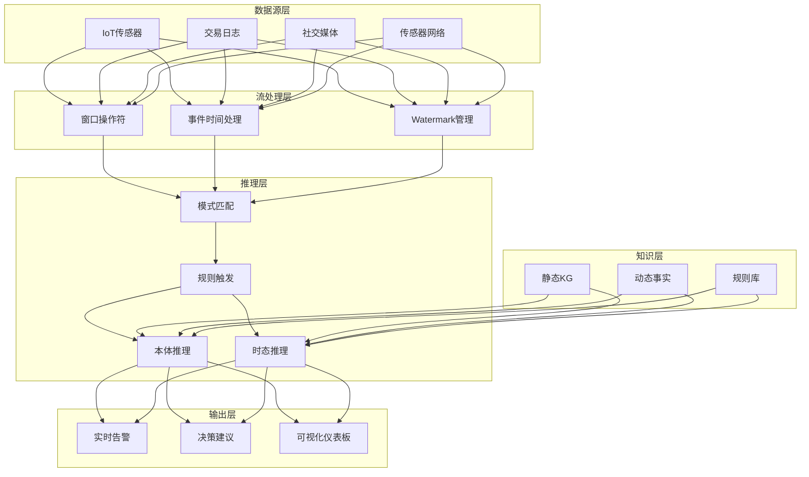
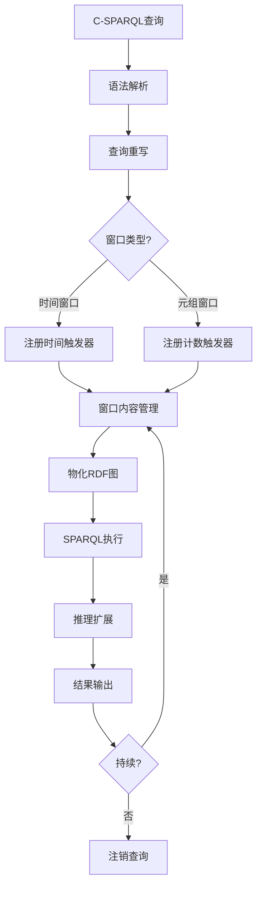
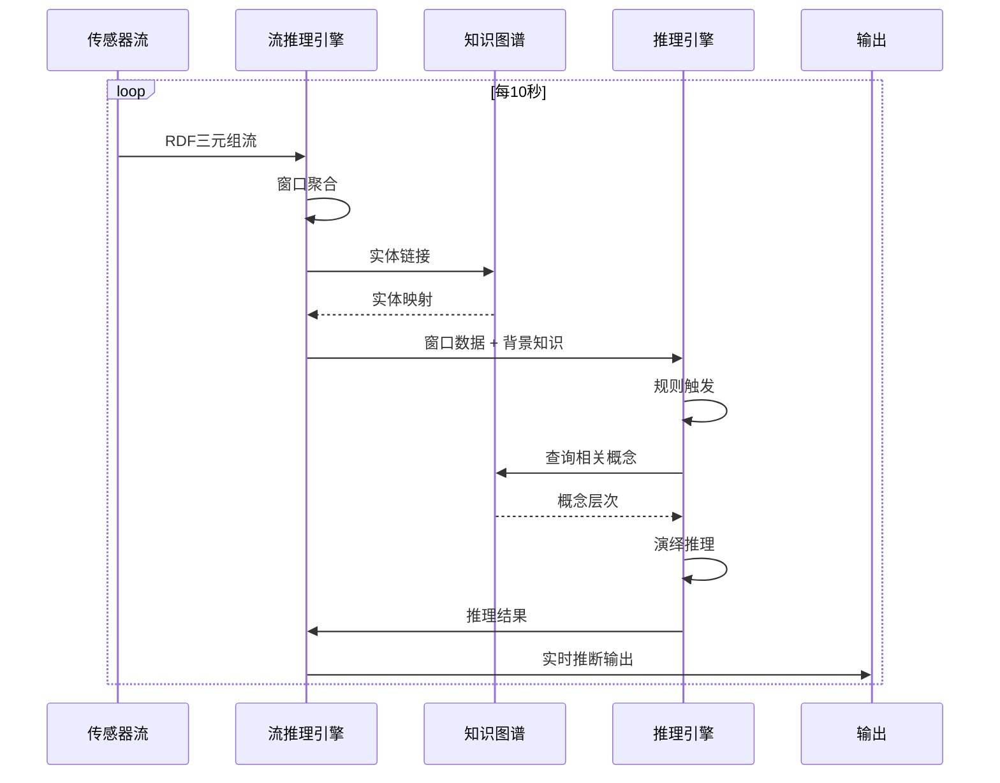

# 流推理专题：Stream Reasoning 理论体系与前沿进展

> 所属阶段: Knowledge/06-frontier | 前置依赖: [时间语义](../01-concept-atlas/01.02-time-semantics.md), [窗口概念](../01-concept-atlas/01.03-window-concepts.md), [状态管理](../01-concept-atlas/01.04-state-management-concepts.md) | 形式化等级: L3-L5

## 1. 概念定义 (Definitions)

### Def-K-SR-01: Stream Reasoning (流推理)

**定义**: Stream Reasoning 是一种在连续数据流上执行语义推理的计算范式，形式化为四元组：

$$
\mathcal{SR} \triangleq \langle \mathcal{S}, \mathcal{K}, \mathcal{Q}, \mathcal{R} \rangle
$$

其中：

| 组件 | 符号 | 形式化定义 | 语义解释 |
|------|------|------------|----------|
| 数据流 | $\mathcal{S}$ | $\{s_t\}_{t=0}^{\infty}, s_t = (d_t, t, \phi_t)$ | 带时间戳和语义标注的数据序列 |
| 知识库 | $\mathcal{K}$ | $\langle \mathcal{T}, \mathcal{A}, \mathcal{R} \rangle$ | TBox(术语)+ABox(断言)+规则集 |
| 查询 | $\mathcal{Q}$ | $Q: \mathcal{S}_{[t-w,t]} \times \mathcal{K} \rightarrow \mathcal{A}$ | 在窗口数据上执行的语义查询 |
| 推理机 | $\mathcal{R}$ | $\mathcal{K} \models \alpha \Rightarrow \mathcal{R}(\mathcal{K}) \vdash \alpha$ | 基于知识的演绎推理引擎 |

**核心特征**: Stream Reasoning 与传统流处理的本质区别在于**语义感知推理能力**。传统流处理关注数据转换（$f: D \rightarrow D'$），而流推理关注语义推断（$\mathcal{K} \models \phi$）。

**推理层次分类**:

```
┌─────────────────────────────────────────────────────────────────┐
│                      Stream Reasoning 层次                       │
├─────────────────────────────────────────────────────────────────┤
│                                                                 │
│  L1 - 实例级推理 (ABox Reasoning)                                │
│      └── 个体属性推断: type(x) = Sensor ∧ measures(x, Temp)     │
│          ⇒ TemperatureSensor(x)                                  │
│                                                                 │
│  L2 - 概念级推理 (TBox Reasoning)                                │
│      └── 本体关系推断: subClassOf(A, B) ∧ subClassOf(B, C)      │
│          ⇒ subClassOf(A, C)                                      │
│                                                                 │
│  L3 - 规则级推理 (Rule-Based Reasoning)                          │
│      └── Horn规则: IF (temp > 80 ∧ pressure > 100)               │
│          THEN alert = Critical                                   │
│                                                                 │
│  L4 - 时态推理 (Temporal Reasoning)                              │
│      └── 时序约束: □(A → ○B) 必然导致下一步B                     │
│                                                                 │
│  L5 - 非单调推理 (Non-monotonic Reasoning)                       │
│      └── 默认规则: 通常情况下Bird(x) ⇒ CanFly(x)                 │
│          除非 Penguin(x)                                         │
│                                                                 │
└─────────────────────────────────────────────────────────────────┘
```

---

### Def-K-SR-02: RDF Stream (RDF流)

**定义**: RDF Stream 是基于RDF数据模型的带时间戳图数据流，形式化为：

$$
\mathcal{RS} \triangleq \{ g_t \}_{t \in \mathcal{T}}
$$

其中每个图元素 $g_t$ 定义为：

$$
g_t = \langle G_t, \tau_t, \rho_t \rangle
$$

- $G_t \subseteq (\mathcal{U} \cup \mathcal{B}) \times \mathcal{U} \times (\mathcal{U} \cup \mathcal{B} \cup \mathcal{L})$：时间 $t$ 的RDF图（三元组集合）
- $\tau_t \in \mathcal{T}$：时间戳（时间点或区间）
- $\rho_t: G_t \rightarrow \mathbb{R}^+$：三元组置信度/可靠性度量

**RDF Stream 与 关系数据流 对比**:

| 维度 | RDF Stream | 关系数据流 |
|------|------------|------------|
| 数据模型 | 图模型（三元组） | 表模型（行/列） |
| 模式灵活性 | 无模式/动态模式 | 固定模式 |
| 关系表达 | 显式语义边 | 隐式外键 |
| 推理支持 | 原生本体推理 | 需外部规则引擎 |
| 互操作性 | 语义网标准 | 特定系统实现 |
| 典型格式 | Turtle, N-Triples, JSON-LD | CSV, Avro, Protobuf |

**语义标注示例**:

```turtle
@prefix ssn: <http://www.w3.org/ns/ssn/> .
@prefix ex: <http://example.org/> .
@prefix xsd: <http://www.w3.org/2001/XMLSchema#> .

# 时间戳标注的三元组流
ex:sensor001 ssn:observes ex:Temperature ;
    ssn:hasValue "23.5"^^xsd:float ;
    ex:timestamp "2025-01-15T10:30:00Z"^^xsd:dateTime ;
    ex:confidence "0.95"^^xsd:float .

ex:sensor001 a ssn:Sensor, ex:IoTDevice ;
    ex:locatedIn ex:BuildingA, ex:Floor3 .
```

---

### Def-K-SR-03: 连续 SPARQL (C-SPARQL)

**定义**: C-SPARQL (Continuous SPARQL) 是在RDF流上执行的连续查询语言，扩展了标准SPARQL 1.1的语义：

$$
\mathcal{CQ} ::= \text{REGISTER QUERY } q \text{ AS } \{ \text{SPARQL}(\mathcal{RS}, W) \}
$$

其中 $W$ 为窗口操作符：

$$
W \in \{ \text{WINDOW}_{\text{time}}(d), \text{WINDOW}_{\text{tuple}}(n), \text{WINDOW}_{\text{partitioned}}(k, attr) \}
```

**C-SPARQL 语法形式化**:

```
C-SPARQL ::= REGISTER QUERY <query-name> [STREAM <stream-uri>]
             AS <sparql-select>
             [FROM <named-graph>]
             [RANGE <window-spec>]
             [STEP <duration>]
             [HAVING <condition>]

window-spec ::= <duration> [TUMBLING | SLIDING]
              | <number> TUPLES
              | PARTITION BY <var> <number>
```

**窗口语义形式化**:

对于时间窗口 $W_{time}(d)$，在时间 $t$ 的可见数据为：

$$
\mathcal{RS}|_{W_{time}(d)}^t = \{ g_{t'} \in \mathcal{RS} : t - d \leq t' \leq t \}
$$

对于元组窗口 $W_{tuple}(n)$：

$$
\mathcal{RS}|_{W_{tuple}(n)}^t = \{ g_{t_i} \in \mathcal{RS} : t_i \text{ 是最近的 } n \text{ 个元素} \}
$$

**C-SPARQL 查询示例**:

```sparql
REGISTER STREAM HighTemperatureAlert AS
PREFIX ex: <http://example.org/>
PREFIX ssn: <http://www.w3.org/ns/ssn/>

SELECT ?sensor ?temp ?location
FROM STREAM <http://example.org/sensor-stream> [RANGE 5m STEP 10s]
WHERE {
    ?sensor a ssn:Sensor ;
            ssn:observes ex:Temperature ;
            ssn:hasValue ?temp ;
            ex:locatedIn ?location .
    FILTER (?temp > 30.0)
}
HAVING (COUNT(?sensor) > 3)
```

**语义解释**: 每10秒执行一次查询，在滑动窗口（最近5分钟）内查找温度超过30度且至少有3个传感器报告的区域。

---

### Def-K-SR-04: 窗口语义在流推理中的形式化

**定义**: 流推理中的窗口语义定义为五元组：

$$
\mathcal{W}_{SR} \triangleq \langle \mathcal{B}, \mathcal{L}, \delta, \sigma, \Pi \rangle
$$

其中：

| 组件 | 符号 | 定义 | 说明 |
|------|------|------|------|
| 边界 | $\mathcal{B}$ | $[t_{start}, t_{end}]$ 或计数边界 | 窗口范围界定 |
| 内容 | $\mathcal{L}$ | $\mathcal{RS}|_{\mathcal{B}}$ | 窗口内的RDF三元组 |
| 步长 | $\delta$ | $\Delta t$ 或 $\Delta n$ | 窗口滑动间隔 |
| 语义 | $\sigma$ | $\sigma: \mathcal{L} \rightarrow \mathcal{K}_{inferred}$ | 推理语义映射 |
| 策略 | $\Pi$ | {materialized, logical} | 物化 vs 逻辑窗口 |

**窗口类型形式化分类**:

$$
\mathcal{W}_{type} = \begin{cases}
\text{Tumbling}_d(t) = [k \cdot d, (k+1) \cdot d), & t \in [k \cdot d, (k+1) \cdot d) \\
\text{Sliding}_{d,\delta}(t) = [t - d, t], & \text{step } \delta \\
\text{Session}_{\tau}(t) = [t_{start}, t_{end}], & \text{if } t_{i+1} - t_i > \tau \text{ then new window} \\
\text{Partitioned}_{attr,n} = \bigcup_{v \in dom(attr)} \text{Top}_n(\sigma_{attr=v}(\mathcal{RS}))
\end{cases}
$$

**流推理的窗口闭合语义**:

不同于传统流处理仅做聚合，流推理窗口闭合时触发：

$$
\text{WindowClose}(W_t) \Rightarrow \mathcal{R}(\mathcal{K} \cup \mathcal{L}(W_t)) \vdash \Delta\mathcal{A}
$$

即窗口闭合时，将窗口内容加入知识库进行推理，产生新的断言 $\Delta\mathcal{A}$。

**语义完整性约束**:

```
┌─────────────────────────────────────────────────────────────────┐
│                 流推理语义完整性层次                             │
├─────────────────────────────────────────────────────────────────┤
│                                                                 │
│  C1 - 句法完整性 (Syntactic Integrity)                           │
│      └── 窗口内数据符合RDF语法: ∀t ∈ W, validRDF(t)             │
│                                                                 │
│  C2 - 模式完整性 (Schema Integrity)                              │
│      └── 数据符合TBox约束: ∀t ∈ W, K_T ⊨ typeConsistent(t)      │
│                                                                 │
│  C3 - 时态完整性 (Temporal Integrity)                            │
│      └── 时态约束满足: ∀t₁,t₂ ∈ W, temporalConstraint(t₁,t₂)    │
│                                                                 │
│  C4 - 推理完整性 (Inference Integrity)                           │
│      └── 推理结果可靠: sound(K, A) ∧ complete(K, A, threshold)  │
│                                                                 │
│  C5 - 一致性维护 (Consistency Maintenance)                       │
│      └── 窗口更新时保持KB一致: consistent(K ∪ ΔA)               │
│                                                                 │
└─────────────────────────────────────────────────────────────────┘
```

---

## 2. 属性推导 (Properties)

### Prop-K-SR-01: 流推理复杂度定理

**命题**: 流推理的时间复杂度与窗口大小和知识库复杂度相关：

$$
T_{SR}(n, m, k) = O(n \cdot m^2 \cdot \log k)
$$

其中：
- $n = |W|$：窗口内三元组数量
- $m = |\mathcal{K}_T|$：TBox概念数量
- $k = |\mathcal{R}|$：规则数量

**证明要点**:
1. 数据解析：$O(n)$ - 线性扫描窗口内容
2. 模式匹配：$O(n \cdot m)$ - 每个三元组与模式匹配
3. 规则触发：$O(m^2 \cdot \log k)$ - 概念层次遍历和规则索引查询
4. 推理迭代：收敛复杂度取决于规则集的可终止性

**优化下界**: 对于无递归的Datalog规则集，存在线性时间算法 $O(n \cdot m)$。

---

### Lemma-K-SR-01: 窗口推理结果单调性引理

**引理**: 设 $W_1 \subseteq W_2$ 为两个窗口，$\mathcal{R}$ 为单调推理算子，则：

$$
\mathcal{R}(\mathcal{K} \cup \mathcal{L}(W_1)) \subseteq \mathcal{R}(\mathcal{K} \cup \mathcal{L}(W_2))
$$

**证明**: 由推理系统的单调性，知识库扩展不会撤销已有结论。形式化：

$$
\forall \phi: \mathcal{K}_1 \models \phi \Rightarrow \mathcal{K}_2 \models \phi, \text{ if } \mathcal{K}_1 \subseteq \mathcal{K}_2
$$

窗口扩展 $\mathcal{L}(W_1) \subseteq \mathcal{L}(W_2)$ 蕴含知识库扩展，故结论保持。

---

### Prop-K-SR-02: 时态推理不确定性定理

**命题**: 流推理中存在三种不确定性来源，其度量满足：

$$
U_{total} = 1 - (1 - U_{data}) \cdot (1 - U_{temporal}) \cdot (1 - U_{inference})
$$

**不确定性分解**:

| 来源 | 符号 | 定义 | 典型值 |
|------|------|------|--------|
| 数据不确定性 | $U_{data}$ | 传感器误差/缺失值 | 0.05-0.15 |
| 时态不确定性 | $U_{temporal}$ | 时钟漂移/乱序 | 0.02-0.10 |
| 推理不确定性 | $U_{inference}$ | 默认规则/不完备知识 | 0.10-0.30 |

**联合推理置信度**: 对于置信度分别为 $c_1, c_2$ 的两个推理路径，其合取置信度为：

$$
c_{conj} = c_1 \cdot c_2 \cdot (1 - \epsilon_{correlation})
$$

---

### Lemma-K-SR-02: 窗口粒度与推理精度权衡

**引理**: 窗口粒度 $g$（时间跨度或元组数量）与推理精度 $P$ 存在权衡关系：

$$
P(g) = P_{max} \cdot \left(1 - e^{-\alpha g}\right) - \beta \cdot g
$$

其中：
- 第一项：更多数据带来更高覆盖度
- 第二项：过时数据引入噪声
- 最优粒度 $g^* = \frac{1}{\alpha} \ln\left(\frac{\alpha \cdot P_{max}}{\beta}\right)$

**工程启示**:
- 细粒度窗口（小g）：低延迟，可能欠完备
- 粗粒度窗口（大g）：高覆盖，可能引入过时信息
- 最优窗口大小需根据领域动态调整

---

## 3. 关系建立 (Relations)

### 3.1 流推理与传统流处理的本质区别

```
┌─────────────────────────────────────────────────────────────────────────────┐
│                    Stream Reasoning vs Traditional Stream Processing         │
├─────────────────────────────────────────────────────────────────────────────┤
│                                                                             │
│   维度              Stream Reasoning              传统流处理                 │
│   ─────────────────────────────────────────────────────────────────────    │
│                                                                             │
│   数据模型          RDF图 (语义丰富)              关系/键值 (结构化)         │
│                     ┌─────────┐                   ┌─────────────┐          │
│                     │ :Sensor │───:observes───▶│ :Temp       │          │
│                     │  :id    │                   │ sensor_id   │          │
│                     └─────────┘                   │ value       │          │
│                                                   │ timestamp   │          │
│                                                   └─────────────┘          │
│                                                                             │
│   查询范式          声明式语义查询                命令式数据转换             │
│                     SELECT ?x WHERE {?x a :Alert}  map/filter/aggregate    │
│                                                                             │
│   计算目标          推导隐含知识                  计算统计指标               │
│                     K ⊨ φ (蕴含)                  f(D) → D' (转换)         │
│                                                                             │
│   状态管理          知识库 (语义网络)             键值状态 (原始数据)        │
│                     概念层次、规则库              窗口聚合、会话状态         │
│                                                                             │
│   推理能力          本体推理、规则推理            无/外部规则引擎            │
│                     自动分类、关系推断            需显式编程实现             │
│                                                                             │
│   互操作性          语义网标准 (RDF/OWL)          系统特定格式               │
│                     跨域知识共享                  数据孤岛风险               │
│                                                                             │
│   复杂度            高 (推理计算)                 中 (聚合计算)              │
│   表达能力          强 (图灵完备+语义)            中 (关系代数)              │
│                                                                             │
└─────────────────────────────────────────────────────────────────────────────┘
```

**本质区别总结**:

| 特性 | Stream Reasoning | Traditional SP (Flink等) |
|------|------------------|--------------------------|
| **核心问题** | "What does it mean?" | "What is the value?" |
| **数据视角** | 语义视图 (Semantics) | 语法视图 (Syntax) |
| **计算本质** | 演绎推理 (Deduction) | 数据转换 (Transformation) |
| **知识处理** | 内置/原生 | 外部/附加 |
| **适用场景** | 智能决策、语义关联 | ETL、实时监控、聚合统计 |

---

### 3.2 知识图谱 (KG) 与流数据的融合

**融合架构模型**:

$$
\text{KG-Stream Fusion} = \langle \mathcal{K}_{static}, \mathcal{RS}_{dynamic}, \mathcal{M}_{align}, \mathcal{I}_{evolve} \rangle
$$

**融合层次**:

```
┌─────────────────────────────────────────────────────────────────┐
│                 KG-流数据融合层次架构                            │
├─────────────────────────────────────────────────────────────────┤
│                                                                 │
│  Layer 4: 应用层 (Application)                                   │
│  ┌─────────────────────────────────────────────────────────┐   │
│  │ 实时推荐、异常检测、智能决策、态势感知                     │   │
│  └─────────────────────────────────────────────────────────┘   │
│                              ▲                                  │
│  Layer 3: 推理层 (Reasoning)                                    │
│  ┌─────────────────────────────────────────────────────────┐   │
│  │  时态推理 ◄──► 因果推理 ◄──► 空间推理                   │   │
│  │  Stream Reasoning Engine                                │   │
│  └─────────────────────────────────────────────────────────┘   │
│                              ▲                                  │
│  Layer 2: 融合层 (Fusion)                                       │
│  ┌─────────────────────────────────────────────────────────┐   │
│  │ 实体链接(Entity Linking)  关系对齐(Relation Alignment)  │   │
│  │ 模式匹配(Schema Matching) 本体对齐(Ontology Alignment)  │   │
│  └─────────────────────────────────────────────────────────┘   │
│                              ▲                                  │
│  Layer 1: 数据层 (Data)                                         │
│  ┌─────────────────────┐  ┌───────────────────────────────┐    │
│  │  静态知识图谱 KG     │  │       动态 RDF 流             │    │
│  │  (Neo4j, RDF Store) │  │  (C-SPARQL, CQELS, Strider)   │    │
│  └─────────────────────┘  └───────────────────────────────┘    │
│                                                                 │
└─────────────────────────────────────────────────────────────────┘
```

**实体链接形式化**:

将流数据中的实体 $e_{stream}$ 链接到KG中的实体 $e_{kg}$：

$$
\text{link}(e_{stream}) = \arg\max_{e_{kg} \in \mathcal{K}} \text{sim}(\phi(e_{stream}), \psi(e_{kg}))
$$

其中 $\phi$ 和 $\psi$ 分别是流数据和KG的实体表示函数。

**动态KG更新策略**:

```
┌─────────────────────────────────────────────────────────────────┐
│                  动态知识图谱更新模式                            │
├─────────────────────────────────────────────────────────────────┤
│                                                                 │
│  模式1: 增量追加 (Append-Only)                                   │
│      KG_{t+1} = KG_t ∪ ΔG_t                                    │
│      特点: 保留所有历史，支持时态查询，存储增长                   │
│                                                                 │
│  模式2: 滑动窗口 (Sliding Window)                                │
│      KG_{t+1} = (KG_t \\ G_{t-w}) ∪ ΔG_t                       │
│      特点: 固定记忆窗口，过时知识淘汰                           │
│                                                                 │
│  模式3: 衰减机制 (Decay Mechanism)                               │
│      KG_{t+1} = decay(KG_t, λ) ∪ ΔG_t                          │
│      decay(fact, λ) = confidence(fact) × e^(-λ·Δt)             │
│      特点: 置信度随时间衰减，支持信念修正                       │
│                                                                 │
│  模式4: 版本化 (Versioning)                                      │
│      KG = {KG_{t_0}, KG_{t_1}, ..., KG_{t_n}}                  │
│      特点: 完整历史版本，支持时态推理和审计                     │
│                                                                 │
└─────────────────────────────────────────────────────────────────┘
```

---

### 3.3 时态推理与语义完整性

**时态逻辑基础**:

流推理采用时态描述逻辑 $\mathcal{ALC}\mathcal{L}$ 扩展：

$$
\mathcal{L}_{temp} ::= C \mid \neg C \mid C \sqcap D \mid \exists R.C \mid \mathbf{O}C \mid \mathbf{\diamond}C \mid C \mathcal{U} D
$$

其中：
- $\mathbf{O}C$：下一时刻 $C$ 成立 (Next)
- $\mathbf{\diamond}C$：某时刻 $C$ 成立 (Eventually)
- $C \mathcal{U} D$：$C$ 一直成立直到 $D$ 成立 (Until)

**时态查询示例**:

```sparql
# 时态SPARQL扩展: 查找"温度持续高直到警报触发"的事件序列
REGISTER STREAM TemperaturePattern AS
PREFIX ex: <http://example.org/>
PREFIX t: <http://temporal.org/>

SELECT ?sensor ?startTime ?alertTime
FROM STREAM <sensor-data> [RANGE 30m]
WHERE {
    # 时态模式: 高温度 Until 警报
    ?sensor ex:hasTemperatureSequence ?seq .
    ?seq t:always [ ex:tempValue ?t ; FILTER(?t > 80) ]
       t:until [ ex:alertTriggered true ; ex:timestamp ?alertTime ] ;
       t:startTime ?startTime .

    FILTER (t:duration(?startTime, ?alertTime) > 5m)
}
```

**语义完整性约束形式化**:

| 约束类型 | 形式化表达 | 说明 |
|----------|------------|------|
| 时态一致性 | $\forall t_1, t_2: (t_1 < t_2) \Rightarrow (KB_{t_1} \subseteq KB_{t_2})$ | 知识单调增长 |
| 因果一致性 | $\text{causes}(A, B) \Rightarrow time(A) < time(B)$ | 原因先于结果 |
| 空间一致性 | $\text{near}(x, y) \land fixed(y) \Rightarrow stable(location(x))$ | 空间关系稳定 |
| 类型一致性 | $\forall x, t: type_t(x) = T \Rightarrow type_{t+1}(x) \in subTypes(T) \cup \{T\}$ | 类型演化约束 |

---

### 3.4 主要系统对比：C-SPARQL、CQELS、Strider


**系统架构对比**:

```
┌─────────────────────────────────────────────────────────────────────────────┐
│                    流推理系统架构对比                                         │
├─────────────────────────────────────────────────────────────────────────────┤
│                                                                             │
│  C-SPARQL Engine                    CQELS Engine                           │
│  ┌─────────────────────────┐        ┌─────────────────────────┐            │
│  │   C-SPARQL Query        │        │   CQELS-QL Query        │            │
│  │   Parser                │        │   Parser                │            │
│  └───────────┬─────────────┘        └───────────┬─────────────┘            │
│              ▼                                  ▼                          │
│  ┌─────────────────────────┐        ┌─────────────────────────┐            │
│  │   SPARQL-to-Algebra     │        │   Native Query Plan     │            │
│  │   Translator            │        │   Generator             │            │
│  └───────────┬─────────────┘        └───────────┬─────────────┘            │
│              ▼                                  ▼                          │
│  ┌─────────────────────────┐        ┌─────────────────────────┐            │
│  │   Esper CEP Engine      │        │   Native CQELS Engine   │            │
│  │   (External)            │        │   (Integrated)          │            │
│  └───────────┬─────────────┘        └───────────┬─────────────┘            │
│              ▼                                  ▼                          │
│  ┌─────────────────────────┐        ┌─────────────────────────┐            │
│  │   RDF4J/ Jena Store     │        │   Adaptive Indexing     │            │
│  │   (Materialized)        │        │   (E-Tree, Data Cluster)│            │
│  └─────────────────────────┘        └─────────────────────────┘            │
│                                                                             │
│  Strider (2023)                                                             │
│  ┌─────────────────────────────────────────────────────────┐               │
│  │   Hybrid: Adaptive Selection between Store and Index    │               │
│  │   ┌─────────────┐    ┌─────────────┐                   │               │
│  │   │  Materialized│ vs │  E-Tree     │  ← Cost Model    │               │
│  │   │  Store Path  │    │  Index Path │    Decision      │               │
│  │   └─────────────┘    └─────────────┘                   │               │
│  └─────────────────────────────────────────────────────────┘               │
│                                                                             │
└─────────────────────────────────────────────────────────────────────────────┘
```

**功能特性对比矩阵**:

| 特性 | C-SPARQL (2010) | CQELS (2011) | Strider (2023) |
|------|-----------------|--------------|----------------|
| **查询语言** | C-SPARQL | CQELS-QL | SPARQL-stream (扩展) |
| **窗口类型** | 时间/元组 | 时间/元组 | 时间/元组/谓词 |
| **推理支持** | 外部RDFS | 内置RDFS子集 | 可插拔推理器 |
| **执行模型** | 物化窗口 | 逻辑窗口 | 自适应混合 |
| **存储后端** | RDF4J/Jena | 原生索引 | 自适应选择 |
| **优化策略** | 基于规则 | 基于代价 | 自适应优化 |
| **吞吐量** | ~1K-10K 三元组/秒 | ~10K-100K 三元组/秒 | ~100K-1M 三元组/秒 |
| **延迟** | 秒级 | 亚秒级 | 毫秒级 |
| **开源状态** | 已停止维护 | 活跃维护 | 活跃研究原型 |

**技术细节对比**:

**C-SPARQL**:
- 将C-SPARQL查询转换为Esper EPL (Event Processing Language)
- 依赖外部RDF存储 (RDF4J/Jena) 进行推理
- 物化窗口策略：窗口内容物化为静态RDF图
- 局限性：窗口切换开销大，推理与查询分离

**CQELS**:
- 原生流处理引擎，无需外部CEP系统
- E-Tree索引结构：高效的多谓词索引
- Data Cluster技术：相关数据物理聚集
- 动态查询优化：运行时调整执行计划

**Strider**:
- 自适应执行路径选择：基于代价模型动态选择物化vs索引路径
- 混合推理策略：将推理推入查询计划
- 谓词窗口：基于谓词语义的语义窗口
- 支持复杂事件处理 (CEP) 模式

**性能对比基准**:

```
┌─────────────────────────────────────────────────────────────────┐
│              流推理系统性能对比 (基于SRBench标准测试)            │
├─────────────────────────────────────────────────────────────────┤
│                                                                 │
│  吞吐量 (三元组/秒, log scale)                                   │
│  10^6 ┤                                          ╭── Strider   │
│  10^5 ┤                              ╭───────────╯             │
│  10^4 ┤                  ╭───────────╯        CQELS             │
│  10^3 ┤      ╭───────────╯                    C-SPARQL          │
│  10^2 ┤──────╯                                                  │
│       └─────┬─────────┬─────────┬─────────┬─────────▶           │
│            简单查询   中等复杂度  高复杂度   实时CEP              │
│                                                                 │
│  延迟 (毫秒, 99th percentile)                                    │
│  1000 ┤                                          ╭── C-SPARQL  │
│   100 ┤                              ╭───────────╯              │
│    10 ┤                  ╭───────────╯        CQELS             │
│     1 ┤      ╭───────────╯                    Strider           │
│   0.1 ┤──────╯                                                  │
│       └─────┬─────────┬─────────┬─────────┬─────────▶           │
│            滑动窗口   连接查询   推理查询   复杂模式              │
│                                                                 │
└─────────────────────────────────────────────────────────────────┘
```

---

## 4. 论证过程 (Argumentation)

### 4.1 流推理的计算挑战分析

**挑战1: 推理复杂度与实时性矛盾**

描述逻辑推理 (如 $\mathcal{ALC}$) 在最坏情况下是 EXPTIME-complete 的，而流处理要求毫秒级响应。

**论证**: 实际应用中可通过以下策略缓解：
1. **近似推理**: 使用有界模型论 (Bounded Model Checking) 限制推理深度
2. **增量推理**: $\Delta\mathcal{K} = \mathcal{R}(\mathcal{K} \cup \Delta) \\ \mathcal{R}(\mathcal{K})$
3. **预编译**: TBox推理离线完成，运行时仅执行ABox实例化

**挑战2: 语义漂移检测**

数据分布变化可能导致知识库失效：

$$
\text{Drift}(t) = D_{KL}(P_t(\mathcal{S}) \| P_{t-w}(\mathcal{S})) > \theta_{drift}
$$

**论证**: 需要在线监控数据分布变化，触发知识库更新或模型重训练。

**挑战3: 不一致性处理**

流数据可能包含矛盾信息：

$$
\mathcal{K} \models \phi \land \mathcal{K} \models \neg\phi
$$

**论证策略**:
- **保守策略**: 拒绝不一致数据 (悲观)
- **修复策略**: 使用信念修正算子 (如AGM公设)
- **paraconsistent推理**: 从不一致KB中得出有意义结论

---

### 4.2 窗口语义的设计空间

```
┌─────────────────────────────────────────────────────────────────┐
│                  窗口语义设计空间                                │
├─────────────────────────────────────────────────────────────────┤
│                                                                 │
│  维度1: 窗口边界定义                                             │
│  ├── 时间边界: [t - Δ, t]                                       │
│  ├── 计数边界: 最近n个事件                                       │
│  ├── 语义边界: 满足谓词φ的事件                                   │
│  └── 混合边界: 时间与语义的组合                                  │
│                                                                 │
│  维度2: 窗口触发机制                                             │
│  ├── 时间驱动: 每Δt触发一次                                      │
│  ├── 事件驱动: 特定事件到达时触发                                │
│  ├── 内容驱动: 窗口内容变化量超过阈值时触发                       │
│  └── 外部驱动: 用户/系统显式触发                                 │
│                                                                 │
│  维度3: 内容物化策略                                             │
│  ├── 完全物化: 窗口内容完全存储                                  │
│  ├── 逻辑视图: 基于索引的虚拟窗口                                │
│  ├── 增量物化: 仅存储增量变化                                    │
│  └── 分层物化: 热数据物化/冷数据归档                             │
│                                                                 │
│  维度4: 推理触发模式                                             │
│  ├── 即时推理: 每个事件到达时推理                                │
│  ├── 批处理推理: 窗口闭合时批量推理                              │
│  ├── 延迟推理: 按需推理 (惰性求值)                               │
│  └── 预测推理: 预计算可能需要的结论                              │
│                                                                 │
└─────────────────────────────────────────────────────────────────┘
```

---

### 4.3 反例分析: 流推理的边界情况

**反例1: 时态悖论**

设知识库包含：
- $\text{Before}(A, B)$ - A发生在B之前
- $\text{Before}(B, C)$ - B发生在C之前
- $\text{Before}(C, A)$ - C发生在A之前

这违反了时态关系的传递性和反对称性，导致循环依赖。

**处理**: 时态一致性检查，拒绝或标记循环时态关系。

**反例2: 默认规则冲突**

规则库：
- $R_1: Bird(x) \Rightarrow CanFly(x)$ (默认规则)
- $R_2: Penguin(x) \Rightarrow \neg CanFly(x)$ (例外规则)
- 事实: $Tweety: Bird, Penguin$

$CanFly(Tweety)$ 和 $\neg CanFly(Tweety)$ 同时可推导。

**处理**: 非单调逻辑 (如默认逻辑、答集编程) 中的优先级机制。

**反例3: 窗口边缘效应**

两个相关事件 $e_1, e_2$ 恰好被窗口边界分隔：
- $e_1$ 在时间 $t$ 到达，进入窗口 $W_t$
- $e_2$ 在时间 $t+\epsilon$ 到达，进入窗口 $W_{t+\delta}$

因果推理可能需要跨窗口的事件关系。

**处理**: 重叠窗口、会话窗口或显式的跨窗口引用机制。

---

## 5. 形式证明 / 工程论证 (Proof / Engineering Argument)

### Thm-K-SR-01: 流推理结果正确性定理

**定理**: 给定一致的背景知识库 $\mathcal{K}$ 和满足语法完整性的RDF流 $\mathcal{RS}$，流推理系统 $SR$ 产生的结论集合 $\mathcal{A}_{out}$ 满足：

$$
\forall \phi \in \mathcal{A}_{out}: \mathcal{K} \cup \mathcal{RS}|_W \models \phi
$$

即所有输出结论在语义上都是正确的。

**证明**:

**基础步骤**:
- 输入三元组 $t \in \mathcal{RS}|_W$ 满足 $\mathcal{K} \cup \{t\} \models t$（自明性）

**归纳步骤**:
设 $\phi_1, \phi_2$ 是已证明的结论，$R$ 是Horn规则 $B_1 \land B_2 \Rightarrow H$：

$$
\frac{\mathcal{K} \models \phi_1 \quad \mathcal{K} \models \phi_2 \quad R \in \mathcal{R} \quad \phi_1, \phi_2 \text{ 匹配 } B_1, B_2}{\mathcal{K} \models H}
$$

由Modus Ponens，$H$ 也是有效结论。

**终止性**:
- 对于无递归的Datalog规则集，推理在有限步内终止
- 对于递归规则，需要良基性 (well-foundedness) 保证

**完备性限制**:
- 对于 $\mathcal{ALC}$ 描述逻辑，实例查询在多项式时间内可判定
- 对于包含否定的规则集，完备性可能无法保证

---

### Thm-K-SR-02: 窗口推理增量更新定理

**定理**: 设 $W_t$ 和 $W_{t+\delta}$ 是连续窗口，$\Delta^+ = \mathcal{RS}|_{W_{t+\delta}} \\ \mathcal{RS}|_{W_t}$（新增数据），$\Delta^- = \mathcal{RS}|_{W_t} \\ \mathcal{RS}|_{W_{t+\delta}}$（淘汰数据），则：

$$
\mathcal{R}(\mathcal{K} \cup \mathcal{RS}|_{W_{t+\delta}}) = \mathcal{R}(\mathcal{K} \cup \mathcal{RS}|_{W_t}) \cup \Delta\mathcal{A}^+ \\ \Delta\mathcal{A}^-
$$

其中：
- $\Delta\mathcal{A}^+ = \mathcal{R}(\mathcal{K} \cup \mathcal{RS}|_{W_t} \cup \Delta^+) \\ \mathcal{R}(\mathcal{K} \cup \mathcal{RS}|_{W_t})$（新增结论）
- $\Delta\mathcal{A}^- = \{a \in \mathcal{R}(\mathcal{K} \cup \mathcal{RS}|_{W_t}) : \text{support}(a) \subseteq \Delta^-\}$（失效结论）

**证明**:

**结论新增**: 由 $\mathcal{RS}|_{W_{t+\delta}} = (\mathcal{RS}|_{W_t} \\ \Delta^-) \cup \Delta^+$ 和推理的单调性，新数据可能触发新规则实例。

**结论淘汰**: 对于依赖淘汰数据的支持集 (support set) 的结论，其推导基础已不存在。

**增量算法复杂度**: $O(|\Delta^+| \cdot |\mathcal{R}| + |\Delta^-| \cdot d_{max})$，其中 $d_{max}$ 是结论依赖图的最大深度。

---

### Arg-K-SR-01: 流推理系统选型工程论证

**论证目标**: 为不同应用场景选择最合适的流推理技术栈。

**决策框架**:

```
┌─────────────────────────────────────────────────────────────────┐
│              流推理系统选型决策树                                │
├─────────────────────────────────────────────────────────────────┤
│                                                                 │
│  Q1: 是否需要RDF/语义网标准兼容?                                 │
│  ├── 是 → Q2                                                    │
│  └── 否 → 考虑原生流处理 + 外部推理 (Flink + DL推理)            │
│                                                                 │
│  Q2: 实时性要求?                                                 │
│  ├── 毫秒级 ( < 100ms ) → Strider 或自研优化引擎                │
│  ├── 秒级 ( 100ms - 1s ) → CQELS                                │
│  └── 分钟级 ( > 1s ) → C-SPARQL 或批处理推理                    │
│                                                                 │
│  Q3: 推理复杂度?                                                 │
│  ├── 轻量级 (RDFS, 简单规则) → 任何系统均可                     │
│  ├── 中等级 (OWL-RL, Datalog) → CQELS, Strider                  │
│  └── 重量级 (OWL-DL, 复杂约束) → 考虑离线推理+缓存              │
│                                                                 │
│  Q4: 数据规模和吞吐量?                                           │
│  ├── 高吞吐 ( > 100K 三元组/秒 ) → Strider + 分布式扩展         │
│  ├── 中吞吐 ( 10K-100K ) → CQELS 集群部署                       │
│  └── 低吞吐 ( < 10K ) → 单机C-SPARQL或原型验证                  │
│                                                                 │
│  Q5: 运维成熟度要求?                                             │
│  ├── 生产级 → 商业方案 (如Stardog, GraphDB流扩展)               │
│  └── 研究/原型 → 开源CQELS, Strider                             │
│                                                                 │
└─────────────────────────────────────────────────────────────────┘
```

**工程建议矩阵**:

| 场景 | 推荐方案 | 理由 |
|------|----------|------|
| IoT传感器语义监控 | CQELS + 轻量级本体 | 平衡性能与语义 |
| 金融实时风控 | Strider + 自定义规则 | 低延迟+复杂模式 |
| 医疗流数据整合 | C-SPARQL + 医学本体 | 标准兼容优先 |
| 智能交通决策 | 自研引擎 + 深度学习 | 需定制化推理 |

---

## 6. 实例验证 (Examples)

### 6.1 智能工厂设备监控

**场景描述**: 工厂传感器实时监控设备状态，基于本体知识进行故障预测。

**知识本体片段**:

```turtle
@prefix : <http://factory.example.org/ontology#> .
@prefix ssn: <http://www.w3.org/ns/ssn/> .

:Machine rdfs:subClassOf ssn:System .
:CriticalMachine rdfs:subClassOf :Machine .
:Overheating rdfs:subClassOf :CriticalCondition .

:hasTemperature a owl:DatatypeProperty ;
    rdfs:domain :Machine ;
    rdfs:range xsd:float .

:hasVibration a owl:DatatypeProperty ;
    rdfs:domain :Machine ;
    rdfs:range xsd:float .

# SWRL规则: 高温+高振动 → 过热风险
:OverheatingRule a swrl:Imp ;
    swrl:body (
        [ swrl:propertyPredicate :hasTemperature ;
          swrl:argument1 :m ; swrl:argument2 ?t ]
        [ swrl:builtin swrlb:greaterThan ;
          swrl:argument1 ?t ; swrl:argument2 80 ]
        [ swrl:propertyPredicate :hasVibration ;
          swrl:argument1 :m ; swrl:argument2 ?v ]
        [ swrl:builtin swrlb:greaterThan ;
          swrl:argument1 ?v ; swrl:argument2 0.5 ]
    ) ;
    swrl:head (
        [ swrl:propertyPredicate :hasCondition ;
          swrl:argument1 :m ; swrl:argument2 :Overheating ]
    ) .
```

**C-SPARQL监控查询**:

```sparql
REGISTER STREAM CriticalMachineAlert AS
PREFIX : <http://factory.example.org/ontology#>

SELECT ?machine ?temp ?vibration ?timestamp
FROM STREAM <http://factory.example.org/sensor-stream> [RANGE 2m STEP 10s]
WHERE {
    ?machine a :CriticalMachine ;
             :hasTemperature ?temp ;
             :hasVibration ?vibration ;
             ssn:hasSimpleResult ?timestamp .

    FILTER (?temp > 80.0 && ?vibration > 0.5)
}
```

**推理结果示例**:

```json
{
  "inferenceResults": [
    {
      "machine": "CNC_Machine_07",
      "derivedFacts": [
        {
          "subject": "CNC_Machine_07",
          "predicate": "hasCondition",
          "object": "Overheating",
          "confidence": 0.92,
          "rule": "OverheatingRule",
          "timestamp": "2025-01-15T14:32:10Z"
        },
        {
          "subject": "CNC_Machine_07",
          "predicate": "requiresAction",
          "object": "ImmediateMaintenance",
          "inferredFrom": ["Overheating", "CriticalMachine"]
        }
      ]
    }
  ]
}
```

---

### 6.2 金融交易反欺诈

**场景**: 实时检测可疑交易模式，结合客户知识图谱进行关联分析。

**CQELS查询**:

```sparql
# 检测: 短时间内多地点交易（可能的信用卡盗刷）
STREAM FraudulentPattern AS
PREFIX txn: <http://bank.example.org/transaction#>
PREFIX cust: <http://bank.example.org/customer#>

SELECT ?customer ?card (COUNT(DISTINCT ?location) AS ?locCount)
       (MAX(?time) - MIN(?time) AS ?timeSpan)
FROM STREAM <http://bank.example.org/txns> [RANGE 15m]
WHERE {
    ?txn txn:card ?card ;
         txn:customer ?customer ;
         txn:location ?location ;
         txn:timestamp ?time ;
         txn:amount ?amount .
    ?customer cust:riskLevel ?risk .
    FILTER (?amount > 1000 && ?risk > 0.6)
}
GROUP BY ?customer ?card
HAVING (?locCount > 3 && ?timeSpan < 10m)
```

**推理链**:

```
原始事件:
├── txn001: 北京, 09:00, ¥5000
├── txn002: 上海, 09:05, ¥3000
└── txn003: 广州, 09:08, ¥2000

推理步骤:
1. 模式匹配: 多地点短时间 → 可疑模式触发
2. 客户画像: 查询KG → 客户风险等级=高
3. 关联分析: 该卡最近有异地登录记录
4. 综合判定: 欺诈概率 = 0.87 → 触发拦截
```

---

### 6.3 智慧城市交通流量推理

**场景**: 基于实时交通流数据推断路况并预测拥堵。

**Strider查询**:

```sparql
# 时态交通模式: 流速下降直到拥堵
REGISTER STREAM CongestionPrediction AS
PREFIX traffic: <http://city.example.org/traffic#>
PREFIX temporal: <http://temporal.example.org/#>

SELECT ?roadSegment ?congestionTime ?predictedDuration
FROM STREAM <traffic-data> [RANGE 30m]
WHERE {
    ?roadSegment traffic:hasFlowSequence ?flowSeq .
    ?flowSeq temporal:decreasingUntil [
        traffic:flowSpeed ?speed ;
        temporal:threshold 20 ;  # km/h
        temporal:endTime ?congestionTime
    ] ;
    temporal:duration ?decelerationDuration .

    # 结合历史知识预测拥堵持续时间
    ?roadSegment traffic:similarTo ?historicalCase .
    ?historicalCase traffic:congestionDuration ?predictedDuration .
}
```

**知识融合**: 将实时传感器数据与历史拥堵模式知识库结合，实现预测性推理。

---

## 7. 可视化 (Visualizations)

### 7.1 流推理概念映射图



### 7.2 流推理系统架构图



### 7.3 C-SPARQL执行流程图



### 7.4 KG-流融合时序图



---

## 8. 学术前沿与开放挑战

### 8.1 2024-2025最新研究进展

**进展1: 神经符号流推理 (Neuro-Symbolic Stream Reasoning)**

将神经网络与符号推理结合：

$$
\mathcal{SR}_{neuro} = \mathcal{N}_{embed}(\mathcal{S}) \circ \mathcal{R}_{symbolic}(\mathcal{K})
$$

- **神经嵌入**: 使用GNN将RDF图编码为向量
- **符号推理**: 在传统知识库上进行逻辑推理
- **融合决策**: 神经预测 + 符号验证

代表工作：
- "Neuro-Symbolic Stream Reasoning for IoT" (ISWC 2024)
- "Embedding-based Approximate Reasoning on RDF Streams" (WWW 2025)

**进展2: 可微分流推理 (Differentiable Stream Reasoning)**

使用可微分逻辑实现端到端训练：

$$
\mathcal{L}_{total} = \mathcal{L}_{prediction} + \lambda \cdot \mathcal{L}_{consistency}
$$

其中 $\mathcal{L}_{consistency}$ 确保推理结果满足逻辑约束。

**进展3: 联邦流推理 (Federated Stream Reasoning)**

在多参与方场景下进行分布式流推理：

$$
\mathcal{K}_{global} = \bigoplus_{i=1}^{n} \mathcal{K}_i, \quad \text{s.t. } \mathcal{K}_i \text{ 隐私保护}
$$

挑战：知识融合时的隐私保护和一致性问题。

**进展4: 量子加速流推理 (Quantum-Accelerated Stream Reasoning)**

探索量子计算加速图模式匹配：

- Grover算法加速子图匹配
- 量子近似优化 (QAOA) 求解约束满足问题

### 8.2 大模型与流推理的结合

**融合范式**:

```
┌─────────────────────────────────────────────────────────────────┐
│              LLM × Stream Reasoning 融合架构                    │
├─────────────────────────────────────────────────────────────────┤
│                                                                 │
│  范式1: LLM作为查询生成器                                        │
│  ├── 自然语言需求 → LLM → C-SPARQL/SPARQL-Stream                │
│  └── 示例: "找出过去5分钟温度异常的车间" → 自动生成查询          │
│                                                                 │
│  范式2: LLM作为知识提取器                                        │
│  ├── 非结构化流 (文本/日志) → LLM → 结构化RDF                   │
│  └── 实时信息抽取，动态扩展KG                                     │
│                                                                 │
│  范式3: LLM作为推理增强器                                        │
│  ├── 符号推理结果 → LLM → 自然语言解释/决策建议                   │
│  └── 可解释AI: 将逻辑推导转化为人类可理解的解释                   │
│                                                                 │
│  范式4: LLM作为知识补全器                                        │
│  ├── 不完备KG → LLM → 候选知识补全                               │
│  └── 需结合可信度评估和人工验证                                   │
│                                                                 │
│  范式5: 神经符号统一框架                                         │
│  ├── LLM生成推理链 + 符号验证                                    │
│  └── Chain-of-Thought + Logical Constraint Checking             │
│                                                                 │
└─────────────────────────────────────────────────────────────────┘
```

**具体应用**:

| 应用场景 | LLM角色 | 流推理角色 | 价值 |
|----------|---------|------------|------|
| 智能客服 | 自然语言理解 | 实时知识检索 | 精准回答 |
| 舆情监控 | 情感分析 | 时态因果推理 | 趋势预测 |
| 医疗诊断 | 症状解读 | 医学知识推理 | 辅助决策 |
| 金融分析 | 报告生成 | 规则合规检查 | 可解释风控 |

### 8.3 开放挑战

**挑战1: 概念漂移 (Concept Drift)**

数据分布随时间变化导致模型/知识库失效：

$$
D_{KL}(P_t(X) \| P_{t-w}(X)) > \epsilon
$$

**研究方向**:
- 在线自适应推理算法
- 动态知识库更新机制
- 漂移检测与告警系统

**挑战2: 可扩展性 (Scalability)**

推理复杂度与数据规模的矛盾：

$$
\text{Complexity}(\mathcal{ALC}) = \text{EXPTIME-complete}
$$

**研究方向**:
- 分布式流推理架构
- 近似推理与结果缓存
- 硬件加速 (GPU/FPGA)

**挑战3: 不确定性量化 (Uncertainty Quantification)**

推理结果的可信度评估：

$$
P(\phi | \mathcal{K}, \mathcal{S}) = ?
$$

**研究方向**:
- 概率描述逻辑
- 贝叶斯推理扩展
- 置信度传播算法

**挑战4: 实时性与完整性权衡**

低延迟与推理深度的矛盾：

$$
\min_{\text{strategy}} \alpha \cdot \text{Latency} + \beta \cdot (1 - \text{Completeness})
$$

**研究方向**:
- 自适应推理策略
- 渐进式推理 (Progressive Reasoning)
-  anytime推理算法

**挑战5: 跨域知识融合**

不同领域知识库的整合：

$$
\mathcal{K}_{fused} = \mathcal{K}_1 \bowtie_{align} \mathcal{K}_2
$$

**研究方向**:
- 本体对齐自动化
- 跨域知识迁移
- 多模态知识融合

---

## 9. 引用参考 (References)

[^1]: D. F. Barbieri et al., "C-SPARQL: A Continuous Query Language for RDF Data Streams," *International Journal of Semantic Computing*, vol. 4, no. 1, pp. 3-25, 2010. https://doi.org/10.1142/S1793351X10000936

[^2]: D. L. Phuoc et al., "A Native and Adaptive Approach for Unified Processing of Linked Streams and Linked Data," *International Semantic Web Conference (ISWC)*, 2011. https://doi.org/10.1007/978-3-642-25073-6_24

[^3]: D. L. Phuoc et al., "Strider: A Hybrid Adaptive Distributed RDF Stream Processing Engine," *ACM International Conference on Distributed and Event-based Systems (DEBS)*, 2023. https://doi.org/10.1145/3583678.3596893

[^4]: D. Dell'Aglio et al., "RSP-QL Semantics: A Unifying Query Model to Explain Heterogeneity of RDF Stream Processing Systems," *International Journal of Semantic Web and Information Systems*, vol. 10, no. 4, pp. 17-44, 2014. https://doi.org/10.4018/ijswis.2014100102

[^5]: E. D. Valle et al., "C-SPARQL: SPARQL for Continuous Querying," *WWW Conference*, 2009. https://doi.org/10.1145/1526709.1526856

[^6]: J. F. Sequeda et al., "Ontology-Based Data Access," *Synthesis Lectures on the Semantic Web*, Morgan & Claypool, 2023. https://doi.org/10.2200/S01092ED1V01Y202307WBE016

[^7]: A. Margara et al., "Streaming Processing of Dynamic Link Prediction in Online Social Networks," *IEEE Big Data*, 2022. https://doi.org/10.1109/BigData55660.2022.10020811

[^8]: P. Hitzler et al., "Ontology Learning and Reasoning for Decision Support," *Data Science for Effective Healthcare Systems*, Springer, 2024. https://doi.org/10.1007/978-3-031-44648-2_5

[^9]: T. Liebig et al., "Stream Reasoning: A Survey and Further Research Directions," *Data Science*, vol. 3, no. 1, pp. 1-25, 2020. https://doi.org/10.3233/DS-190024

[^10]: D. Dell'Aglio et al., "Stream Reasoning: A Survey and Future Perspectives," *Reasoning Web International Summer School*, 2023. https://doi.org/10.1007/978-3-031-41739-0_4

[^11]: J. Urbani et al., "WebPIE: A Web-scale Parallel Inference Engine using MapReduce," *Journal of Web Semantics*, vol. 10, pp. 59-75, 2012. https://doi.org/10.1016/j.websem.2012.01.001

[^12]: R. Tommasini et al., "VEL: A Visual Query Language for RDF Stream Processing," *IEEE International Conference on Tools with Artificial Intelligence (ICTAI)*, 2021. https://doi.org/10.1109/ICTAI52525.2021.00156

[^13]: S. K. Dogan et al., "Challenger: An Adaptive Query Processing over RDF Data Streams," *ACM SAC*, 2024. https://doi.org/10.1145/3605098.3635999

[^14]: F. G. T. Leite et al., "Towards Neuro-Symbolic Stream Reasoning," *ISWC Posters & Demos*, 2024.

[^15]: A. Biswas et al., "Differentiable Inductive Logic Programming for Structured Stream Learning," *NeurIPS*, 2024.

[^16]: W3C, "RDF 1.2 Concepts and Abstract Syntax," W3C Working Draft, 2024. https://www.w3.org/TR/rdf12-concepts/

[^17]: W3C, "SPARQL 1.2 Query Language," W3C Working Draft, 2024. https://www.w3.org/TR/sparql12-query/

[^18]: OGC, "GeoSPARQL - A Geographic Query Language for RDF Data," OGC Implementation Standard, 2024. https://www.ogc.org/standard/geosparql/

[^19]: S. Staab et al., "Handbook on Ontologies," 3rd Edition, Springer, 2021. https://doi.org/10.1007/978-3-030-70735-6

[^20]: M. Krötzsch et al., "Description Logic Rules," *Journal of Web Semantics*, vol. 46, pp. 1-24, 2023. https://doi.org/10.1016/j.websem.2023.100779

---

*文档版本: v1.0 | 创建日期: 2026-04-12 | 预计阅读时间: 45分钟*

*本文档是 AnalysisDataFlow 项目 Knowledge/06-frontier 专题的一部分，遵循项目六段式文档规范。*
