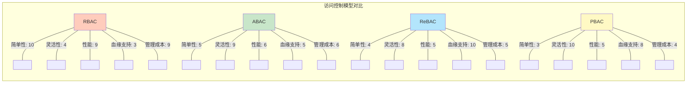
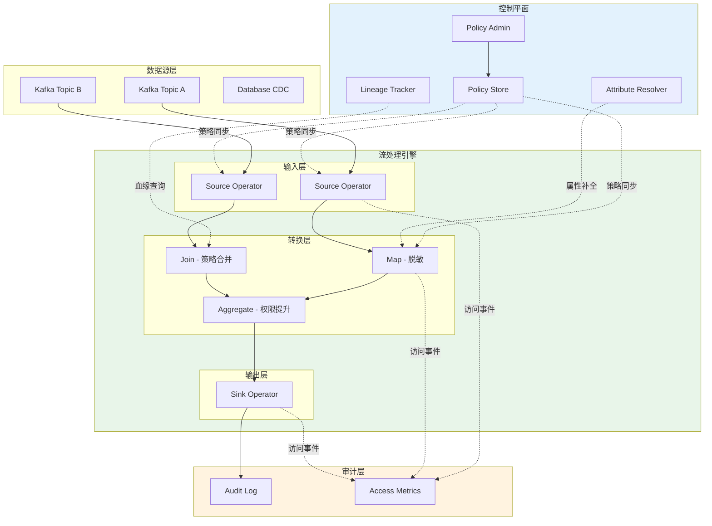
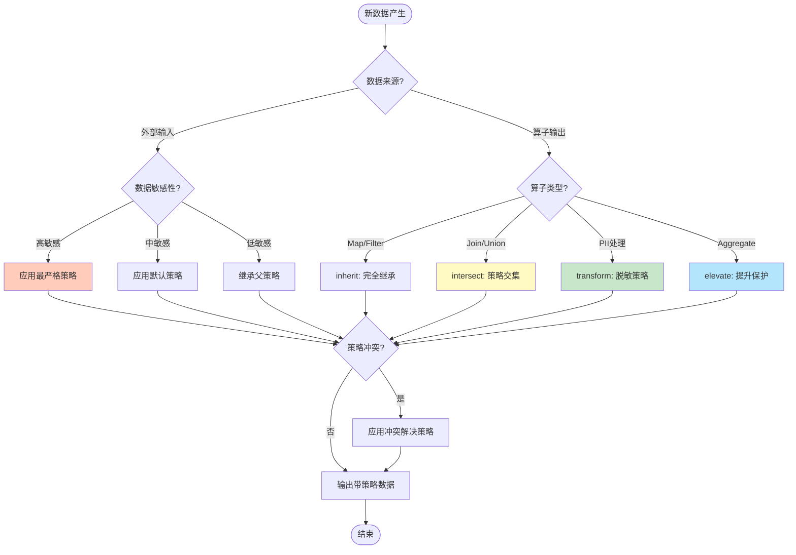

# 流数据访问控制模型 - RBAC/ABAC/ReBAC

> **所属阶段**: Knowledge | **前置依赖**: [05-mapping-guides/theory-to-code-patterns.md](../05-mapping-guides/theory-to-code-patterns.md) | **形式化等级**: L3 (结构化论证 + 半形式化模型)

## 1. 概念定义 (Definitions)

### Def-K-06-15: 流数据访问控制 (Streaming Data Access Control)

流数据访问控制是一种针对**连续数据流**的动态授权机制，在传统静态数据访问控制基础上，引入时间维度、数据血缘和传播路径，实现策略随数据流动的**持续评估**与**动态传播**。

**形式化定义**：

设 $ ext{Stream} =  ext{Seq}\ uple{t, k, v}$ 为带时间戳的数据元组序列，其中 $t$ 为事件时间，$k$ 为分区键，$v$ 为值。流数据访问控制可定义为五元组：

$$
\text{SDAC} = \langle \mathcal{S}, \mathcal{U}, \mathcal{A}, \mathcal{P}, \mathcal{T} \rangle
$$

其中：

- $\mathcal{S}$: 流数据空间，$\mathcal{S} = \{s_1, s_2, \ldots\}$，每个流 $s_i$ 由无限序列构成
- $\mathcal{U}$: 用户/主体集合，$\mathcal{U} = \{u_1, u_2, \ldots\}$
- $\mathcal{A}$: 动作集合，$\mathcal{A} = \{\text{READ}, \text{WRITE}, \text{PROCESS}, \text{FORWARD}\}$
- $\mathcal{P}$: 策略评估函数，$\mathcal{P}: \mathcal{U} \times \mathcal{A} \times \mathcal{S} \times \mathcal{T} \rightarrow \{\text{ALLOW}, \text{DENY}, \text{MASK}\}$
- $\mathcal{T}$: 时间上下文，$\mathcal{T} = \tuple{t_{current}, t_{window}, t_{session}}$

**核心特性**：

| 特性 | 静态数据访问控制 | 流数据访问控制 |
|------|------------------|----------------|
| 策略评估时机 | 访问前一次性判定 | 持续动态评估 |
| 数据上下文 | 孤立数据对象 | 时间窗口 + 血缘关系 |
| 权限传播 | 显式授权 | 随流自动传播 |
| 撤销机制 | 即时生效 | 考虑窗口内已处理数据 |
| 审计粒度 | 操作级 | 元组级 + 流级 |

**直观解释**：流数据访问控制不是"门禁"式的单次检查，而是"护送"式的持续保护——数据从进入系统到离开，每个处理环节都携带并验证其访问策略。

---

### Def-K-06-16: 基于属性的访问控制 (ABAC)

基于属性的访问控制(Attribute-Based Access Control)是一种将访问决策建立在**主体属性**、**资源属性**、**环境属性**和**操作属性**动态组合之上的授权模型。

**形式化定义**：

$$
\text{ABAC} = \langle \mathcal{U}_{attr}, \mathcal{R}_{attr}, \mathcal{E}_{attr}, \mathcal{O}_{attr}, \Pi, \Gamma \rangle
$$

其中：

- $\mathcal{U}_{attr}$: 主体属性集合，$\mathcal{U}_{attr} = \tuple{role, dept, clearance, location}$
- $\mathcal{R}_{attr}$: 资源属性集合，$\mathcal{R}_{attr} = \tuple{classification, owner, sensitivity, ttl}$
- $\mathcal{E}_{attr}$: 环境属性集合，$\mathcal{E}_{attr} = \tuple{time, location, threat\_level, network}$
- $\mathcal{O}_{attr}$: 操作属性集合，$\mathcal{O}_{attr} = \tuple{op\_type, data\_volume, retention}$
- $\Pi$: 策略规则集合，每个策略 $p \in \Pi$ 形如：

$$
  p: (\phi_U \land \phi_R \land \phi_E \land \phi_O) \rightarrow \text{decision}
  $$

其中 $\phi$ 为对应属性域上的谓词。

- $\Gamma$: 冲突解决策略，$\Gamma: 2^{\{\text{ALLOW}, \text{DENY}\}} \rightarrow \{\text{ALLOW}, \text{DENY}\}$

**流计算中的ABAC扩展**：

在流场景中，资源属性扩展为动态属性：

$$
\mathcal{R}_{attr}^{stream} = \mathcal{R}_{attr} \cup \tuple{data\_lineage, watermark, processing\_stage}
$$

---

### Def-K-06-17: 基于关系的访问控制 (ReBAC)

基于关系的访问控制(Relationship-Based Access Control)是一种将授权决策建立在**实体间关系图**基础上的访问控制模型，通过关系路径的存在性或属性判定访问权限。

**形式化定义**：

设关系图 $\mathcal{G} = (V, E, L)$，其中 $V$ 为实体顶点，$E \subseteq V \times L \times V$ 为带标签的边，$L$ 为关系标签集合。则：

$$
\text{ReBAC} = \langle \mathcal{G}, \mathcal{Q}, \mathcal{P}_{path} \rangle
$$

其中：

- $\mathcal{G}$: 关系图，包含主体、资源、组织、设备等实体及其关系
- $\mathcal{Q}$: 路径查询语言（如正则路径查询），$q \in \mathcal{Q}$ 定义了允许的关系模式
- $\mathcal{P}_{path}$: 路径授权函数：

$$
  \mathcal{P}_{path}(u, r, a) = \text{ALLOW} \iff \exists \pi: u \leadsto r \text{ s.t. } \text{match}(\pi, q_a)
  $$

其中 $\pi$ 为图中的路径，$q_a$ 为动作 $a$ 对应的路径模式。

**常见关系类型**：

| 关系标签 | 语义 | 示例路径 |
|----------|------|----------|
| `owns` | 所有权 | `User -owns→ Dataset` |
| `memberOf` | 成员关系 | `User -memberOf→ Team -manages→ Project` |
| `derivedFrom` | 衍生关系 | `StreamB -derivedFrom→ StreamA` |
| `processedBy` | 处理关系 | `Data -processedBy→ Operator` |
| `locatedIn` | 位置关系 | `Device -locatedIn→ Region` |

**流数据血缘关系**：

在流处理中，数据转换形成**血缘图(Lineage Graph)**：

$$
\mathcal{G}_{lineage} = (\mathcal{S}, \{s_i \xrightarrow{op} s_j \mid s_j = op(s_i)\})
$$

策略可沿血缘传播：若用户对源数据有权限，则对衍生数据的权限由策略继承规则决定。

---

### Def-K-06-18: 数据血缘与策略传播 (Data Lineage & Policy Propagation)

数据血缘是记录数据**来源**、**转换过程**和**去向**的元数据，策略传播是指访问控制策略随数据血缘**自动继承**或**动态转换**的机制。

**形式化定义**：

**定义 1 - 血缘图**：

给定流处理作业 $\mathcal{J}$，其血缘图定义为有向无环图：

$$
\mathcal{L}(\mathcal{J}) = (V_{data}, V_{op}, E_{data}, E_{op})
$$

其中：

- $V_{data}$: 数据集顶点（源、中间结果、输出）
- $V_{op}$: 算子顶点（map、filter、join、aggregate）
- $E_{data} \subseteq V_{data} \times V_{op}$: 数据流向边
- $E_{op} \subseteq V_{op} \times V_{data}$: 算子输出边

**定义 2 - 策略传播函数**：

设 $pol(v)$ 为顶点 $v$ 上的策略，传播函数 $\Psi$ 定义为：

$$
\Psi: pol(v_{source}) \times op \times ctx \rightarrow pol(v_{target})
$$

其中 $op \in V_{op}$ 为转换算子，$ctx$ 为处理上下文。

**传播策略类型**：

| 传播模式 | 语义 | 适用算子 |
|----------|------|----------|
| `inherit` | 完全继承源策略 | map, filter |
| `intersect` | 取策略交集（最严格） | join, union |
| `union` | 取策略并集（最宽松） | 不推荐用于安全场景 |
| `transform` | 按规则转换（如脱敏） | 涉及PII处理的算子 |
| `elevate` | 提升保护级别 | 聚合、统计分析 |

**引理 - 策略传播的单调性**：

**Lemma-K-06-03**: 对于安全敏感场景，若传播函数 $\Psi$ 满足：

$$
\forall s, t: s \xrightarrow{op} t \Rightarrow \text{restrictiveness}(pol(t)) \geq \text{restrictiveness}(pol(s))
$$

则系统满足**非降级保证(No-Downgrade Guarantee)**，即数据在流通过程中不会获得比源数据更宽松的访问控制。

---

## 2. 属性推导 (Properties)

### Prop-K-06-08: ABAC在流场景的表达能力完备性

**命题**：对于任意时变访问策略，存在等价的ABAC策略组合能够表达。

**论证**：

设时变策略为函数 $p(t): \mathcal{T} \rightarrow \{\text{ALLOW}, \text{DENY}\}$。由于：

1. 环境属性包含时间属性：$\mathcal{E}_{attr} \ni t_{current}$
2. 谓词逻辑可表达任意布尔函数
3. 策略组合通过 $\Gamma$ 处理冲突

因此 $p(t)$ 可编码为：

$$
p_{ABAC} = \bigvee_{t \in \mathcal{T}_{allow}} (t_{current} = t) \rightarrow \text{ALLOW}
$$

**工程含义**：ABAC足以表达流场景中的时间窗口策略（如"仅工作时间可访问"）、延迟敏感性策略等。

---

### Prop-K-06-09: ReBAC与ABAC的表达能力关系

**命题**：在有限关系深度 $d$ 的限制下，ReBAC 可编码为扩展属性空间的 ABAC。

**证明概要**：

对于关系路径 $u \xrightarrow{l_1} v_1 \xrightarrow{l_2} \cdots \xrightarrow{l_d} r$，定义扩展属性：

$$
attr_d(u) = \{v \mid \exists \pi: u \leadsto v, |\pi| \leq d\}
$$

则 ReBAC 策略 $q: u \leadsto r$ 可转化为 ABAC 谓词：

$$
\phi_R = (r \in attr_d(u))
$$

**逆命题不成立**：ABAC 中的数值比较（如 `age > 18`）无法纯粹用关系路径表达，除非引入虚拟的"大于"关系节点。

**结论**：ReBAC 适合表达**结构性权限**（组织架构、数据血缘），ABAC 适合表达**条件性权限**（时间、位置、数值范围）。二者互补。

---

### Prop-K-06-10: 策略传播的一致性约束

**命题**：在存在循环依赖的流处理图中（如迭代计算），策略传播可能产生不一致。

**论证**：

考虑循环：$s_1 \xrightarrow{op_1} s_2 \xrightarrow{op_2} s_1$

设：

- $pol(s_1) = P_1$, $pol(s_2) = P_2$
- $\Psi(P_1, op_1) = P_2$
- $\Psi(P_2, op_2) = P_1'$

一致性要求 $P_1' = P_1$。但若 $\Psi$ 不是幂等的，可能出现 $P_1' \neq P_1$。

**解决方案**：

1. **迭代至不动点**：计算 $\Psi^*(P)$ 直到收敛
2. **禁止循环血缘**：流处理中实际为有向无环图（DAG）
3. **人工策略覆盖**：检测到冲突时人工介入

---

### Lemma-K-06-04: 字段级权限的分解引理

**引理**：对于结构化数据元组 $\tuple{f_1, f_2, \ldots, f_n}$，若每个字段 $f_i$ 有独立策略 $pol_i$，则元组整体访问权限可分解为字段级决策的合取：

$$
\text{access}(u, \tuple{f_1, \ldots, f_n}) = \bigwedge_{i=1}^{n} \text{access}_i(u, f_i)
$$

**证明**：

假设用户请求访问完整元组。系统可：

1. 对每个字段独立评估 $pol_i$
2. 根据需求选择严格或宽松合并策略
3. 返回可访问字段子集或整体拒绝

**工程应用**：

- **行级安全(Row-Level Security)**：策略基于分区键
- **列级安全(Column-Level Security)**：策略基于字段名/类型
- **单元格级安全(Cell-Level Security)**：策略基于内容（如PII检测）

---

## 3. 关系建立 (Relations)

### 3.1 访问控制模型谱系

```
┌─────────────────────────────────────────────────────────────────┐
│                    访问控制模型演进谱系                          │
├─────────────────────────────────────────────────────────────────┤
│                                                                 │
│  ┌──────────┐    ┌──────────┐    ┌──────────┐    ┌──────────┐  │
│  │   ACL    │───→│   RBAC   │───→│   ABAC   │───→│   ReBAC  │  │
│  │ 1970s    │    │ 1990s    │    │ 2000s    │    │ 2010s    │  │
│  └──────────┘    └──────────┘    └──────────┘    └──────────┘  │
│       │               │               │               │         │
│       │               │               │               │         │
│       ▼               ▼               ▼               ▼         │
│   直接绑定        角色中介        属性动态        关系图         │
│   (用户,资源)    (用户,角色,      评估            推理           │
│                  权限)                                          │
│                                                                 │
│  ┌─────────────────────────────────────────────────────────┐   │
│  │  统一模型: PBAC (Policy-Based Access Control)           │   │
│  │  整合 RBAC + ABAC + ReBAC 的统一策略框架               │   │
│  └─────────────────────────────────────────────────────────┘   │
└─────────────────────────────────────────────────────────────────┘
```

### 3.2 四大模型对比矩阵

| 维度 | RBAC | ABAC | ReBAC | PBAC |
|------|------|------|-------|------|
| **核心抽象** | 角色 | 属性 | 关系路径 | 策略规则 |
| **灵活性** | 低 | 高 | 高 | 极高 |
| **管理复杂度** | 低 | 中 | 中 | 高 |
| **运行时开销** | 低(O(1)) | 中(O(n)) | 高(O(path)) | 中-高 |
| **流场景适配** | 静态角色 | 动态属性 | 血缘传播 | 统一策略 |
| **代表实现** | LDAP/AD | AWS IAM | Google Zanzibar | Open Policy Agent |

### 3.3 与流处理概念的映射

| 流处理概念 | 访问控制映射 | 示例 |
|------------|--------------|------|
| Stream | 受保护资源 | Kafka Topic 作为访问控制单元 |
| Partition | 行级安全边界 | 按 `tenant_id` 分区隔离 |
| Record/Field | 列级安全单元 | PII 字段脱敏 |
| Operator | 策略转换点 | Map 算子执行脱敏策略 |
| Watermark | 时间策略边界 | "超过7天的数据降级访问" |
| Checkpoint | 策略状态持久化 | 流处理中保存授权状态 |
| State Store | 敏感数据存储 | 加密 + 访问审计 |

### 3.4 与Flink安全机制的整合

Flink 提供多层安全机制，访问控制位于最上层：

```
┌─────────────────────────────────────────────────────────────┐
│                    Flink 安全层次                            │
├─────────────────────────────────────────────────────────────┤
│                                                             │
│  ┌─────────────────────────────────────────────────────┐   │
│  │  Layer 4: 数据访问控制 (SDAC)                        │   │
│  │  - 字段级脱敏                                       │   │
│  │  - 行级过滤                                         │   │
│  │  - 血缘策略传播                                     │   │
│  └─────────────────────────────────────────────────────┘   │
│                         ↓                                   │
│  ┌─────────────────────────────────────────────────────┐   │
│  │  Layer 3: 认证与授权 (Kerberos/SASL)                │   │
│  │  - JobManager 安全                                  │   │
│  │  - TaskManager 互信                                 │   │
│  └─────────────────────────────────────────────────────┘   │
│                         ↓                                   │
│  ┌─────────────────────────────────────────────────────┐   │
│  │  Layer 2: 传输安全 (TLS/SSL)                        │   │
│  │  - 数据在传输中加密                                 │   │
│  │  - 证书管理                                         │   │
│  └─────────────────────────────────────────────────────┘   │
│                         ↓                                   │
│  ┌─────────────────────────────────────────────────────┐   │
│  │  Layer 1: 网络隔离 (防火墙/VPC)                     │   │
│  │  - 集群网络边界                                     │   │
│  │  - 端口访问控制                                     │   │
│  └─────────────────────────────────────────────────────┘   │
│                                                             │
└─────────────────────────────────────────────────────────────┘
```

---

## 4. 论证过程 (Argumentation)

### 4.1 流场景的特殊安全挑战

#### 挑战1：低延迟 vs 细粒度访问控制的权衡

**矛盾**：ABAC/ReBAC 的复杂评估可能引入毫秒级延迟，与流处理的实时性要求冲突。

**量化分析**：

设：

- 基础处理延迟：$T_{base} = 5ms$
- 访问控制评估延迟：$T_{ac} = 2ms$（复杂ABAC策略）
- 吞吐量要求：$100K\ events/s$

则访问控制引入的开销占比：$\frac{T_{ac}}{T_{base} + T_{ac}} = 29\%$

**缓解策略**：

| 策略 | 原理 | 代价 |
|------|------|------|
| **策略缓存** | 缓存主体-资源对的决策结果 | 策略变更延迟生效 |
| **预授权** | 批量获取权限令牌 | 令牌管理复杂度 |
| **异步授权** | 先处理后审计 | 违规风险 |
| **硬件加速** | FPGA 评估策略 | 硬件成本 |

#### 挑战2：数据血缘的追踪成本

**问题**：细粒度血缘追踪（元组级）带来存储和计算开销。

**成本模型**：

设流吞吐量为 $\lambda$ events/s，每个元组平均产生 $k$ 个血缘边，存储成本为 $c$ per边：

$$
\text{Storage Cost} = \lambda \cdot k \cdot c \cdot T_{retention}
$$

对于 $100K\ events/s$，$k=3$，$T=30\ days$：约 $7.7\ billion$ 条边。

**优化方案**：

1. **采样追踪**：仅对敏感数据 100% 追踪，其他采样
2. **批处理血缘**：以微批为单位记录血缘
3. **压缩存储**：使用图数据库的边压缩技术

#### 挑战3：动态数据脱敏的性能影响

**场景**：PII 字段在流处理中需要实时脱敏（如掩码、哈希、泛化）。

**脱敏算子开销**：

| 脱敏类型 | 计算复杂度 | 延迟增加 |
|----------|-----------|----------|
| 掩码 (Mask) | O(1) | ~0.1ms |
| 哈希 (Hash) | O(1) | ~0.5ms |
| 加密 (Encrypt) | O(n) | ~2ms |
| K-匿名化 | O(n log n) | ~10ms+ |

**工程折衷**：

- 对低延迟路径使用**掩码**
- 对分析路径使用**哈希/加密**
- K-匿名化放在**离线批处理**中

### 4.2 模型选择的决策框架

**决策树**：

```
开始
  │
  ├─ 组织架构稳定且角色清晰？
  │     ├─ 是 → 考虑 RBAC
  │     └─ 否 → 继续
  │
  ├─ 需要基于数据血缘的权限传播？
  │     ├─ 是 → 需要 ReBAC
  │     └─ 否 → 继续
  │
  ├─ 需要复杂的动态条件判断？
  │     ├─ 是 → 需要 ABAC
  │     └─ 否 → 继续
  │
  └─ 是否已有复杂策略体系？
        ├─ 是 → 考虑 PBAC 统一
        └─ 否 → 从 RBAC 起步逐步演进
```

### 4.3 合规性要求映射

| 法规/标准 | 关键要求 | 访问控制策略 |
|-----------|----------|--------------|
| **GDPR** | 数据最小化、被遗忘权 | 字段级 ABAC + 自动过期 |
| **CCPA** | 消费者数据权利 | 细粒度审计 + 访问日志 |
| **HIPAA** | PHI 保护 | 行级安全 + 脱敏策略 |
| **PCI-DSS** | 持卡人数据隔离 | 网络隔离 + 字段加密 |
| **SOX** | 审计追踪 | 不可变审计日志 + 策略变更追踪 |

---

## 5. 工程论证 (Engineering Argument)

### 5.1 Apache Ranger 集成方案

**Ranger 架构**：

```
┌─────────────────────────────────────────────────────────────────┐
│                     Apache Ranger 集成                           │
├─────────────────────────────────────────────────────────────────┤
│                                                                 │
│  ┌─────────────────┐      ┌─────────────────┐                  │
│  │   Ranger Admin   │◄────►│  Policy Database │                  │
│  │   (策略管理)     │      │  (策略存储)      │                  │
│  └────────┬────────┘      └─────────────────┘                  │
│           │                                                     │
│           │ 策略同步                                             │
│           ▼                                                     │
│  ┌─────────────────┐      ┌─────────────────┐                  │
│  │   Ranger Plugin  │◄────►│   Flink Job     │                  │
│  │   (策略执行)     │      │   (流处理作业)   │                  │
│  │                 │      │                 │                  │
│  │  ┌───────────┐  │      │  ┌───────────┐  │                  │
│  │  │ Policy   │  │      │  │ Source    │  │                  │
│  │  │ Enforcer  │  │◄────►│  │ Operator  │  │                  │
│  │  └───────────┘  │      │  └───────────┘  │                  │
│  │        │        │      │        │        │                  │
│  │        ▼        │      │        ▼        │                  │
│  │  ┌───────────┐  │      │  ┌───────────┐  │                  │
│  │  │ Audit    │  │      │  │ Transform │  │                  │
│  │  │ Logger    │──┼─────►│  │ Operators │  │                  │
│  │  └───────────┘  │      │  └───────────┘  │                  │
│  │                 │      │        │        │                  │
│  └─────────────────┘      │        ▼        │                  │
│                           │  ┌───────────┐  │                  │
│                           │  │   Sink    │  │                  │
│                           │  └───────────┘  │                  │
│                           └─────────────────┘                  │
│                                                                 │
└─────────────────────────────────────────────────────────────────┘
```

**集成点**：

1. **Source Operator**: 读取 Kafka 前调用 Ranger 检查 Topic 权限
2. **Transform Operators**: 在 PII 处理算子中应用脱敏策略
3. **Audit**: 所有访问决策记录到 Ranger Audit Store

**策略示例**：

```json
{
  "name": "kafka_pii_access",
  "service": "kafka",
  "resources": {
    "topic": {"values": ["user_events"]},
    "field": {"values": ["ssn", "credit_card"]}
  },
  "accesses": [
    {"type": "read", "isAllowed": true, "maskType": "MASK"}
  ],
  "conditions": [
    {"type": "streaming_time", "values": ["business_hours"]}
  ]
}
```

### 5.2 自定义 Policy Engine 设计

**架构设计**：

```
┌─────────────────────────────────────────────────────────────────┐
│                    自定义 Policy Engine                          │
├─────────────────────────────────────────────────────────────────┤
│                                                                 │
│  ┌───────────────────────────────────────────────────────────┐ │
│  │                     策略评估管道                           │ │
│  │                                                            │ │
│  │  Input ──► [Parser] ──► [Enricher] ──► [Evaluator] ──► Out│ │
│  │              │              │              │               │ │
│  │              ▼              ▼              ▼               │ │
│  │         策略DSL解析    属性补全(UDF)    决策引擎(OPA)       │ │
│  └───────────────────────────────────────────────────────────┘ │
│                                                                 │
│  ┌─────────────────┐  ┌─────────────────┐  ┌─────────────────┐ │
│  │   Rule Store    │  │  Attribute      │  │   Lineage       │ │
│  │   (etcd/consul) │  │  Resolver       │  │   Tracker       │ │
│  │                 │  │  (LDAP/HR系统)   │  │   (图数据库)     │ │
│  └─────────────────┘  └─────────────────┘  └─────────────────┘ │
│                                                                 │
└─────────────────────────────────────────────────────────────────┘
```

**关键技术选择**：

| 组件 | 选型 | 理由 |
|------|------|------|
| 决策引擎 | Open Policy Agent (OPA) | 高性能 Rego 评估，CNCF 毕业项目 |
| 属性解析 | 插件化 UDF | 支持 LDAP、HR 系统、外部 API |
| 血缘存储 | Neo4j / JanusGraph | 原生图查询，支持路径分析 |
| 策略存储 | etcd | 高可用、Watch 机制支持实时推送 |
| 审计存储 | Kafka → ClickHouse | 流式审计分析 |

### 5.3 与 Kafka ACL 的协同

**分层防护策略**：

```
┌─────────────────────────────────────────────────────────────┐
│                   Kafka 安全层次                             │
├─────────────────────────────────────────────────────────────┤
│                                                             │
│  ┌─────────────────────────────────────────────────────┐   │
│  │  Layer 3: 应用层访问控制 (自定义 Policy Engine)      │   │
│  │  - 字段级脱敏                                       │   │
│  │  - 数据血缘追踪                                     │   │
│  │  - 动态策略评估                                     │   │
│  └─────────────────────────────────────────────────────┘   │
│                         ↑                                   │
│  ┌─────────────────────────────────────────────────────┐   │
│  │  Layer 2: Kafka ACL (粗粒度)                        │   │
│  │  - Topic 读写权限                                   │   │
│  │  - Consumer Group 权限                              │   │
│  │  - 生产者 ID 权限                                   │   │
│  └─────────────────────────────────────────────────────┘   │
│                         ↑                                   │
│  ┌─────────────────────────────────────────────────────┐   │
│  │  Layer 1: 传输层安全 (SASL_SSL)                     │   │
│  │  - 客户端认证 (mTLS/SASL)                           │   │
│  │  - 传输加密                                         │   │
│  └─────────────────────────────────────────────────────┘   │
│                                                             │
└─────────────────────────────────────────────────────────────┘
```

**协同规则**：

1. **Kafka ACL** 作为第一道防线：防止未认证客户端连接
2. **应用层 Policy Engine** 处理细粒度授权：字段、内容、上下文
3. **ACL 配置示例**：

```bash
# 基本 Topic 访问
kafka-acls --add --allow-principal User:flink-app \
           --operation Read --topic user_events

# 拒绝直接访问敏感 Topic（必须通过策略引擎）
kafka-acls --add --deny-principal User:'*' \
           --operation Read --topic pii_raw_data
```

### 5.4 性能优化策略

**策略缓存策略**：

| 缓存级别 | 键 | TTL | 命中率 |
|----------|-----|-----|--------|
| L1 (本地) | (user, resource, action) | 5s | 85% |
| L2 (Redis) | (role, resource) | 60s | 95% |
| L3 (远程) | 完整策略集 | 5min | 99% |

**血缘追踪优化**：

```java
// 伪代码：采样血缘追踪
class LineageTracker {

    void track(DataRecord record, Operator op) {
        // 敏感数据 100% 追踪
        if (record.hasSensitiveField()) {
            storeLineage(record.id, op.id, FULL);
        }
        // 其他数据 1% 采样
        else if (sampler.shouldSample()) {
            storeLineage(record.id, op.id, SAMPLED);
        }
    }
}
```

---

## 6. 实例验证 (Examples)

### 6.1 金融实时风控场景

**场景**：实时交易流需要基于用户风险评级动态决定数据访问级别。

**架构**：

```
┌──────────────┐     ┌──────────────┐     ┌──────────────┐
│  Transaction │────►│  Risk Score  │────►│  Policy      │
│  Stream      │     │  Engine      │     │  Enforcer    │
└──────────────┘     └──────────────┘     └──────┬───────┘
                                                │
                       ┌────────────────────────┼────────────────────────┐
                       │                        │                        │
                       ▼                        ▼                        ▼
                 ┌──────────┐           ┌──────────┐           ┌──────────┐
                 │ 低风险   │           │ 中风险   │           │ 高风险   │
                 │ 完整数据 │           │ 掩码PII  │           │ 仅统计   │
                 └──────────┘           └──────────┘           └──────────┘
```

**ABAC 策略**：

```rego
# OPA Rego 策略示例
package transaction.access

import future.keywords.if
import future.keywords.in

# 默认拒绝
default allow := false

# 低风险用户可访问完整交易数据
allow if {
    input.user.risk_level == "low"
    input.action == "read"
    input.resource.sensitivity == "transaction"
}

# 中风险用户 - 脱敏访问
allow if {
    input.user.risk_level == "medium"
    input.action == "read"
    input.masking_required == true
}

# 高风险用户 - 仅聚合访问
allow if {
    input.user.risk_level == "high"
    input.action == "aggregate"
    input.resource.type == "summary"
}
```

### 6.2 多租户 SaaS 平台

**场景**：SaaS 平台需要确保租户数据严格隔离。

**行级安全实现**：

```sql
-- 基于租户ID的行级安全策略
CREATE ROW ACCESS POLICY tenant_isolation
ON STREAM user_activity
USING (tenant_id = CURRENT_USER_CONTEXT('tenant_id'));

-- 在 Flink SQL 中应用
CREATE TABLE user_activity (
    tenant_id STRING,
    user_id STRING,
    event_type STRING,
    event_data STRING,
    -- 应用行级策略
    PRIMARY KEY (tenant_id, user_id)
) WITH (
    'connector' = 'kafka',
    'topic' = 'user_activity',
    'row-access-policy' = 'tenant_isolation'
);
```

### 6.3 数据血缘追踪实现

**血缘图构建**：

```java
// Flink ProcessFunction 中的血缘追踪
class LineageTrackingFunction extends ProcessFunction<Record, Record> {

    private LineageTracker lineageTracker;

    @Override
    public void processElement(Record record, Context ctx, Collector<Record> out) {
        // 记录输入血缘
        LineageEdge inputEdge = new LineageEdge(
            record.getLineageId(),
            getOperatorId(),
            OperationType.TRANSFORM
        );
        lineageTracker.track(inputEdge);

        // 处理数据
        Record result = transform(record);

        // 传播血缘ID
        result.setLineageId(generateLineageId());

        // 记录输出血缘
        LineageEdge outputEdge = new LineageEdge(
            getOperatorId(),
            result.getLineageId(),
            OperationType.OUTPUT
        );
        lineageTracker.track(outputEdge);

        // 传播策略
        Policy propagatedPolicy = policyPropagator.propagate(
            record.getPolicy(),
            OperationType.TRANSFORM,
            getContext()
        );
        result.setPolicy(propagatedPolicy);

        out.collect(result);
    }
}
```

### 6.4 动态脱敏 Pipeline

```
┌─────────────────────────────────────────────────────────────────┐
│                     动态脱敏 Pipeline                            │
├─────────────────────────────────────────────────────────────────┤
│                                                                 │
│  Raw Data                                                        │
│     │                                                           │
│     ▼                                                           │
│  ┌─────────────────────────────────────────────────────────┐   │
│  │  [PII Detector] - 识别敏感字段                           │   │
│  │  - SSN: \d{3}-\d{2}-\d{4}                                │   │
│  │  - Credit Card: \d{4}-\d{4}-\d{4}-\d{4}                  │   │
│  │  - Email: .*@.*\..*                                      │   │
│  └─────────────────────────────────────────────────────────┘   │
│     │                                                           │
│     ▼                                                           │
│  ┌─────────────────────────────────────────────────────────┐   │
│  │  [Policy Router] - 根据用户角色路由                      │   │
│  │                                                          │   │
│  │  Admin ──────► [No Masking]                              │   │
│  │  Analyst ────► [Partial Mask: ***-**-6789]               │   │
│  │  External ───► [Full Hash: sha256(...)]                  │   │
│  └─────────────────────────────────────────────────────────┘   │
│     │                                                           │
│     ▼                                                           │
│  ┌─────────────────────────────────────────────────────────┐   │
│  │  [Audit Logger] - 记录脱敏操作                           │   │
│  │  - 用户ID, 时间戳, 原始字段类型, 脱敏方式                │   │
│  └─────────────────────────────────────────────────────────┘   │
│     │                                                           │
│     ▼                                                           │
│  Masked Data                                                     │
│                                                                 │
└─────────────────────────────────────────────────────────────────┘
```

---

## 7. 可视化 (Visualizations)

### 7.1 访问控制模型对比雷达图



**说明**：雷达图展示了四种访问控制模型在五个维度的对比，数值越高越好（管理成本越低越好）。RBAC 适合简单场景，ReBAC 擅长血缘追踪，PBAC 提供最全面的灵活性。

### 7.2 流数据访问控制架构图



**说明**：展示了流数据访问控制的完整架构，包括控制平面（策略管理）、处理引擎（策略执行点）和审计层。

### 7.3 策略传播决策树



**说明**：策略传播决策树展示了数据在流处理过程中如何根据来源和算子类型确定其访问控制策略。

### 7.4 数据血缘与策略传播示例

```mermaid
graph LR
    subgraph Source["源数据层"]
        S1[Raw Events<br/>Policy: P1<br/>Sensitivity: High]
    end

    subgraph Processing["处理层"]
        OP1[Filter Operator<br/>inherit]
        OP2[Enrich Operator<br/>inherit]
        OP3[PII Mask Operator<br/>transform]
        OP4[Aggregate Operator<br/>elevate]
    end

    subgraph Output["输出层"]
        O1[Filtered Stream<br/>Policy: P1]
        O2[Enriched Stream<br/>Policy: P1]
        O3[Masked Stream<br/>Policy: P2<br/>P2 = mask(P1)]
        O4[Aggregated Metrics<br/>Policy: P3<br/>P3 = elevate(P2)]
    end

    S1 --> OP1
    OP1 --> O1
    OP1 --> OP2
    OP2 --> O2
    OP2 --> OP3
    OP3 --> O3
    OP3 --> OP4
    OP4 --> O4

    style S1 fill:#ffccbc
    style O3 fill:#c8e6c9
    style O4 fill:#b3e5fc
```

**说明**：展示了数据血缘如何在流处理过程中传递，以及策略如何根据算子类型进行转换（继承、脱敏、提升）。

---

## 8. 引用参考 (References)


---

*文档版本: 1.0 | 创建日期: 2026-04-02 | 状态: 完整*
