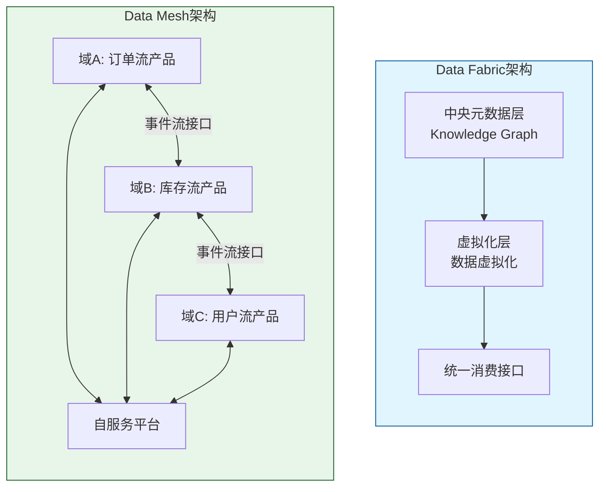
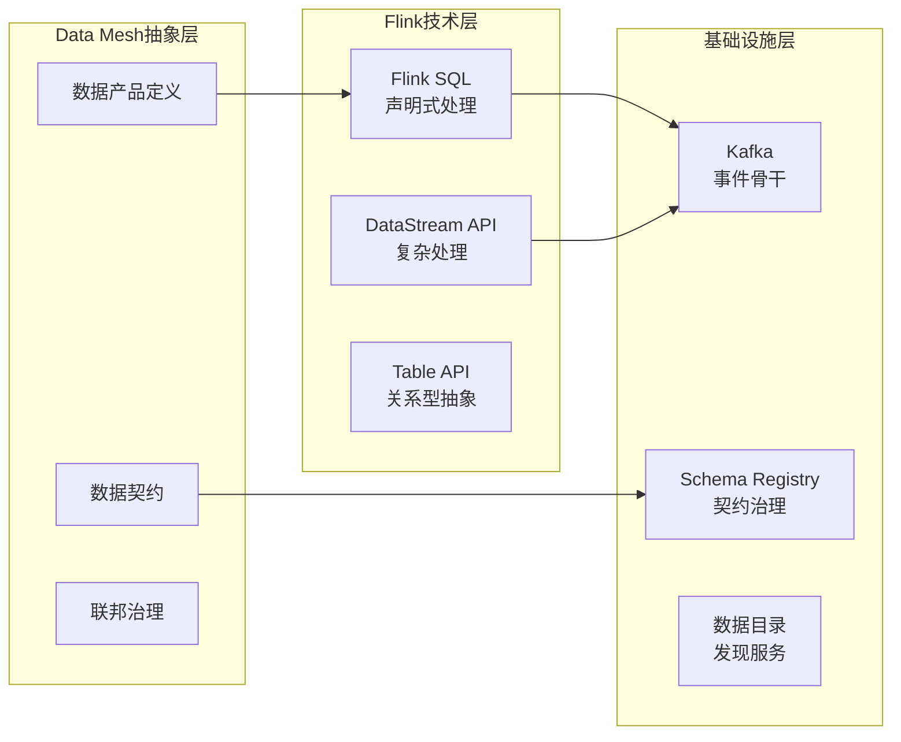
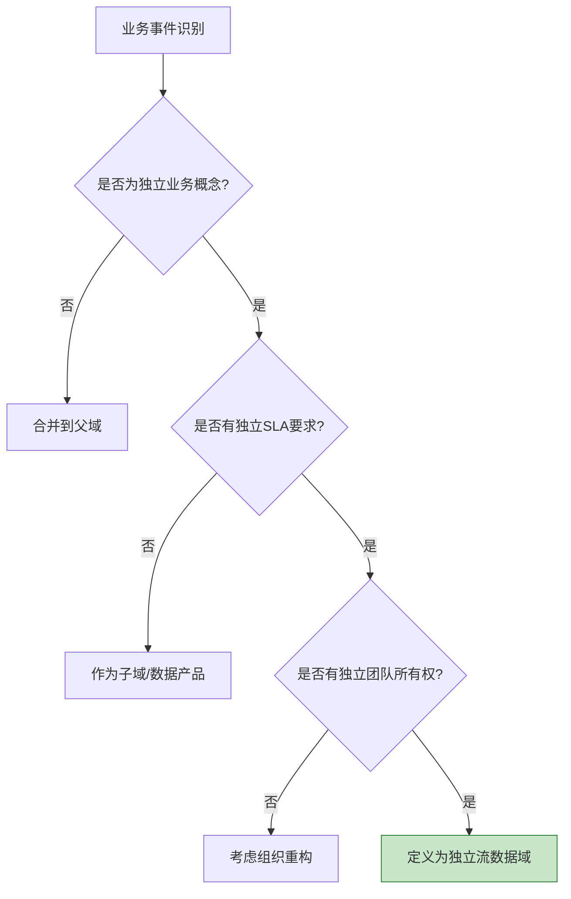
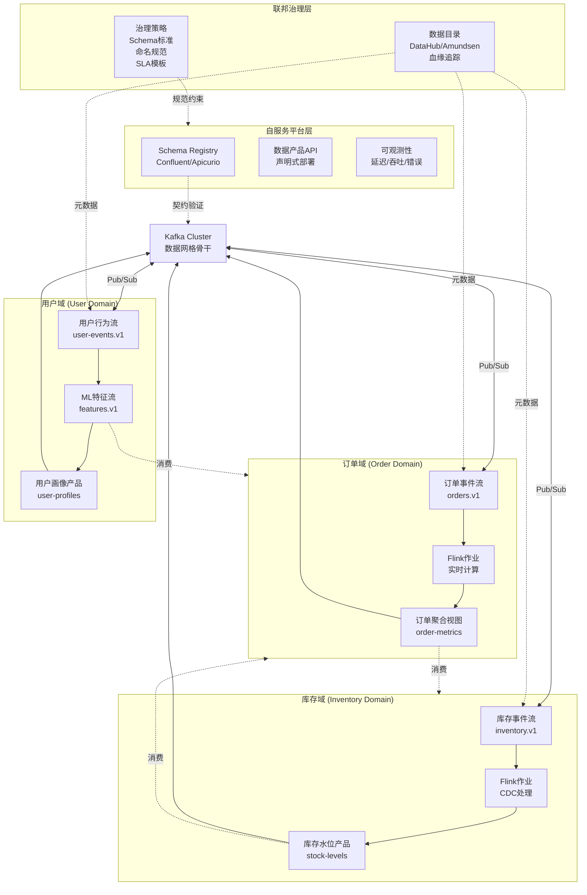
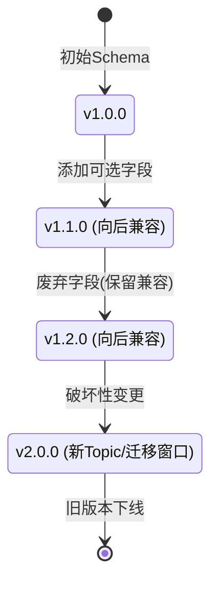
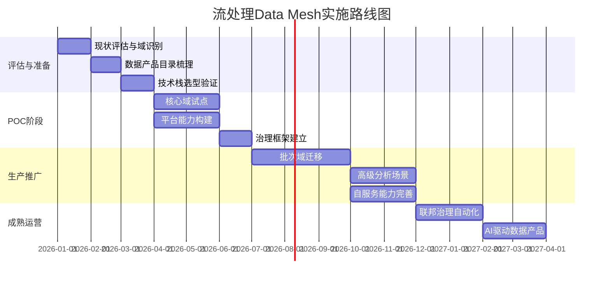
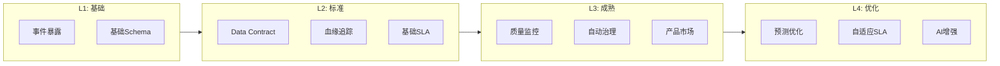
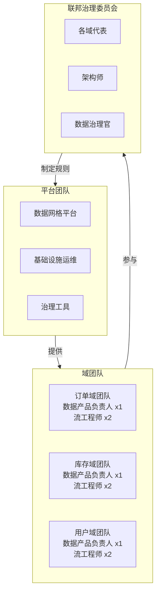

# 流处理Data Mesh架构与实时数据产品

> 所属阶段: Knowledge | 前置依赖: [Knowledge/05-dataflow/05.01-dataflow-model.md](../01-concept-atlas/streaming-models-mindmap.md), [Knowledge/03-design-patterns/stream-processing-patterns.md](../02-design-patterns/pattern-event-time-processing.md) | 形式化等级: L4

---

## 1. 概念定义 (Definitions)

### 1.1 Data Mesh基础定义

**Def-K-06-120 (Data Mesh)**：Data Mesh是一种**去中心化的数据架构范式**，将数据视为由独立域团队拥有和运营的产品，通过自服务平台和联邦治理实现大规模数据价值交付。

**核心四原则形式化表述**：

| 原则 | 形式化定义 | 关键属性 |
|------|------------|----------|
| **域所有权 (Domain Ownership)** | 数据主权 $D_S$ 归属于业务域 $\mathcal{B}_i$，满足 $\forall d \in D_S, Owner(d) = \mathcal{B}_i$ | 端到端责任、域内自治 |
| **数据即产品 (Data as Product)** | 数据产品 $\mathcal{P}_d = (Schema, Quality, Meta, Access, SLA)$ 是可发现的、可寻址的、可信赖的 | 产品思维、用户体验优先 |
| **自服务平台 (Self-Serve Platform)** | 平台能力 $P_f$ 提供抽象层，使域团队满足 $\forall op \in Ops, Complexity(op) \leq \theta_{domain}$ | 基础设施即代码、降低门槛 |
| **联邦治理 (Federated Governance)** | 全局规则 $\mathcal{G}$ 由域代表协商，满足 $\mathcal{G} = \bigcup_i \mathcal{G}_i \cap \mathcal{G}_{global}$ | 标准化与自治平衡 |

### 1.2 实时数据产品定义

**Def-K-06-121 (实时数据产品)**：实时数据产品是一种特殊的数据产品，其数据新鲜度满足时延约束 $T_{latency} \leq T_{SLO}$，形式化定义为：

$$\mathcal{P}_{realtime} = (E_{stream}, \mathcal{T}_{proc}, \mathcal{Q}_{fresh}, SLA_{RT})$$

其中：

- $E_{stream}$：事件流接口（Kafka Topic、Pulsar Stream等）
- $\mathcal{T}_{proc}$：处理语义（At-least-once / Exactly-once）
- $\mathcal{Q}_{fresh}$：新鲜度质量指标（端到端延迟、Watermark年龄）
- $SLA_{RT}$：实时服务等级协议（可用性、延迟、吞吐量）

### 1.3 流数据域边界

**Def-K-06-122 (流数据域)**：流数据域 $\mathcal{D}_s$ 是围绕业务事件流定义的领域边界，满足：

$$\mathcal{D}_s = (E_{in}, \mathcal{F}_{proc}, E_{out}, \mathcal{C}_{contract})$$

- $E_{in}$：输入事件流集合（来自其他域或外部源）
- $\mathcal{F}_{proc}$：域内流处理函数（Flink作业、Kafka Streams应用）
- $E_{out}$：输出事件流产品（供其他域消费）
- $\mathcal{C}_{contract}$：数据契约（Schema版本、兼容性规则、SLA承诺）

### 1.4 Data Contract形式化

**Def-K-06-123 (Data Contract)**：数据契约是流数据产品与其消费者之间的形式化协议：

$$\mathcal{C} = (S, V, Q, M, A, L)$$

| 组件 | 说明 | 示例 |
|------|------|------|
| $S$ (Schema) | 数据结构的正式定义 | Avro/Protobuf/JSON Schema |
| $V$ (Versioning) | 语义版本控制策略 | SemVer: major.minor.patch |
| $Q$ (Quality) | 数据质量断言 | null率、值域、唯一性 |
| $M$ (Metadata) | 发现和治理元数据 | 所有权、血缘、业务术语 |
| $A$ (Access) | 访问模式与认证 | SASL/SSL、RBAC |
| $L$ (Lifecycle) | 保留策略与SLA | 7天保留、P99延迟<100ms |

---

## 2. 属性推导 (Properties)

### 2.1 Data Mesh架构属性

**Lemma-K-06-90 (域自治与全局一致性权衡)**：在Data Mesh架构中，域自治度 $\alpha$ 与全局一致性 $C$ 满足反比关系：

$$\alpha \cdot C \leq K$$

其中 $K$ 为组织常数，由联邦治理强度决定。

*直观解释*: 域团队自主权越大，全局标准化越难；强治理会限制域创新速度。联邦治理旨在找到最优平衡点。

**Lemma-K-06-91 (实时数据产品的网络效应)**：设域数量为 $n$，数据产品数量为 $m$，则网格价值 $V_{mesh}$ 满足：

$$V_{mesh} \propto m \cdot \log(n) \cdot \frac{1}{\bar{T}_{latency}}$$

即价值随产品数量和域数量增长，但受平均延迟倒数调节——实时性越强，价值越高。

### 2.2 流处理特定属性

**Lemma-K-06-92 (Schema演化兼容性)**：设Schema版本序列为 $S_1, S_2, ..., S_n$，向后兼容性要求：

$$\forall i < j, Consumer(S_j) \subseteq Consumer(S_i)$$

向前兼容性要求：

$$\forall i < j, Producer(S_i) \subseteq Producer(S_j)$$

*工程含义*: 消费者应先于生产者升级，确保新Schema的消费者能读取旧数据。

### 2.3 数据血缘传递性

**Prop-K-06-90 (血缘传递闭包)**：若数据产品 $P_A$ 依赖 $P_B$，$P_B$ 依赖 $P_C$，则血缘图 $\mathcal{G}_{lineage}$ 中存在路径 $P_A \rightarrow P_B \rightarrow P_C$，影响分析的范围为：

$$Impact(P_C) = \{P \in \mathcal{P} \mid P_C \leadsto^* P\}$$

---

## 3. 关系建立 (Relations)

### 3.1 Data Mesh与Data Fabric对比



**对比矩阵**：

| 维度 | Data Fabric | Data Mesh |
|------|-------------|-----------|
| **架构哲学** | 集中式虚拟化 | 去中心化产品化 |
| **数据位置** | 保留在源系统，虚拟集成 | 物理分布，域内自治 |
| **主要技术** | 数据虚拟化、知识图谱 | 事件流、Schema注册、数据产品目录 |
| **治理模式** | 中央IT驱动 | 联邦式、域代表参与 |
| **适用场景** | 现有系统整合、跨域查询 | 实时分析、微服务生态、快速迭代 |
| **流处理能力** | 较弱（主要面向批处理） | 原生支持（事件驱动核心） |

### 3.2 与Flink生态的映射



---

## 4. 论证过程 (Argumentation)

### 4.1 为什么流处理是Data Mesh的理想载体？

**论证框架**：从四个核心原则推导流处理的适配性

| 原则 | 流处理的天然适配性 |
|------|-------------------|
| **域所有权** | 微服务边界与流域边界天然对齐；每个服务拥有自己的事件流 |
| **数据即产品** | Kafka Topic作为可寻址、可发现、可订阅的数据产品接口 |
| **自服务平台** | Kafka Connect + Schema Registry提供声明式数据集成能力 |
| **联邦治理** | Schema演化规则、ACL统一策略跨域实施 |

**反例分析**：批处理Data Mesh的局限

- 批处理作业通常跨域调度，违背域所有权
- 批量ETL的集中式特征与去中心化治理冲突
- 批数据产品缺乏实时性，难以满足现代业务需求

### 4.2 域边界划分决策树



---

## 5. 工程论证 (Engineering Argument)

### 5.1 流处理Data Mesh参考架构



### 5.2 技术组件选型论证

**Thm-K-06-90 (流处理Data Mesh技术栈完备性)**：一个生产级流处理Data Mesh平台需要满足以下能力矩阵：

| 能力域 | 必需组件 | 推荐选型 | 理由 |
|--------|----------|----------|------|
| **事件骨干** | 分布式日志 | Apache Kafka / Pulsar | 高吞吐、持久化、可重放 |
| **流处理** | 计算引擎 | Apache Flink | 精确一次、低延迟、SQL支持 |
| **Schema治理** | Schema Registry | Confluent Schema Registry | 版本控制、兼容性检查 |
| **数据目录** | 元数据管理 | DataHub / OpenMetadata | 发现、血缘、治理 |
| **可观测性** | 监控告警 | Prometheus + Grafana | 延迟/吞吐/偏移量指标 |
| **访问控制** | 安全层 | Kafka ACL + RBAC | 域间数据隔离 |

### 5.3 Schema演化工程实践



**Schema兼容性规则**：

```yaml
# Confluent Schema Registry 配置示例 compatibility:
  BACKWARD: # 新消费者可读旧数据
    - 允许: 添加可选字段、删除字段
    - 禁止: 修改字段类型、添加必填字段

  FORWARD: # 旧消费者可读新数据
    - 允许: 删除可选字段、添加必填字段
    - 禁止: 修改字段类型

  FULL: # 双向兼容 (推荐默认)
    - 允许: 添加可选字段
    - 禁止: 其他所有破坏性变更
```

---

## 6. 实例验证 (Examples)

### 6.1 电商实时数据产品实例

**场景**: 电商平台构建流处理Data Mesh，支撑实时推荐和库存管理

**域划分**:

| 域 | 数据产品 | 输出Topic | SLA |
|----|----------|-----------|-----|
| 订单域 | 实时订单流 | `orders.order-events.v1` | P99延迟<50ms |
| 库存域 | 库存水位产品 | `inventory.stock-levels.v1` | P99延迟<100ms |
| 用户域 | 用户行为特征 | `users.behavior-features.v1` | P99延迟<200ms |
| 推荐域 | 个性化推荐 | `recommendations.personalized.v1` | P99延迟<10ms |

**Flink作业示例（订单域聚合）**：

```sql
-- 订单域数据产品定义
CREATE TABLE order_events (
    order_id STRING,
    user_id STRING,
    product_id STRING,
    amount DECIMAL(10,2),
    event_time TIMESTAMP(3),
    WATERMARK FOR event_time AS event_time - INTERVAL '5' SECOND
) WITH (
    'connector' = 'kafka',
    'topic' = 'orders.order-events.v1',
    'properties.bootstrap.servers' = 'kafka:9092',
    'format' = 'avro-confluent',
    'avro-confluent.schema-registry.url' = 'http://schema-registry:8081'
);

-- 实时订单统计产品(输出到下游域)
CREATE TABLE order_metrics (
    window_start TIMESTAMP(3),
    window_end TIMESTAMP(3),
    product_category STRING,
    order_count BIGINT,
    total_amount DECIMAL(16,2),
    PRIMARY KEY (window_start, product_category) NOT ENFORCED
) WITH (
    'connector' = 'kafka',
    'topic' = 'orders.order-metrics.v1',
    'format' = 'avro-confluent'
);

-- 实时聚合作业(数据产品生产)
INSERT INTO order_metrics
SELECT
    TUMBLE_START(event_time, INTERVAL '1' MINUTE) as window_start,
    TUMBLE_END(event_time, INTERVAL '1' MINUTE) as window_end,
    product_category,
    COUNT(*) as order_count,
    SUM(amount) as total_amount
FROM order_events
GROUP BY
    TUMBLE(event_time, INTERVAL '1' MINUTE),
    product_category;
```

### 6.2 Data Contract完整示例

```json
{
  "dataContract": {
    "id": "orders.order-events.v1",
    "owner": "order-domain-team@company.com",
    "version": "1.2.0",
    "schema": {
      "type": "avro",
      "definition": "https://schema-registry/orders/order-events/v1.2.0"
    },
    "quality": {
      "assertions": [
        {"column": "order_id", "check": "not_null"},
        {"column": "amount", "check": "greater_than", "value": 0},
        {"column": "event_time", "check": "not_older_than", "value": "1h"}
      ]
    },
    "sla": {
      "freshness": {"p99_latency_ms": 50},
      "availability": "99.99%",
      "throughput": {"min_events_per_sec": 10000}
    },
    "access": {
      "authentication": "SASL_SSL",
      "authorization": ["inventory-domain", "analytics-domain"]
    },
    "lifecycle": {
      "retention_days": 7,
      "deprecation_date": null
    },
    "lineage": {
      "upstream": ["mysql.orders table"],
      "downstream": ["orders.order-metrics.v1", "inventory.reserved-stock.v1"]
    }
  }
}
```

---

## 5. 形式证明 / 工程论证 (Proof / Engineering Argument)

本文档的证明或工程论证已在正文中完成。详见相关章节。

## 7. 可视化 (Visualizations)

### 7.1 实施路径路线图



### 7.2 数据产品成熟度模型



### 7.3 域团队组织结构



---

## 8. 引用参考 (References)


---

*文档版本: v1.0 | 最后更新: 2026-04-03 | 定理注册: Def-K-06-120~123, Lemma-K-06-90~92, Prop-K-06-90, Thm-K-06-90*

---

*文档版本: v1.0 | 创建日期: 2026-04-20*
