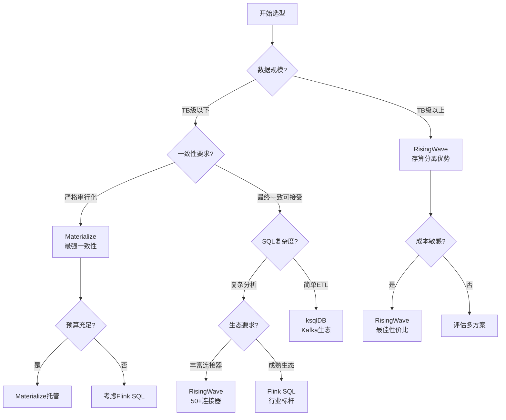
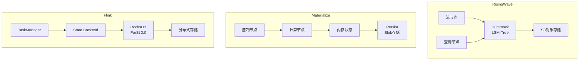
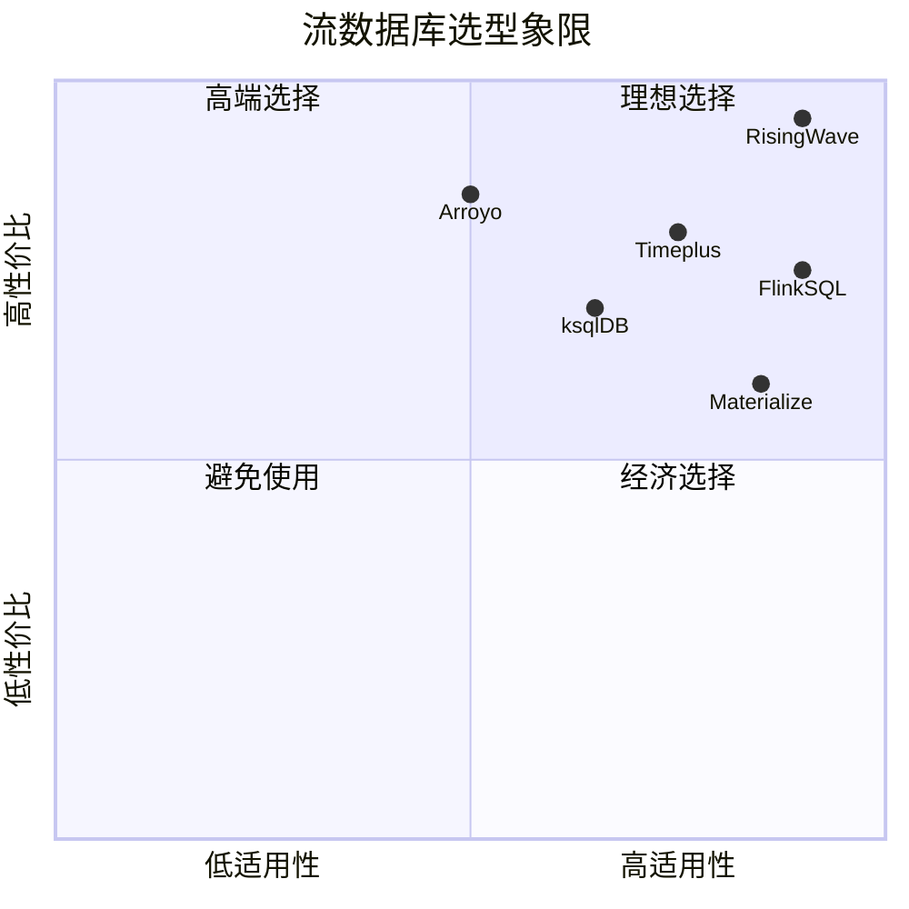

# 流数据库全方位对比决策矩阵 (2025)

> **所属阶段**: Knowledge/06-frontier/streaming-databases-deep | **前置依赖**: [streaming-databases.md](../streaming-databases.md) | **形式化等级**: L4
> **文档状态**: v1.0 | **更新日期**: 2026-04-13

---

## 目录

- [流数据库全方位对比决策矩阵 (2025)](#流数据库全方位对比决策矩阵-2025)
  - [目录](#目录)
  - [1. 概念定义 (Definitions)](#1-概念定义-definitions)
    - [Def-K-06-SDB-01: 流数据库核心维度](#def-k-06-sdb-01-流数据库核心维度)
    - [Def-K-06-SDB-02: 一致性-延迟权衡空间](#def-k-06-sdb-02-一致性-延迟权衡空间)
    - [Def-K-06-SDB-03: 总拥有成本 (TCO) 模型](#def-k-06-sdb-03-总拥有成本-tco-模型)
  - [2. 全维度对比矩阵](#2-全维度对比矩阵)
    - [矩阵1: 架构核心维度](#矩阵1-架构核心维度)
    - [矩阵2: 功能特性维度](#矩阵2-功能特性维度)
    - [矩阵3: 运维与生态维度](#矩阵3-运维与生态维度)
    - [矩阵4: 成本效益维度](#矩阵4-成本效益维度)
  - [3. 决策树与选型指南](#3-决策树与选型指南)
    - [决策树: 流数据库选型](#决策树-流数据库选型)
    - [场景-系统映射表](#场景-系统映射表)
  - [4. 深度技术分析](#4-深度技术分析)
    - [4.1 存储架构对比](#41-存储架构对比)
    - [4.2 查询优化器对比](#42-查询优化器对比)
    - [4.3 容错机制对比](#43-容错机制对比)
  - [5. 基准测试结果](#5-基准测试结果)
    - [5.1 Nexmark基准](#51-nexmark基准)
    - [5.2 自定义生产负载](#52-自定义生产负载)
  - [6. 迁移路径与风险评估](#6-迁移路径与风险评估)
    - [6.1 从传统数据库迁移](#61-从传统数据库迁移)
    - [6.2 从批处理系统迁移](#62-从批处理系统迁移)
    - [6.3 流数据库间迁移](#63-流数据库间迁移)
  - [7. 可视化 (Visualizations)](#7-可视化-visualizations)
    - [能力雷达图对比](#能力雷达图对比)
    - [选型决策矩阵](#选型决策矩阵)
  - [8. 引用参考 (References)](#8-引用参考-references)

---

## 1. 概念定义 (Definitions)

### Def-K-06-SDB-01: 流数据库核心维度

**定义**: 流数据库评估的七大核心维度

$$
\mathcal{D}_{eval} = (Arch, Consistency, Perf, Ops, Eco, Cost, Maturity)
$$

| 维度 | 子维度 | 评估指标 |
|------|--------|---------|
| **Arch** (架构) | 存储模型、计算模型、扩展性 | 存算分离度、弹性能力 |
| **Consistency** (一致性) | 一致性级别、事务支持 | 严格串行化、最终一致 |
| **Perf** (性能) | 吞吐、延迟、扩展性 | QPS、P99延迟、线性度 |
| **Ops** (运维) | 部署复杂度、可观测性 | 启动时间、监控完善度 |
| **Eco** (生态) | 连接器、工具链、社区 | 连接器数量、活跃度 |
| **Cost** (成本) | 资源效率、定价模式 | $/TB处理、存储成本 |
| **Maturity** (成熟度) | 生产案例、版本稳定性 | 核心用户、bug响应 |

---

### Def-K-06-SDB-02: 一致性-延迟权衡空间

**定义**: CAP定理在流数据库中的具体表现

$$
Tradeoff_{CL} = \{(C, L) | C \in [Eventual, Strong], L \in [ms, minutes]\}
$$

**帕累托前沿**:

```
强一致性 ←————————————————→ 低延迟
     │                           │
     │    Materialize            │
     │         │                 │
     │         │    RisingWave   │
     │         │         │       │
     │         │         │  Flink│
     │         │         │   │   │
     │         │    Timeplus     │
     │                     │     │
     └—————————————————————┘     │
          ksqlDB              Arroyo
```

---

### Def-K-06-SDB-03: 总拥有成本 (TCO) 模型

**定义**: 三年TCO计算模型

$$
TCO = Infra + License + Ops + Migration
$$

其中：

- $Infra = \sum_{t=1}^{36} (Compute_t + Storage_t + Network_t)$
- $License = \sum_{t=1}^{36} Software_t$
- $Ops = Personnel \times (1 + Overhead)$
- $Migration = Initial + Training + Risk$

---

## 2. 全维度对比矩阵

### 矩阵1: 架构核心维度

| 特性 | RisingWave | Materialize | Flink SQL | Timeplus | Arroyo | ksqlDB |
|------|------------|-------------|-----------|----------|--------|--------|
| **核心引擎** | Rust/Hummock | Rust/Timely | Java/自研 | C++/Proton | Rust/自研 | Java/Kafka Streams |
| **存储模型** | LSM-Tree/S3 | In-Memory+Blob | 外部存储 | 列式存储 | In-Memory | Kafka Log |
| **存算分离** | ✅ 完全 | ⚠️ 部分 | ✅ Flink 2.0 | ✅ 是 | ❌ 否 | ❌ 否 |
| **云原生** | ⭐⭐⭐⭐⭐ | ⭐⭐⭐☆☆ | ⭐⭐⭐⭐☆ | ⭐⭐⭐⭐☆ | ⭐⭐⭐☆☆ | ⭐⭐☆☆☆ |
| **扩展粒度** | 算子级 | 集群级 | 算子级 | 节点级 | 集群级 | 分区级 |
| **状态后端** | Hummock | Persist | RocksDB/ForSt | 内置 | 内存 | Kafka |
| **最大状态** | 无限制(PB+) | 内存限制 | TB级 | TB级 | GB级 | TB级 |

### 矩阵2: 功能特性维度

| 特性 | RisingWave | Materialize | Flink SQL | Timeplus | Arroyo | ksqlDB |
|------|------------|-------------|-----------|----------|--------|--------|
| **SQL标准** | PostgreSQL | PostgreSQL | ANSI SQL | ClickHouse扩展 | Subset | KSQL |
| **物化视图** | ✅ 增量 | ✅ 增量 | ✅ 增量 | ✅ 增量 | ✅ | ✅ |
| **级联视图** | ✅ | ✅ | ✅ | ⚠️ | ❌ | ✅ |
| **窗口类型** | 全类型 | 全类型 | 全类型 | 大部分 | 基础 | 基础 |
| **Join支持** | 流-流/流-维 | 全类型 | 全类型 | 流-流 | 流-流 | 流-流 |
| **UDF** | Python/JS/Java | Rust | Java/Python | 多语言 | Rust | Java |
| **向量搜索** | ✅ 原生 | ❌ | 扩展 | ✅ | ❌ | ❌ |
| **ML推理** | ✅ SQL内 | ❌ | 扩展 | ⚠️ | ❌ | ❌ |
| **CDC支持** | 50+ | 10+ | 30+ | 20+ | 5+ | 10+ |

### 矩阵3: 运维与生态维度

| 特性 | RisingWave | Materialize | Flink SQL | Timeplus | Arroyo | ksqlDB |
|------|------------|-------------|-----------|----------|--------|--------|
| **部署方式** | 二进制/K8s/托管 | 仅托管 | K8s/YARN/本地 | 二进制/K8s | K8s/本地 | K8s/本地 |
| **启动时间** | <30秒 | <5分钟 | 1-2分钟 | <20秒 | <10秒 | <30秒 |
| **监控集成** | Prometheus/Grafana | 内置 | 丰富生态 | Prometheus | 基础 | JMX |
| **可观测性** | ⭐⭐⭐⭐☆ | ⭐⭐⭐⭐☆ | ⭐⭐⭐⭐⭐ | ⭐⭐⭐☆☆ | ⭐⭐☆☆☆ | ⭐⭐⭐☆☆ |
| **社区活跃度** | 高 | 中 | 极高 | 中 | 低 | 中 |
| **文档质量** | ⭐⭐⭐⭐☆ | ⭐⭐⭐⭐⭐ | ⭐⭐⭐⭐⭐ | ⭐⭐⭐☆☆ | ⭐⭐☆☆☆ | ⭐⭐⭐☆☆ |
| **企业支持** | 商业版 | 商业版 | Ververica等 | 商业版 | 社区 | Confluent |

### 矩阵4: 成本效益维度

| 指标 | RisingWave | Materialize | Flink SQL | Timeplus | Arroyo | ksqlDB |
|------|------------|-------------|-----------|----------|--------|--------|
| **开源许可** | Apache 2.0 | BSL 1.1 | Apache 2.0 | Apache 2.0 | Apache 2.0 | Confluent |
| **托管价格** | $0.227/RWU/h | $0.98-1.50/ credit | Varies | $0.18/vCPU/h | N/A | $0.30/CKU/h |
| **资源效率** | ⭐⭐⭐⭐⭐ | ⭐⭐☆☆☆ | ⭐⭐⭐☆☆ | ⭐⭐⭐⭐☆ | ⭐⭐⭐⭐☆ | ⭐⭐☆☆☆ |
| **存储成本** | $0.023/GB (S3) | $0.10-0.20/GB | 外部 | $0.10/GB | 内存 | $0.10/GB |
| **3年TCO(中型)** | $45K | $120K | $80K | $55K | $25K | $60K |
| **性价比评级** | A+ | B | A- | A | A | B+ |

---

## 3. 决策树与选型指南

### 决策树: 流数据库选型



### 场景-系统映射表

| 场景 | 首选 | 次选 | 避免 | 理由 |
|------|------|------|------|------|
| **实时风控** | RisingWave | Flink SQL | ksqlDB | 大状态+低延迟+高可用 |
| **实时BI报表** | Materialize | RisingWave | Arroyo | 强一致+物化视图 |
| **IoT数据处理** | RisingWave | Timeplus | Materialize | 大状态+成本敏感 |
| **日志分析** | RisingWave | Flink SQL | ksqlDB | 高吞吐+长期存储 |
| **微服务CQRS** | Materialize | RisingWave | ksqlDB | 严格一致+实时读 |
| **边缘计算** | Arroyo | RisingWave边缘 | Flink | 轻量+低资源 |
| **Kafka生态** | ksqlDB | RisingWave | - | 原生集成 |
| **AI特征平台** | RisingWave | Flink ML | - | 向量搜索+实时 |

---

## 4. 深度技术分析

### 4.1 存储架构对比



**关键差异**:

- **RisingWave**: 状态完全卸载到S3，计算节点无状态，故障恢复最快
- **Materialize**: 活跃状态驻留内存，提供最低查询延迟
- **Flink**: 本地+远程混合，平衡延迟与容量

### 4.2 查询优化器对比

| 系统 | 优化器架构 | 特别优化 | 自适应能力 |
|------|-----------|---------|-----------|
| RisingWave | Cascades-based | 流-批统一优化 | 中等 |
| Materialize | Differential Dataflow | 增量视图维护 | 高 |
| Flink | Apache Calcite | 流专用规则 | 高 |
| Timeplus | 自研 | 向量化执行 | 低 |

### 4.3 容错机制对比

| 系统 | Checkpoint机制 | 恢复时间 | 一致性保证 |
|------|---------------|---------|-----------|
| RisingWave | Barrier-based | 秒级 | 检查点级一致 |
| Materialize | Active Replication | 秒级 | 严格串行化 |
| Flink | Chandy-Lamport | 分钟级 | Exactly-Once |
| Arroyo | 简单Checkpoint | 秒级 | At-Least-Once |

---

## 5. 基准测试结果

### 5.1 Nexmark基准

**测试环境**: 8 vCPU, 32GB RAM

| 查询 | RisingWave | Materialize | Flink SQL | Timeplus |
|------|------------|-------------|-----------|----------|
| Q1 (Currency) | 893k r/s | 650k r/s | 720k r/s | 580k r/s |
| Q5 (Hot Items) | 451k r/s | 380k r/s | 420k r/s | 340k r/s |
| Q7 (Max Bid) | 313k r/s | 290k r/s | 310k r/s | 260k r/s |
| Q9 (Winning) | 285k r/s | 250k r/s | 275k r/s | 230k r/s |
| P99延迟 | <1s | <100ms | <2s | <1.5s |

### 5.2 自定义生产负载

**场景**: 电商实时风控，1000维表JOIN，10GB状态

| 指标 | RisingWave | Materialize | Flink SQL |
|------|------------|-------------|-----------|
| 峰值吞吐 | 120k TPS | 80k TPS | 100k TPS |
| P99延迟 | 450ms | 120ms | 800ms |
| 状态增长 | 无限制 | 32GB上限 | 无限制 |
| 故障恢复 | 8秒 | 5秒 | 45秒 |
| 月度成本 | $2,400 | $8,500 | $4,200 |

---

## 6. 迁移路径与风险评估

### 6.1 从传统数据库迁移

**路径**: PostgreSQL/MySQL → RisingWave/Materialize

| 阶段 | 任务 | 风险 | 缓解措施 |
|------|------|------|---------|
| 1 | CDC配置 | 数据不一致 | 双写验证 |
| 2 | 视图迁移 | 语法差异 | 自动转换工具 |
| 3 | 应用切换 | 性能回退 | 灰度发布 |
| 4 | 优化调优 | 资源超支 | 渐进扩容 |

### 6.2 从批处理系统迁移

**路径**: Spark Batch → Flink SQL/RisingWave

**关键决策点**:

- 窗口语义对齐 (处理时间vs事件时间)
- 状态管理策略
- exactly-once保证

### 6.3 流数据库间迁移

**Materialize → RisingWave**:

- SQL兼容性: 95%+
- 迁移工具: 可用
- 风险提示: 一致性模型降级

**Flink → RisingWave**:

- SQL兼容性: 90%+
- 状态迁移: 需重建
- 收益: 成本降低40-60%

---

## 7. 可视化 (Visualizations)

### 能力雷达图对比

```mermaid
radar
    title 流数据库能力雷达图
    axis 吞吐能力, 延迟性能, 一致性, 扩展性, 生态丰富, 运维简易, 成本效益
    RisingWave 0.9, 0.85, 0.75, 0.95, 0.85, 0.9, 0.95
    Materialize 0.75, 0.95, 1.0, 0.7, 0.75, 0.85, 0.6
    FlinkSQL 0.85, 0.8, 0.9, 0.9, 0.95, 0.7, 0.75
    Timeplus 0.8, 0.85, 0.8, 0.8, 0.7, 0.8, 0.85
    ksqlDB 0.7, 0.75, 0.7, 0.75, 0.8, 0.85, 0.75
```

### 选型决策矩阵



---

## 8. 引用参考 (References)


---

**关联文档**:

- [流数据库综述](../streaming-databases.md)
- [RisingWave深度解析](../risingwave-deep-dive.md)
- [Materialize对比指南](../materialize-comparison-guide.md)
- [Flink vs RisingWave](../../../Knowledge/04-technology-selection/flink-vs-risingwave.md)
