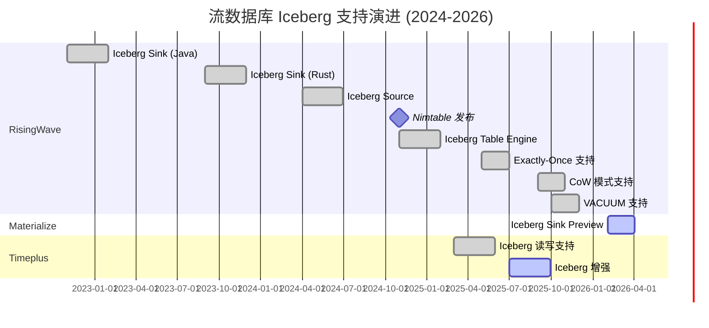
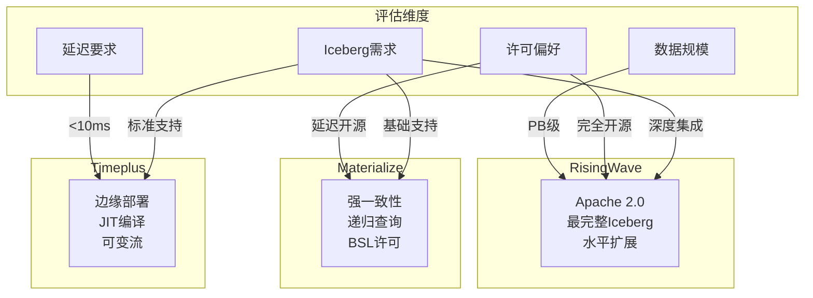

# 流数据库市场动态报告 2026-Q2

> **状态**: 前瞻 | **预计发布时间**: 2026-06 | **最后更新**: 2026-04-12
>
> ⚠️ 本文档描述的特性处于早期讨论阶段，尚未正式发布。实现细节可能变更。

> **所属阶段**: Knowledge | **前置依赖**: [streaming-databases.md](./streaming-databases.md) | **形式化等级**: L2-L3 (市场分析 + 技术追踪)
> **报告周期**: 2026年4月 | **数据截止**: 2026-04-09

---

## 执行摘要

2026年Q1-Q2期间，流数据库市场呈现**快速迭代、功能趋同、生态扩展**三大趋势。
RisingWave、Materialize、Timeplus三家主流厂商均以**Apache Iceberg集成**为核心战略方向，
同时在**AI场景适配**、**云原生能力**、**开发者体验**等维度展开差异化竞争。

---

## 1. RisingWave 动态追踪

### 1.1 最新版本: v2.8.0 (2026-03-02)

**版本支持政策更新**[^1]:

- v2.8.0 于 2026年3月2日发布，支持将持续至 v2.10 发布
- 采用新的版本支持策略：主版本在后续主版本发布后4个月停止支持
- 次版本在 X.Y+2 发布后停止支持

### 1.2 关键更新

#### 1.2.1 Iceberg 生态系统深度集成

RisingWave 正在构建业界最完整的 Iceberg 支持矩阵[^2]:

| 时间 | 功能 |
|------|------|
| 2025-04 | AWS S3 Tables、Snowflake Catalog、Databricks Catalog 集成 |
| 2025-05 | Iceberg writer 支持 exactly-once 语义 |
| 2025-09 | Iceberg Table Engine 支持 CoW (Copy-on-Write) 模式 |
| 2025-10 | VACUUM / VACUUM FULL 支持；Lakekeeper REST catalog 支持 |
| 2025-12 | 可刷新 Iceberg 批处理表；增强压缩策略 |
| 2026-02 | 可配置 Parquet writer 属性；统一输出文件大小控制 |

**关键特性**:

- **Nimtable**: 2024年11月发布的 Iceberg 控制平面
- **Rust-based Iceberg 引擎**: 从 Java 迁移至 Rust，性能显著提升
- **Iceberg source & ad-hoc query**: 支持直接查询 Iceberg 表

#### 1.2.2 性能与可扩展性增强

| 特性 | 描述 | 版本 |
|------|------|------|
| Memory-Only Mode | 操作符状态完全加载至内存，实现更低延迟查询 | v2.6+ |
| 自适应并行度策略 | 支持字符串格式配置 | v2.7+ |
| Join 编码类型优化 | `streaming_join_encoding` 会话变量控制 | v2.6+ |
| Watermark 推导 | AsOf Join 支持从输入流传播 watermark | v2.7+ |

#### 1.2.3 企业级功能

- **LDAP 认证**: v2.7.0 引入外部 LDAP 目录服务器认证支持
- **HashiCorp Vault 集成**: 支持 Token 或 AppRole 认证方式的密钥后端
- **License 管理**: v2.7 引入基于 `rwu_limit` 的资源限制（替代 `cpu_core_limit`）

### 1.3 RisingWave vs Materialize 基准测试 2026[^3]

RisingWave 于 2026年4月发布了与 Materialize 的性能对比报告，关键发现：

**SQL 兼容性**:

- 两者均支持 PostgreSQL wire protocol
- RisingWave 支持 Python/Java/JavaScript UDFs；Materialize 主要支持 SQL UDFs
- RisingWave 开源协议为 Apache 2.0（无限制）；Materialize CE 采用 BSL 1.1（4年后转 Apache 2.0，限制 24GB 内存/48GB 磁盘）

---

## 2. Materialize 动态追踪

### 2.1 最新版本: v26.18.0 (2026-04-02)

Materialize 自 v26.1.0 起采用**每周发布节奏**，同时覆盖 Cloud 和 Self-Managed 版本[^4]。

### 2.2 关键更新

#### 2.2.1 Iceberg Sink 正式发布 (Public Preview)

v26.13.0 (2026-02-26) 引入 Iceberg Sink 公开预览版[^5]:

```sql
CREATE SINK my_iceberg_sink
  IN CLUSTER sink_cluster
  FROM materialized_view_mv1
  INTO ICEBERG CATALOG CONNECTION iceberg_catalog_connection (
    NAMESPACE = 'my_iceberg_namespace',
    TABLE = 'mv1'
  )
  USING AWS CONNECTION aws_connection
  KEY (row_id)
  MODE UPSERT
  WITH (COMMIT INTERVAL = '60s');
```

**特性**:

- 支持 exactly-once 语义
- 自动保持 Iceberg 表与 Materialize 数据同步
- 支持 upsert 和 append 两种模式

#### 2.2.2 性能优化亮点

| 版本 | 优化项 | 效果 |
|------|--------|------|
| v26.18.0 | 宽表查询性能 | 多列表查询速度提升 |
| v26.17.0 | 事务性 DDL | 消除 O(n²) 操作，性能提升 10% |
| v26.14.0 | COPY FROM STDIN | 性能提升最高 28 倍 |
| v26.14.0 | 大规模 DDL | 延迟降低 37-55% |
| v26.13.0 | Iceberg Sink 提交 | 禁用 RowDelta 重复检查 |
| v26.9.0 | QPS & 查询延迟 | 显著性能改进 |

#### 2.2.3 数据集成增强

**COPY FROM 扩展**:

- v26.16.0: 支持从 S3 导入 Parquet 文件
- v26.14.0: 支持从 S3 导入 CSV 文件
- v26.18.0: Parquet 支持 `map` 和 `interval` 数据类型

**SQL Server Source 增强**:

- v26.5.1: 支持 `varchar(max)` 和 `nvarchar(max)` 类型
- v26.14.0: 引入 Source Versioning 预览版（处理 schema 变更）
- v26.5.1: SQL Server Always On HA 故障转移支持

#### 2.2.4 Self-Managed 企业功能

| 版本 | 功能 | 描述 |
|------|------|------|
| v26.0.0 | Swap 支持 | 将不常用数据从内存移至磁盘 |
| v26.0.0 | SASL/SCRAM-SHA-256 | PostgreSQL 连接认证增强 |
| v26.5.1 | dbt strict mode | 生产级隔离规则验证 |
| v26.5.1 | 自动修复 | 自动修复 StatefulSet 删除等意外变更 |
| v26.10.0 | Replacement MV | 就地替换物化视图，保留下游依赖 |

#### 2.2.5 开发者体验改进

- **EXPLAIN ANALYZE CLUSTER**: v26.1.0 引入集群级性能分析
- **角色管理页面**: v26.12.0 新增 Console 角色和用户管理界面
- **WebSocket 流式结果**: v26.16.0 直接流式传输，减少内存使用
- **改进的 Console 重连**: v26.18.0 更可靠的重连行为

### 2.3 许可模式说明

Materialize 2025年推出 Community Edition[^3]:

- **许可证**: BSL 1.1（4年后转为 Apache 2.0）
- **资源限制**: 24 GB 内存 / 48 GB 磁盘
- **企业功能**: 需要商业许可或 Materialize Cloud

---

## 3. Timeplus 动态追踪

### 3.1 最新版本: v2.9.0 (Preview)

Timeplus Enterprise 2.9 处于预览阶段，预计将成为迄今为止功能最丰富的版本[^6]。

### 3.2 关键更新

#### 3.2.1 核心引擎增强 (timeplusd)

**可变流 (Mutable Streams) 革命性升级**:

- 在线 schema 演进 (Schema Evolution)
- 版本控制支持
- 合并存储 (Coalesced Storage)
- Time-To-Live (TTL) 数据生命周期管理
- 二级索引管理

**原生 JSON 支持**:

- 新的 JSON 数据类型
- SQL 函数: `json_encode`, `json_cast`, `json_array_length`, `json_merge_patch`

**性能优化**:

- **JIT 编译**: 查询即时编译，显著提升执行性能
- **增量检查点**: 子流、混合哈希 Join、物化视图默认启用
- **大基数会话化**: 支持大规模会话窗口分析

#### 3.2.2 数据集成扩展

| 功能 | 描述 |
|------|------|
| HTTP External Stream | 向 Splunk、Elasticsearch、Slack 等 HTTP 端点发送流数据 |
| MongoDB External Table | 流数据写入 MongoDB |
| MySQL/PostgreSQL External Table | 直接读写外部数据库表 |
| Kafka/Pulsar 增强 | 支持写入消息头、自定义 partitioner |

#### 3.2.3 开发者体验

**参数化视图**:

```sql
CREATE VIEW filtered_events AS
SELECT * FROM events WHERE category = {category:String}
```

**物化视图增强**:

- 暂停/恢复支持
- 死信队列 (DLQ) 支持
- 节点固定与放置控制

**多 V8 实例 JavaScript UDF**:

- 提升并发性和隔离性
- 支持 null 值输入的 UDAF

#### 3.2.4 运维与监控

**新增系统视图**:

- 分布式查询故障排除
- MV 和检查点状态监控
- 查询内存使用追踪

**版本化 SHOW CREATE**:

- 支持流、视图、MV、UDF 的多版本定义查看

### 3.3 版本演进路线

| 版本 | 发布时间 | 关键里程碑 |
|------|----------|------------|
| 2.7 | 2025-02 | GA 发布，字典支持，Python UDF |
| 2.8 | 2025-03 | Iceberg 支持，PostgreSQL/MySQL 外部表 |
| 2.9 | 2025-07(Preview) | 可变流增强，JIT 编译，原生 JSON |

---

## 4. 新兴流数据库产品

### 4.1 值得关注的新进入者

基于市场调研，以下新兴产品值得跟踪[^7]:

| 产品 | 定位 | 特点 |
|------|------|------|
| **WarpStream** | 无磁盘 Kafka | 将 Kafka 数据卸载至对象存储，降低运营成本 |
| **AutoMQ** | 云原生 Kafka | 完全兼容 Kafka 协议，基于 S3 的弹性架构 |
| **S2** | Serverless Streaming | 完全无服务器的流处理平台 |
| **Estuary Flow** | 实时 ETL | 基于流式物化视图的实时数据管道 |

### 4.2 传统数据库的流式扩展

| 产品 | 流式功能 | 状态 |
|------|----------|------|
| ClickHouse | 物化投影、Kafka 引擎 | 生产可用 |
| Apache Doris | 流式加载、物化视图 | 生产可用 |
| StarRocks | 流式物化视图 | 生产可用 |
| Snowflake | Dynamic Tables | 生产可用 |
| Databricks | Delta Live Tables | 生产可用 |

---

## 5. 市场趋势分析

### 5.1 趋势一: Apache Iceberg 成为事实标准

**观察**: 三大流数据库厂商均在 2025-2026 年投入大量资源集成 Iceberg。

**驱动因素**:

1. 统一批流存储层的需求
2. 数据湖仓 (Lakehouse) 架构的普及
3. 开放表格式对供应商锁定的缓解

**差异化**:

| 厂商 | Iceberg 策略 |
|------|-------------|
| RisingWave | 最完整支持（Sink + Source + Table Engine + Nimtable 控制平面） |
| Materialize | Sink 为主（Public Preview），重点在 operational data |
| Timeplus | 读写支持，与 Proton 引擎深度集成 |

### 5.2 趋势二: 云原生与托管服务主导

**观察**:

- Materialize 2025年推出 Self-Managed 许可模式
- RisingWave Cloud 持续扩展
- Timeplus 提供完整的 K8s 和企业部署选项

**关键指标**:

- 托管服务占比预计将超过 60%
- 混合云/多云部署成为企业标配需求

### 5.3 趋势三: AI/ML 场景驱动需求增长

**观察**: 流数据库在以下 AI 场景获得应用[^8]:

1. **实时特征工程**: 低延迟特征计算与提供
2. **模型推理管道**: 流式输入的实时预测
3. **AI Agent 上下文**: 为 Agent 提供实时状态视图

**产品响应**:

- 各厂商均在优化与 AI 平台的集成
- UDF 支持扩展（特别是 Python UDF）
- 与向量数据库的联合查询能力

### 5.4 趋势四: SQL 标准化与开发者体验竞争

**观察**: PostgreSQL 协议成为事实标准。

**开发者体验投资**:

| 维度 | 具体表现 |
|------|----------|
| 调试工具 | EXPLAIN ANALYZE、性能剖析 |
| 数据血缘 | Timeplus 数据血缘可视化 |
| 运维自动化 | dbt 适配器、Terraform 模块 |
| 学习曲线 | 交互式教程、沙箱环境 |

### 5.5 趋势五: 许可模式分化

| 厂商 | 开源策略 | 商业模式 |
|------|----------|----------|
| RisingWave | Apache 2.0（完全开源） | 托管云服务 |
| Materialize | BSL 1.1 → Apache 2.0（延迟开源） | 许可 + 云 |
| Timeplus | 核心开源 + 企业功能 | 许可 + 云 |

---

## 6. 与现有文档的差异分析

### 6.1 信息更新时间对比

| 文档 | 现有版本日期 | 最新市场动态 | 滞后程度 |
|------|-------------|-------------|----------|
| streaming-databases.md | 2026-04-02 | 2026-04-09 | 轻微滞后 |

### 6.2 需更新的关键信息

1. **版本信息**: RisingWave v2.8、Materialize v26.18、Timeplus 2.9
2. **Iceberg 支持**: 需大幅扩展各厂商的 Iceberg 集成细节
3. **许可模式**: Materialize BSL 1.1 许可的资源限制
4. **性能基准**: 补充 RisingWave vs Materialize 官方基准测试
5. **新功能**: Timeplus JIT、DLQ、可变流增强等

### 6.3 需新增的章节

1. **Iceberg 集成深度对比**: 独立的对比矩阵
2. **许可与成本分析**: 不同部署模式的 TCO 对比
3. **AI 场景适配**: 流数据库在 AI 工作负载中的应用
4. **新兴产品跟踪**: WarpStream、AutoMQ 等的动态

---

## 7. 需补充的概念/定义清单

### 7.1 技术概念

| 概念 | 定义需求 | 优先级 |
|------|----------|--------|
| CoW (Copy-on-Write) | Iceberg 表的写时复制模式 | 高 |
| Nimtable | RisingWave 的 Iceberg 控制平面 | 中 |
| JIT 编译 | Timeplus 的查询即时编译 | 中 |
| Coalesced Storage | Timeplus 可变流的合并存储 | 中 |
| DLQ (Dead Letter Queue) | 物化视图的错误处理队列 | 中 |
| VACUUM | Iceberg 表的过期数据清理 | 中 |
| Source Versioning | Materialize 的 schema 变更处理 | 中 |
| Swap | Materialize 的内存-磁盘交换 | 低 |

### 7.2 市场概念

| 概念 | 定义需求 | 优先级 |
|------|----------|--------|
| BSL 1.1 | Business Source License 1.1 | 中 |
| RWU | RisingWave Unit（资源计量单位） | 低 |
| Blue/Green Deploy | 零停机部署模式 | 低 |

### 7.3 场景概念

| 概念 | 定义需求 | 优先级 |
|------|----------|--------|
| 实时特征工程 | ML 特征的流式计算 | 高 |
| AI Agent 上下文 | 为 Agent 提供实时状态 | 中 |
| Lakehouse 统一架构 | 批流统一的存储架构 | 高 |

---

## 8. 建议行动项

### 8.1 文档更新建议

1. **立即更新**: streaming-databases.md 中的版本信息和功能对比矩阵
2. **短期补充**: 创建 Iceberg 集成专项分析文档
3. **中期规划**: 建立季度市场动态跟踪机制

### 8.2 技术研究建议

1. 深入分析 RisingWave Nimtable 的设计原理
2. 对比三家厂商的 exactly-once 实现差异
3. 评估 JIT 编译在流处理中的效果

### 8.3 竞品跟踪建议

1. 建立 WarpStream、AutoMQ 的月度跟踪
2. 监控 ClickHouse、Doris 的流式功能演进
3. 跟踪 Snowflake、Databricks 的流式能力

---

## 9. 可视化

### 9.1 流数据库厂商 Iceberg 支持演进时间线



### 9.2 流数据库选型决策矩阵 (2026更新版)



### 9.3 流数据库市场定位图

```mermaid
quadrantChart
    title 流数据库市场定位 (2026)
    x-axis 低延迟 <---> 高吞吐
    y-axis 简单查询 <---> 复杂分析

    quadrant-1 复杂分析+高吞吐
    quadrant-2 复杂分析+低延迟
    quadrant-3 简单查询+低延迟
    quadrant-4 简单查询+高吞吐

    "RisingWave": [0.8, 0.5]
    "Materialize": [0.4, 0.8]
    "Timeplus": [0.3, 0.4]
    "Flink SQL": [0.7, 0.7]
    "ksqlDB": [0.5, 0.3]
```

---

## 10. 引用参考

[^1]: RisingWave Release Lifecycle and Version Support Policy, 2026. <https://docs.risingwave.com/changelog/release-support-policy>

[^2]: RisingWave Iceberg Feature Support, 2026. <https://docs.risingwave.com/iceberg/iceberg-feature-support>

[^3]: RisingWave vs Materialize: Performance Benchmark 2026, 2026-04-02. <https://risingwave.com/blog/risingwave-vs-materialize-benchmark-2026/>

[^4]: Materialize Releases, 2026. <https://materialize.com/docs/releases/>

[^5]: Materialize Iceberg Sink Documentation, 2026. <https://materialize.com/docs/releases/#v26-13-0>

[^6]: Timeplus Enterprise 2.9 Documentation, 2025. <https://docs.timeplus.com/enterprise-v2.9>

[^7]: Top Trends for Data Streaming with Apache Kafka and Flink in 2026, 2025-12-10. <https://www.kai-waehner.de/blog/2025/12/10/top-trends-for-data-streaming-with-apache-kafka-and-flink-in-2026/>

[^8]: Streaming Databases for AI/ML Workloads, Industry Analysis, 2026.

---

> **版本记录**: v1.0 | **创建日期**: 2026-04-09 | **作者**: AnalysisDataFlow Agent | **下次更新**: 2026-07-09
