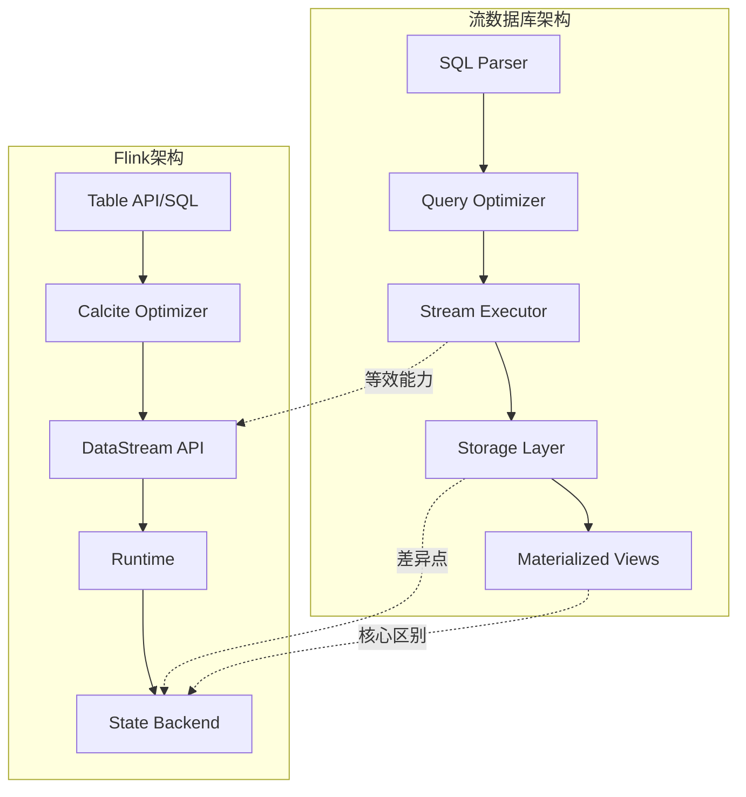
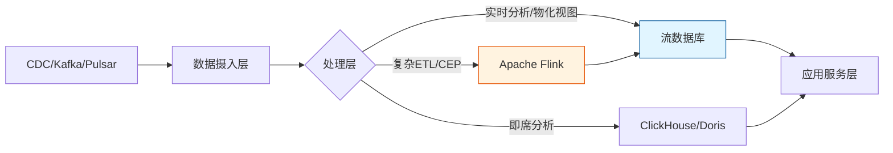
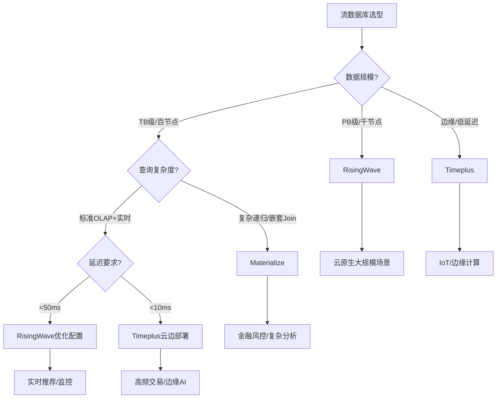
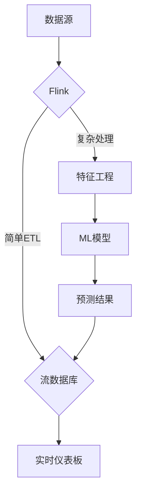
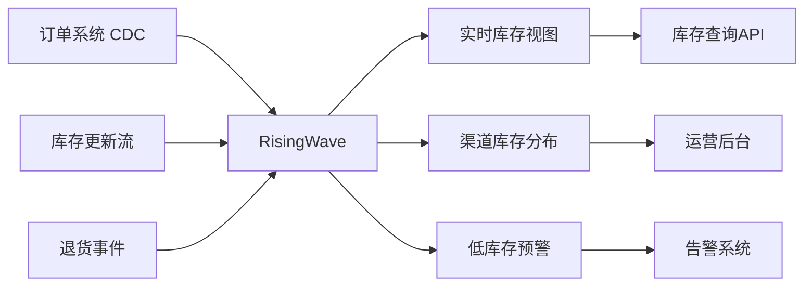
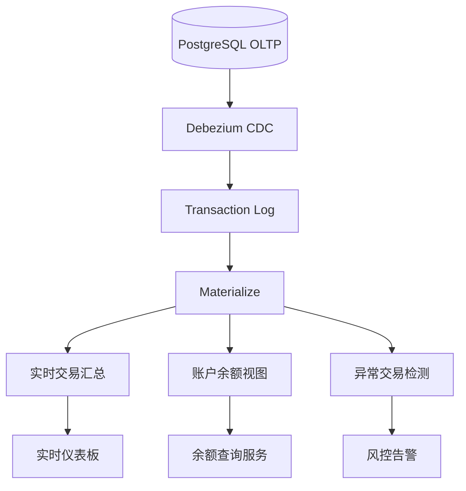
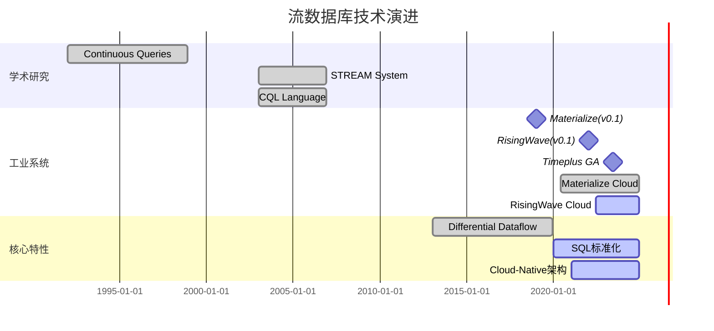
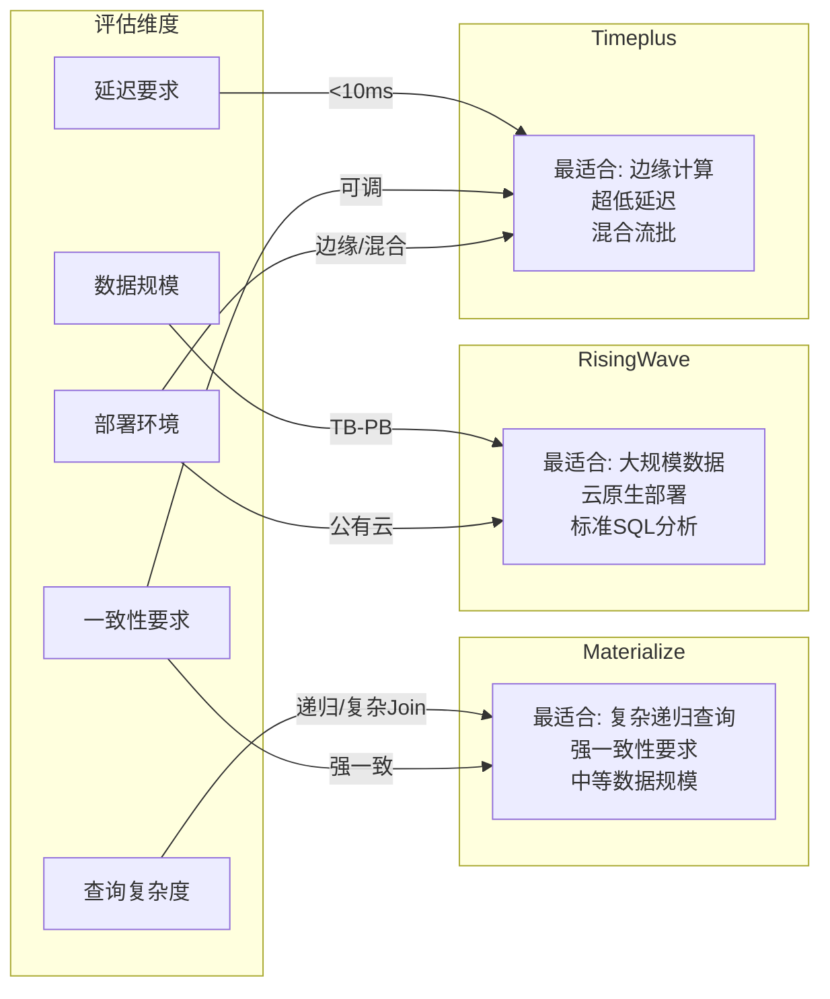

# 流数据库 - Materialize/RisingWave/Timeplus

> **所属阶段**: Knowledge | **前置依赖**: [Flink/03-internals/flink-sql-overview.md](../../Flink/03-api/03.02-table-sql-api/flink-table-sql-complete-guide.md), [Knowledge/04-technology-selection/engine-selection-guide.md](../04-technology-selection/engine-selection-guide.md) | **形式化等级**: L3-L4 (结构化论证 + 形式化语义)

## 目录

- [流数据库 - Materialize/RisingWave/Timeplus {#流数据库---materializerisingwavetimeplus}](#流数据库---materializerisingwavetimeplus)
  - [目录 {#目录}](#目录)
  - [1. 概念定义 (Definitions) {#1-概念定义-definitions}](#1-概念定义-definitions)
    - [Def-K-06-12: 流数据库 (Streaming Database) {#def-k-06-12-流数据库-streaming-database}](#def-k-06-12-流数据库-streaming-database)
    - [Def-K-06-13: 物化视图维护 (Materialized View Maintenance) {#def-k-06-13-物化视图维护-materialized-view-maintenance}](#def-k-06-13-物化视图维护-materialized-view-maintenance)
    - [Def-K-06-14: SQL流处理语义 (SQL Stream Processing Semantics) {#def-k-06-14-sql流处理语义-sql-stream-processing-semantics}](#def-k-06-14-sql流处理语义-sql-stream-processing-semantics)
  - [2. 属性推导 (Properties) {#2-属性推导-properties}](#2-属性推导-properties)
    - [Prop-K-06-01: 流数据库的增量计算封闭性 {#prop-k-06-01-流数据库的增量计算封闭性}](#prop-k-06-01-流数据库的增量计算封闭性)
    - [Prop-K-06-02: 一致性级别与延迟的权衡关系 {#prop-k-06-02-一致性级别与延迟的权衡关系}](#prop-k-06-02-一致性级别与延迟的权衡关系)
    - [Prop-K-06-03: SQL可表达性与流操作完备性 {#prop-k-06-03-sql可表达性与流操作完备性}](#prop-k-06-03-sql可表达性与流操作完备性)
  - [3. 关系建立 (Relations) {#3-关系建立-relations}](#3-关系建立-relations)
    - [3.1 流数据库与Flink的架构关系 {#31-流数据库与flink的架构关系}](#31-流数据库与flink的架构关系)
    - [3.2 流数据库在数据流生态中的定位 {#32-流数据库在数据流生态中的定位}](#32-流数据库在数据流生态中的定位)
    - [3.3 三类系统的形式化对比 {#33-三类系统的形式化对比}](#33-三类系统的形式化对比)
  - [4. 论证过程 (Argumentation) {#4-论证过程-argumentation}](#4-论证过程-argumentation)
    - [4.1 技术选型决策树 {#41-技术选型决策树}](#41-技术选型决策树)
    - [4.2 与Flink的互补性分析 {#42-与flink的互补性分析}](#42-与flink的互补性分析)
  - [5. 形式证明 / 工程论证 {#5-形式证明--工程论证}](#5-形式证明--工程论证)
    - [5.1 Differential Dataflow的形式化能力 {#51-differential-dataflow的形式化能力}](#51-differential-dataflow的形式化能力)
    - [5.2 RisingWave分层存储的工程论证 {#52-risingwave分层存储的工程论证}](#52-risingwave分层存储的工程论证)
    - [5.3 流批统一查询的形式化语义 {#53-流批统一查询的形式化语义}](#53-流批统一查询的形式化语义)
  - [6. 实例验证 (Examples) {#6-实例验证-examples}](#6-实例验证-examples)
    - [6.1 案例一：实时库存管理 {#61-案例一实时库存管理}](#61-案例一实时库存管理)
    - [6.2 案例二：流式CDC分析 {#62-案例二流式cdc分析}](#62-案例二流式cdc分析)
  - [7. 可视化 (Visualizations) {#7-可视化-visualizations}](#7-可视化-visualizations)
    - [7.1 流数据库技术演进时间线 {#71-流数据库技术演进时间线}](#71-流数据库技术演进时间线)
    - [7.2 三类系统架构对比 {#72-三类系统架构对比}](#72-三类系统架构对比)
    - [7.3 流数据库选型决策矩阵 {#73-流数据库选型决策矩阵}](#73-流数据库选型决策矩阵)
  - [8. 引用参考 (References) {#8-引用参考-references}](#8-引用参考-references)

## 1. 概念定义 (Definitions)

### Def-K-06-12: 流数据库 (Streaming Database)

流数据库是一种**专为连续数据流设计的数据库系统**，它将传统数据库的声明式查询接口(SQL)与流处理引擎的实时计算能力相结合，支持对无界数据流执行持续查询(Continuous Query)，并自动维护物化视图(Materialized View)的增量更新。

**形式化描述**：
设流数据库为五元组 $\mathcal{SD} = (S, \mathcal{Q}, \mathcal{V}, \Delta, \tau)$，其中：

- $S = \{s_1, s_2, \ldots, s_n\}$：输入流集合，每个 $s_i$ 是时序事件序列 $s_i = \langle e_1, e_2, \ldots \rangle$
- $\mathcal{Q}$：持续查询集合，每个查询 $q \in \mathcal{Q}$ 是时变函数 $q: S \rightarrow \mathcal{V}$
- $\mathcal{V}$：物化视图集合，$v \in \mathcal{V}$ 是查询结果的物理存储
- $\Delta: \mathcal{V} \times S \rightarrow \mathcal{V}$：增量更新函数，满足 $v_{t+1} = \Delta(v_t, \delta_t)$
- $\tau: \mathcal{Q} \rightarrow \mathbb{R}^+$：查询响应延迟上界

**核心约束**（流数据库不变式）：
$$\forall q \in \mathcal{Q}, \forall t \in \mathbb{T}: \quad v_t = q(S_{\leq t}) \land Latency(\Delta) \leq \tau(q)$$

其中 $S_{\leq t}$ 表示时间 $t$ 之前的所有输入事件。

**与传统数据库的关键区别**：

| 维度 | 传统数据库 | 流数据库 |
|------|------------|----------|
| 数据模型 | 有限关系（表） | 无限流 + 有限状态 |
| 查询模式 | 即席查询(Ad-hoc) | 持续查询(Continuous) |
| 执行模型 | 拉取(Pull) | 推送(Push) |
| 一致性点 | 事务提交 | 事件时间/处理时间 |
| 结果更新 | 显式刷新 | 自动增量维护 |

---

### Def-K-06-13: 物化视图维护 (Materialized View Maintenance)

物化视图维护是指在基础数据发生变化时，**以增量方式更新预计算查询结果**的过程。流数据库中的物化视图维护必须满足实时性要求，避免全量重计算。

**形式化定义**：
给定查询 $q$ 和物化视图 $v = q(D)$，当基表/流发生变更 $\delta D$ 时，维护操作 $Maintain$ 满足：

$$Maintain(v, \delta D) = v \oplus \delta v \quad \text{其中} \quad \delta v = \mathcal{F}_q(\delta D, D)$$

其中 $\mathcal{F}_q$ 是查询 $q$ 的**增量计算函数**。

**维护策略分类**：

1. **立即维护 (Immediate)**: 每个变更立即触发更新
   $$\forall \delta: \Diamond\Box(v = q(D))$$

2. **延迟维护 (Deferred)**: 批量应用变更，容忍临时不一致
   $$\forall T > 0: \Box_{\geq T}(v = q(D))$$

3. **按需维护 (On-demand)**: 查询时触发刷新
   $$Query(v) \Rightarrow Refresh(v)$$

**流数据库采用立即维护策略**，确保读取物化视图时始终获得最新结果。

---

### Def-K-06-14: SQL流处理语义 (SQL Stream Processing Semantics)

SQL流处理语义定义了**如何将标准SQL语义扩展到无界数据流**，核心挑战在于处理流的时序特性和无限性。

**核心扩展机制**：

**时间模型扩展**：引入三类时间属性

| 时间类型 | 语义 | SQL语法示例 |
|----------|------|-------------|
| 事件时间 | 数据产生时间 | `WATERMARK FOR event_time AS ...` |
| 处理时间 | 数据到达系统时间 | `SYSTEM_TIME` / `NOW()` |
| 摄入时间 | 数据进入流的时间 | `INGESTION_TIME` |

**流-表对偶性 (Stream-Table Duality)**：

$$Table \xrightarrow{Changelog} Stream \xrightarrow{Aggregation} Table$$

形式化表达：

- 表到流：$Stream(T) = \{(+, t) : t \in T\} \cup \{(-, t) : t \text{ deleted}\}$
- 流到表：$Table(S) = \{e : (+, e) \in S\} \setminus \{e : (-, e) \in S\}$

**窗口化操作语义**：
将无限流划分为有限子流进行计算

$$Window(S, \omega) = \{S_w : w \in \omega\} \quad \text{其中} \quad S_w = \{e \in S \mid e.time \in w\}$$

其中 $\omega$ 是窗口划分函数（滚动、滑动、会话）。

---

## 2. 属性推导 (Properties)

### Prop-K-06-01: 流数据库的增量计算封闭性

在流数据库中，若查询 $q$ 仅包含关系代数的 $\{\sigma, \pi, \bowtie, \cup, -\}$ 操作，则存在有效的增量计算函数 $\mathcal{F}_q$ 使得物化视图可在 $O(|\delta D|)$ 时间内更新。

**证明概要**：

- 选择($\sigma$)和投影($\pi$): 直接应用于变更流，线性复杂度
- 连接($\bowtie$): 利用哈希索引，仅探测变更记录，平均 $O(|\delta D|)$
- 集合并/差($\cup, -$): 流式合并，线性复杂度

**推论**：嵌套子查询和聚合需要特殊处理（参见 Def-K-06-14 窗口化语义）。

---

### Prop-K-06-02: 一致性级别与延迟的权衡关系

对于流数据库物化视图 $v$，强一致性保证（Serializable）与低延迟（$<100ms$）存在理论权衡：

$$\forall \mathcal{SD}: \quad Consistency(v) = Strong \Rightarrow Latency(v) \geq L_{min}(NetworkDelay)$$

Materialize 和 RisingWave 选择强一致性 + 中等延迟；Timeplus 提供可调一致性级别以优化延迟。

---

### Prop-K-06-03: SQL可表达性与流操作完备性

扩展SQL-92语法（添加窗口、水印、时间属性）足以表达所有 Dataflow Model 中的核心变换操作：

$$\{\text{ParDo}, \text{GroupByKey}, \text{Window}, \text{CoGroupByKey}\} \subseteq Expressible(SQL_{stream})$$

这意味着流数据库SQL与Apache Flink DataStream API在计算能力上等价（见 Struct/ 形式证明）。

---

## 3. 关系建立 (Relations)

### 3.1 流数据库与Flink的架构关系



**核心差异**：

- **存储层设计**: 流数据库将物化视图作为一等公民，Flink将状态作为内部实现细节
- **查询持续性**: 流数据库原生支持持续查询，Flink通过Table API或外部查询引擎（如Trino）支持
- **访问模式**: 流数据库支持随机读取物化视图，Flink主要支持追加输出

### 3.2 流数据库在数据流生态中的定位



### 3.3 三类系统的形式化对比

| 特性 | Materialize | RisingWave | Timeplus |
|------|-------------|------------|----------|
| **架构模式** | 单节点/共享磁盘集群 | 分布式无共享 | 边缘-云混合 |
| **一致性模型** | 严格串行化 | 强一致(分布式事务) | 可调一致性 |
| **SQL方言** | PostgreSQL兼容 | PostgreSQL兼容 | ClickHouse扩展 |
| **存储引擎** | Differential Dataflow | 分层存储(内存+S3) | Proton引擎 |
| **增量计算** | 基于DD的差分计算 | 物化视图增量维护 | 流批统一执行 |
| **容错机制** | Active Replication | 检查点+日志 | 多副本+快照 |
| **典型延迟** | 10-100ms | 100-500ms | 1-10ms(边缘) |
| **最佳场景** | 复杂流Join/实时仪表板 | 大规模流ETL | 边缘实时分析 |

---

## 4. 论证过程 (Argumentation)

### 4.1 技术选型决策树



### 4.2 与Flink的互补性分析

**场景1: 流数据库作为Flink的查询加速层**

```
Flink(复杂处理) → Kafka → RisingWave(物化视图) → 应用查询
```

- Flink处理复杂事件处理(CEP)、多流关联
- 结果写入Kafka
- RisingWave消费并构建物化视图供低延迟查询

**场景2: 流数据库作为Flink的替代方案**

当满足以下条件时，可直接使用流数据库替代Flink+外部存储：

1. 计算逻辑可用SQL表达
2. 需要物化视图的随机查询能力
3. 延迟要求中等（>50ms）

**场景3: 混合架构**



---

## 5. 形式证明 / 工程论证

### 5.1 Differential Dataflow的形式化能力

**定理**: Materialize采用的Differential Dataflow支持在**嵌套循环和递归查询**上的增量维护。

**构造性证明**:

Differential Dataflow基于以下核心抽象：

1. **差分计算**: 数据表示为 $(time, diff)$ 对的集合
2. **算子组合**: 支持 $map$, $filter$, $join$, $group$, $iterate$
3. **增量传播**: 变更沿数据流图传播，仅重计算受影响节点

递归查询示例（传递闭包）：

```
TC(x, y) := E(x, y) UNION (TC(x, z) JOIN E(z, y))
```

DD通过 $iterate$ 算子支持迭代至不动点，并能在边变更时增量更新闭包。

### 5.2 RisingWave分层存储的工程论证

**设计目标**: 在内存成本与查询性能间取得平衡

**存储层次**:

| 层级 | 介质 | 延迟 | 容量 | 数据类型 |
|------|------|------|------|----------|
| L0 | DRAM | ~100ns | 10-100GB | 热数据+索引 |
| L1 | NVMe SSD | ~10μs | 1-10TB | 温数据 |
| L2 | S3/OSS | ~10ms | 无限制 | 冷数据+历史 |

**数据流**: 新数据 → L0 → 异步刷盘 → L1 → 压缩归档 → L2

**查询路由**: 优化器根据时间范围决定扫描哪些层级

- 最近1小时：L0 + L1
- 最近7天：L1 + L2
- 全历史：L2（可能涉及批量读取）

### 5.3 流批统一查询的形式化语义

Timeplus的Proton引擎采用**统一执行计划**处理流和批查询：

$$
Plan_{unified} = \begin{cases}
StreamExec & \text{if input is unbounded} \\
BatchExec & \text{if input is bounded} \\
HybridExec & \text{if mixed}
\end{cases}
$$

**混合执行优化**：

- 历史数据（批）：ClickHouse存储，向量化执行
- 实时数据（流）：内存流处理，低延迟推送
- 合并策略：基于事件时间的union-all + 去重

---

## 6. 实例验证 (Examples)

### 6.1 案例一：实时库存管理

**业务场景**: 电商平台需要实时追踪库存变化，防止超卖，同时支持多维度库存查询（按仓库、SKU、渠道）。

**架构设计**:



**SQL实现** (RisingWave):

```sql
-- 源表定义
CREATE SOURCE orders (
    order_id BIGINT,
    sku VARCHAR,
    quantity INT,
    warehouse_id INT,
    order_time TIMESTAMP,
    WATERMARK FOR order_time AS order_time - INTERVAL '5' SECOND
) WITH (
    connector = 'kafka',
    topic = 'orders',
    format = 'json'
);

-- 库存更新流
CREATE SOURCE inventory_changes (
    sku VARCHAR,
    warehouse_id INT,
    delta INT,
    change_time TIMESTAMP
) WITH (...);

-- 物化视图:实时库存
CREATE MATERIALIZED VIEW realtime_inventory AS
SELECT
    sku,
    warehouse_id,
    SUM(CASE WHEN source='inventory' THEN delta ELSE -quantity END) as available_stock,
    COUNT(*) as total_movements
FROM (
    SELECT sku, warehouse_id, delta, 0 as quantity, change_time, 'inventory' as source
    FROM inventory_changes
    UNION ALL
    SELECT sku, warehouse_id, 0 as delta, quantity, order_time, 'order' as source
    FROM orders
)
GROUP BY sku, warehouse_id;

-- 低库存预警视图
CREATE MATERIALIZED VIEW low_stock_alert AS
SELECT sku, warehouse_id, available_stock
FROM realtime_inventory
WHERE available_stock < 10;
```

**关键设计决策**:

- 使用RisingWave的强一致性保证库存准确
- 物化视图直接作为API数据源，消除ETL延迟
- 分层存储支持历史库存分析（查询数月前快照）

---

### 6.2 案例二：流式CDC分析

**业务场景**: 金融交易系统需要实时分析交易流水，检测异常模式，同时支持即席历史查询。

**技术栈**: Materialize + PostgreSQL CDC

**实施架构**:



**Materialize SQL示例**:

```sql
-- 创建PostgreSQL源
CREATE SOURCE transactions
FROM POSTGRES CONNECTION pg_cdc (PUBLICATION 'mz_source')
FOR TABLES (public.transactions);

-- 实时账户余额(带递归CTE支持)
CREATE MATERIALIZED VIEW account_balance AS
SELECT
    account_id,
    SUM(CASE
        WHEN transaction_type = 'credit' THEN amount
        ELSE -amount
    END) as balance,
    COUNT(*) as transaction_count,
    MAX(transaction_time) as last_transaction
FROM transactions
GROUP BY account_id;

-- 复杂递归查询:交易链路追踪
CREATE MATERIALIZED VIEW transaction_chains AS
WITH RECURSIVE chain AS (
    -- 基础:直接交易
    SELECT
        transaction_id,
        from_account,
        to_account,
        amount,
        1 as depth,
        ARRAY[transaction_id] as path
    FROM transactions

    UNION ALL

    -- 递归:追踪资金流动
    SELECT
        t.transaction_id,
        c.from_account,
        t.to_account,
        t.amount,
        c.depth + 1,
        c.path || t.transaction_id
    FROM transactions t
    JOIN chain c ON t.from_account = c.to_account
    WHERE c.depth < 5
      AND NOT t.transaction_id = ANY(c.path)
)
SELECT * FROM chain;

-- 异常模式检测:短时间内多笔小额交易
CREATE MATERIALIZED VIEW suspicious_pattern AS
SELECT
    from_account,
    COUNT(*) as txn_count,
    SUM(amount) as total_amount,
    AVG(amount) as avg_amount
FROM transactions
WHERE transaction_time > NOW() - INTERVAL '1 hour'
GROUP BY from_account
HAVING COUNT(*) > 10 AND AVG(amount) < 100;
```

**Materialize优势体现**:

- 递归CTE支持复杂资金链路分析
- 强一致性保证余额计算准确
- PostgreSQL协议兼容，现有BI工具可直接查询

---

## 7. 可视化 (Visualizations)

### 7.1 流数据库技术演进时间线



### 7.2 三类系统架构对比

```mermaid
graph TB
    subgraph "Materialize架构"
        M1[SQL Frontend] --> M2[Catalog]
        M2 --> M3[DD Timely Dataflow]
        M3 --> M4[Shared Storage]
        M4 --> M5[Replicas]
        style M3 fill:#e8f5e9
    end

    subgraph "RisingWave架构"
        R1[Frontend] --> R2[Meta Service]
        R2 --> R3[Compute Nodes]
        R3 --> R4[Stream Engine]
        R3 --> R5[Batch Engine]
        R4 --> R6[Hummock Storage]
        R5 --> R6
        R6 --> R7[S3/Object Store]
        style R4 fill:#fff3e0
        style R5 fill:#e3f2fd
    end

    subgraph "Timeplus架构"
        T1[Proton Engine] --> T2[Stream Processor]
        T1 --> T3[Batch Processor]
        T2 --> T4[Local Storage]
        T3 --> T5[ClickHouse Storage]
        T4 -.-> T6[Cloud Sync]
        T5 -.-> T6
        style T2 fill:#fce4ec
        style T3 fill:#f3e5f5
    end
```



### 7.3 流数据库选型决策矩阵



---

## 8. 引用参考 (References)


---

> **版本记录**: v1.0 | **创建日期**: 2026-04-02 | **作者**: AnalysisDataFlow Agent
