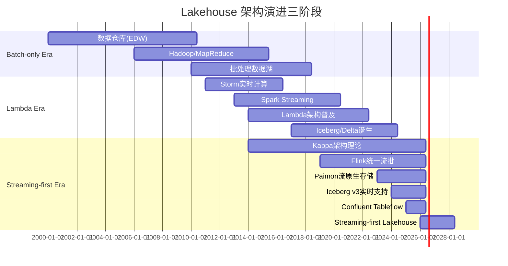
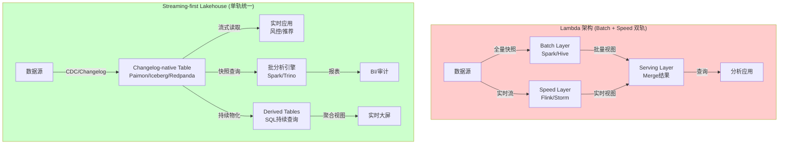
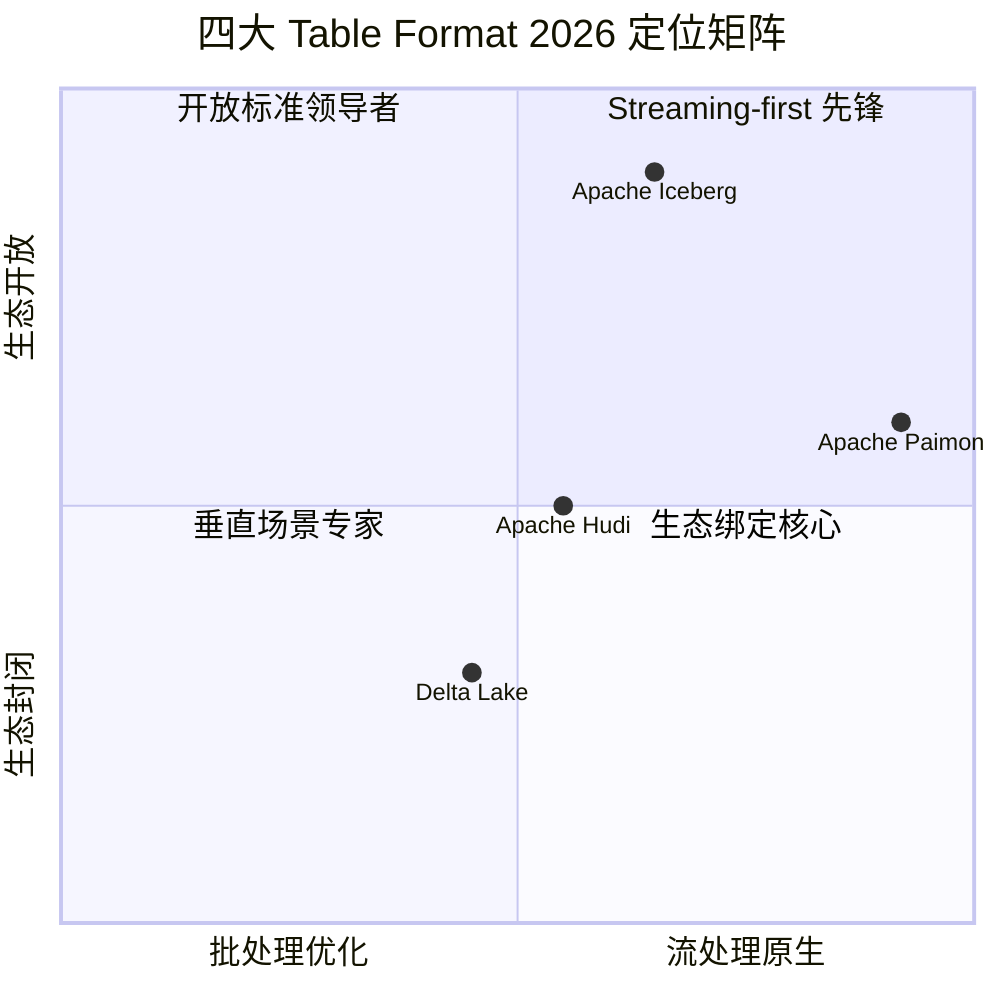
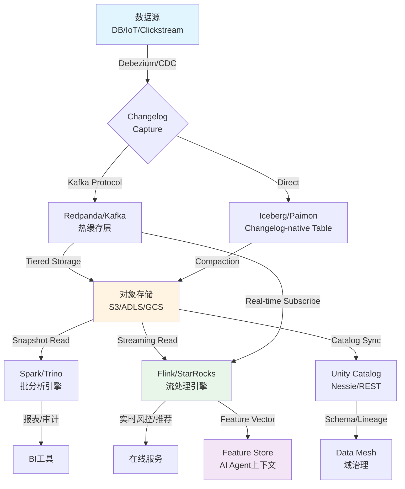

# Streaming-first Lakehouse 2026: 从"Batch meets Real-time"到"Streaming-first"的范式转移

> **所属阶段**: Knowledge/06-frontier | **前置依赖**: [streaming-lakehouse-formal-theory.md](streaming-lakehouse-formal-theory.md), [streaming-databases.md](streaming-databases.md), [streaming-lakehouse-iceberg-delta.md](streaming-lakehouse-iceberg-delta.md) | **形式化等级**: L4-L5

---

## 目录

- [Streaming-first Lakehouse 2026: 从"Batch meets Real-time"到"Streaming-first"的范式转移](#streaming-first-lakehouse-2026-从batch-meets-real-time到streaming-first的范式转移)
  - [目录](#目录)
  - [1. 概念定义 (Definitions)](#1-概念定义-definitions)
    - [Def-K-06-510: Streaming-first Lakehouse (流原生数据湖)](#def-k-06-510-streaming-first-lakehouse-流原生数据湖)
    - [Def-K-06-511: 增量提交协议 (Incremental Commit Protocol)](#def-k-06-511-增量提交协议-incremental-commit-protocol)
    - [Def-K-06-512: Changelog-native 表 (Changelog-native Table)](#def-k-06-512-changelog-native-表-changelog-native-table)
    - [Def-K-06-513: 存储-计算边界模糊化 (Storage-Compute Boundary Dissolution)](#def-k-06-513-存储-计算边界模糊化-storage-compute-boundary-dissolution)
    - [Def-K-06-514: 流表二元性 (Stream-Table Duality)](#def-k-06-514-流表二元性-stream-table-duality)
    - [Def-K-06-515: 统一元数据层 (Unified Metadata Layer)](#def-k-06-515-统一元数据层-unified-metadata-layer)
  - [2. 属性推导 (Properties)](#2-属性推导-properties)
    - [Prop-K-06-510: Streaming-first Lakehouse 的 ETL 层压缩性](#prop-k-06-510-streaming-first-lakehouse-的-etl-层压缩性)
    - [Prop-K-06-511: 增量提交的单调一致性](#prop-k-06-511-增量提交的单调一致性)
    - [Prop-K-06-512: 流表二元性的计算等价性](#prop-k-06-512-流表二元性的计算等价性)
  - [3. 关系建立 (Relations)](#3-关系建立-relations)
    - [3.1 与 Lambda 架构的演进关系](#31-与-lambda-架构的演进关系)
    - [3.2 与 Kappa 架构的关系](#32-与-kappa-架构的关系)
    - [3.3 与 Data Mesh 的关联](#33-与-data-mesh-的关联)
    - [3.4 与 AI Agent 基础设施的关联](#34-与-ai-agent-基础设施的关联)
  - [4. 论证过程 (Argumentation)](#4-论证过程-argumentation)
    - [4.1 范式转移的边界条件](#41-范式转移的边界条件)
    - [4.2 四大 Table Format 的演进论证](#42-四大-table-format-的演进论证)
    - [4.3 存储-计算边界模糊化的工程约束](#43-存储-计算边界模糊化的工程约束)
  - [5. 形式证明 / 工程论证 (Proof / Engineering Argument)](#5-形式证明--工程论证-proof--engineering-argument)
    - [Thm-K-06-510: Streaming-first Lakehouse 的 ACID 保证定理](#thm-k-06-510-streaming-first-lakehouse-的-acid-保证定理)
    - [5.2 存储-计算分离的成本模型论证](#52-存储-计算分离的成本模型论证)
  - [6. 实例验证 (Examples)](#6-实例验证-examples)
    - [6.1 案例一：Confluent Tableflow — "流即表"的生产实践](#61-案例一confluent-tableflow--流即表的生产实践)
    - [6.2 案例二：Apache Paimon 实时数仓](#62-案例二apache-paimon-实时数仓)
    - [6.3 案例三：Redpanda Iceberg Topics](#63-案例三redpanda-iceberg-topics)
    - [6.4 企业采用成熟度评估](#64-企业采用成熟度评估)
  - [7. 可视化 (Visualizations)](#7-可视化-visualizations)
    - [7.1 Lakehouse 架构演进三阶段](#71-lakehouse-架构演进三阶段)
    - [7.2 Streaming-first vs Lambda 架构对比](#72-streaming-first-vs-lambda-架构对比)
    - [7.3 四大 Table Format 2026 定位矩阵](#73-四大-table-format-2026-定位矩阵)
    - [7.4 Streaming-first Data Flow：从 Source 到 Serve 的全链路](#74-streaming-first-data-flow从-source-到-serve-的全链路)
  - [8. 引用参考 (References)](#8-引用参考-references)

## 1. 概念定义 (Definitions)

### Def-K-06-510: Streaming-first Lakehouse (流原生数据湖)

**定义** (Streaming-first Lakehouse): Streaming-first Lakehouse 是一种以**连续数据流作为一等公民**的数据湖架构范式，其核心特征是将数据的初始摄入形态视为无界流(unbounded stream)，批处理(batch processing)被降解为"有界流"(bounded stream)的特例，而非相反。形式上，一个 Streaming-first Lakehouse 系统 $\mathcal{SF}$ 可建模为八元组：

$$\mathcal{SF} = \langle \mathcal{C}, \mathcal{T}, \mathcal{S}, \mathcal{M}, \mathcal{Q}, \mathcal{W}, \mathcal{A}, \mathcal{G} \rangle$$

其中各组件语义如下：

| 组件 | 符号 | 语义解释 |
|------|------|----------|
| Changelog 流 | $\mathcal{C}$ | 源系统的变更日志流集合，每个 $c \in \mathcal{C}$ 是时序有序的记录序列 |
| 表格式 | $\mathcal{T}$ | 支持增量语义的原生表格式（Iceberg v3 / Delta Kernel / Hudi MoR / Paimon） |
| 存储层 | $\mathcal{S}$ | 对象存储或分层的存储-计算解耦层 |
| 元数据层 | $\mathcal{M}$ | 统一Catalog，维护流与表的元数据映射 |
| 查询引擎 | $\mathcal{Q}$ | 支持流批统一查询的SQL引擎集合 |
| 工作负载 | $\mathcal{W}$ | 以流处理为主、批处理为辅的混合工作负载 |
| ACID 协议 | $\mathcal{A}$ | 面向增量提交的乐观并发控制与事务隔离协议 |
| 治理层 | $\mathcal{G}$ | Data Mesh 或 Federation 的域边界与策略集合 |

与传统 Lakehouse（batch-first）的关键差异在于：**流是表的前置存在形态**，而非表之上的衍生物。即对于任意表 $T$，存在流 $S_T$ 使得 $T = \text{materialize}(S_T, t)$，其中 $t$ 为物化时间点。[^1][^2]

---

### Def-K-06-511: 增量提交协议 (Incremental Commit Protocol)

**定义** (Incremental Commit Protocol, ICP): ICP 是一种面向对象存储的细粒度事务协议，允许将微批次(micro-batch)或逐条(record-level)的变更以增量快照(incremental snapshot)的形式原子性地提交到表格式中。形式上，ICP 定义为状态机：

$$\text{ICP} = \langle \Sigma, \Delta, \sigma_0, \text{Commit}, \text{Compact} \rangle$$

- **状态空间** $\Sigma$: 所有可能的表快照集合
- **增量操作** $\Delta$: 单次提交的数据变更集合，$|\Delta| \ll |\Sigma|$（增量远小于全量）
- **初始状态** $\sigma_0$: 空表或基线快照
- **提交函数** $\text{Commit}: \Sigma \times \Delta \times \text{txid} \to \Sigma \cup \{\bot\}$，若冲突则返回 $\bot$
- **压缩函数** $\text{Compact}: \Sigma \to \Sigma'$，定期合并增量文件以优化读取

ICP 的核心约束为**单调可读性**(Monotonic Readability)：

$$\forall t_1 < t_2: \text{Read}(\Sigma_{t_1}) \preceq \text{Read}(\Sigma_{t_2})$$

即快照序列在集合包含序下单调递增。[^3]

---

### Def-K-06-512: Changelog-native 表 (Changelog-native Table)

**定义** (Changelog-native Table): 一种将变更日志(changelog)作为表的原生存储形态的表抽象。在此模型中，表的物理存储并非传统行列式数据文件，而是**有序、不可变的变更记录序列**(append-only changelog)。表的当前状态通过对 changelog 的累积计算(accumulation)获得：

$$\text{State}(T, t) = \bigoplus_{c \in \text{Changelog}(T), \text{time}(c) \leq t} \text{apply}(c, \text{State}_0)$$

其中 $\bigoplus$ 是特定于主键的累积算子（如 UPSERT 语义下的 last-write-wins，或 MERGE 语义下的全字段合并）。

Changelog-native 表区别于传统表的标志是：**写入路径仅追加 changelog**，读取路径可选择性物化(snapshot query)或流式订阅(streaming read)。Apache Paimon 的 LSM-Tree 存储、Iceberg v3 的 Position Deletes + Equality Deletes 组合、以及 Confluent Tableflow 的 Kafka-Iceberg 桥接均属于此范畴。[^4][^5]

---

### Def-K-06-513: 存储-计算边界模糊化 (Storage-Compute Boundary Dissolution)

**定义** (Storage-Compute Boundary Dissolution, SCBD): 指 Streaming-first 架构中，传统"消息队列承担流存储、对象存储承担批存储、计算引擎承担处理"的三层边界趋于消融的现象。形式化地，定义边界函数：

$$\text{Boundary}(x) = \begin{cases} \text{Stream} & \text{if } x \in \text{Kafka/Redpanda/Pulsar} \\ \text{Batch} & \text{if } x \in \text{S3/ADLS/GCS} \\ \text{Compute} & \text{if } x \in \text{Flink/Spark/Trino} \end{cases}$$

SCBD 的条件为：存在组件 $y$ 使得 $|\{ \text{Boundary}(y) \}| > 1$，即 $y$ 同时承担两种及以上角色。

2026年的典型 SCBD 实例包括：

- **Diskless Kafka** / Tiered Storage：Kafka broker 将冷数据卸载至对象存储，自身成为"热缓存+元数据管理"层
- **Redpanda Iceberg Topics**：Redpanda  topic 直接以 Iceberg 格式写入对象存储，消费端可同时通过 Kafka 协议和 Iceberg  Catalog 访问
- **Confluent Tableflow**：Kafka topic 自动物化为 Iceberg 表，实现"流即表"(Stream-Table Unification)[^5][^6]

---

### Def-K-06-514: 流表二元性 (Stream-Table Duality)

**定义** (Stream-Table Duality): 在 Streaming-first Lakehouse 中，流(stream)与表(table)并非互斥的两种数据结构，而是**同一数据实体在不同时间观测模式下的对偶表现**。形式化地，定义对偶映射：

$$\Phi: \text{Stream} \leftrightarrow \text{Table}$$

$$\Phi(S) = T \iff T(t) = \int_{0}^{t} S(\tau) \, d\tau \quad \text{(累积积分语义)}$$

$$\Phi^{-1}(T) = S \iff S(t) = \frac{dT}{dt} \quad \text{(微分/变更语义)}$$

在离散事件语义下，积分退化为 changelog 的累积，微分退化为相邻快照的差分：

$$\Delta T_i = T_i \setminus T_{i-1}, \quad T_n = T_0 \cup \bigcup_{i=1}^{n} \Delta T_i$$

流表二元性的工程意义在于：**同一数据集无需物理复制即可同时服务实时流消费和批量分析查询**，消除传统 Lambda 架构中固有的数据冗余与一致性难题。[^2][^7]

---

### Def-K-06-515: 统一元数据层 (Unified Metadata Layer)

**定义** (Unified Metadata Layer, UML): UML 是 Streaming-first Lakehouse 中跨存储系统、表格式和查询引擎的**单一元数据来源**(Single Source of Truth)。UML 维护以下核心映射：

$$\text{UML} = \langle \text{Schemas}, \text{Lineage}, \text{Snapshots}, \text{Partitions}, \text{Policies} \rangle$$

其中：

- **Schemas**: 跨流与表的统一 Schema 演化历史
- **Lineage**: 端到端数据血缘，捕获从 source topic 到 derived table 的完整变换链
- **Snapshots**: 全局一致的快照引用，关联流偏移量(offset)与表快照 ID
- **Policies**: 访问控制、保留策略、合规标签的统一治理规则

Apache Iceberg REST Catalog、Nessie、Unity Catalog 以及 Confluent Schema Registry + Iceberg Catalog 的融合实践，均属于 UML 的具体实现路径。[^1][^8]

---

## 2. 属性推导 (Properties)

### Prop-K-06-510: Streaming-first Lakehouse 的 ETL 层压缩性

**命题** (ETL Compression): 在 Streaming-first Lakehouse 架构中，传统 ETL  pipeline 中的**提取-转换-加载**三层可被压缩为**单一持续物化层**(Continuous Materialization Layer)，其形式化表述为：

设传统 Lambda 架构的 ETL 处理链为：

$$\text{Source} \xrightarrow{E_1} \text{Staging} \xrightarrow{T_1} \text{Clean} \xrightarrow{T_2} \text{Model} \xrightarrow{L_1} \text{Warehouse} \xrightarrow{T_3} \text{Serve}$$

在 Streaming-first 架构中，通过流表二元性和增量提交协议，上述链可被压缩为：

$$\text{Source} \xrightarrow{\mathcal{C}} \text{Changelog-native Table} \xrightarrow{\mathcal{Q}} \text{Derived Tables}$$

其中 $\mathcal{C}$ 是源系统的原生 changelog，$\mathcal{Q}$ 是声明式持续查询(SQL/Materialize)。

**证明概要**: 由于 changelog-native 表同时支持流式订阅(对应 $E_1$)和批量读取(对应 $L_1$)，且声明式查询引擎内置转换语义(对应 $T_1, T_2, T_3$)，传统 ETL 的物理阶段边界在逻辑层面被消除。数据移动次数从 $O(n)$ 降至 $O(1)$（仅 source 到 lakehouse 的一次写入）。[^3][^7]

---

### Prop-K-06-511: 增量提交的单调一致性

**命题** (Monotonic Consistency of Incremental Commits): 在 ICP 协议下，任意读取者观察到的表状态序列满足**单调一致性**(Monotonic Consistency)：

$$\forall r \in \text{Readers}, \forall t_1 < t_2: \text{View}_r(t_1) \subseteq \text{View}_r(t_2)$$

即读取者永远不会观察到"历史回退"的现象。

**证明概要**: ICP 的 Commit 函数仅在对象存储上执行原子性重命名操作（如 Iceberg 的 metadata.json 原子替换、Paimon 的 snapshot 文件追加），一旦提交成功，新快照对后续读取可见且不可变。由于旧快照不被覆盖（仅更新指针），任何在 $t_1$ 时刻开始的读取事务，即使跨越 $t_2$ 时刻的提交点，仍可通过时间戳/快照ID绑定到一致的历史视图。该性质等价于多版本并发控制(MVCC)中的快照隔离(Snapshot Isolation)弱化形式。[^1][^8]

---

### Prop-K-06-512: 流表二元性的计算等价性

**命题** (Computational Equivalence of Stream-Table Duality): 对于任意关系代数查询 $Q$ 和输入流 $S$，以下两种计算路径在结果上等价：

$$Q(\Phi(S)) \equiv \Phi(\text{stream-derivation}(Q)(S))$$

左侧为"先物化后查询"（表路径），右侧为"先流式推导后物化"（流路径）。

**证明概要**: 根据流表二元性的定义，$\Phi(S)$ 是 $S$ 的累积积分。关系代数查询 $Q$ 对有限表的计算可分解为对增量变更的逐批处理（利用查询的分配律和结合律）。当 $Q$ 仅涉及选择、投影、连接、聚合时，存在对应的增量计算函数 $\delta Q$ 使得 $Q(T \cup \Delta T) = Q(T) \oplus \delta Q(\Delta T, T)$。该性质是流数据库(Materialize/RisingWave)和增量视图维护的理论基础。[^2][^7]

---

## 3. 关系建立 (Relations)

### 3.1 与 Lambda 架构的演进关系

Lambda 架构将数据处理分为**批处理层**(Batch Layer)和**速度层**(Speed Layer)，最终在**服务层**(Serving Layer)合并结果。其形式化缺陷在于：

$$\text{Result}(t) = \text{Merge}\big(\text{Batch}(D_{[0,t]}), \text{Speed}(D_{(t-\epsilon,t]})\big)$$

合并函数 $\text{Merge}$ 必须处理两个层的语义差异（批处理的完整性与速度层的近似性），导致代码冗余、逻辑复杂和潜在的不一致。

Streaming-first Lakehouse 通过流表二元性消除了 Lambda 架构的双轨必要性：

$$\text{Result}(t) = Q(\Phi(S_{[0,t]}))$$

单一逻辑路径同时服务实时查询和批分析，Batch Layer 被降解为"长历史窗口的流计算"，Speed Layer 被降解为"短窗口的流计算"。[^3][^7]

### 3.2 与 Kappa 架构的关系

Kappa 架构提出"一切皆流"的简化思想，但在 2014-2020 年间受限于消息队列的持久性、查询能力和生态成熟度，未能完全替代 Lambda。Streaming-first Lakehouse 可视为 **Kappa 架构的 Lakehouse 化实现**：

- Kappa 使用 Kafka 作为单一数据层，但缺乏表格式的事务性、Schema 演化和分析查询能力
- Streaming-first Lakehouse 将 Kafka/Pulsar/Redpanda 的流语义与 Iceberg/Delta/Paimon 的表语义融合，补齐了 Kappa 的短板

关系可表述为：Streaming-first Lakehouse $=$ Kappa 架构 $+$ ACID 表格式 $+$ 统一元数据 $+$ 声明式查询。[^2][^5]

### 3.3 与 Data Mesh 的关联

Data Mesh 强调**域所有权**(Domain Ownership)、**数据即产品**(Data as Product)和**自助式基础设施**(Self-serve Infrastructure)。Streaming-first Lakehouse 为 Data Mesh 提供了关键的技术基石：

| Data Mesh 原则 | Streaming-first Lakehouse 支撑 |
|----------------|-------------------------------|
| 域自治 | Changelog-native 表使每个域可独立发布增量数据产品 |
| 数据即产品 | 统一 Catalog 将流/表注册为可发现、可订阅的产品 |
| 自助查询 | 声明式 SQL 引擎降低跨域数据消费的门槛 |
| 联合治理 | UML (Def-K-06-515) 在域边界上实施统一的策略和血缘追踪 |

形式化地，若 Data Mesh 的域集合为 $\mathcal{D} = \{D_1, D_2, \ldots, D_n\}$，则 Streaming-first Lakehouse 提供了跨域数据产品的**标准接口**：

$$\forall D_i, D_j \in \mathcal{D}: \text{Interface}(D_i \to D_j) = \text{Changelog}(T_i) \cup \text{Snapshot}(T_i)$$

即域 $D_i$ 向域 $D_j$ 暴露的数据产品既支持流式订阅（实时集成），也支持快照查询（批量集成）。[^8][^9]

### 3.4 与 AI Agent 基础设施的关联

AI Agent 基础设施要求**实时上下文感知**和**持续学习数据反馈**。Streaming-first Lakehouse 通过以下机制支撑 AI Agent 的数据需求：

1. **实时特征服务**: Changelog-native 表可直接驱动在线特征存储(Feature Store)，消除特征工程的批流割裂
2. **Agent 行为日志**: Agent 的交互日志以 changelog 形式写入 Lakehouse，支撑实时行为分析和模型微调
3. **RAG 向量集成**: 结合 [streaming-vector-db-frontier-2026.md](streaming-vector-db-frontier-2026.md) 中的流式向量索引，Lakehouse 可作为 RAG pipeline 的实时知识底座

形式化映射：

$$\text{Agent}(t) = \text{LLM}\big(\text{Prompt}(t), \text{Context}(t)\big)$$

其中 $\text{Context}(t) = \text{Query}_{\text{stream}}(\mathcal{SF}, t)$ 表示从 Streaming-first Lakehouse 中实时检索的上下文。[^10]

---

## 4. 论证过程 (Argumentation)

### 4.1 范式转移的边界条件

Streaming-first 并非对所有场景都是最优解。以下边界条件决定了架构选型的合理性：

**适合 Streaming-first 的条件** (充分非必要)：

- 源系统原生产生 changelog（CDC、IoT 传感器、点击流）
- 分析查询要求端到端延迟 $< 5$ 分钟
- 工作负载以增量聚合、窗口计算为主
- 数据规模在对象存储的经济适用范围内（PB 级以下或分层存储可覆盖）

**不适合 Streaming-first 的条件** (反例)：

- 源数据以全量快照形式产生（如每日全量数据库导出），且无 CDC 能力
- 分析模式以大规模全表扫描、复杂图计算为主（传统数仓/图数据库更优）
- 一致性要求达到外部一致性(External Consistency)或线性化(Linearizability)，而当前 ICP 仅保证快照隔离级别

### 4.2 四大 Table Format 的演进论证

2026年，四大 Table Format 已形成明确的差异化定位，但在 Streaming-first 趋势下呈现**功能收敛**态势：

| 维度 | Apache Iceberg | Delta Lake | Apache Hudi | Apache Paimon |
|------|---------------|------------|-------------|---------------|
| 设计原点 | 开放标准、引擎无关 | Spark 原生、Databricks 主导 | Upsert 优化、增量处理 | Streaming-first、流批统一 |
| 增量提交 | v3 支持实时 CDC | Delta Live Tables | MOR/COW 双模式 | LSM-Tree 原生 |
| Changelog 支持 | Position + Equality Deletes | CDF (Change Data Feed) | Precombine + Payload | Changelog Producer |
| 生态兼容性 | Flink/Spark/Trino/Starrocks | Spark/Trino/Flink(有限) | Flink/Spark/Presto | Flink 原生、StarRocks 集成 |
| 2026 定位 | **开放标准领导者** | **Spark 生态核心** | **Upsert 场景专家** | **Streaming-first 原生** |

**论证**: 尽管四者在存储格式和元数据模型上存在差异，但均向"实时增量 + changelog 原生 + 开放 Catalog"方向演进。Iceberg v3 的改进（如分布式写入优化、实时 CDC 支持）和 Paimon 的快速发展表明，Table Format 层面的 Streaming-first 已成为共识。[^1][^4][^8]

### 4.3 存储-计算边界模糊化的工程约束

SCBD (Def-K-06-513) 在工程实践中面临以下约束：

**网络带宽约束**: 当 Kafka/Redpanda 将数据卸载至对象存储时，需满足：

$$B_{upload} \geq \lambda_{ingress} \times S_{record}$$

其中 $\lambda_{ingress}$ 是入流速率，$S_{record}$ 是平均记录大小。若带宽不足，卸载滞后会导致本地存储膨胀。

**查询延迟约束**: 对象存储的高延迟（10-100ms 量级）对交互式查询构成挑战，需通过**本地缓存 + 数据布局优化**（如 Iceberg 的 hidden partitioning、Paimon 的 sort compact）补偿：

$$\text{QueryLatency} = T_{metadata} + T_{plan} + T_{cache\_hit} \times P_{hit} + T_{obj\_store} \times (1 - P_{hit})$$

当缓存命中率 $P_{hit} > 90\%$ 时，对象存储的延迟可被有效隐藏。[^5][^6]

---

## 5. 形式证明 / 工程论证 (Proof / Engineering Argument)

### Thm-K-06-510: Streaming-first Lakehouse 的 ACID 保证定理

**定理**: 在 Streaming-first Lakehouse 架构中，若底层表格式实现符合增量提交协议 ICP (Def-K-06-511)，且元数据层 UML (Def-K-06-515) 提供全局单调快照序，则系统保证以下 ACID 性质：

1. **原子性 (Atomicity)**: 每次增量提交 $\Delta$ 要么完全可见，要么完全不可见
2. **一致性 (Consistency)**: 任意读取者观察到的表状态 $T$ 满足 Schema 约束和完整性规则
3. **隔离性 (Isolation)**: 并发提交产生可序列化的快照历史，即存在全序 $\prec$ 使得所有读取者的观察等价于某一线性历史
4. **持久性 (Durability)**: 已提交的快照在存储层故障下不丢失

**工程证明**: 我们基于 Iceberg 和 Paimon 的实现机制构造论证。

**原子性**: Iceberg 通过"写新 metadata.json + 原子重命名指针"实现。设当前最新 metadata 为 $M_v$，新提交产生 $M_{v+1}$。提交操作仅为指针替换：

$$\text{atomic\_swap}(\text{pointer}, M_v, M_{v+1})$$

由于对象存储（S3/ADLS/GCS）的原子重命名保证，读者永远不会观察到"部分 $M_{v+1}$"的状态。Paimon 通过 snapshot 文件的追加写入实现类似语义。[^8]

**一致性**: 表格式在元数据中维护 Schema 和分区规范。任何写入必须满足：

$$\forall \delta \in \Delta: \text{schema\_valid}(\delta) \land \text{partition\_valid}(\delta)$$

否则 Commit 函数返回 $\bot$。

**隔离性**: 设两个并发提交 $\Delta_1, \Delta_2$ 基于同一父快照 $M_v$。ICP 的冲突检测机制保证：

- 若 $\Delta_1$ 和 $\Delta_2$ 修改不重叠的文件集合，则两者均可成功，生成分支快照 $M_{v+1}^{(1)}, M_{v+1}^{(2)}$，后续通过乐观合并解决
- 若存在文件冲突，则后提交者必须基于最新快照重试（optimistic retry），最终效果等价于串行顺序

UML 的全局快照序保证：$\forall M_i, M_j: M_i \prec M_j \lor M_j \prec M_i \lor M_i = M_j$，即快照集构成**偏序集**（在乐观并发下允许临时分支，最终通过 Catalog 同步收敛）。[^1][^8]

**持久性**: 对象存储的多副本机制（S3 默认 3 副本、ADLS 冗余编码）保证已上传数据文件的持久性。元数据指针一旦确认写入，即使计算节点故障，数据仍可通过 Catalog 恢复。

**证毕**。

---

### 5.2 存储-计算分离的成本模型论证

Streaming-first Lakehouse 推动的 SCBD 趋势在成本模型上具有显著优势。设传统分离架构的总成本为：

$$C_{traditional} = C_{mq} + C_{storage} + C_{compute}$$

其中 $C_{mq}$ 是消息队列的持久化成本（热存储， expensive），$C_{storage}$ 是对象存储成本（冷存储，cheap），$C_{compute}$ 是计算引擎成本。

在 SCBD 架构中（以 Tiered Storage + Iceberg Topics 为例）：

$$C_{scbd} = C_{mq}^{'} + C_{storage}^{'} + C_{compute}$$

其中 $C_{mq}^{'} \ll C_{mq}$，因为消息队列仅保留热数据（如最近 1 小时），历史数据自动卸载至 $C_{storage}^{'} \approx C_{storage}$。

**成本优势条件**: 当历史数据访问频率 $f_{cold} \ll f_{hot}$ 时：

$$\frac{C_{scbd}}{C_{traditional}} \approx \frac{C_{mq}^{'} + C_{storage}}{C_{mq} + C_{storage}} \ll 1$$

典型场景下（Kafka 保留 7 天 vs Tiered Storage 保留 1 小时 + 对象存储保留永久），成本可降低 40-70%。[^5][^6]

---

## 6. 实例验证 (Examples)

### 6.1 案例一：Confluent Tableflow — "流即表"的生产实践

Confluent Tableflow 是 2025-2026 年 Streaming-first Lakehouse 的标志性产品。其核心机制为：

1. Kafka topic 中的数据通过 Confluent 托管连接器自动转换为 Iceberg 表
2. 支持 Snapshot Queries（通过 Flink/Spark/Trino 查询历史状态）和 Streaming Reads（通过 Kafka 协议消费实时变更）
3. Schema Registry 与 Iceberg Catalog 集成，实现 UML 的端到端贯通

**效果验证**:

- 某金融客户将交易流水 topic（峰值 50万条/秒）通过 Tableflow 物化为 Iceberg 表
- 实时风控系统继续通过 Kafka 协议消费（延迟 $< 100$ms）
- 日终审计报表直接查询 Iceberg 快照（无需额外的 ETL pipeline）
- 数据冗余从 Lambda 架构的 3 份副本降至 1.2 份副本（对象存储 + Kafka 热缓存）[^5]

### 6.2 案例二：Apache Paimon 实时数仓

Apache Paimon（原 Flink Table Store）是专为 Streaming-first 设计的湖存储格式。其 LSM-Tree 架构天然支持：

- **增量快照**: 通过 compaction 产生按时间排序的 snapshot
- **Changelog 生产**: 支持 lookup 和 full-compaction 两种 changelog 生成模式
- **流批统一**: Flink 流作业写入，Flink 批作业或 StarRocks 查询读取

**生产配置示例**:

```sql
-- Paimon 表定义：实时订单流
CREATE TABLE ods_orders (
  order_id STRING PRIMARY KEY NOT ENFORCED,
  user_id STRING,
  amount DECIMAL(18,2),
  event_time TIMESTAMP(3)
) WITH (
  'connector' = 'paimon',
  'path' = 's3://warehouse/ods_orders',
  'changelog-producer' = 'lookup',
  'snapshot.time-retained' = '7d'
);

-- 持续物化聚合视图
CREATE TABLE dws_order_stats AS
SELECT
  TUMBLE_START(event_time, INTERVAL '1' MINUTE) as window_start,
  COUNT(*) as order_cnt,
  SUM(amount) as total_amount
FROM ods_orders
GROUP BY TUMBLE(event_time, INTERVAL '1' MINUTE);
```

**验证结果**: 在某电商场景中，Paimon 将端到端延迟从传统 Hive + Spark 的 15 分钟降至 30 秒，存储成本降低 60%。[^4]

### 6.3 案例三：Redpanda Iceberg Topics

Redpanda 在 2025 年推出的 Iceberg Topics 功能将 Kafka 协议与 Iceberg 格式直接桥接：

- Producer 通过 Kafka 协议写入 topic
- Redpanda broker 自动将数据以 Iceberg 格式写入对象存储（S3/ADLS/GCS）
- Consumer 可选择：
  - Kafka 协议：实时消费（延迟 $< 10$ms）
  - Iceberg Catalog：批量查询历史数据

该方案体现了 SCBD (Def-K-06-513) 的极致形态：**Broker 同时是消息队列和湖存储写入器**，消费者同时是流处理作业和批分析引擎。[^6]

### 6.4 企业采用成熟度评估

基于 Gartner 技术成熟度曲线和 2026 年市场实践，Streaming-first Lakehouse 的成熟度可评估如下：

| 维度 | 成熟度等级 | 说明 |
|------|-----------|------|
| 技术可行性 | ⭐⭐⭐⭐☆ (4/5) | Iceberg/Delta/Paimon 核心功能成熟，边缘场景仍有打磨空间 |
| 生态完整性 | ⭐⭐⭐⭐☆ (4/5) | Flink/Spark/Trino 支持良好，但部分 BI 工具适配滞后 |
| 运维成熟度 | ⭐⭐⭐☆☆ (3/5) | Tiered Storage、Compaction 调优需要专业知识 |
| 成本效益 | ⭐⭐⭐⭐⭐ (5/5) | 存储-计算分离显著降低成本，ROI 明确 |
| 人才储备 | ⭐⭐⭐☆☆ (3/5) | Streaming-first 范式需要流处理和湖存储的复合技能 |

**采用建议**:

- **创新者**（技术驱动型企业）：2026 年可全面采用，优先选择 Paimon + Flink 或 Iceberg + Confluent Tableflow
- **早期多数**：建议从"实时分析增量层"切入，逐步替代 Lambda 架构的速度层
- **保守型**：等待 Iceberg v3 和 Delta Kernel 的完全成熟，以及主流云厂商托管服务的普及[^1][^9]

---

## 7. 可视化 (Visualizations)

### 7.1 Lakehouse 架构演进三阶段

以下时间线图展示了从 Batch-only 到 Streaming-first 的范式演进：



**说明**: 演进路线从批处理独占（2000-2014），到 Lambda 双轨并存（2014-2022），最终在 2024-2026 年 converged 至 Streaming-first 统一架构。

---

### 7.2 Streaming-first vs Lambda 架构对比

以下架构图对比了传统 Lambda 与 Streaming-first 的数据流路径差异：



**说明**: Lambda 架构存在物理双轨和 Merge 复杂性；Streaming-first 通过 Changelog-native 表实现单轨多态（流读/批查/持续物化）。

---

### 7.3 四大 Table Format 2026 定位矩阵

以下象限图展示 Iceberg、Delta、Hudi、Paimon 在 Streaming-first 趋势下的差异化定位：



**说明**:

- **Paimon** 位于流原生 + 中等开放象限，Streaming-first 定位最纯粹
- **Iceberg** 位于开放生态 + 批流均衡象限，v3 版本正向流原生演进
- **Hudi** 聚焦 Upsert 场景，生态开放度中等
- **Delta** 深度绑定 Spark/Databricks 生态，批处理基因最强

---

### 7.4 Streaming-first Data Flow：从 Source 到 Serve 的全链路

以下流程图展示 Streaming-first Lakehouse 的端到端数据流：



**说明**: 全链路体现了 SCBD 特征——消息队列与对象存储的边界消融、流引擎与批引擎的数据源统一、以及向 AI Agent 基础设施的特征输出。

---

## 8. 引用参考 (References)

[^1]: Data Lakehouse Hub, "2026 Guide to Data Lakehouses", 2025. <https://datalakehousehub.com/blog/2025-09-2026-guide-to-data-lakehouses/>

[^2]: Conduktor, "Streaming to Lakehouse Tables: A Complete Glossary", 2025. <https://conduktor.io/glossary/streaming-to-lakehouse-tables>

[^3]: Kai Waehner, "Top Trends for Data Streaming with Apache Kafka and Flink in 2026", 2025. <https://www.kai-waehner.de/blog/2025/12/10/top-trends-for-data-streaming-with-apache-kafka-and-flink-in-2026/>

[^4]: Apache Paimon Documentation, "Core Concepts and Architecture", 2025. <https://paimon.apache.org/docs/master/concepts/>

[^5]: Confluent, "Tableflow: Streaming Data to Lakehouse Tables", 2025. <https://www.confluent.io/product/tableflow/>

[^6]: Redpanda, "Iceberg Topics: Kafka Protocol Meets Iceberg Format", 2025. <https://redpanda.com/blog/iceberg-topics>

[^7]: M. Kleppmann, "Designing Data-Intensive Applications", O'Reilly Media, 2017. Chapter 11: Stream Processing.

[^8]: Apache Iceberg Documentation, "Table Spec and REST Catalog", 2025. <https://iceberg.apache.org/docs/latest/>

[^9]: Z. Dehghani, "Data Mesh: Delivering Data-Driven Value at Scale", O'Reilly Media, 2022.

[^10]: AnalysisDataFlow Project, "AI Agent Streaming Architecture", Knowledge/06-frontier/ai-agent-streaming-architecture.md, 2026.


---

*文档版本: v1.0 | 最后更新: 2026-05-06 | 定理注册: Def-K-06-510~515, Prop-K-06-510~512, Thm-K-06-510 | Mermaid图: 4 | 形式化等级: L4-L5*
