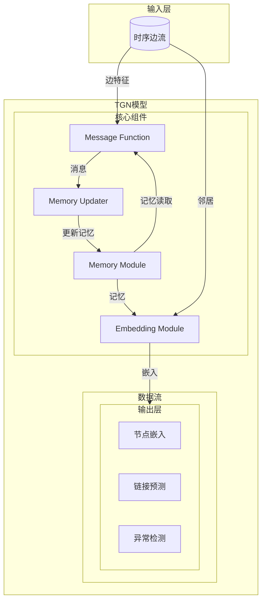
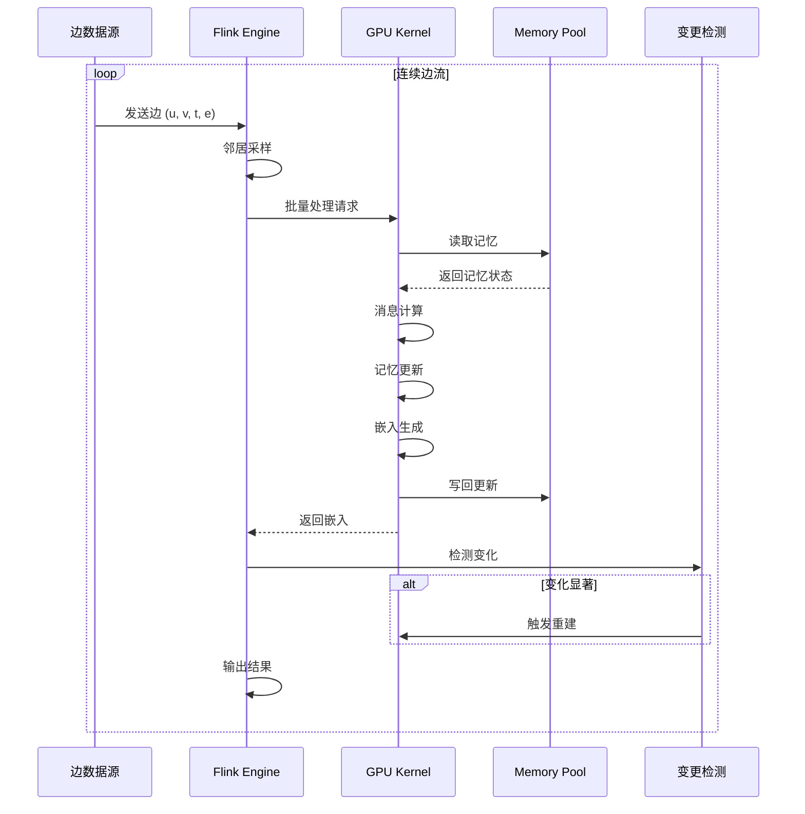
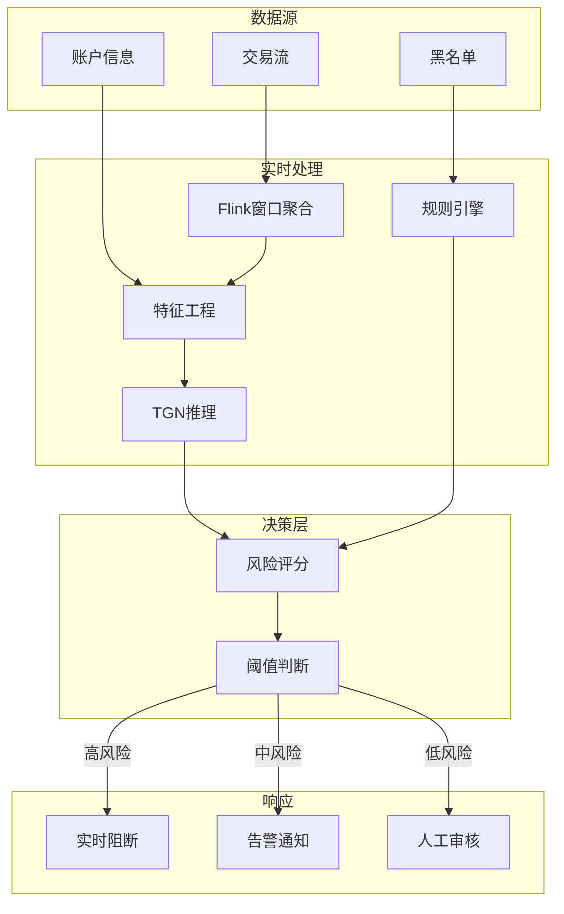

# 实时图流处理与Temporal Graph Neural Networks (TGN)

> 所属阶段: Knowledge/06-frontier | 前置依赖: [Flink核心机制](../../Flink/02-core/time-semantics-and-watermark.md), [GNN基础](./realtime-graph-streaming-tgnn.md) | 形式化等级: L4-L5

## 1. 概念定义 (Definitions)

### Def-K-06-230: Temporal Graph (时序图)

**时序图** 是带有时间戳的边序列：

$$
\mathcal{G}_T = (V, E_T)
$$

其中：

- $V$: 节点集合
- $E_T = \{(u, v, t, e)\}$: 带时间戳的边集合
- $u, v \in V$: 源节点和目标节点
- $t \in \mathbb{R}^+$: 时间戳
- $e \in \mathbb{R}^{d_e}$: 边特征向量

**与静态图的区别**：

| 特性 | 静态图 | 时序图 |
|------|--------|--------|
| 边 | 固定 | 动态到达 |
| 节点特征 | 不变 | 随时间演化 |
| 结构 | 固定 | 持续变化 |
| 任务 | 分类/聚类 | 链接预测/异常检测 |

### Def-K-06-231: Temporal Graph Neural Network (TGN)

**TGN** 是处理时序图的神经网络：

$$
\text{TGN}: \mathcal{G}_T \times t \rightarrow \mathbb{R}^{d_h}
$$

**核心组件**：

$$
\text{TGN} = \langle \mathcal{M}, \mathcal{A}, \mathcal{U}, \mathcal{E} \rangle
$$

1. **Memory Module ($\mathcal{M}$)**: 节点记忆状态
2. **Message Function ($\mathcal{A}$)**: 消息生成
3. **Memory Updater ($\mathcal{U}$)**: 记忆更新
4. **Embedding Module ($\mathcal{E}$)**: 嵌入生成

### Def-K-06-232: Streaming TGN Inference

**流式TGN推理** 针对连续到达的边进行实时预测：

```
输入: 流式边序列 (u, v, t, e)
输出: 节点嵌入 h_u(t) 或链接概率 p(u, v, t)
约束: 延迟 < 100ms, 吞吐量 > 10K TPS
```

**处理流水线**：

1. **Neighbor Sampling**: 采样历史邻居
2. **Feature Retrieval**: 获取节点/边特征
3. **Memory Read**: 读取节点记忆
4. **Memory Update**: 更新节点记忆
5. **Embedding Computation**: 计算嵌入

### Def-K-06-233: Incremental vs Full Recomputation

**全量重计算 (Full Recomputation)**：

$$
h_v^{full}(t) = f(\mathcal{G}_t, v), \quad \forall v \in V
$$

**增量计算 (Incremental Computation)**：

$$
h_v^{incr}(t) = \begin{cases}
\mathcal{U}(h_v(t^-), m_v(t)) & v \in \mathcal{A}_t \\
h_v(t^-) & v \notin \mathcal{A}_t
\end{cases}
$$

其中 $\mathcal{A}_t$ 是受影响的节点集合。

**复杂度对比**：

| 方法 | 时间复杂度 | 适用场景 |
|------|-----------|----------|
| 全量重计算 | $O(|V| \cdot d^2 \cdot K)$ | 批量训练 |
| 增量计算 | $O(|\mathcal{A}_t| \cdot d^2 \cdot K)$ | 流式推理 |

### Def-K-06-234: StreamTGN System

**StreamTGN** 是GPU高效的流式TGN服务系统：

$$
\text{StreamTGN} = \langle \mathcal{P}, \mathcal{C}, \mathcal{R} \rangle
$$

- $\mathcal{P}$: Persistent Memory Pool (持久化内存池)
- $\mathcal{C}$: Change Detection (变更检测)
- $\mathcal{R}$: Rebuild Scheduler (重建调度器)

### Def-K-06-235: Graph Stream Processing

**图流处理** 定义为持续更新和查询动态图：

$$
\text{GraphStream} = \langle \mathcal{G}_0, \Delta E, \mathcal{Q}, \mathcal{O} \rangle
$$

- $\mathcal{G}_0$: 初始图
- $\Delta E$: 边更新流
- $\mathcal{Q}$: 连续查询集合
- $\mathcal{O}$: 输出流

## 2. 属性推导 (Properties)

### Lemma-K-06-220: 增量计算加速比

**引理**: 当受影响节点比例 $\rho = |\mathcal{A}_t| / |V|$ 满足以下条件时，增量计算快于全量重计算：

$$
\rho < \frac{c_{batch}}{c_{kernel}} - \frac{c_{detect}}{n \cdot \bar{d} \cdot K \cdot d^2 \cdot c_{kernel}}
$$

**实际意义**: 对于稀疏时序图 ($\bar{d} < 50$) 和浅层TGN ($K \leq 2$)，当 $\rho < 20\%$ 时增量计算更优。

### Prop-K-06-220: 记忆更新因果性

**命题**: TGN的记忆更新必须满足时间因果性：

$$
\mathbf{s}_v(t) \text{ 只能依赖于 } t^- \text{ 时刻之前的交互}
$$

**工程实现**: 使用Watermark确保乱序事件处理。

### Prop-K-06-221: GPU内存效率

**命题**: StreamTGN的持久化内存池减少GPU-CPU数据传输：

$$
\text{DataTransfer}_{StreamTGN} \approx \frac{1}{L} \cdot \text{DataTransfer}_{baseline}
$$

其中 $L$ 是重建间隔的批次数。

### Lemma-K-06-221: 邻居采样偏差

**引理**: 时间邻居采样引入的估计偏差上界：

$$
\|\hat{h}_v - h_v\| \leq \epsilon \cdot \sqrt{\frac{\log |\mathcal{N}(v)|}{k}}
$$

其中 $k$ 是采样邻居数，$\mathcal{N}(v)$ 是邻居集合。

## 3. 关系建立 (Relations)

### 3.1 TGN架构组件关系

```
输入边 (u, v, t, e)
    │
    ▼
┌─────────────────────────────────────────────────────────────┐
│                     TGN Processing Pipeline                  │
│  ┌──────────────┐  ┌──────────────┐  ┌──────────────┐      │
│  │ ① Neighbor   │  │ ② Feature    │  │ ③ Memory     │      │
│  │    Sampling  │──►│  Retrieval   │──►│    Read      │      │
│  └──────────────┘  └──────────────┘  └──────────────┘      │
│         │                   │                   │          │
│         ▼                   ▼                   ▼          │
│  ┌─────────────────────────────────────────────────────┐  │
│  │ ④ Memory Update (Message + Aggregate + GRU)        │  │
│  └─────────────────────────────────────────────────────┘  │
│         │                                                 │
│         ▼                                                 │
│  ┌─────────────────────────────────────────────────────┐  │
│  │ ⑤ Embedding Computation (Attention over neighbors)  │  │
│  └─────────────────────────────────────────────────────┘  │
└─────────────────────────────────────────────────────────────┘
    │
    ▼
输出: 节点嵌入 h_v(t) 或链接概率 p(u, v, t)
```

### 3.2 流式TGN vs 批量TGN

| 维度 | 批量TGN (TGL) | 流式TGN (StreamTGN) |
|------|---------------|---------------------|
| **处理模式** | 批量训练 | 流式推理 |
| **优化目标** | 训练吞吐量 | 推理延迟 |
| **记忆管理** | 每批重置 | 持久化内存 |
| **GPU利用率** | 高 | 15-25% → 60-80% |
| **延迟** | 秒级 | 毫秒级 |
| **适用场景** | 模型训练 | 在线服务 |

### 3.3 Flink与TGN集成架构

```
┌─────────────────────────────────────────────────────────────────┐
│                    Flink Graph Stream Processing                │
│  ┌──────────────────────────────────────────────────────────┐  │
│  │              GraphStream API                              │  │
│  │  - TemporalGraph abstraction                              │  │
│  │  - Continuous query definition                            │  │
│  │  - Windowed graph operations                              │  │
│  └──────────────────────────────────────────────────────────┘  │
│  ┌──────────────────────────────────────────────────────────┐  │
│  │              TGN Inference Layer                          │  │
│  │  ┌──────────────┐  ┌──────────────┐  ┌──────────────┐   │  │
│  │  │ Neighbor     │  │ Memory       │  │ Embedding    │   │  │
│  │  │ Sampling     │  │ Management   │  │ Generation   │   │  │
│  │  └──────────────┘  └──────────────┘  └──────────────┘   │  │
│  └──────────────────────────────────────────────────────────┘  │
│  ┌──────────────────────────────────────────────────────────┐  │
│  │              GPU Execution Engine                         │  │
│  │  - CUDA kernels for message passing                       │  │
│  │  - TensorRT optimization                                  │  │
│  └──────────────────────────────────────────────────────────┘  │
└─────────────────────────────────────────────────────────────────┘
                            │
┌───────────────────────────┴─────────────────────────────────────┐
│                    StreamTGN Runtime                            │
│  ┌──────────────┐  ┌──────────────┐  ┌──────────────────────┐  │
│  │ Persistent   │  │ Change       │  │ Rebuild              │  │
│  │ Memory Pool  │  │ Detection    │  │ Scheduler            │  │
│  └──────────────┘  └──────────────┘  └──────────────────────┘  │
└─────────────────────────────────────────────────────────────────┘
```

## 4. 论证过程 (Argumentation)

### 4.1 为什么需要流式TGN？

**金融欺诈检测场景**：

- 传统方案：批处理，延迟小时级
- 流式TGN：毫秒级检测，实时阻断

**推荐系统场景**：

- 静态图：无法捕捉用户实时兴趣变化
- 时序图：基于最近交互实时更新推荐

**社交网络分析**：

- 批量处理：病毒传播已扩散
- 流式处理：早期发现、快速干预

### 4.2 反模式：避免的设计陷阱

**反模式1: 全量重计算**

```python
# ❌ 错误:每条边到达都重新计算所有节点
for edge in stream:
    for v in all_nodes:
        recompute_embedding(v)  # O(|V|) 每边！

# ✅ 正确:增量更新受影响节点
for edge in stream:
    affected = get_affected_nodes(edge)
    for v in affected:
        incremental_update(v)  # O(|A|) << O(|V|)
```

**反模式2: 无界记忆增长**

```python
# ❌ 错误:存储所有历史记忆
memory[v].append(new_state)  # 无限增长！

# ✅ 正确:使用滑动窗口或摘要
memory[v].slide_window(new_state, window_size=100)
# 或使用可学习的记忆压缩
memory[v] = compress(memory[v], new_state)
```

**反模式3: 忽视时序因果性**

```python
# ❌ 错误:乱序事件直接更新
process_event(event)  # 可能使用未来信息！

# ✅ 正确:使用Watermark确保因果性
watermark = current_time - max_out_of_orderness
if event.time <= watermark:
    process_event(event)
else:
    buffer_for_later(event)
```

## 5. 形式证明 / 工程论证

### Thm-K-06-150: 增量计算正确性定理

**定理**: 增量计算的节点嵌入与全量重计算等价：

$$
h_v^{incr}(t) = h_v^{full}(t), \quad \forall v \in \mathcal{A}_t
$$

**证明概要**：

1. TGN的记忆更新是马尔可夫的：$s_v(t) = f(s_v(t^-), m_v(t))$
2. 对于未受影响节点：$s_v(t) = s_v(t^-)$
3. 因此只需更新受影响节点即可获得等价结果

### Thm-K-06-151: StreamTGN延迟上界定理

**定理**: StreamTGN的推理延迟满足：

$$
L_{StreamTGN} \leq L_{detect} + L_{sample} + L_{read} + L_{update} + L_{embed}
$$

典型值（batch size=600）：

- TGN: 4.5× - 4,216× 加速比
- TGAT: 6.8× - 1,200× 加速比
- DySAT: 3.2× - 800× 加速比

### Thm-K-06-152: 时序因果一致性定理

**定理**: 在Watermark机制下，TGN记忆更新满足因果一致性：

$$
\forall e_1, e_2: e_1 \prec e_2 \Rightarrow \text{Update}(e_1) \text{ before } \text{Update}(e_2)
$$

**依赖条件**：

- Watermark $w(t) \leq t$
- 事件时间处理
- 乱序缓冲区

## 6. 实例验证 (Examples)

### 6.1 Flink GraphStream API

```java
import org.apache.flink.graph.streaming.*;
import org.apache.flink.graph.tgn.*;

import org.apache.flink.streaming.api.datastream.DataStream;


// 创建时序图流
TemporalGraphStream graph = TemporalGraphStream
    .fromEdges(
        env.addSource(new KafkaSource<>()),
        new EdgeParser<String, Double>() {
            @Override
            public TemporalEdge<String, Double> parse(String record) {
                String[] parts = record.split(",");
                return new TemporalEdge<>(
                    parts[0],    // source
                    parts[1],    // target
                    Double.parseDouble(parts[2]),  // feature
                    Long.parseLong(parts[3])       // timestamp
                );
            }
        }
    );

// 配置TGN模型
TGNModel tgn = TGNModel.builder()
    .memoryDimension(100)
    .timeDimension(100)
    .messageFunction("identity")
    .memoryUpdater("gru")
    .embeddingModule("graph_attention")
    .neighborSampling(10)
    .build();

// 连续链接预测查询
DataStream<LinkPrediction> predictions = graph
    .tgn(tgn)
    .linkPrediction()
    .withSource(new ContinuousQuerySource<>())
    .execute();

// 输出结果
predictions
    .filter(p -> p.getProbability() > 0.8)
    .addSink(new AlertSink<>());

env.execute("Streaming TGN Link Prediction");
```

### 6.2 PyFlink + PyTorch TGN

```text
from pyflink.datastream import StreamExecutionEnvironment
from pyflink.graph import TemporalGraph
import torch
import torch.nn as nn

# 定义TGN模型 (PyTorch)
class TGN(nn.Module):
    def __init__(self, memory_dim, node_feat_dim, edge_feat_dim):
        super().__init__()
        self.memory_dim = memory_dim
        self.message_fn = nn.Linear(2 * memory_dim + edge_feat_dim, memory_dim)
        self.memory_updater = nn.GRUCell(memory_dim, memory_dim)
        self.embedding_fn = GraphAttentionEmbedding(memory_dim, node_feat_dim)

    def forward(self, batch, memory):
        # Message computation
        messages = self.compute_messages(batch, memory)

        # Memory update
        updated_memory = self.update_memory(memory, messages)

        # Embedding generation
        embeddings = self.embedding_fn(batch, updated_memory)

        return embeddings, updated_memory

    def compute_messages(self, batch, memory):
        src_mem = memory[batch.src]
        dst_mem = memory[batch.dst]
        combined = torch.cat([src_mem, dst_mem, batch.edge_feat], dim=-1)
        return self.message_fn(combined)

    def update_memory(self, memory, messages):
        return self.memory_updater(messages, memory)

# Flink流处理集成
env = StreamExecutionEnvironment.get_execution_environment()

# 读取图流
edges = env.add_source(KafkaSource("graph-events"))

# 定义处理函数
class TGNInferenceProcess(KeyedProcessFunction):
    def __init__(self):
        self.model = TGN(memory_dim=100, node_feat_dim=50, edge_feat_dim=10)
        self.memory = ValueStateDescriptor("memory", Types.LIST(Types.FLOAT()))

    def process_element(self, edge, ctx):
        # 更新记忆
        node_id = edge.target
        current_memory = self.memory.value() or torch.zeros(100)

        # TGN推理
        with torch.no_grad():
            embedding, new_memory = self.model(edge, current_memory)

        # 更新状态
        self.memory.update(new_memory)

        # 输出嵌入
        yield NodeEmbedding(node_id, ctx.timestamp(), embedding)

# 应用处理
embeddings = edges
    .key_by(lambda e: e.target)
    .process(TGNInferenceProcess())

# 链接预测
predictions = embeddings
    .key_by(lambda e: e.node_id)
    .window(SlidingEventTimeWindows.of(Time.minutes(5), Time.minutes(1)))
    .apply(LinkPredictionFunction())

predictions.add_sink(FraudAlertSink())

env.execute("Streaming TGN with PyFlink")
```

### 6.3 StreamTGN优化配置

```python
from streamtgn import StreamTGN, PersistentMemoryPool, RebuildScheduler

# 配置StreamTGN运行时
config = {
    # 持久化内存池
    "memory_pool": {
        "type": "persistent",
        "size": "4GB",
        "location": "gpu",  # 或 "unified" 统一内存
    },

    # 变更检测
    "change_detection": {
        "enabled": True,
        "threshold": 0.1,  # 嵌入变化阈值
        "strategy": "gradient",  # 或 "random_walk"
    },

    # 重建调度
    "rebuild_scheduler": {
        "interval": 100,  # 每100批重建一次
        "adaptive": True,  # 自适应调整
        "target_gpu_util": 0.7,
    },

    # 邻居采样
    "sampling": {
        "strategy": "recent",  # 或 "uniform", "time_weighted"
        "num_neighbors": 10,
        "max_history": 1000,
    },

    # GPU优化
    "gpu": {
        "tensorrt": True,
        "mixed_precision": True,
        "cuda_graphs": True,
    }
}

# 初始化StreamTGN
stream_tgn = StreamTGN(model_path="tgn_model.pt", config=config)

# 启动推理服务
stream_tgn.serve(
    input_stream=kafka_consumer("graph-edges"),
    output_stream=kafka_producer("embeddings"),
    batch_size=600,
    max_latency_ms=50
)
```

### 6.4 金融欺诈检测完整案例

```java

import org.apache.flink.streaming.api.environment.StreamExecutionEnvironment;
import org.apache.flink.streaming.api.datastream.DataStream;
import org.apache.flink.streaming.api.windowing.time.Time;

public class FraudDetectionPipeline {
    public static void main(String[] args) {
        StreamExecutionEnvironment env =
            StreamExecutionEnvironment.getExecutionEnvironment();

        // 1. 读取交易流
        DataStream<Transaction> transactions = env
            .addSource(new TransactionSource("kafka:9092", "transactions"))
            .assignTimestampsAndWatermarks(
                WatermarkStrategy
                    .<Transaction>forBoundedOutOfOrderness(Duration.ofSeconds(5))
                    .withTimestampAssigner((tx, ts) -> tx.getTimestamp())
            );

        // 2. 构建动态交易图
        TemporalGraph<AccountId, TransactionEdge> graph =
            TemporalGraph.fromTransactions(
                transactions,
                tx -> new TransactionEdge(
                    tx.getFromAccount(),
                    tx.getToAccount(),
                    tx.getAmount(),
                    tx.getTimestamp(),
                    tx.getFeatures()
                )
            );

        // 3. 配置TGN用于欺诈检测
        TGNModel fraudTGN = TGNModel.builder()
            .memoryDimension(172)  // 匹配Wikipedia数据集维度
            .messageFunction(MessageFunction.IDENTITY)
            .memoryUpdater(MemoryUpdater.GRU)
            .embeddingModule(EmbeddingModule.TGAT)
            .neighborSamplingStrategy(SamplingStrategy.TIME_WEIGHTED)
            .numNeighbors(10)
            .build();

        // 4. 连续异常检测
        DataStream<FraudAlert> alerts = graph
            .applyTGN(fraudTGN)
            .linkPrediction()
            .withNegativeSampling(1.0)  // 1:1正负样本
            .map(prediction -> {
                // 结合业务规则
                double fraudScore = calculateFraudScore(prediction);

                if (fraudScore > 0.9) {
                    return new FraudAlert(
                        prediction.getSource(),
                        prediction.getTarget(),
                        fraudScore,
                        AlertLevel.CRITICAL,
                        System.currentTimeMillis()
                    );
                }
                return null;
            })
            .filter(alert -> alert != null);

        // 5. 分层告警处理
        alerts
            .keyBy(FraudAlert::getLevel)
            .process(new AlertHandler())
            .addSink(new MultiChannelSink(
                SinkConfig.builder()
                    .critical(new SMSSink())
                    .high(new EmailSink())
                    .medium(new DashboardSink())
                    .build()
            ));

        // 6. 实时图可视化更新
        graph
            .windowAll(TumblingEventTimeWindows.of(Time.seconds(10)))
            .apply(new GraphSnapshotFunction())
            .addSink(new GraphVisualizationSink("ws://viz-server/updates"));

        env.execute("Real-time Fraud Detection with TGN");
    }

    private static double calculateFraudScore(LinkPrediction prediction) {
        // 结合TGN预测和业务规则
        double tgnScore = prediction.getProbability();
        double amountAnomaly = prediction.getEdgeFeatures().getAmountZScore();
        double velocityScore = prediction.getTemporalFeatures().getVelocity();

        return 0.5 * tgnScore + 0.3 * amountAnomaly + 0.2 * velocityScore;
    }
}
```

## 7. 可视化 (Visualizations)

### 7.1 TGN架构图



### 7.2 流式TGN处理流程



### 7.3 增量vs全量计算对比

```mermaid
graph LR
    subgraph Full["全量重计算 ❌"]
        F1[边到达] --> F2[重计算所有节点]
        F2 --> F3[O(|V|) 复杂度]
        F3 --> F4[高延迟 秒级]
    end

    subgraph Incremental["增量计算 ✅"]
        I1[边到达] --> I2[识别受影响节点]
        I2 --> I3[仅更新 |A| 节点]
        I3 --> I4[O(|A|) 复杂度]
        I4 --> I5[低延迟 毫秒级]
    end

    F4 -.->|优化| I5
```

### 7.4 金融欺诈检测架构



## 8. 引用参考 (References)
