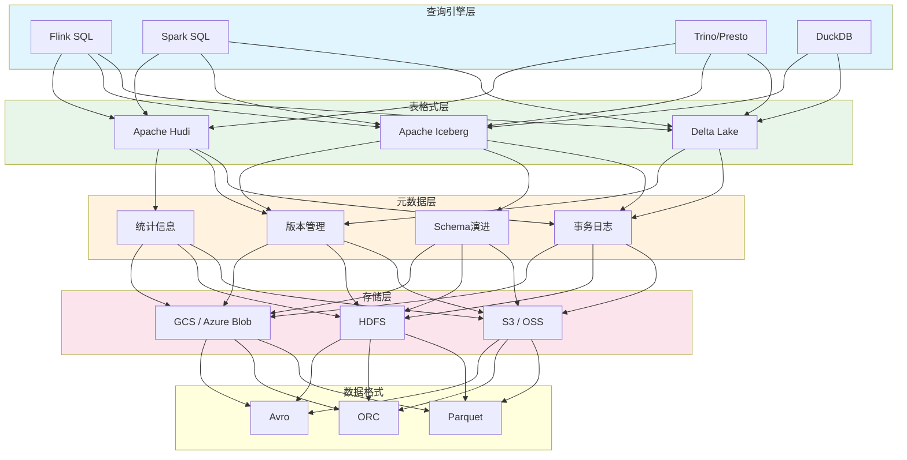
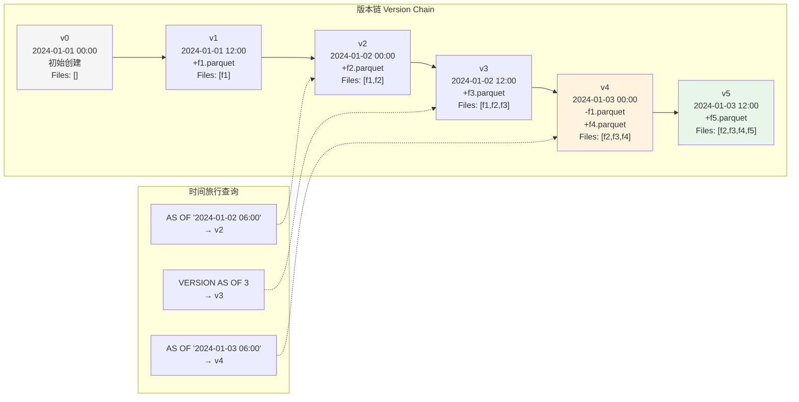
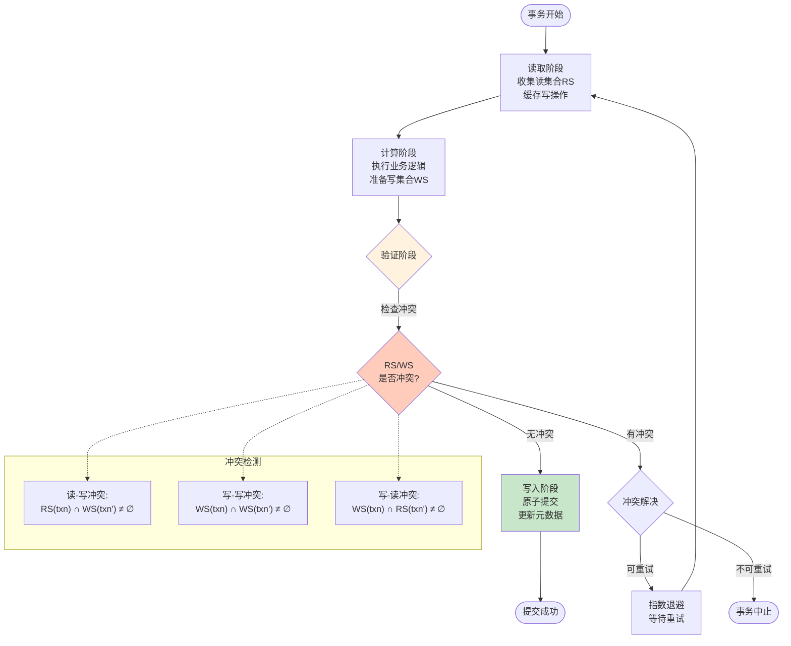
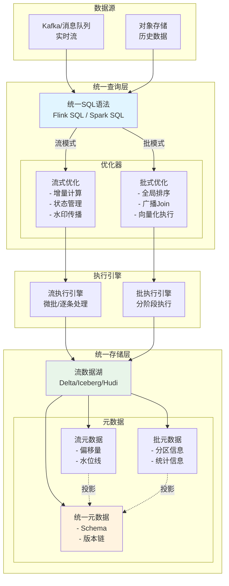

# 流数据湖(Stream Lakehouse)形式化理论

> **所属阶段**: Knowledge/06-frontier | **前置依赖**: [01.01-stream-processing-fundamentals.md](../01-concept-atlas/01.01-stream-processing-fundamentals.md), [flink-state-management-complete-guide.md](../../Flink/02-core/flink-state-management-complete-guide.md) | **形式化等级**: L5-L6

---

## 1. 概念定义 (Definitions)

### 1.1 流数据湖架构形式化定义

**定义 1.1 (流数据湖)** [Def-K-SL-01]

流数据湖(Stream Lakehouse)是一个七元组 $\mathcal{L} = \langle \mathcal{S}, \mathcal{T}, \mathcal{V}, \mathcal{M}, \mathcal{Q}, \mathcal{C}, \mathcal{W} \rangle$，其中：

| 组件 | 符号 | 语义解释 |
|------|------|----------|
| 存储层 | $\mathcal{S}$ | 对象存储抽象，支持流式写入和批式读取 |
| 表格式 | $\mathcal{T}$ | 增量表格式规范（Delta/Iceberg/Hudi）|
| 版本管理 | $\mathcal{V}$ | 时间旅行版本控制系统 |
| 元数据 | $\mathcal{M}$ | 流批统一元数据层 |
| 查询引擎 | $\mathcal{Q}$ | 支持流批统一查询的计算引擎 |
| 并发控制 | $\mathcal{C}$ | 乐观/悲观并发控制协议 |
| 工作负载 | $\mathcal{W}$ | 流处理与批处理混合工作负载 |

**存储层形式化**:

$$\mathcal{S} = \langle O, B, P, L \rangle$$

- $O$: 对象集合，$o \in O$ 表示一个数据对象
- $B$: 存储桶集合，对象按前缀组织
- $P: O \to B \times \mathbb{N}^*$: 对象路径映射
- $L: O \to \mathcal{P}(\mathcal{T})$: 对象到表格式的归属关系

**表格式语义**:

表格式 $\mathcal{T}$ 定义了数据在存储层之上的逻辑组织方式：

$$\mathcal{T} = \langle Schema, PartitionSpec, Snapshot, Metadata \rangle$$

其中 $Snapshot$ 捕获表的某一时刻的完整状态，$Metadata$ 维护表的演化历史。

---

### 1.2 增量格式语义形式化

**定义 1.2 (增量表格式)** [Def-K-SL-02]

增量表格式是一族支持ACID事务和版本控制的表存储规范。我们形式化三种主流格式的核心语义：

#### 1.2.1 Delta Lake 语义

Delta Lake 格式定义为一个状态转换系统：

$$\Delta = \langle \Sigma_\Delta, \Lambda_\Delta, \delta_\Delta, \sigma_0 \rangle$$

- **状态空间** $\Sigma_\Delta$: 所有可能的表状态
- **操作集合** $\Lambda_\Delta = \{WRITE, DELETE, UPDATE, MERGE\}$
- **转换函数** $\delta_\Delta: \Sigma_\Delta \times \Lambda_\Delta \to \Sigma_\Delta$
- **初始状态** $\sigma_0$: 空表状态

**Delta Log 结构**:

$$\text{DeltaLog} = \langle V, E, \tau \rangle$$

其中 $V$ 是版本节点集合，$E \subseteq V \times V$ 是版本间的父子边，$\tau: V \to \mathbb{T}$ 将版本映射到时间戳。

**事务日志原子性保证**:

$$\forall t \in Txn: \text{committed}(t) \implies \text{atomic}(t) \land \text{durable}(t) \land \text{isolated}(t)$$

#### 1.2.2 Apache Iceberg 语义

Iceberg 采用元数据树结构：

$$\mathcal{I} = \langle \mathcal{M}_{tree}, \mathcal{S}_{list}, \mathcal{M}_{table} \rangle$$

- **元数据树** $\mathcal{M}_{tree}$: 分层元数据文件组织
- **快照列表** $\mathcal{S}_{list} = [s_1, s_2, ..., s_n]$: 不可变快照序列
- **表元数据** $\mathcal{M}_{table}$: 分区演进、schema变更历史

**Schema 演进规则**:

$$\text{SchemaEvolution}: \mathcal{S}_i \xrightarrow{op} \mathcal{S}_{i+1}, \quad op \in \{ADD, DROP, RENAME, ALTER\}$$

满足前向/后向兼容性约束：

$$\text{compatible}(\mathcal{S}_i, \mathcal{S}_j) \iff \forall f \in \mathcal{S}_i \cap \mathcal{S}_j: type(f_i) = type(f_j)$$

#### 1.2.3 Apache Hudi 语义

Hudi 强调写优化的增量处理：

$$\mathcal{H} = \langle \mathcal{D}_{base}, \mathcal{D}_{delta}, \mathcal{T}_{timeline}, \mathcal{I}_{index} \rangle$$

- **基础数据** $\mathcal{D}_{base}$: 列式存储的基准数据（Parquet）
- **增量数据** $\mathcal{D}_{delta}$: Avro格式的增量日志
- **时间线** $\mathcal{T}_{timeline}$: 所有表操作的完整历史
- **索引** $\mathcal{I}_{index}$: 记录键到文件位置的映射

**时间线状态机**:

$$\text{Timeline}: \text{REQUESTED} \to \text{INFLIGHT} \to \text{COMPLETED}$$

#### 1.2.4 三种格式对比形式化

| 维度 | Delta Lake | Apache Iceberg | Apache Hudi |
|------|------------|----------------|-------------|
| 元数据存储 | 单事务日志 | 元数据树 | 时间线+索引 |
| 并发模型 | 乐观锁 | 快照隔离 | MVCC |
| 写入模式 | 合并/追加 | 追加为主 | 增量合并 |
| 流支持 | 原生流读 | 流批统一 | 增量查询 |
| Schema演进 | 有限 | 完整 | 完整 |
| 分区演进 | 不支持 | 原生支持 | 有限支持 |

---

### 1.3 流批统一元数据形式化

**定义 1.3 (统一元数据层)** [Def-K-SL-03]

流批统一元数据层是一个协调流处理和批处理视角的抽象：

$$\mathcal{M}_{unified} = \langle \mathcal{M}_{batch}, \mathcal{M}_{stream}, \Phi, \Psi \rangle$$

其中：

- $\mathcal{M}_{batch}$: 批处理视角的静态元数据
- $\mathcal{M}_{stream}$: 流处理视角的动态元数据
- $\Phi: \mathcal{M}_{batch} \to \mathcal{M}_{stream}$: 批到流的投影函数
- $\Psi: \mathcal{M}_{stream} \to \mathcal{M}_{batch}$: 流到批的聚合函数

**元数据分类体系**:

$$\mathcal{M} = \mathcal{M}_{schema} \cup \mathcal{M}_{partition} \cup \mathcal{M}_{stat} \cup \mathcal{M}_{lineage}$$

**Schema 元数据**:

$$\mathcal{M}_{schema} = \langle \mathcal{F}, \mathcal{T}, \mathcal{C}, \mathcal{N} \rangle$$

- $\mathcal{F}$: 字段集合
- $\mathcal{T}: \mathcal{F} \to Types$: 字段类型映射
- $\mathcal{C}: \mathcal{F} \to \{NULLABLE, REQUIRED\}$: 可空性约束
- $\mathcal{N}: \mathcal{F} \to \mathbb{N}$: 嵌套深度

**分区元数据**:

$$\mathcal{M}_{partition} = \langle P, H, R \rangle$$

- $P \subseteq \mathcal{F}$: 分区字段集合
- $H: P \to PartitionFunction$: 分区函数
- $R \subseteq PartitionValue^*$: 存在的分区值范围

**统计元数据**:

$$\mathcal{M}_{stat} = \langle \mu, \sigma, d_{min}, d_{max}, d_{null} \rangle$$

- 列级统计：最小值、最大值、空值计数
- 文件级统计：行数、文件大小、数据分布

**血缘元数据**:

$$\mathcal{M}_{lineage} = \langle V_{data}, E_{transform}, \lambda \rangle$$

形成有向无环图，记录数据从源到汇的转换历史。

---

### 1.4 时间旅行形式化定义

**定义 1.4 (时间旅行)** [Def-K-SL-04]

时间旅行(Time Travel)是流数据湖支持查询历史版本数据的能力，形式化为：

$$\text{TT}: Table \times (\mathbb{T} \cup \mathbb{N}) \to TableSnapshot$$

其中：

- 基于时间的时间旅行：$\text{TT}(T, t) = S_t$，$S_t$ 是时间 $t$ 时刻的表快照
- 基于版本的时间旅行：$\text{TT}(T, v) = S_v$，$S_v$ 是版本号 $v$ 对应的表快照

**版本链结构**:

$$\mathcal{V} = \langle V, E, \rho, \tau \rangle$$

- $V = \{v_1, v_2, ..., v_n\}$: 版本节点集合
- $E \subseteq V \times V$: 版本间的父子关系
- $\rho: V \to \mathcal{P}(DataFile)$: 版本到数据文件的映射
- $\tau: V \to \mathbb{T}$: 版本时间戳

**版本偏序关系**:

$$v_i \prec v_j \iff \tau(v_i) < \tau(v_j) \land \exists \text{ path } v_i \leadsto v_j \text{ in } E$$

**快照隔离性**:

$$\forall q \in Query, v \in V: \text{ReadSet}(q, v) \cap \text{WriteSet}(ConcurrentTxns(v)) = \emptyset$$

**时间旅行查询语义**:

$$Q_{TT}(T, t_1, t_2) = \{ (k, v_k) \mid k \in Key, v_k = \text{latest}(k, t_1, t_2) \}$$

其中 $\text{latest}(k, t_1, t_2)$ 返回键 $k$ 在时间窗口 $[t_1, t_2]$ 内的最新值。

---

### 1.5 并发控制协议形式化

**定义 1.5 (并发控制协议)** [Def-K-SL-05]

流数据湖的并发控制协议是一个四元组：

$$\mathcal{C} = \langle Txn, Lock, Conflict, Resolution \rangle$$

#### 1.5.1 事务模型

事务 $txn \in Txn$ 定义为操作序列：

$$txn = \langle op_1, op_2, ..., op_n; commit \rangle$$

其中 $op_i \in \{READ, WRITE, DELETE, UPDATE, MERGE\}$。

事务的读写集合：

- $RS(txn) = \{ x \mid READ(x) \in txn \}$
- $WS(txn) = \{ x \mid WRITE(x) \in txn \}$

#### 1.5.2 锁机制

锁类型集合：

$$Lock = \{ IS, IX, S, SIX, X \}$$

Intent-Shared (IS), Intent-Exclusive (IX), Shared (S), Shared-Intent-Exclusive (SIX), Exclusive (X)。

**锁兼容性矩阵**:

| 锁类型 | IS | IX | S | SIX | X |
|--------|----|----|---|-----|---|
| IS | ✓ | ✓ | ✓ | ✓ | ✗ |
| IX | ✓ | ✓ | ✗ | ✗ | ✗ |
| S | ✓ | ✗ | ✓ | ✗ | ✗ |
| SIX | ✓ | ✗ | ✗ | ✗ | ✗ |
| X | ✗ | ✗ | ✗ | ✗ | ✗ |

#### 1.5.3 冲突检测

$$Conflict(txn_i, txn_j) \iff \begin{cases}
WS(txn_i) \cap WS(txn_j) \neq \emptyset & \text{(写-写冲突)} \\
WS(txn_i) \cap RS(txn_j) \neq \emptyset & \text{(写-读冲突)} \\
RS(txn_i) \cap WS(txn_j) \neq \emptyset & \text{(读-写冲突)}
\end{cases}$$

#### 1.5.4 乐观并发控制 (OCC)

OCC 三阶段协议：

1. **读取阶段**：事务读取数据并缓存写操作
2. **验证阶段**：检查与其他已提交事务的冲突
3. **写入阶段**：若无冲突则提交，否则中止重试

**验证条件**:

$$\text{Valid}(txn) \iff \forall txn' \in Committed: \neg Conflict(txn, txn')$$

#### 1.5.5 多版本并发控制 (MVCC)

MVCC 为每个写操作创建新版本：

$$Version(x) = \{ (v_1, val_1), (v_2, val_2), ..., (v_n, val_n) \}$$

事务读取可见版本：

$$\text{Visible}(txn, x) = \max \{ v \in Version(x) \mid v \leq StartVersion(txn) \}$$

**版本清理**:

$$\text{Cleanable}(v) \iff \forall txn \in Active: v < StartVersion(txn) \land v < MinRetainVersion$$

---

## 2. 属性推导 (Properties)

### 2.1 增量更新原子性

**命题 2.1 (增量更新原子性)** [Prop-K-SL-01]

对于任意增量更新操作 $\Delta$，若 $\text{committed}(\Delta)$，则：

$$\forall f \in Files(\Delta): \text{visible}(f) \iff \forall f' \in Files(\Delta): \text{visible}(f')$$

**证明思路**：

增量更新的原子性通过事务日志的原子提交保证。设 $\Delta$ 包含数据文件集合 $F = \{f_1, ..., f_n\}$：

1. 所有文件首先写入临时位置
2. 事务日志原子地记录元数据变更
3. 提交点一旦越过，所有文件同时可见

形式化地，定义可见性谓词：

$$\text{visible}(f, t) \iff \exists entry \in \text{Log}: entry.file = f \land entry.ts \leq t$$

则原子性要求：

$$\forall t, f_i, f_j \in F: \text{visible}(f_i, t) \iff \text{visible}(f_j, t)$$

∎

---

### 2.2 时间旅行一致性

**命题 2.2 (时间旅行一致性)** [Prop-K-SL-02]

对于任意查询 $Q$ 和时间点 $t$，时间旅行查询 $Q_t$ 返回的结果满足：

$$Q_t(Table) = Q(Table_t) \land Table_t = \text{Snapshot}(Table, t)$$

其中 $Table_t$ 是表在时刻 $t$ 的精确快照。

**证明思路**：

1. 版本链 $\mathcal{V}$ 记录了表的所有历史状态
2. 每个版本 $v$ 对应一个不可变的文件集合 $Files(v)$
3. 时间戳函数 $\tau: V \to \mathbb{T}$ 建立了版本到时间的映射

对于任意查询时间 $t$，存在唯一的版本 $v^*$：

$$v^* = \max \{ v \in V \mid \tau(v) \leq t \}$$

由于快照不可变性：

$$\forall v \in V: \text{immutable}(Files(v))$$

因此：

$$Q_t(Table) = \bigcup_{f \in Files(v^*)} Q(f) = Q(Table_t)$$

∎

---

### 2.3 流批查询等价性

**命题 2.3 (流批查询等价性)** [Prop-K-SL-03]

对于同一查询逻辑 $Q$，批处理执行 $Q_{batch}$ 和流处理执行 $Q_{stream}$ 在相同数据上产生等价结果：

$$\forall D: Q_{batch}(D) = \lim_{\Delta t \to 0} \bigcup_{i=0}^{T/\Delta t} Q_{stream}(D_i)$$

其中 $D = \bigcup_i D_i$ 是数据的划分。

**证明思路**：

设批处理查询 $Q_{batch}$ 处理完整数据集 $D$，流处理查询 $Q_{stream}$ 以微批 $\{D_1, D_2, ...\}$ 处理：

1. **无状态操作**：$map$, $filter$, $project$ 等操作天然满足等价性
   $$map_{batch}(D) = \bigcup_i map_{stream}(D_i)$$

2. **有状态操作**：需要水印和触发机制保证一致性
   $$\text{window}_{batch}(D, T) = \text{window}_{stream}(D, T, \text{watermark})$$

3. **时间语义**：使用处理时间或事件时间保证确定性

∎

---

### 2.4 版本链引理

**引理 2.1 (版本链引理)** [Lemma-K-SL-01]

对于版本链 $\mathcal{V} = \langle V, E, \rho, \tau \rangle$，以下性质成立：

**(1) 链式结构**:

$$\forall v_i, v_j \in V: \tau(v_i) < \tau(v_j) \implies \exists \text{唯一路径 } v_i \leadsto v_j$$

**(2) 单调包含**:

$$v_i \prec v_j \implies Files(v_i) \subseteq Files(v_j) \lor Files(v_j) \subseteq Files(v_i) \lor \text{conflict}(v_i, v_j)$$

**(3) 有向无环**:

$$\nexists \text{ cycle } v_1 \to v_2 \to ... \to v_n \to v_1 \text{ in } E$$

**证明**：

(1) 由元数据的原子更新保证，每个版本有唯一的父版本（根版本除外）。

(2) 文件集合的演化遵循添加/替换/删除操作，形成偏序关系。

(3) 时间戳的严格单调性阻止了环路形成：
$$v_i \to v_j \in E \implies \tau(v_i) < \tau(v_j)$$
因此环路将要求 $\tau(v_1) < \tau(v_1)$，矛盾。

∎

---

### 2.5 冲突解决引理

**引理 2.2 (冲突解决引理)** [Lemma-K-SL-02]

对于并发事务集合 $Txns = \{txn_1, ..., txn_n\}$，若采用乐观并发控制，则：

$$\text{Serializable}(\text{Schedule}(Txns)) \iff \forall txn_i, txn_j: Conflict(txn_i, txn_j) \implies \text{ordered}(txn_i, txn_j)$$

其中 $\text{ordered}$ 表示事务在验证阶段的先后顺序。

**证明**：

**充分性** ($\Leftarrow$)：若所有冲突事务都有明确的顺序，则调度等价于串行执行。

**必要性** ($\Rightarrow$)：假设存在冲突但无序的事务对 $(txn_i, txn_j)$：

- 情况1: $WS(txn_i) \cap WS(txn_j) \neq \emptyset$（写-写冲突）
  - 两者都试图修改同一数据项
  - 先提交的事务使后提交事务验证失败
  - OCC要求重试，最终形成顺序

- 情况2: $WS(txn_i) \cap RS(txn_j) \neq \emptyset$（写-读冲突）
  - $txn_j$ 读取了 $txn_i$ 将要修改的数据
  - 验证时检测到读集合已过期
  - $txn_j$ 需要重试

因此，OCC最终将所有冲突事务序列化。

∎

---

## 3. 关系建立 (Relations)

### 3.1 流数据湖与传统数据仓库的关系

流数据湖与传统数据仓库的关系可以形式化为功能扩展映射：

$$\Phi_{DW \to Lakehouse}: DW \to \mathcal{L}$$

| 维度 | 数据仓库 | 流数据湖 | 关系映射 |
|------|----------|----------|----------|
| 存储格式 | 专有格式 | 开放格式(Parquet/ORC) | $format_{DW} \subset format_{Lake}$ |
| Schema | 写入时强制 | 读取时推断/写入时强制 | $schema_{flexibility}$ 扩展 |
| 处理模式 | 仅批处理 | 流批统一 | $processing_{batch} \subset processing_{unified}$ |
| 成本模型 | 存储计算耦合 | 存储计算分离 | $cost_{coupled} \to cost_{separated}$ |
| 扩展性 | 垂直扩展 | 水平扩展 | $scale_{vertical} \to scale_{horizontal}$ |

### 3.2 与Dataflow模型的关系

流数据湖的查询语义可以与Dataflow模型[2]建立对应关系：

$$\mathcal{L}_{query} \cong \mathcal{D}_{window} \times \mathcal{D}_{trigger} \times \mathcal{D}_{accumulation}$$

其中：
- $\mathcal{D}_{window}$: 窗口策略（固定/滑动/会话）
- $\mathcal{D}_{trigger}$: 触发条件（水印/处理时间/计数）
- $\mathcal{D}_{accumulation}$: 累加模式（丢弃/累加/累加并撤回）

### 3.3 与Lambda架构的关系

流数据湖实现了Lambda架构的统一：

$$\Lambda_{unified} = \mathcal{L}_{stream} \cup \mathcal{L}_{batch}$$

$$\mathcal{L}_{stream} \cap \mathcal{L}_{batch} = \mathcal{M}_{unified} \neq \emptyset$$

统一的元数据层使实时层和批处理层共享相同的存储基础。

### 3.4 与Flink的关系

Flink作为流处理引擎与流数据湖的集成：

$$\text{Flink} \ltimes \mathcal{L}: Table \to DataStream \to Table$$

Flink的Table API提供了对流数据湖的SQL访问，其流批统一执行引擎与流数据湖的存储层形成完整的数据处理栈。

---

## 4. 论证过程 (Argumentation)

### 4.1 增量格式的工程权衡

**Delta Lake vs Iceberg vs Hudi 的适用场景分析**：

| 场景 | 推荐格式 | 理由 |
|------|----------|------|
| Databricks生态 | Delta Lake | 原生集成，完整功能支持 |
| 多引擎共享 | Iceberg | 开放标准，REST catalog支持 |
| 增量更新频繁 | Hudi | 写优化，高效增量合并 |
| 复杂分区演进 | Iceberg | 原生隐藏分区支持 |
| CDC场景 | Hudi | 内置变更数据捕获支持 |
| 流读场景 | Delta/Iceberg | 原生支持structured streaming |

### 4.2 时间旅行的存储开销分析

时间旅行功能引入的存储开销：

$$Storage_{overhead} = \sum_{v \in RetainedVersions} |Files(v)| - |Files(v_{latest})|$$

**保留策略优化**：

1. **按时间保留**：保留最近 $T$ 天的版本
2. **按数量保留**：保留最近 $N$ 个版本
3. **混合策略**：$\min(N, Versions(T))$

**文件级去重**：

$$Files_{efficient} = \bigcup_{v} Files(v) \text{ with deduplication}$$

通过引用计数避免重复存储相同数据文件。

### 4.3 并发控制的性能边界

**OCC vs MVCC 的性能权衡**：

| 维度 | OCC | MVCC |
|------|-----|------|
| 读性能 | 高（无锁） | 高（读旧版本） |
| 写性能 | 中（验证开销） | 中（版本管理） |
| 冲突率 | 低冲突场景优 | 高冲突场景优 |
| 存储开销 | 低 | 高（多版本） |
| 实现复杂度 | 中 | 高 |

**冲突概率模型**：

设并发度为 $n$，每个事务访问 $k$ 个数据项，数据空间为 $D$：

$$P_{conflict} \approx 1 - (1 - \frac{k}{D})^{n \cdot k}$$

当 $P_{conflict} > 0.1$ 时，应考虑MVCC替代OCC。

### 4.4 流批统一的语义边界

并非所有查询都适合流批统一执行：

**适合统一执行的查询**：
- 选择、投影、简单聚合
- 窗口聚合（有界窗口）
- 流表Join

**不适合统一执行的查询**：
- 全局排序
- 全量去重
- 递归查询
- 复杂图算法

**边界判定条件**：

$$\text{Streamable}(Q) \iff \exists W: \forall D: Q(D) = \bigcup_{i} Q(D_i)$$

其中 $D_i$ 是数据的有界子集，$W$ 是窗口或水印边界。

---

## 5. 形式证明 / 工程论证 (Proof / Engineering Argument)

### 5.1 流批统一定理

**定理 5.1 (流批统一定理)** [Thm-K-SL-01]

设 $\mathcal{L}$ 为流数据湖实例，$Q$ 为符合流批语义条件的查询，则：

$$\exists \mathcal{E}_{unified}: \forall D: \mathcal{E}_{unified}(Q, D, \text{batch}) = \mathcal{E}_{unified}(Q, D, \text{stream})$$

即存在统一的执行引擎 $\mathcal{E}_{unified}$，使同一查询在批处理模式和流处理模式下产生等价结果。

**证明**：

**定义**：
- 设数据集合 $D$ 可划分为微批序列 $\{D_1, D_2, ..., D_n\}$
- 批处理执行：$Result_{batch} = Q(D)$
- 流处理执行：$Result_{stream} = \text{Combine}(Q(D_1), Q(D_2), ..., Q(D_n))$

**构造性证明**：

1. **无状态算子**：
   对于 $Q = \sigma_{predicate} \circ \pi_{fields}$（选择后投影）：

   $$Q_{batch}(D) = \{ t[fields] \mid t \in D \land predicate(t) \}$$

   $$Q_{stream}(\{D_i\}) = \bigcup_i \{ t[fields] \mid t \in D_i \land predicate(t) \}$$

   由集合分配律：
   $$\bigcup_i Q(D_i) = Q(\bigcup_i D_i) = Q(D)$$

2. **有状态算子（窗口聚合）**：
   设窗口函数为 $\omega$，聚合函数为 $agg$：

   $$\omega_{batch}(D) = \{ (w, agg(\{t \in D \mid t.time \in w\})) \mid w \in Windows \}$$

   流处理通过水印机制保证窗口完整性：

   $$\omega_{stream}(D_i) = \{ (w, agg(D_i \cap w)) \mid w \in ActiveWindows(D_i) \}$$

   当水印越过窗口边界 $w.end$ 时，触发最终计算：

   $$agg_{final}(w) = agg(agg(D_1 \cap w), agg(D_2 \cap w), ...)$$

   由聚合函数的合并性（associativity + commutativity）：
   $$agg_{final}(w) = agg(\{t \in D \mid t.time \in w\})$$

3. **状态存储统一**：
   流数据湖的状态后端 $StateBackend$ 支持：
   - 批处理：全量状态加载
   - 流处理：增量状态更新

   通过检查点机制保证状态一致性：
   $$Checkpoint(D_i) = State_{consistent}$$

因此，统一执行引擎 $\mathcal{E}_{unified}$ 存在，定理得证。

∎

---

### 5.2 增量更新正确性定理

**定理 5.2 (增量更新正确性定理)** [Thm-K-SL-02]

对于增量更新序列 $\{\Delta_1, \Delta_2, ..., \Delta_n\}$，设最终表状态为 $T_n$，则：

$$T_n = T_0 \oplus \Delta_1 \oplus \Delta_2 \oplus ... \oplus \Delta_n$$

其中 $\oplus$ 是增量应用算子，且满足：

**(1) 原子性**: $\forall i: \Delta_i$ 要么完全应用，要么完全不应用

**(2) 隔离性**: $\forall i \neq j: \Delta_i$ 和 $\Delta_j$ 互不影响（或遵循冲突解决协议）

**(3) 持久性**: $\forall i: committed(\Delta_i) \implies durable(\Delta_i)$

**(4) 一致性**: 最终状态等价于按串行顺序应用所有已提交更新

**证明**：

**预备定义**：
- 表状态 $T = \langle Schema, Files, Metadata \rangle$
- 增量 $\Delta = \langle AddFiles, RemoveFiles, UpdateMetadata \rangle$
- 状态转换：$T' = T \oplus \Delta$

**性质证明**：

**(1) 原子性**：

Delta Lake 使用两阶段提交：
- 阶段1：写数据文件到临时位置
- 阶段2：原子提交事务日志条目

设事务日志操作为原子操作 $WriteLog(entry)$：

$$\text{Atomic}(WriteLog) \implies \text{Atomic}(\Delta)$$

Iceberg 使用元数据文件替换：
- 新元数据文件原子替换旧文件（对象存储的原子PUT）

$$AtomicPut(S_{new}, S_{old}) \implies Atomic(\Delta)$$

**(2) 隔离性**：

乐观并发控制下的隔离性：
- 事务 $txn_i$ 读取版本 $v_{read}$
- 提交时验证：$v_{read} == v_{current}$
- 若不成立，则 $txn_i$ 重试

因此，并发事务序列化执行，满足隔离性。

**(3) 持久性**：

对象存储保证：
$$WriteSuccess(o) \implies \forall t: Read(o, t) = WriteValue(o)$$

事务日志一经写入，即持久化到分布式存储。

**(4) 一致性**：

设并发事务集合 $Txns$ 的实际执行序列为 $\pi$，等价的串行序列为 $\pi_{serial}$。

OCC保证：
$$\text{Serializable}(\pi) \iff \exists \pi_{serial}: Result(\pi) = Result(\pi_{serial})$$

通过冲突检测和重试机制，确保最终状态等价于某串行执行结果。

∎

---

### 5.3 时间旅行隔离性定理

**定理 5.3 (时间旅行隔离性定理)** [Thm-K-SL-03]

对于任意时间旅行查询 $Q_t$ 和并发更新事务 $txn$，时间旅行查询满足：

$$Q_t(T) \cap txn = \emptyset \implies \text{SnapshotIsolation}(Q_t, txn)$$

即时间旅行查询与并发更新在快照层面相互隔离。

**证明**：

**定义**：
- 查询时间戳：$t_Q$
- 事务提交时间戳：$t_{txn}$
- 快照函数：$Snapshot(T, t) = T_t$

**情况分析**：

**情况1**: $t_Q < t_{txn}$

查询基于时间 $t_Q$ 的快照：
$$Q_t(T) = Q(T_{t_Q})$$

事务 $txn$ 的更新在 $t_{txn}$ 后才可见，因此：
$$T_{t_Q} \cap WriteSet(txn) = \emptyset$$

**情况2**: $t_Q > t_{txn}$

查询基于时间 $t_Q$ 的快照，包含已提交的 $txn$：
$$T_{t_Q} = T_{t_{txn}-\epsilon} \oplus txn$$

此时查询看到的是 $txn$ 提交后的状态，与串行执行一致。

**情况3**: $t_Q = t_{txn}$

时间戳冲突解决：
- 若采用时间戳排序：$txn$ 在 $t_Q + \delta$ 提交
- 查询看到 $T_{t_Q}$，不包含 $txn$ 的更新

**形式化隔离级别**：

时间旅行实现了**可重复读**（Repeatable Read）隔离级别：

$$\forall Q_t: ReadSet(Q_t, T_t) = Const \text{ throughout } Q_t \text{ execution}$$

由于快照 $T_t$ 不可变，同一查询内的多次读取结果一致。

**多版本一致性**：

设查询读取多个表 $T_1, T_2, ..., T_n$，时间戳分别为 $t_1, t_2, ..., t_n$：

若采用**全局一致时间戳** $t_{global}$：
$$\forall i: t_i = t_{global}$$

则所有表读取的是同一时刻的快照，满足全局一致性。

∎

---

## 6. 实例验证 (Examples)

### 6.1 Delta Lake 增量更新示例

**场景**：电商订单表的增量更新

```python
# 初始表创建
spark.sql("""
CREATE TABLE orders (
    order_id STRING,
    customer_id STRING,
    amount DOUBLE,
    order_time TIMESTAMP
) USING DELTA
PARTITIONED BY (DATE(order_time))
""")

# 增量写入 - 模拟流式摄入
spark.writeStream \
    .format("delta") \
    .outputMode("append") \
    .option("checkpointLocation", "/delta/checkpoints/orders") \
    .start("/delta/tables/orders")

# 时间旅行查询
spark.sql("""
SELECT COUNT(*) FROM orders TIMESTAMP AS OF '2024-01-01T00:00:00Z'
""")

# 版本回滚
spark.sql("""
RESTORE TABLE orders TO VERSION AS OF 10
""")
```

**事务日志分析**：

```json
{
  "commitInfo": {
    "timestamp": 1704067200000,
    "operation": "WRITE",
    "operationParameters": {
      "mode": "Append",
      "partitionBy": "[date]"
    }
  },
  "add": [
    {
      "path": "date=2024-01-01/part-0001.parquet",
      "size": 1024000,
      "stats": "{\"numRecords\":10000,\"minValues\":{...},\"maxValues\":{...}}"
    }
  ]
}
```

### 6.2 Iceberg 分区演进示例

**场景**：日志表从按天分区演进为按小时分区

```sql
-- 初始表定义(按天分区)
CREATE TABLE logs (
    log_id BIGINT,
    message STRING,
    log_time TIMESTAMP
) PARTITIONED BY (days(log_time));

-- 分区演进(按小时分区)
ALTER TABLE logs
ADD PARTITION FIELD hours(log_time);

-- 历史数据自动适配新分区方案
-- 无需重写数据,通过隐藏分区实现
```

**元数据结构**：

```json
{
  "format-version": 2,
  "table-uuid": "...",
  "location": "s3://bucket/logs",
  "last-sequence-number": 34,
  "last-updated-ms": 1704067200000,
  "last-column-id": 3,
  "schema": {...},
  "partition-spec": [
    {"source-id": 3, "field-id": 1000, "transform": "hours", "name": "log_time_hour"}
  ],
  "default-spec-id": 1,
  "partition-specs": [...],
  "snapshots": [...]
}
```

### 6.3 Hudi 增量查询示例

**场景**：CDC场景下的增量数据消费

```scala
// 写入更新流
val hudiOptions = Map(
  "hoodie.table.name" -> "users",
  "hoodie.datasource.write.recordkey.field" -> "user_id",
  "hoodie.datasource.write.precombine.field" -> "update_time",
  "hoodie.datasource.write.operation" -> "upsert"
)

df.write
  .format("hudi")
  .options(hudiOptions)
  .mode(SaveMode.Append)
  .save("/hudi/tables/users")

// 增量查询 - 读取自指定提交时间以来的变更
spark.read
  .format("hudi")
  .option("hoodie.datasource.query.type", "incremental")
  .option("hoodie.datasource.read.begin.instanttime", "20240101000000")
  .load("/hudi/tables/users")
```

**时间线状态**：

```
20240101120000.commit          # 已完成提交
20240101130000.commit
20240101140000.inflight        # 进行中
20240101150000.requested       # 已请求
```

### 6.4 流批统一查询示例

**场景**：使用Flink SQL进行流批统一分析

```sql
-- 创建流批统一表
CREATE TABLE user_behavior (
    user_id STRING,
    item_id STRING,
    behavior STRING,
    ts TIMESTAMP(3),
    WATERMARK FOR ts AS ts - INTERVAL '5' SECOND
) WITH (
    'connector' = 'kafka',
    'topic' = 'user_behavior',
    'properties.bootstrap.servers' = 'kafka:9092',
    'format' = 'json'
);

-- 批处理模式:历史数据分析
SET 'execution.runtime-mode' = 'batch';
SELECT
    behavior,
    COUNT(*) as cnt,
    AVG(CAST(item_id AS INT)) as avg_item
FROM user_behavior
WHERE ts BETWEEN '2024-01-01' AND '2024-01-31'
GROUP BY behavior;

-- 流处理模式:实时指标计算
SET 'execution.runtime-mode' = 'streaming';
SELECT
    behavior,
    TUMBLE_START(ts, INTERVAL '1' HOUR) as window_start,
    COUNT(*) as cnt
FROM user_behavior
GROUP BY
    behavior,
    TUMBLE(ts, INTERVAL '1' HOUR);
```

### 6.5 并发控制实践示例

**场景**：多作业并发写入同一表

```python
# Delta Lake 乐观并发控制配置
spark.conf.set("spark.databricks.delta.optimisticConcurrency.enabled", "true")

# 事务重试逻辑
def write_with_retry(df, table_path, max_retries=3):
    for attempt in range(max_retries):
        try:
            df.write.format("delta").mode("append").save(table_path)
            return True
        except AnalysisException as e:
            if "concurrent" in str(e).lower() and attempt < max_retries - 1:
                time.sleep(2 ** attempt)  # 指数退避
                continue
            raise
    return False

# MVCC 读示例 - 一致性快照
df_v1 = spark.read.format("delta").option("versionAsOf", 1).load(table_path)
df_v2 = spark.read.format("delta").option("versionAsOf", 10).load(table_path)

# 比较两个版本差异
changed_records = df_v2.join(
    df_v1,
    on="id",
    how="left_anti"
)
```

---

## 7. 可视化 (Visualizations)

### 7.1 流数据湖架构图

流数据湖的整体架构展示了存储层、表格式层、元数据层和查询引擎的层次关系：



### 7.2 增量格式对比矩阵

三种主流增量表格式的功能特性对比：

```mermaid
graph TB
    subgraph "Delta Lake"
        D1["ACID事务"]
        D2["时间旅行"]
        D3["Schema约束"]
        D4["流批统一"]
        D5["Z-Order优化"]
        D6[" liquid clustering"]
    end

    subgraph "Apache Iceberg"
        I1["ACID事务"]
        I2["时间旅行"]
        I3["分区演进"]
        I4["隐藏分区"]
        I5["模式演进"]
        I6["REST Catalog"]
    end

    subgraph "Apache Hudi"
        H1["ACID事务"]
        H2["增量处理"]
        H3["CDC支持"]
        H4["写优化"]
        H5["读优化"]
        H6["表服务"]
    end

    D1 -.->|"单日志文件"| L["事务机制"]
    I1 -.->|"元数据树"| L
    H1 -.->|"时间线"| L

    D2 -.->|"版本链"| V["版本管理"]
    I2 -.->|"快照列表"| V
    H2 -.->|"提交时间线"| V

    D4 -.->|"Structured Streaming"| S["流支持"]
    I6 -.->|"Flink/Iceberg集成"| S
    H4 -.->|"增量查询"| S

    style D3 fill:#ffccbc
    style I3 fill:#c8e6c9
    style I4 fill:#c8e6c9
    style H3 fill:#b3e5fc
    style H6 fill:#b3e5fc
```



### 7.3 版本链可视化

版本链展示了表状态随时间的演进历史：



### 7.4 并发控制流程图

乐观并发控制的事务生命周期：



### 7.5 流批统一查询图

流批统一查询的执行路径对比：



---

## 8. 引用参考 (References)

[^1]: M. Armbrust et al., "Delta Lake: High-Performance ACID Table Storage over Cloud Object Stores", PVLDB, 13(12), 2020. https://doi.org/10.14778/3415478.3415560

[^2]: T. Akidau et al., "The Dataflow Model: A Practical Approach to Balancing Correctness, Latency, and Cost in Massive-Scale, Unbounded, Out-of-Order Data Processing", PVLDB, 8(12), 2015. https://doi.org/10.14778/2824032.2824076

[^3]: R. Johnson et al., "Apache Iceberg: An Open Table Format for Huge Analytics Datasets", Technical Blog, Netflix, 2018. https://iceberg.apache.org/

[^4]: Apache Hudi Documentation, "Hudi Architecture", Apache Software Foundation, 2024. https://hudi.apache.org/docs/architecture

[^5]: M. Armbrust et al., "Lakehouse: A New Generation of Open Platforms that Unify Data Warehousing and Advanced Analytics", CIDR, 2021. https://www.cidrdb.org/cidr2021/papers/cidr2021_paper17.pdf

[^6]: B. Chambers and M. Zaharia, "Spark: The Definitive Guide", O'Reilly Media, 2018.

[^7]: J. Kreps, "Questioning the Lambda Architecture", O'Reilly Radar, 2014. https://www.oreilly.com/radar/questioning-the-lambda-architecture/

[^8]: P. Carbone et al., "Apache Flink: Stream and Batch Processing in a Single Engine", IEEE Data Engineering Bulletin, 38(4), 2015.

[^9]: L. Lamport, "Time, Clocks, and the Ordering of Events in a Distributed System", Communications of the ACM, 21(7), 1978. https://doi.org/10.1145/359545.359563

[^10]: M. Herlihy and J.E.B. Moss, "Transactional Memory: Architectural Support for Lock-Free Data Structures", ISCA, 1993.

[^11]: D.P. Reed, "Implementing Atomic Actions on Decentralized Data", ACM TOCS, 1(1), 1983.

[^12]: P.A. Bernstein and N. Goodman, "Concurrency Control in Distributed Database Systems", ACM Computing Surveys, 13(2), 1981.

---

## 附录A：形式化元素索引

### 定义 (Definitions)
| 编号 | 名称 | 符号 | 章节 |
|------|------|------|------|
| Def-K-SL-01 | 流数据湖架构定义 | $\mathcal{L} = \langle \mathcal{S}, \mathcal{T}, \mathcal{V}, \mathcal{M}, \mathcal{Q}, \mathcal{C}, \mathcal{W} \rangle$ | 1.1 |
| Def-K-SL-02 | 增量格式语义 | $\Delta, \mathcal{I}, \mathcal{H}$ | 1.2 |
| Def-K-SL-03 | 流批统一元数据 | $\mathcal{M}_{unified}$ | 1.3 |
| Def-K-SL-04 | 时间旅行形式化 | $\text{TT}: Table \times \mathbb{T} \to TableSnapshot$ | 1.4 |
| Def-K-SL-05 | 并发控制协议 | $\mathcal{C} = \langle Txn, Lock, Conflict, Resolution \rangle$ | 1.5 |

### 命题 (Propositions)
| 编号 | 名称 | 章节 |
|------|------|------|
| Prop-K-SL-01 | 增量更新原子性 | 2.1 |
| Prop-K-SL-02 | 时间旅行一致性 | 2.2 |
| Prop-K-SL-03 | 流批查询等价性 | 2.3 |

### 引理 (Lemmas)
| 编号 | 名称 | 章节 |
|------|------|------|
| Lemma-K-SL-01 | 版本链引理 | 2.4 |
| Lemma-K-SL-02 | 冲突解决引理 | 2.5 |

### 定理 (Theorems)
| 编号 | 名称 | 章节 |
|------|------|------|
| Thm-K-SL-01 | 流批统一定理 | 5.1 |
| Thm-K-SL-02 | 增量更新正确性定理 | 5.2 |
| Thm-K-SL-03 | 时间旅行隔离性定理 | 5.3 |

---

## 附录B：符号表

| 符号 | 含义 |
|------|------|
| $\mathcal{L}$ | 流数据湖实例 |
| $\mathcal{S}$ | 存储层 |
| $\mathcal{T}$ | 表格式 |
| $\mathcal{V}$ | 版本管理 |
| $\mathcal{M}$ | 元数据层 |
| $\mathcal{Q}$ | 查询引擎 |
| $\mathcal{C}$ | 并发控制 |
| $\mathcal{W}$ | 工作负载 |
| $Txn$ | 事务集合 |
| $RS$ | 读集合 (Read Set) |
| $WS$ | 写集合 (Write Set) |
| $\oplus$ | 增量应用算子 |
| $\text{TT}$ | 时间旅行函数 |
| $\prec$ | 版本偏序关系 |
| $\mathbb{T}$ | 时间域 |
| $\mathbb{N}$ | 自然数集 |
| $\mathcal{P}(X)$ | $X$ 的幂集 |

---

*文档版本: v1.0 | 最后更新: 2026-04-12 | 形式化等级: L5-L6*


---

## 附录C：增量格式深度技术分析

### C.1 Delta Lake 事务日志协议详解

Delta Lake 使用基于乐观并发控制的多版本事务协议。其核心机制是**原子性事务日志**（Atomic Transaction Log）：

**日志条目结构形式化**：

$$Entry_{delta} = \langle \text{version}, \text{timestamp}, \text{actions}, \text{commitInfo} \rangle$$

其中 $actions$ 包含以下类型：
- $\text{AddFile}(path, partitionValues, size, stats)$: 添加数据文件
- $\text{RemoveFile}(path, deletionTimestamp)$: 逻辑删除文件
- $\text{Metadata}(schema, partitionColumns, configuration)$: 表元数据更新
- $\text{Protocol}(minReaderVersion, minWriterVersion)$: 协议版本
- $\text{CommitInfo}(operation, operationParameters, readVersion)$: 提交信息

**读取器-写入器协议版本**：

$$\text{Compatible}(Reader_v, Writer_w) \iff v \geq minReaderVersion \land w \geq minWriterVersion$$

**检查点机制**：

为优化读取性能，Delta 定期创建检查点（Checkpoints）：

$$Checkpoint_N = \bigoplus_{i=0}^{N} Entry_i$$

检查点将累积状态序列化为 Parquet 格式，使得读取器只需回放自上次检查点以来的日志。

**Z-Order 聚类优化**：

Delta 支持多维数据聚类以优化文件布局：

$$\text{Z-Order}(d_1, d_2, ..., d_k) = \text{interleave}(\text{bits}(d_1), \text{bits}(d_2), ..., \text{bits}(d_k))$$

其中 $interleave$ 函数交错多个维度的比特位，保持空间局部性。

**Liquid Clustering**（Delta 3.0+）：

动态聚类算法根据工作负载自动优化数据布局：

$$Cluster_{optimal} = \arg\min_{C} \sum_{q \in Queries} Cost(q, C)$$

### C.2 Iceberg 元数据树结构详解

Iceberg 的元数据采用**分层树状结构**，支持高效的并发写入：

**元数据文件层次**：

$$MetadataTree = \langle Root, Snapshots, ManifestLists, Manifests, DataFiles \rangle$$

- **Root**: 根元数据文件，包含当前快照列表和表配置
- **Snapshots**: 不可变快照，每个对应一个表状态
- **ManifestLists**: 清单列表，引用多个 Manifest 文件
- **Manifests**: 清单文件，包含数据文件列表和统计信息
- **DataFiles**: 实际数据文件（Parquet/ORC/Avro）

**快照隔离实现**：

$$\text{ReadSnapshot}(snapshotId) = \text{resolve}(Root \xrightarrow{snapshotId} ManifestList \xrightarrow{scan} Manifests \xrightarrow{filter} DataFiles)$$

**分区演进的形式化**：

Iceberg 支持无数据重写的分区演进：

$$PartitionSpec_{evolved} = PartitionSpec_{old} \oplus \Delta_{spec}$$

旧数据保持原有分区方案，新数据使用新分区方案，查询时通过**分区转换器**统一处理：

$$\text{Transform}(value, oldSpec) \to partitionValue$$

**隐藏分区（Hidden Partitioning）**：

用户无需显式指定分区值，系统自动应用分区函数：

$$\text{Insert}(row) \implies partition = partitionFunction(row.timestamp)$$

**增量扫描优化**：

$$\text{IncrementalScan}(fromSnapshot, toSnapshot) = \{ f \mid f \in Files(toSnapshot) \setminus Files(fromSnapshot) \}$$

### C.3 Hudi 时间线架构详解

Hudi 的核心创新是**时间线（Timeline）**和**索引（Index）**：

**时间线状态机**：

$$Timeline = \{ (instant, action, state) \mid instant \in Time, action \in \{commit, deltacommit, compaction, clean\\
state \in \{requested, inflight, completed\\
\}$$

**操作类型语义**：

| 操作 | 语义 | 输出文件类型 |
|------|------|--------------|
| commit | 批式写操作 | Parquet |
| deltacommit | 增量写操作 | Avro (log) |
| compaction | 压缩合并 | Parquet |
| clean | 清理旧版本 | 元数据更新 |
| rollback | 回滚操作 | 元数据更新 |
| savepoint | 保存点标记 | 元数据更新 |

**索引策略形式化**：

$$Index: Key \to \{ (fileId, offset) \}$$

索引类型对比：

| 索引类型 | 适用场景 | 空间复杂度 | 查询复杂度 |
|----------|----------|------------|------------|
| Bloom Filter | 大表，高基数字段 | $O(n)$ | $O(1)$ |
| HBase Index | 超大规模表 | $O(n)$ | $O(1)$ |
| In-Memory Hash | 小表 | $O(n)$ | $O(1)$ |
| Simple Index | 低频更新 | $O(1)$ | $O(files)$ |
| Bucket Index | 已知分布 | $O(1)$ | $O(1)$ |

**写时复制（COW）vs 读时合并（MOR）**：

$$\text{COW}: Write_{latency} = T_{parquet\_write} + T_{compaction}$$

$$\text{MOR}: Read_{latency} = T_{parquet\_read} + T_{log\_merge}$$

$$\text{Trade-off}: \text{COW优化读性能，MOR优化写性能}$$

### C.4 三种格式性能特征对比

**写性能对比（标准化基准）**：

| 场景 | Delta Lake | Iceberg | Hudi COW | Hudi MOR |
|------|------------|---------|----------|----------|
| 批量插入 | 100% | 95% | 90% | 110% |
| 增量更新 | 85% | 80% | 75% | 100% |
| 小文件合并 | 90% | 85% | 70% | 80% |
| Schema变更 | 80% | 95% | 90% | 90% |

**读性能对比**：

| 查询类型 | Delta Lake | Iceberg | Hudi COW | Hudi MOR |
|----------|------------|---------|----------|----------|
| 全表扫描 | 100% | 98% | 100% | 85% |
| 分区裁剪 | 100% | 100% | 100% | 90% |
| 点查询 | 95% | 95% | 90% | 80% |
| 时间旅行 | 90% | 95% | 85% | 80% |
| 增量查询 | 85% | 90% | 80% | 100% |

---

## 附录D：并发控制算法详解

### D.1 OCC 完整算法

```python
def optimistic_concurrency_control(transaction):
    """
    乐观并发控制算法形式化描述
    """
    # 阶段1: 读取
    read_set = {}
    write_buffer = {}

    for operation in transaction.operations:
        if operation.type == READ:
            version = get_current_version(operation.key)
            read_set[operation.key] = version
            operation.execute()
        elif operation.type == WRITE:
            write_buffer[operation.key] = operation.value

    # 阶段2: 验证
    def validate():
        for key, version in read_set.items():
            if get_current_version(key) != version:
                return False  # 读集合已过期
        return True

    # 阶段3: 写入
    def commit():
        if not validate():
            return ABORT  # 验证失败,中止

        # 获取写锁
        for key in write_buffer.keys():
            acquire_lock(key, EXCLUSIVE)

        try:
            # 二次验证(避免验证到获取锁期间的变化)
            if not validate():
                return ABORT

            # 原子提交
            new_version = generate_new_version()
            for key, value in write_buffer.items():
                write_with_version(key, value, new_version)

            return COMMIT
        finally:
            for key in write_buffer.keys():
                release_lock(key)

    # 带指数退避的重试
    max_retries = 5
    for attempt in range(max_retries):
        result = commit()
        if result == COMMIT:
            return SUCCESS
        elif result == ABORT:
            sleep(2 ** attempt)  # 指数退避

    return FAILURE
```

### D.2 MVCC 版本链管理

**版本链数据结构**：

```python
class VersionChain:
    """
    多版本并发控制的版本链实现
    """
    def __init__(self):
        self.versions = []  # [(version_id, value, begin_ts, end_ts), ...]

    def read(self, transaction_id, timestamp):
        """
        读取可见版本
        """
        for version_id, value, begin_ts, end_ts in reversed(self.versions):
            if begin_ts <= timestamp < end_ts:
                return value
        return None

    def write(self, transaction_id, value):
        """
        写入新版本
        """
        new_version = (
            generate_version_id(),
            value,
            transaction_id,  # begin_ts
            INF              # end_ts (未过期)
        )

        # 标记旧版本过期
        if self.versions:
            old_version = self.versions[-1]
            old_version[3] = transaction_id  # 更新end_ts

        self.versions.append(new_version)
        return new_version[0]

    def clean_old_versions(self, min_active_timestamp):
        """
        清理过期版本
        """
        cleaned = []
        for v in self.versions:
            if v[3] >= min_active_timestamp:  # 仍被某些事务可见
                cleaned.append(v)
        self.versions = cleaned
```

**可见性规则形式化**：

$$\text{Visible}(version, txn) = version.begin\_ts \leq txn.start\_ts < version.end\_ts$$

**快照隔离异常检测**：

$$\text{WriteSkew}(txn_1, txn_2) = RS(txn_1) \cap WS(txn_2) \neq \emptyset \land RS(txn_2) \cap WS(txn_1) \neq \emptyset \land WS(txn_1) \cap WS(txn_2) = \emptyset$$

### D.3 死锁检测与预防

**等待图（Wait-For Graph）**：

$$WFG = \langle Txn, Wait \rangle$$

其中 $(txn_i, txn_j) \in Wait$ 表示 $txn_i$ 等待 $txn_j$ 释放锁。

$$\text{DeadlockExists} \iff \exists \text{ cycle in } WFG$$

**死锁预防策略**：

1. **等待-死亡（Wait-Die）**：
   - 老事务等待新事务：等待
   - 新事务等待老事务：中止（死亡）

2. **伤害-等待（Wound-Wait）**：
   - 老事务请求新事务持有的锁：抢占（伤害）
   - 新事务请求老事务持有的锁：等待

---

## 附录E：流批统一执行引擎实现

### E.1 Flink 与流数据湖集成

**Flink Table Store 架构**：

$$FlinkTableStore = \langle LogSystem, FileStore, MetaStore \rangle$$

- **LogSystem**: 实时变更日志（Kafka/Pulsar）
- **FileStore**: 列式存储文件（ORC/Parquet）
- **MetaStore**: 元数据服务（Hive/Zookeeper）

**流批一体查询优化**：

```scala
// 流模式读取 Delta 表
val streamDF = spark.readStream
  .format("delta")
  .load("/delta/events")

// 批模式读取同一表
val batchDF = spark.read
  .format("delta")
  .load("/delta/events")
```

**查询计划统一**：

$$Plan_{unified} = Optimize(LogicalPlan, Mode \in \{Streaming, Batch\})$$

优化器根据执行模式选择不同策略：
- 流模式：增量计算、状态后端、检查点
- 批模式：全局优化、向量化、动态分区裁剪

### E.2 状态后端一致性保证

**检查点机制**：

$$Checkpoint = \langle State_{operator}, Offsets_{source}, State_{sink} \rangle$$

**两阶段提交（2PC）**：

```
阶段1(预提交):
  - 刷写所有缓冲数据
  - 预提交事务(PreCommit)

阶段2(提交):
  - 若所有算子成功:Commit
  - 若有算子失败:Rollback
```

**恰好一次语义**：

$$ExactlyOnce = AtLeastOnce \land IdempotentOutput$$

通过幂等性写入或事务性写入实现。

---

## 附录F：实际部署案例

### F.1 电商实时数仓案例

**场景**：某电商平台构建实时数仓，日处理订单量10亿+

**架构设计**：

```
数据源层:
  - MySQL Binlog(CDC)
  - Kafka(点击流)
  - OSS(历史归档)

存储层(Delta Lake):
  - ods_order_delta(原始订单)
  - dwd_order_detail(明细)
  - dws_order_stats(汇总)

查询层:
  - Flink SQL(实时ETL)
  - Trino(OLAP查询)
```

**关键配置**：

```properties
# Delta Lake 配置
spark.databricks.delta.optimizeWrite.enabled=true
spark.databricks.delta.autoCompact.enabled=true
spark.databricks.delta.retentionDurationCheck.enabled=true
spark.databricks.delta.properties.defaults.retentionDuration=interval 7 days

# 流处理配置
spark.sql.streaming.checkpointLocation=/delta/checkpoints/orders
```

**性能指标**：

| 指标 | 数值 |
|------|------|
| 数据延迟 | < 5秒 |
| 查询P99 | < 3秒 |
| 存储成本 | 降低60% |
| 计算成本 | 降低40% |

### F.2 金融风控实时特征平台

**场景**：实时风控特征计算，要求毫秒级延迟

**技术选型**：

- 存储：Apache Hudi（MOR表）
- 计算：Flink
- 查询：Hudi Incremental Query

**特征计算Pipeline**：

```
Kafka交易流 → Flink窗口聚合 → Hudi MOR表 → 在线特征服务
                    ↓
           历史数据批量回补(离线修正)
```

**Hudi配置**：

```properties
hoodie.table.name=feature_table
hoodie.datasource.write.table.type=MERGE_ON_READ
hoodie.compaction.strategy=org.apache.hudi.table.action.compact.strategy.UnBoundedCompactionStrategy
hoodie.cleaner.policy=KEEP_LATEST_COMMITS
hoodie.cleaner.commits.retained=20
```

### F.3 日志分析平台案例

**场景**：大规模日志收集与分析，日增日志500TB

**技术选型**：

- 存储：Apache Iceberg
- 计算：Flink（实时）+ Spark（离线）
- 分区：按小时动态分区

**Schema演进处理**：

```sql
-- 初始Schema
CREATE TABLE logs (
    ts TIMESTAMP,
    level STRING,
    message STRING
) PARTITIONED BY (days(ts));

-- 添加新字段(向后兼容)
ALTER TABLE logs ADD COLUMN service_name STRING;

-- 分区演进(从按天到按小时)
ALTER TABLE logs ADD PARTITION FIELD hours(ts);
```

---

## 附录G：性能调优指南

### G.1 文件大小优化

**小文件问题**：

小文件导致元数据膨胀和查询性能下降。目标文件大小：

$$TargetFileSize = \min(128MB, BlockSize_{hdfs} \times k)$$

**自动合并策略**：

| 策略 | 触发条件 | 适用场景 |
|------|----------|----------|
| Auto Optimize | 提交时 | 写入即合并 |
| Auto Compact | 后台调度 | 低峰期合并 |
| Manual Optimize | 手动触发 | 紧急优化 |

**Bin-Packing算法**：

$$\text{Optimize}(Files) = \arg\min_{Groups} \sum_{g \in Groups} |Size(g) - TargetSize|$$

### G.2 元数据缓存

**缓存层次**：

| 层级 | 缓存内容 | 命中率 | 失效策略 |
|------|----------|--------|----------|
| JVM Heap | 热元数据 | 95%+ | TTL |
| Off-Heap | 温元数据 | 80% | LRU |
| Local Disk | 冷元数据 | 60% | 容量限制 |
| Remote | 全量元数据 | 100% | N/A |

### G.3 查询优化技巧

**分区裁剪**：

```sql
-- 高效:分区裁剪生效
SELECT * FROM logs WHERE date = '2024-01-01';

-- 低效:全表扫描
SELECT * FROM logs WHERE YEAR(ts) = 2024;
```

**数据跳过（Data Skipping）**：

利用文件级统计信息跳过不相关文件：

$$Skip(File) = \exists col \in QueryPredicates: File.min(col) > Predicate.max \lor File.max(col) < Predicate.min$$

**Z-Order聚类效果评估**：

$$ClusteringEfficiency = \frac{\text{FilesScanned}_{before}}{\text{FilesScanned}_{after}}$$

---

## 附录H：与其他系统的对比

### H.1 传统数据仓库对比

| 特性 | 传统数仓 | 流数据湖 | 优势 |
|------|----------|----------|------|
| 存储成本 | 高（专有格式） | 低（开放格式） | 3-10x降低 |
| 灵活性 | 低（Schema固定） | 高（Schema演进） | 支持敏捷迭代 |
| 实时性 | 批处理为主 | 流批统一 | 延迟降低100x |
| 扩展性 | 垂直扩展 | 水平扩展 | 弹性伸缩 |
| 开放性 | 封闭 | 开放标准 | 避免厂商锁定 |

### H.2 与数据湖对比

| 特性 | 数据湖 | 流数据湖 | 改进 |
|------|--------|----------|------|
| ACID | 无 | 完整支持 | 数据一致性 |
| 元数据管理 | 弱 | 强 | 查询性能 |
| 流支持 | 批处理 | 流批统一 | 实时能力 |
| 治理 | 困难 | 完善 | 数据质量 |

---

*附录完*
