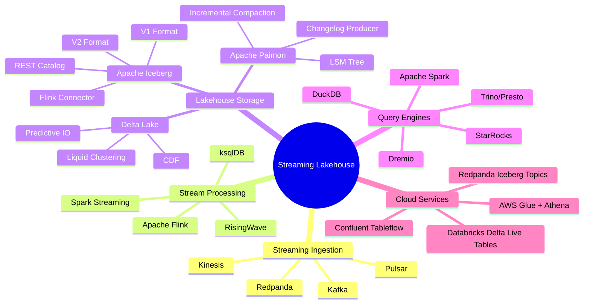
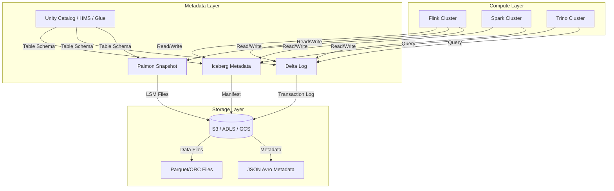
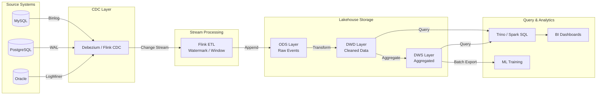
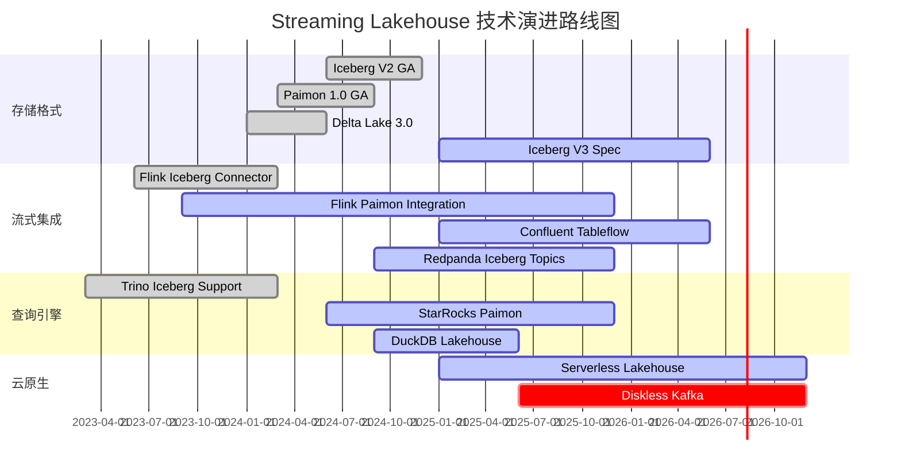

# Streaming-first Lakehouse: Iceberg/Delta Lake 集成

> 所属阶段: Knowledge | 前置依赖: [05-frontier/flink-cdc-patterns.md](./streaming-databases.md), [Flink/03-storage/flink-paimon-lakehouse.md](../../Flink/05-ecosystem/05.01-connectors/flink-connectors-ecosystem-complete-guide.md) | 形式化等级: L3-L4

## 1. 概念定义 (Definitions)

### Def-K-06-23: Streaming Lakehouse 架构

**Streaming Lakehouse** 是一种将流计算能力与湖仓存储格式（Iceberg/Delta Lake/Paimon）深度融合的数据架构范式，其核心特征是通过**增量数据流**替代传统批量加载，实现存储层与计算层的流式统一。

$$\text{StreamingLakehouse} := \langle \mathcal{S}, \mathcal{L}, \Phi, \Psi \rangle$$

其中：

- $\mathcal{S}$：流处理引擎（Flink、Spark Streaming、RisingWave）
- $\mathcal{L}$：湖仓存储格式（Iceberg、Delta Lake、Apache Paimon）
- $\Phi: \text{Stream} \to \mathcal{L}$：流式摄取函数，保证 exactly-once 语义
- $\Psi: \mathcal{L} \to \text{QueryableView}$：增量视图物化函数

Streaming Lakehouse 的本质是**将 Lakehouse 的存储抽象扩展到流式领域**，使得：

1. 数据以流式方式持续写入湖存储
2. 元数据层支持增量快照与changelog追踪
3. 查询引擎可同时访问历史批量数据与实时流式数据

---

### Def-K-06-24: 增量提交与 Changelog

**增量提交（Incremental Commit）** 是 Streaming Lakehouse 的核心机制，指数据以微批或逐条方式持续追加到表版本历史中，每个提交产生新的**快照（Snapshot）**。

**Changelog** 是表级别的变更日志流，记录每次提交的增删改操作：

$$\text{Changelog}(T) := \{ (op, row, ts) \mid op \in \{\text{INSERT}, \text{UPDATE}, \text{DELETE}\}, ts \in \mathbb{T} \}$$

关键属性：

- **时间旅行（Time Travel）**：通过快照 ID 或时间戳查询历史版本
- **增量读取（Incremental Read）**：消费自指定快照以来的变更
- **Changelog 生成**：从快照差异推导行级变更流

| 存储格式 | 增量提交机制 | Changelog 支持 |
|---------|-------------|---------------|
| Apache Iceberg | Snapshot + Manifest | V2 format 支持 row-level delete |
| Delta Lake | Transaction Log | Change Data Feed (CDF) |
| Apache Paimon | LSM Tree + Snapshot | 原生 Changelog 生产 |

---

### Def-K-06-25: 统一批流存储

**统一批流存储（Unified Batch-Stream Storage）** 指单一存储层同时满足批处理与流处理两种访问模式，消除传统 Lambda 架构中的存储冗余。

$$\text{UnifiedStorage} := \mathcal{L} \text{ s.t. } \forall q \in \text{Queries}, \text{mode}(q) \in \{\text{Batch}, \text{Stream}\}, \mathcal{L} \models q$$

实现统一存储的关键技术：

1. **元数据层统一**：单一 Catalog 管理批表与流表 schema
2. **存储格式兼容**：Parquet/ORC 等列式格式同时支持批量扫描与增量读取
3. **访问接口统一**：相同 SQL/Table API 支持批模式与流模式切换

```
┌─────────────────────────────────────────────┐
│           Unified Query Layer               │
│      (Flink SQL / Spark SQL / Trino)        │
├─────────────────────────────────────────────┤
│   Batch Mode      │      Streaming Mode     │
│   (Full Scan)     │   (Incremental Read)    │
├───────────────────┼─────────────────────────┤
│                   │                         │
│        ┌──────────┴──────────┐              │
│        │   Lakehouse Store   │              │
│        │  (Iceberg/Delta/    │              │
│        │   Paimon)           │              │
│        └─────────────────────┘              │
│                   │                         │
│        ┌──────────┴──────────┐              │
│        │   Object Storage    │              │
│        │  (S3/ADLS/GCS)      │              │
│        └─────────────────────┘              │
└─────────────────────────────────────────────┘
```

---

## 2. 属性推导 (Properties)

### Prop-K-06-05: Streaming Lakehouse 的实时性下界

对于 Streaming Lakehouse 架构，端到端数据可见性延迟受限于：

$$\text{Latency}_{\text{total}} = \text{Latency}_{\text{ingest}} + \text{Latency}_{\text{commit}} + \text{Latency}_{\text{visibility}}$$

其中：

- $\text{Latency}_{\text{ingest}}$：数据摄取到内存/本地缓冲（毫秒级）
- $\text{Latency}_{\text{commit}}$：微批提交与元数据更新（秒级，通常 30s-5min）
- $\text{Latency}_{\text{visibility}}$：快照对查询引擎可见（秒级）

**结论**：Streaming Lakehouse 的实时性下界为**秒级到分钟级**，适用于近实时（Near Real-Time）场景，而非毫秒级低延迟场景。

---

### Prop-K-06-06: Exactly-Once 写入的形式化保证

Streaming Lakehouse 通过以下机制实现 exactly-once 写入保证：

**定理**：设流处理引擎的 Checkpoint 周期为 $c$，Lakehouse 的提交操作满足幂等性，则：

$$\forall c_i, \text{Commit}(c_i) \text{ is idempotent} \implies \text{Exactly-Once Delivery}$$

**证明概要**：

1. 流引擎在 Checkpoint 时记录当前 offset 与待提交数据
2. Lakehouse 提交使用事务 ID（如 Flink 的 Checkpoint ID）作为去重键
3. 失败恢复后，相同事务 ID 的提交被识别为重复并忽略
4. 因此每条记录最终仅影响存储状态一次

---

### Prop-K-06-07: Changelog 的完备性条件

Lakehouse 表能够生成完备 Changelog 的充要条件：

1. **行级标识**：每行数据具有唯一主键或标识符
2. **版本追踪**：UPDATE 操作需记录前像（before-image）与后像（after-image）
3. **删除传播**：物理删除或逻辑删除（tombstone）需可追踪

| 存储格式 | 完备 Changelog | 限制条件 |
|---------|---------------|---------|
| Iceberg V1 | ❌ | 仅支持追加，UPDATE = DELETE + INSERT |
| Iceberg V2 | ⚠️ | 支持 equality delete，需配置 Changelog 生成 |
| Delta Lake CDF | ✅ | 需显式启用 CDF，存储开销 +30% |
| Paimon | ✅ | 原生设计，默认支持 |

---

## 3. 关系建立 (Relations)

### 3.1 与 Flink 生态的关系矩阵

| 组件 | Iceberg | Delta Lake | Paimon | 关系说明 |
|-----|---------|-----------|--------|---------|
| Flink SQL Connector | ✅ 官方支持 | ✅ 开源实现 | ✅ 原生支持 | 流批统一 Table API |
| Checkpoint 集成 | ✅ 两阶段提交 | ✅ 两阶段提交 | ✅ LSM flush | Exactly-once 保证 |
| Watermark 传播 | ⚠️ 有限支持 | ⚠️ 有限支持 | ✅ 原生支持 | 事件时间处理 |
| Changelog 消费 | ⚠️ 需配置 | ✅ CDF | ✅ 原生 | 流式增量读取 |
| Catalog 集成 | ✅ Flink Catalog | ⚠️ 需适配 | ✅ 原生 Catalog | 元数据统一管理 |

### 3.2 Paimon 与 Lakehouse 的关系定位

```
┌────────────────────────────────────────────────────────────┐
│                    Streaming Lakehouse                      │
│  ┌─────────────────────────────────────────────────────┐   │
│  │           Apache Paimon (Streaming Lakehouse)        │   │
│  │  • 专为流设计:原生 Changelog、LSM Tree              │   │
│  │  • 低延迟:分钟级延迟,高吞吐                          │   │
│  │  • Flink 原生:与 Flink CDC/ETL 无缝集成               │   │
│  └─────────────────────────────────────────────────────┘   │
│                        ▲                                   │
│                        │ 可互操作/迁移                     │
│                        ▼                                   │
│  ┌─────────────────────────────────────────────────────┐   │
│  │    Apache Iceberg / Delta Lake (Analytics Lakehouse) │   │
│  │  • 分析优先:优化 OLAP 查询                            │   │
│  │  • 生态丰富:Spark/Trino/Presto 广泛支持               │   │
│  │  • 批处理成熟:历史数据管理完善                         │   │
│  └─────────────────────────────────────────────────────┘   │
└────────────────────────────────────────────────────────────┘
```

**定位差异**：

- **Paimon**：Streaming-first，专注于流式写入与实时物化视图
- **Iceberg/Delta**：Analytics-first，专注于大规模分析查询与开放生态

**协同模式**：Paimon 作为实时层（Real-time Layer），Iceberg 作为历史层（Historical Layer），通过 compaction 和归档实现分层。

### 3.3 流式摄取架构模式

```
┌─────────────────────────────────────────────────────────────────────┐
│                        Streaming Ingestion                          │
├─────────────────────────────────────────────────────────────────────┤
│                                                                     │
│  ┌──────────┐    ┌──────────┐    ┌──────────┐    ┌──────────┐      │
│  │  Kafka   │───▶│  Flink   │───▶│ Iceberg  │───▶│ Trino/   │      │
│  │  Topics  │    │  ETL     │    │  Table   │    │ Spark    │      │
│  └──────────┘    └──────────┘    └──────────┘    └──────────┘      │
│       │                │              │                             │
│       │         ┌──────┴──────┐       │                             │
│       │         │             │       │                             │
│       │    ┌────┴────┐   ┌────┴────┐  │                             │
│       │    │ Watermark│   │Exactly- │  │                             │
│       │    │  Track   │   │ Once    │  │                             │
│       │    └─────────┘   └─────────┘  │                             │
│       │                               │                             │
│       ▼                               ▼                             │
│  ┌─────────────────────────────────────────┐                        │
│  │     Changelog Stream (to downstream)    │                        │
│  │         (Kafka / Pulsar)                │                        │
│  └─────────────────────────────────────────┘                        │
│                                                                     │
└─────────────────────────────────────────────────────────────────────┘
```

---

## 4. 论证过程 (Argumentation)

### 4.1 架构选型决策树

何时选择 Streaming Lakehouse？

```
                    ┌─────────────────┐
                    │ 数据延迟需求     │
                    └────────┬────────┘
                             │
            ┌────────────────┼────────────────┐
            │ < 1秒           │ 1秒-1分钟        │ > 1分钟
            ▼                ▼                ▼
    ┌──────────────┐  ┌──────────────┐  ┌──────────────┐
    │ Streaming DB │  │ Streaming    │  │ Traditional  │
    │ (ksqlDB/     │  │ Lakehouse    │  │ Batch ETL    │
    │ RisingWave)  │  │ (Iceberg/    │  │ + Data       │
    │              │  │  Delta)      │  │ Warehouse    │
    └──────────────┘  └──────────────┘  └──────────────┘
                             │
            ┌────────────────┼────────────────┐
            │ 分析查询为主     │ 流处理为主       │ 混合负载
            ▼                ▼                ▼
    ┌──────────────┐  ┌──────────────┐  ┌──────────────┐
    │ Iceberg +    │  │ Paimon/      │  │ Paimon +     │
    │ Trino/Spark  │  │ Flink        │  │ Iceberg      │
    │              │  │ (Real-time   │  │ (Tiered      │
    │              │  │  layer)      │  │  Storage)    │
    └──────────────┘  └──────────────┘  └──────────────┘
```

### 4.2 Diskless Kafka + Iceberg 的合理性分析

**命题**：将 Kafka 的持久化层替换为 Iceberg 表存储（即 Diskless Kafka）是 2026 年可行架构。

**论证**：

1. **成本维度**：
   - Kafka 的块存储成本 ≈ 3-5× 对象存储（S3）
   - 长期数据保留（>7 天）在 Kafka 中成本极高
   - Iceberg 将历史数据卸载到对象存储，成本降低 80%+

2. **功能维度**：
   - Kafka 提供的是**消息队列**语义：offset、partition、consumer group
   - Iceberg 提供的是**表存储**语义：schema、partition、snapshot
   - 通过 Tableflow / Iceberg Topics 桥接两者语义

3. **架构模式**：

```
Traditional:          Diskless Kafka (2026 Pattern):
┌─────────┐           ┌─────────┐
│Producer │           │Producer │
└────┬────┘           └────┬────┘
     │                     │
     ▼                     ▼
┌─────────┐           ┌─────────┐    ┌─────────┐
│  Kafka  │           │  Kafka  │───▶│ Iceberg │
│ (Disk)  │           │(Memory) │    │ (S3)    │
└────┬────┘           └────┬────┘    └────┬────┘
     │                     │              │
     ▼                     ▼              ▼
┌─────────┐           ┌─────────┐    ┌─────────┐
│Consumer │           │Consumer │    │Historical│
└─────────┘           │(Realtime)│   │ Query   │
                      └─────────┘    └─────────┘
```

**限制**：

- 仅适用于**可接受分钟级延迟**的场景
- 需要 consumer 支持从 Iceberg 增量读取（Kafka 协议不直接支持）

---

## 5. 工程论证 (Engineering Argument)

### 5.1 Flink SQL Iceberg Connector 配置模式

**Exactly-Once 写入配置**：

```sql
-- 创建 Iceberg Catalog
CREATE CATALOG hive_catalog WITH (
    'type' = 'iceberg',
    'catalog-type' = 'hive',
    'uri' = 'thrift://hive-metastore:9083',
    'warehouse' = 's3://data-lake/warehouse/'
);

-- 创建流式写入表
CREATE TABLE user_events (
    user_id STRING,
    event_type STRING,
    event_time TIMESTAMP(3),
    properties MAP<STRING, STRING>,
    WATERMARK FOR event_time AS event_time - INTERVAL '5' SECOND
) WITH (
    'connector' = 'iceberg',
    'catalog-name' = 'hive_catalog',
    'catalog-database' = 'events_db',
    'catalog-table' = 'user_events',
    'write-mode' = 'upsert',              -- 支持 UPDATE/DELETE
    'upsert-enabled' = 'true',
    'equality-field-columns' = 'user_id,event_time',
    'write-format' = 'parquet',
    'compression-codec' = 'zstd',
    'commit.manifest-merge-enabled' = 'true',
    'write.metadata.previous-versions-max' = '100'
);

-- 流式摄取
INSERT INTO user_events
SELECT
    user_id,
    event_type,
    event_time,
    properties
FROM kafka_source
WHERE event_time > NOW() - INTERVAL '7' DAY;
```

**关键配置说明**：

- `write-mode` = `upsert`：启用变更数据捕获语义
- `equality-field-columns`：指定主键，用于行级更新
- `write.metadata.previous-versions-max`：控制元数据文件数量，防止小文件问题

### 5.2 CDC 同步到 Iceberg 完整链路

```sql
-- 1. CDC Source:MySQL 变更捕获
CREATE TABLE mysql_users (
    id INT,
    name STRING,
    email STRING,
    updated_at TIMESTAMP(3),
    PRIMARY KEY (id) NOT ENFORCED
) WITH (
    'connector' = 'mysql-cdc',
    'hostname' = 'mysql-host',
    'port' = '3306',
    'username' = 'cdc_user',
    'password' = '${cdc_password}',
    'database-name' = 'production',
    'table-name' = 'users',
    'scan.startup.mode' = 'latest-offset'
);

-- 2. Iceberg Sink:实时同步
CREATE TABLE iceberg_users (
    id INT,
    name STRING,
    email STRING,
    updated_at TIMESTAMP(3),
    _cdc_op STRING,           -- 记录操作类型
    _cdc_ts TIMESTAMP(3),     -- CDC 时间戳
    PRIMARY KEY (id) NOT ENFORCED
) WITH (
    'connector' = 'iceberg',
    'catalog-name' = 'hive_catalog',
    'catalog-database' = 'cdc_db',
    'catalog-table' = 'users_sync',
    'write-mode' = 'upsert',
    'upsert-enabled' = 'true',
    'equality-field-columns' = 'id'
);

-- 3. 带元数据的 CDC 同步
INSERT INTO iceberg_users
SELECT
    id,
    name,
    email,
    updated_at,
    CASE
        WHEN op = 'c' THEN 'INSERT'
        WHEN op = 'u' THEN 'UPDATE'
        WHEN op = 'd' THEN 'DELETE'
    END as _cdc_op,
    NOW() as _cdc_ts
FROM mysql_users;
```

---

## 6. 实例验证 (Examples)

### 6.1 实时数仓分层架构

**场景**：构建支持实时与离线分析的统一数仓

```
┌─────────────────────────────────────────────────────────────────────┐
│                      Real-time Data Warehouse                        │
├─────────────────────────────────────────────────────────────────────┤
│                                                                     │
│   ODS Layer (Operational Data Store)                                │
│   ┌─────────────────────────────────────────────────────────┐      │
│   │  Iceberg Table: ods_events                              │      │
│   │  • 原始事件数据,保留 7 天                               │      │
│   │  • Partition: dt=YYYY-MM-DD, hour=HH                    │      │
│   │  • Format: Parquet, Zstd compression                    │      │
│   └─────────────────────────────────────────────────────────┘      │
│                              │                                      │
│                              ▼                                      │
│   DWD Layer (Data Warehouse Detail)                                 │
│   ┌─────────────────────────────────────────────────────────┐      │
│   │  Paimon Table: dwd_user_events (Streaming Materialized) │      │
│   │  • 清洗后明细数据,增量更新                              │      │
│   │  • Changelog 生产,支持流式订阅                          │      │
│   │  • MergeEngine: deduplicate / aggregation               │      │
│   └─────────────────────────────────────────────────────────┘      │
│                              │                                      │
│              ┌───────────────┴───────────────┐                     │
│              ▼                               ▼                     │
│   DWS Layer (Data Warehouse Summary)         ADS Layer             │
│   ┌─────────────────────────┐    ┌─────────────────────────┐       │
│   │ Paimon: dws_user_stats  │    │ Iceberg: ads_reports    │       │
│   │ • 分钟级聚合             │    │ • 小时/天级报表         │       │
│   │ • 增量物化视图           │    │ • 历史归档              │       │
│   └─────────────────────────┘    └─────────────────────────┘       │
│                                                                     │
└─────────────────────────────────────────────────────────────────────┘
```

**Flink SQL 实现**：

```sql
-- ODS: 原始数据接入(Iceberg,近实时)
INSERT INTO iceberg_catalog.ods.events
SELECT * FROM kafka_source;

-- DWD: 实时清洗(Paimon,增量物化)
INSERT INTO paimon_catalog.dwd.user_events
SELECT
    user_id,
    event_type,
    event_time,
    -- 数据清洗:去除敏感字段
    regexp_replace(properties['ip'], '\\d+$', 'xxx') as ip_masked
FROM iceberg_catalog.ods.events
WHERE event_time > NOW() - INTERVAL '7' DAY;

-- DWS: 分钟级聚合(Paimon 物化视图)
INSERT INTO paimon_catalog.dws.user_stats
SELECT
    user_id,
    TUMBLE_START(event_time, INTERVAL '1' MINUTE) as window_start,
    COUNT(*) as event_count,
    COUNT(DISTINCT session_id) as session_count
FROM paimon_catalog.dwd.user_events
GROUP BY
    user_id,
    TUMBLE(event_time, INTERVAL '1' MINUTE);

-- ADS: 小时报表(Iceberg,批量归档)
INSERT INTO iceberg_catalog.ads.hourly_reports
SELECT
    DATE_FORMAT(window_start, 'yyyy-MM-dd HH:00:00') as hour,
    SUM(event_count) as total_events,
    COUNT(DISTINCT user_id) as unique_users
FROM paimon_catalog.dws.user_stats
WHERE window_start >= DATE_TRUNC('HOUR', NOW() - INTERVAL '1' DAY)
GROUP BY DATE_FORMAT(window_start, 'yyyy-MM-dd HH:00:00');
```

### 6.2 RisingWave 物化视图同步到 Lakehouse

**架构**：RisingWave 作为流处理层，Iceberg 作为历史存储层

```sql
-- RisingWave 侧:创建物化视图
CREATE SOURCE user_events (
    user_id VARCHAR,
    event_type VARCHAR,
    amount DECIMAL,
    event_time TIMESTAMPTZ
) WITH (
    connector = 'kafka',
    topic = 'user_events',
    properties.bootstrap.server = 'kafka:9092'
) FORMAT JSON;

-- 实时物化视图:用户交易汇总
CREATE MATERIALIZED VIEW user_transaction_summary AS
SELECT
    user_id,
    COUNT(*) as transaction_count,
    SUM(amount) as total_amount,
    MAX(event_time) as last_transaction_time
FROM user_events
WHERE event_time > NOW() - INTERVAL '30' DAY
GROUP BY user_id;

-- RisingWave Iceberg Sink:同步到 Lakehouse
CREATE SINK iceberg_user_summary
FROM user_transaction_summary
WITH (
    connector = 'iceberg',
    type = 'upsert',
    primary_key = 'user_id',
    catalog.type = 'rest',
    catalog.uri = 'http://iceberg-rest:8181',
    warehouse.path = 's3://lakehouse/warehouse/',
    database.name = 'analytics',
    table.name = 'user_summary'
);
```

### 6.3 历史+实时统一查询

**场景**：查询最近 30 天数据，其中近 1 天为实时数据，其余为历史归档

```sql
-- Trino / StarRocks 联邦查询
WITH recent_data AS (
    -- 从 Paimon 读取实时数据(近 24 小时)
    SELECT * FROM paimon_catalog.analytics.events
    WHERE event_time >= CURRENT_TIMESTAMP - INTERVAL '24' HOUR
),
historical_data AS (
    -- 从 Iceberg 读取历史数据(24 小时前到 30 天前)
    SELECT * FROM iceberg_catalog.analytics.events
    WHERE event_time >= CURRENT_TIMESTAMP - INTERVAL '30' DAY
      AND event_time < CURRENT_TIMESTAMP - INTERVAL '24' HOUR
),
unified_data AS (
    SELECT * FROM recent_data
    UNION ALL
    SELECT * FROM historical_data
)
SELECT
    DATE(event_time) as dt,
    event_type,
    COUNT(*) as cnt
FROM unified_data
GROUP BY DATE(event_time), event_type
ORDER BY dt DESC;
```

---

## 7. 可视化 (Visualizations)

### 7.1 Streaming Lakehouse 技术栈全景



### 7.2 流批统一元数据架构



### 7.3 CDC → Lakehouse 数据流



### 7.4 2026 Streaming Lakehouse 趋势路线图



---

## 8. 引用参考 (References)
