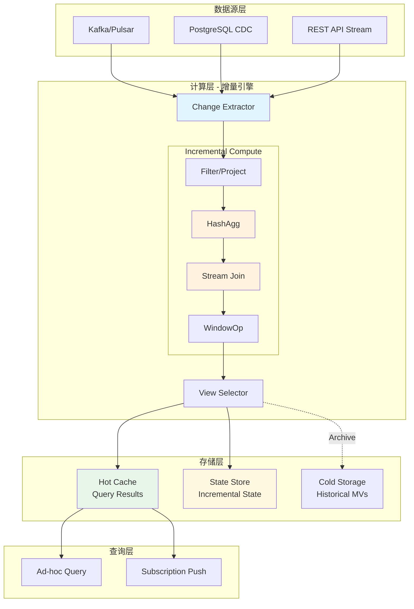
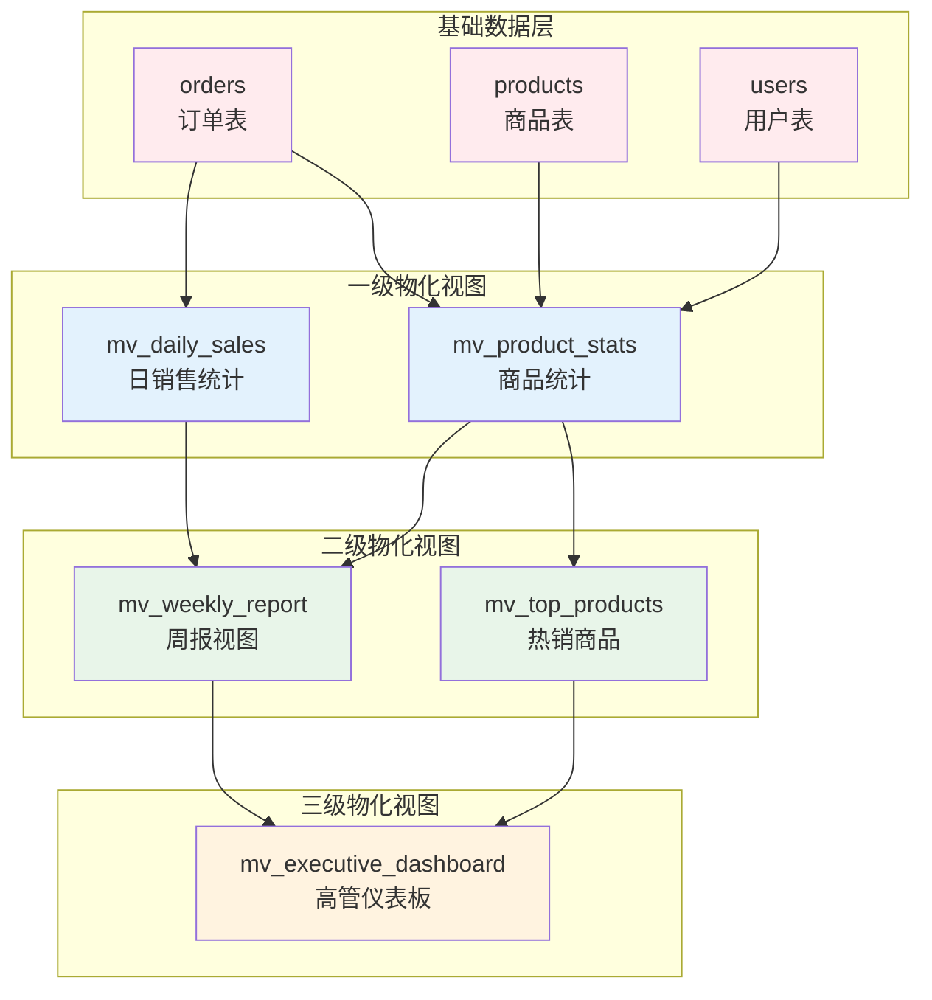
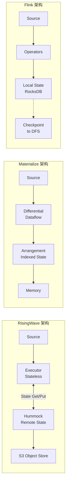
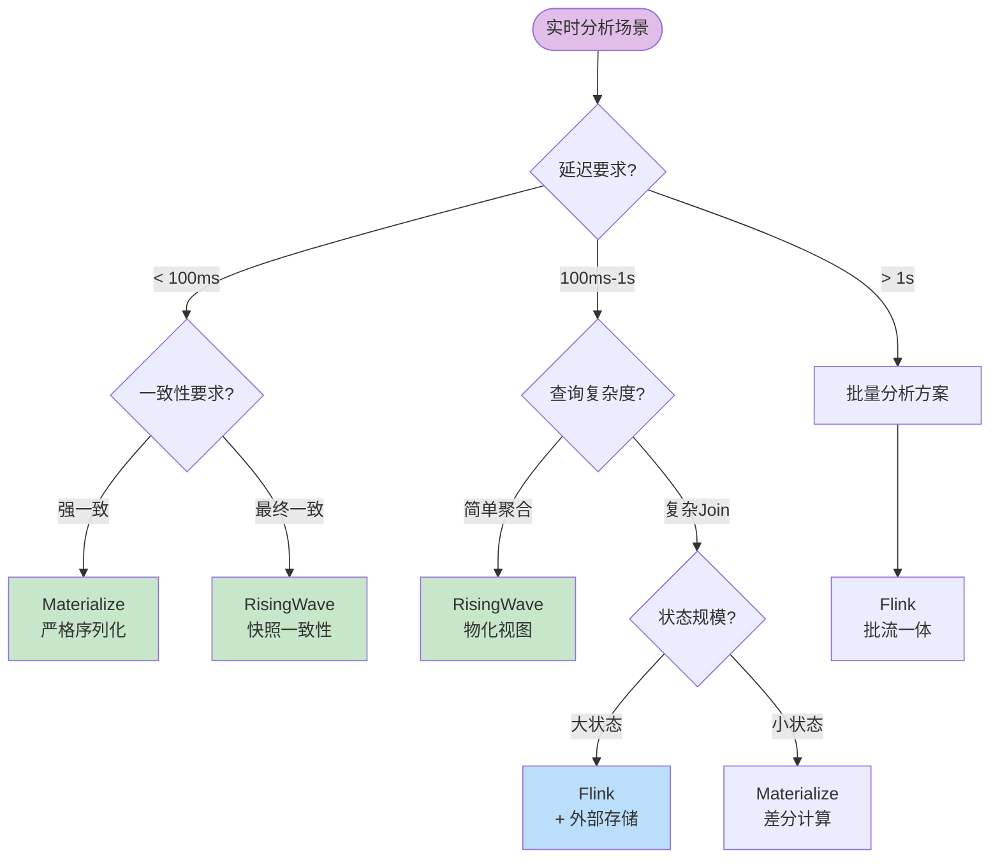
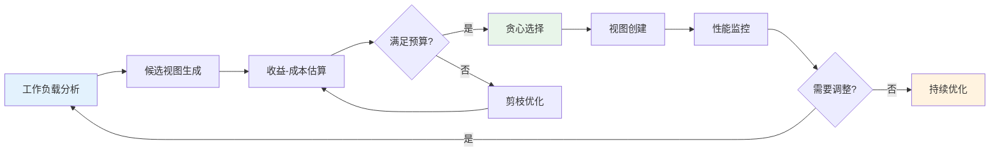
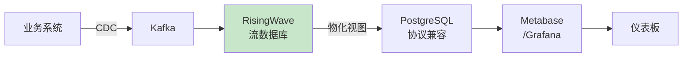
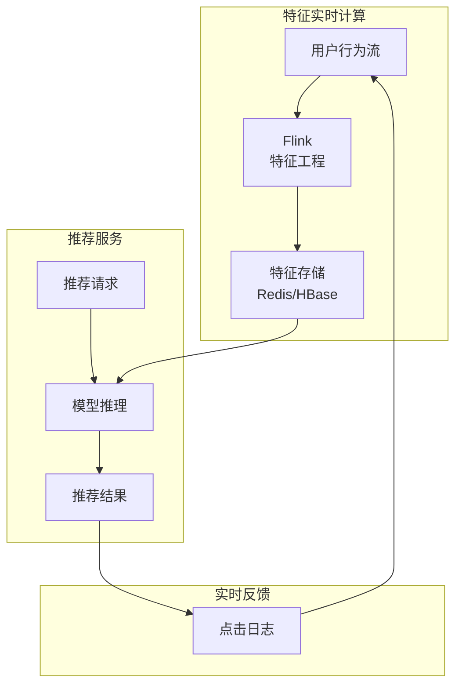

# 流式物化视图架构与实时分析

> 所属阶段: Knowledge | 前置依赖: [streaming-databases.md](./streaming-databases.md), [risingwave-deep-dive.md](./risingwave-deep-dive.md) | 形式化等级: L4-L5

## 1. 概念定义 (Definitions)

### 1.1 物化视图基础定义

**Def-K-06-170** (物化视图). 给定基础表集合 $\mathcal{B} = \{B_1, B_2, ..., B_n\}$ 和视图定义查询 $Q$，物化视图 $V$ 定义为：

$$V = Q(\mathcal{B}) = \{ t \mid \exists b_1 \in B_1, ..., b_n \in B_n: t = Q(b_1, ..., b_n) \}$$

物化视图是查询结果的**物理存储**，而非虚拟视图的逻辑定义。

**Def-K-06-171** (传统物化视图 vs 流式物化视图). 两类物化视图的形式化对比：

| 维度 | 传统物化视图 | 流式物化视图 |
|------|-------------|-------------|
| **数据流** | 批量更新 $V_{new} = Q(\mathcal{B}_{new})$ | 流式增量 $V(t) = V(t-1) \oplus \Delta V(t)$ |
| **一致性** | 事务一致性 (ACID) | 事件时间一致性 |
| **延迟** | 分钟-小时级 | 毫秒-秒级 |
| **触发方式** | 手动/定时刷新 | 事件驱动自动更新 |
| **状态存储** | 关系型表存储 | 分布式流状态存储 |

**Def-K-06-172** (增量视图维护 IVM). 增量视图维护机制 $\mathcal{I}$ 定义为映射函数：

$$\mathcal{I}: \Delta \mathcal{B} \times State(t-1) \rightarrow \Delta V \times State(t)$$

其中：

- $\Delta \mathcal{B}$: 基础表变更流（插入/更新/删除）
- $State(t)$: 时刻 $t$ 的内部计算状态
- $\Delta V$: 视图增量更新
- $\oplus$: 视图更新操作（合并增量到物化结果）

### 1.2 流式物化视图架构定义

**Def-K-06-173** (计算-存储分离架构). 流式物化视图系统架构定义为四元组：

$$\mathcal{SMV} = \langle \mathcal{C}, \mathcal{S}, \mathcal{M}, \mathcal{G} \rangle$$

其中各组件定义如下：

| 组件 | 符号 | 功能描述 |
|------|------|----------|
| 计算层 | $\mathcal{C}$ | 增量计算引擎，无状态或轻状态 |
| 存储层 | $\mathcal{S}$ | 物化结果持久化，支持随机查询 |
| 元数据层 | $\mathcal{M}$ | 视图依赖图、一致性协调 |
| 执行图 | $\mathcal{G}$ | 增量计算的数据流图 $G = (V, E)$ |

### 1.3 一致性保证定义

**Def-K-06-174** (级联物化视图). 级联物化视图是由视图依赖关系构成的有向无环图 $DAG = (\mathcal{V}, \mathcal{E})$：

- 节点 $\mathcal{V} = \{V_1, V_2, ..., V_m\}$ 表示物化视图
- 边 $\mathcal{E} \subseteq \mathcal{V} \times \mathcal{V}$ 表示视图依赖关系 $(V_i, V_j)$ 意为 $V_j$ 依赖 $V_i$

对于基础表变更 $\Delta B$，级联更新必须满足拓扑序：

$$\forall (V_i, V_j) \in \mathcal{E}: Update(V_i) \prec Update(V_j)$$

**Def-K-06-175** (流式一致性模型). 流式物化视图的一致性级别定义：

1. **强一致性 (Strong Consistency)**:
   $$\forall q(t): Result(q) = Q(\mathcal{B}(t))$$
   查询结果对应于查询时刻的实时状态。

2. **最终一致性 (Eventual Consistency)**:
   $$\lim_{t \rightarrow \infty} V(t) = Q(\mathcal{B}(\infty))$$
   在无新变更的情况下，视图最终收敛到正确状态。

3. **有界一致性 (Bounded Consistency)**:
   $$\forall t: |V(t) - Q(\mathcal{B}(t))| \leq \epsilon \land Delay(V) \leq \delta$$
   视图与真实状态偏差有界，延迟有界。

## 2. 属性推导 (Properties)

### 2.1 增量计算性质

**Lemma-K-06-115** (增量计算正确性). 对于任意查询 $Q$ 和基础表变更序列 $\langle \Delta B_1, \Delta B_2, ..., \Delta B_k \rangle$，增量维护机制 $\mathcal{I}$ 满足：

$$Q(B_0 \cup \bigcup_{i=1}^{k} \Delta B_i) = Q(B_0) \oplus \bigoplus_{i=1}^{k} \mathcal{I}(\Delta B_i, State_{i-1})$$

**证明概要**: 通过对变更序列的归纳法证明。

- 基例: $k=0$ 时显然成立
- 归纳步: 假设对 $k-1$ 成立，利用 $\mathcal{I}$ 的定义展开第 $k$ 步
- 由查询 $Q$ 的代数性质保证增量更新的可组合性 ∎

**Lemma-K-06-116** (级联更新传播). 在级联物化视图 $DAG$ 中，对于任意节点 $V$，其更新延迟满足：

$$Delay(V) \leq \sum_{(U,V) \in InEdges(V)} Delay(U) + Proc(V)$$

其中 $Proc(V)$ 是视图 $V$ 自身的处理延迟。

### 2.2 资源效率性质

**Lemma-K-06-117** (存储空间优化). 物化视图系统的存储复杂度：

$$Space(V) = O(|Q(\mathcal{B})| + |State_{incremental}|)$$

对于支持增量计算的查询类，状态空间通常满足：

$$|State_{incremental}| \ll |Q(\mathcal{B})|$$

**证明**: 以聚合查询为例，仅需维护聚合状态而非全量数据。∎

## 3. 关系建立 (Relations)

### 3.1 与经典数据库理论的映射

| 传统数据库概念 | 流式物化视图对应 | 关键差异 |
|---------------|-----------------|----------|
| 视图定义 (View Definition) | 流SQL + 物化声明 | 支持窗口、流Join |
| 查询重写 (Query Rewrite) | 视图选择优化 | 考虑增量维护成本 |
| 视图维护 (View Maintenance) | 增量流处理 | 从批量到流式 |
| 索引选择 (Index Selection) | 状态存储优化 | 分层存储策略 |

### 3.2 与流处理模型的关系

流式物化视图可映射到 Timely Dataflow：

```
物化视图执行图:
┌──────────┐     ┌──────────────┐     ┌──────────┐
│  Source  │────→│  Incremental │────→│ Material-│
│  (Stream)│     │  Operators   │     │ ized View│
└──────────┘     └──────────────┘     └──────────┘
                        ↑
                   ┌──────────┐
                   │  State   │
                   │  Store   │
                   └──────────┘
```

### 3.3 主流实现对比关系

| 特性维度 | RisingWave | Materialize | Flink Table | pg_ivm |
|---------|------------|-------------|-------------|--------|
| **核心模型** | 流数据库 | Differential Dataflow | 流批一体 | PostgreSQL扩展 |
| **增量引擎** | 变更传播 | 差分计算 | Mini-Batch | 触发器 |
| **一致性** | 快照一致性 | 严格序列化 | Checkpoint | 事务一致 |
| **延迟** | 亚秒级 | 毫秒级 | 秒级 | 秒级 |
| **SQL兼容** | PostgreSQL | PostgreSQL | Flink SQL | PostgreSQL |
| **部署模式** | 云原生 | 云/私有 | 集群 | 单节点 |

## 4. 论证过程 (Argumentation)

### 4.1 计算-存储分离的工程设计论证

**设计决策**: 现代流式物化视图系统普遍采用计算-存储分离架构。

**工程权衡分析**:

| 方案 | 优势 | 劣势 | 适用场景 |
|------|------|------|----------|
| **紧耦合 (Flink)** | 低延迟状态访问 | 扩缩容需状态迁移 | 超大规模状态、低延迟敏感 |
| **分离架构** | 弹性扩缩、独立扩展 | 网络开销、缓存管理 | 云环境、可变工作负载 |

**形式化论证**:

设总状态大小为 $S$，计算节点数为 $n$，检查点间隔为 $\Delta$：

**紧耦合方案总成本**:
$$C_{tight} = n \cdot c_{compute}(S/n) + n \cdot c_{local}(S/n) + c_{migration}(n_{change})$$

**分离架构方案总成本**:
$$C_{separate} = n \cdot c_{compute}(S_{hot}/n) + c_{remote}(S) + c_{network}(throughput)$$

当状态访问呈现高度倾斜（热点数据集中）时：

$$S_{hot} \ll S \Rightarrow C_{separate} < C_{tight}$$

### 4.2 增量维护策略选择论证

**策略对比矩阵**:

| 策略 | 适用查询类型 | 状态开销 | 延迟 | 实现复杂度 |
|------|------------|---------|------|-----------|
| **即时维护** | 简单聚合、过滤 | 低 | 低 | 低 |
| **延迟维护** | 复杂Join、嵌套查询 | 中 | 中 | 中 |
| **批量维护** | 全量计算、窗口聚合 | 高 | 高 | 低 |
| **自适应维护** | 混合工作负载 | 可变 | 可调 | 高 |

## 5. 形式证明 / 工程论证 (Proof / Engineering Argument)

### 5.1 视图选择优化问题

**Thm-K-06-115** (视图选择NP完全性). 给定查询工作负载 $\mathcal{Q}$ 和物化视图候选集 $\mathcal{C}$，在满足存储约束 $S_{budget}$ 的前提下最大化查询性能提升的视图选择问题是NP完全的。

**证明**:

1. **归约**: 从0-1背包问题归约
   - 视图候选 $\leftrightarrow$ 物品
   - 性能提升 $\leftrightarrow$ 价值
   - 存储成本 $\leftrightarrow$ 重量

2. **验证**: 给定视图集合，可在多项式时间内验证约束和计算目标函数。

3. **结论**: 视图选择 $\in$ NP，且为NP完全问题。∎

**启发式算法**:

```
贪心视图选择算法:
1. 初始化: selected = ∅, remaining = C
2. While storage(selected) < S_budget:
   a. 计算每个候选视图的性价比: benefit/cost
   b. 选择性价比最高的视图 v*
   c. If storage(selected ∪ {v*}) ≤ S_budget:
        selected = selected ∪ {v*}
   d. remaining = remaining \ {v*}
3. Return selected
```

### 5.2 一致性保证的工程实现

**Thm-K-06-116** (流式物化视图一致性边界). 采用Barrier检查点机制的流式物化视图系统提供有界一致性：

$$\forall t, \forall V: |V(t) - Q(\mathcal{B}(t))| \leq \lambda \cdot \Delta_{checkpoint}$$

其中 $\lambda$ 为最大变更速率，$\Delta_{checkpoint}$ 为检查点间隔。

**证明框架**:

1. **Barrier传播不变式**: 所有变更在Barrier前被处理
2. **状态快照原子性**: 检查点捕获全局一致状态
3. **查询读取边界**: 查询读取最近检查点状态

### 5.3 增量计算复杂度分析

**Thm-K-06-117** (增量计算复杂度下界). 对于聚合查询类，增量维护的时间复杂度下界为：

$$\Omega(|\Delta \mathcal{B}| \cdot \log |Groups|)$$

其中 $|Groups|$ 为分组键的基数。

**证明**: 考虑Hash聚合的最坏情况，需要维护分组键的索引结构，每次更新至少消耗对数时间。∎

## 6. 实例验证 (Examples)

### 6.1 RisingWave 物化视图实例

```sql
-- 创建Kafka数据源
CREATE SOURCE user_events (
    user_id INT,
    event_type VARCHAR,
    amount DECIMAL,
    event_time TIMESTAMP
) WITH (
    connector = 'kafka',
    topic = 'user_events',
    properties.bootstrap.server = 'kafka:9092'
) FORMAT PLAIN ENCODE JSON;

-- 创建实时收入统计物化视图
CREATE MATERIALIZED VIEW revenue_stats AS
SELECT
    TUMBLE(event_time, INTERVAL '1' MINUTE) as window_start,
    event_type,
    COUNT(*) as event_count,
    SUM(amount) as total_amount,
    AVG(amount) as avg_amount
FROM user_events
GROUP BY TUMBLE(event_time, INTERVAL '1' MINUTE), event_type;
```

**增量计算过程**:

```
输入变更流:
  +---------+------------+--------+-------------------+
  | user_id | event_type | amount | event_time        |
  +---------+------------+--------+-------------------+
  | 1001    | purchase   | 150.00 | 2024-01-01 10:00  |
  | 1002    | refund     | -20.00 | 2024-01-01 10:00  |
  | 1003    | purchase   |  75.00 | 2024-01-01 10:01  |
  +---------+------------+--------+-------------------+

增量更新:
  HashAgg算子维护状态:
    Key=("10:00", "purchase"): count=0, sum=0
    Key=("10:00", "refund"):  count=0, sum=0

  处理 1001: Key=("10:00", "purchase") → count=1, sum=150
  处理 1002: Key=("10:00", "refund")  → count=1, sum=-20
  处理 1003: Key=("10:01", "purchase") → count=1, sum=75

物化视图状态:
  +-------------+------------+-------------+--------------+
  | window_start| event_type | event_count | total_amount |
  +-------------+------------+-------------+--------------+
  | 10:00       | purchase   | 1           | 150.00       |
  | 10:00       | refund     | 1           | -20.00       |
  | 10:01       | purchase   | 1           | 75.00        |
  +-------------+------------+-------------+--------------+
```

### 6.2 Materialize Differential Dataflow 实例

```sql
-- 创建源表
CREATE SOURCE transactions
FROM KAFKA BROKER 'kafka:9092' TOPIC 'transactions'
FORMAT JSON;

-- 创建派生视图（多流Join）
CREATE MATERIALIZED VIEW user_transaction_summary AS
SELECT
    u.user_id,
    u.user_name,
    COUNT(t.transaction_id) as txn_count,
    SUM(t.amount) as total_volume
FROM users u
LEFT JOIN transactions t ON u.user_id = t.user_id
GROUP BY u.user_id, u.user_name;
```

**Differential Dataflow 特点**:

- 差分计算追踪每个数据版本的变更
- 支持递归查询和复杂迭代计算
- 严格序列化一致性保证

### 6.3 Flink SQL 物化表实例

```sql
-- 定义源表
CREATE TABLE orders (
    order_id STRING,
    user_id STRING,
    amount DECIMAL(10,2),
    order_time TIMESTAMP(3),
    WATERMARK FOR order_time AS order_time - INTERVAL '5' SECOND
) WITH (
    'connector' = 'kafka',
    'topic' = 'orders',
    'properties.bootstrap.servers' = 'kafka:9092',
    'format' = 'json'
);

-- 创建物化表（Flink 1.18+）
CREATE TABLE mv_order_stats (
    window_start TIMESTAMP(3),
    window_end TIMESTAMP(3),
    order_count BIGINT,
    total_amount DECIMAL(10,2),
    PRIMARY KEY (window_start, window_end) NOT ENFORCED
) WITH (
    'connector' = 'jdbc',
    'url' = 'jdbc:postgresql://postgres:5432/analytics',
    'table-name' = 'order_stats'
);

-- 增量插入物化表
INSERT INTO mv_order_stats
SELECT
    TUMBLE_START(order_time, INTERVAL '1' HOUR) as window_start,
    TUMBLE_END(order_time, INTERVAL '1' HOUR) as window_end,
    COUNT(*) as order_count,
    SUM(amount) as total_amount
FROM orders
GROUP BY TUMBLE(order_time, INTERVAL '1' HOUR);
```

### 6.4 PostgreSQL pg_ivm 实例

```sql
-- 启用pg_ivm扩展
CREATE EXTENSION IF NOT EXISTS pg_ivm;

-- 创建基础表
CREATE TABLE sales (
    sale_id SERIAL PRIMARY KEY,
    product_id INT,
    quantity INT,
    sale_date DATE,
    amount DECIMAL(10,2)
);

-- 创建增量物化视图
CREATE INCREMENTAL MATERIALIZED VIEW daily_sales_summary AS
SELECT
    sale_date,
    product_id,
    SUM(quantity) as total_quantity,
    SUM(amount) as total_amount,
    COUNT(*) as transaction_count
FROM sales
GROUP BY sale_date, product_id;

-- 自动增量更新
-- 当sales表发生INSERT/UPDATE/DELETE时，物化视图自动增量维护
```

## 7. 可视化 (Visualizations)

### 7.1 流式物化视图架构全景图



### 7.2 级联物化视图依赖图



### 7.3 主流实现架构对比



### 7.4 实时分析场景决策树



### 7.5 视图选择优化流程



## 8. 实时分析场景实践

### 8.1 实时仪表板架构

**场景特征**: 高频查询、低延迟、准实时数据

**推荐架构**:



**最佳实践**:

- 预聚合减少查询时计算
- 分层物化视图（分钟级→小时级→天级）
- 结果缓存+增量更新

### 8.2 实时推荐系统

**场景特征**: 用户行为实时反馈、特征快速更新

**架构模式**:



### 8.3 实时风控系统

**场景特征**: 超低延迟、高准确性、复杂规则

**架构选择**:

| 组件 | 技术选型 | 理由 |
|------|---------|------|
| 规则引擎 | Flink CEP | 复杂事件模式匹配 |
| 特征计算 | Materialize | 严格一致性保证 |
| 决策服务 | 自定义服务 | 亚毫秒级延迟 |

## 9. 最佳实践

### 9.1 物化视图设计原则

**原则 1: 分层设计**

```
L0: 原始数据层（Source）
L1: 清洗标准化层（Clean）
L2: 主题聚合层（Topic MV）
L3: 应用服务层（App MV）
```

**原则 2: 增量友好查询**

| 推荐模式 | 避免模式 |
|---------|---------|
| `SELECT ... GROUP BY key` | `SELECT DISTINCT *` (全量去重) |
| `SELECT ... WHERE time > NOW() - INTERVAL` | `SELECT ... ORDER BY time DESC LIMIT N` (无界TopN) |
| `Stream JOIN Stream WITHIN WINDOW` | `Stream JOIN Stream` (无界Join) |
| 增量聚合函数 (SUM/COUNT/AVG) | 非增量函数 (MEDIAN/PERCENTILE) |

**原则 3: 资源隔离**

```sql
-- 为不同SLA的视图分配资源池
CREATE MATERIALIZED VIEW critical_mv
WITH (resource_pool = 'high_priority')
AS SELECT ...;

CREATE MATERIALIZED VIEW batch_mv
WITH (resource_pool = 'low_priority')
AS SELECT ...;
```

### 9.2 成本优化策略

**存储成本优化**:

| 策略 | 实施方法 | 预期节省 |
|------|---------|---------|
| TTL自动清理 | `WITH (retention = '7d')` | 70%+ |
| 分层存储 | 热/温/冷数据分层 | 50%+ |
| 结果压缩 | 列式存储+压缩 | 30%+ |

**计算成本优化**:

```
1. 视图复用: 复用上游物化视图，避免重复计算
2. 延迟物化: 非关键视图采用延迟更新
3. 增量裁剪: 仅维护必要的历史分区
```

### 9.3 监控与调优

**关键指标**:

| 指标 | 告警阈值 | 优化方向 |
|------|---------|---------|
| MV延迟 | > 5秒 | 扩容/优化查询 |
| 状态大小 | > 内存80% | 调整TTL/分区 |
| 查询P99 | > 100ms | 索引优化 |
| 失败率 | > 0.1% | 检查点调优 |

## 10. 引用参考 (References)


---

*文档版本: 1.0 | 创建日期: 2026-04-03 | 维护者: AnalysisDataFlow Project*
