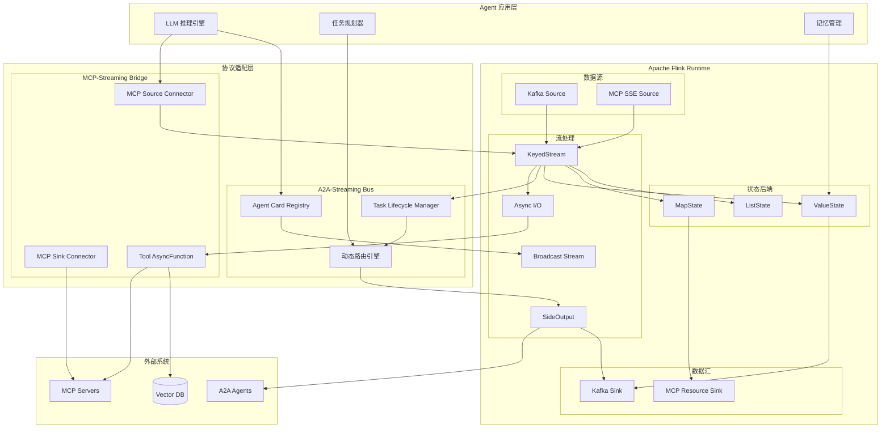
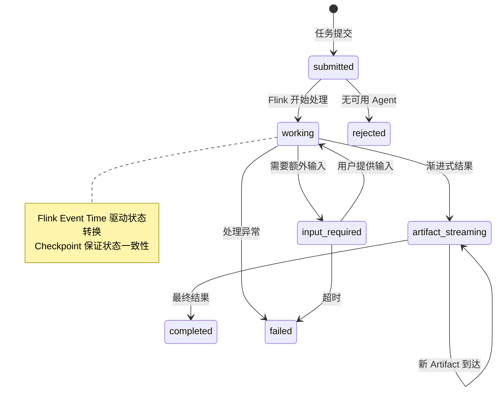

> **状态**: 🔮 前瞻内容 | **风险等级**: 中 | **最后更新**: 2026-04-20
>
> 本文档涉及 MCP/A2A 协议的流处理集成，协议本身仍在快速演进中。请以各协议官方最新规范为准。

---

# 流处理 + MCP/A2A 协议集成分析

> 所属阶段: Knowledge/06-frontier | 前置依赖: [ai-agent-streaming-architecture.md](ai-agent-streaming-architecture.md), [multi-agent-streaming-orchestration.md](multi-agent-streaming-orchestration.md) | 形式化等级: L4

---

## 1. 概念定义 (Definitions)

### Def-K-06-250: MCP-Streaming Bridge

**MCP-Streaming Bridge** 定义 Model Context Protocol 与流处理系统之间的双向适配层：

```yaml
MCP-Streaming Bridge:
  输入侧: 将 MCP Server 的 tool/resource/prompt 能力映射为流数据源
  输出侧: 将流处理结果作为 MCP Resource 暴露给 Agent 消费

  核心组件:
    MCP Source Connector:
      - 订阅 MCP Server 的 resource 变更通知
      - 将 tool 调用结果流式化为 DataStream
      - 支持 SSE 长连接与轮询降级

    MCP Sink Connector:
      - 将流处理聚合结果写入 MCP Resource
      - 触发 prompt 模板动态更新
      - 支持增量推送与全量快照

  协议映射:
    MCP Resource    → Flink Source (unbounded stream of resource updates)
    MCP Tool Call   → Flink AsyncFunction (enrichment operator)
    MCP Prompt      → Flink Broadcast Stream (configuration stream)
```

**形式化定义**：

$$
\text{Bridge} = (S_{mcp}, S_{flink}, \phi_{in}, \phi_{out})
$$

其中：

- $S_{mcp} = (\text{Tools}, \text{Resources}, \text{Prompts})$: MCP 能力空间
- $S_{flink} = (\text{DataStream}, \text{KeyedStream}, \text{BroadcastStream})$: Flink 流抽象空间
- $\phi_{in}: S_{mcp} \to S_{flink}$: MCP → Flink 编码映射
- $\phi_{out}: S_{flink} \to S_{mcp}$: Flink → MCP 解码映射

### Def-K-06-251: A2A-Streaming Agent Bus

**A2A-Streaming Agent Bus** 定义基于流处理引擎的 Agent-to-Agent 通信总线：

```yaml
A2A-Streaming Agent Bus:
  定位: 将 A2A 协议的消息传递语义嵌入流处理运行时
  优势: 利用 Flink 的 exactly-once 语义保证 Agent 间消息可靠性

  架构层次:
    传输层:
      - 基于 Flink DataStream 的 Agent Message 传输
      - 支持 keyed 分区 (按对话 ID / Agent ID)
      - 背压感知的消息流控

    协议层:
      - Agent Card 注册表 → Flink State (MapState)
      - Task 生命周期管理 → Flink Event Time 处理
      - Streaming Artifacts → Flink SideOutput

    应用层:
      - 多 Agent 协调拓扑 (Star / Tree / Mesh)
      - 动态任务路由 (基于 Agent Card 能力匹配)
      - 流式结果聚合 (渐进式 Artifact 收集)
```

**形式化定义**：

$$
\text{Bus} = (A, M, T, \lambda)
$$

其中：

- $A = \{a_1, a_2, ..., a_n\}$: 注册 Agent 集合
- $M$: Agent 间消息空间
- $T$: Task 生命周期状态机
- $\lambda: A \times M \to A$: 消息路由函数

---

## 2. 属性推导 (Properties)

### Prop-K-06-250: MCP-Streaming 端到端延迟上界

**命题**: MCP-Streaming Bridge 的端到端延迟存在确定上界：

$$
L_{total} = L_{mcp} + L_{bridge} + L_{flink} + L_{sink} \leq L_{sla}
$$

其中各分量上界：

| 延迟分量 | 典型值 | 优化策略 |
|---------|--------|---------|
| $L_{mcp}$ (MCP Server 处理) | 50-200ms | 本地 MCP Server, 连接池 |
| $L_{bridge}$ (协议转换) | 5-20ms | 零拷贝序列化, Arrow |
| $L_{flink}$ (流处理) | 10-100ms | 低延迟 Checkpoint, 增量计算 |
| $L_{sink}$ (结果暴露) | 10-50ms | SSE 推送, 增量更新 |

**在优化配置下**：

$$
L_{total}^{opt} \leq 300\text{ms} \quad (P_{99})
$$

---

## 3. 关系建立 (Relations)

### 3.1 MCP/A2A 与流处理系统的互补关系

| 维度 | MCP (垂直集成) | A2A (水平协作) | 流处理系统 (底层运行时) |
|------|---------------|---------------|----------------------|
| 连接方向 | Agent → Tools/Data | Agent ↔ Agent | 数据流 → 处理算子 |
| 状态管理 | 无状态 tool 调用 | 有状态 Task 生命周期 | Exactly-Once 状态后端 |
| 通信模式 | 请求-响应 / SSE | JSON-RPC / SSE / Push | 持续数据流 |
| 发现机制 | Tool Manifest | Agent Card | JobGraph 静态定义 |
| 流处理角色 | Source/Sink 连接器 | 消息总线与协调器 | 可靠传输与计算引擎 |

### 3.2 协议栈分层映射

```
┌─────────────────────────────────────────────────────────────┐
│                    Agent 应用层                              │
│         (LLM 推理 / 决策 / 规划)                             │
├─────────────────────────────────────────────────────────────┤
│  MCP 客户端层        │        A2A 协议层                     │
│  (Tool 调用)         │        (Agent 协作)                   │
├──────────────────────┴──────────────────────────────────────┤
│              MCP-Streaming Bridge / A2A-Streaming Bus        │
│                   (协议转换 + 语义映射)                       │
├─────────────────────────────────────────────────────────────┤
│                  Apache Flink Runtime                        │
│     (Exactly-Once / State / Checkpoint / Watermark)         │
├─────────────────────────────────────────────────────────────┤
│              Kafka / Pulsar / Kinesis (消息层)               │
└─────────────────────────────────────────────────────────────┘
```

---

## 4. 论证过程 (Argumentation)

### 4.1 为什么流处理系统适合承载 MCP/A2A？

**三大核心论据**：

1. **天然的事件驱动语义对齐**
   - MCP Resource 订阅 ↔ Flink 持续流 Source
   - A2A Task 状态变更 ↔ Flink Event Time 处理
   - 两者均以事件为基本处理单元

2. **生产级可靠性保障**
   - MCP Server 故障 → Flink Checkpoint 自动恢复
   - A2A Agent 离线 → Flink State 持久化消息不丢失
   - 背压场景 → Flink 自动流控防止系统过载

3. **弹性扩展与并行处理**
   - 多 MCP Server 负载均衡 → Flink 并行 Source 读取
   - 多 Agent 并发协作 → Flink KeyedStream 按会话分区
   - 峰值流量 → Flink Auto-scaling 动态扩缩容

### 4.2 典型集成模式对比

| 模式 | 适用场景 | 延迟 | 复杂度 | 可靠性 |
|------|---------|------|--------|--------|
| 直接 REST 调用 | 简单 tool 调用 | 低 | 低 | 低 |
| MCP + 流桥接 | 持续数据 enrichment | 中 | 中 | 高 |
| A2A + 流总线 | 多 Agent 协作工作流 | 中 | 高 | 高 |
| MCP + A2A + Flink | 企业级 Agent 平台 | 中 | 高 | 极高 |

---

## 5. 形式证明 / 工程论证 (Proof / Engineering Argument)

### Thm-K-06-250: A2A-Streaming Bus 消息传递正确性

**定理**: 基于 Flink 的 A2A-Streaming Agent Bus 保证 Agent 间消息传递满足 Exactly-Once 语义：

$$
\forall m \in M, a_i, a_j \in A: \text{Delivered}_{a_j}(m) \Rightarrow \text{ExactlyOnce}(m) \land \text{Ordered}(m)
$$

**证明概要**：

1. **唯一性**: Flink Checkpoint 机制保证每条消息在故障恢复后仅被处理一次
   - Source 偏移量持久化到 Checkpoint
   - 状态后端 (RocksDB/ForSt) 保证去重状态一致性

2. **有序性**: KeyedStream 按 `(conversation_id, agent_id)` 分区保证同一会话内消息 FIFO
   - 分区键选择: $k = hash(conv\_id) \mod parallelism$
   - 同一键的所有消息由同一 TaskManager 顺序处理

3. **传递性**: Flink 两阶段提交 Sink 保证 A2A Artifact 的端到端一致性
   - 预提交: Artifact 写入外部存储 + 元数据记录到 Checkpoint
   - 正式提交: Checkpoint 成功后标记 Artifact 为可消费

### Lemma-K-06-250: MCP Tool 调用幂等性

**引理**: 在 MCP-Streaming Bridge 中，重复 tool 调用不产生副作用：

$$
\forall t \in \text{Tools}, p \in \text{Params}: f_t(p) = f_t(p) \circ f_t(p)
$$

**工程实现**: 通过 Flink State 维护 `tool_call_id → result` 映射，重复调用直接返回缓存结果。

---

## 6. 实例验证 (Examples)

### 6.1 实时 RAG + MCP 流式增强

```java
// [伪代码片段 - 不可直接运行] 仅展示核心逻辑
// 场景: 用户问题流 → 实时检索 MCP Vector Store → 生成回答流

DataStream<UserQuery> queries = env
    .fromSource(kafkaSource, WatermarkStrategy.noWatermarks(), "queries");

// MCP Vector Store 作为 AsyncFunction 进行流式 enrichment
DataStream<EnrichedQuery> enriched = AsyncDataStream
    .unorderedWait(
        queries,
        new MCPVectorStoreAsyncFunction("mcp://vector-store/sse"),
        500, TimeUnit.MILLISECONDS, 100
    );

// LLM 推理算子 (调用 MCP LLM Server)
DataStream<AgentResponse> responses = enriched
    .keyBy(EnrichedQuery::getSessionId)
    .process(new LLMInferenceProcessFunction("mcp://llm-server/sse"));

// 结果写入 Kafka + 暴露为 MCP Resource
responses.addSink(kafkaSink);
responses.addSink(new MCPResourceSink("conversations/{sessionId}"));
```

### 6.2 多 Agent 客服系统 (A2A + Flink)

```java
// [伪代码片段 - 不可直接运行] 仅展示核心逻辑
// 场景: 用户消息 → 意图识别 Agent → 路由 → 专业 Agent → 结果聚合

// A2A Agent Card 注册表 (Broadcast Stream)
DataStream<AgentCard> agentRegistry = env
    .fromSource(agentCardSource, WatermarkStrategy.noWatermarks(), "registry");

// 用户消息流
DataStream<UserMessage> messages = env
    .fromSource(kafkaSource, WatermarkStrategy.forBoundedOutOfOrderness(...), "messages");

// Agent 协调处理
DataStream<A2ATask> tasks = messages
    .keyBy(UserMessage::getConversationId)
    .connect(agentRegistry.broadcast())
    .process(new A2ACoordinatorProcessFunction());

// 动态路由到专业 Agent
DataStream<A2ATaskResult> results = tasks
    .keyBy(A2ATask::getTargetAgentId)
    .process(new AgentExecutionProcessFunction());

// 渐进式 Artifact 聚合
DataStream<AggregatedResponse> aggregated = results
    .keyBy(A2ATaskResult::getConversationId)
    .window(EventTimeSessionWindows.withDynamicGap(...))
    .aggregate(new ArtifactAggregator());
```

---

## 7. 可视化 (Visualizations)

### 7.1 MCP/A2A + Flink 集成架构总图



### 7.2 A2A Task 生命周期与 Flink Watermark 对齐



---

## 8. 引用参考 (References)
