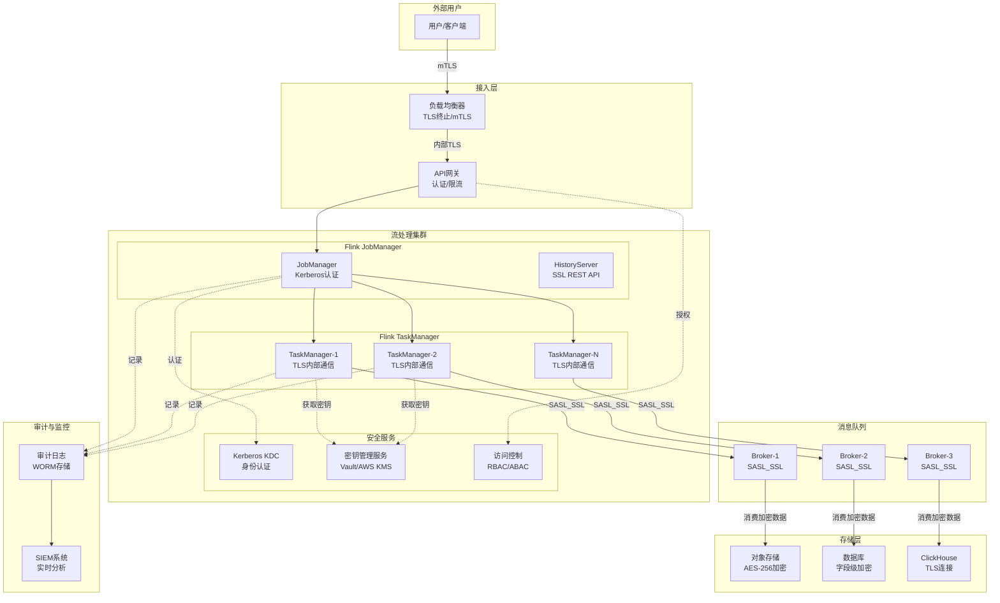
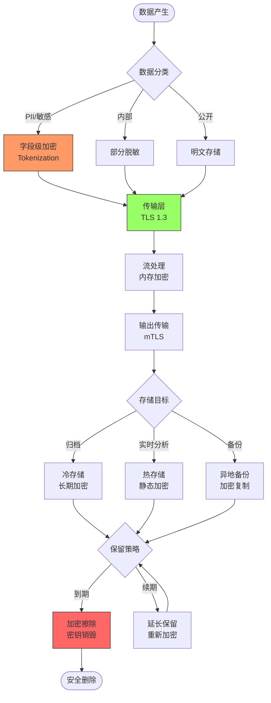
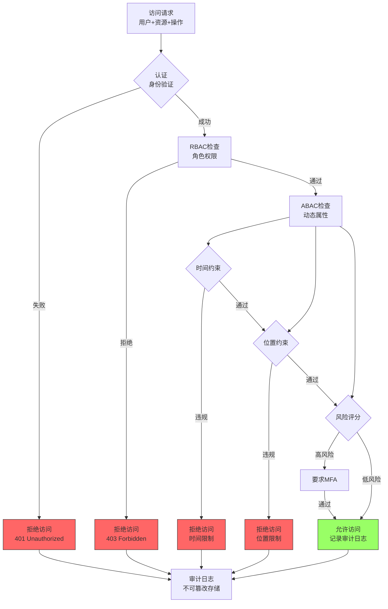
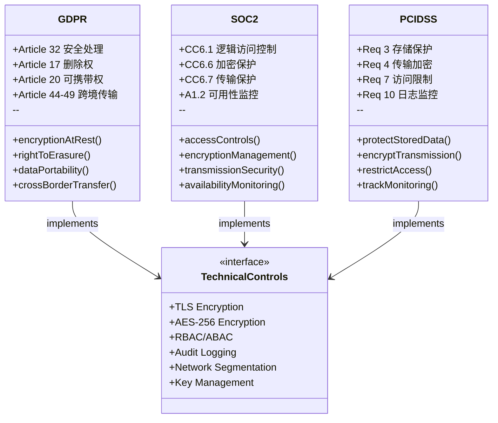

# 流处理安全架构与合规实践

> **所属阶段**: Knowledge | **前置依赖**: [Knowledge/04-patterns/stream-processing-patterns.md](../02-design-patterns/pattern-event-time-processing.md) | **形式化等级**: L3 (工程实践)

---

## 1. 概念定义 (Definitions)

### Def-K-06-160: 流处理安全威胁模型 (Streaming Security Threat Model)

流处理安全威胁模型是一个四元组 $\mathcal{T}_{stream} = (A, V, T, I)$，其中：

- $A$：威胁主体集合（攻击者类型）
  - $A_{external}$：外部攻击者（未授权访问、DDoS）
  - $A_{internal}$：内部威胁（权限滥用、数据泄露）
  - $A_{system}$：系统级威胁（配置错误、软件漏洞）

- $V$：脆弱性集合
  - $V_{network}$：网络层脆弱性（明文传输、未加密端口）
  - $V_{storage}$：存储层脆弱性（未加密数据、弱访问控制）
  - $V_{compute}$：计算层脆弱性（代码注入、序列化漏洞）

- $T$：威胁类型映射 $T: A \times V \rightarrow \{窃听, 篡改, 伪造, 拒绝服务, 越权访问\}$

- $I$：影响评估函数 $I(t) = (C_{impact}, I_{impact}, A_{impact})$，返回对CIA三元组的影响等级

### Def-K-06-161: CIA三元组在流处理中的形式化定义

对于流处理系统 $S$ 处理数据流 $D = \{d_1, d_2, ..., d_n\}$，CIA三元组定义为：

**机密性 (Confidentiality)**:
$$\forall d \in D, \forall p \in Principals: authorized(p, d) \iff read(p, d) \Rightarrow secret(d)$$

**完整性 (Integrity)**:
$$\forall d \in D: origin(d) = source(d) \land \neg tampered(d) \land order\_preserved(d)$$

**可用性 (Availability)**:
$$\forall t \in TimeWindow: P(available(S, t)) \geq SLA_{availability}$$

### Def-K-06-162: 传输安全协议栈 (Transport Security Stack)

传输安全协议栈 $\mathcal{P}_{transport}$ 是一个分层安全机制：

$$
\mathcal{P}_{transport} = \langle L_{network}, L_{transport}, L_{session}, L_{application} \rangle
$$

各层定义：

- $L_{network}$：网络隔离（VPC、子网、安全组）
- $L_{transport}$：TLS/mTLS加密通道
- $L_{session}$：SASL认证与会话管理
- $L_{application}$：应用层协议安全（如Kafka Protocol的SASL_SSL）

**TLS握手形式化**：
$$\text{TLS-Handshake}(C, S) \Rightarrow (K_{session}, Cert_{verified}, Cipher_{negotiated})$$

其中 $K_{session}$ 为会话密钥，满足 $K_{session} = PRF(master\_secret, "key expansion", ClientHello.random || ServerHello.random)$

### Def-K-06-163: 数据安全生命周期 (Data Security Lifecycle)

数据安全生命周期 $\mathcal{L}_{data}$ 描述数据在不同状态下的安全控制：

$$
\mathcal{L}_{data} = \{State_{in\_transit}, State_{at\_rest}, State_{in\_use}, State_{archived}\}
$$

各状态加密要求：

- $State_{in\_transit}$：传输加密（TLS 1.2+/1.3）
- $State_{at\_rest}$：存储加密（AES-256-GCM）
- $State_{in\_use}$：内存加密（可选的TEE/SGX）
- $State_{archived}$：长期存储加密 + 密钥分离

**字段级加密**定义为：
$$\forall f \in sensitive\_fields(d): f' = Encrypt(f, KEK_f)$$

其中 $KEK_f$ 为字段专用密钥加密密钥，满足 $KEK_f = HMAC(master\_key, field\_identifier)$

### Def-K-06-164: 访问控制模型 (Access Control Models)

**RBAC (Role-Based Access Control)**：
$$RBAC = (U, R, P, UA, PA, RH)$$

- $U$：用户集合
- $R$：角色集合
- $P$：权限集合
- $UA \subseteq U \times R$：用户-角色分配
- $PA \subseteq P \times R$：权限-角色分配
- $RH \subseteq R \times R$：角色层次关系（偏序）

**ABAC (Attribute-Based Access Control)**：
$$ABAC = (S, O, E, P_{policy})$$

- $S$：主体属性集合
- $O$：资源属性集合
- $E$：环境属性集合
- $P_{policy}: S \times O \times E \rightarrow \{Permit, Deny, NotApplicable\}$

策略判定函数：
$$decision(s, o, e) = \bigwedge_{i=1}^{n} condition_i(s.attr, o.attr, e.attr)$$

### Def-K-06-165: 合规框架映射 (Compliance Framework Mapping)

合规框架 $\mathcal{F}_{compliance}$ 是法规要求到技术控制的映射：

$$
\mathcal{F}_{compliance}: Regulation \times Domain \rightarrow Control_{technical}
$$

主要框架：

- **GDPR**：数据主体权利（访问、删除、可携带）、合法处理基础、跨境传输机制
- **SOC2**：信任服务标准（安全性、可用性、处理完整性、保密性、隐私性）
- **PCI-DSS**：持卡人数据环境（CDE）保护、网络分段、加密要求

---

## 2. 属性推导 (Properties)

### Lemma-K-06-110: TLS层级的机密性保证

**命题**：若流处理系统 $orall c \in Connections$ 均启用TLS 1.3且证书链验证通过，则传输层满足语义安全。

**证明概要**：
TLS 1.3的握手协议产生独立的会话密钥 $K_{session}$，且：

1. 前向保密：$K_{session}$ 不依赖于长期私钥
2. 密钥分离：每条连接使用独立的 $K_{session}$
3. 认证性：证书链验证确保 $identity(S) = identity(Cert_S)$

由TLS 1.3的安全性定理[^1]，在随机预言机模型下，TLS 1.3的AEAD加密满足IND-CCA安全性。

∎

### Lemma-K-06-111: RBAC层次化的权限继承

**命题**：在RBAC模型中，若 $r_1 \succeq_{RH} r_2$（$r_1$ 在层次中高于 $r_2$），则 $permissions(r_1) \supseteq permissions(r_2)$。

**证明**：
由角色层次定义 $RH$，权限继承满足：
$$r_1 \succeq_{RH} r_2 \Rightarrow \forall p \in P: (p, r_2) \in PA \Rightarrow (p, r_1) \in PA$$

这是偏序关系的传递闭包性质。通过归纳法：

- 基例：$(r_2, r_2) \in RH^*$，显然成立
- 归纳步：若 $(r_i, r_2) \in RH^*$ 且 $(r_1, r_i) \in RH$，则 $permissions(r_1) \supseteq permissions(r_i) \supseteq permissions(r_2)$

∎

### Lemma-K-06-112: 端到端加密的数据独立性

**命题**：在端到端加密架构中，中间节点 $N_{intermediate}$ 无法获取明文内容，即：
$$\forall d_{transit}: knows(N_{intermediate}, d_{transit}) \Rightarrow \neg knows(N_{intermediate}, plaintext(d))$$

**证明**：
端到端加密满足：
$$c = Encrypt_{K_{dest}}(plaintext), \quad K_{dest} \notin keyset(N_{intermediate})$$

在计算安全假设下（AES-256-GCM），没有 $K_{dest}$ 则无法从 $c$ 恢复 $plaintext$。

若中间节点尝试篡改：
$$Decrypt_{K_{dest}}(c') = \bot \text{ (认证失败)}$$

由GCM的认证性保证，篡改概率 $\leq 2^{-128}$。

∎

### Prop-K-06-110: 多层安全控制的复合效应

**命题**：复合安全控制的安全性不低于各层安全性的合取：
$$Security_{composite} \geq Security_{network} \land Security_{transport} \land Security_{application}$$

**论证**：
攻击者要成功入侵，必须突破所有安全层：
$$P(success) = P(break_{network}) \times P(break_{transport} | break_{network}) \times P(break_{app} | break_{network}, break_{transport})$$

在独立层假设下：
$$P(success) \leq \prod_{i} P(break_i) \ll min_i P(break_i)$$

这体现了**防御纵深**原则。

### Prop-K-06-111: 最小权限原则的形式化表述

**命题**：在RBAC系统中，若满足最小权限原则，则：
$$\forall u \in U: permissions(user) = \bigcup_{(u,r) \in UA} permissions(r) = permissions_{required}(job\_function(u))$$

且不存在 $p \in permissions(user)$ 使得 $p \notin permissions_{required}(job\_function(u))$。

---

## 3. 关系建立 (Relations)

### 3.1 流处理安全架构层次图

流处理安全涉及多个层次，从底层网络到上层应用：

```
┌─────────────────────────────────────────────────────────────────┐
│                     Application Layer                            │
│  ┌─────────────┐  ┌─────────────┐  ┌─────────────────────────┐  │
│  │ 字段级加密   │  │ Tokenization│  │      审计日志            │  │
│  └─────────────┘  └─────────────┘  └─────────────────────────┘  │
├─────────────────────────────────────────────────────────────────┤
│                     Data Layer                                   │
│  ┌─────────────┐  ┌─────────────┐  ┌─────────────────────────┐  │
│  │ 静态加密     │  │  密钥管理   │  │    数据分类标记          │  │
│  └─────────────┘  └─────────────┘  └─────────────────────────┘  │
├─────────────────────────────────────────────────────────────────┤
│                   Transport Layer                                │
│  ┌─────────────┐  ┌─────────────┐  ┌─────────────────────────┐  │
│  │  TLS/mTLS   │  │   SASL认证  │  │     证书管理             │  │
│  └─────────────┘  └─────────────┘  └─────────────────────────┘  │
├─────────────────────────────────────────────────────────────────┤
│                    Network Layer                                 │
│  ┌─────────────┐  ┌─────────────┐  ┌─────────────────────────┐  │
│  │  VPC隔离    │  │  安全组/ACL │  │     网络分段             │  │
│  └─────────────┘  └─────────────┘  └─────────────────────────┘  │
├─────────────────────────────────────────────────────────────────┤
│                 Infrastructure Layer                             │
│  ┌─────────────┐  ┌─────────────┐  ┌─────────────────────────┐  │
│  │ 物理安全    │  │  主机加固   │  │     漏洞管理             │  │
│  └─────────────┘  └─────────────┘  └─────────────────────────┘  │
└─────────────────────────────────────────────────────────────────┘
```

### 3.2 安全控制与CIA三元组的映射

| 安全控制 | 机密性 (C) | 完整性 (I) | 可用性 (A) |
|---------|-----------|-----------|-----------|
| TLS加密 | ✅ 防窃听 | ✅ 防篡改 | ❌ |
| mTLS双向认证 | ✅ 身份验证 | ✅ 双向信任 | ❌ |
| 静态加密 | ✅ 数据保密 | ❌ | ❌ |
| 字段级加密 | ✅ 细粒度保密 | ❌ | ❌ |
| RBAC | ✅ 访问控制 | ✅ 授权完整性 | ❌ |
| 审计日志 | ❌ | ✅ 可追溯 | ❌ |
| DDoS防护 | ❌ | ❌ | ✅ 服务可用 |
| 网络隔离 | ✅ 边界保护 | ✅ 攻击面控制 | ✅ 故障隔离 |

### 3.3 合规框架与技术控制映射

**GDPR技术控制映射**：

- 第32条（安全处理）：TLS加密 + 静态加密 + 访问控制
- 第17条（删除权）：数据生命周期管理 + 加密擦除
- 第20条（可携带权）：标准化格式导出（JSON/Avro）
- 第44-49条（跨境传输）： adequacy decision / SCC / BCRs

**SOC2 Type II控制映射**：

- CC6.1（逻辑访问控制）：RBAC + MFA + 定期访问评审
- CC6.6（加密）：密钥管理 + 算法合规性
- CC6.7（传输保护）：TLS配置基线 + 证书轮换
- A1.2（可用性监控）：SLA监控 + 故障切换

**PCI-DSS控制映射**：

- Req 3（存储保护）：AES-256加密 + 密钥分离
- Req 4（传输加密）：TLS 1.2+ + 强密码套件
- Req 7（访问限制）：基于业务需求的RBAC
- Req 10（日志监控）：集中审计 + 完整性保护

---

## 4. 论证过程 (Argumentation)

### 4.1 流处理特有的安全挑战

**挑战1：实时性 vs 安全开销**

- 问题：加密/解密增加端到端延迟
- 分析：AES-NI硬件加速使吞吐量损失 < 5%
- 方案：异步加密、批处理加密、专用加密卸载卡

**挑战2：有状态处理与密钥管理**

- 问题：状态恢复需要历史密钥
- 分析：密钥版本化 + 密钥派生树
- 方案：HSM保护根密钥，派生密钥按版本管理

**挑战3：多租户隔离**

- 问题：共享集群中的租户间隔离
- 分析：Namespace隔离 + 资源配额 + 网络策略
- 方案：Kubernetes NetworkPolicy + OPA策略引擎

### 4.2 威胁模型实例分析

**场景：Kafka Streams金融数据管道**

威胁树分析：

```
                    [数据泄露]
                        │
        ┌───────────────┼───────────────┐
        │               │               │
    [传输窃听]      [存储窃取]       [内部泄露]
        │               │               │
    ┌───┴───┐       ┌───┴───┐       ┌───┴───┐
    │       │       │       │       │       │
[明文]  [证书]  [磁盘]  [备份]  [DBA]   [开发者]
传输    泄露    未加密  未加密  越权    密钥硬编码
```

缓解措施：

1. 强制TLS 1.3 + mTLS
2. 磁盘加密（LUKS/BitLocker）
3. 外部KMS（HashiCorp Vault/AWS KMS）
4. 定期访问评审 + 行为分析

### 4.3 安全架构决策矩阵

| 决策 | 选项A | 选项B | 权衡 |
|-----|-------|-------|------|
| 传输加密 | TLS终止于LB | 端到端TLS | 性能 vs 安全 |
| 密钥存储 | 软件KMS | HSM | 成本 vs 合规 |
| 访问控制 | RBAC | ABAC | 复杂度 vs 细粒度 |
| 审计粒度 | 记录所有 | 采样记录 | 存储 vs 追溯 |

---

## 5. 形式证明 / 工程论证 (Proof / Engineering Argument)

### Thm-K-06-110: 流处理端到端安全协议的安全性

**定理**：给定流处理系统 $S$ 满足以下条件：

1. 所有连接使用TLS 1.3且证书有效
2. 静态数据使用AES-256-GCM加密，密钥由KMS管理
3. 访问控制实施RBAC + ABAC混合模型
4. 审计日志不可篡改（WORM存储或区块链锚定）

则系统 $S$ 满足端到端安全性质：
$$\forall d \in Data: confidential(d) \land integral(d) \land auditable(d)$$

**证明**：

**Step 1: 传输层机密性**
由Lemma-K-06-110，TLS 1.3保证传输机密性：
$$\forall c \in connections: confidential_{transit}(data_c)$$

**Step 2: 存储层机密性**
AES-256-GCM在密钥安全假设下满足IND-CPA和INT-CTXT：
$$Pr[Game_{IND-CPA}^{\mathcal{A}}(k) = 1] \leq negl(k)$$

**Step 3: 访问控制完整性**
RBAC的授权判定是确定性的：
$$authorize(u, r, p) = true \iff (u,r) \in UA \land (p,r) \in PA$$

**Step 4: 审计完整性**
WORM存储确保：
$$\forall log \in Audit: append\_only(log) \land \neg modify(log)$$

**Step 5: 组合论证**
由Prop-K-06-110，多层控制的复合效应：
$$Security_{e2e} = Security_{transit} \land Security_{at\_rest} \land Security_{access} \land Security_{audit}$$

综上，系统 $S$ 满足端到端安全。

∎

### Thm-K-06-111: 合规性验证的可判定性

**定理**：对于给定的合规框架 $\mathcal{F}$ 和系统配置 $C$，存在算法可以在多项式时间内判定 $C \models \mathcal{F}$（配置满足合规要求）。

**证明概要**：
合规要求可表示为约束集合 $\{c_1, c_2, ..., c_n\}$，每个约束是布尔表达式：

- 加密约束：$enabled(tls) \land version(tls) \geq 1.2$
- 访问约束：$\forall u: |permissions(u)| \leq threshold$
- 审计约束：$retention(logs) \geq 365\ days$

验证算法：

```
function VerifyCompliance(C, F):
    for each constraint c in F:
        if not Evaluate(c, C):
            return (false, c)
    return (true, null)
```

每个约束的求值是常数时间，总复杂度 $O(|F|)$。

∎

### Thm-K-06-112: 密钥轮换期间的业务连续性

**定理**：在密钥轮换策略下，若旧密钥保留时间为 $T_{overlap}$，且所有在途消息的处理时间 $< T_{overlap}$，则密钥轮换不会导致数据丢失。

**证明**：
设密钥轮换发生在 $t_0$，旧密钥 $K_{old}$ 过期时间为 $t_0 + T_{overlap}$。

对于在 $t < t_0$ 加密的数据 $d$：

- 若 $d$ 在 $[t_0, t_0 + T_{overlap}]$ 内被处理：使用 $K_{old}$ 解密 ✓
- 若 $d$ 在 $t > t_0 + T_{overlap}$ 到达：
  - 若处理时间约束满足：已在 $t_0 + T_{overlap}$ 前完成 ✓
  - 否则：数据过期，按SLA降级处理

由鸽巢原理，在途消息数量上限：
$$N_{in\_flight} = \lambda \times T_{overlap}$$
其中 $\lambda$ 为消息到达率。

∎

---

## 6. 实例验证 (Examples)

### 6.1 Kafka安全集群配置

**server.properties - 安全配置示例**：

```properties
# === 监听配置 === listeners=SASL_SSL://:9092
security.inter.broker.protocol=SASL_SSL
ssl.enabled.protocols=TLSv1.3
ssl.truststore.location=/etc/kafka/truststore.jks
ssl.truststore.password=${TRUSTSTORE_PASSWORD}
ssl.keystore.location=/etc/kafka/keystore.jks
ssl.keystore.password=${KEYSTORE_PASSWORD}
ssl.key.password=${KEY_PASSWORD}

# === SASL配置 === sasl.enabled.mechanisms=GSSAPI,SCRAM-SHA-512
sasl.mechanism.inter.broker.protocol=GSSAPI

# === ACL配置 === authorizer.class.name=kafka.security.authorizer.AclAuthorizer
allow.everyone.if.no.acl.found=false
super.users=User:admin;User:kafka

# === 静态加密 === log.segment.bytes=1073741824
log.retention.hours=168
# 使用KMS进行密钥管理 log.cleaner.enable=true
```

**JAAS配置 - Kerberos集成**：

```java
// [伪代码片段 - 不可直接运行] 仅展示核心逻辑
KafkaServer {
    com.sun.security.auth.module.Krb5LoginModule required
    useKeyTab=true
    storeKey=true
    keyTab="/etc/kafka/keytabs/kafka.keytab"
    principal="kafka/broker1.example.com@EXAMPLE.COM";
};

Client {
    com.sun.security.auth.module.Krb5LoginModule required
    useKeyTab=true
    storeKey=true
    keyTab="/etc/kafka/keytabs/zookeeper.keytab"
    principal="zookeeper/broker1.example.com@EXAMPLE.COM";
};
```

### 6.2 Flink SSL配置

**flink-conf.yaml - SSL配置**：

```yaml
# === SSL配置 === security.ssl.enabled: true
security.ssl.algorithms: TLSv1.3
security.ssl.internal.enabled: true
security.ssl.rest.enabled: true

# === 内部通信SSL === security.ssl.internal.keystore: /opt/flink/ssl/flink.keystore
security.ssl.internal.keystore-password: ${KEYSTORE_PASS}
security.ssl.internal.key-password: ${KEY_PASS}
security.ssl.internal.truststore: /opt/flink/ssl/flink.truststore
security.ssl.internal.truststore-password: ${TRUSTSTORE_PASS}

# === REST API SSL === security.ssl.rest.keystore: /opt/flink/ssl/rest.keystore
security.ssl.rest.keystore-password: ${KEYSTORE_PASS}
security.ssl.rest.key-password: ${KEY_PASS}
security.ssl.rest.truststore: /opt/flink/ssl/rest.truststore
security.ssl.rest.truststore-password: ${TRUSTSTORE_PASS}

# === Kerberos配置 === security.kerberos.login.use-ticket-cache: false
security.kerberos.login.keytab: /opt/flink/keytabs/flink.keytab
security.kerberos.login.principal: flink@EXAMPLE.COM

# === 审计日志 === audit.log.enabled: true
audit.log.destination: kafka
audit.log.topic: flink-audit-logs
```

### 6.3 字段级加密实现

**Flink DataStream字段加密**：

```java
import org.apache.flink.api.common.functions.MapFunction;

public class FieldEncryptionMapFunction
    implements MapFunction<Transaction, EncryptedTransaction> {

    private transient Cipher cipher;
    private transient SecretKeySpec keySpec;

    @Override
    public void open(Configuration parameters) {
        // 从KMS获取密钥
        byte[] key = KMSClient.getDataKey("transaction-key");
        keySpec = new SecretKeySpec(key, "AES");
        cipher = Cipher.getInstance("AES/GCM/NoPadding");
    }

    @Override
    public EncryptedTransaction map(Transaction txn) throws Exception {
        // 加密敏感字段
        byte[] iv = new byte[12];
        SecureRandom.getInstanceStrong().nextBytes(iv);

        cipher.init(Cipher.ENCRYPT_MODE, keySpec, new GCMParameterSpec(128, iv));
        byte[] encryptedCard = cipher.doFinal(txn.getCardNumber().getBytes());

        return EncryptedTransaction.builder()
            .transactionId(txn.getId())
            .encryptedCard(Base64.getEncoder().encodeToString(encryptedCard))
            .iv(Base64.getEncoder().encodeToString(iv))
            .amount(txn.getAmount())  // 非敏感字段明文存储
            .build();
    }
}
```

### 6.4 Kubernetes网络策略

**NetworkPolicy - 流处理命名空间隔离**：

```yaml
apiVersion: networking.k8s.io/v1
kind: NetworkPolicy
metadata:
  name: flink-job-isolation
  namespace: streaming
spec:
  podSelector:
    matchLabels:
      app: flink-job
  policyTypes:
    - Ingress
    - Egress
  ingress:
    # 只允许来自Kafka的流量
    - from:
        - namespaceSelector:
            matchLabels:
              name: kafka
        - podSelector:
            matchLabels:
              app: kafka
      ports:
        - protocol: TCP
          port: 9092
  egress:
    # 只允许访问Kafka和监控
    - to:
        - namespaceSelector:
            matchLabels:
              name: kafka
      ports:
        - protocol: TCP
          port: 9092
    - to:
        - namespaceSelector:
            matchLabels:
              name: monitoring
      ports:
        - protocol: TCP
          port: 9090
```

---

## 7. 可视化 (Visualizations)

### 7.1 流处理安全架构全景图



### 7.2 数据安全生命周期流程图



### 7.3 访问控制决策流程



### 7.4 合规框架映射矩阵



---

## 8. 引用参考 (References)

[^1]: Rescorla, E., "The Transport Layer Security (TLS) Protocol Version 1.3", RFC 8446, August 2018. <https://datatracker.ietf.org/doc/html/rfc8446>


---

> **文档状态**: 完成 ✅ | **最后更新**: 2026-04-03 | **形式化等级**: L3
