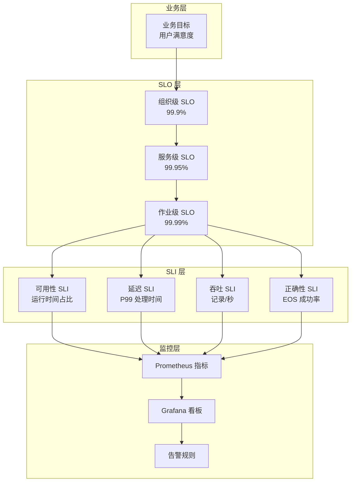
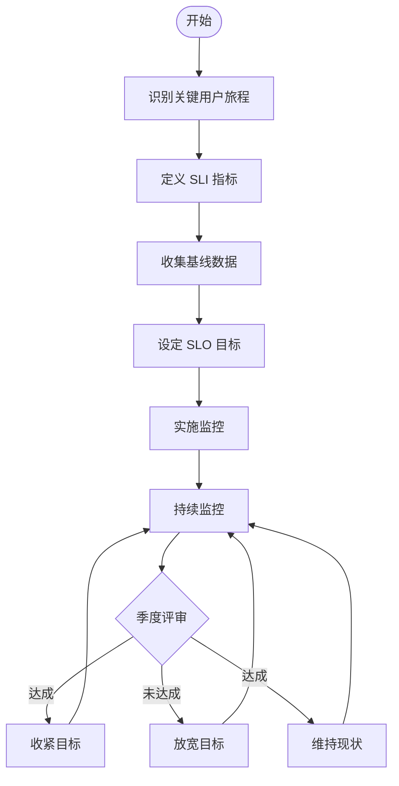
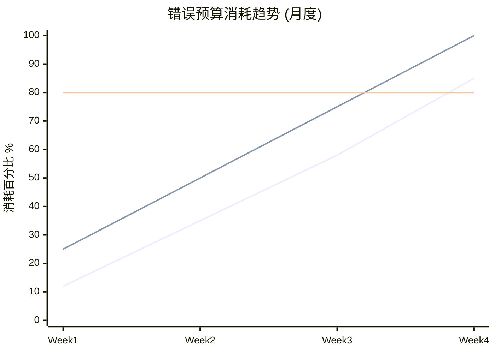

# 流计算 SLO/SLI 定义与可靠性工程

> 所属阶段: Knowledge | 前置依赖: [05-ecosystem/streaming-quality-assurance.md](../07-best-practices/07.01-flink-production-checklist.md) | 形式化等级: L3

---

## 目录

- [流计算 SLO/SLI 定义与可靠性工程](#流计算-slosli-定义与可靠性工程)
  - [目录](#目录)
  - [1. 概念定义 (Definitions)](#1-概念定义-definitions)
    - [Def-K-06-19: 服务水平指标 (Service Level Indicator, SLI)](#def-k-06-19-服务水平指标-service-level-indicator-sli)
    - [Def-K-06-20: 服务水平目标 (Service Level Objective, SLO)](#def-k-06-20-服务水平目标-service-level-objective-slo)
    - [Def-K-06-21: 错误预算 (Error Budget)](#def-k-06-21-错误预算-error-budget)
    - [Def-K-06-22: 可用性计算](#def-k-06-22-可用性计算)
  - [2. 属性推导 (Properties)](#2-属性推导-properties)
    - [Prop-K-06-01: SLI 选择准则](#prop-k-06-01-sli-选择准则)
    - [Prop-K-06-02: SLO 层叠结构](#prop-k-06-02-slo-层叠结构)
    - [Lemma-K-06-01: 错误预算耗尽定理](#lemma-k-06-01-错误预算耗尽定理)
  - [3. 关系建立 (Relations)](#3-关系建立-relations)
    - [3.1 SLO 与工程实践的映射](#31-slo-与工程实践的映射)
    - [3.2 与 Dataflow 模型的关联](#32-与-dataflow-模型的关联)
    - [3.3 与 Flink 机制的映射](#33-与-flink-机制的映射)
  - [4. 论证过程 (Argumentation)](#4-论证过程-argumentation)
    - [4.1 为什么流计算需要特殊 SLO？](#41-为什么流计算需要特殊-slo)
    - [4.2 SLO 设定中的常见陷阱](#42-slo-设定中的常见陷阱)
  - [5. 工程论证 (Engineering Argument)](#5-工程论证-engineering-argument)
    - [5.1 流计算特定 SLO 体系](#51-流计算特定-slo-体系)
    - [5.2 SLO 制定流程](#52-slo-制定流程)
    - [5.3 错误预算政策](#53-错误预算政策)
  - [6. 实例验证 (Examples)](#6-实例验证-examples)
    - [6.1 电商平台实时推荐系统 SLO](#61-电商平台实时推荐系统-slo)
    - [6.2 金融风控系统 SLO](#62-金融风控系统-slo)
  - [7. 可视化 (Visualizations)](#7-可视化-visualizations)
    - [7.1 SLO/SLI 体系层次图](#71-slosli-体系层次图)
    - [7.2 SLO 制定流程图](#72-slo-制定流程图)
    - [7.3 错误预算消耗追踪图](#73-错误预算消耗追踪图)
  - [8. 引用参考 (References)](#8-引用参考-references)

## 1. 概念定义 (Definitions)

### Def-K-06-19: 服务水平指标 (Service Level Indicator, SLI)

**形式化定义**：设服务系统为 $S$，观测时间窗口为 $T$，则 SLI 是映射：

$$\text{SLI}_S: T \times \Omega \to \mathbb{R}^+$$

其中 $\Omega$ 为观测样本空间，输出为服务质量的量化度量。

**流计算语境下的 SLI**：

- **可用性 SLI**: $A = \frac{\text{服务正常运行时间}}{\text{总观测时间}}$
- **延迟 SLI**: $L_p = p\text{-th 百分位处理延迟}$
- **吞吐量 SLI**: $T = \frac{\text{实际处理记录数/秒}}{\text{目标吞吐量}}$
- **新鲜度 SLI**: $F = t_{\text{now}} - t_{\text{last\_event}}$

**直观解释**：SLI 是服务质量的"温度计"——它回答"服务表现如何"这个问题。良好的 SLI 应具备可测量性、可操作性、代表性和可理解性。

---

### Def-K-06-20: 服务水平目标 (Service Level Objective, SLO)

**形式化定义**：SLO 是一个二元组 $(\text{SLI}, \theta)$，其中：

$$\text{SLO} = \{ (s, c) \mid s \in \text{SLI}, c \in C, P(s \text{ satisfies } c) \geq 1 - \epsilon \}$$

- $C$ 为目标条件集合（如 $\geq 99.9\%$, $< 1s$）
- $\epsilon$ 为允许违反概率阈值
- $1 - \epsilon$ 称为**置信水平**

**SLO 合规判定**：
在观测周期 $T$ 内，若满足条件的样本比例为 $r$，则：

$$\text{Compliance}(\text{SLO}) = \mathbb{1}_{[r \geq \theta]} \in \{0, 1\}$$

**直观解释**：SLO 是服务质量的"及格线"——它将 SLI 与业务期望绑定，定义"什么算好"。

---

### Def-K-06-21: 错误预算 (Error Budget)

**形式化定义**：给定 SLO 目标 $\theta$ 和时间窗口 $T$，错误预算 $E$ 定义为：

$$E = (1 - \theta) \times |T|$$

其中 $|T|$ 为窗口内的总请求/事件数。

**预算消耗速率**：
设到当前时刻 $t$ 已消耗预算为 $e(t)$，则：

$$\text{消耗率} = \frac{e(t)}{E \times \frac{t}{|T|}}$$

| 消耗率范围 | 状态 | 行动建议 |
|-----------|------|----------|
| $< 50\%$ | 健康 | 正常迭代 |
| $50\% - 80\%$ | 警戒 | 评估风险 |
| $80\% - 100\%$ | 危险 | 冻结新功能发布 |
| $> 100\%$ | 违约 | 启动可靠性攻坚 |

**直观解释**：错误预算是 SLO 的"货币化"表达——它将抽象的百分比转换为可操作的时间/次数单位，平衡可靠性与创新速度。

---

### Def-K-06-22: 可用性计算

**形式化定义**：可用性 $A$ 是系统处于可服务状态的时间占比：

$$A = \frac{MTBF}{MTBF + MTTR}$$

其中：

- $MTBF$ (Mean Time Between Failures): 平均故障间隔时间
- $MTTR$ (Mean Time To Recovery): 平均恢复时间

**N个9对应关系**：

| 可用性目标 | 年允许停机时间 | 月允许停机时间 | 适用场景 |
|-----------|--------------|---------------|----------|
| 99% (2个9) | 3.65 天 | 7.3 小时 | 内部工具 |
| 99.9% (3个9) | 8.76 小时 | 43.8 分钟 | 标准业务 |
| 99.99% (4个9) | 52.6 分钟 | 4.4 分钟 | 关键业务 |
| 99.999% (5个9) | 5.26 分钟 | 26.3 秒 | 金融核心 |

**流计算可用性扩展**：
对长时间运行 (Always-On) 的流作业，可用性计算需考虑：

$$A_{\text{streaming}} = \frac{\sum_{i} (t_{i}^{\text{end}} - t_{i}^{\text{start}})}{T_{\text{total}}}$$

其中 $\{(t_{i}^{\text{start}}, t_{i}^{\text{end}})\}$ 为所有正常运行区间的集合。

---

## 2. 属性推导 (Properties)

### Prop-K-06-01: SLI 选择准则

**命题**：有效的流计算 SLI 应满足以下性质：

1. **端到端可观测性**: SLI 应覆盖用户实际感知的完整路径
   $$\text{SLI}_{\text{e2e}} = f(\text{SLI}_{\text{ingest}}, \text{SLI}_{\text{process}}, \text{SLI}_{\text{sink}})$$

2. **因果可解释性**: 若 SLO 违反，应能定位到具体组件
   $$\text{Violation}(\text{SLO}) \implies \exists c \in \text{Components}: \text{RootCause}(c)$$

3. **统计稳定性**: SLI 应在合理时间窗口内收敛
   $$\text{Var}(\text{SLI}_T) < \delta, \quad \forall T \geq T_{\min}$$

---

### Prop-K-06-02: SLO 层叠结构

**命题**：流系统 SLO 存在自然层级：

$$
\text{SLO}_{\text{org}} \supseteq \text{SLO}_{\text{service}} \supseteq \text{SLO}_{\text{pipeline}} \supseteq \text{SLO}_{\text{operator}}
$$

且满足误差分配约束：

$$1 - \theta_{\text{org}} \geq \sum_{i} (1 - \theta_{i})$$

**工程意义**：组织级 SLO 必须比下层 SLO 更宽松，为各层级预留误差空间。

---

### Lemma-K-06-01: 错误预算耗尽定理

**引理**：若在时间窗口 $\tau < T$ 内错误预算已耗尽，则：

$$P(\text{SLO}_{\text{next}} \text{ satisfied}) \leq \frac{T - \tau}{T} \times \theta$$

**证明概要**：
剩余可用错误份额为 0，任何后续故障都将导致 SLO 违约。仅剩策略是确保后续 100% 成功，这在复杂流系统中概率极低。

---

## 3. 关系建立 (Relations)

### 3.1 SLO 与工程实践的映射

```
┌─────────────────────────────────────────────────────────────┐
│                      可靠性工程体系                           │
├─────────────────────────────────────────────────────────────┤
│  SLO (目标)  ←──────→  SLI (指标)  ←──────→  SLI采集系统      │
│     ↑                                            ↓          │
│  错误预算  ←──────→  发布策略  ←──────→  监控告警系统        │
│     ↑                                            ↓          │
│  可靠性攻坚  ←────→  故障复盘  ←──────→  可观测性平台        │
└─────────────────────────────────────────────────────────────┘
```

### 3.2 与 Dataflow 模型的关联

| Dataflow 概念 | SLO/SLI 对应 |
|--------------|-------------|
| Watermark 延迟 | 新鲜度 SLI |
| Processing-time 延迟 | 延迟 SLI |
| Exactly-Once 保证 | 正确性 SLO |
| Window 触发及时性 | 可用性/延迟 SLO |

### 3.3 与 Flink 机制的映射

| Flink 机制 | 相关 SLO | 监控切入点 |
|-----------|---------|-----------|
| Checkpoint | 恢复时间 SLO | checkpointDuration, failedCheckpoints |
| Watermark | 新鲜度 SLO | currentOutputWatermark |
| Backpressure | 延迟/吞吐 SLO | backPressuredTimeMsPerSecond |
| Savepoint | 发布窗口 SLO | 协调 Checkpoint 触发 |

---

## 4. 论证过程 (Argumentation)

### 4.1 为什么流计算需要特殊 SLO？

**传统批处理 vs 流计算**：

| 维度 | 批处理 | 流计算 |
|------|--------|--------|
| 时间模型 | 离散批次 | 连续时间 |
| 失败影响 | 单次作业 | 持续累积 |
| 恢复要求 | 小时级可接受 | 秒/分钟级期望 |
| 度量频率 | 批次完成时 | 持续采样 |

**核心差异**：流作业故障具有**持续累积效应**——每分钟停机可能意味着数百万事件的丢失或延迟，而非批处理中仅影响单个批次。

### 4.2 SLO 设定中的常见陷阱

1. **过度优化可用性，忽视延迟**
   - 反例：系统显示 99.99% 可用，但 P99 延迟达 30 秒
   - 后果：用户实际体验差，业务逻辑超时

2. **SLI 指标与用户体验脱节**
   - 反例：监控 Kafka Consumer Lag 而非端到端延迟
   - 后果：Lag 正常但 Sink 阻塞，用户仍感知延迟

3. **SLO 过于激进导致成本失控**
   - 反例：追求 5个9 可用性，但故障率仅 0.001%
   - 后果：冗余成本可能超过业务收益

---

## 5. 工程论证 (Engineering Argument)

### 5.1 流计算特定 SLO 体系

基于行业实践，流计算系统应定义以下 SLO 类别：

| 类别 | SLI 定义 | 典型 SLO | 测量方法 |
|------|----------|----------|----------|
| **可用性** | 作业运行时间占比 | 99.9% | (运行时间/总时间) × 100% |
| **延迟** | P99 处理延迟 | < 1s | `now() - event_timestamp` 的 P99 |
| **正确性** | Exactly-Once 成功率 | 99.99% | 成功 EOS 事务数 / 总事务数 |
| **新鲜度** | 数据到达延迟 | < 5s | `now() - max(event_time in window)` |
| **吞吐量** | 实际/目标吞吐比 | > 80% | 实际 RPS / 目标 RPS |
| **恢复性** | 故障恢复时间 | < 3min | 检测到故障 → 完全恢复耗时 |

**SLO 优先级建议**：

```
P0 (关键): 可用性 > 正确性 > 恢复性
P1 (重要): 延迟 > 新鲜度
P2 (优化): 吞吐量
```

### 5.2 SLO 制定流程

**Step 1: 识别关键用户旅程 (CUJ)**

```
示例 CUJ: 实时风控决策
├── 数据接入 (Kafka → Flink)
├── 规则计算 (CEP 窗口处理)
├── 决策输出 (Flink → Redis)
└── 结果查询 (API 服务)
```

**Step 2: 定义 SLI**

对每个 CUJ 步骤，定义可量化的 SLI：

- 数据接入延迟: `kafka_consumer_lag × avg_event_size / throughput`
- 处理延迟: `output_watermark - input_watermark`
- 端到端延迟: `api_response_time - event_timestamp`

**Step 3: 设定 SLO 目标**

采用**渐进收紧**策略：

1. 初始目标 = 当前基线 × 0.9
2. 运行 4 周后评估实际达成
3. 若持续达成，收紧目标；若频繁违约，放宽目标

**Step 4: 实施监控**

```java
// Prometheus 指标示例
Counter slo_violations_total = Counter.build()
    .name("streaming_slo_violations_total")
    .labelNames("slo_type", "pipeline_name")
    .help("Total SLO violations")
    .register();

Histogram event_latency = Histogram.build()
    .name("event_processing_latency_seconds")
    .buckets(0.01, 0.1, 0.5, 1, 5, 10)
    .help("End-to-end event processing latency")
    .register();
```

**Step 5: 持续改进**

- 每周 SLO 评审会议
- 月度错误预算消耗分析
- 季度 SLO 目标调整

### 5.3 错误预算政策

**预算分配模型**：

```
总错误预算 (100%)
├── 计划内维护: 20%
├── 已知风险: 30%
├── 新功能发布: 30%
└── 未知故障缓冲: 20%
```

**预算消耗告警**：

| 告警级别 | 触发条件 | 响应动作 |
|---------|---------|----------|
| INFO | 消耗 > 50% | 通知团队关注 |
| WARNING | 消耗 > 80% | 冻结非紧急发布 |
| CRITICAL | 消耗 > 95% | 启动可靠性攻坚，禁止发布 |
| PAGE | 消耗 > 100% | 全团队待命，立即止损 |

**发布策略关联**：

```
错误预算状态 → 发布策略
─────────────────────────────────
绿色 (< 50%)  → 标准发布流程
黄色 (50-80%) → 增加人工审批
红色 (> 80%)  → 仅允许紧急修复
耗尽 (> 100%) → 冻结所有变更
```

---

## 6. 实例验证 (Examples)

### 6.1 电商平台实时推荐系统 SLO

**业务场景**：基于用户实时行为的商品推荐流处理

| CUJ | SLI | SLO | 监控实现 |
|-----|-----|-----|----------|
| 点击事件处理 | P99 延迟 | < 500ms | Flink metrics reporter |
| 推荐结果生成 | 吞吐量 | > 10K TPS | Kafka consumer metrics |
| 特征更新 | 新鲜度 | < 10s | Watermark lag monitor |
| 系统可用性 | 作业运行时间 | 99.95% | JobManager REST API |

**错误预算计算**：

- 年允许停机 = (1 - 0.9995) × 365 × 24 = 4.38 小时
- 月度预算 = 4.38 / 12 = 21.9 分钟

### 6.2 金融风控系统 SLO

**业务场景**：实时交易反欺诈检测

| 层级 | SLO | 备注 |
|------|-----|------|
| 组织级 | 99.99% | 监管要求 |
| 服务级 | 99.995% | 多可用区部署 |
| 作业级 | 99.999% | 关键路径作业 |

**SLI 计算示例**：

```text
# 延迟 SLI 计算 def calculate_latency_sli(events: List[Event], slo_threshold_ms: int) -> float:
    """计算满足延迟 SLO 的事件比例"""
    compliant = sum(1 for e in events
                   if e.processed_at - e.event_time <= slo_threshold_ms):
    return compliant / len(events)

# 可用性 SLI 计算 def calculate_availability_sli(:
    job_uptime_ms: int,
    total_time_ms: int
) -> float:
    """计算作业可用性"""
    return job_uptime_ms / total_time_ms
```

---

## 7. 可视化 (Visualizations)

### 7.1 SLO/SLI 体系层次图



### 7.2 SLO 制定流程图



### 7.3 错误预算消耗追踪图



---

## 8. 引用参考 (References)
