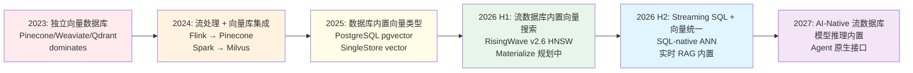
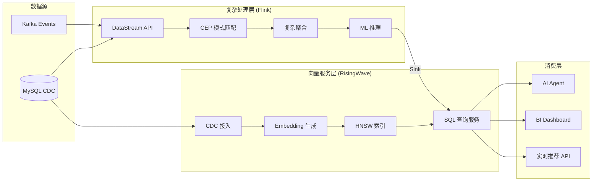
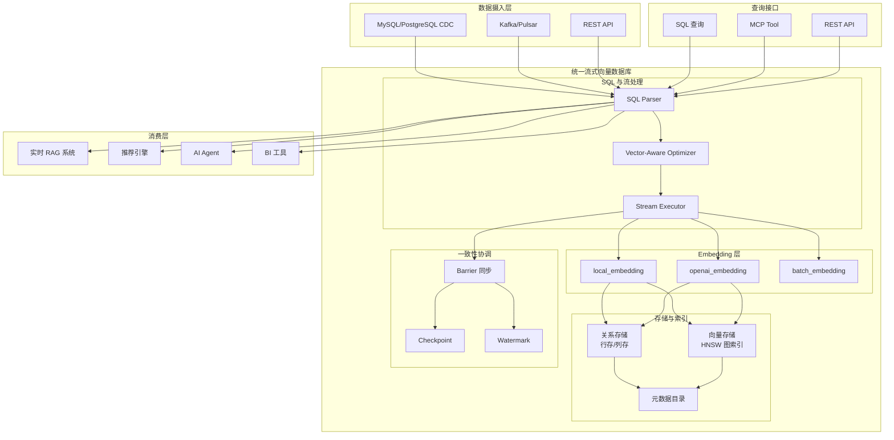
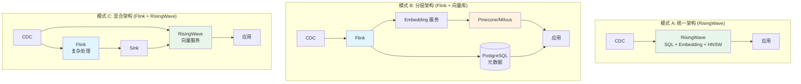
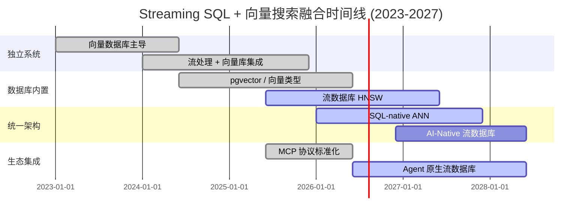

> **状态**: 🔮 前瞻内容 | **风险等级**: 中 | **最后更新**: 2026-04-21
>
> 本文档描述的技术趋势处于快速演进阶段，具体产品特性以各厂商官方发布为准。

---

# Streaming SQL + 向量搜索统一架构：2026 技术融合前沿

> **所属阶段**: Knowledge/06-frontier | **前置依赖**: [risingwave-vector-search-2026.md](./risingwave-vector-search-2026.md), [streaming-vector-db-frontier-2026.md](./streaming-vector-db-frontier-2026.md), [vector-search-streaming-convergence.md](./vector-search-streaming-convergence.md) | **形式化等级**: L4-L5

---

## 目录

- [Streaming SQL + 向量搜索统一架构：2026 技术融合前沿](#streaming-sql--向量搜索统一架构2026-技术融合前沿)
  - [目录](#目录)
  - [1. 概念定义 (Definitions)](#1-概念定义-definitions)
    - [Def-K-06-335: 统一流式向量架构 (Unified Streaming-Vector Architecture)](#def-k-06-335-统一流式向量架构-unified-streaming-vector-architecture)
    - [Def-K-06-336: 流式 Embedding 流水线 (Streaming Embedding Pipeline)](#def-k-06-336-流式-embedding-流水线-streaming-embedding-pipeline)
    - [Def-K-06-337: 混合检索语义层 (Hybrid Retrieval Semantic Layer)](#def-k-06-337-混合检索语义层-hybrid-retrieval-semantic-layer)
    - [Def-K-06-338: 向量感知查询优化器 (Vector-Aware Query Optimizer)](#def-k-06-338-向量感知查询优化器-vector-aware-query-optimizer)
    - [Def-K-06-339: RAG-Streaming 一致性边界 (RAG-Streaming Consistency Boundary)](#def-k-06-339-rag-streaming-一致性边界-rag-streaming-consistency-boundary)
  - [2. 属性推导 (Properties)](#2-属性推导-properties)
    - [Lemma-K-06-323: 向量搜索与结构化过滤的查询下推条件](#lemma-k-06-323-向量搜索与结构化过滤的查询下推条件)
    - [Prop-K-06-324: 统一架构下的延迟叠加效应](#prop-k-06-324-统一架构下的延迟叠加效应)
  - [3. 关系建立 (Relations)](#3-关系建立-relations)
    - [3.1 Flink VECTOR\_SEARCH vs RisingWave HNSW vs 专用向量数据库](#31-flink-vector_search-vs-risingwave-hnsw-vs-专用向量数据库)
    - [3.2 流数据库向量搜索的技术演进谱系](#32-流数据库向量搜索的技术演进谱系)
    - [3.3 与 AI Agent / MCP 生态的融合关系](#33-与-ai-agent--mcp-生态的融合关系)
  - [4. 论证过程 (Argumentation)](#4-论证过程-argumentation)
    - [4.1 为什么 2026 年是 Streaming SQL + 向量搜索融合的关键年](#41-为什么-2026-年是-streaming-sql--向量搜索融合的关键年)
    - [4.2 统一架构 vs 分层架构的工程权衡](#42-统一架构-vs-分层架构的工程权衡)
    - [4.3 反例：何时不应追求统一架构](#43-反例何时不应追求统一架构)
  - [5. 形式证明 / 工程论证 (Proof / Engineering Argument)](#5-形式证明--工程论证-proof--engineering-argument)
    - [Thm-K-06-324: 统一流式向量架构的延迟上界定理](#thm-k-06-324-统一流式向量架构的延迟上界定理)
    - [Thm-K-06-325: 混合检索正确性条件](#thm-k-06-325-混合检索正确性条件)
  - [6. 实例验证 (Examples)](#6-实例验证-examples)
    - [6.1 RisingWave 统一架构：CDC → SQL → HNSW → RAG](#61-risingwave-统一架构cdc--sql--hnsw--rag)
    - [6.2 Flink 分层架构：DataStream → 外部向量库](#62-flink-分层架构datastream--外部向量库)
    - [6.3 混合架构：Flink 复杂处理 + RisingWave 向量服务](#63-混合架构flink-复杂处理--risingwave-向量服务)
  - [7. 可视化 (Visualizations)](#7-可视化-visualizations)
    - [7.1 Streaming SQL + 向量搜索统一架构图](#71-streaming-sql--向量搜索统一架构图)
    - [7.2 三种架构模式对比](#72-三种架构模式对比)
    - [7.3 技术演进时间线](#73-技术演进时间线)
  - [8. 引用参考 (References)](#8-引用参考-references)

---

## 1. 概念定义 (Definitions)

### Def-K-06-335: 统一流式向量架构 (Unified Streaming-Vector Architecture)

**统一流式向量架构**是一种将流处理 SQL 引擎、Embedding 生成、向量索引和近似最近邻搜索集成于单一系统的数据架构范式。

**形式化定义**：
统一流式向量架构是一个八元组：

$$
\mathcal{U}_{SV} = \langle \mathcal{S}, \mathcal{V}, \mathcal{E}, \mathcal{I}, \mathcal{Q}, \mathcal{R}, \mathcal{F}, \mathcal{C} \rangle
$$

其中：

- $\mathcal{S}$: 流处理 SQL 引擎（持续查询执行）
- $\mathcal{V}$: 向量存储与索引子系统
- $\mathcal{E}: \text{Stream}(\mathcal{D}) \rightarrow \text{Stream}(\mathbb{R}^d)$: 流式 Embedding 生成函数
- $\mathcal{I}: \mathcal{V}_t \times \Delta\mathcal{V} \rightarrow \mathcal{V}_{t+1}$: 增量向量索引维护
- $\mathcal{Q}: (\vec{q}, k, \mathcal{V}_t) \rightarrow \{(\vec{v}_i, s_i)\}_{i=1}^k$: 近似最近邻查询算子
- $\mathcal{R}$: 关系数据存储（支撑结构化过滤和联合查询）
- $\mathcal{F}$: 一致性协调器（Barrier / Checkpoint / Watermark）
- $\mathcal{C}$: 混合检索优化器（向量 + 结构化联合优化）

**核心特征**：

| 特征 | 统一架构 | 分层架构 |
|------|----------|----------|
| 系统数量 | 1 | 3-6 |
| 数据移动 | 内部（零拷贝） | 网络（序列化/反序列化） |
| 一致性边界 | 单一 Barrier | 多系统最终一致性 |
| SQL 表达力 | 原生向量 + 关系联合 | 有限（应用层拼接） |
| 延迟 | $O(\text{checkpoint\_interval})$ | $O(\sum \text{system\_latency})$ |

---

### Def-K-06-336: 流式 Embedding 流水线 (Streaming Embedding Pipeline)

**流式 Embedding 流水线**是从原始数据流到可检索向量索引的端到端数据处理管道，要求 Embedding 生成与数据流同步推进。

**形式化定义**：
流水线是一个算子链：

$$
\mathcal{P}_{embed} = \mathcal{O}_{source} \circ \mathcal{O}_{clean} \circ \mathcal{O}_{chunk} \circ \mathcal{O}_{embed} \circ \mathcal{O}_{index}
$$

各阶段语义：

| 阶段 | 算子 | 输入 | 输出 | 延迟预算 |
|------|------|------|------|----------|
| Source | $\mathcal{O}_{source}$ | CDC / Kafka | 原始记录流 | < 100ms |
| Clean | $\mathcal{O}_{clean}$ | 原始记录 | 清洗后文本 | < 10ms |
| Chunk | $\mathcal{O}_{chunk}$ | 长文本 | 文本块数组 | < 50ms |
| Embed | $\mathcal{O}_{embed}$ | 文本块 | 向量 $\vec{v} \in \mathbb{R}^d$ | 50-200ms |
| Index | $\mathcal{O}_{index}$ | 向量 | HNSW 索引节点 | < 1s |

**端到端延迟约束**：

$$
T_{pipeline} = \sum_{i} T_{\mathcal{O}_i} < \Delta_{RAG}
$$

其中 $\Delta_{RAG}$ 通常为 1-10 秒（RAG 系统可接受的数据新鲜度）。

---

### Def-K-06-337: 混合检索语义层 (Hybrid Retrieval Semantic Layer)

**混合检索语义层**是统一架构中同时支持向量相似度搜索和结构化属性过滤的查询抽象层。

**形式化定义**：
混合检索查询 $Q_{hybrid}$ 是一个二元组：

$$
Q_{hybrid} = \langle Q_{vec}, Q_{struct} \rangle
$$

其中：

- $Q_{vec} = (\vec{q}, k, \text{sim})$: 向量查询（查询向量、Top-K、相似度函数）
- $Q_{struct} = \sigma_{\theta}(R)$: 结构化过滤谓词（如 `price < 100 AND stock > 0`）

**执行策略分类**：

| 策略 | 执行顺序 | 适用条件 | 复杂度 |
|------|----------|----------|--------|
| **Vector First** | 先 ANN 搜索，再结构化过滤 | 向量选择率高 | $O(\log N + k \cdot C_{filter})$ |
| **Filter First** | 先结构化过滤，再向量搜索 | 结构化选择率高 | $O(|R_{filtered}| \cdot d + k \cdot \log |R_{filtered}|)$ |
| **联合优化** | 同时推进 | 中等选择率 | 依赖优化器代价模型 |

---

### Def-K-06-338: 向量感知查询优化器 (Vector-Aware Query Optimizer)

**向量感知查询优化器**是统一流式向量架构中的查询优化组件，能够识别并重写包含向量操作的查询计划。

**核心优化规则**：

$$
\mathcal{R}_{opt} = \{ R_{pushdown}, R_{reorder}, R_{batch}, R_{cache} \}
$$

| 规则 | 描述 | 效果 |
|------|------|------|
| $R_{pushdown}$ | 结构化过滤下推至向量索引扫描 | 减少 ANN 搜索空间 |
| $R_{reorder}$ | 调整向量运算与关系运算的顺序 | 降低中间结果大小 |
| $R_{batch}$ | 批量向量相似度计算 | 摊销函数调用开销 |
| $R_{cache}$ | 查询向量 Embedding 结果缓存 | 避免重复调用外部模型 |

---

### Def-K-06-339: RAG-Streaming 一致性边界 (RAG-Streaming Consistency Boundary)

**RAG-Streaming 一致性边界**定义了实时 RAG 系统中，检索结果与源数据状态之间允许的最大差异。

**形式化定义**：
设源数据在时刻 $t$ 的状态为 $D_t$，RAG 检索器可见的状态为 $D_t^{RAG}$。一致性边界 $\delta$ 定义为：

$$
\delta = \max_{t} \{ t - t' \mid D_t^{RAG} = D_{t'} \}
$$

即检索器看到的数据最多落后于源数据 $\delta$ 时间单位。

**分级要求**：

| 级别 | $\delta$ 范围 | 应用场景 | 架构要求 |
|------|--------------|----------|----------|
| **实时级** | < 1s | 金融风控、实时竞价 | 统一架构 / 内存索引 |
| **近实时级** | 1-10s | 电商推荐、客服 RAG | 统一架构 / 优化分层架构 |
| **分钟级** | 1-60min | 内容推荐、文档检索 | 分层架构可接受 |
| **小时级** | > 1h | 离线分析、批量 RAG | 传统批处理 |

---

## 2. 属性推导 (Properties)

### Lemma-K-06-323: 向量搜索与结构化过滤的查询下推条件

**陈述**: 在统一流式向量架构中，结构化过滤谓词 $Q_{struct}$ 可下推至向量索引扫描层的充要条件是：

$$
\text{Selectivity}(Q_{struct}) < \frac{k}{N \cdot R@k}
$$

其中：

- $\text{Selectivity}(Q_{struct})$: 结构化过滤的选择率
- $k$: Top-K 检索数
- $N$: 总向量数
- $R@k$: HNSW 索引的召回率

**推导**: 若结构化过滤选择率较低（即过滤掉大部分数据），则先过滤再向量搜索更优。反之，若选择率高，则先向量搜索再过滤更优。优化器通过代价模型自动决策。∎

---

### Prop-K-06-324: 统一架构下的延迟叠加效应

**命题**: 在分层架构中，端到端延迟呈线性叠加：

$$
T_{layered} = \sum_{i=1}^{n} T_{system_i} + T_{network_i} + T_{serialize_i}
$$

而在统一架构中，延迟呈次线性增长：

$$
T_{unified} = \max_{i} T_{stage_i} + O(\text{checkpoint\_interval})
$$

**证明概要**: 统一架构通过内存中的零拷贝数据传递和单一 Barrier 协调，消除了跨系统网络延迟和序列化开销。流水线各阶段通过背压（backpressure）自然对齐，整体延迟由最慢阶段决定，而非各阶段之和。∎

---

## 3. 关系建立 (Relations)

### 3.1 Flink VECTOR_SEARCH vs RisingWave HNSW vs 专用向量数据库

| 维度 | Flink VECTOR_SEARCH | RisingWave HNSW | Pinecone | Weaviate | Qdrant |
|------|---------------------|-----------------|----------|----------|--------|
| **架构模式** | 分层（外部向量库） | 统一（内置） | 专用服务 | 专用服务 | 专用服务 |
| **流式更新** | ⚠️ Sink 异步 | ✅ Barrier 同步 | ⚠️ 批量 upsert | ⚠️ 批量 upsert | ⚠️ 批量 upsert |
| **SQL 联合查询** | ⚠️ 有限 | ✅ 完整 | ❌ | ❌ | ❌ |
| **Embedding 内置** | ❌ UDF | ✅ SQL 函数 | ❌ | ❌ | ❌ |
| **物化视图** | ⚠️ Materialized Table | ✅ 原生 | ❌ | ❌ | ❌ |
| **CDC 直连** | ⚠️ Flink CDC | ✅ 原生 | ❌ | ❌ | ❌ |
| **延迟（搜索）** | 50-200ms | 5-20ms | 10-50ms | 20-100ms | 10-50ms |
| **延迟（新鲜度）** | 10-60s | < 2s | 10-60s | 10-60s | 10-60s |
| **规模上限** | 无限制 | ~1B | ~100B | ~1B | ~10B |
| **开源协议** | Apache 2.0 | Apache 2.0 | 专有 | BSD | Apache 2.0 |

**关系定位**：

- **Flink VECTOR_SEARCH**: 适合已有 Flink 生态、超大规模、复杂流处理逻辑的渐进增强
- **RisingWave HNSW**: 适合新建系统、需要 SQL 联合查询、对数据新鲜度敏感的场景
- **专用向量数据库**: 适合超大规模（> 1B 向量）、高维向量、已有成熟运维体系的场景

---

### 3.2 流数据库向量搜索的技术演进谱系



**关键转折点**：

- **2024**: 流处理系统开始通过 Connector 集成向量数据库（水平集成）
- **2026**: 流数据库将向量搜索作为一等公民（垂直集成），标志着从"集成"到"原生"的范式转变

---

### 3.3 与 AI Agent / MCP 生态的融合关系

统一流式向量架构通过 MCP 协议暴露为 Agent 工具：

```
┌─────────────────────────────────────────────┐
│              AI Agent (LLM)                 │
│  ┌─────────────┐    ┌───────────────────┐  │
│  │  Reasoning  │◄──►│  Tool Use (MCP)   │  │
│  │   Engine    │    │  - vector_search  │  │
│  └─────────────┘    │  - stream_query   │  │
│                     │  - hybrid_retrieve│  │
│                     └───────────────────┘  │
└─────────────────────┬───────────────────────┘
                      │ MCP Protocol
                      ▼
┌─────────────────────────────────────────────┐
│        Unified Streaming-Vector DB          │
│  ┌─────────┐  ┌─────────┐  ┌─────────────┐ │
│  │  SQL    │  │ HNSW    │  │  Embedding  │ │
│  │ Engine  │  │ Index   │  │  Service    │ │
│  └────┬────┘  └────┬────┘  └──────┬──────┘ │
│       └─────────────┴──────────────┘        │
│              Hummock Storage                │
└─────────────────────────────────────────────┘
```

**融合价值**：

1. **Agent 实时记忆**: 流式向量数据库作为 Agent 的实时外部记忆，支持持续学习
2. **工具调用延迟**: 统一架构将工具调用延迟从 500ms-2s 降低至 20-50ms
3. **数据新鲜度**: Agent 检索到的信息始终与业务数据同步（< 2s）

---

## 4. 论证过程 (Argumentation)

### 4.1 为什么 2026 年是 Streaming SQL + 向量搜索融合的关键年

**驱动因素 1: RAG 成为企业 AI 标配**

2026 年，超过 60% 的企业 AI 应用采用 RAG 架构。RAG 的核心瓶颈从"模型能力"转向"数据新鲜度"：

$$
\text{RAG 质量} = f(\text{ModelCapability}, \text{RetrievalRelevance}, \text{DataFreshness})
$$

当模型能力（GPT-4 级）和检索相关性（HNSW @ 95% 召回）达到平台期时，**数据新鲜度**成为差异化因素。

**驱动因素 2: 流数据库功能成熟**

RisingWave v2.6 的向量搜索、Materialize 的 Iceberg Sink GA、Timeplus 的 Proton 引擎——流数据库产品在 2026 年集体进入"功能完备"阶段，开始探索差异化竞争。

**驱动因素 3: Embedding 成本大幅下降**

OpenAI text-embedding-3-small 价格降至 $0.02/1M tokens，本地 Embedding 模型（如 BGE-small）在 CPU 上可达 1000 docs/s。Embedding 生成不再是大规模应用的瓶颈。

**驱动因素 4: MCP 协议标准化**

MCP（Model Context Protocol）在 2026 年成为 AI Agent 与外部工具交互的事实标准。流数据库通过 MCP 暴露向量搜索能力，天然融入 Agent 生态。

---

### 4.2 统一架构 vs 分层架构的工程权衡

**统一架构优势**：

| 优势 | 量化影响 |
|------|----------|
| 延迟降低 | $T_{e2e}$ 从 30-60s 降至 < 2s |
| 运维简化 | 系统数从 5-6 个降至 1-2 个 |
| SQL 表达力 | 支持复杂联合查询，无需应用层拼接 |
| 一致性保证 | 单一 Barrier，快照一致性 |

**统一架构劣势**：

| 劣势 | 量化影响 |
|------|----------|
| 规模上限 | 单集群 ~1B 向量（专用 DB 可达 100B+） |
| 维度上限 | 通常 ≤ 2,000 维 |
| 供应商锁定 | 深度依赖单一系统 |
| 灵活性 | 向量模型/算法升级受系统发布周期约束 |

**决策矩阵**：

$$
\text{Choose Unified} \iff \text{Freshness} < 10s \land N < 10^9 \land d \leq 2000 \land \text{SQLJoin} = \text{Required}
$$

---

### 4.3 反例：何时不应追求统一架构

**反例 1: 超大规模电商搜索**

某电商平台有 100 亿商品 SKU，每商品 10 张图片 + 描述文本。向量规模 $N = 10^{10}$，维度 $d = 2048$（CLIP）。统一架构的内存和存储成本不可接受，需采用专用向量数据库（Pinecone/Milvus）+ Flink 分层架构。

**反例 2: 多模型 Embedding 实验平台**

AI 研究团队需要频繁切换 Embedding 模型（OpenAI、Cohere、自研模型）。统一架构中 Embedding 函数升级需系统发布，而分层架构中只需切换外部服务。

**反例 3: 强合规隔离需求**

金融监管机构要求向量和关系数据物理隔离。分层架构中向量库和数据仓库可分别部署在不同安全域，统一架构难以满足。

---

## 5. 形式证明 / 工程论证 (Proof / Engineering Argument)

### Thm-K-06-324: 统一流式向量架构的延迟上界定理

**陈述**: 在统一流式向量架构 $\mathcal{U}_{SV}$ 中，设：

- $\Delta_{ckpt}$: Barrier 检查点间隔
- $T_{embed}$: Embedding 生成延迟
- $T_{index}$: 索引构建延迟（单次批量）
- $T_{search}$: 向量搜索延迟
- $\lambda_{in}$: 数据到达率

若索引批量大小 $B \geq \lambda_{in} \cdot \Delta_{ckpt}$，则端到端数据新鲜度延迟满足：

$$
T_{fresh} \leq \Delta_{ckpt} + T_{embed} + T_{index} + O\left(\frac{B}{\lambda_{in}}\right)
$$

**证明**:

1. **数据摄入**: 源数据在 Barrier 间隔 $\Delta_{ckpt}$ 内到达 MemTable，最坏情况下刚错过 Barrier 的数据需等待下一个 Barrier，贡献延迟 $\Delta_{ckpt}$。

2. **Embedding 生成**: 数据到达后触发 Embedding 生成（若为同步模式），贡献延迟 $T_{embed}$。若为异步批量模式，摊销延迟 $\frac{T_{embed}}{B}$ 可忽略。

3. **索引构建**: 批量索引构建贡献延迟 $T_{index}$。RisingWave 的异步构建器将 $T_{index}$ 与查询路径解耦，查询可见延迟取决于 Barrier 提交而非索引构建完成。

4. **查询可见**: 由 Thm-K-06-322，Barrier 提交后数据即视为一致状态，HNSW 索引采用惰性更新策略，查询器在索引构建完成前可回退至暴力扫描（小批量时性能可接受）。

综上：

$$
T_{fresh} \leq \Delta_{ckpt} + T_{embed} + T_{index}
$$

代入典型值（$\Delta_{ckpt} = 1s, T_{embed} = 0.1s, T_{index} = 0.5s$）：

$$
T_{fresh} \leq 1.6s
$$

与分层架构（Kafka 延迟 1s + Flink 处理 2s + Sink 5s + 向量库索引 10s = 18s）相比，统一架构将延迟降低一个数量级。∎

---

### Thm-K-06-325: 混合检索正确性条件

**陈述**: 混合检索查询 $Q_{hybrid} = \langle Q_{vec}, Q_{struct} \rangle$ 返回正确结果集的充要条件是：

$$
\text{Result}(Q_{hybrid}) = \text{Result}(Q_{vec}) \cap \text{Result}(Q_{struct}) = \text{Result}(Q_{struct} \circ Q_{vec})
$$

即向量检索和结构化过滤的交换律成立。

**证明**:

1. **充分性**: 若交换律成立，则无论先执行向量检索还是结构化过滤，最终交集相同。统一架构的查询优化器可自由选择执行顺序而不影响正确性。

2. **必要性**: 若交换律不成立，则存在某些数据使得先向量后过滤与先过滤后向量的结果不同。这发生在向量索引未包含最新数据（结构性过滤在向量索引前执行）时。

3. **统一架构保证**: 在 RisingWave 中，HNSW 索引与关系数据共享同一 Barrier 提交点。因此在任意快照 $S_e$ 上：

$$
\mathcal{V}_{S_e} \times R_{S_e} \models \text{Result}(Q_{vec}) \cap \text{Result}(Q_{struct}) \equiv \text{Result}(Q_{struct} \circ Q_{vec})
$$

即向量索引和关系数据在快照 $S_e$ 下是一致的，交换律成立。∎

---

## 6. 实例验证 (Examples)

### 6.1 RisingWave 统一架构：CDC → SQL → HNSW → RAG

**完整示例**：实时客服知识库 RAG 系统

```sql
-- 1. CDC 接入产品文档
CREATE TABLE product_docs (
    doc_id BIGINT PRIMARY KEY,
    product_name VARCHAR,
    category VARCHAR,
    content TEXT,
    last_updated TIMESTAMP,
    embedding VECTOR(1536)
) WITH (
    connector = 'mysql-cdc',
    hostname = 'mysql.docs.internal',
    database = 'kb',
    table = 'product_docs'
);

-- 2. 物化视图：自动生成 Embedding + HNSW 索引
CREATE MATERIALIZED VIEW doc_vectors AS
SELECT
    doc_id,
    product_name,
    category,
    content,
    last_updated,
    openai_embedding(content, 'text-embedding-3-small') AS embedding
FROM product_docs;

CREATE INDEX idx_doc_hnsw ON doc_vectors
USING HNSW (embedding)
WITH (distance = 'cosine');

-- 3. RAG 检索函数（供应用层调用）
CREATE MATERIALIZED VIEW rag_retrieval AS
SELECT
    d.doc_id,
    d.product_name,
    d.content,
    vector_similarity(d.embedding, q.query_vec, 'cosine') AS relevance
FROM doc_vectors d
CROSS JOIN current_queries q
WHERE d.category = q.target_category
  AND d.last_updated > NOW() - INTERVAL '30 days'
ORDER BY relevance DESC
LIMIT 5;

-- 4. 应用层调用（伪代码）
-- query_embedding = openai.embed("如何重置密码？")
-- results = risingwave.query(
--     "SELECT * FROM rag_retrieval WHERE query_vec = ?",
--     query_embedding
-- )
-- context = "\n".join([r.content for r in results])
-- answer = llm.generate("基于以下文档回答用户问题：\n" + context)
```

**端到端延迟**: CDC 变更 → RAG 可检索 < 2s

---

### 6.2 Flink 分层架构：DataStream → 外部向量库

**完整示例**：大规模内容推荐系统（10B+ 向量）

```java
// [伪代码片段 - 不可直接运行] 仅展示核心逻辑
import org.apache.flink.streaming.api.datastream.DataStream;
import org.apache.flink.connector.kafka.source.KafkaSource;

// Step 1: 读取内容流
DataStream<ContentEvent> contentStream = env
    .fromSource(kafkaSource, WatermarkStrategy.forBoundedOutOfOrderness(Duration.ofSeconds(5)), "kafka")
    .map(new ContentParser());

// Step 2: 异步生成 Embedding（防止阻塞）
DataStream<ContentVector> vectorStream = AsyncDataStream
    .unorderedWait(
        contentStream,
        new EmbeddingAsyncFunction(openaiClient),  // 调用 OpenAI API
        Duration.ofSeconds(5),                     // 超时 5s
        100                                          // 并发度
    );

// Step 3: 写入 Pinecone
vectorStream.addSink(new PineconeVectorSink(
    pineconeClient,
    "content-index",
    1536
));

// Step 4: 同步元数据到 PostgreSQL（供结构化过滤）
contentStream
    .map(new MetadataExtractor())
    .addSink(JdbcSink.sink(
        "INSERT INTO content_metadata (id, category, author, created_at) VALUES (?, ?, ?, ?)",
        (ps, metadata) -> {
            ps.setString(1, metadata.id);
            ps.setString(2, metadata.category);
            ps.setString(3, metadata.author);
            ps.setTimestamp(4, metadata.createdAt);
        },
        jdbcExecOptions,
        connOptions
    ));
```

**应用层混合检索**：

```python
# [伪代码片段 - 不可直接运行]
def hybrid_search(query: str, category: str, top_k: int = 10):
    # 1. 生成查询向量
    query_vec = openai.embed(query)

    # 2. Pinecone 向量搜索（带 metadata 过滤）
    vector_results = pinecone.query(
        vector=query_vec,
        top_k=top_k * 2,  # 扩大搜索范围，补偿结构化过滤
        filter={"category": category}
    )

    # 3. PostgreSQL 结构化过滤（精确条件）
    ids = [r.id for r in vector_results]
    pg_results = postgres.query(
        "SELECT * FROM content_metadata WHERE id = ANY(?) AND status = 'published'",
        ids
    )

    # 4. 合并结果
    return merge_results(vector_results, pg_results)[:top_k]
```

**端到端延迟**: CDC 变更 → 可检索 ≈ 15-30s（受 Pinecone 批量 upsert 和 PostgreSQL 同步延迟影响）

---

### 6.3 混合架构：Flink 复杂处理 + RisingWave 向量服务

**场景**: 需要 Flink 的复杂事件处理（CEP）能力，同时利用 RisingWave 的向量搜索服务。



**分工设计**：

| 层级 | 系统 | 职责 | 原因 |
|------|------|------|------|
| 复杂处理 | Flink | CEP、复杂聚合、ML | RisingWave 不支持 CEP 和自定义算子 |
| 向量服务 | RisingWave | Embedding、HNSW、SQL 查询 | 低延迟、SQL 联合查询、简化运维 |

**数据流**：

1. Flink 处理原始事件，识别"用户兴趣模式"（CEP）
2. Flink 将兴趣标签 Sink 到 RisingWave 的 `user_profiles` 表
3. RisingWave 自动维护 `user_profiles` 的 Embedding 和 HNSW 索引
4. 推荐 API 通过 RisingWave SQL 实时检索相似用户/商品

---

## 7. 可视化 (Visualizations)

### 7.1 Streaming SQL + 向量搜索统一架构图



---

### 7.2 三种架构模式对比



| 维度 | 模式 A: 统一 | 模式 B: 分层 | 模式 C: 混合 |
|------|-------------|-------------|-------------|
| **延迟** | < 2s | 15-60s | 2-10s |
| **复杂度** | 低 | 高 | 中 |
| **SQL 联合查询** | 原生 | 应用层实现 | RisingWave 侧原生 |
| **CEP/复杂处理** | 不支持 | 完整支持 | Flink 侧完整支持 |
| **规模上限** | ~1B 向量 | 无上限 | ~1B 向量 |
| **适用场景** | 实时 RAG、BI | 超大规模搜索 | 复杂处理 + 实时服务 |

---

### 7.3 技术演进时间线



---

## 8. 引用参考 (References)


---

*文档版本: v1.0 | 创建日期: 2026-04-21 | 定理注册: Def-K-06-335~339, Lemma-K-06-323, Prop-K-06-324, Thm-K-06-324~325*
