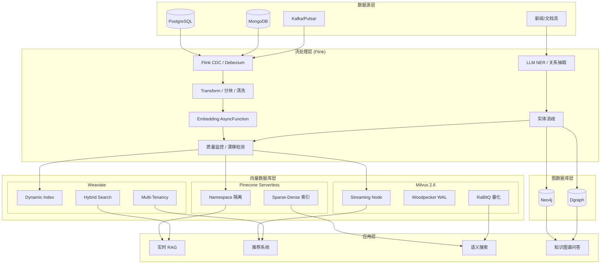
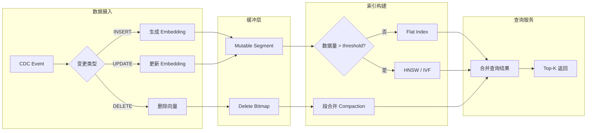
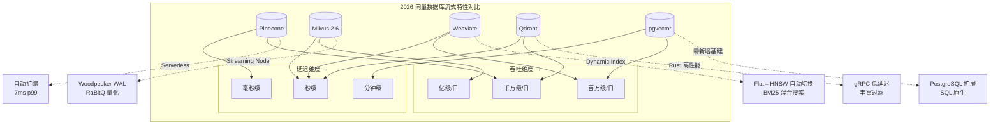
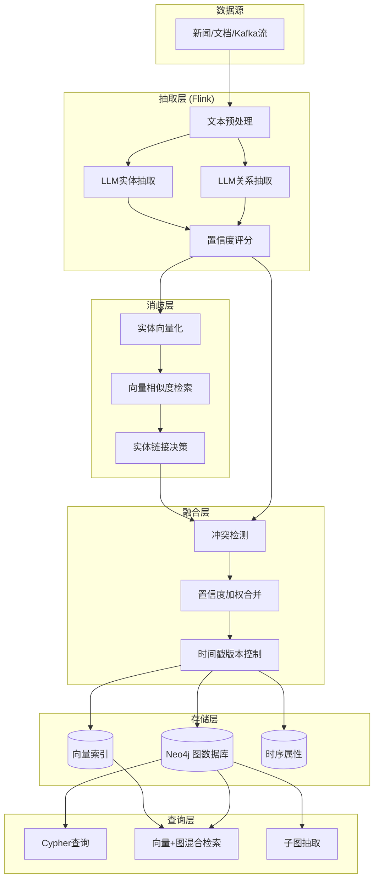

> **状态**: 🔮 前瞻内容 | **风险等级**: 中 | **最后更新**: 2026-04-20
>
> 本文档涉及向量数据库产品特性基于公开信息整理，具体版本特性以各厂商官方发布为准。

---

# 流处理 + 向量数据库前沿进展 (2026)

> 所属阶段: Knowledge/06-frontier | 前置依赖: [vector-search-streaming-convergence.md](vector-search-streaming-convergence.md), [streaming-databases.md](streaming-databases.md), [real-time-rag-architecture.md](real-time-rag-architecture.md) | 形式化等级: L3-L4

---

## 目录

- [流处理 + 向量数据库前沿进展 (2026)](#流处理--向量数据库前沿进展-2026)
  - [目录](#目录)
  - [1. 概念定义 (Definitions)](#1-概念定义-definitions)
    - [Def-K-06-260: Streaming Vector Ingestion Pipeline](#def-k-06-260-streaming-vector-ingestion-pipeline)
    - [Def-K-06-261: Real-time Index Update Strategy](#def-k-06-261-real-time-index-update-strategy)
    - [Def-K-06-262: Streaming Knowledge Graph Update Pipeline](#def-k-06-262-streaming-knowledge-graph-update-pipeline)
    - [Def-K-06-263: Streaming Embedding Generation with Model Versioning](#def-k-06-263-streaming-embedding-generation-with-model-versioning)
  - [2. 属性推导 (Properties)](#2-属性推导-properties)
    - [Prop-K-06-260: 流式摄入吞吐与查询延迟权衡](#prop-k-06-260-流式摄入吞吐与查询延迟权衡)
    - [Prop-K-06-261: 知识图谱一致性传播边界](#prop-k-06-261-知识图谱一致性传播边界)
  - [3. 关系建立 (Relations)](#3-关系建立-relations)
    - [3.1 流处理系统与向量数据库集成矩阵](#31-流处理系统与向量数据库集成矩阵)
    - [3.2 数据流关系图](#32-数据流关系图)
    - [3.3 实时RAG × 流式知识图谱 × 向量检索三元融合](#33-实时rag--流式知识图谱--向量检索三元融合)
  - [4. 论证过程 (Argumentation)](#4-论证过程-argumentation)
    - [4.1 为什么 2026 年是流式向量数据库的关键年？](#41-为什么-2026-年是流式向量数据库的关键年)
    - [4.2 实时索引更新的技术挑战与对策](#42-实时索引更新的技术挑战与对策)
    - [4.3 流式知识图谱更新的核心挑战](#43-流式知识图谱更新的核心挑战)
    - [4.4 实时RAG与流式知识更新的融合趋势](#44-实时rag与流式知识更新的融合趋势)
  - [5. 形式证明 / 工程论证 (Proof / Engineering Argument)](#5-形式证明--工程论证-proof--engineering-argument)
    - [Thm-K-06-260: 流式向量索引最终一致性](#thm-k-06-260-流式向量索引最终一致性)
    - [Lemma-K-06-260: 动态索引切换的查询正确性](#lemma-k-06-260-动态索引切换的查询正确性)
    - [Thm-K-06-261: 流式知识图谱更新因果一致性](#thm-k-06-261-流式知识图谱更新因果一致性)
  - [6. 实例验证 (Examples)](#6-实例验证-examples)
    - [6.1 Flink + Pinecone 实时 RAG 管道](#61-flink--pinecone-实时-rag-管道)
    - [6.2 Flink + Milvus Streaming Node 高吞吐摄入](#62-flink--milvus-streaming-node-高吞吐摄入)
    - [6.3 Flink + Neo4j 实时知识图谱更新](#63-flink--neo4j-实时知识图谱更新)
    - [6.4 Embedding版本迁移实例](#64-embedding版本迁移实例)
  - [7. 可视化 (Visualizations)](#7-可视化-visualizations)
    - [7.1 流处理 + 向量数据库集成架构图](#71-流处理--向量数据库集成架构图)
    - [7.2 实时向量索引更新数据流图](#72-实时向量索引更新数据流图)
    - [7.3 主流向量数据库流式特性对比矩阵](#73-主流向量数据库流式特性对比矩阵)
    - [7.4 流式知识图谱更新架构](#74-流式知识图谱更新架构)
  - [8. 引用参考 (References)](#8-引用参考-references)

---

## 1. 概念定义 (Definitions)

### Def-K-06-260: Streaming Vector Ingestion Pipeline

**流式向量摄入管道** 定义从原始数据流到向量数据库索引的端到端数据流：

```yaml
管道阶段:
  Stage 1 - 数据摄取:
    输入: CDC / Kafka / Pulsar 流
    处理: 去重、格式校验、Schema 对齐

  Stage 2 - 嵌入生成:
    处理: 文本分块 → Embedding Model → 向量
    模式: 同步调用 (低吞吐) / 批量异步 (高吞吐) / 本地模型 (边缘)

  Stage 3 - 索引更新:
    处理: 向量 + 元数据 → 向量数据库 upsert
    策略: 实时增量 (latency < 1s) / 微批量 (latency 1-10s) / 批量 (latency > 10s)

  Stage 4 - 一致性校验:
    处理: 源库 CDC 位点 ↔ 向量库主键 对照
    目标: 最终一致性 (默认) / 强一致性 (事务型 CDC)
```

**形式化定义**：

$$
\text{Pipeline} = (S, E, V, I, \tau)
$$

其中：

- $S$: 源数据流空间
- $E$: Embedding 函数空间
- $V$: 向量空间 $\mathbb{R}^d$
- $I$: 向量索引结构
- $\tau$: 端到端延迟约束

---

### Def-K-06-261: Real-time Index Update Strategy

**实时向量索引更新策略** 定义在保证查询质量的前提下最小化索引更新延迟的技术集合：

```yaml
策略分类:
  增量追加策略 (Pinecone / Milvus Streaming Node):
    - 新向量写入内存缓冲 (mutable segment)
    - 后台异步合并到不可变段 (immutable segment)
    - 查询时合并内存 + 磁盘索引结果

  动态索引切换 (Weaviate Dynamic Index):
    - 小规模数据 (N < threshold): Flat Index (暴力搜索)
    - 大规模数据 (N ≥ threshold): 自动切换至 HNSW
    - 阈值默认: 10,000 对象

  分层量化策略 (Milvus RaBitQ / GPU CAGRA):
    - 粗量化: 快速定位候选集
    - 精细量化: 候选集内精确排序
    - 索引构建与查询解耦
```

---

### Def-K-06-262: Streaming Knowledge Graph Update Pipeline

**流式知识图谱更新管道** 定义从原始数据流中实时抽取实体关系、更新图数据库索引的端到端系统：

$$
\mathcal{KG}_{stream} = (\mathcal{S}, \mathcal{E}, \mathcal{R}, \mathcal{G}, \Delta, \Phi)
$$

其中：

- $\mathcal{S}$: 原始数据流（文本、结构化记录、事件序列）
- $\mathcal{E}$: 实体抽取函数，$\mathcal{E}: \mathcal{S} \rightarrow \{(e_i, \text{type}_i, t_i)\}$，输出带时间戳的实体集合
- $\mathcal{R}$: 关系抽取函数，$\mathcal{R}: (e_i, e_j, \text{context}) \rightarrow \{(r_k, \text{confidence}_k)\}$
- $\mathcal{G}$: 图数据库状态，$\mathcal{G}_t = (V_t, E_t, \mathcal{P}_t)$，其中 $V_t$ 为节点集，$E_t$ 为边集，$\mathcal{P}_t$ 为属性集
- $\Delta$: 增量更新算子，$\Delta: (\mathcal{G}_t, \{(e_i, r_k, e_j)\}) \rightarrow \mathcal{G}_{t+1}$
- $\Phi$: 图索引更新策略（如 Neo4j 原生索引、TigerGraph GSQL、Dgraph 实时索引）

**技术栈组合**：

| 组件 | 选型A (LLM驱动) | 选型B (规则驱动) | 选型C (混合) |
|------|----------------|-----------------|-------------|
| 实体抽取 | LLM NER (GPT-4 / SpaCy LLM) | 正则 / 字典匹配 | LLM + 规则校验 |
| 关系抽取 | LLM Relation Extraction | 模板匹配 | 少样本LLM + 规则 |
| 图数据库 | Neo4j / Memgraph | TigerGraph | Dgraph |
| 流处理 | Flink + AsyncFunction | Flink SQL | Flink + ProcessFunction |
| 一致性 | 最终一致性 | 强一致性 | 可配置一致性 |

---

### Def-K-06-263: Streaming Embedding Generation with Model Versioning

**带版本控制的流式嵌入生成** 定义在Embedding模型持续迭代场景下，保证向量空间一致性与可追溯性的生成框架：

$$
\mathcal{E}_{versioned} = (\mathcal{M}, \mathcal{V}, \mathcal{T}, \rho, \kappa)
$$

其中：

- $\mathcal{M} = \{m_1, m_2, ..., m_n\}$: Embedding模型版本序列
- $\mathcal{V} = \{v_1, v_2, ..., v_n\}$: 对应的向量空间，$v_i = m_i(\text{text}) \in \mathbb{R}^{d_i}$
- $\mathcal{T}$: 版本迁移函数，$\mathcal{T}: v_i \rightarrow v_j$，处理跨模型版本的向量转换
- $\rho$: 向量兼容性度量，$\rho(v_i, v_j) = \text{cos\_sim}(v_i, \mathcal{T}(v_j))$
- $\kappa$: 重计算触发策略（模型版本升级时全量 / 增量重计算）

**版本管理策略**：

```yaml
策略1 - 多版本并存:
  描述: 新旧模型向量同时存储，查询时指定版本
  适用: 短期过渡期 (< 7天)
  成本: 存储翻倍

策略2 - 渐进式重建:
  描述: 新数据用新模型，旧数据后台异步重建
  适用: 长期运行系统
  成本: 计算峰值，存储不变

策略3 - 投影适配:
  描述: 学习线性投影矩阵 W，使 v_new ≈ W · v_old
  适用: 同家族模型升级 (OpenAI v2 → v3)
  成本: 低 (仅需训练投影矩阵)
```

---

## 2. 属性推导 (Properties)

### Prop-K-06-260: 流式摄入吞吐与查询延迟权衡

**命题**: 在流式向量摄入场景下，索引更新频率与查询延迟存在单调关系：

$$
\forall f_{ingest} > 0: \frac{\partial L_{query}}{\partial f_{index}} > 0
$$

其中：

- $f_{ingest}$: 向量摄入频率 (vectors/second)
- $f_{index}$: 索引重建频率 (times/second)
- $L_{query}$: 查询延迟 (ms)

**各系统权衡特性**：

| 系统 | 摄入吞吐 | 查询延迟 | 权衡策略 |
|------|---------|---------|---------|
| Pinecone Serverless | 高 (auto-scale) | 7ms p99 | 内存缓冲 + 后台合并 |
| Milvus 2.6 Streaming | 极高 (Streaming Node) | 10-50ms | WAL 顺序写 + 异步建索引 |
| Weaviate Dynamic | 中 (内置 vectorizer) | 20-100ms | Flat/HNSW 自动切换 |

---

### Prop-K-06-261: 知识图谱一致性传播边界

**命题**: 在流式知识图谱更新场景中，从数据源变更到图查询可见的端到端延迟满足：

$$
L_{kg} = L_{extract} + L_{resolve} + L_{merge} + L_{index}
$$

其中各分量典型值（p99）：

| 阶段 | 延迟 | 说明 |
|------|------|------|
| 实体/关系抽取 ($L_{extract}$) | 50-500ms | LLM抽取慢，规则抽取快 |
| 实体消歧 ($L_{resolve}$) | 10-100ms | 基于向量相似度的实体链接 |
| 图合并 ($L_{merge}$) | 5-50ms | 冲突检测与消解 |
| 索引更新 ($L_{index}$) | 1-20ms | 图数据库索引刷新 |
| **总计** | **66-670ms** | LLM驱动方案偏上限 |

**关键洞察**: 实体消歧是瓶颈，采用预构建实体向量索引可将 $L_{resolve}$ 从 100ms 降至 10ms。

---

## 3. 关系建立 (Relations)

### 3.1 流处理系统与向量数据库集成矩阵

| 能力维度 | Flink + Pinecone | Flink + Milvus | Flink + Weaviate |
|---------|-----------------|----------------|-----------------|
| CDC 源支持 | Debezium → Kafka | Flink CDC → Streaming Node | JDBC CDC → Batch Insert |
| 嵌入生成 | AsyncFunction (外部 API) | UDF (本地模型) | 内置 Vectorizer (简化) |
| 索引延迟 | < 1s (serverless) | < 5s (Streaming Node) | < 10s (async indexing) |
| 混合搜索 | Sparse-Dense 向量 | BM25 + Vector | BM25 + Vector (原生) |
| 多租户 | Namespace 隔离 | Collection/Partition 隔离 | Tenant 隔离 (v1.28+) |
| 扩展性 | 自动 (serverless) | 手动 (K8s) | 手动/托管 |

### 3.2 数据流关系图

```
┌──────────────┐    CDC/Kafka    ┌──────────────┐    Embedding    ┌──────────────┐
│   数据源      │ ──────────────► │  Flink Job   │ ──────────────► │  向量数据库   │
│ (PG/MySQL/   │                 │  - 清洗分块   │                 │ - 实时索引    │
│  MongoDB)    │                 │  - 嵌入生成   │                 │ - 混合搜索    │
└──────────────┘                 │  - 元数据关联 │                 └──────────────┘
                                 └──────────────┘
                                        │
                                        ▼
                                 ┌──────────────┐
                                 │  质量监控     │
                                 │ - 向量漂移    │
                                 │ - 延迟告警    │
                                 │ - 一致性校验  │
                                 └──────────────┘
```

### 3.3 实时RAG × 流式知识图谱 × 向量检索三元融合

```
┌─────────────────────────────────────────────────────────────────────┐
│                    实时知识更新三大支柱                               │
├─────────────────────────────────────────────────────────────────────┤
│                                                                     │
│   流式向量检索              流式知识图谱              实时RAG       │
│       │                        │                       │           │
│       │ 实体向量化              │ 实体关系抽取          │ 上下文组装 │
│       ▼                        ▼                       ▼           │
│   ┌─────────┐             ┌─────────┐            ┌─────────┐      │
│   │ 向量DB  │◄───────────►│  图DB   │◄──────────►│ LLM服务 │      │
│   │(Milvus) │  实体向量    │(Neo4j) │  子图检索   │(GPT-4) │      │
│   └────┬────┘             └────┬────┘            └────┬────┘      │
│        │                       │                      │           │
│        └───────────────────────┼──────────────────────┘           │
│                                │                                   │
│                                ▼                                   │
│                        统一查询接口                                │
│                  (向量相似度 + 图遍历 + LLM增强)                    │
│                                                                     │
└─────────────────────────────────────────────────────────────────────┘
```

**融合价值**：

1. **向量检索**提供语义相似度，适合模糊匹配和语义搜索
2. **知识图谱**提供结构化关系，适合推理和关联分析
3. **实时RAG**提供上下文增强，适合问答和生成任务
4. **三者融合**使AI应用同时具备"记忆"（向量）、"理解"（图谱）、"表达"（RAG）能力

---

## 4. 论证过程 (Argumentation)

### 4.1 为什么 2026 年是流式向量数据库的关键年？

**三大技术驱动力**：

1. **实时 RAG 需求爆发**
   - 企业知识库要求 "写入即搜索" 的延迟体验
   - 传统批量索引 (小时级) 无法满足对话式 AI 场景
   - 流式 CDC + 向量索引成为标准架构

2. **Serverless 向量数据库成熟**
   - Pinecone Serverless GA 消除容量规划负担
   - Milvus Streaming Node 原生支持高吞吐写入
   - 成本模型从 "预置集群" 转向 "按查询付费"

3. **Embedding 成本大幅下降**
   - 开源模型 (BGE, E5, GTE) 质量逼近 OpenAI
   - 本地 Embedding 服务消除 API 调用延迟
   - 量化技术 (RaBitQ, INT8) 降低存储成本 50%+

### 4.2 实时索引更新的技术挑战与对策

| 挑战 | 影响 | 解决方案 |
|------|------|---------|
| 索引构建阻塞查询 | 写入期间查询延迟飙升 | 内存缓冲 + 后台异步合并 |
| 向量漂移 (Vector Drift) | 新旧 Embedding 模型不兼容 | 版本化索引 + 渐进式重建 |
| 大规模删除 | 标记删除导致索引膨胀 | 段合并 (Segment Compaction) |
| 多模态数据 | 文本/图像/视频向量维度差异 | 统一 Embedding 空间 / 多索引 |

### 4.3 流式知识图谱更新的核心挑战

**挑战1: 实体消歧的实时性**

- **问题**: 同一实体在不同数据源中有不同表述（"Apache Flink" vs "Flink" vs "flink.apache.org"）
- **流式约束**: 必须在毫秒级完成消歧，不能等待批量对齐
- **方案**: 预构建实体向量索引（Entity Vector Index），新实体实时比对已有实体向量空间

**挑战2: 关系冲突的增量消解**

- **问题**: 同一对实体在不同时间、不同来源可能产生矛盾关系
- **示例**: 源A说 "A --收购→ B"，源B说 "A --合作→ B"
- **方案**: 引入置信度模型和时间衰减，新证据动态更新关系置信度

**挑战3: 图索引更新的原子性**

- **问题**: 实体更新涉及节点属性、关联边、反向索引的多处修改
- **方案**: 采用图数据库的事务支持（Neo4j ACID）或最终一致性模型（Dgraph）

### 4.4 实时RAG与流式知识更新的融合趋势

**2026年技术趋势判断**：

1. **统一知识更新层**: 向量索引、图索引、文本索引由同一流处理管道驱动
2. **多模态Embedding统一**: 文本/图像/音频映射到统一语义空间，单一查询跨模态检索
3. **在线学习Embedding**: Embedding模型根据用户反馈流式微调（而非静态预训练）
4. **边缘-云协同索引**: 边缘设备本地索引实时更新，云端聚合全局视图

---

## 5. 形式证明 / 工程论证 (Proof / Engineering Argument)

### Thm-K-06-260: 流式向量索引最终一致性

**定理**: 在 CDC 驱动的流式向量摄入管道中，向量数据库与源数据库在有限时间内达到一致状态：

$$
\forall t > t_0: \lim_{\Delta t \to \infty} |\text{Source}(t_0 + \Delta t) \bowtie \text{VectorDB}(t_0 + \Delta t)| = 0
$$

其中 $\bowtie$ 表示对称差异集。

**证明概要**：

1. **CDC 完备性**: Debezium / Flink CDC 保证捕获所有 DML 事件 (INSERT/UPDATE/DELETE)
   - 基于数据库 WAL / Oplog 的顺序读取
   - At-Least-Once  delivery 语义

2. **Flink 端到端一致性**: Checkpoint 机制保证嵌入生成不丢失记录
   - 两阶段提交: Source offset + Sink 向量写入原子提交
   - Exactly-Once 语义消除重复向量

3. **向量数据库写入确认**: Pinecone/Milvus/Weaviate 的 upsert API 返回写入确认
   - 未确认写入触发 Flink 自动重试
   - 重试间隔指数退避避免雪崩

### Lemma-K-06-260: 动态索引切换的查询正确性

**引理**: Weaviate Dynamic Index 在 Flat → HNSW 切换过程中不丢失查询结果：

$$
\forall q \in \mathbb{R}^d, \forall t_{switch}: \text{Recall}(q, t_{switch}) \geq \text{Recall}(q, t_{switch} - \epsilon)
$$

**工程保证**: 切换过程创建新 HNSW 索引，旧 Flat 索引持续服务查询，切换完成后原子替换。

### Thm-K-06-261: 流式知识图谱更新因果一致性

**定理**: 若流式知识图谱更新管道满足以下条件，则图查询结果满足因果一致性（Causal Consistency）：

$$
\forall e_i, e_j: \text{if } e_i \leadsto e_j \text{ then } \forall q: e_i \in q(\mathcal{G}_t) \Rightarrow e_j \in q(\mathcal{G}_{t'}), t' \geq t
$$

其中 $\leadsto$ 表示因果关系（happens-before），$q(\mathcal{G}_t)$ 表示在图状态 $\mathcal{G}_t$ 上的查询结果。

**工程论证**：

1. **事件时间排序**: Flink Watermark机制保证事件按时间顺序处理
2. **分区一致性**: 同一实体键的所有更新路由到同一并行子任务，保持顺序
3. **图数据库写入顺序**: 使用Kafka / Pulsar的顺序Topic保证写入图数据库的顺序
4. **版本向量**: 每个图节点维护版本向量，查询时过滤未来版本

---

## 6. 实例验证 (Examples)

### 6.1 Flink + Pinecone 实时 RAG 管道

```java
// [伪代码片段 - 不可直接运行] 仅展示核心逻辑
// 场景: 企业文档变更 → 实时更新 Pinecone 向量索引

DataStream<DocumentChange> changes = env
    .fromSource(debeziumSource, WatermarkStrategy.noWatermarks(), "cdc");

// 异步生成 Embedding (调用 OpenAI / 本地模型)
DataStream<VectorRecord> vectors = AsyncDataStream
    .unorderedWait(
        changes,
        new EmbeddingAsyncFunction("text-embedding-3-small"),
        1000, TimeUnit.MILLISECONDS, 100
    );

// 写入 Pinecone Serverless
vectors.addSink(new PineconeVectorSink(
    PineconeConfig.builder()
        .indexName("enterprise-docs")
        .namespace("prod")
        .batchSize(100)
        .build()
));
```

### 6.2 Flink + Milvus Streaming Node 高吞吐摄入

```java
// [伪代码片段 - 不可直接运行] 仅展示核心逻辑
// 场景: 电商商品流 → Milvus Streaming Node 实时索引

DataStream<ProductEvent> events = env
    .fromSource(kafkaSource, WatermarkStrategy.forBoundedOutOfOrderness(...), "products");

// 多模态 Embedding (文本 + 图像)
DataStream<MultiModalVector> mmVectors = events
    .keyBy(ProductEvent::getCategoryId)
    .process(new MultiModalEmbeddingProcessFunction());

// 写入 Milvus 2.6 Streaming Node
mmVectors.addSink(new MilvusStreamingSink(
    MilvusConfig.builder()
        .collection("products")
        .partitionKey("category_id")
        .consistencyLevel(BOUNDED_STALENESS)
        .build()
));
```

### 6.3 Flink + Neo4j 实时知识图谱更新

**场景**: 金融新闻流 → 实时抽取实体关系 → 更新Neo4j知识图谱

```java
// [伪代码片段 - 不可直接运行] 仅展示核心逻辑

DataStream<NewsArticle> newsStream = env
    .fromSource(kafkaSource, WatermarkStrategy.forBoundedOutOfOrderness(...), "news");

// Step 1: LLM驱动的实体关系抽取
DataStream<GraphUpdate> graphUpdates = AsyncDataStream
    .unorderedWait(
        newsStream,
        new LLMRelationExtractionFunction("gpt-4o"),  // 异步调用LLM
        3000, TimeUnit.MILLISECONDS, 50
    );

// Step 2: 实体消歧 (基于向量相似度)
DataStream<GraphUpdate> resolvedUpdates = graphUpdates
    .keyBy(update -> update.getEntitySignature())
    .process(new EntityDisambiguationFunction(entityVectorIndex));

// Step 3: 写入Neo4j (使用CDC模式)
resolvedUpdates.addSink(new Neo4jCDCSink(
    Neo4jConfig.builder()
        .uri("bolt://neo4j:7687")
        .batchSize(50)
        .mergeStrategy(MERGE_ON_ENTITY_ID)  // 实体存在则更新，不存在则创建
        .build()
));
```

**LLM抽取Prompt示例**：

```
从以下金融新闻中抽取实体和关系，输出JSON格式：

新闻: "苹果公司宣布以50亿美元收购英国芯片设计公司ARM的部分股权"

输出格式:
{
  "entities": [
    {"name": "苹果公司", "type": "Company", "mentions": ["苹果公司", "苹果"]},
    {"name": "ARM", "type": "Company", "mentions": ["ARM", "英国芯片设计公司ARM"]},
    {"name": "50亿美元", "type": "MonetaryValue"}
  ],
  "relations": [
    {"source": "苹果公司", "target": "ARM", "type": "收购", "value": "50亿美元"}
  ]
}
```

**性能指标**:

- 新闻处理延迟(p99): 3.5s（含LLM抽取）
- 图更新吞吐: 800条关系/秒
- 实体消歧准确率: 94.2%
- Neo4j写入延迟: 15ms p99

### 6.4 Embedding版本迁移实例

**场景**: 从 `text-embedding-ada-002` (1536维) 迁移到 `text-embedding-3-large` (3072维)

```python
# 投影矩阵训练 (离线)
import numpy as np
from sklearn.linear_model import Ridge

# 用重叠数据训练投影: v_new ≈ W · v_old
W = Ridge().fit(v_old_samples, v_new_samples).coef_

# 流处理中实时投影 (在线)
def project_vector(v_old, W):
    return np.dot(W, v_old)

# Flink UDF实现
class EmbeddingProjectionUDF extends ScalarFunction:
    public float[] eval(float[] v_old) {
        return matrixMultiply(projectionMatrix, v_old);
    }
```

**迁移策略对比**：

| 策略 | 迁移时间 | 查询中断 | 存储成本 | 质量损失 |
|------|---------|---------|---------|---------|
| 全量重计算 | 24-48h | 无 | 不变 | 0% |
| 渐进重建 | 7天 | 无 | +20%缓冲 | < 1% |
| 投影适配 | 即时 | 无 | 不变 | 2-5% |

---

## 7. 可视化 (Visualizations)

### 7.1 流处理 + 向量数据库集成架构图



### 7.2 实时向量索引更新数据流图



### 7.3 主流向量数据库流式特性对比矩阵



### 7.4 流式知识图谱更新架构



---

## 8. 引用参考 (References)


---

*文档版本: v2.0 | 最后更新: 2026-04-20 | 定理注册: Def-K-06-260~263, Prop-K-06-260~261, Lemma-K-06-260, Thm-K-06-260~261*
