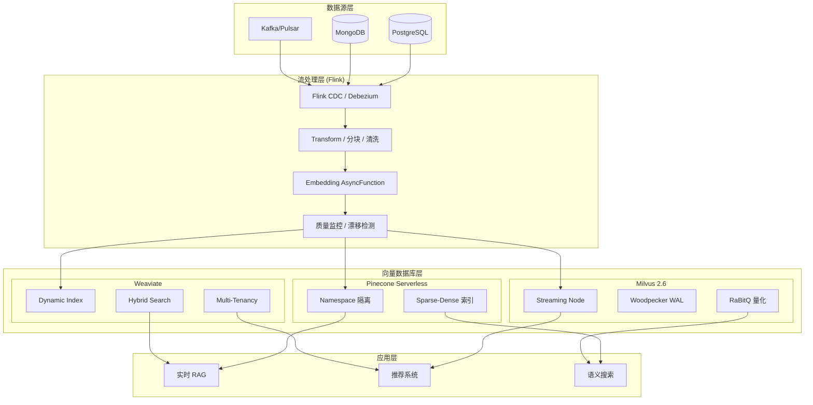
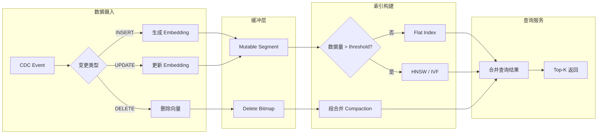
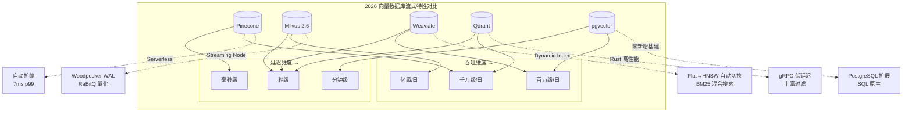

> **状态**: 🔮 前瞻内容 | **风险等级**: 中 | **最后更新**: 2026-04-20
>
> 本文档涉及向量数据库产品特性基于公开信息整理，具体版本特性以各厂商官方发布为准。

---

# 流处理 + 向量数据库前沿进展 (2026)

> 所属阶段: Knowledge/06-frontier | 前置依赖: [vector-search-streaming-convergence.md](vector-search-streaming-convergence.md), [streaming-databases.md](streaming-databases.md) | 形式化等级: L3

---

## 1. 概念定义 (Definitions)

### Def-K-06-260: Streaming Vector Ingestion Pipeline

**流式向量摄入管道** 定义从原始数据流到向量数据库索引的端到端数据流：

```yaml
管道阶段:
  Stage 1 - 数据摄取:
    输入: CDC / Kafka / Pulsar 流
    处理: 去重、格式校验、Schema 对齐

  Stage 2 - 嵌入生成:
    处理: 文本分块 → Embedding Model → 向量
    模式: 同步调用 (低吞吐) / 批量异步 (高吞吐) / 本地模型 (边缘)

  Stage 3 - 索引更新:
    处理: 向量 + 元数据 → 向量数据库 upsert
    策略: 实时增量 (latency < 1s) / 微批量 (latency 1-10s) / 批量 (latency > 10s)

  Stage 4 - 一致性校验:
    处理: 源库 CDC 位点 ↔ 向量库主键 对照
    目标: 最终一致性 (默认) / 强一致性 (事务型 CDC)
```

**形式化定义**：

$$
\text{Pipeline} = (S, E, V, I, \tau)
$$

其中：

- $S$: 源数据流空间
- $E$: Embedding 函数空间
- $V$: 向量空间 $\mathbb{R}^d$
- $I$: 向量索引结构
- $\tau$: 端到端延迟约束

### Def-K-06-261: Real-time Index Update Strategy

**实时向量索引更新策略** 定义在保证查询质量的前提下最小化索引更新延迟的技术集合：

```yaml
策略分类:
  增量追加策略 (Pinecone / Milvus Streaming Node):
    - 新向量写入内存缓冲 (mutable segment)
    - 后台异步合并到不可变段 (immutable segment)
    - 查询时合并内存 + 磁盘索引结果

  动态索引切换 (Weaviate Dynamic Index):
    - 小规模数据 (N < threshold): Flat Index (暴力搜索)
    - 大规模数据 (N ≥ threshold): 自动切换至 HNSW
    - 阈值默认: 10,000 对象

  分层量化策略 (Milvus RaBitQ / GPU CAGRA):
    - 粗量化: 快速定位候选集
    - 精细量化: 候选集内精确排序
    - 索引构建与查询解耦
```

---

## 2. 属性推导 (Properties)

### Prop-K-06-260: 流式摄入吞吐与查询延迟权衡

**命题**: 在流式向量摄入场景下，索引更新频率与查询延迟存在单调关系：

$$
\forall f_{ingest} > 0: \frac{\partial L_{query}}{\partial f_{index}} > 0
$$

其中：

- $f_{ingest}$: 向量摄入频率 (vectors/second)
- $f_{index}$: 索引重建频率 (times/second)
- $L_{query}$: 查询延迟 (ms)

**各系统权衡特性**：

| 系统 | 摄入吞吐 | 查询延迟 | 权衡策略 |
|------|---------|---------|---------|
| Pinecone Serverless | 高 (auto-scale) | 7ms p99 | 内存缓冲 + 后台合并 |
| Milvus 2.6 Streaming | 极高 (Streaming Node) | 10-50ms | WAL 顺序写 + 异步建索引 |
| Weaviate Dynamic | 中 (内置 vectorizer) | 20-100ms | Flat/HNSW 自动切换 |

---

## 3. 关系建立 (Relations)

### 3.1 流处理系统与向量数据库集成矩阵

| 能力维度 | Flink + Pinecone | Flink + Milvus | Flink + Weaviate |
|---------|-----------------|----------------|-----------------|
| CDC 源支持 | Debezium → Kafka | Flink CDC → Streaming Node | JDBC CDC → Batch Insert |
| 嵌入生成 | AsyncFunction (外部 API) | UDF (本地模型) | 内置 Vectorizer (简化) |
| 索引延迟 | < 1s (serverless) | < 5s (Streaming Node) | < 10s (async indexing) |
| 混合搜索 | Sparse-Dense 向量 | BM25 + Vector | BM25 + Vector (原生) |
| 多租户 | Namespace 隔离 | Collection/Partition 隔离 | Tenant 隔离 (v1.28+) |
| 扩展性 | 自动 (serverless) | 手动 (K8s) | 手动/托管 |

### 3.2 数据流关系图

```
┌──────────────┐    CDC/Kafka    ┌──────────────┐    Embedding    ┌──────────────┐
│   数据源      │ ──────────────► │  Flink Job   │ ──────────────► │  向量数据库   │
│ (PG/MySQL/   │                 │  - 清洗分块   │                 │ - 实时索引    │
│  MongoDB)    │                 │  - 嵌入生成   │                 │ - 混合搜索    │
└──────────────┘                 │  - 元数据关联 │                 └──────────────┘
                                 └──────────────┘
                                        │
                                        ▼
                                 ┌──────────────┐
                                 │  质量监控     │
                                 │ - 向量漂移    │
                                 │ - 延迟告警    │
                                 │ - 一致性校验  │
                                 └──────────────┘
```

---

## 4. 论证过程 (Argumentation)

### 4.1 为什么 2026 年是流式向量数据库的关键年？

**三大技术驱动力**：

1. **实时 RAG 需求爆发**
   - 企业知识库要求 "写入即搜索" 的延迟体验
   - 传统批量索引 (小时级) 无法满足对话式 AI 场景
   - 流式 CDC + 向量索引成为标准架构

2. **Serverless 向量数据库成熟**
   - Pinecone Serverless GA 消除容量规划负担
   - Milvus Streaming Node 原生支持高吞吐写入
   - 成本模型从 "预置集群" 转向 "按查询付费"

3. **Embedding 成本大幅下降**
   - 开源模型 (BGE, E5, GTE) 质量逼近 OpenAI
   - 本地 Embedding 服务消除 API 调用延迟
   - 量化技术 (RaBitQ, INT8) 降低存储成本 50%+

### 4.2 实时索引更新的技术挑战与对策

| 挑战 | 影响 | 解决方案 |
|------|------|---------|
| 索引构建阻塞查询 | 写入期间查询延迟飙升 | 内存缓冲 + 后台异步合并 |
| 向量漂移 (Vector Drift) | 新旧 Embedding 模型不兼容 | 版本化索引 + 渐进式重建 |
| 大规模删除 | 标记删除导致索引膨胀 | 段合并 (Segment Compaction) |
| 多模态数据 | 文本/图像/视频向量维度差异 | 统一 Embedding 空间 / 多索引 |

---

## 5. 形式证明 / 工程论证 (Proof / Engineering Argument)

### Thm-K-06-260: 流式向量索引最终一致性

**定理**: 在 CDC 驱动的流式向量摄入管道中，向量数据库与源数据库在有限时间内达到一致状态：

$$
\forall t > t_0: \lim_{\Delta t \to \infty} |\text{Source}(t_0 + \Delta t) \bowtie \text{VectorDB}(t_0 + \Delta t)| = 0
$$

其中 $\bowtie$ 表示对称差异集。

**证明概要**：

1. **CDC 完备性**: Debezium / Flink CDC 保证捕获所有 DML 事件 (INSERT/UPDATE/DELETE)
   - 基于数据库 WAL / Oplog 的顺序读取
   - At-Least-Once  delivery 语义

2. **Flink 端到端一致性**: Checkpoint 机制保证嵌入生成不丢失记录
   - 两阶段提交: Source offset + Sink 向量写入原子提交
   - Exactly-Once 语义消除重复向量

3. **向量数据库写入确认**: Pinecone/Milvus/Weaviate 的 upsert API 返回写入确认
   - 未确认写入触发 Flink 自动重试
   - 重试间隔指数退避避免雪崩

### Lemma-K-06-260: 动态索引切换的查询正确性

**引理**: Weaviate Dynamic Index 在 Flat → HNSW 切换过程中不丢失查询结果：

$$
\forall q \in \mathbb{R}^d, \forall t_{switch}: \text{Recall}(q, t_{switch}) \geq \text{Recall}(q, t_{switch} - \epsilon)
$$

**工程保证**: 切换过程创建新 HNSW 索引，旧 Flat 索引持续服务查询，切换完成后原子替换。

---

## 6. 实例验证 (Examples)

### 6.1 Flink + Pinecone 实时 RAG 管道

```java
// [伪代码片段 - 不可直接运行] 仅展示核心逻辑
// 场景: 企业文档变更 → 实时更新 Pinecone 向量索引

DataStream<DocumentChange> changes = env
    .fromSource(debeziumSource, WatermarkStrategy.noWatermarks(), "cdc");

// 异步生成 Embedding (调用 OpenAI / 本地模型)
DataStream<VectorRecord> vectors = AsyncDataStream
    .unorderedWait(
        changes,
        new EmbeddingAsyncFunction("text-embedding-3-small"),
        1000, TimeUnit.MILLISECONDS, 100
    );

// 写入 Pinecone Serverless
vectors.addSink(new PineconeVectorSink(
    PineconeConfig.builder()
        .indexName("enterprise-docs")
        .namespace("prod")
        .batchSize(100)
        .build()
));
```

### 6.2 Flink + Milvus Streaming Node 高吞吐摄入

```java
// [伪代码片段 - 不可直接运行] 仅展示核心逻辑
// 场景: 电商商品流 → Milvus Streaming Node 实时索引

DataStream<ProductEvent> events = env
    .fromSource(kafkaSource, WatermarkStrategy.forBoundedOutOfOrderness(...), "products");

// 多模态 Embedding (文本 + 图像)
DataStream<MultiModalVector> mmVectors = events
    .keyBy(ProductEvent::getCategoryId)
    .process(new MultiModalEmbeddingProcessFunction());

// 写入 Milvus 2.6 Streaming Node
mmVectors.addSink(new MilvusStreamingSink(
    MilvusConfig.builder()
        .collection("products")
        .partitionKey("category_id")
        .consistencyLevel(BOUNDED_STALENESS)
        .build()
));
```

---

## 7. 可视化 (Visualizations)

### 7.1 流处理 + 向量数据库集成架构图



### 7.2 实时向量索引更新数据流图



### 7.3 主流向量数据库流式特性对比矩阵



---

## 8. 引用参考 (References)
