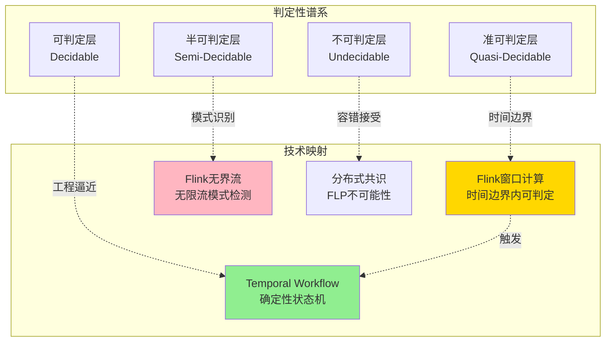
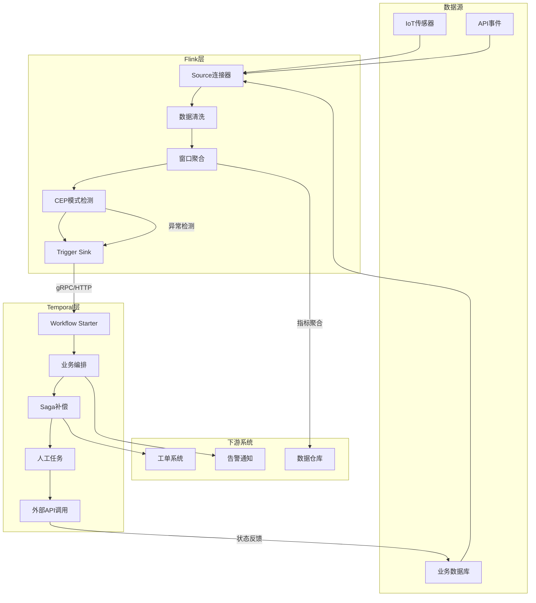
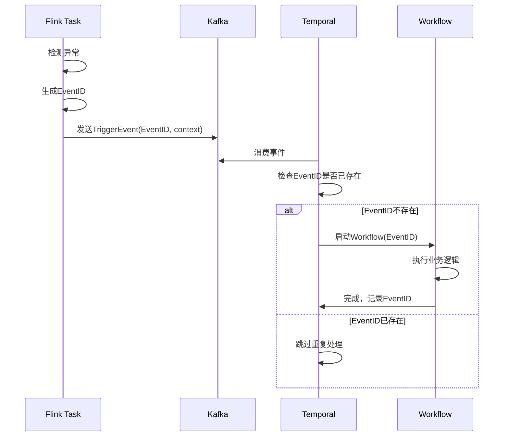
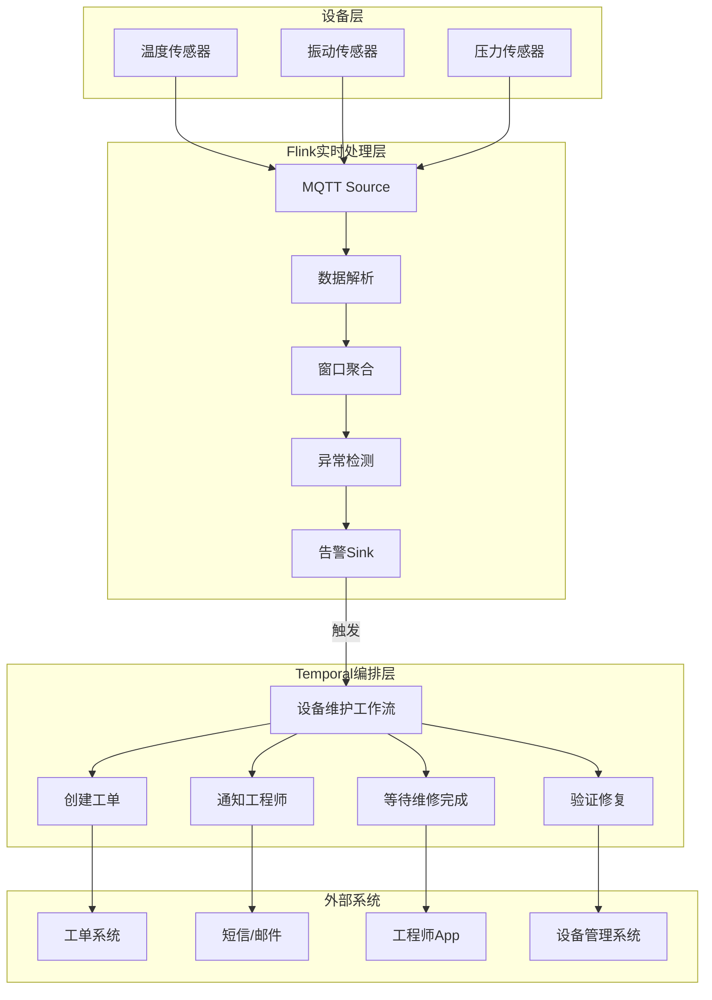
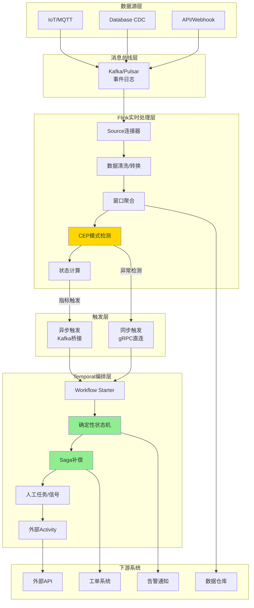
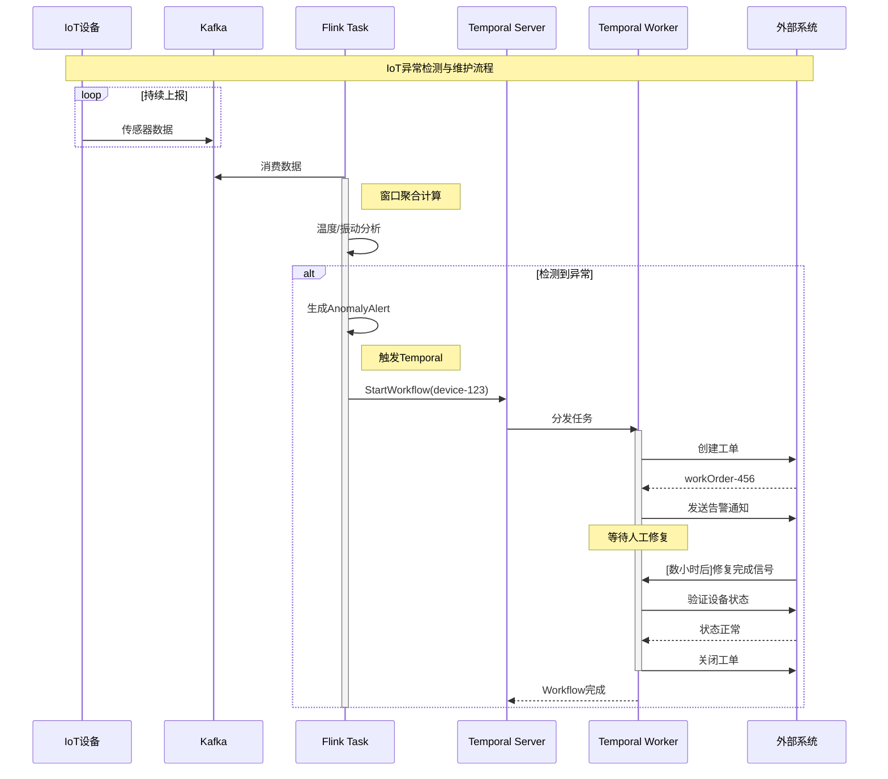
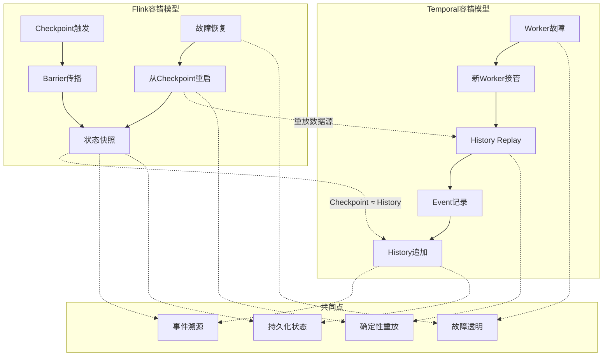
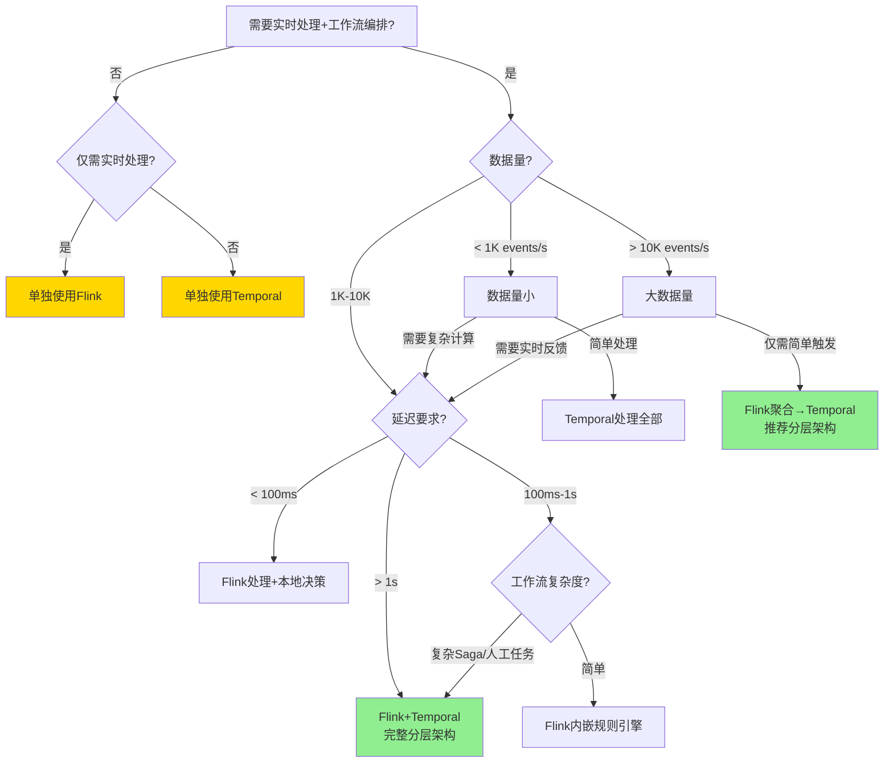

# Temporal + Flink 分层架构指南：Durable Execution 与流计算的融合

> **所属阶段**: Knowledge/06-frontier | **前置依赖**: [00.md](../../00.md), [Flink/02-core-mechanisms/checkpoint-mechanism-deep-dive.md](../../Flink/02-core-mechanisms/checkpoint-mechanism-deep-dive.md) | **形式化等级**: L3-L4

---

## 1. 概念定义 (Definitions)

### Def-K-06-150: Durable Execution (持久化执行)

**定义**: Durable Execution 是一种执行模型，其中计算状态被持续持久化，使得进程崩溃后可以从最后持久化的状态恢复而不丢失进度。形式化为三元组：

$$
\mathcal{DE} \triangleq \langle \mathcal{W}, \mathcal{A}, \mathcal{H} \rangle
$$

其中：

| 组件 | 符号 | 形式化定义 | 功能描述 |
|------|------|------------|----------|
| **Workflow** | $\mathcal{W}$ | $S \times I \rightarrow S' \times O$ | 确定性状态机转换 |
| **Activity** | $\mathcal{A}$ | $I \xrightarrow{\text{side-effect}} O$ | 非确定性外部交互 |
| **History** | $\mathcal{H}$ | $\{e_1, e_2, ..., e_n\}$ | 不可变事件日志 |

**核心特征**: Workflow代码必须满足**确定性约束**——给定相同的输入和历史，必须产生相同的输出和状态转移。这是通过Event Sourcing和History Replay实现的。

---

### Def-K-06-151: Temporal 架构抽象

**定义**: Temporal是Durable Execution的开源实现，其核心抽象包括：

**Workflow**: 长期运行的确定性状态机
$$
\text{Workflow}: (State_t, Event_t) \xrightarrow{\text{deterministic}} State_{t+1}
$$

**Activity**: 封装副作用的可重试操作
$$
\text{Activity}: Input \xrightarrow{\text{non-deterministic}} Output, \quad \text{with retry policy } \mathcal{R}
$$

**Worker**: 执行Workflow和Activity的进程
$$
\text{Worker} = \langle Pollers_t, Pollers_a, Cache, Executor \rangle
$$

**Temporal Server**: 协调服务，包含：

- **Frontend**: gRPC网关，接收任务请求
- **History Service**: 管理Workflow执行历史
- **Matching Service**: 任务队列路由
- **Worker Service**: 内部系统任务执行

---

### Def-K-06-152: 流计算-工作流分层架构

**定义**: 流计算-工作流分层架构是将实时流处理（Flink）与长期工作流编排（Temporal）垂直分层的系统架构：

```
┌─────────────────────────────────────────┐
│  Layer 4: 业务编排层 (Orchestration)     │
│  Temporal: 确定性工作流、Saga、人工任务   │
├─────────────────────────────────────────┤
│  Layer 3: 流处理层 (Stream Processing)   │
│  Flink: 实时ETL、CEP、窗口聚合           │
├─────────────────────────────────────────┤
│  Layer 2: 消息总线层 (Messaging)         │
│  Kafka/Pulsar: 事件日志、解耦缓冲        │
├─────────────────────────────────────────┤
│  Layer 1: 数据源层 (Data Sources)        │
│  IoT/DB/API: 原始数据产生                │
└─────────────────────────────────────────┘
```

**分层职责边界**:

| 层级 | 时间尺度 | 状态特征 | 容错机制 | 判定性 |
|------|----------|----------|----------|--------|
| Flink层 | 毫秒-秒级 | TB级键控状态 | Checkpoint | 半可判定 |
| Temporal层 | 秒-天级 | 轻量工作流状态 | History Replay | 准可判定 |

---

### Def-K-06-153: 分层触发机制 (Layered Trigger)

**定义**: 分层触发机制是Flink检测到特定模式后启动Temporal工作流的协议：

$$
\text{Trigger}: \text{Pattern}_{Flink} \times \text{Context}_{stream} \rightarrow \text{Workflow}_{Temporal}
$$

**触发模式**:

| 模式 | Flink检测 | Temporal响应 | 延迟要求 |
|------|-----------|--------------|----------|
| **阈值触发** | $\text{metric} > \theta$ | 告警工作流 | < 5s |
| **模式触发** | $\text{CEP}(e_{t-w:t}) = \text{pattern}$ | 复杂事件处理 | < 10s |
| **异常触发** | $\text{Anomaly}(x) > \tau$ | 故障处理工作流 | < 30s |
| **聚合触发** | $\text{WindowAggregate} \in \text{Condition}$ | 业务决策工作流 | < 60s |

---

### Def-K-06-154: 端到端一致性模型

**定义**: 跨Flink-Temporal分层的一致性模型定义为：

**内部一致性**: Flink通过Checkpoint保证流处理内部Exactly-Once语义
$$
\text{InternalConsistency}_{Flink}: \forall e \in Stream, \text{ processed exactly once}
$$

**工作流一致性**: Temporal通过History Replay保证Workflow确定性执行
$$
\text{WorkflowConsistency}_{Temporal}: \forall h \in \mathcal{H}, \text{ replay produces same state}
$$

**跨层一致性**: 触发事件从Flink到Temporal的可靠传递
$$
\text{CrossLayerConsistency}: \text{Triggered}(e) \iff \text{WorkflowStarted}(e)
$$

---

## 2. 属性推导 (Properties)

### Prop-K-06-90: 分层架构延迟边界定理

**命题**: 在Flink-Temporal分层架构中，从事件产生到工作流启动的总延迟满足：

$$
L_{total} = L_{ Flink} + L_{trigger} + L_{Temporal}
$$

其中各分量边界：

| 组件 | 公式 | 典型值 | 优化策略 |
|------|------|--------|----------|
| Flink处理 | $L_{Flink} = L_{window} + L_{compute}$ | 10-1000ms | 调整窗口大小、算子链优化 |
| 触发传递 | $L_{trigger} = L_{network} + L_{queue}$ | 10-100ms | 本地部署、gRPC直连 |
| Temporal启动 | $L_{Temporal} = L_{dispatch} + L_{worker}$ | 50-200ms | Worker预热、连接池 |
| **总计** | | **70ms-1.3s** | **P99 < 2s** |

**推论**: 对于实时性要求高的场景（如IoT异常响应），需将Flink层延迟控制在100ms以内。

---

### Prop-K-06-91: 状态容量分层定理

**命题**: 分层架构的状态容量满足以下约束：

$$
\text{Capacity}_{total} = \text{Capacity}_{Flink} \gg \text{Capacity}_{Temporal}
$$

| 层级 | 状态容量 | 状态类型 | 存储后端 |
|------|----------|----------|----------|
| Flink | TB级 | 键控状态、窗口状态 | RocksDB/ForSt |
| Temporal | GB级 | 工作流变量、等待状态 | 持久化历史+缓存 |

**工程意义**:

- Flink层负责**大规模状态计算**（如每个IoT设备的实时指标）
- Temporal层负责**长周期协调状态**（如每个设备维护流程的进度）

---

### Lemma-K-06-90: Checkpoint-History 等价引理

**引理**: Flink的Checkpoint与Temporal的History在容错语义上等价：

$$
\text{Checkpoint}_{Flink} \approx \text{History}_{Temporal}
$$

**证明**:

1. **Flink Checkpoint**: 捕获全局一致状态快照，故障后从快照恢复并重放数据源
2. **Temporal History**: 捕获Workflow执行的事件序列，故障后从History重放恢复状态
3. 两者都将**瞬态执行**转化为**持久化状态**，实现故障透明恢复
4. 得证。

**推论**: 两层都基于事件溯源（Event Sourcing）实现容错，可以共享底层存储（如Kafka作为Source和History的后端）。

---

### Prop-K-06-92: Saga补偿跨层传递定理

**命题**: 当Temporal工作流中的Saga补偿需要回滚Flink层已提交的状态时，需要显式的外部补偿机制：

$$
\text{Compensation}_{cross-layer}: \mathcal{C}_{Temporal} \rightarrow \Delta_{Flink}^{-1}
$$

**补偿策略**:

| 场景 | 补偿机制 | 实现方式 |
|------|----------|----------|
| Flink仅触发 | 无需补偿 | 触发事件幂等 |
| Flink状态已提交 | 反向操作 | 生成compensating event |
| Sink已写入 | 事务回滚 | 2PC或Sink幂等 |

---

## 3. 关系建立 (Relations)

### 3.1 Flink vs Temporal: 判定性谱系定位



**核心差异矩阵**:

| 维度 | Apache Flink | Temporal |
|------|--------------|----------|
| **计算模型** | Dataflow DAG、持续查询 | 确定性状态机 |
| **时间尺度** | 毫秒-秒级 | 秒-天级 |
| **状态容量** | TB级（RocksDB） | GB级（持久化历史） |
| **容错机制** | Checkpoint + Replay | History Replay |
| **判定性层级** | 半可判定（无限流） | 准可判定（确定性约束） |
| **核心优势** | 高吞吐实时计算 | 复杂长周期编排 |
| **吞吐量** | 百万事件/秒 | 数万工作流/秒 |

---

### 3.2 分层架构的数据流关系



---

### 3.3 与00.md中"Flink vs Temporal"章节的互补关系

| 00.md 内容 | 本文档深化 |
|-----------|-----------|
| 判定性谱系对比 | 分层架构的工程实现 |
| 技术特征对比 | 集成模式与触发机制 |
| 各自适用场景 | 协同工作的端到端案例 |
| 理论基础 | 实际代码实现与部署模式 |

**本文档定位**: 00.md提供了Flink与Temporal的理论对比，本文档提供**工程集成的实践指南**。

---

## 4. 论证过程 (Argumentation)

### 4.1 为什么需要分层架构？

**论证**: 单一技术无法满足现代实时业务系统的全部需求。

**反证法**: 假设仅用Flink实现完整业务流程

1. **长周期问题**: Flink不适合处理需要等待人工审批（可能持续数天）的流程
2. **复杂性限制**: Flink DAG难以表达复杂的条件分支、循环、重试逻辑
3. **外部集成**: Flink与外部系统的同步交互需要复杂的Async I/O管理

**反证法**: 假设仅用Temporal实现实时处理

1. **吞吐限制**: Temporal的吞吐（数万工作流/秒）远低于Flink（百万事件/秒）
2. **状态容量**: Temporal不适合存储TB级的键控状态
3. **延迟**: Temporal的Workflow启动延迟（50-200ms）不适合毫秒级响应

**结论**: Flink处理**高吞吐实时计算**，Temporal处理**复杂长周期编排**，两者形成互补分层。

---

### 4.2 分层架构设计模式

**模式1: 触发-响应模式 (Trigger-Response)**

```
Flink检测异常 ──► 触发Temporal工作流 ──► 执行补偿/通知流程
```

适用场景: IoT异常检测、实时风控、监控告警

**模式2: 状态机-流协同模式 (State Machine-Stream Coordination)**

```
Temporal管理工作流状态 ──► Flink实时更新状态指标 ──► Temporal决策
```

适用场景: 订单履约跟踪、物流状态管理

**模式3: 批流一体-工作流模式 (Batch-Stream-Workflow)**

```
Flink批处理历史数据 ──► Flink流处理实时数据 ──► Temporal编排完整流程
```

适用场景: 用户画像更新、推荐系统

---

### 4.3 触发机制设计考量

**同步触发 vs 异步触发**:

| 方式 | 实现 | 优点 | 缺点 |
|------|------|------|------|
| **同步触发** | Flink ProcessFunction直接调用Temporal | 延迟低、反馈即时 | 耦合强、 Temporal故障影响Flink |
| **异步触发** | Flink Sink到Kafka，Temporal消费 | 解耦、缓冲能力强 | 延迟增加（~100ms） |

**建议**: 生产环境使用**异步触发**以保证系统韧性。

---

### 4.4 反例分析：分层架构不适用场景

**场景1: 纯实时计算**

- 仅需毫秒级窗口聚合，无需复杂编排
- **方案**: 单独使用Flink

**场景2: 纯业务流程**

- 仅需审批流，无实时数据处理需求
- **方案**: 单独使用Temporal

**场景3: 超低延迟交易**

- 要求< 10ms端到端延迟
- **方案**: 专用实时系统（如FPGA）

---

## 5. 形式证明 / 工程论证 (Proof / Engineering Argument)

### 5.1 分层架构容错正确性论证

**定理**: 在Flink-Temporal分层架构中，若满足以下条件，则端到端处理满足At-Least-Once语义：

1. Flink Source支持重放（如Kafka offset回溯）
2. Flink启用Checkpoint
3. Temporal Workflow使用Idempotency Key
4. Temporal-to-Sink操作为幂等或事务性

**论证**:

**步骤1: Flink层容错**

由Flink Checkpoint机制（参见 [Thm-F-02-01](../../Flink/02-core-mechanisms/checkpoint-mechanism-deep-dive.md)），Flink故障恢复后：

- 从Checkpoint恢复状态
- 重放Source数据
- 产生相同的输出（包括触发事件）

**步骤2: 触发层容错**

若使用Kafka作为触发中间件：

- Kafka保留触发消息直到Temporal确认
- Temporal Worker故障后，任务重新调度
- 通过Idempotency Key保证重复触发不重复执行

**步骤3: Temporal层容错**

由Temporal的History Replay机制：

- Workflow代码确定性强
- History持久化到数据库
- Worker故障后从断点恢复

**步骤4: 跨层一致性**

$$
\text{Flink重启} \rightarrow \text{相同触发事件} \rightarrow \text{Temporal幂等处理}
$$

因此，端到端语义为At-Least-Once（Temporal保证），若Sink支持事务则为Exactly-Once。

---

### 5.2 分层触发一致性论证

**场景**: Flink检测到异常后触发Temporal工作流，如何保证"检测-触发-执行"的因果一致性？

**解决方案**:

1. **事件ID传递**: Flink将触发事件与唯一EventID绑定
2. **Temporal去重**: Workflow使用EventID作为Idempotency Key
3. **因果追踪**: 使用OpenTelemetry跨层传播TraceID



---

### 5.3 性能边界论证

**命题**: 分层架构的最大吞吐受限于较小组件：

$$
\text{Throughput}_{max} = \min(\text{Throughput}_{Flink}, \text{Throughput}_{Temporal} \times \text{BatchFactor})
$$

其中BatchFactor为Flink聚合后的事件压缩比。

**典型场景计算**:

| 场景 | Flink吞吐 | Temporal吞吐 | BatchFactor | 系统瓶颈 |
|------|-----------|--------------|-------------|----------|
| IoT异常检测 | 1M events/s | 10K workflows/s | 100:1 | 均衡 |
| 实时风控 | 100K events/s | 5K workflows/s | 20:1 | Temporal |
| 业务监控 | 10K events/s | 2K workflows/s | 5:1 | Flink |

**优化建议**: 当BatchFactor < 10时，考虑在Flink层增加聚合窗口或采样。

---

## 6. 实例验证 (Examples)

### 6.1 完整案例: IoT异常检测 → 维护工作流

**场景**: 智能工厂中，数千台IoT设备持续上报传感器数据。Flink实时检测异常，触发Temporal编排维护流程。

**系统架构**:



---

**Flink实现代码**:

```java
public class IoTAnomalyDetectionJob {

    public static void main(String[] args) throws Exception {
        StreamExecutionEnvironment env =
            StreamExecutionEnvironment.getExecutionEnvironment();

        // 启用Checkpoint保证Exactly-Once
        env.enableCheckpointing(60000);
        env.getCheckpointConfig().setCheckpointingMode(
            CheckpointingMode.EXACTLY_ONCE);
        env.setStateBackend(new EmbeddedRocksDBStateBackend(true));

        // 1. 消费MQTT设备数据
        DataStream<DeviceEvent> events = env
            .addSource(new MqttSourceFunction("tcp://mqtt-broker:1883"))
            .assignTimestampsAndWatermarks(
                WatermarkStrategy
                    .<DeviceEvent>forBoundedOutOfOrderness(
                        Duration.ofSeconds(30))
                    .withTimestampAssigner(
                        (event, timestamp) -> event.getTimestamp())
            );

        // 2. 按设备ID分组，滑动窗口聚合
        DataStream<DeviceMetrics> metrics = events
            .keyBy(DeviceEvent::getDeviceId)
            .window(SlidingEventTimeWindows.of(
                Time.minutes(5),    // 窗口大小
                Time.minutes(1)     // 滑动间隔
            ))
            .aggregate(new MetricAggregator());

        // 3. 异常检测：温度/振动超过阈值
        DataStream<AnomalyAlert> alerts = metrics
            .flatMap(new AnomalyDetector())
            .filter(alert -> alert.getSeverity() != Severity.NORMAL);

        // 4. 触发Temporal工作流
        alerts.addSink(new TemporalWorkflowTriggerSink());

        // 5. 同时写入数据仓库用于分析
        alerts.addSink(new ClickHouseSink());

        env.execute("IoT Anomaly Detection");
    }
}

/**
 * 异常检测算子
 */
public class AnomalyDetector implements
    FlatMapFunction<DeviceMetrics, AnomalyAlert> {

    @Override
    public void flatMap(DeviceMetrics metrics, Collector<AnomalyAlert> out) {
        // 温度异常：超过80度
        if (metrics.getAvgTemperature() > 80.0) {
            out.collect(new AnomalyAlert(
                metrics.getDeviceId(),
                AnomalyType.HIGH_TEMPERATURE,
                Severity.CRITICAL,
                metrics.getTimestamp(),
                Map.of("temperature", metrics.getAvgTemperature())
            ));
        }

        // 振动异常：方差超过阈值
        if (metrics.getVibrationVariance() > 50.0) {
            out.collect(new AnomalyAlert(
                metrics.getDeviceId(),
                AnomalyType.ABNORMAL_VIBRATION,
                Severity.WARNING,
                metrics.getTimestamp(),
                Map.of("variance", metrics.getVibrationVariance())
            ));
        }
    }
}

/**
 * Temporal工作流触发Sink
 */
public class TemporalWorkflowTriggerSink extends
    RichSinkFunction<AnomalyAlert> {

    private transient WorkflowClient temporalClient;
    private transient MaintenanceWorkflowStub workflowStub;

    @Override
    public void open(Configuration parameters) {
        // 初始化Temporal客户端
        WorkflowServiceStubs service = WorkflowServiceStubs.newLocalServiceStubs();
        temporalClient = WorkflowClient.newInstance(service);
    }

    @Override
    public void invoke(AnomalyAlert alert, Context context) {
        // 构建工作流ID：去重键 = deviceId + 小时级别时间窗口
        String workflowId = String.format("maintenance-%s-%d",
            alert.getDeviceId(),
            alert.getTimestamp() / 3600000  // 按小时分组
        );

        // 配置工作流选项
        WorkflowOptions options = WorkflowOptions.newBuilder()
            .setWorkflowId(workflowId)
            .setTaskQueue("maintenance-queue")
            .setWorkflowIdReusePolicy(
                WorkflowIdReusePolicy.WORKFLOW_ID_REUSE_POLICY_REJECT_DUPLICATE)
            .build();

        // 启动或获取工作流
        MaintenanceWorkflow workflow = temporalClient.newWorkflowStub(
            MaintenanceWorkflow.class, options);

        try {
            // 异步启动工作流
            WorkflowExecution execution = WorkflowClient.start(
                () -> workflow.handleAnomaly(alert)
            );

            LOG.info("Started maintenance workflow: {} for device: {}",
                execution.getWorkflowId(), alert.getDeviceId());

        } catch (WorkflowExecutionAlreadyStarted e) {
            // 工作流已存在，获取现有工作流追加事件
            MaintenanceWorkflow existing = temporalClient.newWorkflowStub(
                MaintenanceWorkflow.class, workflowId);
            existing.reportAdditionalAnomaly(alert);
        }
    }
}
```

---

**Temporal工作流实现**:

```java
/**
 * 设备维护工作流接口
 */
@WorkflowInterface
public interface MaintenanceWorkflow {

    @WorkflowMethod
    void handleAnomaly(AnomalyAlert initialAlert);

    @SignalMethod
    void reportAdditionalAnomaly(AnomalyAlert alert);

    @QueryMethod
    MaintenanceStatus getStatus();
}

/**
 * 维护工作流实现
 */
public class MaintenanceWorkflowImpl implements MaintenanceWorkflow {

    private final ActivityStub activities = Workflow.newActivityStub(
        MaintenanceActivities.class,
        ActivityOptions.newBuilder()
            .setStartToCloseTimeout(Duration.ofMinutes(10))
            .setRetryOptions(RetryOptions.newBuilder()
                .setInitialInterval(Duration.ofSeconds(1))
                .setMaximumAttempts(5)
                .build())
            .build()
    );

    // 状态变量（自动持久化）
    private String deviceId;
    private List<AnomalyAlert> alertHistory = new ArrayList<>();
    private MaintenanceStatus status = MaintenanceStatus.CREATED;
    private String workOrderId;

    // 用于等待人工确认的信号
    private final CompletablePromise<String> repairConfirmation =
        Workflow.newPromise();

    @Override
    public void handleAnomaly(AnomalyAlert initialAlert) {
        this.deviceId = initialAlert.getDeviceId();
        this.alertHistory.add(initialAlert);

        // 1. 评估异常严重性
        Severity severity = evaluateSeverity(alertHistory);

        // 2. 创建工单（Activity调用外部系统）
        this.workOrderId = activities.createWorkOrder(
            deviceId, severity, alertHistory);
        this.status = MaintenanceStatus.WORK_ORDER_CREATED;

        // 3. 通知工程师
        activities.notifyEngineers(deviceId, workOrderId, severity);

        // 4. Saga模式：记录补偿操作
        Saga saga = new Saga();
        saga.addCompensation(() -> activities.cancelWorkOrder(workOrderId));

        try {
            if (severity == Severity.CRITICAL) {
                // 严重异常：立即停机（Activity调用设备管理API）
                activities.shutdownDevice(deviceId);
                saga.addCompensation(() -> activities.restartDevice(deviceId));
            }

            // 5. 等待维修完成信号（可能持续数小时甚至数天）
            this.status = MaintenanceStatus.WAITING_FOR_REPAIR;
            String repairResult = repairConfirmation.get();  // 阻塞等待

            // 6. 验证修复
            this.status = MaintenanceStatus.VERIFYING;
            boolean isFixed = activities.verifyDeviceStatus(deviceId);

            if (isFixed) {
                this.status = MaintenanceStatus.COMPLETED;
                activities.closeWorkOrder(workOrderId, "Fixed");
            } else {
                // 修复失败，重新创建工单
                this.status = MaintenanceStatus.REOPENED;
                throw ApplicationFailure.newFailure(
                    "Device still malfunctioning", "VerificationFailed");
            }

        } catch (Exception e) {
            // Saga补偿：回滚已执行的操作
            saga.compensate();
            this.status = MaintenanceStatus.FAILED;
            throw Workflow.wrap(e);
        }
    }

    @Override
    public void reportAdditionalAnomaly(AnomalyAlert alert) {
        // 信号处理：追加新检测到的异常
        this.alertHistory.add(alert);

        // 如果严重性升级，可能触发额外操作
        Severity newSeverity = evaluateSeverity(alertHistory);
        if (newSeverity == Severity.CRITICAL &&
            this.status == MaintenanceStatus.WAITING_FOR_REPAIR) {
            // 升级告警
            activities.escalateWorkOrder(workOrderId);
        }
    }

    @Override
    public MaintenanceStatus getStatus() {
        return this.status;
    }

    // 信号处理：工程师报告维修完成
    @SignalMethod
    public void confirmRepair(String repairDetails) {
        repairConfirmation.complete(repairDetails);
    }

    private Severity evaluateSeverity(List<AnomalyAlert> alerts) {
        long criticalCount = alerts.stream()
            .filter(a -> a.getSeverity() == Severity.CRITICAL)
            .count();
        return criticalCount > 0 ? Severity.CRITICAL : Severity.WARNING;
    }
}

/**
 * Activity实现（与外部系统交互）
 */
public class MaintenanceActivitiesImpl implements MaintenanceActivities {

    private final WorkOrderClient workOrderClient;
    private final DeviceManagementClient deviceClient;
    private final NotificationService notificationService;

    @Override
    public String createWorkOrder(String deviceId, Severity severity,
                                   List<AnomalyAlert> alerts) {
        CreateWorkOrderRequest request = CreateWorkOrderRequest.builder()
            .deviceId(deviceId)
            .priority(severity == Severity.CRITICAL ? "P0" : "P1")
            .description(buildDescription(alerts))
            .build();

        return workOrderClient.create(request).getWorkOrderId();
    }

    @Override
    public void notifyEngineers(String deviceId, String workOrderId,
                                 Severity severity) {
        String message = String.format(
            "设备 %s 发生%s异常，工单 %s 已创建",
            deviceId, severity, workOrderId);

        notificationService.sendToEngineers(message);
    }

    @Override
    public void shutdownDevice(String deviceId) {
        deviceClient.shutdown(deviceId);
    }

    @Override
    public boolean verifyDeviceStatus(String deviceId) {
        DeviceStatus status = deviceClient.getStatus(deviceId);
        return status.isHealthy() && status.getTemperature() < 80.0;
    }

    // 其他Activity实现...
}
```

---

**工程师移动端集成**:

```java
@RestController
public class MaintenanceController {

    @Autowired
    private WorkflowClient temporalClient;

    /**
     * 工程师报告维修完成
     */
    @PostMapping("/api/maintenance/{workOrderId}/complete")
    public ResponseEntity<?> completeRepair(
            @PathVariable String workOrderId,
            @RequestBody RepairReport report) {

        // 查询关联的工作流ID
        String workflowId = findWorkflowIdByWorkOrder(workOrderId);

        // 发送信号给工作流
        MaintenanceWorkflow workflow = temporalClient.newWorkflowStub(
            MaintenanceWorkflow.class, workflowId);

        workflow.confirmRepair(report.getDetails());

        return ResponseEntity.ok().build();
    }
}
```

---

### 6.2 配置示例

**Flink配置**:

```yaml
# flink-conf.yaml
state.backend: rocksdb
state.backend.incremental: true
state.checkpoints.dir: s3://my-bucket/flink-checkpoints

execution.checkpointing.interval: 60s
execution.checkpointing.mode: EXACTLY_ONCE
execution.checkpointing.timeout: 10min

# 用于Temporal触发的外部系统连接
pipeline.global-job-parameters: |
  temporal.host=temporal-frontend:7233
  temporal.namespace=production
```

**Temporal配置**:

```yaml
# temporal.yaml
services:
  frontend:
    rpc:
      grpcPort: 7233
  matching:
    persistence:
      defaultStore: postgres
  history:
    persistence:
      defaultStore: postgres

taskqueue:
  maintenance-queue:
    workerCount: 10
    maxConcurrentActivityExecutionSize: 100
```

---

### 6.3 性能调优建议

| 组件 | 调优参数 | 推荐值 | 说明 |
|------|----------|--------|------|
| Flink | checkpoint.interval | 60s | 平衡恢复时间和性能 |
| Flink | rocksdb.memory.managed | true | 自动内存管理 |
| Temporal | worker.cache.size | 1000 | Workflow缓存 |
| Temporal | activity.retry.maximumAttempts | 5 | Activity重试次数 |
| Kafka | retention.ms | 604800000 | 7天保留，支持重放 |

---

## 7. 可视化 (Visualizations)

### 7.1 分层架构全景图



---

### 7.2 数据流与触发时序图



---

### 7.3 容错机制对比图



---

### 7.4 架构选型决策树



---

## 8. 引用参考 (References)


---

*文档版本: v1.0 | 更新日期: 2026-04-03 | 状态: 已完成*
