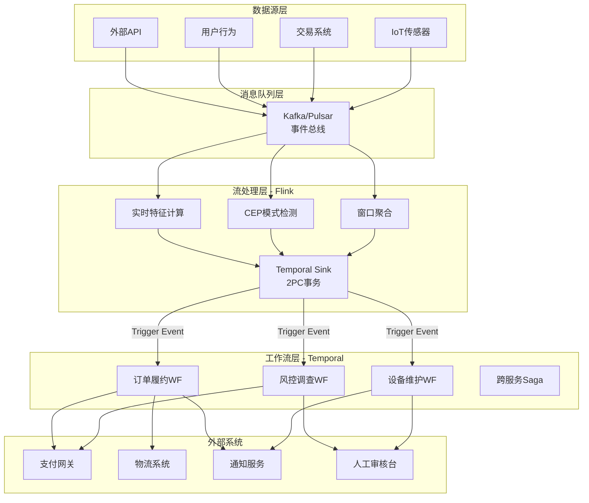
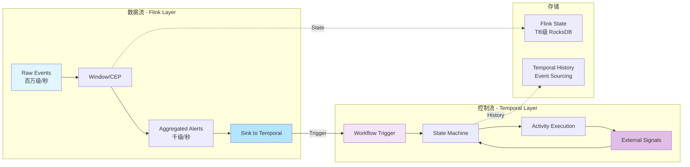
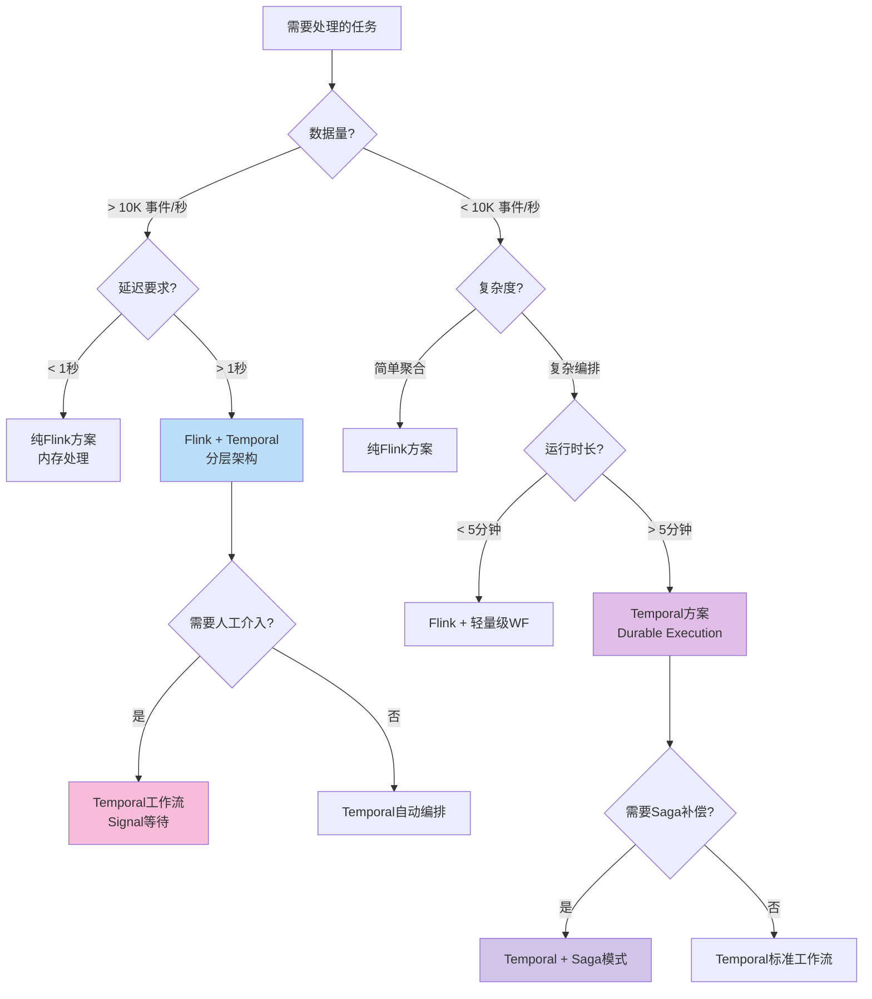
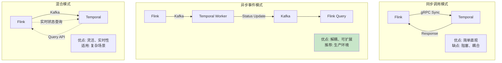
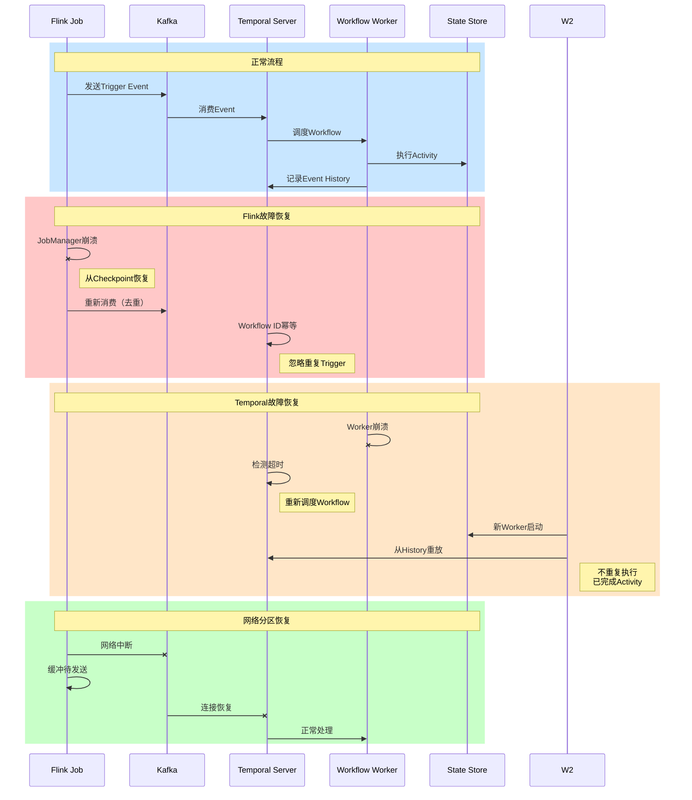

# Temporal与Flink分层架构整合指南

> **状态**: 前瞻 | **预计发布时间**: 2026-06 | **最后更新**: 2026-04-12
> 
> ⚠️ 本文档描述的特性处于早期讨论阶段，尚未正式发布。实现细节可能变更。

> 所属阶段: Knowledge/06-frontier | 前置依赖: [00.md](../../Flink/00-meta/00-INDEX.md), [stateful-serverless.md](./stateful-serverless.md) | 形式化等级: L4-L5

## 目录

- [Temporal与Flink分层架构整合指南](#temporal与flink分层架构整合指南)
  - [目录](#目录)
  - [1. 概念定义 (Definitions)](#1-概念定义-definitions)
    - [Def-K-06-05: Durable Execution (持久化执行)](#def-k-06-05-durable-execution-持久化执行)
    - [Def-K-06-06: Temporal-Flink分层架构](#def-k-06-06-temporal-flink分层架构)
    - [Def-K-06-07: 准可判定性 (Quasi-Decidable)](#def-k-06-07-准可判定性-quasi-decidable)
    - [Def-K-06-08: 半可判定性 (Semi-Decidable)](#def-k-06-08-半可判定性-semi-decidable)
  - [2. 属性推导 (Properties)](#2-属性推导-properties)
    - [Prop-K-06-04: 流计算与工作流的互补性](#prop-k-06-04-流计算与工作流的互补性)
    - [Prop-K-06-05: 事件传递的恰好一次语义](#prop-k-06-05-事件传递的恰好一次语义)
    - [Prop-K-06-06: 状态同步的最终一致性](#prop-k-06-06-状态同步的最终一致性)
  - [3. 关系建立 (Relations)](#3-关系建立-relations)
    - [3.1 Temporal与Flink的判定性谱系定位](#31-temporal与flink的判定性谱系定位)
    - [3.2 分层架构的边界划分](#32-分层架构的边界划分)
    - [3.3 与现有技术栈的关系](#33-与现有技术栈的关系)
  - [4. 论证过程 (Argumentation)](#4-论证过程-argumentation)
    - [4.1 为什么需要分层架构？](#41-为什么需要分层架构)
    - [4.2 判定性层级的工程意义](#42-判定性层级的工程意义)
    - [4.3 错误处理策略对比](#43-错误处理策略对比)
  - [5. 工程论证 (Engineering Argument)](#5-工程论证-engineering-argument)
    - [5.1 分层架构设计原则](#51-分层架构设计原则)
    - [5.2 技术实现细节](#52-技术实现细节)
      - [5.2.1 事件传递机制](#521-事件传递机制)
      - [5.2.2 状态同步策略](#522-状态同步策略)
      - [5.2.3 错误处理与补偿](#523-错误处理与补偿)
    - [5.3 性能与可靠性权衡](#53-性能与可靠性权衡)
  - [6. 实例验证 (Examples)](#6-实例验证-examples)
    - [6.1 IoT传感器数据实时聚合触发设备维护](#61-iot传感器数据实时聚合触发设备维护)
    - [6.2 实时风控检测触发调查流程](#62-实时风控检测触发调查流程)
    - [6.3 电商订单实时处理与履约](#63-电商订单实时处理与履约)
  - [7. 可视化 (Visualizations)](#7-可视化-visualizations)
    - [7.1 分层架构总体视图](#71-分层架构总体视图)
    - [7.2 数据流与控制流分离](#72-数据流与控制流分离)
    - [7.3 架构决策树](#73-架构决策树)
    - [7.4 集成模式对比矩阵](#74-集成模式对比矩阵)
    - [7.5 故障恢复流程](#75-故障恢复流程)
  - [8. 引用参考 (References)](#8-引用参考-references)

---

## 1. 概念定义 (Definitions)

### Def-K-06-05: Durable Execution (持久化执行)

**形式化定义**: Durable Execution是一种执行模型，确保计算在进程崩溃、网络中断或基础设施故障后能够自动恢复并继续执行：

$$\text{Durable Execution} = (\mathcal{W}, \mathcal{H}, \mathcal{R}, \mathcal{T})$$

- $\mathcal{W}$: Workflow定义，确定性状态机 $W = (S, s_0, \delta, F)$
  - $S$: 有限状态集合
  - $s_0 \in S$: 初始状态
  - $\delta: S \times E \rightarrow S$: 状态转移函数
  - $F \subseteq S$: 终止状态集合
- $\mathcal{H}$: 事件历史（Event History），不可变的事件序列 $H = [e_1, e_2, ..., e_n]$
- $\mathcal{R}$: 重放机制（Replay），从历史恢复状态的函数 $\text{replay}(H) \rightarrow s_{current}$
- $\mathcal{T}$: 透明故障恢复（Transparent Recovery），故障对业务逻辑不可见

**关键约束**: Workflow代码必须满足**确定性约束（Determinism Constraints）**——无随机、无系统时间、无直接IO。

**2026年关键发展**: Temporal完成$300M Series D融资（50亿美元估值），OpenAI于2026年2月将Temporal集成进官方Agents SDK，解决AI Agent"复杂性悬崖"（>100步后的可靠性危机）[^1]。

---

### Def-K-06-06: Temporal-Flink分层架构

**形式化定义**: Temporal-Flink分层架构是一种将实时流处理（半可判定层）与业务工作流编排（准可判定层）解耦的分层系统设计：

$$\text{Layered Architecture} = (\mathcal{L}_{stream}, \mathcal{L}_{workflow}, \phi, \psi)$$

- $\mathcal{L}_{stream}$: Flink层（流计算层），负责高吞吐、低延迟的数据处理
  - 计算特征：数据并行、窗口聚合、CEP模式检测
  - 判定性层级：**半可判定**（Semi-decidable）
- $\mathcal{L}_{workflow}$: Temporal层（工作流层），负责长周期业务编排
  - 计算特征：确定性状态机、Saga补偿、人工审批
  - 判定性层级：**准可判定**（Quasi-decidable）
- $\phi: \mathcal{L}_{stream} \rightarrow \mathcal{L}_{workflow}$: 触发映射，将流处理结果转化为工作流启动事件
- $\psi: \mathcal{L}_{workflow} \rightarrow \mathcal{L}_{stream}$: 反馈映射，将工作流状态更新回流处理上下文

**分层边界**: Flink处理**事件级**计算（毫秒延迟），Temporal处理**任务级**编排（秒/分钟/天延迟）。

---

### Def-K-06-07: 准可判定性 (Quasi-Decidable)

**定义**: 准可判定性是指系统内部保持确定性（可判定），但与外部非确定性世界交互时进入半可判定领域的特性：

$$\text{Quasi-Decidable} = \text{Decidable}_{internal} \times \text{Semi-decidable}_{external}$$

**Temporal的准可判定性体现**:

- **Workflow内部**: 确定性状态机，事件历史重放保证相同输入产生相同状态序列
- **Activity外部**: API调用（支付、邮件、AI推理）的成功性不可判定，只能识别成功无法判定永久失败

**工程意义**: 通过将非确定性隔离到Activity边界，Workflow逻辑保持可测试、可验证、可重放的确定性。

---

### Def-K-06-08: 半可判定性 (Semi-Decidable)

**定义**: 半可判定性是指系统可以识别"是"答案但无法判定"否"答案的问题类别：

$$\text{Semi-decidable}: L \in \text{RE} \setminus \text{R}$$

**Flink的半可判定性体现**:

- **无限流处理**: 流理论上无限，无法判定何时终止，但可以识别特定模式出现
- **CEP模式检测**: 可以检测"欺诈模式发生"，无法判定"永远不会发生欺诈"
- **水印机制**: 通过时间假设将半可判定问题转化为工程可管理的准可判定问题

---

## 2. 属性推导 (Properties)

### Prop-K-06-04: 流计算与工作流的互补性

**命题**: Flink的**高吞吐低延迟**与Temporal的**长周期可靠性**形成天然互补。

**推导**:

| 维度 | Flink (流计算层) | Temporal (工作流层) |
|------|-----------------|---------------------|
| **吞吐** | 百万级事件/秒 | 数万工作流/秒 |
| **延迟** | 毫秒级（事件级） | 秒/分钟/天级（任务级） |
| **状态** | TB级键控状态（RocksDB） | 轻量级工作流实例状态 |
| **容错** | Checkpoint/Barrier（对齐快照） | Event Sourcing/Replay（历史重放） |
| **适用** | 实时聚合、模式检测 | 跨服务事务、人工审批 |

**整合公式**:

$$\text{Combined Throughput} = \min(T_{flink}, T_{temporal} \times \frac{\text{Events per Workflow}}{\text{Workflow Trigger Rate}})$$

当Flink将$N$个事件聚合成1个工作流触发时，整体系统吞吐由Flink决定，可靠性由Temporal保证。

---

### Prop-K-06-05: 事件传递的恰好一次语义

**命题**: Flink到Temporal的事件传递可通过**至少一次发送 + 幂等消费**实现恰好一次语义。

**证明**:

1. **Flink端**: 使用Two-Phase Commit（2PC）将工作流触发事件与Flink Checkpoint同步提交
2. **Temporal端**: Workflow Execution由唯一的Workflow ID标识，重复启动相同ID的Workflow会被拒绝或返回已存在句柄
3. **幂等性**: Temporal的`WorkflowExecutionAlreadyStarted`错误码确保幂等消费

```
Flink Sink → Kafka (事务性生产者) → Temporal Client → Temporal Server
     ↑_________2PC Commit__________↑
```

---

### Prop-K-06-06: 状态同步的最终一致性

**命题**: 跨层状态同步采用**事件溯源模式**实现最终一致性，延迟上界由Flink Checkpoint间隔决定。

**推导**:

设Flink Checkpoint间隔为$\Delta t_{checkpoint}$，Temporal事件处理延迟为$\Delta t_{temporal}$，则状态同步延迟：

$$T_{sync} \leq \Delta t_{checkpoint} + \Delta t_{temporal} + T_{network}$$

典型值：$\Delta t_{checkpoint} = 60s$，$\Delta t_{temporal} < 100ms$，故$T_{sync} < 61s$。

---

## 3. 关系建立 (Relations)

### 3.1 Temporal与Flink的判定性谱系定位

```
判定性强度 ↑
           │
可判定层   │  批处理 (Flink Bounded Stream)
           │  顺序计算
           │
准可判定层 │  ●──────────────────────────────────────●
           │  │ Temporal Workflow (确定性状态机)     │
           │  │  • 事件历史重放                      │
           │  │  • Saga补偿序列                      │
           │  ●──────────────────────────────────────●
           │
半可判定层 │  ●──────────────────────────────────────●
           │  │ Flink Stream Processing             │
           │  │  • CEP模式检测 (无限流)              │
           │  │  • 窗口聚合 (水印近似)                │
           │  │  • 外部API成功性判定                 │
           │  ●──────────────────────────────────────●
           │
不可判定层 │  通用分布式共识 (FLP不可能性)
           │  LLM Agent涌现行为
           │
           └──────────────────────────────────────────────→ 工程复杂度
```

**关键洞察**: Flink通过**时间边界**（水印、窗口）驯服半可判定性，Temporal通过**事件日志**制造准可判定性。两者在分层架构中形成**判定性梯度**。

---

### 3.2 分层架构的边界划分

```
┌─────────────────────────────────────────────────────────────────┐
│                    Layer 4: 业务编排层 (Temporal)                 │
│  ┌─────────────┐  ┌─────────────┐  ┌─────────────────────────┐  │
│  │  Saga模式   │  │ 人工审批    │  │ 跨服务事务协调          │  │
│  │  补偿事务   │  │ 外部信号    │  │ 长时间运行流程          │  │
│  └──────┬──────┘  └──────┬──────┘  └────────────┬────────────┘  │
│         │                │                      │               │
│         └────────────────┼──────────────────────┘               │
│                          │                                      │
│  判定性: 准可判定 (Quasi-Decidable)                              │
│  特征: 确定性Workflow + 非确定性Activity                         │
└──────────────────────────┬──────────────────────────────────────┘
                           │ Trigger Events
┌──────────────────────────┼──────────────────────────────────────┐
│                    Layer 3: 流处理层 (Flink)                      │
│  ┌─────────────┐  ┌─────────────┐  ┌─────────────────────────┐   │
│  │ 窗口聚合    │  │ CEP检测     │  │ 实时特征计算            │   │
│  │ 时间窗口    │  │ 复杂模式    │  │ 指标统计                │   │
│  └──────┬──────┘  └──────┬──────┘  └────────────┬────────────┘   │
│         │                │                      │                │
│  判定性: 半可判定 (Semi-Decidable)                               │
│  特征: 水印时间假设、检查点容错                                  │
└──────────────────────────┬──────────────────────────────────────┘
                           │ Raw Events
┌──────────────────────────┼──────────────────────────────────────┐
│                    Layer 2: 消息队列层 (Kafka/Pulsar)             │
│  职责: 事件存储、顺序保证、流复用                                │
└──────────────────────────┬──────────────────────────────────────┘
                           │
┌──────────────────────────┼──────────────────────────────────────┐
│                    Layer 1: 数据源层                              │
│  IoT传感器 │ 交易系统 │ 用户行为日志 │ 外部API                  │
└─────────────────────────────────────────────────────────────────┘
```

---

### 3.3 与现有技术栈的关系

| 技术组件 | 在分层架构中的角色 | 与Temporal/Flink的关系 |
|---------|------------------|----------------------|
| **Kafka/Pulsar** | 事件总线（Layer 2） | Flink的Source/Sink，Temporal的Signal输入 |
| **Redis** | 实时状态缓存 | Flink状态后端替代，Temporal工作流ID去重 |
| **PostgreSQL** | 持久化存储 | Temporal持久化后端，Flink检查点存储 |
| **Kubernetes** | 运行时编排 | Flink JobManager/TaskManager部署，Temporal Worker部署 |
| **OpenAI Agents SDK** | AI Agent编排 | 2026年集成Temporal作为Durable Execution后端 |

---

## 4. 论证过程 (Argumentation)

### 4.1 为什么需要分层架构？

**问题分析**: 单一技术栈无法满足现代实时业务系统的全部需求：

| 需求 | 纯Flink方案 | 纯Temporal方案 | 分层方案 |
|-----|------------|---------------|---------|
| **高吞吐聚合** | ✅ 百万级事件/秒 | ❌ 数万工作流/秒 | ✅ Flink处理 |
| **长周期编排** | ❌ 无内置支持 | ✅ 原生支持 | ✅ Temporal处理 |
| **复杂事务** | ❌ 需外部协调 | ✅ Saga模式 | ✅ Temporal处理 |
| **低延迟检测** | ✅ 毫秒级 | ❌ 秒级 | ✅ Flink处理 |
| **人工审批** | ❌ 需外部系统 | ✅ 信号/查询 | ✅ Temporal处理 |

**分层架构的价值**: 各层专注于其判定性优势领域，通过清晰边界组合出整体可靠性。

---

### 4.2 判定性层级的工程意义

**核心洞察**: 不同判定性层级对应不同的工程保障策略：

```
┌─────────────────────────────────────────────────────────────────┐
│  准可判定层 (Temporal)                                          │
│  ─────────────────────                                          │
│  工程策略: 确定性重放 + Saga补偿                                │
│  测试策略: 工作流单元测试、历史重放验证                         │
│  故障恢复: 自动重放，无需人工干预                               │
│  适用场景: 支付、订单、合规流程                                 │
├─────────────────────────────────────────────────────────────────┤
│  半可判定层 (Flink)                                             │
│  ────────────────────                                           │
│  工程策略: 水印时间假设 + 检查点快照                            │
│  测试策略: 端到端一致性验证、乱序数据处理测试                   │
│  故障恢复: 从检查点恢复，可能重复处理                           │
│  适用场景: 实时风控、IoT聚合、指标计算                          │
├─────────────────────────────────────────────────────────────────┤
│  不可判定层 (通用分布式)                                        │
│  ───────────────────────                                        │
│  工程策略: 容错设计 + 优雅降级                                  │
│  测试策略: 混沌工程、故障注入                                   │
│  故障恢复: 人工介入、补偿事务                                   │
│  适用场景: 跨地域复制、分布式共识                               │
└─────────────────────────────────────────────────────────────────┘
```

---

### 4.3 错误处理策略对比

| 错误类型 | Flink处理方式 | Temporal处理方式 |
|---------|--------------|-----------------|
| **瞬时故障** | 自动重试（Task重启） | Activity自动重试（指数退避） |
| **状态丢失** | 从Checkpoint恢复 | 从Event History重放 |
| **外部API失败** | 需Sink端处理 | Saga补偿事务 |
| **逻辑错误** | 需代码修复后重启 | Workflow版本升级 + 补丁 |
| **超时** | 窗口超时触发 | Workflow/Activity超时配置 |

---

## 5. 工程论证 (Engineering Argument)

### 5.1 分层架构设计原则

**原则1: 判定性匹配原则**
> 将任务分配到与其判定性需求匹配的层级。需要强一致性的业务编排使用Temporal，需要高吞吐的实时计算使用Flink。

**原则2: 事件驱动解耦原则**
> Flink层与Temporal层通过事件总线解耦，避免直接调用导致的级联故障。

**原则3: 幂等设计原则**
> 所有跨层接口必须幂等，确保至少一次传递语义下的数据一致性。

**原则4: 状态边界原则**
> Flink管理计算状态（窗口、聚合），Temporal管理业务流程状态（订单状态、审批状态），避免状态冗余。

---

### 5.2 技术实现细节

#### 5.2.1 事件传递机制

**架构模式: Transactional Outbox + Change Data Capture (CDC)**

```
┌─────────────────────────────────────────────────────────────────┐
│                     Flink Job                                   │
│  ┌──────────┐    ┌──────────┐    ┌──────────────────────────┐  │
│  │  Source  │───►│ Process  │───►│ TemporalSinkFunction     │  │
│  │ (Kafka)  │    │ (CEP/    │    │  • 事务性输出            │  │
│  │          │    │  Window) │    │  • 2PC协调               │  │
│  └──────────┘    └──────────┘    └───────────┬──────────────┘  │
└──────────────────────────────────────────────┼─────────────────┘
                                               │
                    ┌──────────────────────────┘
                    │ Kafka (Outbox Topic)
                    ▼
┌─────────────────────────────────────────────────────────────────┐
│                  Temporal Worker                                │
│  ┌───────────────────────────────────────────────────────────┐ │
│  │  @Workflow                                                  │ │
│  │  async function handleAlert(alert: DeviceAlert) {           │ │
│  │    // 1. 记录告警                                           │ │
│  │    await recordAlert(alert);                                │ │
│  │    // 2. 创建维护工单                                       │ │
│  │    const ticket = await createMaintenanceTicket(alert);     │ │
│  │    // 3. 等待工程师确认                                     │ │
│  │    const ack = await workflow.waitForExternalEvent(         │ │
│  │      'EngineerAcknowledged',                                │ │
│  │      { timeout: '24h' }                                     │ │
│  │    );                                                       │ │
│  │    // 4. 更新设备状态                                       │ │
│  │    await updateDeviceStatus(alert.deviceId, 'MAINTENANCE'); │ │
│  │  }                                                          │ │
│  └───────────────────────────────────────────────────────────┘ │
└─────────────────────────────────────────────────────────────────┘
```

**Java实现示例（Flink Temporal Sink）**:

```java
/**
 * Flink Temporal Sink - 事务性工作流触发器
 * 实现TwoPhaseCommitSinkFunction确保恰好一次语义
 */
public class TemporalWorkflowSink
    extends TwoPhaseCommitSinkFunction<AlertEvent,
                                       TemporalTransaction,
                                       Void> {

    private transient TemporalClient temporalClient;
    private final String temporalHost;
    private final String namespace;

    public TemporalWorkflowSink(String temporalHost, String namespace) {
        super(TypeInformation.of(AlertEvent.class).createSerializer(new ExecutionConfig()),
              TypeInformation.of(TemporalTransaction.class).createSerializer(new ExecutionConfig()));
        this.temporalHost = temporalHost;
        this.namespace = namespace;
    }

    @Override
    protected void invoke(TemporalTransaction transaction,
                          AlertEvent value,
                          Context context) {
        // 预阶段：构建Workflow参数
        transaction.addPendingWorkflow(value);
    }

    @Override
    protected TemporalTransaction beginTransaction() {
        return new TemporalTransaction();
    }

    @Override
    protected void preCommit(TemporalTransaction transaction) {
        // 预提交：验证Workflow参数
        transaction.validate();
    }

    @Override
    protected void commit(TemporalTransaction transaction) {
        // 正式提交：启动Temporal Workflow
        for (AlertEvent alert : transaction.getPendingWorkflows()) {
            String workflowId = generateWorkflowId(alert);
            try {
                temporalClient.startWorkflow(
                    "DeviceMaintenanceWorkflow",
                    workflowId,
                    alert
                );
            } catch (WorkflowExecutionAlreadyStarted e) {
                // 幂等处理：已存在的Workflow忽略
                log.info("Workflow {} already exists, skipping", workflowId);
            }
        }
    }

    @Override
    protected void abort(TemporalTransaction transaction) {
        // 回滚：清理预阶段资源
        transaction.clear();
    }

    private String generateWorkflowId(AlertEvent alert) {
        // 幂等性保证：相同设备+时间窗口生成相同ID
        return String.format("maintenance-%s-%d",
                           alert.getDeviceId(),
                           alert.getWindowStart() / 3600000); // 小时级窗口
    }
}
```

**Go实现示例（Temporal Workflow）**:

```go
package maintenance

import (
    "time"
    "go.temporal.io/sdk/workflow"
)

// DeviceAlert 设备告警事件
type DeviceAlert struct {
    DeviceID    string
    SensorType  string
    AlertLevel  string // WARNING, CRITICAL
    Temperature float64
    Timestamp   time.Time
    WindowStart int64
}

// MaintenanceResult 维护结果
type MaintenanceResult struct {
    TicketID      string
    Status        string // CREATED, ACKNOWLEDGED, COMPLETED
    EngineerID    string
    CompletedAt   time.Time
}

// DeviceMaintenanceWorkflow 设备维护工作流
// 处理从Flink流处理层触发的维护请求
func DeviceMaintenanceWorkflow(ctx workflow.Context, alert DeviceAlert) (*MaintenanceResult, error) {
    logger := workflow.GetLogger(ctx)
    logger.Info("Starting maintenance workflow",
        "DeviceID", alert.DeviceID,
        "AlertLevel", alert.AlertLevel)

    // 定义Activity选项
    ao := workflow.ActivityOptions{
        StartToCloseTimeout: 10 * time.Minute,
        RetryPolicy: &temporal.RetryPolicy{
            InitialInterval:    time.Second,
            BackoffCoefficient: 2.0,
            MaximumInterval:    time.Minute,
            MaximumAttempts:    3,
        },
    }
    ctx = workflow.WithActivityOptions(ctx, ao)

    // Step 1: 创建维护工单（幂等操作）
    var ticketID string
    err := workflow.ExecuteActivity(ctx, CreateMaintenanceTicket, alert).Get(ctx, &ticketID)
    if err != nil {
        return nil, err
    }

    result := &MaintenanceResult{
        TicketID: ticketID,
        Status:   "CREATED",
    }

    // Step 2: 根据告警级别决定处理流程
    if alert.AlertLevel == "CRITICAL" {
        // CRITICAL级别：立即通知，缩短等待时间
        err = workflow.ExecuteActivity(ctx, SendUrgentNotification, alert, ticketID).Get(ctx, nil)
        if err != nil {
            logger.Error("Failed to send urgent notification", "Error", err)
        }

        // 等待工程师确认，最多1小时
        selector := workflow.NewSelector(ctx)
        var ack EngineerAcknowledgment

        selector.AddReceive(
            workflow.GetSignalChannel(ctx, "EngineerAcknowledged"),
            func(c workflow.ReceiveChannel, more bool) {
                c.Receive(ctx, &ack)
                result.EngineerID = ack.EngineerID
                result.Status = "ACKNOWLEDGED"
            },
        )

        // 设置超时
        timer := workflow.NewTimer(ctx, time.Hour)
        selector.AddFuture(timer, func(f workflow.Future) {
            // 超时未确认，升级处理
            _ = workflow.ExecuteActivity(ctx, EscalateToManager, ticketID).Get(ctx, nil)
        })

        selector.Select(ctx)

    } else {
        // WARNING级别：正常流程，等待24小时
        err = workflow.ExecuteActivity(ctx, SendNotification, alert, ticketID).Get(ctx, nil)
        if err != nil {
            logger.Error("Failed to send notification", "Error", err)
        }

        // 等待工程师确认，最多24小时
        ackChan := workflow.GetSignalChannel(ctx, "EngineerAcknowledged")
        var ack EngineerAcknowledgment

        ok := workflow.Select(ctx,
            workflow.Await(ackChan.ReceiveAsync(&ack)),
            workflow.Await(workflow.NewTimer(ctx, 24*time.Hour).IsReady()),
        )

        if ok == 0 {
            result.EngineerID = ack.EngineerID
            result.Status = "ACKNOWLEDGED"
        } else {
            // 超时处理
            _ = workflow.ExecuteActivity(ctx, AutoCloseTicket, ticketID).Get(ctx, nil)
            result.Status = "AUTO_CLOSED"
            return result, nil
        }
    }

    // Step 3: 等待维护完成
    completeChan := workflow.GetSignalChannel(ctx, "MaintenanceCompleted")
    var completion MaintenanceCompletion

    // 最多等待7天
    workflow.AwaitWithTimeout(ctx, 7*24*time.Hour, func() bool {
        return completeChan.ReceiveAsync(&completion)
    })

    if completion.Completed {
        result.Status = "COMPLETED"
        result.CompletedAt = workflow.Now(ctx)

        // Step 4: 更新设备状态
        _ = workflow.ExecuteActivity(ctx, UpdateDeviceStatus,
            alert.DeviceID, "OPERATIONAL").Get(ctx, nil)
    }

    logger.Info("Maintenance workflow completed",
        "TicketID", ticketID,
        "Status", result.Status)

    return result, nil
}
```

---

#### 5.2.2 状态同步策略

**模式1: 单向流（Flink → Temporal）**

适用于Flink检测异常，Temporal处理后续流程：

```
Flink                    Kafka                    Temporal
  │                       │                         │
  │── Detect Anomaly ────►│                         │
  │                       │─── Trigger Workflow ───►│
  │                       │                         │── Start Workflow
  │                       │                         │── Process
  │                       │◄── Status Update ───────┤
  │◄── Update State ──────│                         │
```

**模式2: 双向同步（Flink ↔ Temporal）**

适用于需要状态反馈的场景：

```java
/**
 * Temporal Query Handler - 查询工作流状态供Flink使用
 */
@QueryMethod
public WorkflowState getWorkflowState() {
    return new WorkflowState(
        this.currentStatus,
        this.processedEvents.size(),
        this.pendingActivities
    );
}

/**
 * Flink AsyncFunction - 异步查询Temporal状态
 */
public class TemporalStateLookup extends AsyncFunction<AlertEvent, EnrichedAlert> {

    private transient TemporalClient client;

    @Override
    public void asyncInvoke(AlertEvent event, ResultFuture<EnrichedAlert> resultFuture) {
        CompletableFuture<WorkflowState> stateFuture = client.queryWorkflow(
            event.getDeviceId(),
            "getWorkflowState",
            WorkflowState.class
        );

        stateFuture.thenAccept(state -> {
            EnrichedAlert enriched = new EnrichedAlert(event, state);
            resultFuture.complete(Collections.singletonList(enriched));
        }).exceptionally(ex -> {
            // 查询失败时继续处理
            resultFuture.complete(Collections.singletonList(
                new EnrichedAlert(event, null)
            ));
            return null;
        });
    }
}
```

---

#### 5.2.3 错误处理与补偿

**Saga模式在分层架构中的应用**:

```go
// MaintenanceSaga 维护Saga管理
type MaintenanceSaga struct {
    compensations []func() error
}

func (s *MaintenanceSaga) addCompensation(fn func() error) {
    s.compensations = append(s.compensations, fn)
}

func (s *MaintenanceSaga) compensate(ctx workflow.Context) error {
    // 逆向执行补偿
    for i := len(s.compensations) - 1; i >= 0; i-- {
        if err := s.compensations[i](); err != nil {
            workflow.GetLogger(ctx).Error("Compensation failed", "Index", i, "Error", err)
            // 记录补偿失败，需人工介入
        }
    }
    return nil
}

// DeviceMaintenanceWorkflowWithSaga 带Saga的工作流
func DeviceMaintenanceWorkflowWithSaga(ctx workflow.Context, alert DeviceAlert) error {
    saga := &MaintenanceSaga{}

    // Step 1: 预留备件
    var reservationID string
    err := workflow.ExecuteActivity(ctx, ReserveSparePart, alert.DeviceID).Get(ctx, &reservationID)
    if err != nil {
        return err
    }
    saga.addCompensation(func() error {
        return workflow.ExecuteActivity(ctx, ReleaseSparePart, reservationID).Get(ctx, nil)
    })

    // Step 2: 停用设备
    err = workflow.ExecuteActivity(ctx, DisableDevice, alert.DeviceID).Get(ctx, nil)
    if err != nil {
        saga.compensate(ctx)
        return err
    }
    saga.addCompensation(func() error {
        return workflow.ExecuteActivity(ctx, EnableDevice, alert.DeviceID).Get(ctx, nil)
    })

    // Step 3: 执行维护（外部服务）
    var maintenanceResult MaintenanceResult
    err = workflow.ExecuteActivity(ctx, PerformMaintenance, alert.DeviceID).Get(ctx, &maintenanceResult)
    if err != nil {
        saga.compensate(ctx)
        return err
    }

    // Step 4: 确认完成
    err = workflow.ExecuteActivity(ctx, ConfirmMaintenance, reservationID).Get(ctx, nil)
    if err != nil {
        saga.compensate(ctx)
        return err
    }

    return nil
}
```

---

### 5.3 性能与可靠性权衡

**延迟-可靠性权衡曲线**:

```
可靠性 ↑
       │
  高   │  ●────────────────────────────────────────────●
       │  │ Temporal Workflow (秒级延迟，高可靠性)      │
       │  │  • Saga补偿                                  │
       │  │  • 人工审批                                  │
       │  │  • 外部事件等待                              │
       │  ●────────────────────────────────────────────●
       │
  中   │              ●──────────────────●
       │              │ Flink Checkpoint   │
       │              │ (分钟级延迟)       │
       │              ●──────────────────●
       │
  低   │    ●──────────────────────●
       │    │ Flink In-Memory        │
       │    │ (毫秒级延迟，无持久化)  │
       │    ●──────────────────────●
       │
       └──────────────────────────────────────────────────→ 延迟
           毫秒        秒         分钟        小时
```

**推荐配置**:

| 场景 | Flink配置 | Temporal配置 | 端到端延迟 |
|-----|----------|-------------|-----------|
| **IoT维护** | 5分钟窗口 + 60秒Checkpoint | 24小时人工确认超时 | < 6分钟 |
| **实时风控** | 1分钟窗口 + 30秒Checkpoint | 1小时调查超时 | < 2分钟 |
| **订单处理** | 直接触发无窗口 | 7天履约超时 | < 1秒 |

---

## 6. 实例验证 (Examples)

### 6.1 IoT传感器数据实时聚合触发设备维护

**业务场景**: 工业设备温度传感器实时监控，当1小时内平均温度超过阈值时触发维护流程。

**Flink实现**:

```java
/**
 * IoT温度监控Flink作业
 */

import org.apache.flink.streaming.api.environment.StreamExecutionEnvironment;
import org.apache.flink.streaming.api.datastream.DataStream;
import org.apache.flink.streaming.api.CheckpointingMode;
import org.apache.flink.api.common.functions.AggregateFunction;
import org.apache.flink.streaming.api.windowing.time.Time;

public class TemperatureMonitorJob {

    public static void main(String[] args) throws Exception {
        StreamExecutionEnvironment env =
            StreamExecutionEnvironment.getExecutionEnvironment();

        // 配置Checkpoint
        env.enableCheckpointing(60000); // 60秒
        env.getCheckpointConfig().setCheckpointingMode(
            CheckpointingMode.EXACTLY_ONCE);

        // 数据源：MQTT/Kafka
        DataStream<SensorReading> readings = env
            .addSource(new FlinkKafkaConsumer<>(
                "sensor-readings",
                new SensorReadingDeserializationSchema(),
                kafkaProps))
            .assignTimestampsAndWatermarks(
                WatermarkStrategy.<SensorReading>forBoundedOutOfOrderness(
                    Duration.ofSeconds(30))
                .withTimestampAssigner((event, timestamp) -> event.getTimestamp())
            );

        // 窗口聚合：设备ID分组，1小时滚动窗口
        DataStream<DeviceAlert> alerts = readings
            .keyBy(SensorReading::getDeviceId)
            .window(TumblingEventTimeWindows.of(Time.hours(1)))
            .aggregate(new AverageTemperatureAggregate())
            .filter(avg -> avg.getAverageTemp() > 80.0) // 阈值80°C
            .map(avg -> new DeviceAlert(
                avg.getDeviceId(),
                "TEMPERATURE",
                avg.getAverageTemp() > 90.0 ? "CRITICAL" : "WARNING",
                avg.getAverageTemp(),
                avg.getWindowStart()
            ));

        // 写入Temporal触发工作流
        alerts.addSink(new TemporalWorkflowSink(
            "temporal:7233",
            "iot-maintenance"
        ));

        env.execute("IoT Temperature Monitor");
    }
}

/**
 * 温度平均值聚合函数
 */
public class AverageTemperatureAggregate implements
    AggregateFunction<SensorReading, TemperatureAcc, AverageResult> {

    @Override
    public TemperatureAcc createAccumulator() {
        return new TemperatureAcc(0, 0);
    }

    @Override
    public TemperatureAcc add(SensorReading value, TemperatureAcc accumulator) {
        return new TemperatureAcc(
            accumulator.count + 1,
            accumulator.sum + value.getTemperature()
        );
    }

    @Override
    public AverageResult getResult(TemperatureAcc acc) {
        return new AverageResult(
            acc.count > 0 ? acc.sum / acc.count : 0,
            acc.count
        );
    }

    @Override
    public TemperatureAcc merge(TemperatureAcc a, TemperatureAcc b) {
        return new TemperatureAcc(a.count + b.count, a.sum + b.sum);
    }
}
```

**Temporal Workflow（Go）**:

```go
// IoTMaintenanceWorkflow IoT设备维护工作流
func IoTMaintenanceWorkflow(ctx workflow.Context, alert DeviceAlert) error {
    logger := workflow.GetLogger(ctx)
    logger.Info("IoT maintenance triggered",
        "Device", alert.DeviceID,
        "Level", alert.AlertLevel,
        "Temp", alert.Temperature)

    ao := workflow.ActivityOptions{
        StartToCloseTimeout: 5 * time.Minute,
    }
    ctx = workflow.WithActivityOptions(ctx, ao)

    // 根据告警级别分支处理
    switch alert.AlertLevel {
    case "CRITICAL":
        return handleCriticalAlert(ctx, alert)
    case "WARNING":
        return handleWarningAlert(ctx, alert)
    default:
        return fmt.Errorf("unknown alert level: %s", alert.AlertLevel)
    }
}

func handleCriticalAlert(ctx workflow.Context, alert DeviceAlert) error {
    logger := workflow.GetLogger(ctx)

    // 立即通知值班工程师
    err := workflow.ExecuteActivity(ctx, SendCriticalAlert, alert).Get(ctx, nil)
    if err != nil {
        logger.Error("Failed to send critical alert", "Error", err)
    }

    // 自动停用设备
    err = workflow.ExecuteActivity(ctx, EmergencyShutdown, alert.DeviceID).Get(ctx, nil)
    if err != nil {
        return err
    }

    // 等待工程师确认（最多30分钟）
    ackChan := workflow.GetSignalChannel(ctx, "EngineerAcknowledged")
    var ack EngineerAcknowledgment

    timer := workflow.NewTimer(ctx, 30*time.Minute)

    selector := workflow.NewSelector(ctx)
    selector.AddReceive(ackChan, func(c workflow.ReceiveChannel, more bool) {
        c.Receive(ctx, &ack)
        logger.Info("Engineer acknowledged", "EngineerID", ack.EngineerID)
    })
    selector.AddFuture(timer, func(f workflow.Future) {
        logger.Warn("Engineer acknowledgment timeout, escalating")
        // 升级到经理
        _ = workflow.ExecuteActivity(ctx, EscalateToManager, alert).Get(ctx, nil)
    })

    selector.Select(ctx)

    return nil
}

func handleWarningAlert(ctx workflow.Context, alert DeviceAlert) error {
    // 创建预防性维护工单
    var ticketID string
    err := workflow.ExecuteActivity(ctx, CreatePreventiveTicket, alert).Get(ctx, &ticketID)
    if err != nil {
        return err
    }

    // 发送通知给设备负责人
    err = workflow.ExecuteActivity(ctx, NotifyDeviceOwner, alert, ticketID).Get(ctx, nil)
    if err != nil {
        workflow.GetLogger(ctx).Error("Failed to notify owner", "Error", err)
    }

    // 24小时内安排检查
    workflow.Sleep(ctx, 24*time.Hour)

    // 查询是否已完成检查
    var checked bool
    err = workflow.ExecuteActivity(ctx, IsInspectionCompleted, ticketID).Get(ctx, &checked)
    if err != nil || !checked {
        // 未完成则升级
        _ = workflow.ExecuteActivity(ctx, EscalateTicket, ticketID).Get(ctx, nil)
    }

    return nil
}
```

---

### 6.2 实时风控检测触发调查流程

**业务场景**: 金融交易实时风控，Flink检测可疑模式，Temporal协调调查流程。

**Flink CEP模式检测**:

```java
import org.apache.flink.streaming.api.environment.StreamExecutionEnvironment;

import org.apache.flink.streaming.api.datastream.DataStream;
import org.apache.flink.streaming.api.windowing.time.Time;


/**
 * 实时风控CEP检测
 */
public class FraudDetectionJob {

    public static void main(String[] args) throws Exception {
        StreamExecutionEnvironment env =
            StreamExecutionEnvironment.getExecutionEnvironment();

        DataStream<Transaction> transactions = env
            .addSource(new TransactionSource())
            .assignTimestampsAndWatermarks(
                WatermarkStrategy.<Transaction>forBoundedOutOfOrderness(
                    Duration.ofSeconds(5))
            );

        // 定义可疑模式：同一用户在1小时内从3个不同国家交易
        Pattern<Transaction, ?> suspiciousPattern = Pattern
            .<Transaction>begin("first")
            .where(new SimpleCondition<Transaction>() {
                @Override
                public boolean filter(Transaction tx) {
                    return tx.getAmount() > 1000; // 大额交易
                }
            })
            .next("second")
            .where(new IterativeCondition<Transaction>() {
                @Override
                public boolean filter(Transaction tx, Context<Transaction> ctx) {
                    // 获取已匹配事件
                    Iterable<Transaction> firstEvents = ctx.getEventsForPattern("first");
                    for (Transaction first : firstEvents) {
                        // 不同国家
                        if (!first.getCountry().equals(tx.getCountry()) &&
                            first.getUserId().equals(tx.getUserId())) {
                            return true;
                        }
                    }
                    return false;
                }
            })
            .next("third")
            .where(new IterativeCondition<Transaction>() {
                @Override
                public boolean filter(Transaction tx, Context<Transaction> ctx) {
                    // 检查第三个不同国家
                    Set<String> countries = new HashSet<>();
                    for (Transaction t : ctx.getEventsForPattern("first")) {
                        countries.add(t.getCountry());
                    }
                    for (Transaction t : ctx.getEventsForPattern("second")) {
                        countries.add(t.getCountry());
                    }
                    return !countries.contains(tx.getCountry()) &&
                           ctx.getEventsForPattern("first").iterator().next()
                              .getUserId().equals(tx.getUserId());
                }
            })
            .within(Time.hours(1)); // 1小时窗口

        // 应用模式
        PatternStream<Transaction> patternStream = CEP.pattern(
            transactions.keyBy(Transaction::getUserId),
            suspiciousPattern
        );

        // 生成风控告警
        DataStream<FraudAlert> alerts = patternStream
            .process(new PatternHandler())
            .map(new MapFunction<ComplexEvent, FraudAlert>() {
                @Override
                public FraudAlert map(ComplexEvent event) {
                    return new FraudAlert(
                        event.getUserId(),
                        "MULTI_COUNTRY_TRANSACTION",
                        event.getRiskScore(),
                        event.getTransactions()
                    );
                }
            });

        // 触发Temporal调查工作流
        alerts.addSink(new TemporalWorkflowSink(
            "temporal:7233",
            "fraud-investigation"
        ));

        env.execute("Fraud Detection");
    }
}
```

**Temporal调查工作流（TypeScript）**:

```typescript
// fraud-investigation.ts
import { proxyActivities, workflow, defineSignal, defineQuery } from '@temporalio/workflow';
import type * as activities from './activities';

const {
  blockAccount,
  notifyRiskTeam,
  requestUserVerification,
  submitToSAR,
  unblockAccount
} = proxyActivities<typeof activities>({
  startToCloseTimeout: '5 minutes',
  retry: {
    initialInterval: '1 second',
    maximumAttempts: 3,
  },
});

// 定义信号
export const verificationReceived = defineSignal<[VerificationResult]>('verificationReceived');
export const manualReviewComplete = defineSignal<[ReviewDecision]>('manualReviewComplete');

// 定义查询
export const getInvestigationStatus = defineQuery<InvestigationStatus>('getInvestigationStatus');

interface FraudAlert {
  userId: string;
  alertType: string;
  riskScore: number;
  transactions: Transaction[];
}

interface InvestigationStatus {
  state: 'PENDING' | 'USER_CONTACTED' | 'UNDER_REVIEW' | 'RESOLVED';
  riskLevel: 'LOW' | 'MEDIUM' | 'HIGH' | 'CRITICAL';
  actions: string[];
}

export async function fraudInvestigationWorkflow(alert: FraudAlert): Promise<void> {
  const status: InvestigationStatus = {
    state: 'PENDING',
    riskLevel: determineRiskLevel(alert.riskScore),
    actions: [],
  };

  // 设置查询处理器
  workflow.setHandler(getInvestigationStatus, () => status);

  // 根据风险级别采取不同措施
  if (status.riskLevel === 'CRITICAL') {
    // 立即冻结账户
    await blockAccount(alert.userId, 'CRITICAL_RISK');
    status.actions.push('ACCOUNT_BLOCKED');

    // 通知风控团队
    await notifyRiskTeam(alert);

    // 提交可疑活动报告
    await submitToSAR(alert);

    // 等待人工审核
    status.state = 'UNDER_REVIEW';
    const decision = await workflow.waitForSignal(manualReviewComplete, {
      timeout: '7d',
    });

    if (decision.approved) {
      await unblockAccount(alert.userId);
      status.actions.push('ACCOUNT_UNBLOCKED');
    } else {
      status.actions.push('ACCOUNT_REMAINS_BLOCKED');
    }

  } else if (status.riskLevel === 'HIGH') {
    // 联系用户验证
    await requestUserVerification(alert);
    status.state = 'USER_CONTACTED';

    // 等待用户验证（48小时）
    const verification = await workflow.waitForSignal(verificationReceived, {
      timeout: '48h',
    });

    if (verification.verified) {
      status.state = 'RESOLVED';
      status.actions.push('USER_VERIFIED');
    } else {
      // 升级到人工审核
      status.state = 'UNDER_REVIEW';
      await notifyRiskTeam(alert);
    }

  } else {
    // 低风险：记录并监控
    status.state = 'RESOLVED';
    status.actions.push('LOGGED_FOR_MONITORING');
  }

  // 记录调查完成
  workflow.log.info('Fraud investigation completed', {
    userId: alert.userId,
    finalStatus: status
  });
}

function determineRiskLevel(score: number): InvestigationStatus['riskLevel'] {
  if (score >= 90) return 'CRITICAL';
  if (score >= 70) return 'HIGH';
  if (score >= 40) return 'MEDIUM';
  return 'LOW';
}
```

---

### 6.3 电商订单实时处理与履约

**业务场景**: 用户下单 → Flink实时处理 → Temporal协调库存、支付、发货。

```java
import org.apache.flink.streaming.api.environment.StreamExecutionEnvironment;

import org.apache.flink.streaming.api.datastream.DataStream;


/**
 * 订单实时处理Flink作业
 */
public class OrderProcessingJob {

    public static void main(String[] args) throws Exception {
        StreamExecutionEnvironment env =
            StreamExecutionEnvironment.getExecutionEnvironment();

        // 订单流
        DataStream<OrderEvent> orders = env
            .addSource(new KafkaSource<>())
            .map(new OrderEnrichment())
            .keyBy(OrderEvent::getOrderId);

        // 实时库存检查（使用AsyncFunction调用外部服务）
        DataStream<OrderEvent> validatedOrders = AsyncDataStream
            .unorderedWait(
                orders,
                new AsyncInventoryCheck(),
                1000, // 超时1秒
                TimeUnit.MILLISECONDS,
                100   // 并发100
            )
            .filter(check -> check.isAvailable());

        // 触发Temporal履约工作流
        validatedOrders.addSink(new TemporalWorkflowSink(
            "temporal:7233",
            "order-fulfillment"
        ));

        env.execute("Order Processing");
    }
}
```

```typescript
// order-fulfillment.ts
import { proxyActivities, workflow } from '@temporalio/workflow';
import type * as activities from './activities';

const {
  reserveInventory,
  processPayment,
  createShipment,
  sendNotification,
  cancelReservation,
  refundPayment,
} = proxyActivities<typeof activities>({
  startToCloseTimeout: '10 minutes',
  retry: {
    maximumAttempts: 3,
    backoffCoefficient: 2,
  },
});

export async function orderFulfillmentWorkflow(order: Order): Promise<FulfillmentResult> {
  const compensations: (() => Promise<void>)[] = [];

  try {
    // Step 1: 预留库存
    const reservation = await reserveInventory(order.items);
    compensations.push(() => cancelReservation(reservation.id));

    // Step 2: 处理支付（等待支付完成信号）
    const paymentResult = await workflow.executeChild(paymentWorkflow, {
      args: [order.payment],
      timeout: '30m',
    });

    if (!paymentResult.success) {
      throw new PaymentFailedError(paymentResult.failureReason);
    }
    compensations.push(() => refundPayment(paymentResult.transactionId));

    // Step 3: 创建发货
    const shipment = await createShipment(order, reservation);

    // Step 4: 发送确认通知
    await sendNotification(order.customerEmail, {
      type: 'ORDER_CONFIRMED',
      orderId: order.id,
      trackingNumber: shipment.trackingNumber,
    });

    return {
      success: true,
      orderId: order.id,
      trackingNumber: shipment.trackingNumber,
    };

  } catch (error) {
    // 执行补偿
    workflow.log.error('Order fulfillment failed, running compensations', { error });

    for (const compensate of compensations.reverse()) {
      try {
        await compensate();
      } catch (compError) {
        workflow.log.error('Compensation failed', { error: compError });
        // 记录人工处理队列
      }
    }

    await sendNotification(order.customerEmail, {
      type: 'ORDER_FAILED',
      orderId: order.id,
      reason: error.message,
    });

    return {
      success: false,
      orderId: order.id,
      error: error.message,
    };
  }
}
```

---

## 7. 可视化 (Visualizations)

### 7.1 分层架构总体视图



---

### 7.2 数据流与控制流分离



---

### 7.3 架构决策树



**决策规则**:

| 条件 | 推荐方案 |
|-----|---------|
| 高吞吐 + 低延迟 + 无状态 | Flink only |
| 高吞吐 + 复杂编排 + 长周期 | **Flink + Temporal** |
| 低吞吐 + 人工审批 | Temporal only |
| 简单批处理 | Flink Batch |

---

### 7.4 集成模式对比矩阵



---

### 7.5 故障恢复流程



---

## 8. 引用参考 (References)

[^1]: Temporal Series D Funding, "Temporal Raises $300M at $5B Valuation", February 2026. <https://temporal.io/blog/temporal-series-d-funding>


---

*文档版本: 1.0 | 更新日期: 2026-04-03 | 状态: 初稿*
