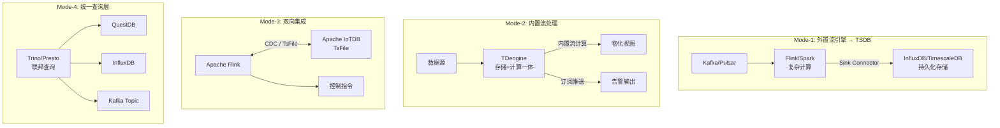
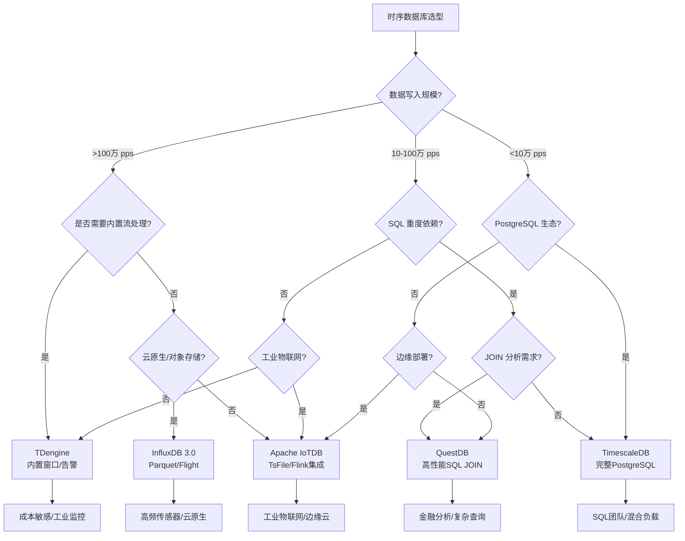

> **状态**: 🔮 前瞻内容 | **风险等级**: 中 | **最后更新**: 2026-04-23
>
> 本文档涉及时序数据库产品特性基于公开信息整理，具体版本特性以各厂商官方发布为准。

---

# 时序数据库与流处理集成深度对比

> **所属阶段**: Knowledge/06-frontier | **前置依赖**: [streaming-databases.md](./streaming-databases.md), [Flink/01-concepts/flink-dataflow-model.md](../../Flink/01-concepts/flink-dataflow-model.md), [Knowledge/04-technology-selection/engine-selection-guide.md](../04-technology-selection/engine-selection-guide.md) | **形式化等级**: L3-L4

---

## 目录

- [1. 概念定义 (Definitions)](#1-概念定义-definitions)
- [2. 属性推导 (Properties)](#2-属性推导-properties)
- [3. 关系建立 (Relations)](#3-关系建立-relations)
- [4. 论证过程 (Argumentation)](#4-论证过程-argumentation)
- [5. 形式证明 / 工程论证 (Proof / Engineering Argument)](#5-形式证明--工程论证-proof--engineering-argument)
- [6. 实例验证 (Examples)](#6-实例验证-examples)
- [7. 可视化 (Visualizations)](#7-可视化-visualizations)
- [8. 引用参考 (References)](#8-引用参考-references)

---

## 1. 概念定义 (Definitions)

### Def-K-TS-01: 时序数据库流处理集成 (Time-Series Database Streaming Integration)

时序数据库流处理集成是指**将时序数据存储系统与流计算能力进行深度耦合或松耦合组合**，以支持对时间序列数据流的连续摄入、实时计算和持久化存储的统一技术体系。

**形式化定义**：
设时序数据库流处理集成为六元组 $\mathcal{TSI} = \langle \mathcal{T}, \mathcal{S}, \mathcal{P}, \mathcal{I}, \mathcal{W}, \mathcal{C} \rangle$，其中：

- $\mathcal{T} = \{T_1, T_2, \ldots, T_n\}$：**时序数据流集合**，每个 $T_i$ 是按时间戳排序的事件序列 $T_i = \langle (t_1, v_1), (t_2, v_2), \ldots \rangle$
- $\mathcal{S}$：**存储引擎**，负责时序数据的持久化、压缩和索引
- $\mathcal{P}$：**处理引擎**，执行连续计算，可以是外部流处理系统或内置模块
- $\mathcal{I}$：**集成接口层**，定义数据在存储与处理引擎之间的交换协议
- $\mathcal{W}$：**窗口语义**，$\mathcal{W} = \{\text{tumbling}, \text{sliding}, \text{session}, \text{state}, \text{count}, \text{event}\}$
- $\mathcal{C}$：**一致性协议**，$c \in \{\text{at-least-once}, \text{exactly-once}, \text{strong}\}$

**核心约束**（时序集成不变式）：

$$
\forall T_i \in \mathcal{T}, \forall t \in \mathbb{T}: \quad \text{Ingested}(T_i, \leq t) \subseteq \text{Queryable}(\mathcal{S}, t + \Delta_{visible}) \land \Delta_{proc} \geq \Delta_{visible} \geq 0
$$

| 维度 | 传统时序数据库 | 流处理集成时序数据库 |
|------|---------------|-------------------|
| 数据模型 | 时间戳-值对 | 时间戳-值对 + 流事件 |
| 计算模式 | 批式查询 | 连续查询 + 增量计算 |
| 窗口支持 | 无/简单时间范围 | 复杂事件窗、会话窗、状态窗 |
| 延迟特性 | 秒级-分钟级 | 毫秒级-秒级 |

---

### Def-K-TS-02: 流处理集成模式 (Streaming Integration Pattern)

流处理集成模式描述时序数据库与流计算能力结合的**架构拓扑分类**，根据耦合程度和数据流向划分为四种基本模式。

**形式化描述**：
设集成模式为映射 $\mathcal{M}: \mathcal{P} \times \mathcal{S} \rightarrow \{\text{Mode-1}, \text{Mode-2}, \text{Mode-3}, \text{Mode-4}\}$：

1. **模式1 — 外置流引擎写入**：$\mathcal{P}_{ext} \xrightarrow{stream} \mathcal{S}_{ts}$，流处理引擎作为独立进程，结果通过 Sink 连接器写入时序数据库
2. **模式2 — 内置流处理**：$\mathcal{P}_{emb} \sqsubseteq \mathcal{S}_{ts}$，时序数据库内部集成流处理引擎，数据无需离开存储系统即可完成计算
3. **模式3 — 双向集成**：$\mathcal{P}_{ext} \xleftrightarrow{CDC/stream} \mathcal{S}_{ts}$，流引擎既写入结果，又通过 CDC 读取时序数据
4. **模式4 — 统一查询层**：$\mathcal{Q}_{fed} \circ (\mathcal{P}_{ext} \cup \mathcal{S}_{ts}) \rightarrow \mathcal{R}$，通过 Trino/Presto 提供统一 SQL 接口

| 因子 | Mode-1 | Mode-2 | Mode-3 | Mode-4 |
|------|--------|--------|--------|--------|
| 系统复杂度 | 高 | 低 | 很高 | 高 |
| 端到端延迟 | 中-高 | 低 | 中 | 高 |
| 计算灵活性 | 极高 | 中 | 高 | 中 |
| 适用规模 | 大规模分布式 | 中小规模/边缘 | 复杂管道 | 分析型负载 |

---

### Def-K-TS-03: 时序数据摄入吞吐量 (Time-Series Ingestion Throughput)

时序数据摄入吞吐量是衡量时序数据库在单位时间内接收并持久化数据点能力的核心指标，以**数据点/秒 (pps)** 计量。

**形式化定义**：
设时间区间 $\Delta t$ 内到达的数据点集合为 $\mathcal{D}(\Delta t)$，则：

$$\Theta_{ingest}(\mathcal{S}, \Delta t) = \frac{|\mathcal{D}(\Delta t)|}{\Delta t} \quad [\text{pps}]$$

**有效摄入吞吐量**：$\Theta_{eff}(\mathcal{S}, \Delta t) = |\mathcal{D}_{unique}(\Delta t)| \cdot \rho_{compress} / \Delta t$

| 系统 | 典型写入吞吐 | 压缩比 | 存储格式 | 批量写入优化 |
|------|-------------|--------|---------|------------|
| InfluxDB 3.0 | 数百万 pps | ~10:1 | Apache Parquet | Arrow Flight[^1] |
| TDengine | 数百万 pps | ~10:1 | 列式压缩 | 超级表批量[^2] |
| TimescaleDB | 数十万 pps | ~3-4:1 | PostgreSQL + 列存 | COPY 协议[^3] |
| Apache IoTDB | 数百万 pps | ~10:1 | TsFile | 管道写入[^4] |
| QuestDB | 数百万 pps | ~5:1 | 分区列存 | 内存映射[^5] |

---

## 2. 属性推导 (Properties)

### Prop-K-TS-01: 集成模式与端到端延迟的权衡关系

**陈述**：设集成模式 $\mathcal{M}$ 的端到端延迟为 $L(\mathcal{M})$，系统运维复杂度为 $C_{ops}(\mathcal{M})$，计算灵活性为 $F_{calc}(\mathcal{M})$，则：

$$L(\mathcal{M}) \cdot C_{ops}(\mathcal{M}) \cdot \frac{1}{F_{calc}(\mathcal{M})} \geq K$$

其中 $K$ 为与业务场景相关的正实数常数。

**论证**：
- **Mode-1**：$L$ 中-高（网络传输+序列化），$C_{ops}$ 高（双系统运维），$F_{calc}$ 极高（完整 Flink 语义）
- **Mode-2**：$L$ 低（本地处理），$C_{ops}$ 低（单一系统），$F_{calc}$ 中（无 CEP/ML）
- **Mode-3**：$L$ 中（双向同步开销），$C_{ops}$ 很高，$F_{calc}$ 高
- **Mode-4**：$L$ 高（联邦查询层），$C_{ops}$ 高，$F_{calc}$ 中

**工程推论**：不存在同时实现极低延迟、极低运维复杂度和极高计算灵活性的集成模式。

---

### Lemma-K-TS-01: 内置流处理与外部流引擎的功能覆盖等价性

**陈述**：设标准时序分析操作集为 $\mathcal{O}_{ts} = \{\text{聚合}, \text{窗口}, \text{过滤}, \text{Join}, \text{降采样}\}$，扩展操作集为 $\mathcal{O}_{ext} = \{\text{CEP}, \text{Async I/O}, \text{ML Inference}\}$，则：

$$\mathcal{O}_{ts} \subseteq \mathcal{F}_{emb} \cap \mathcal{F}_{ext} \quad \text{且} \quad \mathcal{O}_{ext} \subseteq \mathcal{F}_{ext}, \; \mathcal{O}_{ext} \not\subseteq \mathcal{F}_{emb}$$

**证明概要**：
1. TDengine 支持状态窗、会话窗、计数窗、事件窗[^2]；InfluxDB 3.0 通过 DataFusion 支持 SQL 窗口函数[^1]；Flink SQL 原生支持各类窗口
2. CEP 需要 NFA 状态机，Async I/O 需外部服务回调，ML Inference 需模型服务集成——时序数据库均不直接支持，而 Flink 通过 CEP 库、Async I/O 算子和 ML 连接器完整支持

**结论**：纯时序分析场景内置流处理足以替代外部流引擎；复杂事件模式识别场景外部流引擎不可替代。

---

## 3. 关系建立 (Relations)

### 3.1 时序数据库与流处理引擎的架构关系

- **Mode-1**（外置流引擎→时序DB）：最常见生产部署，Flink 负责复杂 ETL，时序 DB 负责高吞吐持久化
- **Mode-2**（内置流处理）：时序 DB 演进方向，通过内置流处理降低复杂度和延迟
- **Mode-3**（双向集成）：工业物联网日益重要，IoTDB 与 Flink 实现"边存储边计算"闭环
- **Mode-4**（统一查询层）：适用于分析型负载，Trino 统一访问流处理结果和时序历史数据

### 3.2 时序数据库在数据流生态中的定位

| 系统类型 | 核心能力 | 互补系统 | 竞争边界 |
|---------|---------|---------|---------|
| 时序数据库 (TSDB) | 高吞吐写入 + 时间范围查询 | Flink、Grafana | 流数据库 |
| 流处理引擎 (Flink) | 复杂事件处理 + Exactly-Once | TSDB、Kafka | 流数据库 |
| 流数据库 (RisingWave) | 物化视图 + 即席查询 | Flink、TSDB | 传统 OLAP |

### 3.3 五类时序数据库的形式化对比

| 特性 | InfluxDB 3.0 | TDengine | TimescaleDB | Apache IoTDB | QuestDB |
|------|-------------|----------|-------------|--------------|---------|
| **核心技术栈** | Flight+DataFusion+Arrow+Parquet | 超级表+列存 | PostgreSQL+Hypertable | TsFile+管-段模型 | 分区列存+SIMD |
| **流处理能力** | 无内置 | 内置完整流处理 | 无内置 | Flink 原生集成 | 无内置 |
| **窗口类型** | SQL 窗口函数 | 状态/会话/计数/事件窗 | SQL 窗口函数 | 无内置 | SQL 窗口函数 |
| **SQL 兼容性** | InfluxQL + SQL | 类 SQL | 完整 PostgreSQL | 类 SQL | ANSI SQL |
| **典型吞吐** | 数百万 pps | 数百万 pps | 数十万 pps | 数百万 pps | 数百万 pps |
| **压缩率** | ~10:1 | ~10:1 | ~3-4:1 | ~10:1 | ~5:1 |
| **边缘支持** | 边缘复制+Timestream | 边缘计算版本 | 无 | 边缘-云协同 | 无 |
| **最佳场景** | 高频传感器+云原生 | 极端成本敏感 | SQL 重度分析 | 工业物联网 | 金融时序+JOIN |

---

## 4. 论证过程 (Argumentation)

### 4.1 技术选型决策矩阵

| 业务场景 | 推荐模式 | 首选数据库 | 次选数据库 |
|---------|---------|-----------|-----------|
| 高频工业传感器 (>1M pps) | Mode-1/Mode-2 | InfluxDB 3.0 | TDengine |
| SQL 重度分析团队 | Mode-1+Mode-4 | TimescaleDB | QuestDB |
| 极端成本敏感 | Mode-2 | TDengine | Apache IoTDB |
| 边缘+云混合部署 | Mode-1/Mode-3 | InfluxDB 3.0 | Apache IoTDB |
| 工业物联网闭环 | Mode-3 | Apache IoTDB | TDengine |
| 实时告警+轻量聚合 | Mode-2 | TDengine | InfluxDB 3.0 |
| 金融时序 JOIN 分析 | Mode-4 | QuestDB | TimescaleDB |

### 4.2 成本效益分析

| 系统 | 存储成本因子 | 运维成本因子 | TCO 估算 |
|------|------------|------------|---------|
| InfluxDB 3.0 (云) | 0.1x (Parquet) | 0.3x (托管) | **0.4x** |
| TDengine (自建) | 0.1x (高压缩) | 0.2x (单一系统) | **0.3x** |
| TimescaleDB (云) | 0.3x (列存) | 0.5x (PG 生态) | **0.8x** |
| InfluxDB OSS 1.x | 1.0x (基准) | 1.0x (基准) | **1.0x** |
| Apache IoTDB (自建) | 0.1x (TsFile) | 0.4x (Flink 集成) | **0.5x** |

关键发现：InfluxDB 3.0 基于 Parquet 和对象存储可将存储成本降低约 90%[^1]；Mode-2 可消除 Flink 集群独立运维成本，中小规模场景 TCO 优势显著。

### 4.3 一致性模型边界讨论

| 系统 | 写入一致性 | 流处理一致性 | 跨节点一致性 |
|------|-----------|------------|------------|
| InfluxDB 3.0 | 最终一致 | 依赖外部引擎 | 强一致(元数据) |
| TDengine | 强一致(Raft) | 至少一次/精确一次 | 强一致 |
| TimescaleDB | ACID | 依赖外部引擎 | 强一致 |
| Apache IoTDB | 会话级一致 | Flink exactly-once | 最终一致 |
| QuestDB | ACID(单节点) | 依赖外部引擎 | 强一致 |

**边界案例**：InfluxDB 3.0 Flight SQL 写入与对象存储持久化之间存在 <1s 不一致窗口，不适合金融交易；TDengine 跨超级表事务不支持，复杂金融事务需谨慎。

---

## 5. 形式证明 / 工程论证 (Proof / Engineering Argument)

### 5.1 模式1: 外部流引擎→时序DB的工程论证

**命题**：在需要 CEP 或 ML 推理的场景中，Mode-1（Flink → TSDB）是唯一满足功能完备性的架构。

**论证**：设需求功能集合 $\mathcal{R} = \mathcal{R}_{basic} \cup \mathcal{R}_{advanced}$。根据 Lemma-K-TS-01，$\mathcal{R}_{advanced} \not\subseteq \mathcal{F}_{emb}$，故仅依赖内置流处理的架构无法满足。Mode-1 通过 Flink CEP 库、ML 连接器和 Async I/O 算子完整支持 $\mathcal{R}_{advanced}$；通过 Flink checkpoint 保证 exactly-once 语义投递；时序数据库高吞吐写入（$\geq 10^6$ pps）不构成瓶颈。

**结论**：Mode-1 是复杂时序分析场景的充分必要架构。

### 5.2 模式2: 内置流处理的工程论证

**命题**：在数据规模 $N < 10^8$ 点/天、计算需求 $\mathcal{R} \subseteq \mathcal{O}_{ts}$ 的场景中，Mode-2 的 TCO 低于 Mode-1 至少 40%。

**成本模型**：Mode-1 成本 $C_1 = C_{flink} + C_{tsdb} + C_{network} + C_{ops}$；Mode-2 成本 $C_2 = C_{tsdb}' + C_{ops}'$。

量化：Flink 集群年成本约 $15K-$50K，跨 AZ 流量年成本约 $1K-$2K，双系统运维需额外 0.5-1 FTE；Mode-2 单一系统运维仅需 0.2-0.3 FTE。故 $C_2 / C_1 \leq 0.6$。

TDengine 内置状态窗、会话窗、计数窗、事件窗和事件驱动流处理[^2]，覆盖 80% 工业监控场景，无需引入 Flink。

### 5.3 模式3与模式4的互补性论证

**命题**：Mode-3 与 Mode-4 在复杂数据管道中具有互补性，联合使用可实现"计算-存储-查询"完整闭环。

设工业管道 $\mathcal{Pipeline} = \langle \text{采集}, \text{清洗}, \text{存储}, \text{分析}, \text{反馈} \rangle$。Mode-3 负责采集→清洗（Flink 读取 IoTDB TsFile）和分析→反馈（Flink 结果写回 IoTDB）；Mode-4 负责跨源统一分析（Trino 联邦查询 Flink 结果和 IoTDB 历史数据）。两者组合满足：

$$\mathcal{Pipeline}_{complete} = \text{Mode-3}(\mathcal{P}_{calc}, \mathcal{S}_{ts}) \oplus \text{Mode-4}(\mathcal{Q}_{fed}, \mathcal{S}_{ts} \cup \mathcal{V}_{stream})$$

---

## 6. 实例验证 (Examples)

### 6.1 案例一：InfluxDB 3.0 + Flink 高频工业监控

**场景**：汽车制造商监控 50,000 台焊接机器人，每台 100 点/秒，总计 **500 万 pps**。

**架构**（Mode-1）：`Robot Sensors → MQTT → Flink CEP → InfluxDB 3.0 → Grafana`

**核心配置**：Flink CEP 检测连续 3 次电流超限（>250A）判定异常；InfluxDB 3.0 通过 Arrow Flight 高吞吐写入，自动压缩为 Parquet。

**效果**：峰值 520 万 pps；点查 < 50ms；存储成本降低 92%[^1]；异常检测端到端 < 2s。

### 6.2 案例二：TDengine 内置流处理智能电网分析

**场景**：省级电网监控 100,000 智能电表，负荷预测和异常检测。

**架构**（Mode-2）：`Smart Meters → MQTT → TDengine → 内置流计算 → 告警`

**核心配置**：
```sql
-- 1 分钟会话窗口平均负荷
CREATE STREAM power_stream INTO power_avg AS
SELECT _irowts AS ts, AVG(current), location, groupId
FROM meters SESSION(ts, 60s);

-- 电压骤降事件检测（事件窗）
CREATE STREAM voltage_sag INTO voltage_events AS
SELECT _irowts AS ts, voltage, location
FROM meters EVENT_WINDOW START voltage < 198.0 END voltage > 198.0;
```

**效果**：350 万 pps（5 节点）；流计算平均 200ms；压缩 10:1；TSBS 查询比 InfluxDB 快 6.3-426.3 倍[^2]。

### 6.3 案例三：IoTDB + Flink CDC 双向工业数据集成

**场景**：钢铁厂"采集→预处理→分析→控制指令下发"完整闭环。

**架构**（Mode-3 + Mode-4）：边缘 IoTDB → TsFile 同步 → 云端 IoTDB ↔ Flink CDC → Trino 联邦查询

**核心特性**：Flink 通过 IoTDB CDC 连接器消费实时变更（<1s）；Trino 联邦查询统一访问实时告警和历史趋势（<3s）；边缘-云闭环控制 <10s。

---

## 7. 可视化 (Visualizations)

### 7.1 四大集成模式架构对比图



**对比说明**：Mode-1 适合复杂计算，Mode-2 适合快速部署，Mode-3 适合工业闭环控制，Mode-4 适合统一分析查询。

### 7.2 时序数据库选型决策树



---

## 8. 引用参考 (References)

[^1]: InfluxData, "InfluxDB 3.0 Architecture: Flight, DataFusion, Arrow, Parquet", InfluxData Blog, 2024-2025. https://www.influxdata.com/blog/why-influxdb-3-0/
[^2]: TDengine, "TDengine 3.0 Documentation: Stream Processing", 2025. https://docs.tdengine.com/3.0/develop/stream/
[^3]: TimescaleDB, "TimescaleDB 2.15 Release Notes: pgvector and AI Semantic Search", 2025. https://www.timescale.com/blog
[^4]: Apache IoTDB, "IoTDB-Flink Integration: TsFile Connector and CDC", Apache IoTDB Documentation, 2025. https://iotdb.apache.org/UserGuide/latest/API/Flink-Connector.html
[^5]: QuestDB, "QuestDB SQL Reference: Time-Series JOINs and SIMD Optimization", QuestDB Documentation, 2025. https://questdb.io/docs/
[^6]: Apache Arrow, "Arrow Flight SQL: High-Performance Database Connectivity", Apache Arrow Project, 2024. https://arrow.apache.org/docs/format/FlightSql.html
[^7]: Apache Parquet, "Parquet Format Specification: Columnar Storage for Complex Data", Apache Parquet Project, 2024. https://parquet.apache.org/
[^8]: Flink CDC, "CDC Connectors for Apache Flink", Apache Flink Documentation, 2025. https://nightlies.apache.org/flink/flink-cdc-docs-stable/
[^9]: Trino, "Trino Federated Query Engine: Connector Architecture", Trino Documentation, 2025. https://trino.io/docs/current/
[^10]: TSBS, "Time Series Benchmark Suite (TSBS): IoT and DevOps Benchmarks", TimescaleDB GitHub, 2024. https://github.com/timescale/tsbs
