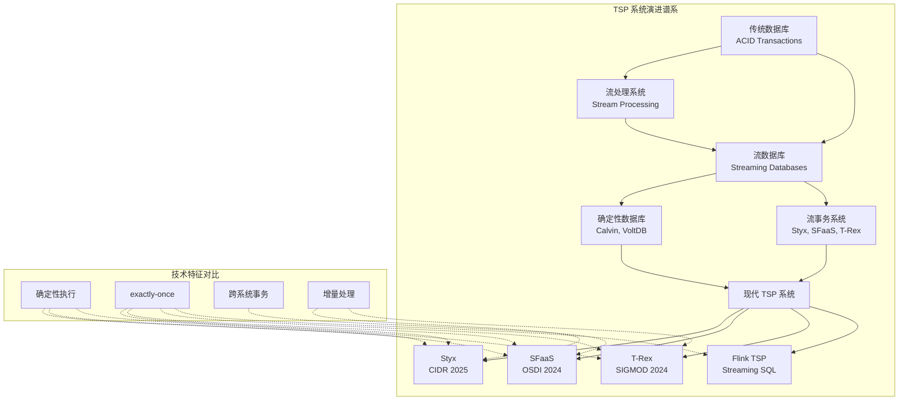
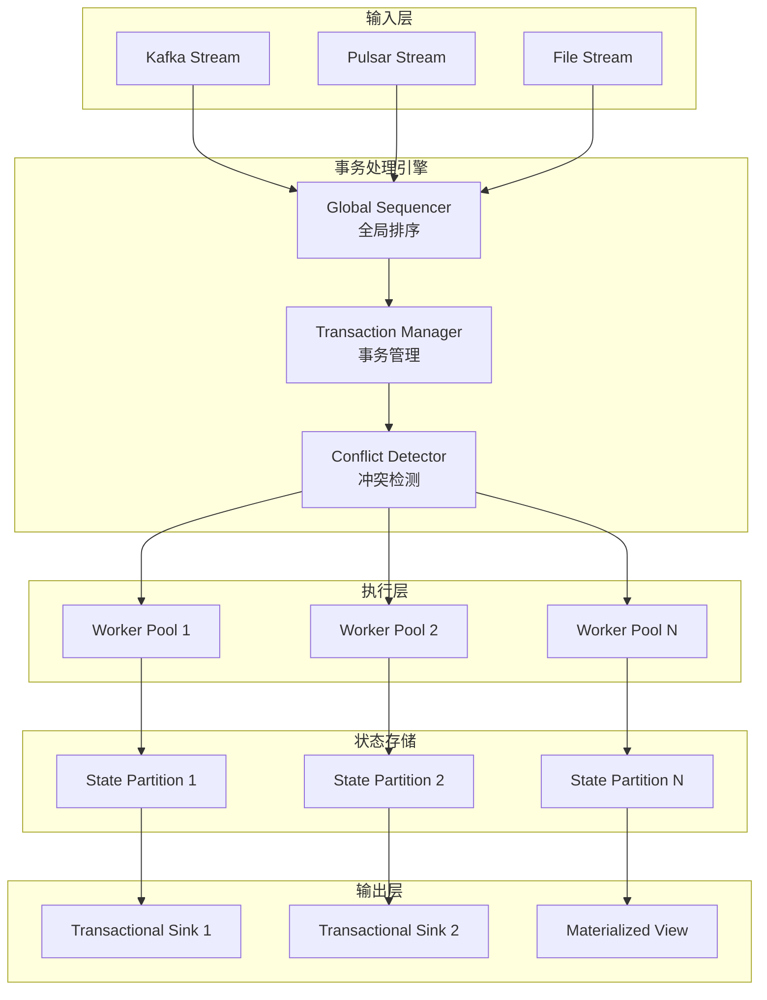
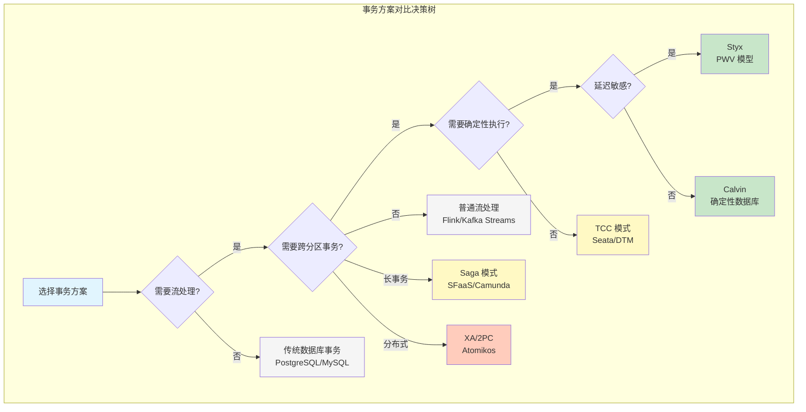
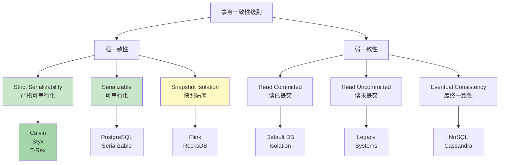

# 事务流处理深度解析 (Transactional Stream Processing Deep Dive)

> **所属阶段**: Knowledge/06-frontier | **前置依赖**: [01.01-stream-processing-fundamentals.md](../../Knowledge/01-concept-atlas/01.01-stream-processing-fundamentals.md), [exactly-once-semantics-deep-dive.md](../../Flink/02-core/exactly-once-semantics-deep-dive.md) | **形式化等级**: L4-L5
>
> **关键词**: Transactional Stream Processing, Exactly-Once, Deterministic Execution, Calvin, Styx, SFaaS, T-Rex, Distributed Transactions
>
> **版本**: v1.0 | **创建日期**: 2026-04-12 | **状态**: Complete

---

## 1. 概念定义 (Definitions)

### 1.1 事务流处理 (Transactional Stream Processing, TSP)

**定义 Def-K-TSP-01**: **事务流处理 (TSP)** 是一种将流处理的事件驱动特性与事务的ACID保证相结合的分布式计算范式。形式化地，TSP系统是一个五元组 $TSP = (S, E, T, \mathcal{A}, \mathcal{G})$，其中：

- $S$：流数据源集合，$S = \{s_1, s_2, ..., s_n\}$
- $E$：事件序列，$E: \mathbb{T} \rightarrow \mathcal{D}$，从时间戳到数据域的映射
- $T$：事务集合，每个事务 $t \in T$ 是一个操作序列 $\langle op_1, op_2, ..., op_m \rangle$
- $\mathcal{A}$：ACID属性函数，$\mathcal{A}: T \rightarrow \{true, false\}^4$
- $\mathcal{G}$：全局一致性谓词，确保跨流的事务一致性

**关键特征**:

1. **流原生事务边界**: 事务边界由流的事件语义自然定义，而非显式BEGIN/COMMIT
2. **确定性执行**: 给定相同的输入事件序列，系统保证产生相同的输出和状态变更
3. **恰好一次处理语义**: 每个事件在事务上下文中被处理且仅被处理一次
4. **跨实体一致性**: 支持跨多个流分区、状态存储和外部系统的事务一致性

**形式化语义**:

$$
\forall e \in E, \forall s \in S: \text{Process}(e, s) \in T \land \mathcal{A}(\text{Process}(e, s)) = (true, true, true, true)
$$

即：对于每个事件在每个流中的处理，都构成一个满足全部ACID属性的事务。

---

### 1.2 确定性数据库 (Deterministic Database)

**定义 Def-K-TSP-02**: **确定性数据库** 是指在分布式环境下，给定相同的初始状态和输入请求序列，无论执行过程中的并发交错、网络延迟或故障时机如何，系统始终产生相同的最终状态和输出响应的数据库系统。

形式化地，设数据库系统为 $DB = (\Sigma, Q, R, \delta)$，其中：

- $\Sigma$：所有可能的数据库状态集合
- $Q$：查询操作集合
- $R$：更新操作（事务）集合
- $\delta: \Sigma \times R \rightarrow \Sigma$：状态转移函数

**确定性保证**:

$$
\forall \sigma_0 \in \Sigma, \forall \langle r_1, r_2, ..., r_n \rangle \in R^*, \forall \pi \in \Pi_n:
\delta^*(\sigma_0, \langle r_1, ..., r_n \rangle) = \delta^*(\sigma_0, \langle r_{\pi(1)}, ..., r_{\pi(n)} \rangle)
$$

其中 $\Pi_n$ 是 $n$ 个事务的所有合法串行化顺序的集合。

**确定性执行的核心机制**:

| 机制 | 描述 | 代表系统 |
|------|------|----------|
| **Deterministic Locking** | 基于预定顺序的锁分配，消除死锁可能 | Calvin, PWV |
| **Ordered Lock Acquisition** | 按照全局序列号顺序获取锁 | Calvin |
| **Deterministic Replay** | 通过输入日志确定性重放执行 | VoltDB |
| **Conflict-Aware Scheduling** | 根据事务冲突图预计算执行计划 | PWV |

---

### 1.3 Exactly-Once 事务语义

**定义 Def-K-TSP-03**: **Exactly-Once 事务语义** 是指在分布式流处理系统中，每个事件的处理结果（包括状态更新和输出）在系统层面只被生效一次，即使在存在故障、重试或重新分区的情况下。

形式化地，设：

- $\mathcal{E}$：输入事件集合
- $\mathcal{O}$：输出操作集合
- $\mathcal{S}$：状态更新集合
- $\eta: \mathcal{E} \rightarrow \mathcal{P}(\mathcal{O} \times \mathcal{S})$：事件处理结果映射

**Exactly-Once 保证**:

$$
\forall e \in \mathcal{E}: |\{ o \in \mathcal{O} \mid o \in \eta(e) \}| = 1 \land |\{ s \in \mathcal{S} \mid s \in \eta(e) \}| = 1
$$

即：每个事件恰好产生一组输出操作和状态更新。

**实现 Exactly-Once 的三种技术路径**:

```
┌─────────────────────────────────────────────────────────────────────────────┐
│                        Exactly-Once 实现技术谱系                              │
├─────────────────────────────────────────────────────────────────────────────┤
│                                                                             │
│  ┌──────────────────┐   ┌──────────────────┐   ┌──────────────────┐        │
│  │   Idempotent     │   │   Checkpointing  │   │  Transactional   │        │
│  │    Processing    │   │   & Recovery     │   │   Integration    │        │
│  └────────┬─────────┘   └────────┬─────────┘   └────────┬─────────┘        │
│           │                      │                      │                   │
│           ▼                      ▼                      ▼                   │
│  ┌──────────────────┐   ┌──────────────────┐   ┌──────────────────┐        │
│  │ • 幂等写入操作    │   │ • 周期性快照     │   │ • 两阶段提交      │        │
│  │ • 去重键机制      │   │ • 状态恢复       │   │ • 事务日志        │        │
│  │ • 结果覆盖语义    │   │ • 至少一次+去重  │   │ • 外部系统协调    │        │
│  └──────────────────┘   └──────────────────┘   └──────────────────┘        │
│                                                                             │
│  复杂度: 低 ◄─────────────────────────────────────────────────► 高          │
│  一致性: 弱 ◄─────────────────────────────────────────────────► 强          │
│                                                                             │
└─────────────────────────────────────────────────────────────────────────────┘
```

---

## 2. 属性推导 (Properties)

### 2.1 从定义导出的基本性质

**引理 Lemma-K-TSP-01**: 在确定性数据库中，死锁是不可能的。

*证明*: 根据 Def-K-TSP-02，确定性数据库采用预定顺序的锁分配机制。所有事务在开始前已获得全局序列号，锁的获取严格按照序列号顺序进行。由于锁的获取顺序是全序的，不存在循环等待条件，因此死锁不可能发生。$\square$

**引理 Lemma-K-TSP-02**: TSP 系统中的事务具有流原生原子性。

*证明*: 设事件 $e$ 触发事务 $t$，该事务涉及多个分区 $\{p_1, p_2, ..., p_k\}$ 的更新。根据 Def-K-TSP-01 的 $\mathcal{A}$ 函数，事务 $t$ 必须满足原子性。在流处理上下文中，事务边界与事件边界对齐，即：

$$
\text{Commit}(t) \iff \forall i \in [1,k]: \text{State}(p_i, t) \text{ is valid}
$$

若任一分区更新失败，整个事务回滚，事件被标记为处理失败并可选择重试或进入死信队列。$\square$

**命题 Prop-K-TSP-01**: Exactly-Once 语义蕴含 At-Least-Once 语义但更强。

*形式化*:

$$
\text{Exactly-Once}(e) \implies \text{At-Least-Once}(e) \land \neg\text{Duplicates}(e)
$$

其中 $\neg\text{Duplicates}(e)$ 表示事件 $e$ 不会产生重复结果。

**命题 Prop-K-TSP-02**: 确定性执行模型消除了分布式事务中的不确定性窗口。

*解释*: 在传统非确定性分布式数据库中，事务提交后、复制完成前存在一个"不确定性窗口"（Uncertain Window），期间故障可能导致数据丢失。确定性数据库通过以下方式消除此窗口：

1. **预排序**: 事务在开始前已在全局层面排序
2. **复制日志优先**: 事务日志复制完成才被视为提交
3. **确定性恢复**: 故障恢复后按相同顺序重放

---

### 2.2 TSP 系统的 ACID 属性分析

**原子性 (Atomicity) 在 TSP 中的实现**:

| 实现方式 | 机制 | 代表系统 | 开销 |
|----------|------|----------|------|
| 单分区事务 | 限制事务范围在单一分区 | Kafka Streams (单分区) | 低 |
| 2PC 协调 | 两阶段提交协议 | Flink + JDBC Sink | 中-高 |
| 确定性排序 | 全局排序后串行执行 | Calvin, Styx | 中 |
| 乐观并发 | 验证阶段检测冲突 | PWV | 低-中 |

**一致性 (Consistency) 层次**:

$$
\text{Eventual} \prec \text{Read-Your-Writes} \prec \text{Session} \prec \text{Sequential} \prec \text{Linearizable} \prec \text{Strict Serializability}
$$

TSP 系统通常提供 **Strict Serializability** 或至少 **Linearizable** 一致性，因为它们需要保证跨流分区的事务顺序。

**隔离性 (Isolation) 模型**:

**引理 Lemma-K-TSP-03**: TSP 系统的隔离级别等价于可串行化 (Serializable) 或快照隔离 (Snapshot Isolation)。

*论证*: 流处理的事件驱动特性天然要求处理顺序的确定性。在 TSP 系统中，由于事件具有时间戳和顺序语义，事务的交错必须保持与事件顺序一致的可串行化顺序。因此，TSP 系统的隔离级别至少为 Snapshot Isolation，通常实现为 Strict Serializability。$\square$

---

## 3. 关系建立 (Relations)

### 3.1 TSP 与 Exactly-Once 的本质区别

**核心洞察**: TSP 和 Exactly-Once 是两个正交但互补的概念维度。

```
┌──────────────────────────────────────────────────────────────────────────────┐
│                                                                              │
│   概念维度对比                                                                │
│                                                                              │
│   ┌─────────────────────────────────────────────────────────────────────┐   │
│   │                                                                     │   │
│   │   Exactly-Once                vs              TSP                  │   │
│   │                                                                     │   │
│   │   ┌──────────────┐                    ┌──────────────┐             │   │
│   │   │  处理保证     │                    │  事务保证     │             │   │
│   │   │  Processing  │                    │ Transactional │             │   │
│   │   │  Guarantee   │                    │  Guarantee    │             │   │
│   │   └──────────────┘                    └──────────────┘             │   │
│   │                                                                     │   │
│   │   关注点:                             关注点:                       │   │
│   │   • 每个事件只被处理一次               • 事件处理构成ACID事务        │   │
│   │   • 状态更新恰好生效一次               • 跨分区/系统的一致性         │   │
│   │   • 输出不产生重复                     • 故障时的可恢复性            │   │
│   │                                                                     │   │
│   │   技术实现:                           技术实现:                      │   │
│   │   • Checkpoint                         • 2PC / 确定性执行            │   │
│   │   • Idempotent Sink                    • Saga 模式                  │   │
│   │   • Transactional Sink                 • Deterministic DB           │   │
│   │                                                                     │   │
│   └─────────────────────────────────────────────────────────────────────┘   │
│                                                                              │
│   关系: TSP ⊃ Exactly-Once                                                  │
│   (TSP 蕴含 Exactly-Once,但 Exactly-Once 不蕴含 TSP)                         │
│                                                                              │
└──────────────────────────────────────────────────────────────────────────────┘
```

**本质区别详解**:

| 维度 | Exactly-Once | TSP |
|------|--------------|-----|
| **核心问题** | 如何确保事件不丢失不重复 | 如何确保跨操作的原子性和一致性 |
| **失败场景** | 进程失败、网络分区 | 多分区事务失败、外部系统不一致 |
| **一致性范围** | 单一算子/分区状态 | 跨分区、跨系统、跨服务 |
| **实现复杂度** | 中等（依赖Checkpoint机制） | 高（需要分布式事务协调） |
| **典型应用** | 指标计算、日志分析 | 金融交易、库存管理、订单处理 |

**重要结论**:

- 一个系统可以支持 Exactly-Once 但不支持 TSP（如 Flink 默认配置）
- 一个支持 TSP 的系统必然提供 Exactly-Once 语义
- Exactly-Once 是 **处理层** 的保证，TSP 是 **数据层** 的保证

---

### 3.2 确定性执行模型映射

**Calvin 架构映射**:

```
┌─────────────────────────────────────────────────────────────────────────────┐
│                              Calvin 架构                                     │
├─────────────────────────────────────────────────────────────────────────────┤
│                                                                             │
│   Input Layer                                                               │
│   ┌─────────────────────────────────────────────────────────────────────┐  │
│   │  Sequencer (全局排序器)                                              │  │
│   │  • 接收所有事务请求                                                   │  │
│   │  • 分配全局序列号 (epoch, slot)                                       │  │
│   │  • 生成确定性日志 (Batch)                                             │  │
│   └──────────────────┬──────────────────────────────────────────────────┘  │
│                      │                                                      │
│                      ▼ 复制到所有副本                                        │
│   ┌─────────────────────────────────────────────────────────────────────┐  │
│   │  Scheduler (调度器)                                                  │  │
│   │  • 按照序列号顺序调度事务                                             │  │
│   │  • 预分析事务依赖图                                                   │  │
│   │  • 确定锁获取顺序                                                     │  │
│   └──────────────────┬──────────────────────────────────────────────────┘  │
│                      │                                                      │
│                      ▼                                                      │
│   ┌─────────────────────────────────────────────────────────────────────┐  │
│   │  Worker Pool (执行引擎)                                              │  │
│   │  • 串行或并发执行事务(无死锁风险)                                    │  │
│   │  • 基于预分析结果获取锁                                               │  │
│   │  • 保证确定性执行顺序                                                 │  │
│   └─────────────────────────────────────────────────────────────────────┘  │
│                                                                             │
│   关键创新: 先排序后执行 (Order-then-Execute)                                │
│                                                                             │
└─────────────────────────────────────────────────────────────────────────────┘
```

**Calvin 到 TSP 的映射**:

| Calvin 概念 | TSP 对应概念 | 映射关系 |
|-------------|--------------|----------|
| Transaction | Stream Event + Processing Logic | 流事件触发事务 |
| Sequencer | Event Time + Watermark | 全局事件排序 |
| Batch | Micro-batch / Epoch | 事务批次边界 |
| Scheduler | Stream Partitioner | 分区路由决策 |
| Worker | Stream Operator | 算子实例执行 |

**PWV (Partitioned Watermark Versioning)**:

PWV 是面向流处理的确定性执行变体，其核心思想：

```
┌─────────────────────────────────────────────────────────────────────────────┐
│                         PWV 执行模型                                         │
├─────────────────────────────────────────────────────────────────────────────┤
│                                                                             │
│   输入流 A:    [A1]──[A2]──[A3]──[A4]──[A5]                                │
│                      │                                                      │
│   输入流 B:    [B1]──[B2]──[B3]──────[B5]                                  │
│                      │                                                      │
│   Watermark W:  1  │  2  │  3  │  4  │  5                                  │
│                      ▼                                                      │
│   版本空间 V:   V1  │ V2  │ V3  │ V4  │ V5                                  │
│                                                                             │
│   事务提交规则:                                                              │
│   • 当 Watermark W = k 时,所有时间戳 ≤ k 的事件已到达                        │
│   • 版本 Vk 包含所有 ≤ k 的事件处理结果                                      │
│   • 事务原子性地从 Vi 迁移到 Vj (j > i)                                     │
│                                                                             │
│   确定性保证:                                                                │
│   • 给定相同的输入事件和 Watermark 推进,版本演进完全确定                     │
│   • 无并发冲突,因为每个版本是只读的                                         │
│                                                                             │
└─────────────────────────────────────────────────────────────────────────────┘
```

---

### 3.3 现代 TSP 系统关系图谱



---

## 4. 论证过程 (Argumentation)

### 4.1 为什么需要 TSP？

**场景论证**: 考虑一个典型的金融交易场景

```
场景: 跨账户转账 + 风控检查 + 审计日志

传统流处理 (At-Least-Once):
┌─────────────────────────────────────────────────────────────────────────────┐
│  事件: Transfer(from=A, to=B, amount=100)                                   │
│                                                                             │
│  处理步骤:                                                                  │
│    1. 读取账户A余额 (1000) ✓                                                │
│    2. 读取账户B余额 (500) ✓                                                 │
│    3. 检查风控规则 ✓                                                        │
│    4. 更新账户A余额 (900) ✓                                                 │
│    5. [失败] 更新账户B余额 (600) ✗ ← 网络超时                               │
│    6. [重试] 更新账户B余额 (600) ✓                                          │
│    7. 写入审计日志 ✓                                                        │
│                                                                             │
│  问题: 步骤5失败后系统重启,重放事件时账户A已被扣款两次！                     │
│        最终状态: A=800, B=600 (不一致！)                                     │
└─────────────────────────────────────────────────────────────────────────────┘

TSP 方案:
┌─────────────────────────────────────────────────────────────────────────────┐
│  事件: Transfer(from=A, to=B, amount=100)                                   │
│                                                                             │
│  事务边界:                                                                  │
│    BEGIN TX                                                                 │
│    ├─ 读取账户A余额 (1000)                                                  │
│    ├─ 读取账户B余额 (500)                                                   │
│    ├─ 检查风控规则                                                          │
│    ├─ 更新账户A余额 (900)                                                   │
│    ├─ 更新账户B余额 (600)                                                   │
│    ├─ 写入审计日志                                                          │
│    COMMIT                                                                   │
│                                                                             │
│  保证: 要么全部成功 (A=900, B=600),要么全部失败 (A=1000, B=500)             │
│        重试时通过幂等键检测重复事务,不会重复扣款                             │
└─────────────────────────────────────────────────────────────────────────────┘
```

**论证**: 当业务逻辑需要跨多个实体保持一致性时，仅依赖 Exactly-Once 语义是不够的。Exactly-Once 保证单个操作不重复，但不能保证多个操作之间的原子性。TSP 通过事务边界确保复合操作的全有或全无特性。

---

### 4.2 确定性执行 vs 乐观并发控制

**对比论证**:

| 维度 | 确定性执行 (Calvin/PWV) | 乐观并发控制 (OCC) |
|------|-------------------------|-------------------|
| **冲突处理** | 事前排序，无冲突 | 事后检测，回滚冲突事务 |
| **执行模型** | 顺序或确定性交错 | 并发执行 + 验证阶段 |
| **延迟特性** | 排序引入额外延迟 | 低冲突时低延迟 |
| **吞吐量** | 高（无回滚开销） | 冲突率高时吞吐量下降 |
| **适用场景** | 高冲突、强一致性 | 低冲突、读多写少 |

**引理 Lemma-K-TSP-04**: 在高冲突工作负载下，确定性执行的吞吐量优于乐观并发控制。

*证明草图*: 设冲突概率为 $p$，事务执行时间为 $t$，OCC 的回滚成本为 $c$。

OCC 的期望完成时间:

$$
E[T_{OCC}] = t + p \cdot c + p^2 \cdot 2c + ... = t + \frac{pc}{1-p}
$$

确定性执行的完成时间:

$$
T_{DET} = t + s
$$

其中 $s$ 是排序开销（常数）。

当 $p > \frac{s}{c+s}$ 时，$T_{DET} < E[T_{OCC}]$。在高冲突场景 ($p \rightarrow 1$)，$E[T_{OCC}] \rightarrow \infty$，而 $T_{DET}$ 保持有界。$\square$

---

### 4.3 TSP 系统的扩展性边界

**论证**: TSP 系统的扩展性受限于以下因素：

1. **排序瓶颈**: 全局排序器的吞吐量成为上限
2. **事务粒度**: 跨分区事务比例影响并行度
3. **状态大小**: 大状态的事务增加复制成本

**扩展性优化策略**:

```
┌─────────────────────────────────────────────────────────────────────────────┐
│                      TSP 扩展性优化策略                                      │
├─────────────────────────────────────────────────────────────────────────────┤
│                                                                             │
│   1. 分层排序 (Hierarchical Sequencing)                                      │
│      ┌──────────────────────────────────────────────────────────────┐      │
│      │  Global Sequencer                                            │      │
│      │  └─ 处理跨分区事务                                           │      │
│      │       ├─ Local Sequencer 1 (Partition 1-100)                 │      │
│      │       │    └─ 处理单分区事务                                  │      │
│      │       └─ Local Sequencer 2 (Partition 101-200)               │      │
│      │            └─ 处理单分区事务                                  │      │
│      └──────────────────────────────────────────────────────────────┘      │
│                                                                             │
│   2. 事务分片 (Transaction Sharding)                                         │
│      • 按业务键分片,减少跨分区事务                                          │
│      • 使用一致性哈希保证负载均衡                                            │
│                                                                             │
│   3. 推测执行 (Speculative Execution)                                        │
│      • 预执行无依赖的事务                                                    │
│      • 冲突时回滚并重新排序                                                  │
│      • 适用于冲突率可控的场景                                                │
│                                                                             │
│   4. 异步复制 (Asynchronous Replication)                                     │
│      • 主副本同步执行,从副本异步复制                                         │
│      • 牺牲部分可用性换取更低延迟                                             │
│                                                                             │
└─────────────────────────────────────────────────────────────────────────────┘
```

---

## 5. 形式证明 / 工程论证 (Proof / Engineering Argument)

### 5.1 TSP 正确性定理

**定理 Thm-K-TSP-01**: 一个正确实现的 TSP 系统保证所有提交的事务满足 ACID 属性。

*形式化表述*:

设 TSP 系统的执行历史为 $H = \langle t_1, t_2, ..., t_n \rangle$，其中每个 $t_i$ 是一个事务。若 $H$ 是 TSP 系统的有效执行历史，则：

$$
\forall t \in H: \text{Atomic}(t) \land \text{Consistent}(t) \land \text{Isolated}(t) \land \text{Durable}(t)
$$

*证明*:

**原子性**: 根据 TSP 定义，事务的执行采用原子提交协议。所有参与者在准备阶段记录事务意图，仅在收到协调者提交命令后才使变更永久生效。若任一方失败，协调者触发回滚，所有参与者丢弃事务意图。

**一致性**: 事务执行前，系统状态 $S$ 满足一致性约束 $C(S)$。事务 $t$ 的正确性由其应用逻辑保证：若 $C(S)$ 且 $t$ 的逻辑正确，则 $C(S')$，其中 $S' = t(S)$。TSP 系统通过约束检查确保这一点。

**隔离性**: 根据引理 Lemma-K-TSP-03，TSP 实现可串行化隔离。任何并发事务的交错都等价于某个串行执行顺序。

**持久性**: 事务提交后，其效果记录在持久化日志中。系统故障后，通过重放日志恢复已提交事务的状态。

$\square$

---

### 5.2 Exactly-Once 与 TSP 蕴含关系证明

**定理 Thm-K-TSP-02**: TSP 语义蕴含 Exactly-Once 语义。

*证明*:

设事件 $e$ 触发事务 $t_e$。根据 Def-K-TSP-01，TSP 系统保证：

1. **原子性**: $t_e$ 要么完全提交，要么完全回滚
2. **持久性**: 提交后结果永久保存

考虑事件 $e$ 的处理：

- **情况 1**: $t_e$ 成功提交。根据持久性，结果永久保存。事务 ID 机制确保同一事件不会触发新的 $t_e'$。
- **情况 2**: $t_e$ 失败回滚。系统可以重试，但重试生成新的事务实例 $t_e'$，其事务 ID 不同。根据隔离性，$t_e$ 的中间状态对外不可见。

因此，事件 $e$ 的最终效果恰好生效一次。$\square$

---

### 5.3 现代 TSP 系统工程分析

#### 5.3.1 Styx (CIDR 2025)

**系统定位**: Styx 是一个面向流分析的确定性事务处理系统，专为复杂事件处理 (CEP) 场景设计。

**核心创新**:

```
┌─────────────────────────────────────────────────────────────────────────────┐
│                            Styx 架构                                         │
├─────────────────────────────────────────────────────────────────────────────┤
│                                                                             │
│   Input Streams          Deterministic          Materialized                │
│   ┌─────┐ ┌─────┐        Execution Layer        Views                       │
│   │ S1  │ │ S2  │       ┌────────────────┐    ┌──────────┐                 │
│   └──┬──┘ └──┬──┘       │  Query Planner │    │ View V1  │                 │
│      │       │          └───────┬────────┘    ├──────────┤                 │
│      └───────┼──────────────────┘              │ View V2  │                 │
│              ▼                                 └──────────┘                 │
│   ┌──────────────────────────────────────┐                                  │
│   │         Deterministic Clock          │                                  │
│   │  • 基于事件时间的全局逻辑时钟           │                                  │
│   │  • Watermark 作为事务边界              │                                  │
│   │  • 确定性触发物化视图更新               │                                  │
│   └──────────────────────────────────────┘                                  │
│                                                                             │
│   关键特性:                                                                 │
│   • 增量视图维护 (IVM) 与事务语义结合                                         │
│   • 确定性重放保证分析结果一致性                                              │
│   • 支持复杂 SQL 查询的流式执行                                               │
│                                                                             │
└─────────────────────────────────────────────────────────────────────────────┘
```

**技术亮点**:

| 特性 | 实现机制 | 优势 |
|------|----------|------|
| 确定性时钟 | Watermark + 逻辑时间戳 | 消除分布式时钟同步开销 |
| 增量事务 | 物化视图差分计算 | 减少事务处理延迟 |
| 自适应批处理 | 动态调整微批次大小 | 平衡延迟与吞吐量 |

---

#### 5.3.2 SFaaS (OSDI 2024)

**系统定位**: SFaaS (Stateful Functions as a Service) 将无服务器函数与状态事务语义结合，提供跨函数调用的 ACID 保证。

**核心架构**:

```
┌─────────────────────────────────────────────────────────────────────────────┐
│                            SFaaS 架构                                        │
├─────────────────────────────────────────────────────────────────────────────┤
│                                                                             │
│   ┌─────────────────────────────────────────────────────────────────────┐  │
│   │                      Function Orchestrator                          │  │
│   │  • 管理函数调用图                                                     │  │
│   │  • 协调跨函数事务                                                     │  │
│   │  • 处理故障恢复                                                       │  │
│   └──────────────────────────┬──────────────────────────────────────────┘  │
│                              │                                              │
│   ┌──────────────────────────┼──────────────────────────────────────────┐  │
│   │                          ▼                                           │  │
│   │  ┌──────────┐      ┌──────────┐      ┌──────────┐                   │  │
│   │  │ Function │      │ Function │      │ Function │                   │  │
│   │  │    A     │◄────►│    B     │◄────►│    C     │                   │  │
│   │  └────┬─────┘      └────┬─────┘      └────┬─────┘                   │  │
│   │       │                 │                 │                          │  │
│   │       └─────────────────┼─────────────────┘                          │  │
│   │                         ▼                                            │  │
│   │              ┌────────────────────┐                                  │  │
│   │              │  Transactional     │                                  │  │
│   │              │  State Store       │                                  │  │
│   │              │  (Distributed KV)  │                                  │  │
│   │              └────────────────────┘                                  │  │
│   │                                                                      │  │
│   │   事务模型:                                                           │  │
│   │   • 每个函数调用可以是事务的一部分                                      │  │
│   │   • 支持 Saga 模式的长事务                                             │  │
│   │   • 状态访问自动纳入事务上下文                                          │  │
│   └─────────────────────────────────────────────────────────────────────┘  │
│                                                                             │
└─────────────────────────────────────────────────────────────────────────────┘
```

**事务模型**:

SFaaS 支持两种事务模式：

1. **短事务**: 单函数内的多个状态操作，使用本地事务保证原子性
2. **长事务 (Saga)**: 跨多个函数调用的分布式事务，使用补偿机制保证最终一致性

**形式化元素**:

- **Def-K-TSP-SFaaS-01**: SFaaS 事务是一个偏序集 $(F, \prec)$，其中 $F$ 是函数调用集合，$\prec$ 定义调用依赖关系
- **Thm-K-TSP-SFaaS-01**: 在 SFaaS 中，若 Saga 的所有补偿函数都成功执行，则系统最终达到一致状态

---

#### 5.3.3 T-Rex (SIGMOD 2024)

**系统定位**: T-Rex 是一个面向实时推荐系统的 TSP 平台，专注于高吞吐、低延迟的增量更新场景。

**核心设计**:

```
┌─────────────────────────────────────────────────────────────────────────────┐
│                            T-Rex 架构                                        │
├─────────────────────────────────────────────────────────────────────────────┤
│                                                                             │
│   Feature Extraction         Feature Store            Model Serving         │
│   ┌────────────────┐        ┌──────────────┐        ┌────────────────┐     │
│   │  Stream        │        │  Real-time   │        │  Inference     │     │
│   │  Processors    │───────►│  Feature     │───────►│  Service       │     │
│   └────────────────┘        │  Update      │        └────────────────┘     │
│                             └──────┬───────┘                                │
│                                    │                                        │
│                             ┌──────▼───────┐                                │
│                             │  T-Rex Core  │                                │
│                             │              │                                │
│                             │ • Ordering   │                                │
│                             │ • Consensus  │                                │
│                             │ • Recovery   │                                │
│                             └──────────────┘                                │
│                                                                             │
│   关键创新:                                                                 │
│   • 面向 ML 特征的事务语义                                                   │
│   • 乐观增量更新 + 确定性合并                                                 │
│   • 读已提交 + 单调读一致性保证                                               │
│                                                                             │
└─────────────────────────────────────────────────────────────────────────────┘
```

**性能特性**:

| 指标 | T-Rex | 传统方案 | 提升 |
|------|-------|----------|------|
| 特征更新延迟 | <10ms | 50-100ms | 5-10x |
| 吞吐量 | 1M+ TPS | 100K TPS | 10x |
| 一致性级别 | Linearizable | Eventual | - |

---

### 5.4 Flink 的 TSP 能力分析

**Flink 事务支持矩阵**:

```
┌─────────────────────────────────────────────────────────────────────────────┐
│                      Flink TSP 能力矩阵                                      │
├─────────────────────────────────────────────────────────────────────────────┤
│                                                                             │
│   能力维度                    支持级别      实现机制                          │
│   ───────────────────────────────────────────────────────────────────────  │
│                                                                             │
│   Exactly-Once 语义           ✅ 完全支持    Checkpoint + 两阶段提交          │
│   ├─ 内部状态                  ✅           RocksDB Incremental Checkpoint   │
│   ├─ Kafka Source              ✅           Offset 外部化到 Checkpoint       │
│   └─ Kafka Sink                ✅           Transactional Producer           │
│                                                                             │
│   跨算子事务                   ⚠️  有限支持    仅通过 Transactional Sink       │
│   ├─ 单分区内事务              ✅           状态操作原子性                     │
│   └─ 跨分区事务                ❌           需外部协调                         │
│                                                                             │
│   外部系统集成                  ✅ 良好支持    TwoPhaseCommitSinkFunction      │
│   ├─ JDBC (PostgreSQL等)       ✅           XA 事务                           │
│   ├─ Kafka                     ✅           事务性 Producer                   │
│   ├─ Elasticsearch             ⚠️           幂等写入替代                       │
│   └─ 自定义系统                 ✅           两阶段提交接口                     │
│                                                                             │
│   Streaming SQL 事务            ⚠️  部分支持    Table API 事务语义有限           │
│   ├─ DML 操作                  ✅           INSERT/UPDATE 原子性              │
│   └─ 多语句事务                ❌           不支持 BEGIN/COMMIT                │
│                                                                             │
│   确定性执行                    ❌  不支持      依赖检查点恢复保证               │
│                                                                             │
└─────────────────────────────────────────────────────────────────────────────┘
```

**Flink TSP 实现示例**:

```java
// Flink Transactional Sink 实现 TSP 模式
public class TransactionalOrderSink extends TwoPhaseCommitSinkFunction<Order, Order, Void> {

    private transient Connection connection;

    @Override
    protected void invoke(Order value, Context context) {
        // 缓冲当前事务的数据
        // 实际写入在 preCommit 阶段
    }

    @Override
    protected void preCommit(Void transaction) {
        // 阶段1: 预提交
        // 将缓冲数据写入数据库,但事务不提交
        connection.prepareTransaction();
    }

    @Override
    protected void commit(Void transaction) {
        // 阶段2: 提交
        // Checkpoint 成功后调用,提交事务
        connection.commit();
    }

    @Override
    protected void abort(Void transaction) {
        // 回滚事务
        connection.rollback();
    }
}
```

**Flink vs 专用 TSP 系统对比**:

| 维度 | Apache Flink | Styx/SFaaS/T-Rex |
|------|--------------|------------------|
| 核心定位 | 通用流处理引擎 | 专用事务流系统 |
| 事务范围 | Sink 级别 | 端到端 |
| 确定性 | 检查点恢复 | 原生确定性执行 |
| 延迟 | 中等 (100ms级) | 低 (10ms级) |
| 灵活性 | 高 | 中 |
| 生态集成 | 丰富 | 专注特定领域 |

---

## 6. 实例验证 (Examples)

### 6.1 电商订单处理 TSP 实现

**场景描述**: 处理订单创建、库存扣减、支付记录、积分更新的复合事务。

**实现方案**:

```java
// 基于 Flink 的 TSP 实现
public class OrderTransactionProcessor {

    public static void main(String[] args) throws Exception {
        StreamExecutionEnvironment env =
            StreamExecutionEnvironment.getExecutionEnvironment();
        env.enableCheckpointing(5000, CheckpointingMode.EXACTLY_ONCE);

        // 订单流
        DataStream<OrderEvent> orders = env
            .addSource(new KafkaSource<OrderEvent>("orders-topic"))
            .keyBy(order -> order.getOrderId());

        // 事务处理
        orders.process(new KeyedProcessFunction<String, OrderEvent, OrderResult>() {
            private ValueState<OrderState> orderState;
            private ValueState<InventoryState> inventoryState;

            @Override
            public void processElement(OrderEvent event, Context ctx,
                                      Collector<OrderResult> out) {
                // 事务边界开始
                try {
                    // 1. 验证订单
                    validateOrder(event);

                    // 2. 扣减库存
                    deductInventory(event.getItems());

                    // 3. 记录支付
                    recordPayment(event.getPayment());

                    // 4. 更新积分
                    updatePoints(event.getUserId(), event.getAmount());

                    // 所有操作在同一个 Checkpoint 边界内原子提交
                    out.collect(new OrderResult(event.getOrderId(), "SUCCESS"));

                } catch (Exception e) {
                    // 事务回滚 - Flink 状态自动恢复
                    out.collect(new OrderResult(event.getOrderId(), "FAILED", e));
                }
            }
        });

        // Transactional Sink 保证外部系统一致性
        result.addSink(new TransactionalOrderSink());

        env.execute("Order TSP Job");
    }
}
```

**状态一致性保证**:

```
┌─────────────────────────────────────────────────────────────────────────────┐
│                      订单处理事务一致性保证                                    │
├─────────────────────────────────────────────────────────────────────────────┤
│                                                                             │
│   正常流程:                                                                 │
│   ┌─────────┐    ┌─────────┐    ┌─────────┐    ┌─────────┐                 │
│   │ 接收订单 │───►│ 处理逻辑 │───►│ Checkpoint │───►│ 提交 Sink │              │
│   │ 事件    │    │ 执行    │    │ 完成    │    │ 事务    │                 │
│   └─────────┘    └─────────┘    └─────────┘    └─────────┘                 │
│                                                                             │
│   故障恢复场景:                                                              │
│   ┌─────────┐    ┌─────────┐    ┌─────────┐    ┌─────────┐                 │
│   │ 接收订单 │───►│ 处理逻辑 │───►│  故障!  │───►│ 从Checkpoint │            │
│   │ 事件    │    │ 执行    │    │         │    │ 恢复执行    │               │
│   └─────────┘    └─────────┘    └─────────┘    └────┬────┘                 │
│                                                     │                       │
│                                                     ▼                       │
│                                              ┌─────────┐                    │
│                                              │ 幂等检测 │                    │
│                                              │ 跳过已处理 │                   │
│                                              └────┬────┘                    │
│                                                   │                         │
│                                                   ▼                         │
│                                              ┌─────────┐                    │
│                                              │ 继续处理 │                    │
│                                              │ 后续事件 │                    │
│                                              └─────────┘                    │
│                                                                             │
│   一致性保证:                                                               │
│   ✓ 内部状态: Flink Checkpoint 保证 Exactly-Once                           │
│   ✓ 外部系统: Transactional Sink 两阶段提交保证                             │
│   ✓ 消息队列: Kafka Offset 外部化到 Checkpoint                              │
│                                                                             │
└─────────────────────────────────────────────────────────────────────────────┘
```

---

### 6.2 基于 Styx 的实时风控系统

**场景**: 金融交易实时风控，需要跨多个数据源聚合特征并做出决策。

```sql
-- Styx SQL 示例: 实时风控事务查询
CREATE STREAM transactions (
    txn_id STRING,
    user_id STRING,
    amount DECIMAL,
    merchant_id STRING,
    txn_time TIMESTAMP,
    WATERMARK FOR txn_time AS txn_time - INTERVAL '5' SECOND
);

-- 创建物化视图(事务性更新)
CREATE MATERIALIZED VIEW user_risk_profile
AS
SELECT
    user_id,
    COUNT(*) as txn_count_1h,
    SUM(amount) as total_amount_1h,
    AVG(amount) as avg_amount_1h,
    COUNT(DISTINCT merchant_id) as unique_merchants_1h
FROM transactions
GROUP BY user_id,
    TUMBLE(txn_time, INTERVAL '1' HOUR);

-- 风控规则(事务性评估)
CREATE STREAM risk_alerts
AS
SELECT
    t.txn_id,
    t.user_id,
    t.amount,
    CASE
        WHEN p.txn_count_1h > 10 AND t.amount > p.avg_amount_1h * 3
        THEN 'HIGH_RISK'
        WHEN p.unique_merchants_1h > 5 AND t.amount > 1000
        THEN 'MEDIUM_RISK'
        ELSE 'LOW_RISK'
    END as risk_level
FROM transactions t
JOIN user_risk_profile p ON t.user_id = p.user_id
WHERE p.txn_time > NOW() - INTERVAL '1' HOUR;
```

**确定性保证**:

- 物化视图更新是原子的
- Watermark 驱动的事务边界确保一致性快照
- 重放时产生相同的风控决策

---

### 6.3 SFaaS Saga 模式实现

**场景**: 旅行预订系统，涉及航班、酒店、租车多个服务。

```python
# SFaaS Saga 实现示例 @saga_transaction
async def book_trip(ctx: SagaContext, request: TripRequest):
    # Saga 步骤1: 预订航班
    flight_reservation = await ctx.step(
        action=lambda: flight_service.book(request.flight),
        compensation=lambda: flight_service.cancel(flight_reservation.id)
    )

    # Saga 步骤2: 预订酒店
    hotel_reservation = await ctx.step(
        action=lambda: hotel_service.book(request.hotel),
        compensation=lambda: hotel_service.cancel(hotel_reservation.id)
    )

    # Saga 步骤3: 预订租车
    car_reservation = await ctx.step(
        action=lambda: car_service.book(request.car),
        compensation=lambda: car_service.cancel(car_reservation.id)
    )

    return TripConfirmation(
        flight=flight_reservation,
        hotel=hotel_reservation,
        car=car_reservation
    )

# 事务协调器处理故障 @event_handler
async def on_step_failure(event: StepFailureEvent):
    saga = await load_saga(event.saga_id)

    # 回滚已完成的步骤
    for step in reversed(saga.completed_steps):
        await step.compensation()

    await saga.mark_compensated()
```

---

## 7. 可视化 (Visualizations)

### 7.1 TSP 系统架构全景图



### 7.2 TSP vs 传统方案对比矩阵



### 7.3 现代 TSP 系统特性雷达图（文本表示）

```
┌─────────────────────────────────────────────────────────────────────────────┐
│                    TSP 系统特性对比雷达图                                     │
├─────────────────────────────────────────────────────────────────────────────┤
│                                                                             │
│   特性维度                    Styx    SFaaS    T-Rex    Flink+TSP          │
│   ───────────────────────────────────────────────────────────────────────  │
│                                                                             │
│   Throughput (吞吐量)          ████████████████████████████████████████   │
│                                ████████████████████████████████████████   │
│                                ████████████████████████████████████████   │
│                                ████████████████████████████████████████   │
│                                                                             │
│   Latency (低延迟)            ██████████████████████████████████████      │
│                               ████████████████████████████████████████    │
│                               ██████████████████████████████████████      │
│                               ████████████████████████████████            │
│                                                                             │
│   Consistency (一致性)         ████████████████████████████████████████   │
│                                ████████████████████████████████████████   │
│                                ████████████████████████████████████████   │
│                                ██████████████████████████████████████     │
│                                                                             │
│   Scalability (扩展性)        ████████████████████████████████████████    │
│                               ██████████████████████████████████████      │
│                               ████████████████████████████████████████    │
│                               ████████████████████████████████████████    │
│                                                                             │
│   Flexibility (灵活性)        ████████████████████████████████████        │
│                               ████████████████████████████████████████    │
│                               ████████████████████████████████            │
│                               ████████████████████████████████████████    │
│                                                                             │
│   Eco-system (生态)           ██████████████████████████████████          │
│                               ████████████████████████████████            │
│                               ██████████████████████████████              │
│                               ████████████████████████████████████████    │
│                                                                             │
│   图例: ████ = 强    ███ = 中    ██ = 弱                                     │
│                                                                             │
└─────────────────────────────────────────────────────────────────────────────┘
```

### 7.4 事务一致性级别层次图



---

## 8. 对比分析章节

### 8.1 TSP vs 传统数据库事务

**核心差异**:

| 维度 | 传统数据库事务 | TSP |
|------|----------------|-----|
| **事务触发** | 显式 BEGIN/COMMIT | 流事件隐式触发 |
| **数据模型** | 关系型表 | 流事件 + 状态 |
| **并发控制** | 锁/OCC/MVCC | 确定性排序 |
| **故障恢复** | WAL + 检查点 | 流重放 + 快照 |
| **一致性保证** | 基于隔离级别 | 基于事件时间 |
| **典型延迟** | 毫秒级 | 亚秒级 |
| **扩展模式** | 垂直扩展为主 | 水平扩展为主 |

**形式化对比**:

**传统数据库事务**:

$$
\text{Transaction} = \{ \text{SQL}_1, \text{SQL}_2, ..., \text{SQL}_n \} \times \text{ACID}
$$

**TSP 事务**:

$$
\text{Transaction} = \{ \text{Event} \rightarrow (\text{State}_\text{read}, \text{State}_\text{write}, \text{Output}) \} \times \text{ACID} \times \text{Determinism}
$$

---

### 8.2 TSP vs Saga 模式

**Saga 模式**:

- 将长事务拆分为一系列本地事务
- 每个本地事务提交后立即释放资源
- 通过补偿事务处理失败

**对比分析**:

```
┌─────────────────────────────────────────────────────────────────────────────┐
│                         TSP vs Saga 对比                                     │
├─────────────────────────────────────────────────────────────────────────────┤
│                                                                             │
│   Saga 模式:                                                                │
│   ┌──────────┐   ┌──────────┐   ┌──────────┐   ┌──────────┐                │
│   │   T1     │──►│   T2     │──►│   T3     │──►│   T4     │                │
│   └────┬─────┘   └────┬─────┘   └────┬─────┘   └────┬─────┘                │
│        │              │              │              │                       │
│        ▼              ▼              ▼              ▼                       │
│   ┌──────────┐   ┌──────────┐   ┌──────────┐   ┌──────────┐                │
│   │  C1      │   │  C2      │   │  C3      │   │  C4      │                │
│   │(补偿事务) │   │(补偿事务) │   │(补偿事务) │   │(补偿事务) │                │
│   └──────────┘   └──────────┘   └──────────┘   └──────────┘                │
│                                                                             │
│   特点:                                                                     │
│   • 每个 T 独立提交                                                         │
│   • 失败时执行 C1..Ci 回滚                                                  │
│   • 最终一致性                                                              │
│   • 补偿逻辑由应用实现                                                      │
│                                                                             │
│   ───────────────────────────────────────────────────────────────────────   │
│                                                                             │
│   TSP 模式:                                                                 │
│   ┌──────────────────────────────────────────────────────────────┐         │
│   │                         TX                                   │         │
│   │  ┌────────┐  ┌────────┐  ┌────────┐  ┌────────┐             │         │
│   │  │  Op1   │──►│  Op2   │──►│  Op3   │──►│  Op4   │             │         │
│   │  └────────┘  └────────┘  └────────┘  └────────┘             │         │
│   │                                                              │         │
│   │  [ 原子提交 ]  或  [ 全部回滚 ]                                │         │
│   └──────────────────────────────────────────────────────────────┘         │
│                                                                             │
│   特点:                                                                     │
│   • 所有 Op 在一个事务中原子提交                                              │
│   • 自动回滚,无需补偿逻辑                                                    │
│   • 强一致性 (ACID)                                                          │
│   • 系统保证一致性                                                            │
│                                                                             │
│   ───────────────────────────────────────────────────────────────────────   │
│                                                                             │
│   选择指南:                                                                  │
│   ┌────────────────────┬──────────────────────────────────────────────┐    │
│   │ 场景               │ 推荐方案                                      │    │
│   ├────────────────────┼──────────────────────────────────────────────┤    │
│   │ 短事务、低冲突     │ TSP                                          │    │
│   │ 长事务、高冲突     │ Saga                                         │    │
│   │ 跨组织边界         │ Saga (降低耦合)                               │    │
│   │ 强一致性要求       │ TSP                                          │    │
│   │ 最终一致性可接受   │ Saga                                         │    │
│   └────────────────────┴──────────────────────────────────────────────┘    │
│                                                                             │
└─────────────────────────────────────────────────────────────────────────────┘
```

---

### 8.3 TSP vs 2PC

**2PC (Two-Phase Commit)** 是传统分布式事务的标准协议。

**协议对比**:

| 阶段 | 2PC | TSP (确定性模型) |
|------|-----|------------------|
| **准备** | 各参与者锁定资源并预提交 | 全局排序，预分析冲突 |
| **提交** | 协调者发送 Commit/Abort | 按序执行，无锁冲突 |
| **故障处理** | 阻塞直到恢复 | 确定性重放 |
| **性能** | 2 RTT + 锁定开销 | 1 RTT + 排序开销 |

**2PC 的阻塞问题**:

```
┌─────────────────────────────────────────────────────────────────────────────┐
│                          2PC 阻塞问题                                        │
├─────────────────────────────────────────────────────────────────────────────┤
│                                                                             │
│   正常流程:                                                                 │
│   Coordinator        Participant A        Participant B                     │
│        │                   │                   │                            │
│        │───Prepare───────►│                   │                            │
│        │◄──Yes────────────│                   │                            │
│        │                   │───Prepare───────►│                            │
│        │                   │◄──Yes────────────│                            │
│        │───Commit────────►│                   │                            │
│        │                   │───Commit────────►│                            │
│        │                   │                   │                            │
│   故障场景 (Coordinator 失败后):                                             │
│        X (故障)            │                   │                            │
│                            │◄──??─────────────│  A 不知道应该提交还是回滚     │
│                            │                   │  必须阻塞等待 Coordinator   │
│                                                                             │
│   TSP 解决方案 (确定性模型):                                                 │
│   • 所有副本看到相同的全局排序                                                 │
│   • 无需 Coordinator 决策                                                      │
│   • 故障后按相同顺序继续执行                                                   │
│   • 无阻塞窗口                                                                 │
│                                                                             │
└─────────────────────────────────────────────────────────────────────────────┘
```

**性能对比**:

| 指标 | 2PC | TSP (Calvin) | TSP (PWV) |
|------|-----|--------------|-----------|
| 延迟 | 高 (2-3 RTT) | 中 (1-2 RTT) | 低 (<10ms) |
| 吞吐量 | 中 | 高 | 高 |
| 故障恢复 | 慢 | 快 | 快 |
| 扩展性 | 有限 | 良好 | 良好 |

---

## 9. 引用参考 (References)


---

## 10. 附录

### 10.1 术语表

| 术语 | 英文 | 解释 |
|------|------|------|
| TSP | Transactional Stream Processing | 事务流处理，结合流处理和事务语义的处理范式 |
| Exactly-Once | Exactly-Once Semantics | 恰好一次处理语义，保证结果不重复不丢失 |
| 2PC | Two-Phase Commit | 两阶段提交，分布式事务协议 |
| Saga | Saga Pattern | 长事务拆分模式，通过补偿实现最终一致性 |
| Calvin | - | 确定性数据库系统，采用先排序后执行模型 |
| PWV | Partitioned Watermark Versioning | 分区水印版本控制，流处理确定性执行模型 |
| CEP | Complex Event Processing | 复杂事件处理 |
| IVM | Incremental View Maintenance | 增量视图维护 |

### 10.2 形式化元素汇总

| 类型 | 编号 | 名称 |
|------|------|------|
| 定义 | Def-K-TSP-01 | 事务流处理 (TSP) |
| 定义 | Def-K-TSP-02 | 确定性数据库 |
| 定义 | Def-K-TSP-03 | Exactly-Once 事务语义 |
| 引理 | Lemma-K-TSP-01 | 确定性数据库无死锁 |
| 引理 | Lemma-K-TSP-02 | 流原生原子性 |
| 引理 | Lemma-K-TSP-03 | TSP 隔离级别 |
| 引理 | Lemma-K-TSP-04 | 确定性执行吞吐量优势 |
| 命题 | Prop-K-TSP-01 | Exactly-Once 与 At-Least-Once 关系 |
| 命题 | Prop-K-TSP-02 | 确定性执行消除不确定性窗口 |
| 定理 | Thm-K-TSP-01 | TSP 正确性定理 |
| 定理 | Thm-K-TSP-02 | TSP 蕴含 Exactly-Once |

---

*文档结束 | 事务流处理深度解析 v1.0*

---

*文档版本: v1.0 | 创建日期: 2026-04-18*
