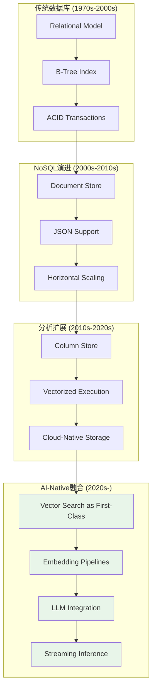
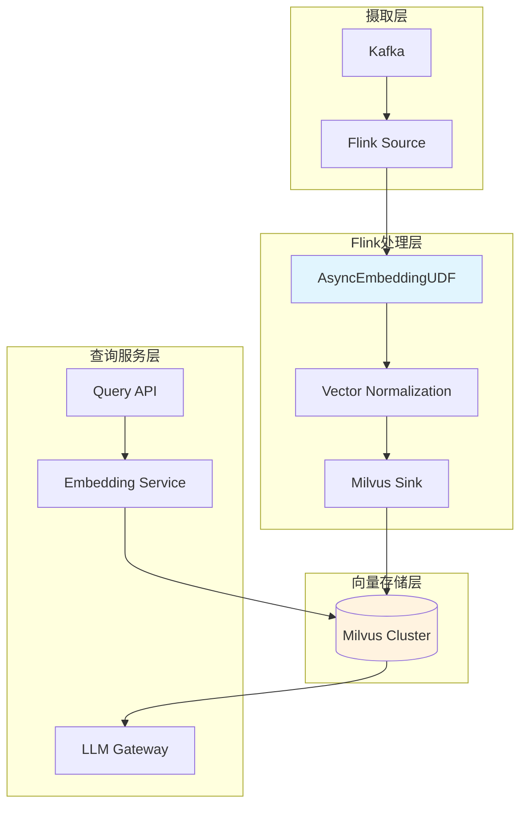
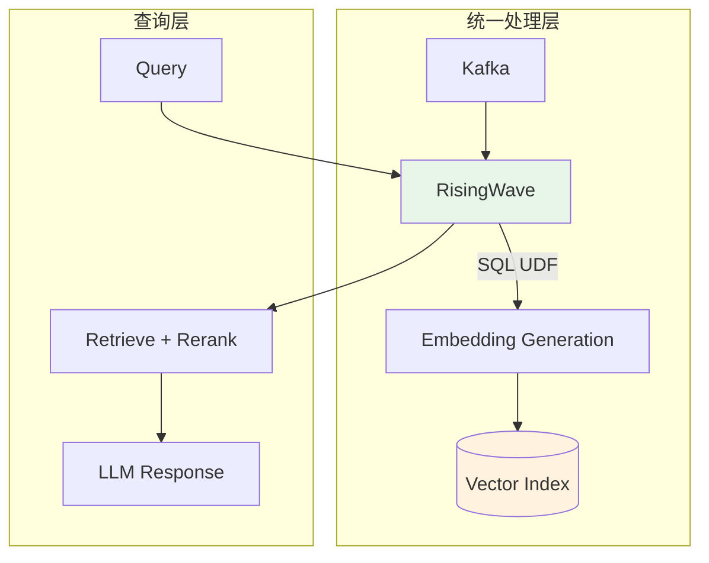
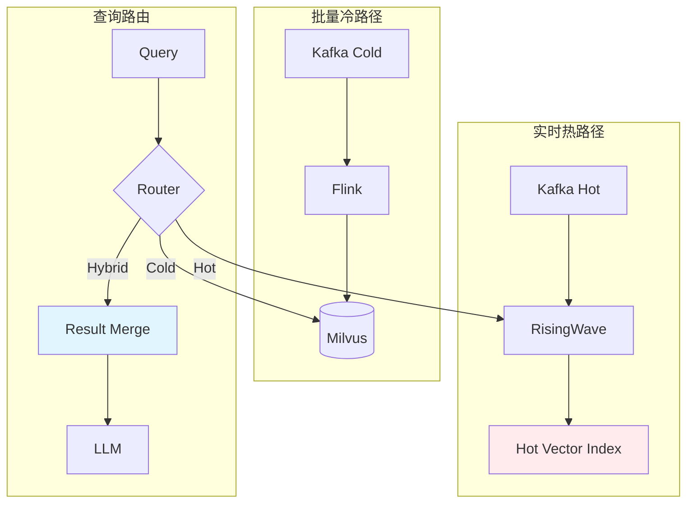
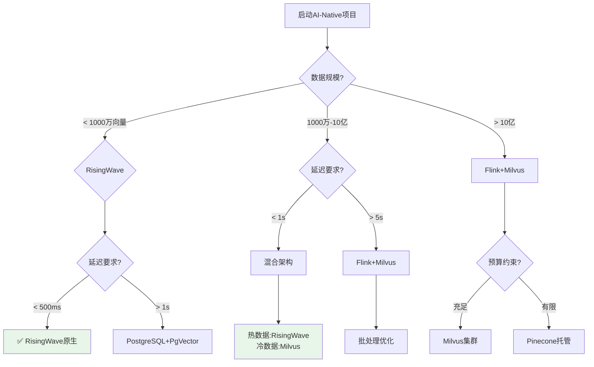
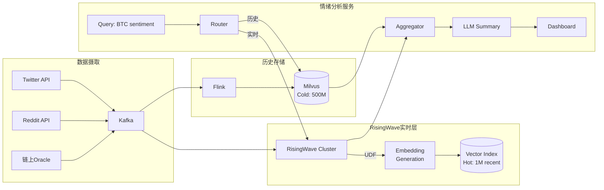
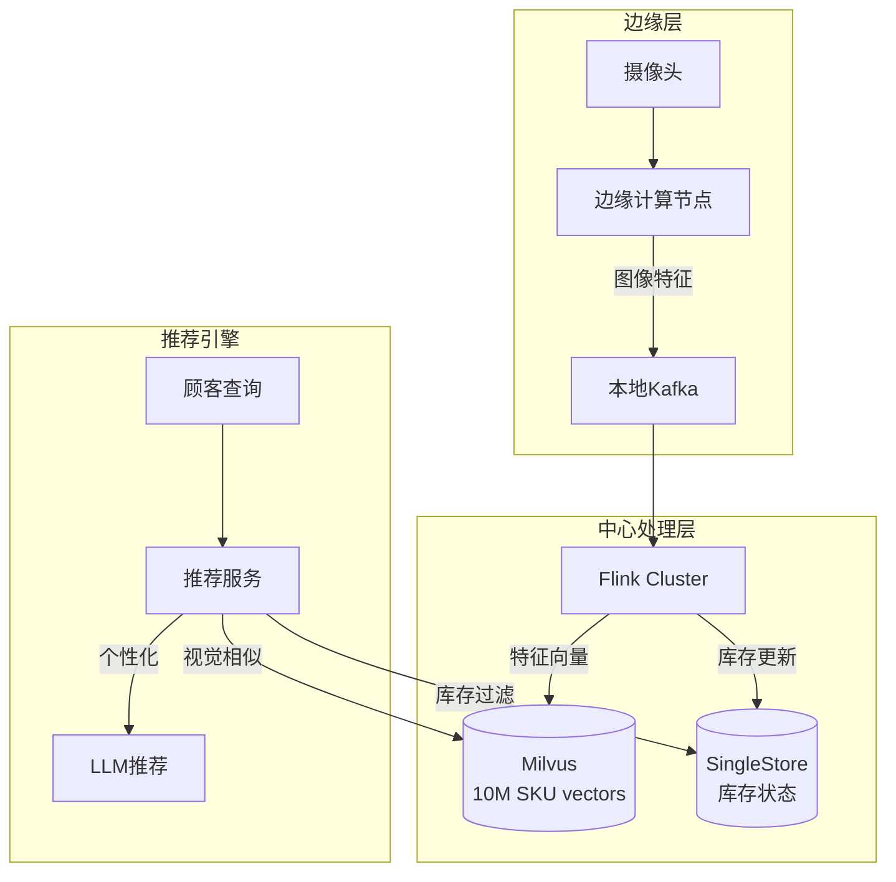
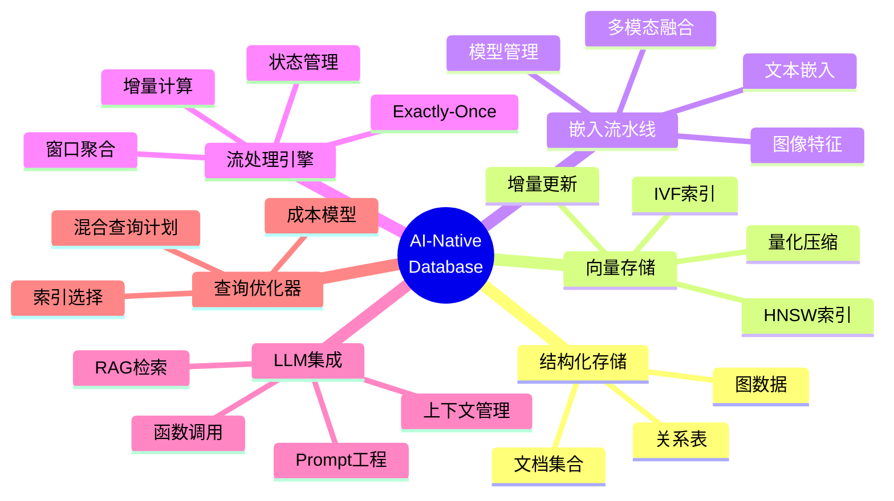
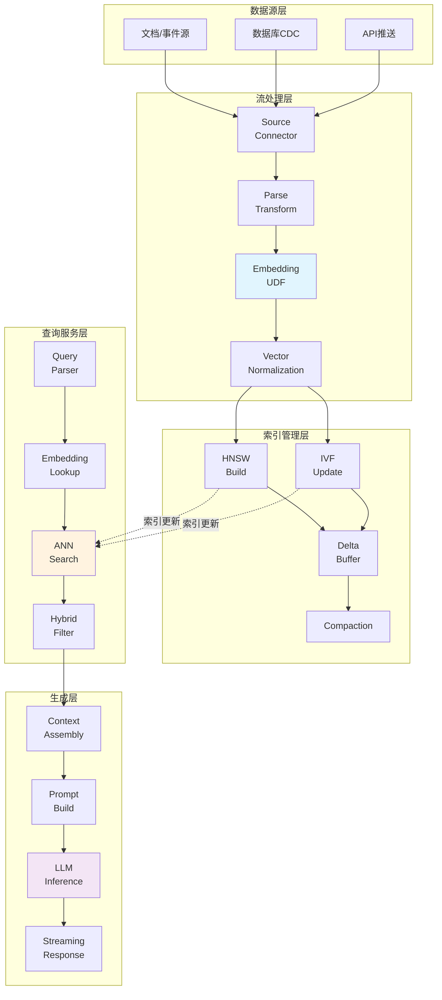
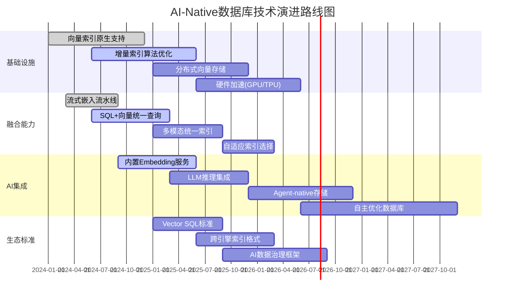

# 向量搜索与流处理的融合：AI-Native数据库演进

> 所属阶段: Knowledge/06-frontier | 前置依赖: [实时RAG架构](real-time-rag-architecture.md), [RisingWave深度解析](risingwave-deep-dive.md) | 形式化等级: L3-L4

## 1. 概念定义 (Definitions)

### Def-K-06-30: AI-Native数据库 (AI-Native Database)

**定义**: AI-Native数据库是一个六元组 $\mathcal{D}_{AI} = (\mathcal{S}, \mathcal{V}, \mathcal{M}, \mathcal{I}, \mathcal{L}, \mathcal{F})$，其中：

| 组件 | 符号 | 形式化定义 | 功能描述 |
|------|------|------------|----------|
| 结构化存储 | $\mathcal{S}$ | $\langle \mathcal{T}, \mathcal{R}, \mathcal{Q}_{SQL} \rangle$ | 传统关系/文档数据存储 |
| 向量存储 | $\mathcal{V}$ | $\langle \mathbb{R}^k, \mathcal{N}_{ANN}, \theta_{sim} \rangle$ | 高维向量索引与近似最近邻搜索 |
| 模型推理 | $\mathcal{M}$ | $\text{Stream}(\mathcal{X}) \rightarrow \text{Stream}(\mathbb{R}^k)$ | 嵌入生成与模型推理服务 |
| 增量索引 | $\mathcal{I}$ | $\Delta \mathcal{V} \times \mathcal{V}_t \rightarrow \mathcal{V}_{t+1}$ | 向量索引实时更新机制 |
| LLM集成 | $\mathcal{L}$ | $(q, \mathcal{C}) \rightarrow \text{response}$ | 大语言模型上下文增强接口 |
| 流处理引擎 | $\mathcal{F}$ | $\text{Stream}(\mathcal{E}) \rightarrow \text{Stream}(\mathcal{E}')$ | 实时数据流转换与计算 |

**核心特征**: AI-Native数据库将向量搜索作为**一等公民**(First-Class Citizen)，与B-tree索引、JSON支持同等重要，而非外部附件。

---

### Def-K-06-31: 实时RAG架构 (Real-Time RAG Architecture)

**定义**: 实时RAG架构是一个事件驱动的数据处理模式，形式化为：

$$\text{RT-RAG} = (\mathcal{F}_{stream}, \mathcal{E}_{embed}, \mathcal{V}_{index}, \mathcal{R}_{retrieve}, \mathcal{L}_{generate})$$

其中各阶段满足时序约束：

$$\forall e \in \mathcal{E}: T_{visible}(e) - T_{arrival}(e) < \Delta_{max}$$

- $T_{arrival}(e)$: 事件到达时间
- $T_{visible}(e)$: 事件可被检索的时间
- $\Delta_{max}$: 最大容忍延迟（通常 < 10秒）

**与传统RAG的本质区别**:

| 维度 | 传统批处理RAG | 实时流式RAG |
|------|---------------|-------------|
| 数据新鲜度 | T+小时级 | T+秒级 |
| 索引更新 | 全量重建 | 增量更新 |
| 架构复杂度 | ETL+Batch+Serving | 统一流处理 |
| 延迟保证 | 尽力而为 | 有界延迟 |

---

### Def-K-06-32: 向量索引增量更新 (Vector Index Incremental Update)

**定义**: 向量索引增量更新是一个状态转换函数：

$$\mathcal{I}_{incr}: (\mathcal{V}_t, \Delta \mathcal{V}_{insert}, \Delta \mathcal{V}_{delete}) \rightarrow \mathcal{V}_{t+1}$$

**HNSW索引增量更新**: 对于基于HNSW的向量存储，增量更新满足：

$$\mathcal{V}_{t+1}^{HNSW} = \mathcal{V}_t^{HNSW} \oplus_{HNSW} \Delta \mathcal{V}$$

其中 $\oplus_{HNSW}$ 表示在不重建整个图结构的前提下，局部插入/删除节点并维护连通性。

**更新模式分类**:

1. **乐观插入**: 立即插入向量，后台异步重建索引图
2. **分区切换**: 新数据写入新分区，查询时合并多分区结果
3. **版本化索引**: 维护多版本索引，原子切换

---

### Def-K-06-33: 流式近似最近邻搜索 (Streaming Approximate Nearest Neighbor Search)

**定义**: 流式ANN搜索是一个时变查询操作：

$$\text{ANN}_s: (q, \mathcal{V}_t, k, \epsilon) \rightarrow \{(v_i, s_i)\}_{i=1}^k$$

约束条件：

- **召回率保证**: $\text{Recall}@k \geq 1 - \epsilon$（以概率 $1 - \delta$）
- **延迟约束**: $T_{query} < L_{max}$
- **一致性约束**: 查询结果反映 $\mathcal{V}_t$ 的某个一致快照

**精度-延迟权衡定理**: 对于固定计算资源 $C$，存在函数 $f$ 使得：

$$\text{Recall}@k = f(C/L_{query}, \text{index\_quality})$$

---

### Def-K-06-34: 混合检索语义 (Hybrid Retrieval Semantics)

**定义**: 混合检索结合向量相似度与结构化过滤：

$$\text{Hybrid}(q, \phi) = \{v \in \mathcal{V}_t \mid \text{sim}(\mathcal{E}(q), v) \geq \theta \land \phi(v) = \text{true}\}$$

其中：

- $\mathcal{E}(q)$: 查询嵌入
- $\text{sim}(\cdot, \cdot)$: 相似度函数（余弦/点积）
- $\phi$: 结构化谓词（如 `category = 'finance' AND date > '2024-01-01'`）
- $\theta$: 相似度阈值

**预过滤 vs 后过滤**:

| 策略 | 执行顺序 | 适用场景 | 精度影响 |
|------|----------|----------|----------|
| 预过滤 | 先应用 $\phi$，再ANN | 高选择性谓词 | 无影响 |
| 后过滤 | 先ANN Top-K'，再应用$\phi$ | 低选择性谓词 | 可能降低召回 |

---

## 2. 属性推导 (Properties)

### Prop-K-06-12: 向量索引一致性边界

**命题**: 在流式更新场景下，向量索引 $\mathcal{V}_t$ 与真实数据状态的一致性偏差有界：

$$\|\mathcal{V}_t - \mathcal{V}_t^*\|_{recall} \leq \lambda \cdot \Delta_{sync} \cdot \frac{1}{|\mathcal{V}|}$$

其中：

- $\lambda$: 向量写入速率（向量/秒）
- $\Delta_{sync}$: 索引同步延迟
- $\mathcal{V}_t^*$: 理想完整索引

**工程启示**: 对于10万向量/秒的写入速率和1秒同步延迟，最多有0.1%的向量处于未索引状态。

---

### Prop-K-06-13: 近似搜索误差累积

**命题**: 设单次ANN搜索的期望误差为 $\epsilon_0$，则 $n$ 次连续增量更新后的累积误差满足：

$$\mathbb{E}[\epsilon_n] \leq \epsilon_0 + \sum_{i=1}^{n} \frac{\Delta \mathcal{V}_i}{|\mathcal{V}_i|} \cdot \epsilon_{insert}$$

**推论**: 当增量更新比例 $\frac{|\Delta \mathcal{V}|}{|\mathcal{V}|} < 5\%$ 时，近似误差控制在可接受范围。

---

### Lemma-K-06-08: 流式嵌入延迟分解

**引理**: 实时嵌入生成的端到端延迟可分解为：

$$L_{embed} = L_{queue} + L_{batch} + L_{inference} + L_{normalize}$$

其中各分量典型值（p99）:

| 分量 | 批大小=1 | 批大小=32 | 批大小=128 |
|------|----------|-----------|------------|
| $L_{queue}$ | 5ms | 20ms | 80ms |
| $L_{batch}$ | 0ms | 5ms | 20ms |
| $L_{inference}$ | 50ms | 15ms | 8ms |
| $L_{normalize}$ | 1ms | 1ms | 1ms |
| **总计** | **56ms** | **41ms** | **109ms** |

**最优批大小**: 存在批大小 $B^*$ 使得 $L_{embed}$ 最小化，满足：

$$B^* = \arg\min_B \left( \frac{\lambda \cdot B}{2} + T_{inference}(B) \right)$$

---

### Prop-K-06-14: 混合查询成本模型

**命题**: 混合检索（向量+结构化过滤）的查询成本满足：

$$\text{Cost}_{hybrid} = \alpha \cdot \text{Cost}_{vector} + \beta \cdot \text{Cost}_{filter} + \gamma \cdot \text{Cost}_{merge}$$

系数取决于执行策略：

| 策略 | $\alpha$ | $\beta$ | $\gamma$ | 适用条件 |
|------|----------|---------|----------|----------|
| 预过滤 | 1 | 1 | 0 | 选择性 > 10% |
| 后过滤 | 2 | 0.5 | 1 | 选择性 < 1% |
| 融合 | 1.5 | 0.8 | 1.2 | 混合场景 |

---

## 3. 关系建立 (Relations)

### 3.1 向量搜索与流处理的深层关联

```
┌─────────────────────────────────────────────────────────────────────┐
│                    向量搜索 × 流处理 融合映射                        │
├───────────────────────────┬─────────────────────────────────────────┤
│ 向量搜索概念              │ 流处理抽象                              │
├───────────────────────────┼─────────────────────────────────────────┤
│ 向量写入流                │ DataStream<VectorEmbedding>             │
│ 索引构建                  │ Stateful Windowed Aggregation           │
│ ANN查询                   │ Broadcast State Lookup                  │
│ 混合过滤                  │ KeyedProcessFunction with State         │
│ 增量索引更新              │ Incremental Checkpoint of Vector State  │
│ 多版本索引                │ Versioned KeyedStateStore               │
└───────────────────────────┴─────────────────────────────────────────┘
```

### 3.2 数据库系统演进谱系



### 3.3 主流系统向量能力对比

| 系统 | 原生向量支持 | 流处理能力 | 融合架构 | 适用场景 |
|------|--------------|------------|----------|----------|
| **PostgreSQL+PgVector** | 扩展插件 | 外部CDC | 松耦合 | 轻量级RAG |
| **MongoDB** | 原生数组索引 | Change Streams | 半紧耦合 | 文档+向量混合 |
| **RisingWave** | 内置向量索引 | 核心能力 | 紧耦合 | 实时AI应用 |
| **Flink+Milvus** | 外部集成 | 核心能力 | 松耦合 | 大规模生产 |
| **SingleStore** | 原生向量列 | Pipelines | 紧耦合 | HTAP+AI |

---

## 4. 论证过程 (Argumentation)

### 4.1 数据库向AI-Native演进的必然性论证

**技术驱动力分析**:

| 驱动力 | 表现 | 影响 |
|--------|------|------|
| **LLM应用爆发** | ChatGPT日活1亿+ | 向量存储成为刚需 |
| **实时性需求** | 从T+1到T+0 | 批处理向流式迁移 |
| **多模态数据** | 文本/图像/视频统一表征 | 向量成为通用语言 |
| **成本压力** | 专用向量库运维成本 | 融合降低TCO |

**类比论证**: 向量搜索在AI时代的地位，等同于：

- B-tree在OLTP时代的地位
- JSON在Web2.0时代的地位
- 列存储在大数据时代的地位

### 4.2 架构选型决策矩阵

**决策维度权重**:

```
┌─────────────────────────────────────────────────────────────┐
│                    架构选型评分模型                          │
├─────────────────────────────────────────────────────────────┤
│ 延迟敏感度 (Latency)     ████████████████████  权重: 0.25   │
│ 数据规模 (Scale)         ██████████████████    权重: 0.20   │
│ 一致性要求 (Consistency) ████████████████      权重: 0.20   │
│ 运维复杂度 (Ops)         ██████████████        权重: 0.15   │
│ 成本约束 (Cost)          ████████████          权重: 0.12   │
│ 生态兼容 (Ecosystem)     ██████████            权重: 0.08   │
└─────────────────────────────────────────────────────────────┘
```

### 4.3 反例分析：分离架构的局限性

**场景**: 某金融风控系统采用Flink+独立Milvus架构

**问题暴露**:

1. **双重一致性问题**:

   ```
   Flink Checkpoint: t=100
   Milvus Flush: t=105
   查询时刻: t=103

   结果：查询可能看到Flink已处理但Milvus未持久化的数据
   ```

2. **故障恢复复杂性**:
   - Flink从Checkpoint恢复
   - Milvus需要独立恢复
   - 两者状态可能不一致

3. **延迟累积**:
   - Flink→Milvus网络延迟: 5-20ms
   - Milvus索引更新延迟: 100-500ms
   - 端到端延迟难以优化到秒级以下

**教训**: 分离架构在极端延迟敏感场景下存在瓶颈。

---

## 5. 工程论证 (Engineering Argument)

### 5.1 实时RAG架构模式对比

#### 模式A: Flink + 外部向量数据库 (Milvus/Pinecone)



**优势**:

- 生态成熟，生产验证充分
- 各组件可独立扩展
- 支持超大规模向量（千亿级）

**劣势**:

- 端到端延迟较高（秒级）
- 需要维护两套系统
- 一致性保障复杂

---

#### 模式B: RisingWave 原生向量索引



**优势**:

- 统一SQL语义
- 端到端延迟低（亚秒级）
- 内置一致性保障

**劣势**:

- 向量规模受限（当前版本<1亿）
- 新兴技术，生产案例较少
- 生态工具链待完善

---

## 生态工具链

### 向量数据库

| 产品 | 特点 | 与Flink集成 |
|------|------|-------------|
| Milvus | 云原生 | Flink-Milvus Connector |
| Pinecone | 全托管 | REST API |
| Weaviate | 语义搜索 | Flink Weaviate Sink |
| pgvector | PostgreSQL扩展 | JDBC Connector |

### 向量化工具

- **Hugging Face Transformers**: 文本向量化
- **OpenAI Embeddings API**: 通用向量化
- **SentenceTransformers**: 本地文本向量化

---

#### 模式C: 混合分层架构



**适用场景**: 超大规模实时应用，冷热数据分离

---

### 5.2 系统选型决策树



---

### 5.3 高维向量索引增量更新算法

**算法1: HNSW增量插入**

```python
def incremental_hnsw_insert(graph, new_vector, M=16, ef=200):
    """
    增量插入新向量到HNSW图
    时间复杂度: O(log N * M)
    """
    # 1. 确定插入层级
    level = random_level()  # 指数分布

    # 2. 从顶层开始搜索
    entry_point = graph.entry_point
    for l in range(graph.max_level, level, -1):
        entry_point = search_layer(entry_point, new_vector, 1, l)

    # 3. 在目标层建立连接
    for l in range(min(level, graph.max_level), -1, -1):
        neighbors = search_layer(entry_point, new_vector, ef, l)
        selected = select_neighbors(neighbors, M)  # 启发式选择

        # 双向连接
        for n in selected:
            add_edge(graph, new_vector, n, l)
            if len(graph.edges[n][l]) > M_max:
                shrink_edges(graph, n, l, M_max)

        entry_point = selected[0]

    # 4. 更新入口点
    if level > graph.max_level:
        graph.entry_point = new_vector
        graph.max_level = level

    return graph
```

**算法2: IVF索引增量更新**

```python
def incremental_ivf_update(index, delta_vectors, nlist=4096):
    """
    IVF索引增量更新策略
    """
    # 策略1: 插入到现有聚类中心
    for vec in delta_vectors:
        centroid = find_nearest_centroid(index.centroids, vec)
        index.inverted_lists[centroid].append(vec)

        # 触发局部重建条件
        if len(index.inverted_lists[centroid]) > REBUILD_THRESHOLD:
            schedule_partial_rebuild(centroid)

    # 策略2: 分裂高负载聚类
    overloaded = [c for c in index.centroids
                  if len(index.inverted_lists[c]) > SPLIT_THRESHOLD]
    for c in overloaded:
        split_centroid(index, c)

    return index
```

---

### 5.4 近似搜索精度优化策略

**多阶段检索架构**:

```
┌─────────────────────────────────────────────────────────────┐
│                    多阶段检索流水线                          │
├─────────────────────────────────────────────────────────────┤
│                                                             │
│  Stage 1: 粗排 (Coarse Retrieval)                           │
│  ├── 索引: IVF or HNSW                                      │
│  ├── Top-K': 1000                                           │
│  └── 延迟: < 10ms                                           │
│                                                             │
│  Stage 2: 精排 (Reranking)                                  │
│  ├── 精确距离计算                                           │
│  ├── Top-K: 100                                             │
│  └── 延迟: ~5ms                                             │
│                                                             │
│  Stage 3: 业务过滤 (Business Logic)                         │
│  ├── 权限检查                                               │
│  ├── 时效性过滤                                             │
│  ├── Top-K: 10-20                                           │
│  └── 延迟: ~2ms                                             │
│                                                             │
│  总计延迟: < 20ms, 召回率 > 95%                             │
│                                                             │
└─────────────────────────────────────────────────────────────┘
```

---

## 6. 实例验证 (Examples)

### 6.1 实例：Kaito AI - 加密市场实时情绪分析

**场景描述**: 实时监控Twitter/Reddit/链上数据，生成加密市场情绪指标

**数据规模**:

- 社交媒体流: 50K posts/second
- 历史向量: 5亿条推文嵌入
- 查询QPS: 10K

**架构设计**:



**核心SQL**:

```sql
-- 定义Twitter流源
CREATE SOURCE twitter_stream (
    tweet_id BIGINT,
    content VARCHAR,
    created_at TIMESTAMP,
    coin_mentions VARCHAR[],
    sentiment_score FLOAT
) WITH (
    connector = 'kafka',
    topic = 'twitter.raw',
    properties.bootstrap.server = 'kafka:9092'
) FORMAT PLAIN ENCODE JSON;

-- 生成嵌入并存储到向量索引
CREATE MATERIALIZED VIEW tweet_embeddings AS
SELECT
    tweet_id,
    embedding(content) as vector,  -- UDF调用嵌入服务
    coin_mentions,
    sentiment_score,
    created_at
FROM twitter_stream;

-- 实时情绪聚合（按币种，5分钟窗口）
CREATE MATERIALIZED VIEW coin_sentiment AS
SELECT
    unnest(coin_mentions) as coin_symbol,
    window_start,
    AVG(sentiment_score) as avg_sentiment,
    COUNT(*) as mention_count,
    COLLECT_LIST(vector) as embedding_vectors  -- 用于相似度搜索
FROM TUMBLE(tweet_embeddings, created_at, INTERVAL '5' MINUTE)
GROUP BY unnest(coin_mentions), window_start;

-- 相似推文检索（实时RAG）
CREATE MATERIALIZED VIEW similar_tweets AS
SELECT
    t1.tweet_id,
    t1.content,
    array_agg(t2.tweet_id) as similar_tweet_ids,
    array_agg(vector_distance(t1.vector, t2.vector)) as distances
FROM tweet_embeddings t1
JOIN tweet_embeddings t2
ON vector_distance(t1.vector, t2.vector) < 0.3
   AND t1.tweet_id != t2.tweet_id
   AND t1.created_at > NOW() - INTERVAL '1' HOUR
GROUP BY t1.tweet_id, t1.content;
```

**性能指标**:

| 指标 | 目标值 | 实测值 |
|------|--------|--------|
| 端到端延迟 | < 5s | 2.3s |
| 向量查询P99 | < 100ms | 45ms |
| 情绪聚合延迟 | < 30s | 12s |
| 存储成本 | - | $15K/月 |

---

### 6.2 实例：智能零售 - 实时库存+视觉识别

**场景描述**: 顾客拿起商品时，系统实时识别并提供个性化推荐

**技术挑战**:

1. 图像特征实时提取（ResNet/ViT）
2. 百万级SKU向量索引
3. 低延迟查询（< 100ms）

**架构实现**:



**Flink嵌入生成Pipeline**:

```java
public class VisualEmbeddingPipeline {

    public static void main(String[] args) {
        StreamExecutionEnvironment env =
            StreamExecutionEnvironment.getExecutionEnvironment();

        // 图像流源
        DataStream<ImageEvent> imageStream = env
            .addSource(new KafkaSource<>())
            .assignTimestampsAndWatermarks(
                WatermarkStrategy.<ImageEvent>forBoundedOutOfOrderness(
                    Duration.ofSeconds(5))
            );

        // 异步特征提取
        DataStream<VectorEmbedding> embeddings = AsyncDataStream
            .unorderedWait(
                imageStream,
                new AsyncImageEmbeddingFn(
                    "resnet50.onnx",  // ONNX模型
                    768               // 输出维度
                ),
                200, TimeUnit.MILLISECONDS,  // 超时
                100                           // 并发度
            );

        // 写入Milvus
        embeddings.addSink(new MilvusVectorSink(
            "product_vectors",
            WriteMode.UPSERT
        ));

        env.execute("Visual Embedding Pipeline");
    }
}

// 异步嵌入UDF
public class AsyncImageEmbeddingFn
    implements AsyncFunction<ImageEvent, VectorEmbedding> {

    private transient OrtSession session;

    @Override
    public void asyncInvoke(ImageEvent img, ResultFuture<VectorEmbedding> future) {
        CompletableFuture.supplyAsync(() -> {
            // ONNX推理
            OrtEnvironment env = OrtEnvironment.getEnvironment();
            OnnxTensor input = preprocess(img);
            OrtSession.Result result = session.run(
                Collections.singletonMap("input", input)
            );
            float[] vector = (float[]) result.get(0).getValue();

            // L2归一化
            vector = normalizeL2(vector);

            return new VectorEmbedding(img.getId(), vector, img.getMetadata());
        }).thenAccept(future::complete);
    }
}
```

---

### 6.3 实例：实时个性化推荐系统

**场景**: 内容平台根据用户实时行为生成个性化推荐

**数据流**:

```
用户行为流:
┌─────────────────────────────────────────────────────────────┐
│ 事件类型        │ 实时处理需求            │ 向量更新       │
├─────────────────────────────────────────────────────────────┤
│ page_view       │ 更新用户画像            │ 否             │
│ content_like    │ 触发正向偏好更新        │ 是             │
│ content_share   │ 高权重偏好信号          │ 是             │
│ search_query    │ 意图识别+相关推荐       │ 增量索引       │
│ dwell_time>30s  │ 隐式正向反馈            │ 延迟更新       │
└─────────────────────────────────────────────────────────────┘
```

**RisingWave实现**:

```sql
-- 用户行为流
CREATE SOURCE user_events (
    user_id VARCHAR,
    event_type VARCHAR,
    content_id VARCHAR,
    embedding VECTOR(768),  -- 预计算的内容嵌入
    event_time TIMESTAMP,
    metadata MAP<VARCHAR, VARCHAR>
) WITH (connector = 'kafka', ...);

-- 实时用户画像（滑动窗口聚合）
CREATE MATERIALIZED VIEW user_realtime_profile AS
SELECT
    user_id,
    window_start as profile_time,
    AVG(CASE WHEN event_type = 'like' THEN embedding END) as positive_pref,
    AVG(CASE WHEN event_type = 'skip' THEN embedding END) as negative_pref,
    COUNT(*) as event_count
FROM HOP(user_events, event_time, INTERVAL '1' MINUTE, INTERVAL '5' MINUTE)
GROUP BY user_id, window_start;

-- 个性化候选生成（向量相似度搜索）
CREATE MATERIALIZED VIEW personalized_candidates AS
SELECT
    p.user_id,
    p.profile_time,
    c.content_id,
    c.title,
    vector_cosine_similarity(p.positive_pref, c.embedding) as similarity,
    c.popularity_score
FROM user_realtime_profile p
CROSS JOIN content_vectors c  -- 物化视图存储内容向量
WHERE vector_cosine_similarity(p.positive_pref, c.embedding) > 0.7
  AND c.created_at > NOW() - INTERVAL '7' DAY
ORDER BY similarity DESC, popularity_score DESC
LIMIT 100;
```

---

## 7. 可视化 (Visualizations)

### 7.1 AI-Native数据库架构思维导图



### 7.2 实时RAG数据流架构图



### 7.3 向量索引技术选型决策矩阵

```mermaid
graph LR
    subgraph "索引类型选择"
        A[数据规模<br/>+更新频率]

        A -->|< 100万<br/>低更新| B[HNSW<br/>内存索引]
        A -->|100万-1亿<br/>中更新| C[HNSW<br/>磁盘索引]
        A -->|> 1亿<br/>高更新| D[IVF<br/>分布式]
        A -->|超高维<br/>>10K| E[PQ量化<br/>压缩]
    end

    subgraph "延迟要求"
        B -->|< 10ms| F[纯内存]
        C -->|< 50ms| G[内存+SSD]
        D -->|< 100ms| H[分布式缓存]
        E -->|< 20ms| I[GPU加速]
    end

    subgraph "精度要求"
        F -->|Recall@10>95%| J[M=32<br/>ef=400]
        G -->|Recall@10>90%| K[M=16<br/>ef=200]
        H -->|Recall@10>85%| L[nlist=4096<br/>nprobe=128]
        I -->|Recall@10>80%| M[PQ=64<br/>OPQ预处理]
    end

    style A fill:#e3f2fd
    style J fill:#e8f5e9
    style K fill:#e8f5e9
    style L fill:#e8f5e9
    style M fill:#e8f5e9
```

### 7.4 2025-2030技术路线图



---

## 8. 技术挑战与解决方案

### 8.1 高维向量索引增量更新挑战

**挑战1: 图结构漂移**

- **问题**: HNSW图在大量增量插入后，连通性质量下降
- **解决**: 触发式局部重建 + 背景全量重建

```python
# 自适应重建策略
if graph_quality_score() < REBUILD_THRESHOLD:
    if incremental_ratio() < 0.1:
        schedule_background_rebuild()
    else:
        trigger_partial_rebuild(affected_regions)
```

**挑战2: 写入放大**

- **问题**: LSM-Tree存储下，向量更新导致大量Compaction
- **解决**: 分层存储（热向量内存、温向量SSD、冷向量S3）

### 8.2 近似搜索精度-延迟权衡

**自适应查询策略**:

```
┌─────────────────────────────────────────────────────────────┐
│                    自适应查询控制                            │
├─────────────────────────────────────────────────────────────┤
│                                                             │
│  if latency_budget > 50ms:                                  │
│      use_ef = 400  # 高精度                                 │
│      nprobe = 256                                           │
│  elif latency_budget > 20ms:                                │
│      use_ef = 200  # 平衡                                   │
│      nprobe = 128                                           │
│  else:                                                      │
│      use_ef = 100  # 低延迟                                 │
│      nprobe = 64                                            │
│      enable_approximate = True                              │
│                                                             │
└─────────────────────────────────────────────────────────────┘
```

### 8.3 状态管理与向量索引一致性

**RisingWave一致性保障**:

```
Checkpoint Barrier Flow:

Source ──B(e)──→ EmbedUDF ──B(e)──→ VectorIndex ──B(e)──→ ...
                    ↓                      ↓
                Flush(embed)         Flush(index)
                    ↓                      ↓
                Hummock L0           Hummock L0
                    ↓                      ↓
                <Async Upload>       <Async Upload>
                    ↓                      ↓
                S3 Epoch e           S3 Epoch e

Recovery: Both states restored from Epoch e
Consistency: Guaranteed by shared barrier
```

---

## 9. 未来展望

### 9.1 数据库全面AI-Native化预测

**2025年**: 主流数据库原生向量支持

- PostgreSQL 16+ PgVector成为默认扩展
- MongoDB向量搜索GA
- RisingWave向量索引成熟

**2026年**: 流式AI推理标准化

- SQL标准扩展：VECTOR类型、embedding()函数
- 统一嵌入服务接口
- 模型版本管理与A/B测试

**2027年**: 自主优化数据库

- 基于工作负载的自动索引选择
- 查询计划自动优化（LLM辅助）
- 自适应资源调度

**2028-2030年**: Agent-Native架构

- 数据库作为AI Agent的感知器官
- 自然语言数据操作
- 预测性维护与自愈

### 9.2 流式AI推理架构演进

```
当前架构 (2024):
Data → Flink → VectorDB → Application → LLM API

演进架构 (2026):
Data → Streaming DB → [Embedding|Index|Query] → LLM Gateway

未来架构 (2028+):
AI-Native Database
├── Perception: 多模态数据摄入
├── Cognition: 内置推理引擎
├── Memory: 向量+符号混合存储
└── Action: 智能决策输出
```

---

## 10. 引用参考 (References)


---

## 附录: 核心参数速查表

### 向量索引参数

| 参数 | HNSW推荐值 | IVF推荐值 | 说明 |
|------|-----------|-----------|------|
| M | 16-32 | - | 每层最大连接数 |
| efConstruction | 200-400 | - | 构建时搜索深度 |
| efSearch | 100-400 | - | 查询时搜索深度 |
| nlist | - | 4096 | 聚类中心数 |
| nprobe | - | 128-256 | 查询时扫描聚类数 |
| metric | cosine/l2 | cosine/l2 | 距离度量 |

### 流处理参数

| 参数 | 低延迟场景 | 高吞吐场景 | 说明 |
|------|-----------|-----------|------|
| Checkpoint间隔 | 1-5s | 30-60s | 容错粒度 |
| 嵌入批大小 | 1-8 | 32-128 | 延迟/吞吐权衡 |
| 向量缓存大小 | 10万 | 1000万 | 热数据保留 |
| 索引重建周期 | 1小时 | 24小时 | 增量/全量切换 |

### 成本估算公式

```
月度存储成本 = (向量数 × 维度 × 4字节 × 副本数 × $0.023/GB)

月度计算成本 = (处理事件数/1M × $0.20) + (查询QPS × 720小时 × $0.05/小时)

总TCO = 存储 + 计算 + 网络 + 运维人力(20% overhead)
```

---

*文档版本: 1.0 | 创建日期: 2026-04-02 | 维护者: AnalysisDataFlow Project*
