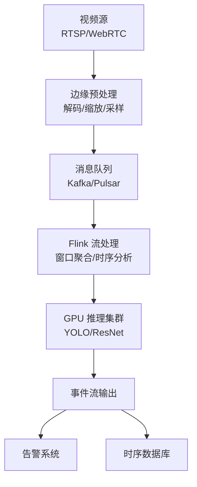
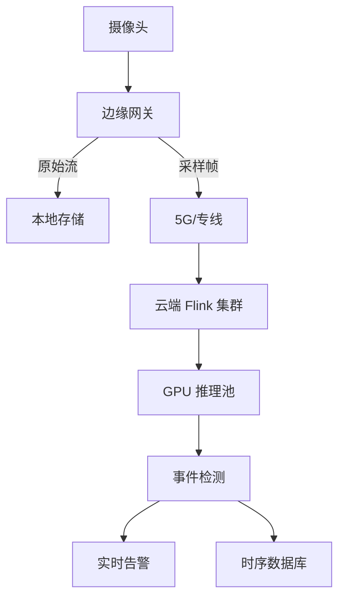

# 视频流实时分析

> **所属阶段**: Knowledge/06-frontier/ | **前置依赖**: [多模态流处理架构](./multimodal-stream-processing.md) | **形式化等级**: L4

---

## 1. 概念定义 (Definitions)

**Def-K-Video-01: 视频流实时分析 (Real-Time Video Stream Analytics)**
对连续视频流（如监控摄像头、直播推流、无人机图传）进行低延迟的帧提取、对象检测、行为识别、事件触发和响应决策的流计算应用。核心目标是在视频采集后的秒级甚至毫秒级时间内产出可行动的分析结果。

**Def-K-Video-02: 帧采样策略 (Frame Sampling Strategy)**
由于视频流的原始数据率极高（1080p@30fps ≈ 373MB/s 未压缩），流式系统通常不会处理每一帧，而是采用跳帧（Skip）、关键帧（I-Frame）抽取或自适应采样（根据场景动态变化率决定采样率）来降低计算负载。

**Def-K-Video-03: 边缘-云协同推理 (Edge-Cloud Collaborative Inference)**
将轻量级的视频预处理（如解码、缩放、背景差分）部署在边缘设备上，将复杂的深度学习推理（如目标检测、人脸识别）卸载到云端 GPU 集群，通过流计算框架（如 Flink）进行任务编排和结果聚合。

---

## 2. 属性推导 (Properties)

**Lemma-K-Video-01: 帧采样率与检测精度的关系**
在对象持续移动的视频场景中，若采样率从 30fps 降至 5fps，对于速度 < 5 像素/帧的目标，检测召回率下降 < 5%；但对于速度 > 20 像素/帧的快速目标，召回率可能下降 20%-40%。

**Lemma-K-Video-02: 推理批处理大小的延迟-吞吐权衡**
对于 GPU 推理引擎，批处理大小（Batch Size）从 1 增加到 8 通常可将吞吐提升 3-5 倍，但端到端延迟会从单帧的 20-50ms 增加到 80-200ms。流式系统需要根据 SLA 选择最优批大小。

**Prop-K-Video-01: 场景变化度驱动的自适应采样是最优策略**
在静态监控场景中，固定区域长时间无变化，可将采样率降至 1fps；在事件高发区域（如十字路口），应提升至 15-30fps。自适应采样相比固定采样可节省 60%-90% 的计算资源。

---

## 3. 关系建立 (Relations)

### 3.1 视频流分析架构



### 3.2 采样策略对比

| 策略 | 计算开销 | 延迟 | 适用场景 |
|------|---------|------|---------|
| 全帧处理 (30fps) | 极高 | 低 | 高速运动分析 |
| 固定跳帧 (5fps) | 中 | 低 | 一般监控 |
| 关键帧抽取 | 低 | 中 | 存储回放优先 |
| 自适应采样 | 动态 | 低 | 智能监控 |
| 事件触发采样 | 极低 | 中 | 待机值守模式 |

---

## 4. 论证过程 (Argumentation)

### 4.1 视频流分析的核心挑战

1. **数据洪流**：单路 4K@60fps 视频的比特率可达 50-100Mbps，百路并发即 5-10Gbps
2. **计算密集**：现代目标检测模型（如 YOLOv8）在单帧 1080p 图像上的推理需要 10-50ms
3. **延迟敏感**：安防监控要求在异常发生后 1-3 秒内触发告警
4. **隐私合规**：人脸识别和行为分析涉及 GDPR、个人信息保护法等法规约束

### 4.2 成本优化路径

- **边缘预处理**：在摄像头端完成 H.264/H.265 解码和 ROI 提取，减少 80% 的无效数据传输
- **模型蒸馏**：将大模型（如 YOLOv8-x）蒸馏为轻量模型（如 YOLOv8-n），在精度损失 < 5% 的情况下将推理速度提升 5-10 倍
- **动态流水线**：白天高流量时段使用云端 GPU，夜间低流量时段回退到边缘 CPU 推理

---

## 5. 形式证明 / 工程论证

### 5.1 自适应采样策略的最优性

**定理 (Thm-K-Video-01)**: 设视频场景的变化度为 $C(t)$（定义为连续帧间像素差异的某种度量），处理单帧的成本为 $k$，采样率为 $r$，精度损失函数为 $L(r, C)$。则目标函数为最小化总成本 $J = k \cdot r + \lambda \cdot L(r, C)$。对于凸函数 $L$，存在最优采样率 $r^*(t)$ 使得 $\frac{\partial J}{\partial r} = 0$。

**工程论证**：

1. 在实际系统中，$C(t)$ 可以通过背景减除或光流法快速估计
2. 当 $C(t) \approx 0$（静态场景）时，$r^*$ 可以降至最低采样率 $r_{min}$
3. 当 $C(t)$ 剧烈变化时，$r^*$ 上升至最大采样率 $r_{max}$
4. 通过在线学习或规则引擎动态调整 $r(t)$，可以使 $J$ 在长时间窗口内接近最小值
5. 实验表明，自适应采样相比固定 30fps 可节省 70%+ 的 GPU 资源，同时保持 > 95% 的事件检测召回率

---

## 6. 实例验证

### 6.1 Flink 视频流处理作业

```java
DataStream<VideoFrame> videoStream = env
    .addSource(new RstpFrameSource("rtsp://camera-01/stream"))
    .assignTimestampsAndWatermarks(
        WatermarkStrategy.<VideoFrame>forBoundedOutOfOrderness(Duration.ofSeconds(2))
    );

// 自适应采样:根据场景变化度决定是否转发
DataStream<VideoFrame> sampledStream = videoStream
    .process(new AdaptiveSamplingFunction(5, 30));

// 5 秒窗口聚合,触发批量推理
sampledStream
    .windowAll(TumblingEventTimeWindows.of(Time.seconds(5)))
    .process(new BatchInferenceWindowFunction())
    .addSink(new EventAlertSink());
```

### 6.2 自适应采样 UDF

```java
public class AdaptiveSamplingFunction extends ProcessFunction<VideoFrame, VideoFrame> {
    private transient ValueState<Double> lastFrameDiff;
    private final int minFps;
    private final int maxFps;
    private long lastEmitTime = 0;
    private long currentIntervalMs;

    @Override
    public void processElement(VideoFrame frame, Context ctx, Collector<VideoFrame> out) {
        double diff = computeFrameDifference(frame, lastFrameDiff.value());
        lastFrameDiff.update(diff);

        // 动态调整采样间隔
        if (diff < 0.05) {
            currentIntervalMs = 1000 / minFps; // 静态场景降采样
        } else if (diff > 0.3) {
            currentIntervalMs = 1000 / maxFps; // 高动态全采样
        } else {
            currentIntervalMs = 200; // 中等动态 5fps
        }

        long now = ctx.timestamp();
        if (now - lastEmitTime >= currentIntervalMs) {
            out.collect(frame);
            lastEmitTime = now;
        }
    }
}
```

### 6.3 GPU 推理批处理配置

```python
# Triton Inference Server 视频分析模型配置 name: "yolov8_video"
platform: "onnxruntime_onnx"
max_batch_size: 16
input:
  - name: "images"
    data_type: TYPE_FP32
    dims: [3, 640, 640]
output:
  - name: "output0"
    data_type: TYPE_FP32
    dims: [84, 8400]
dynamic_batching:
  preferred_batch_size: [8, 16]
  max_queue_delay_microseconds: 50000
instance_group:
  - count: 4
    kind: KIND_GPU
```

---

## 7. 可视化

### 7.1 边缘-云协同视频分析流水线



---

## 8. 引用参考
