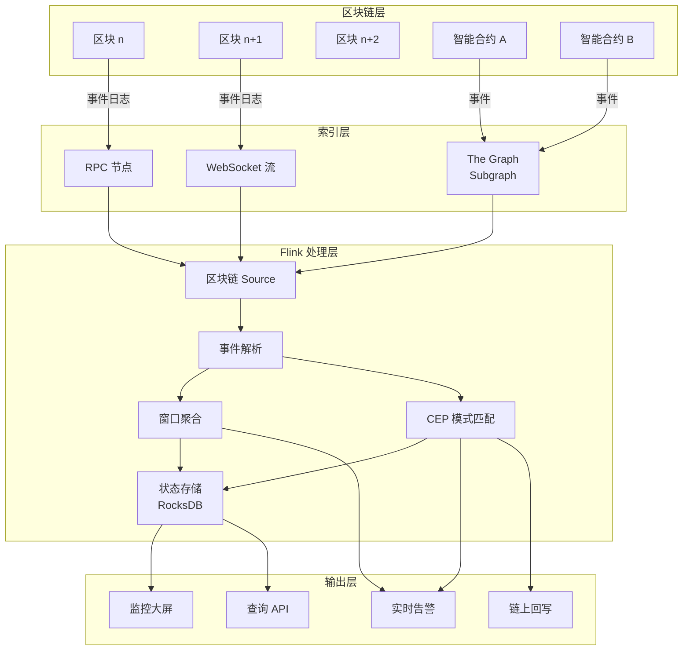
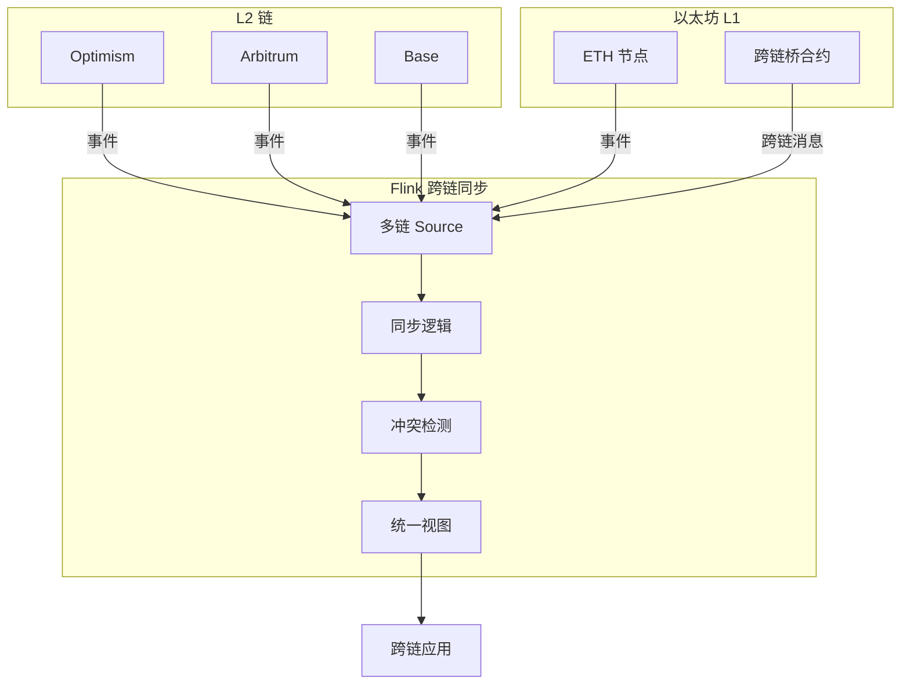
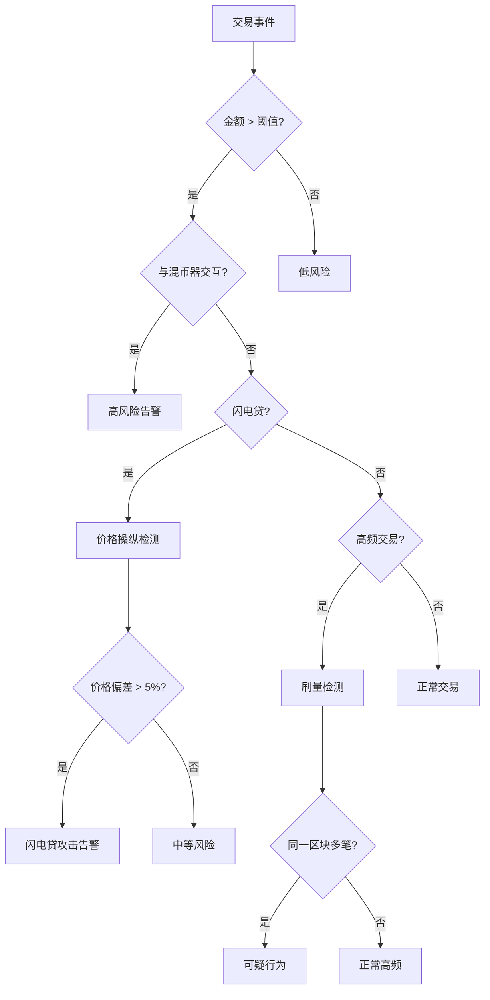

# Web3 与区块链流处理架构

> **所属阶段**: Knowledge/Frontier | **前置依赖**: [Flink Source 机制](../../Flink/02-core/time-semantics-and-watermark.md), [时间语义与窗口](../../Flink/02-core/time-semantics-and-watermark.md) | **形式化等级**: L4

---

## 1. 概念定义 (Definitions)

### 1.1 Web3 核心范式

**Def-K-06-80** (Web3 形式化定义): Web3 是一个去中心化的价值互联网协议栈，由三元组 $\mathcal{W}_3 = (\mathcal{L}, \mathcal{C}, \mathcal{T})$ 定义，其中：

- $\mathcal{L}$: 区块链账本集合，每个账本 $L_i$ 是不可变的分布式状态机
- $\mathcal{C}$: 智能合约程序集合，执行确定性状态转换
- $\mathcal{T}$: 通证经济模型，驱动网络共识与激励机制

**Web3 核心特征**:

| 特征 | Web2 | Web3 |
|------|------|------|
| 身份 | 中心化账户 | 自主主权身份 (SSI) |
| 数据所有权 | 平台控制 | 用户控制 |
| 价值流转 | 金融中介 | 点对点 |
| 信任模型 | 机构信任 | 密码学信任 |
| 可组合性 | API 集成 | 智能合约组合 |

### 1.2 区块链数据结构

**Def-K-06-81** (区块结构): 区块链中的区块 $B_n$ 定义为：

$$B_n = (H_n, H_{n-1}, T_n, TS_n, M_n, R_n)$$

其中：

- $H_n$: 区块哈希
- $H_{n-1}$: 父区块哈希（形成链式结构）
- $T_n$: 交易列表 $[tx_1, tx_2, ..., tx_m]$
- $TS_n$: 区块时间戳
- $M_n$: 矿工/验证者地址
- $R_n$: 收据根（包含事件日志）

**Def-K-06-82** (事件日志): 智能合约事件是状态变更的不可变记录：

$$\mathcal{E} = (addr, topics, data, blockNum, txHash, logIndex)$$

- `addr`: 合约地址
- `topics[0]`: 事件签名哈希
- `topics[1..3]`: 索引参数
- `data`: ABI 编码的非索引数据

### 1.3 区块链事件流

**Def-K-06-83** (区块链事件流): 区块链事件流 $\mathcal{S}_{chain}$ 是一个有序事件序列：

$$\mathcal{S}_{chain} = \langle e_1, e_2, e_3, ... \rangle$$

其中每个事件 $e_i$ 关联到特定区块高度 $h_i$ 和区块内位置 $pos_i$，具有严格的全序关系：

$$(h_i < h_j) \lor (h_i = h_j \land pos_i < pos_j) \Rightarrow e_i \prec e_j$$

**Def-K-06-84** (最终性窗口): 对于采用概率最终性的区块链（如 PoW），交易在区块深度 $k$ 后被认为最终确定：

$$Finalized(tx, k) \triangleq \exists B_n: tx \in B_n \land Head - n \geq k$$

其中 $Head$ 是链头高度。对于以太坊，$k = 12$ 对应约 3 分钟；对于 Solana，$k = 32$ 对应约 13 秒。

---

## 2. 属性推导 (Properties)

### 2.1 区块链数据流的固有属性

**Lemma-K-06-50** (追加不可变性): 区块链事件流 $\mathcal{S}_{chain}$ 满足追加写入语义，历史事件不可变更：

$$\forall i < j: e_i \text{ 写入后无法被修改 } \land e_j \text{ 追加依赖于 } e_i$$

*证明*: 由区块链的哈希链结构保证，修改历史区块将导致哈希不一致，被网络拒绝。

**Lemma-K-06-51** (最终一致性边界): 设区块链出块间隔为 $\Delta_b$，确认深度为 $k$，则事件可见性延迟满足：

$$\tau_{visible} \in [0, k \cdot \Delta_b]$$

对于以太坊：$\Delta_b \approx 12s$，$k = 12$，$\Rightarrow \tau_{visible} \leq 144s$

对于 Solana：$\Delta_b \approx 400ms$，$k = 32$，$\Rightarrow \tau_{visible} \leq 12.8s$

**Lemma-K-06-52** (事件溯源完备性): 区块链状态 $S_n$ 可完全由其创世状态 $S_0$ 和事件流前缀 $\mathcal{S}_{chain}[0:n]$ 重建：

$$S_n = fold(apply, S_0, \mathcal{S}_{chain}[0:n])$$

### 2.2 链上流处理的延迟特性

**Thm-K-06-50** (链上流处理延迟下界): 任何基于区块链的实时处理系统，其端到端延迟 $\tau_{e2e}$ 满足：

$$\tau_{e2e} \geq \tau_{network} + \tau_{block} + \tau_{finality} + \tau_{processing}$$

其中：

- $\tau_{network}$: 网络传播延迟（以太坊 ~1-3s）
- $\tau_{block}$: 出块间隔（以太坊 ~12s）
- $\tau_{finality}$: 最终性等待（概率最终性链）
- $\tau_{processing}$: 流处理引擎延迟（Flink 毫秒级）

*工程推论*: 对于以太坊，即使流处理引擎延迟为毫秒级，端到端延迟仍受限于出块间隔，约为 12-144 秒量级。

**Thm-K-06-51** (重组风险与一致性权衡): 设链重组概率为 $p_{reorg}$，则系统必须在一致性与延迟之间权衡：

$$P(\text{不一致}) = 1 - (1 - p_{reorg})^n$$

其中 $n$ 是处理的未确认区块数。采用 0 确认策略时 $n=1$，$P(\text{不一致}) = p_{reorg}$；采用完全确认策略时，$P(\text{不一致}) \approx 0$ 但延迟增加 $k \cdot \Delta_b$。

---

## 3. 关系建立 (Relations)

### 3.1 区块链 vs 传统流处理

| 维度 | 传统流处理 (Kafka/Flink) | 区块链流处理 |
|------|--------------------------|--------------|
| **数据来源** | 应用日志、传感器、点击流 | 智能合约事件、交易、状态变更 |
| **时间语义** | 处理时间/事件时间/摄取时间 | 区块时间戳（事件时间） |
| **顺序保证** | 分区有序、全局近似有序 | 区块内全序、跨区块全局有序 |
| **容错机制** | Checkpoint、WAL | 链式哈希、共识算法 |
| **可回溯性** | 配置保留期 | 永久（从创世区块） |
| **写入权限** | 集中控制 | 权限由共识决定 |
| **吞吐量** | 百万级 TPS | 以太坊 ~15 TPS，Solana ~65k TPS |

### 3.2 链上-链下数据流映射

```
┌─────────────────────────────────────────────────────────────────┐
│                     链上数据空间 (On-Chain)                      │
├─────────────────────────────────────────────────────────────────┤
│  ┌─────────┐    ┌─────────┐    ┌─────────┐                     │
│  │  区块   │───▶│  交易   │───▶│  事件   │                     │
│  │ B_{n}   │    │   tx    │    │   log   │                     │
│  └─────────┘    └─────────┘    └────┬────┘                     │
└─────────────────────────────────────┼───────────────────────────┘
                                      │ RPC / WebSocket
                                      ▼
┌─────────────────────────────────────────────────────────────────┐
│                    链下数据空间 (Off-Chain)                      │
├─────────────────────────────────────────────────────────────────┤
│  ┌─────────────┐    ┌─────────────┐    ┌─────────────────┐     │
│  │ Indexer     │───▶│  流处理器   │───▶│  分析/监控/应用  │     │
│  │(The Graph)  │    │   Flink     │    │  业务系统        │     │
│  └─────────────┘    └─────────────┘    └─────────────────┘     │
└─────────────────────────────────────────────────────────────────┘
```

### 3.3 与传统数据仓库的对比

区块链本质上是一个**不可变的分布式事件日志**，与传统事件溯源架构存在深刻映射：

| 传统事件溯源 | 区块链等价物 |
|-------------|-------------|
| Event Store | 区块链节点 (geth, Erigon) |
| Aggregate | 智能合约地址 |
| Event | 合约事件日志 |
| Snapshot | 状态根 (State Root) |
| Projection | Indexer / DApp 前端 |
| CQRS 查询端 | The Graph Subgraph |

---

## 4. 论证过程 (Argumentation)

### 4.1 链上实时分析的必要性

**为什么需要流处理而非批处理？**

**场景 1: DeFi 闪电贷攻击检测**

闪电贷攻击在单笔交易内完成，从借款到还款的时间窗口约为 15 秒（以太坊出块间隔）。批处理分析（每 5 分钟运行一次）将完全错过攻击窗口。

**场景 2: MEV 套利机会**

最大可提取价值 (MEV) 机会存在于内存池 (mempool) 阶段，出块前即可能被抢占。流处理可以监听 pending 交易，实时计算套利路径。

**场景 3: 稳定币脱锚监控**

USDT/USDC 脱锚事件可能在分钟级完成，需要亚秒级价格偏差检测才能触发风控措施。

**定量分析**:

| 应用场景 | 批处理延迟 | 流处理延迟 | 延迟容忍度 |
|---------|-----------|-----------|-----------|
| 闪电贷攻击 | 5 分钟 | < 1 秒 | 15 秒（致命） |
| MEV 套利 | 5 分钟 | < 200ms | 12 秒（致命） |
| 稳定币脱锚 | 1 小时 | < 5 秒 | 60 秒（严重） |
| 大额转账告警 | 1 小时 | < 10 秒 | 5 分钟（中等） |

### 4.2 架构设计的关键决策点

**决策 1: 监听节点 vs 第三方服务**

| 方案 | 延迟 | 成本 | 可靠性 | 适用场景 |
|------|------|------|--------|---------|
| 自托管节点 | 最低 | 高（运维） | 高 | 高频交易、MEV |
| 专业节点服务 (Alchemy/Infura) | 低 | 中 | 高 | 通用 DeFi 应用 |
| 事件流服务 (Chainlink Streams) | 低 | 低 | 中 | 价格数据、通用事件 |

**决策 2: 确认策略选择**

```
确认深度选择决策树:
                    ┌─────────────────┐
                    │ 应用容忍重组?   │
                    └────────┬────────┘
                             │
              ┌──────────────┴──────────────┐
              ▼                              ▼
           否 [零容忍]                    是 [可容忍]
              │                              │
              ▼                              ▼
    ┌─────────────────┐           ┌─────────────────┐
    │ 使用最终确认    │           │ 使用乐观确认    │
    │ k = 12 (ETH)    │           │ k = 1-3         │
    │ 延迟: ~3分钟    │           │ 延迟: ~12-36s   │
    └─────────────────┘           └─────────────────┘
```

---

## 5. 工程论证 / 架构设计 (Engineering Argument)

### 5.1 The Graph 协议架构

The Graph 是去中心化索引协议，为区块链数据提供 GraphQL 查询接口：

```
┌────────────────────────────────────────────────────────────────┐
│                      The Graph 网络架构                         │
├────────────────────────────────────────────────────────────────┤
│                                                                │
│  ┌──────────────┐     ┌──────────────┐     ┌──────────────┐   │
│  │   区块链      │────▶│   Indexer    │────▶│   Gateway    │   │
│  │  事件流       │     │  索引节点    │     │   查询网关   │   │
│  └──────────────┘     └──────────────┘     └──────────────┘   │
│                              │                       │        │
│                              ▼                       ▼        │
│                       ┌──────────────┐        ┌──────────────┐│
│                       │  PostgreSQL  │        │   DApp 前端  ││
│                       │   索引存储   │        │   GraphQL    ││
│                       └──────────────┘        └──────────────┘│
│                                                                │
│  Subgraph 定义: 事件处理器 + 实体模式                          │
│  - manifest: subgraph.yaml (数据源、处理器映射)                 │
│  - mappings: AssemblyScript 处理器                             │
│  - schema: GraphQL 实体定义                                    │
└────────────────────────────────────────────────────────────────┘
```

**与 Flink 对比**:

| 特性 | The Graph | Flink |
|------|-----------|-------|
| 查询语言 | GraphQL | SQL / DataStream API |
| 处理模型 | 事件触发 | 流式 / 批处理 |
| 状态管理 | PostgreSQL | RocksDB State Backend |
| 窗口支持 | 无原生支持 | 丰富窗口语义 |
| 复杂事件处理 | 有限 | CEP 库支持 |
| 实时性 | 最终一致 | 毫秒级延迟 |
| 去中心化 | 是 | 否 |

**互补策略**: 使用 The Graph 处理历史数据查询，Flink 处理实时复杂事件分析。

### 5.2 Chainlink 预言机数据流

Chainlink 提供去中心化预言机网络，将链下数据安全地引入链上：

```
┌────────────────────────────────────────────────────────────────┐
│                    Chainlink 数据流架构                         │
├────────────────────────────────────────────────────────────────┤
│                                                                │
│   链下数据源                                                    │
│  ┌─────────┐  ┌─────────┐  ┌─────────┐                        │
│  │ 交易所  │  │ 汇率API │  │ IoT设备 │                        │
│  │ 价格    │  │ 数据    │  │ 传感器  │                        │
│  └────┬────┘  └────┬────┘  └────┬────┘                        │
│       └─────────────┴─────────────┘                            │
│                   │                                            │
│                   ▼                                            │
│  ┌──────────────────────────────────┐                         │
│  │      Chainlink 预言机网络        │                         │
│  │  ┌─────┐ ┌─────┐ ┌─────┐ ┌─────┐│                         │
│  │  │Node1│ │Node2│ │Node3│ │NodeN││ (去中心化聚合)          │
│  │  └──┬──┘ └──┬──┘ └──┬──┘ └──┬──┘│                         │
│  │     └───────┴───────┴───────┘   │                         │
│  │              │                  │                         │
│  │         ┌────┴────┐             │                         │
│  │         │Aggregator│            │                         │
│  │         └────┬────┘             │                         │
│  └──────────────┼──────────────────┘                         │
│                 │                                              │
│                 ▼ 链上提交                                     │
│  ┌──────────────────────────────────┐                         │
│  │      智能合约                    │                         │
│  │  ┌──────────────────────────┐   │                         │
│  │  │ Chainlink Price Feed     │   │                         │
│  │  │ 最新价格数据              │   │                         │
│  │  │ Round ID, Answer, Timestamp│  │                         │
│  │  └──────────────────────────┘   │                         │
│  └──────────────────────────────────┘                         │
│                                                                │
│  Flink 可监听 Price Feed 合约事件，进行价格异常检测             │
└────────────────────────────────────────────────────────────────┘
```

### 5.3 Flink 区块链集成架构

**架构组件**:

```
┌────────────────────────────────────────────────────────────────┐
│               Flink 区块链流处理架构                            │
├────────────────────────────────────────────────────────────────┤
│                                                                │
│  ┌─────────────────────────────────────────────────────────┐  │
│  │                     数据源层                             │  │
│  │  ┌─────────────┐  ┌─────────────┐  ┌─────────────────┐ │  │
│  │  │ Web3j Source│  │ethers.js    │  │ 专用区块链Source │ │  │
│  │  │ (Java/Kotlin)│  │Source (Node)│  │ (自定义实现)    │ │  │
│  │  └─────────────┘  └─────────────┘  └─────────────────┘ │  │
│  └─────────────────────────────────────────────────────────┘  │
│                              │                                 │
│                              ▼                                 │
│  ┌─────────────────────────────────────────────────────────┐  │
│  │                   Flink 处理层                          │  │
│  │  ┌─────────────┐  ┌─────────────┐  ┌─────────────────┐ │  │
│  │  │ 事件解析    │─▶│  窗口聚合   │─▶│  CEP 模式匹配   │ │  │
│  │  │ (事件映射)  │  │ (滑动窗口)  │  │ (异常检测)      │ │  │
│  │  └─────────────┘  └─────────────┘  └─────────────────┘ │  │
│  │                                                          │  │
│  │  ┌─────────────┐  ┌─────────────┐  ┌─────────────────┐ │  │
│  │  │ 状态管理    │  │  连接查找   │  │  复杂计算       │ │  │
│  │  │ (地址画像)  │  │ (标签关联)  │  │ (风险评分)      │ │  │
│  │  └─────────────┘  └─────────────┘  └─────────────────┘ │  │
│  └─────────────────────────────────────────────────────────┘  │
│                              │                                 │
│                              ▼                                 │
│  ┌─────────────────────────────────────────────────────────┐  │
│  │                     输出层                               │  │
│  │  ┌─────────────┐  ┌─────────────┐  ┌─────────────────┐ │  │
│  │  │ Kafka 流   │  │  告警通知   │  │  链上回写       │ │  │
│  │  │ (下游消费)  │  │ (Webhook)   │  │ (MetaTx)        │ │  │
│  │  └─────────────┘  └─────────────┘  └─────────────────┘ │  │
│  └─────────────────────────────────────────────────────────┘  │
└────────────────────────────────────────────────────────────────┘
```

---

## 6. 实例验证 (Examples)

### 6.1 DeFi 闪电贷攻击检测系统

**场景**: 检测典型的闪电贷价格操纵攻击

**攻击模式识别**:

```
攻击序列特征:
1. flashLoan(大量代币A)
2. swap A → B (操纵价格)
3. 利用扭曲价格进行套利/清算
4. swap B → A (恢复价格)
5. repay 闪电贷
```

**Flink CEP 模式定义**:

```java
// 闪电贷攻击检测模式
Pattern<DeFiEvent, ?> flashLoanAttackPattern = Pattern
    .<DeFiEvent>begin("flashLoan", AfterMatchSkipStrategy.skipPastLastEvent())
    .where(evt -> evt.getEventType().equals("FlashLoan"))
    .where(evt -> evt.getAmount().compareTo(THRESHOLD) > 0)
    .next("priceImpact")
    .where(evt -> evt.getEventType().equals("Swap"))
    .where(evt -> evt.getPriceImpact().compareTo(IMPACT_THRESHOLD) > 0)
    .within(Time.seconds(30));

// 创建 CEP 流
PatternStream<DeFiEvent> patternStream = CEP.pattern(
    defiEventStream.keyBy(DeFiEvent::getPoolAddress),
    flashLoanAttackPattern
);

// 处理匹配结果
patternStream
    .process(new PatternHandler<DeFiEvent, Alert>() {
        @Override
        public void processMatch(
            Map<String, List<DeFiEvent>> pattern,
            Context ctx,
            Collector<Alert> out) {

            DeFiEvent flashLoan = pattern.get("flashLoan").get(0);
            DeFiEvent priceImpact = pattern.get("priceImpact").get(0);

            Alert alert = new Alert(
                AlertType.FLASH_LOAN_ATTACK,
                flashLoan.getTxHash(),
                flashLoan.getAmount(),
                priceImpact.getPriceImpact(),
                System.currentTimeMillis()
            );
            out.collect(alert);
        }
    })
    .addSink(new AlertWebhookSink());
```

### 6.2 实时洗钱检测 (AML)

**风险评分模型**:

```java
// 地址风险评分状态
ValueStateDescriptor<RiskProfile> riskStateDesc =
    new ValueStateDescriptor<>("risk-profile", RiskProfile.class);

// 实时风险计算
DataStream<RiskScore> riskStream = txStream
    .keyBy(Transaction::getFromAddress)
    .process(new KeyedProcessFunction<String, Transaction, RiskScore>() {
        private ValueState<RiskProfile> riskState;

        @Override
        public void open(Configuration parameters) {
            riskState = getRuntimeContext().getState(riskStateDesc);
        }

        @Override
        public void processElement(
            Transaction tx,
            Context ctx,
            Collector<RiskScore> out) throws Exception {

            RiskProfile profile = riskState.value();
            if (profile == null) {
                profile = new RiskProfile(tx.getFromAddress());
            }

            // 计算交易特征
            double velocityScore = calculateVelocity(tx, profile);
            double mixerScore = checkMixerInteraction(tx);
            double amountScore = evaluateAmountAnomaly(tx, profile);

            // 综合风险评分 (0-100)
            double totalScore =
                velocityScore * 0.3 +
                mixerScore * 0.4 +
                amountScore * 0.3;

            profile.update(tx);
            riskState.update(profile);

            // 高风险告警
            if (totalScore > 80) {
                out.collect(new RiskScore(
                    tx.getFromAddress(),
                    totalScore,
                    RiskLevel.HIGH,
                    ctx.timestamp()
                ));
            }
        }
    });
```

### 6.3 NFT 市场趋势分析

**实时指标计算**:

```java
// NFT 地板价滑动窗口计算
DataStream<NFTMetrics> floorPriceStream = nftEventStream
    .filter(evt -> evt.getEventType().equals("Sale"))
    .keyBy(NFTEvent::getCollectionAddress)
    .window(SlidingEventTimeWindows.of(
        Time.hours(24),  // 窗口大小
        Time.minutes(5)  // 滑动间隔
    ))
    .aggregate(new FloorPriceAggregate());

// 成交量趋势检测 (使用 ProcessFunction 实现自定义逻辑)
DataStream<TrendSignal> trendStream = nftEventStream
    .keyBy(NFTEvent::getCollectionAddress)
    .process(new TrendDetectionFunction() {
        private ListState<NFTEvent> recentEvents;

        @Override
        public void processElement(NFTEvent evt, Context ctx, Collector<TrendSignal> out) {
            // 维护最近 100 笔交易
            recentEvents.add(evt);

            // 计算趋势指标
            double volumeMomentum = calculateVolumeMomentum(recentEvents);
            double priceMomentum = calculatePriceMomentum(recentEvents);

            // 趋势信号生成
            if (volumeMomentum > 2.0 && priceMomentum > 0.1) {
                out.collect(new TrendSignal(
                    evt.getCollectionAddress(),
                    TrendType.BULLISH,
                    volumeMomentum,
                    priceMomentum,
                    ctx.timestamp()
                ));
            }
        }
    });
```

### 6.4 完整架构配置示例

```yaml
# flink-conf.yaml 区块链源配置
blockchain: 
  source: 
    type: websocket
    endpoint: wss://mainnet.infura.io/ws/v3/${INFURA_KEY}

  # 合约监听配置
  contracts: 
    - address: "0xA0b86991c6218b36c1d19D4a2e9Eb0cE3606eB48"  # USDC
      events: 
        - name: "Transfer"
          signature: "Transfer(address,address,uint256)"
          handler: com.example.handlers.USDC transferHandler
        - name: "Approval"
          signature: "Approval(address,address,uint256)"

    - address: "0x1F98431c8aD98523631AE4a59f267346ea31F984"  # Uniswap V3 Factory
      events: 
        - name: "PoolCreated"
          handler: com.example.handlers.PoolCreatedHandler

  # 确认策略
  confirmation: 
    strategy: "optimistic"  # optimistic | finalized
    blocks: 3               # 乐观确认等待 3 个区块

  # 重连配置
  reconnection: 
    maxRetries: 10
    backoffMs: 1000
    maxBackoffMs: 60000
```

---

## 7. 可视化 (Visualizations)

### 7.1 Web3 流处理全栈架构



### 7.2 跨链数据同步架构



### 7.3 DeFi 风险监控决策树



### 7.4 延迟与一致性权衡矩阵

```mermaid
quadrantChart
    title 区块链流处理：延迟 vs 一致性
    x-axis 低一致性(高重组风险) --> 高一致性
    y-axis 高延迟(分钟级) --> 低延迟(秒级)

    quadrant-1 实时交互应用
    quadrant-2 金融交易系统
    quadrant-3 数据分析批处理
    quadrant-4 探索性监控

    "0确认监听": [0.1, 0.9]
    "1确认策略": [0.3, 0.7]
    "3确认策略": [0.6, 0.5]
    "最终确认(12块)": [0.95, 0.1]
    "乐观确认+回滚": [0.7, 0.6]
    "The Graph": [0.8, 0.3]
```

---

## 8. 挑战与限制 (Challenges)

### 8.1 技术挑战

| 挑战 | 描述 | 缓解策略 |
|------|------|----------|
| **最终性延迟** | PoW 链需等待多区块确认 | 采用乐观确认 + 回滚机制 |
| **链重组** | 临时分叉导致历史变更 | Flink State 版本控制 |
| **Gas 波动** | 链上回写成本不可预测 | 批量提交 + Layer 2 |
| **数据爆炸** | 历史数据量巨大 | 分层存储 (热/温/冷) |
| **隐私限制** | 链上数据完全透明 | 零知识证明集成 |

### 8.2 监管合规考量

**旅行规则 (Travel Rule)**: FATF 要求 VASP 对超过阈值的转账交换客户信息

```
┌─────────────────────────────────────────────────────────────┐
│                   合规数据流                                │
├─────────────────────────────────────────────────────────────┤
│  链上交易                                                   │
│     │                                                       │
│     ▼                                                       │
│  ┌─────────────────┐                                        │
│  │ 金额 > 阈值?    │──否──▶ 正常处理                        │
│  └────────┬────────┘                                        │
│           │是                                               │
│           ▼                                                 │
│  ┌─────────────────┐                                        │
│  │ 双方 VASP 识别  │                                        │
│  └────────┬────────┘                                        │
│           │                                                 │
│     ┌─────┴─────┐                                           │
│     ▼           ▼                                           │
│  ┌──────┐   ┌──────┐                                        │
│  │ 信息 │   │ 信息 │                                        │
│  │ 交换 │◀─▶│ 交换 │                                        │
│  │ VASP │   │ VASP │                                        │
│  │  A   │   │  B   │                                        │
│  └──┬───┘   └──┬───┘                                        │
│     │          │                                            │
│     └────┬─────┘                                            │
│          ▼                                                  │
│    交易放行 / 冻结                                          │
└─────────────────────────────────────────────────────────────┘
```

### 8.3 2026 Web3 趋势展望

1. **并行 EVM**: Solana、Monad 等并行执行模型将显著提升吞吐量
2. **模块化区块链**: 执行层、数据可用性层、共识层分离
3. **账户抽象 (ERC-4337)**: 智能合约钱包普及，带来更多可编程性
4. **RWA 代币化**: 现实世界资产上链，增加合规流处理需求
5. **AI + Web3**: 去中心化 AI 推理与链上验证结合

---

## 9. 引用参考 (References)
