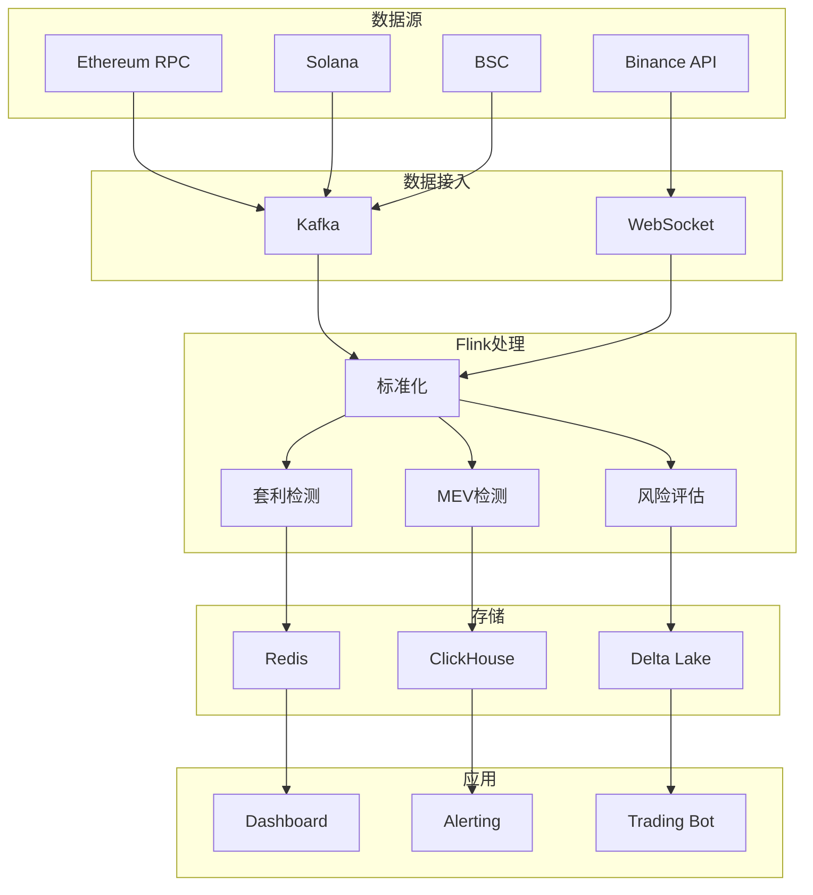
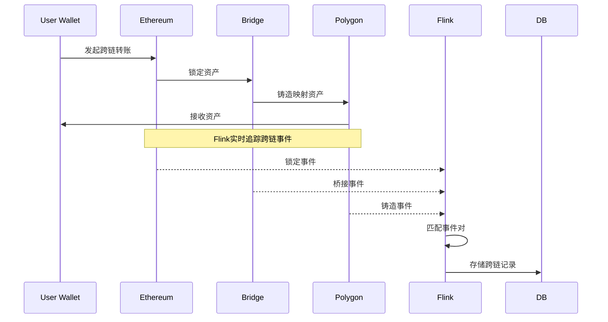
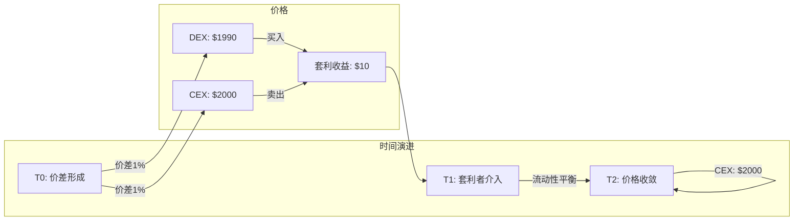

# Web3流数据分析与DeFi实时分析

> 所属阶段: Knowledge/06-frontier | 前置依赖: [Flink核心机制](../../Flink/02-core/time-semantics-and-watermark.md), [实时数据网格](realtime-data-mesh-practice.md) | 形式化等级: L3

## 1. 概念定义 (Definitions)

### Def-K-06-260: Web3 Streaming Data

**Web3流数据** 定义为区块链网络的实时事件流：

$$
\mathcal{W}_3 \triangleq \langle \mathcal{B}, \mathcal{T}, \mathcal{C}, \mathcal{E} \rangle
$$

其中：

- $\mathcal{B}$: Blockchain networks (Ethereum, Solana, etc.)
- $\mathcal{T}$: Transactions (交易)
- $\mathcal{C}$: Smart Contract events (合约事件)
- $\mathcal{E}$: Wallet/Address activities (钱包活动)

**数据特点**：

| 特性 | Web2 | Web3 |
|------|------|------|
| 数据结构 | 结构化 | 半结构化/原始 |
| 数据位置 | 中心化DB | 分布式账本 |
| 更新频率 | 分钟/小时 | 毫秒/秒 |
| 数据量 | GB级/天 | TB级/天 |
| 身份标识 | User ID | Wallet Address |

### Def-K-06-261: DeFi Streaming Analytics

**DeFi流分析** 针对去中心化金融的实时计算：

```
数据源: CEX (Binance) + DEX (Uniswap) + Blockchain (Ethereum)
        ↓
实时流: 价格流 + 交易流 + 区块流 + 事件日志
        ↓
分析层: 价格发现 + 套利检测 + 风险评估 + 异常检测
        ↓
应用层: 交易执行 + 风控告警 + 报告生成
```

### Def-K-06-262: Blockchain Event Log

**区块链事件日志** (EVM兼容链)：

```solidity
// Solidity事件定义示例
event Swap(
    address indexed sender,
    uint amount0In,
    uint amount1In,
    uint amount0Out,
    uint amount1Out,
    address indexed to
);

// 事件主题 (Topics)
Topic[0]: Event Signature Hash (0xc420...)
Topic[1]: sender address
Topic[2]: to address
Data: amount0In, amount1In, amount0Out, amount1Out (ABI encoded)
```

### Def-K-06-263: Wallet Clustering

**钱包聚类** 识别同一用户的多个地址：

$$
\text{Cluster}(w_1, w_2) = \begin{cases}
1 & \text{if } \text{BehavioralSimilarity}(w_1, w_2) > \theta \\
0 & \text{otherwise}
\end{cases}
$$

**聚类特征**：

- 交易时间模式
- 对手方重叠
- 资金来源/去向
- Gas Price偏好

### Def-K-06-264: MEV (Maximal Extractable Value)

**最大可提取价值** 是矿工/验证者通过交易排序获取的价值：

$$
\text{MEV} = \text{Revenue}_{optimal\_ordering} - \text{Revenue}_{standard\_ordering}
$$

**MEV类型**：

| 类型 | 描述 | 检测方法 |
|------|------|----------|
| **Arbitrage** | DEX间价格套利 | 价格监控+路径发现 |
| **Liquidation** | 抵押品清算 | 健康因子监控 |
| **Sandwich** | 三明治攻击 | 交易前后夹心 |
| **Front-running** | 抢先交易 | Gas Price异常 |

### Def-K-06-265: Cross-Chain Analytics

**跨链分析** 追踪多链资产流动：

```
Ethereum ──► Bridge ──► Polygon
    │                    │
    ▼                    ▼
 Uniswap            QuickSwap
    │                    │
    └──► User Wallet ◄──┘
```

**技术挑战**：

- 链间延迟差异
- 桥接事件匹配
- 统一地址格式

## 2. 属性推导 (Properties)

### Lemma-K-06-260: 区块链最终性延迟

**引理**: 交易最终性确认延迟：

$$
L_{finality} = n_{confirmations} \times t_{block}
$$

典型值：

- Ethereum: 12s × 12 = 144s
- Solana: 400ms × 32 = 12.8s
- Polygon: 2s × 128 = 256s

### Prop-K-06-260: DEX价格发现效率

**命题**: DEX价格收敛于CEX的速度：

$$
|P_{DEX}(t) - P_{CEX}(t)| \leq \epsilon, \quad t > t_{convergence}
$$

实测：ETH/USDC通常在1-3个区块内收敛

### Prop-K-06-261: 匿名用户识别精度

**命题**: 行为分析识别用户精度边界：

$$
\text{Precision} = \frac{TP}{TP + FP} \leq 1 - \frac{\text{UniqueUsers}}{\text{TotalAddresses}}
$$

### Lemma-K-06-261: 跨链套利窗口

**引理**: 跨链套利机会持续时间：

$$
\Delta t_{arbitrage} = L_{source} + L_{bridge} + L_{target} + L_{execution}
$$

典型值：15-60秒

## 3. 关系建立 (Relations)

### 3.1 Web3数据分析技术栈

```
┌─────────────────────────────────────────────────────────────────┐
│                    Web3 Analytics Stack                         │
├─────────────────────────────────────────────────────────────────┤
│  Visualization                                                  │
│  ├── Dune Analytics (SQL+Dashboard)                            │
│  ├── Nansen (Wallet Labels)                                    │
│  └── Custom Dashboards                                         │
├─────────────────────────────────────────────────────────────────┤
│  Query & Compute                                                │
│  ├── The Graph (Subgraphs)                                     │
│  ├── Flink (Streaming Analytics)                               │
│  ├── Databricks (Lakehouse)                                    │
│  └── Apache Doris/StarRocks (Real-time)                        │
├─────────────────────────────────────────────────────────────────┤
│  Data Indexing                                                  │
│  ├── The Graph (Decentralized)                                 │
│  ├── Covalent (Unified API)                                    │
│  ├── Chainbase (Multi-chain)                                   │
│  └── Custom Indexers                                           │
├─────────────────────────────────────────────────────────────────┤
│  Data Sources                                                   │
│  ├── Node RPC (Eth/Solana)                                     │
│  ├── WebSocket Streams                                         │
│  ├── Log Filters                                               │
│  └── CEX APIs (Binance, etc.)                                  │
└─────────────────────────────────────────────────────────────────┘
```

### 3.2 DeFi实时分析架构

```
┌─────────────────────────────────────────────────────────────────┐
│                    DeFi Streaming Analytics                     │
│                                                                 │
│  ┌──────────────────────────────────────────────────────────┐  │
│  │              Data Ingestion Layer                         │  │
│  │  ┌──────────┐  ┌──────────┐  ┌──────────┐              │  │
│  │  │ Binance  │  │ Uniswap  │  │ Ethereum │              │  │
│  │  │   API    │  │Subgraph  │  │   RPC    │              │  │
│  │  └────┬─────┘  └────┬─────┘  └────┬─────┘              │  │
│  └───────┼─────────────┼─────────────┼──────────────────────┘  │
│          │             │             │                         │
│          └─────────────┼─────────────┘                         │
│                        │ Kafka/Pulsar                          │
│  ┌─────────────────────▼────────────────────────────────────┐  │
│  │              Flink Processing Layer                       │  │
│  │  - Price normalization                                   │  │
│  │  - Windowed aggregations                                 │  │
│  │  - Arbitrage detection                                   │  │
│  │  - Risk scoring                                          │  │
│  └─────────────────────┬────────────────────────────────────┘  │
│                        │                                       │
│  ┌─────────────────────▼────────────────────────────────────┐  │
│  │              Storage Layer                                │  │
│  │  ┌──────────┐  ┌──────────┐  ┌──────────┐              │  │
│  │  │  Delta   │  │  Redis   │  │ ClickHouse│              │  │
│  │  │  Lake    │  │  (Hot)   │  │  (Analytics)            │  │
│  │  └──────────┘  └──────────┘  └──────────┘              │  │
│  └──────────────────────────────────────────────────────────┘  │
│                                                                 │
│  ┌──────────────────────────────────────────────────────────┐  │
│  │              Application Layer                            │  │
│  │  - Trading Bots    - Risk Dashboard    - Compliance      │  │
│  └──────────────────────────────────────────────────────────┘  │
└─────────────────────────────────────────────────────────────────┘
```

### 3.3 CEX vs DEX数据对比

| 维度 | CEX (中心化交易所) | DEX (去中心化交易所) |
|------|-------------------|---------------------|
| **延迟** | 10-100ms | 1-15s (区块确认) |
| **数据格式** | REST API/WebSocket | 事件日志/GraphQL |
| **订单簿** | 完整深度 | AMM池状态 |
| **身份** | KYC用户 | 匿名地址 |
| **交易量** | 高 | 中等 |
| **监管** | 严格 | 较松 |

## 4. 论证过程 (Argumentation)

### 4.1 为什么需要Web3流分析？

**传统方法问题**：

1. **批处理延迟**: Dune Analytics延迟数分钟至数小时
2. **数据孤岛**: 各链数据独立分析
3. **静态查询**: 无法实时响应市场变化

**流分析优势**：

1. **实时价格发现**: 毫秒级套利机会检测
2. **风险监控**: 大额转账/异常交易即时告警
3. **跨链追踪**: 统一视图追踪资金流动
4. **MEV检测**: 识别恶意交易排序

### 4.2 反模式

**反模式1: 直接查询节点**

```python
# ❌ 错误:高频RPC调用 for block in range(start, end):
    txs = web3.eth.get_block(block)['transactions']  # 压垮节点！
    process(txs)

# ✅ 正确:使用索引服务或流式订阅 subscription = web3.eth.subscribe('logs', {
    'address': CONTRACT_ADDRESS,
    'topics': [EVENT_SIGNATURE]
})
process_stream(subscription)
```

**反模式2: 忽视重组风险**

```python
# ❌ 错误:1个确认即处理 if tx['confirmations'] >= 1:
    execute_trade(tx)  # 可能被重组！

# ✅ 正确:等待足够确认数 REQUIRED_CONFIRMATIONS = {
    'ethereum': 12,
    'polygon': 128,
    'arbitrum': 10
}
if tx['confirmations'] >= REQUIRED_CONFIRMATIONS[chain]:
    execute_trade(tx)
```

**反模式3: 忽视Gas成本**

```python
# ❌ 错误:频繁小交易 for swap in small_swaps:
    execute(swap)  # Gas费可能超过收益！

# ✅ 正确:批处理+成本估算 batch = aggregate(small_swaps)
if estimated_gas_cost < expected_profit * 0.1:  # 成本<10%收益
    execute_batch(batch)
```

## 5. 形式证明 / 工程论证

### Thm-K-06-170: DEX价格有效性定理

**定理**: 在有效市场中，DEX价格收敛于理论价格：

$$
\lim_{t \to \infty} P_{DEX}(t) = P_{theoretical}
$$

**证明要点**：

1. 套利者消除价格差异
2. 套利利润 → 0 时价格收敛
3. 收敛速度取决于流动性和Gas成本

### Thm-K-06-171: 跨链一致性定理

**定理**: 跨链资产转移满足原子性约束：

$$
\text{Asset}_{source} + \text{Asset}_{target} = \text{Constant}, \quad \forall t
$$

### Thm-K-06-172: MEV检测完备性定理

**定理**: 流式分析可检测所有可观察MEV：

$$
\text{Detectable MEV} = \{m \in \text{MEV} : \text{Observable}(m)\}
$$

**限制**: 无法检测基于私有信息的MEV

## 6. 实例验证 (Examples)

### 6.1 Flink + Web3实时分析

```java

import org.apache.flink.streaming.api.environment.StreamExecutionEnvironment;
import org.apache.flink.streaming.api.datastream.DataStream;

public class DeFiAnalyticsJob {
    public static void main(String[] args) {
        StreamExecutionEnvironment env =
            StreamExecutionEnvironment.getExecutionEnvironment();

        // 1. 多源数据接入
        DataStream<BinanceTrade> binanceStream = env
            .addSource(new BinanceWebSocketSource("ethusdt"))
            .assignTimestampsAndWatermarks(
                WatermarkStrategy.forBoundedOutOfOrderness(Duration.ofMillis(100))
            );

        DataStream<UniswapSwap> uniswapStream = env
            .addSource(new EthereumLogSource(
                UNISWAP_CONTRACT,
                SWAP_EVENT_SIGNATURE
            ))
            .assignTimestampsAndWatermarks(
                WatermarkStrategy.forBoundedOutOfOrderness(Duration.ofSeconds(12))
            );

        // 2. 价格标准化
        DataStream<NormalizedPrice> normalizedPrices = binanceStream
            .map(trade -> new NormalizedPrice(
                "BINANCE",
                trade.getSymbol(),
                trade.getPrice(),
                trade.getTimestamp()
            ))
            .union(
                uniswapStream.map(swap -> new NormalizedPrice(
                    "UNISWAP",
                    swap.getPair(),
                    swap.calculatePrice(),
                    swap.getBlockTimestamp()
                ))
            );

        // 3. 跨交易所套利检测
        DataStream<ArbitrageOpportunity> arbitrages = normalizedPrices
            .keyBy(NormalizedPrice::getSymbol)
            .window(TumblingEventTimeWindows.of(Duration.ofSeconds(1)))
            .process(new ArbitrageDetectionFunction(0.005)); // 0.5%阈值

        // 4. 大额交易监控
        DataStream<Alert> whaleAlerts = uniswapStream
            .filter(swap -> swap.getUsdValue() > 1_000_000)  // >$1M
            .map(swap -> new Alert(
                "WHALE_TRADE",
                String.format("Large swap: $%.2f %s",
                    swap.getUsdValue(), swap.getPair()),
                swap.getTransactionHash(),
                swap.getBlockTimestamp()
            ));

        // 5. MEV检测
        DataStream<MevTransaction> mevTxs = env
            .addSource(new EthereumMempoolSource())
            .keyBy(tx -> tx.getBlockNumber())
            .process(new MevDetectionFunction());

        // 输出
        arbitrages.addSink(new TradingBotSink());
        whaleAlerts.addSink(new SlackAlertSink());
        mevTxs.addSink(new DashboardSink());

        env.execute("DeFi Real-time Analytics");
    }
}

// 套利检测函数
class ArbitrageDetectionFunction extends ProcessWindowFunction<
    NormalizedPrice, ArbitrageOpportunity, String, TimeWindow> {

    private final double minProfitThreshold;

    @Override
    public void process(String symbol, Context ctx,
                       Iterable<NormalizedPrice> prices,
                       Collector<ArbitrageOpportunity> out) {

        Map<String, Double> priceByVenue = new HashMap<>();
        for (NormalizedPrice p : prices) {
            priceByVenue.put(p.getVenue(), p.getPrice());
        }

        // 寻找最大价差
        double maxPrice = Collections.max(priceByVenue.values());
        double minPrice = Collections.min(priceByVenue.values());
        String maxVenue = getKeyByValue(priceByVenue, maxPrice);
        String minVenue = getKeyByValue(priceByVenue, minPrice);

        double spread = (maxPrice - minPrice) / minPrice;

        if (spread > minProfitThreshold) {
            out.collect(new ArbitrageOpportunity(
                symbol,
                minVenue,
                maxVenue,
                minPrice,
                maxPrice,
                spread,
                ctx.window().getEnd()
            ));
        }
    }
}
```

### 6.2 PyFlink Web3数据分析

```python
from pyflink.datastream import StreamExecutionEnvironment
from pyflink.table import StreamTableEnvironment
import json

# 初始化环境 env = StreamExecutionEnvironment.get_execution_environment()
t_env = StreamTableEnvironment.create(env)

# 定义以太坊事件表 t_env.execute_sql("""
CREATE TABLE ethereum_events (
    block_number BIGINT,
    block_hash STRING,
    transaction_hash STRING,
    log_index INT,
    address STRING,  -- 合约地址
    topic0 STRING,   -- 事件签名
    topic1 STRING,   -- 索引参数1
    topic2 STRING,   -- 索引参数2
    data STRING,     -- ABI编码数据
    block_timestamp TIMESTAMP(3),
    WATERMARK FOR block_timestamp AS block_timestamp - INTERVAL '12' SECOND
) WITH (
    'connector' = 'kafka',
    'topic' = 'ethereum-logs',
    'properties.bootstrap.servers' = 'kafka:9092',
    'format' = 'json'
);
""")

# Uniswap Swap事件解析 t_env.execute_sql("""
CREATE VIEW uniswap_swaps AS
SELECT
    transaction_hash,
    address as pool_address,
    -- 解析topic (sender)
    CONCAT('0x', SUBSTRING(topic1, 27, 40)) as sender,
    -- 解析data字段 (amount0In, amount1In, amount0Out, amount1Out)
    CAST(CONV(SUBSTRING(data, 3, 64), 16, 10) AS DECIMAL(38, 0)) / 1e18 as amount0_in,
    CAST(CONV(SUBSTRING(data, 67, 64), 16, 10) AS DECIMAL(38, 0)) / 1e18 as amount1_in,
    CAST(CONV(SUBSTRING(data, 131, 64), 16, 10) AS DECIMAL(38, 0)) / 1e18 as amount0_out,
    CAST(CONV(SUBSTRING(data, 195, 64), 16, 10) AS DECIMAL(38, 0)) / 1e18 as amount1_out,
    block_timestamp
FROM ethereum_events
WHERE topic0 = '0xc42079f94a6350d7e6235f29174924f928cc2ac818eb64fed8004e115fbcca67'  -- Swap事件签名
""")

# 实时交易量统计 t_env.execute_sql("""
CREATE TABLE hourly_volume (
    window_start TIMESTAMP(3),
    window_end TIMESTAMP(3),
    pool_address STRING,
    total_volume_usd DECIMAL(38, 2),
    trade_count BIGINT,
    PRIMARY KEY (window_start, pool_address) NOT ENFORCED
) WITH (
    'connector' = 'jdbc',
    'url' = 'jdbc:postgresql://db:5432/defi',
    'table-name' = 'hourly_volume'
);
""")

t_env.execute_sql("""
INSERT INTO hourly_volume
SELECT
    TUMBLE_START(block_timestamp, INTERVAL '1' HOUR) as window_start,
    TUMBLE_END(block_timestamp, INTERVAL '1' HOUR) as window_end,
    pool_address,
    SUM((amount0_in + amount0_out) *
        (SELECT price_usd FROM token_prices WHERE token = 'WETH')
    ) as total_volume_usd,
    COUNT(*) as trade_count
FROM uniswap_swaps
GROUP BY
    TUMBLE(block_timestamp, INTERVAL '1' HOUR),
    pool_address;
""")

# 异常检测:大额交易告警 t_env.execute_sql("""
CREATE TABLE whale_alerts (
    alert_time TIMESTAMP(3),
    transaction_hash STRING,
    pool_address STRING,
    usd_value DECIMAL(38, 2),
    alert_type STRING
) WITH (
    'connector' = 'kafka',
    'topic' = 'whale-alerts',
    'format' = 'json'
);
""")

t_env.execute_sql("""
INSERT INTO whale_alerts
SELECT
    NOW() as alert_time,
    transaction_hash,
    pool_address,
    (amount0_in + amount0_out) *
        (SELECT price_usd FROM token_prices WHERE token = 'WETH') as usd_value,
    CASE
        WHEN (amount0_in + amount0_out) *
             (SELECT price_usd FROM token_prices WHERE token = 'WETH') > 1000000
        THEN 'WHALE_SWAP'
        ELSE 'LARGE_SWAP'
    END as alert_type
FROM uniswap_swaps
WHERE (amount0_in + amount0_out) *
      (SELECT price_usd FROM token_prices WHERE token = 'WETH') > 100000;  -- >$100k
""")
```

### 6.3 跨链资金追踪

```python
class CrossChainTracer:
    """跨链资金追踪分析"""

    def __init__(self):
        self.bridges = {
            'ethereum': {
                'polygon': '0x...',  # PoS Bridge
                'arbitrum': '0x...', # Arbitrum Bridge
            }
        }

    async def trace_funds(self, start_tx_hash, start_chain):
        """追踪资金跨链流动"""
        traces = []
        queue = [(start_tx_hash, start_chain)]

        while queue:
            tx_hash, chain = queue.pop(0)

            # 获取交易详情
            tx = await self.get_transaction(tx_hash, chain)

            # 检查是否为跨链交易
            if self.is_bridge_transaction(tx, chain):
                bridge_event = self.parse_bridge_event(tx)

                # 查找目标链对应交易
                target_chain = bridge_event['target_chain']
                target_tx = await self.find_corresponding_tx(
                    bridge_event['nonce'],
                    bridge_event['sender'],
                    target_chain
                )

                traces.append({
                    'source': {'chain': chain, 'tx': tx_hash},
                    'bridge': bridge_event,
                    'target': {'chain': target_chain, 'tx': target_tx}
                })

                # 继续追踪目标链
                queue.append((target_tx, target_chain))
            else:
                # 普通转账,追踪资金流向
                for output in tx['outputs']:
                    if output['value'] > 0:
                        next_tx = await self.find_next_transaction(
                            output['address'],
                            tx['timestamp']
                        )
                        if next_tx:
                            queue.append((next_tx, chain))

        return traces

    def is_bridge_transaction(self, tx, chain):
        """判断是否为跨链桥交易"""
        bridge_contracts = self.bridges.get(chain, {}).values()
        return tx['to'] in bridge_contracts

    async def find_corresponding_tx(self, nonce, sender, target_chain):
        """在目标链查找对应交易"""
        # 使用The Graph或自定义索引
        query = """
        {
            bridgeEvents(
                where: {
                    nonce: %d,
                    sender: "%s"
                }
                orderBy: timestamp
                orderDirection: asc
            ) {
                transaction {
                    hash
                }
            }
        }
        """ % (nonce, sender)

        result = await self.query_subgraph(target_chain, query)
        return result['data']['bridgeEvents'][0]['transaction']['hash']

# Flink集成 class CrossChainAnalysis(KeyedProcessFunction):
    def __init__(self):
        self.tracer = CrossChainTracer()
        self.state = ValueStateDescriptor("trace_state", Types.STRING())

    async def process_element(self, tx, ctx):
        # 异步跨链追踪
        traces = await self.tracer.trace_funds(tx['hash'], tx['chain'])

        for trace in traces:
            yield CrossChainTransfer(
                source_chain=trace['source']['chain'],
                target_chain=trace['target']['chain'],
                amount=trace['bridge']['amount'],
                token=trace['bridge']['token'],
                timestamp=ctx.timestamp()
            )
```

### 6.4 实时风险评估

```python
# DeFi协议风险评估 class DeFiRiskScorer:
    def __init__(self):
        self.models = {
            'liquidity_risk': LiquidityRiskModel(),
            'impermanent_loss': ILModel(),
            'protocol_risk': ProtocolRiskModel()
        }

    def calculate_risk_score(self, position):
        """计算综合风险分数"""
        scores = {
            'liquidity': self.models['liquidity_risk'].score(position),
            'impermanent_loss': self.models['impermanent_loss'].score(position),
            'protocol': self.models['protocol_risk'].score(position['protocol']),
            'market': self.calculate_market_risk(position)
        }

        # 加权综合
        weights = {
            'liquidity': 0.25,
            'impermanent_loss': 0.30,
            'protocol': 0.25,
            'market': 0.20
        }

        total_score = sum(scores[k] * weights[k] for k in scores)

        return {
            'total_score': total_score,
            'components': scores,
            'risk_level': self.categorize_risk(total_score)
        }

    def calculate_market_risk(self, position):
        """计算市场风险 (VaR)"""
        returns = self.get_historical_returns(position['pool'])

        # 计算95% VaR
        var_95 = np.percentile(returns, 5)

        # 归一化到0-100分
        score = min(100, max(0, abs(var_95) * 100))
        return score

    def categorize_risk(self, score):
        if score < 20:
            return 'LOW'
        elif score < 50:
            return 'MEDIUM'
        elif score < 80:
            return 'HIGH'
        else:
            return 'CRITICAL'

# Flink风险监控作业 class RiskMonitoringJob:
    def __init__(self):
        self.scorer = DeFiRiskScorer()

    def run(self):
        env = StreamExecutionEnvironment.get_execution_environment()

        # 读取DeFi头寸数据
        positions = env.add_source(DeFiPositionSource())

        # 实时风险评分
        risk_scores = positions.map(
            lambda pos: self.scorer.calculate_risk_score(pos)
        )

        # 高风险告警
        high_risk = risk_scores.filter(lambda r: r['risk_level'] in ['HIGH', 'CRITICAL'])

        # 发送告警
        high_risk.add_sink(RiskAlertSink())

        # 存储历史
        risk_scores.add_sink(RiskHistorySink())

        env.execute("DeFi Risk Monitoring")
```

## 7. 可视化 (Visualizations)

### 7.1 Web3分析架构图



### 7.2 跨链资金追踪



### 7.3 DEX价格收敛



## 8. 引用参考 (References)

---

*文档版本: v1.0 | 创建日期: 2026-04-18*
