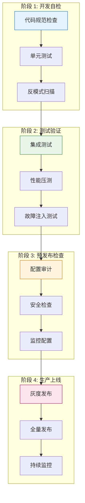
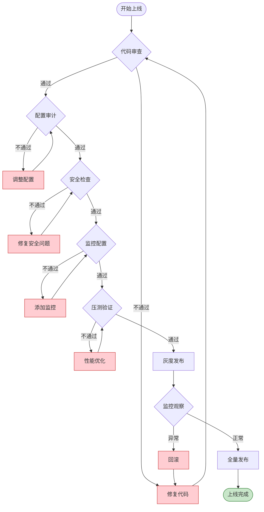
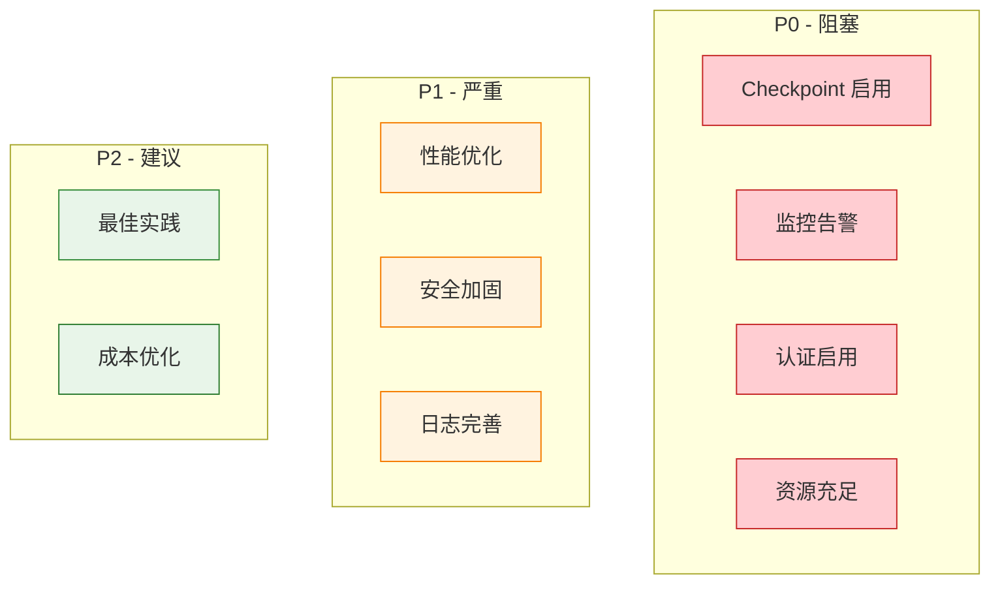

# Flink 生产环境上线检查清单

> **所属阶段**: Knowledge/07-best-practices | **前置依赖**: [Knowledge/09-anti-patterns/anti-pattern-checklist.md](../09-anti-patterns/anti-pattern-checklist.md) | **形式化等级**: L3
>
> 本清单提供 Flink 作业从开发到生产上线的完整检查流程，确保作业在生产环境中稳定运行。

---

## 目录

- [Flink 生产环境上线检查清单](#flink-生产环境上线检查清单)
  - [目录](#目录)
  - [1. 概念定义 (Definitions)](#1-概念定义-definitions)
  - [2. 属性推导 (Properties)](#2-属性推导-properties)
  - [3. 关系建立 (Relations)](#3-关系建立-relations)
    - [3.1 与反模式检测的关系](#31-与反模式检测的关系)
    - [3.2 检查阶段依赖关系](#32-检查阶段依赖关系)
  - [4. 论证过程 (Argumentation)](#4-论证过程-argumentation)
    - [4.1 检查优先级论证](#41-检查优先级论证)
    - [4.2 检查频率论证](#42-检查频率论证)
  - [5. 检查清单详解 (Checklist Details)](#5-检查清单详解-checklist-details)
    - [5.1 配置检查](#51-配置检查)
      - [5.1.1 Checkpoint 配置清单](#511-checkpoint-配置清单)
      - [5.1.2 Watermark 配置清单](#512-watermark-配置清单)
      - [5.1.3 资源配置清单](#513-资源配置清单)
    - [5.2 监控检查](#52-监控检查)
      - [5.2.1 基础监控清单](#521-基础监控清单)
      - [5.2.2 日志检查清单](#522-日志检查清单)
    - [5.3 安全审查](#53-安全审查)
      - [5.3.1 认证与授权清单](#531-认证与授权清单)
      - [5.3.2 数据安全清单](#532-数据安全清单)
      - [5.3.3 审计日志清单](#533-审计日志清单)
    - [5.4 性能验证](#54-性能验证)
      - [5.4.1 压测检查清单](#541-压测检查清单)
  - [6. 实例验证 (Examples)](#6-实例验证-examples)
    - [6.1 完整上线检查流程](#61-完整上线检查流程)
    - [6.2 配置模板库](#62-配置模板库)
  - [7. 可视化 (Visualizations)](#7-可视化-visualizations)
    - [7.1 上线检查流程图](#71-上线检查流程图)
    - [7.2 检查清单优先级矩阵](#72-检查清单优先级矩阵)
  - [8. 引用参考 (References)](#8-引用参考-references)

---

## 1. 概念定义 (Definitions)

**定义 (Def-K-07-01)**: 生产环境上线检查清单

> 生产环境上线检查清单是一组系统化的验证步骤，用于确保 Flink 作业在部署到生产环境前满足稳定性、可靠性、安全性和性能要求。

**形式化描述**:

设检查清单为 $C = \{c_1, c_2, ..., c_n\}$，其中每个检查项 $c_i = (category, priority, check_fn, remediation)$ 包含：

- **category**: 检查类别（配置/监控/安全/性能）
- **priority**: 优先级（P0-阻塞/P1-严重/P2-建议）
- **check_fn**: 验证函数，返回布尔值
- **remediation**: 修复方案

$$ProductionReady(Job) \iff \forall c_i \in C_{P0} : check_fn(c_i, Job) = true$$

**生产就绪标准** [^1][^2]:

| 维度 | 最低要求 | 推荐标准 |
|------|----------|----------|
| **可用性** | Checkpoint 成功率 > 95% | > 99.9% |
| **延迟** | p99 处理延迟 < SLA × 2 | < SLA × 1.5 |
| **准确性** | 无数据丢失 | Exactly-Once 语义 |
| **可观测性** | 基础指标监控 | 全链路追踪 |
| **安全性** | 认证启用 | 端到端加密 |

---

## 2. 属性推导 (Properties)

**命题 (Prop-K-07-01)**: 配置正确性蕴含稳定性

> 若所有 P0 级别配置检查通过，则作业在故障场景下可在 RTO 内恢复。

**推导过程**:

1. **Checkpoint 配置正确性** → 状态可恢复
   - 间隔 ≤ RTO/2，确保丢失数据窗口在容忍范围内
   - 超时 ≥ 典型持续时间 × 2，避免误报失败

2. **状态后端配置正确性** → 状态可持久化
   - RocksDB 增量 Checkpoint → 减少网络和存储压力
   - 本地恢复启用 → 减少恢复时间

3. **资源配置正确性** → 运行时可预测
   - 托管内存 ≥ 预估状态 × 1.5 → 避免 OOM
   - 网络缓冲区充足 → 避免背压级联

**引理 (Lemma-K-07-01)**: 监控完备性

> 完备的监控覆盖可检测 95% 以上的潜在故障。

监控三支柱覆盖 [^3]:

| 支柱 | 关键指标 | 检测能力 |
|------|----------|----------|
| **Metrics** | 吞吐量、延迟、背压 | 性能降级、瓶颈 |
| **Logs** | 错误日志、异常堆栈 | 逻辑错误、系统故障 |
| **Traces** | 端到端延迟分布 | 延迟根因定位 |

---

## 3. 关系建立 (Relations)

### 3.1 与反模式检测的关系

```
┌─────────────────────────────────────────────────────────────────────┐
│                     检查清单与反模式映射                              │
├─────────────────────────────────────────────────────────────────────┤
│                                                                     │
│  生产检查清单                    反模式检测                          │
│  ─────────────────             ─────────────────                    │
│                                                                     │
│  配置检查 ───────────────────► AP-02 Watermark 配置错误              │
│         │                                                           │
│         ├────────────────────► AP-03 Checkpoint 间隔不当             │
│         │                                                           │
│         └────────────────────► AP-10 资源配置不足                    │
│                                                                     │
│  代码审查 ───────────────────► AP-01 全局状态滥用                    │
│         │                                                           │
│         ├────────────────────► AP-05 阻塞 I/O                        │
│         │                                                           │
│         └────────────────────► AP-06 序列化配置错误                  │
│                                                                     │
│  监控检查 ───────────────────► AP-04 数据倾斜                        │
│         │                                                           │
│         └────────────────────► AP-08 背压忽略                        │
│                                                                     │
└─────────────────────────────────────────────────────────────────────┘
```

### 3.2 检查阶段依赖关系



---

## 4. 论证过程 (Argumentation)

### 4.1 检查优先级论证

**为何 P0 检查必须全部通过？**

| P0 检查项 | 失败后果 | 业务影响 |
|-----------|----------|----------|
| Checkpoint 未启用 | 故障时状态丢失 | 数据不一致，需全量回放 |
| 无监控告警 | 故障无法及时发现 | 业务中断时间延长 |
| 明文存储密码 | 安全风险 | 数据泄露，合规处罚 |
| 资源严重不足 | 频繁 OOM | 服务不可用 |

**为何允许 P1/P2 部分不通过？**

- P1 项影响性能或运维效率，但可通过后续优化改进
- P2 项为最佳实践建议，不影响基本功能

### 4.2 检查频率论证

| 检查类型 | 频率 | 触发条件 |
|----------|------|----------|
| **自动化检查** | 每次构建 | CI/CD 流水线 |
| **人工审查** | 每次发布 | 代码变更 > 100 行 |
| **巡检** | 每周 | 定时任务 |
| **专项检查** | 按需 | 故障后复盘、架构升级 |

---

## 5. 检查清单详解 (Checklist Details)

### 5.1 配置检查

#### 5.1.1 Checkpoint 配置清单

| 检查项 | 优先级 | 检查方法 | 通过标准 | 修复建议 |
|--------|--------|----------|----------|----------|
| **启用 Checkpoint** | P0 | 代码审查 | `env.enableCheckpointing()` 被调用 | 添加 Checkpoint 配置 |
| **间隔配置** | P0 | 配置审计 | RTO/5 ≤ interval ≤ RTO/2 | 基于 RTO 计算 |
| **超时配置** | P0 | 配置审计 | timeout ≥ 典型耗时 × 2 | 参考历史数据 |
| **最小间隔** | P1 | 配置审计 | minPause ≥ checkpoint 持续时间 | 避免 Checkpoint 堆积 |
| **最大并发** | P1 | 配置审计 | maxConcurrent ≤ 1（除非特殊需求） | 默认 1 |
| **增量 Checkpoint** | P1 | 配置审计 | 状态 > 1GB 时启用 | 减少存储压力 |
| **外部化清理** | P1 | 配置审计 | 配置为 RETAIN_ON_CANCELLATION | 防止误删 |
| **非对齐 Checkpoint** | P2 | 配置审计 | 高背压场景考虑启用 | 减少 Checkpoint 时间 |

**配置示例** [^1]:

```java
// ✅ 推荐配置模板
env.enableCheckpointing(60000); // 1分钟间隔
env.getCheckpointConfig().setCheckpointTimeout(300000); // 5分钟超时
env.getCheckpointConfig().setMinPauseBetweenCheckpoints(30000); // 30秒最小间隔
env.getCheckpointConfig().setMaxConcurrentCheckpoints(1);
env.getCheckpointConfig().enableExternalizedCheckpoints(
    ExternalizedCheckpointCleanup.RETAIN_ON_CANCELLATION
);

// 状态后端配置
env.setStateBackend(new EmbeddedRocksDBStateBackend(true)); // 增量Checkpoint
env.getCheckpointConfig().setCheckpointStorage("hdfs:///checkpoints");
```

#### 5.1.2 Watermark 配置清单

| 检查项 | 优先级 | 检查方法 | 通过标准 | 修复建议 |
|--------|--------|----------|----------|----------|
| **Watermark 生成** | P0 | 代码审查 | 所有流分配 Watermark | 添加 Watermark 策略 |
| **乱序延迟** | P0 | 配置审计 | 基于 p99 乱序延迟 + 20% 余量 | 测量数据源延迟 |
| **空闲超时** | P1 | 代码审查 | 多流场景配置 withIdleness | 避免窗口卡住 |
| **延迟数据处理** | P1 | 代码审计 | 配置 allowedLateness | 根据业务需求 |

**配置示例** [^4]:

```java
// ✅ 推荐 Watermark 配置
DataStream<Event> withWatermark = stream
    .assignTimestampsAndWatermarks(
        WatermarkStrategy
            .<Event>forBoundedOutOfOrderness(Duration.ofSeconds(30))
            .withIdleness(Duration.ofMinutes(2))
    );

// 窗口配置
withWatermark
    .keyBy(Event::getUserId)
    .window(TumblingEventTimeWindows.of(Time.minutes(1)))
    .allowedLateness(Time.minutes(5))
    .sideOutputLateData(lateTag);
```

#### 5.1.3 资源配置清单

| 检查项 | 优先级 | 检查方法 | 通过标准 | 修复建议 |
|--------|--------|----------|----------|----------|
| **TaskManager 内存** | P0 | 配置审计 | 总内存 ≥ (托管内存 + 2GB + 网络内存) × 1.2 | 重新计算 |
| **托管内存** | P0 | 配置审计 | ≥ 预估状态大小 / 并行度 × 1.5 | 增加内存 |
| **网络内存** | P1 | 配置审计 | ≥ min(并行度 × 64MB, 1GB) | 调整比例 |
| **JVM Heap** | P1 | 配置审计 | ≥ max(托管内存 × 0.5, 2GB) | 调整比例 |
| **托管内存占比** | P1 | 配置审计 | 状态密集型作业 > 0.5 | 调整 fraction |

**资源配置计算公式** [^2]:

```yaml
# 资源配置计算模板
estimated: 
  state_size_gb: 100          # 预估总状态大小
  parallelism: 20             # 并行度
  state_per_subtask_gb: 5     # 100/20

calculated: 
  managed_memory_per_tm: 7.5gb  # 5 * 1.5
  jvm_heap_min: 2gb
  network_memory: 1gb
  safety_factor: 1.2

  # TaskManager 总内存 = (7.5 + 2 + 1) * 1.2 ≈ 13GB
  total_tm_memory: 13gb

flink_conf: 
  taskmanager.memory.process.size: 13gb
  taskmanager.memory.managed.fraction: 0.6  # 7.5/13 ≈ 0.58
```

### 5.2 监控检查

#### 5.2.1 基础监控清单

| 检查项 | 优先级 | 检查方法 | 通过标准 | 告警规则 |
|--------|--------|----------|----------|----------|
| **Checkpoint 成功率** | P0 | 监控配置 | 成功率 > 95% | 连续 3 次失败告警 |
| **Checkpoint 持续时间** | P0 | 监控配置 | < timeout × 0.8 | 持续 > 60s 告警 |
| **背压时间** | P0 | 监控配置 | < 200ms/s | > 200ms/s 持续 5min |
| **延迟（Watermark）** | P0 | 监控配置 | < 配置的最大乱序延迟 | 持续 > 阈值 |
| **作业失败** | P0 | 监控配置 | 无失败 | 立即告警 |
| **数据倾斜** | P1 | 监控配置 | 最大/最小 subtask 比值 < 5 | 比值 > 5 告警 |
| **GC 时间** | P1 | 监控配置 | < CPU 时间的 10% | > 10% 告警 |
| **内存使用率** | P1 | 监控配置 | 托管内存 < 90% | > 90% 告警 |

**Prometheus 告警配置** [^5]:

```yaml
groups: 
  - name: flink_critical
    rules: 
      # P0: Checkpoint 失败
      - alert: FlinkCheckpointFailed
        expr: flink_jobmanager_checkpoint_numberOfFailedCheckpoints - flink_jobmanager_checkpoint_numberOfFailedCheckpoints offset 5m > 0
        for: 1m
        labels: 
          severity: critical
        annotations: 
          summary: "Flink Checkpoint 失败"
          description: "作业 {{ $labels.job_name }} Checkpoint 失败"

      # P0: 高背压
      - alert: FlinkHighBackpressure
        expr: flink_taskmanager_job_task_backPressuredTimeMsPerSecond > 200
        for: 5m
        labels: 
          severity: critical
        annotations: 
          summary: "Flink 任务背压过高"

      # P1: 数据倾斜
      - alert: FlinkDataSkew
        expr: |
          max by (task_name) (flink_taskmanager_job_task_numRecordsInPerSecond)
          /
          min by (task_name) (flink_taskmanager_job_task_numRecordsInPerSecond) > 5
        for: 10m
        labels: 
          severity: warning
        annotations: 
          summary: "Flink 数据倾斜"

      # P1: 内存压力
      - alert: FlinkMemoryPressure
        expr: flink_taskmanager_Status_JVM_Memory_Heap_Used / flink_taskmanager_Status_JVM_Memory_Heap_Committed > 0.85
        for: 5m
        labels: 
          severity: warning
        annotations: 
          summary: "Flink 内存使用率过高"
```

#### 5.2.2 日志检查清单

| 检查项 | 优先级 | 检查方法 | 通过标准 |
|--------|--------|----------|----------|
| **日志收集** | P0 | 配置审计 | 日志发送到集中系统（ELK/Fluentd） |
| **日志级别** | P1 | 配置审计 | 生产环境 INFO，调试时 DEBUG |
| **异常捕获** | P0 | 代码审查 | 所有异常都被捕获并记录 |
| **上下文信息** | P1 | 代码审查 | 错误日志包含足够的上下文 |

```java
// ✅ 推荐日志实践
private static final Logger LOG = LoggerFactory.getLogger(MyFunction.class);

@Override
public void processElement(Event event, Context ctx, Collector<Result> out) {
    try {
        // 处理逻辑
    } catch (ValidationException e) {
        // 记录足够的上下文信息
        LOG.error("事件处理失败 - key: {}, eventId: {}, error: {}",
            ctx.getCurrentKey(),
            event.getId(),
            e.getMessage(),
            e);

        // 发送到侧输出流
        ctx.output(invalidEventsTag, new InvalidEvent(event, e.getMessage()));
    }
}
```

### 5.3 安全审查

#### 5.3.1 认证与授权清单

| 检查项 | 优先级 | 检查方法 | 通过标准 | 修复建议 |
|--------|--------|----------|----------|----------|
| **Web UI 认证** | P0 | 配置审计 | 启用身份验证 | 配置安全认证 |
| **RPC 认证** | P0 | 配置审计 | 集群内 RPC 加密 | 启用 SASL/Kerberos |
| **REST API 认证** | P0 | 配置审计 | 启用 SSL/TLS | 配置 HTTPS |
| **Kerberos 集成** | P1 | 配置审计 | 与 HDFS/Yarn 集成 | 配置 keytab |
| **服务账户** | P1 | 配置审计 | 使用专用服务账户 | 避免 root |

**安全配置示例** [^6]:

```yaml
# flink-conf.yaml 安全配置

# Web UI 认证
security.ssl.rest.enabled: true
security.ssl.rest.keystore: /path/to/server.keystore
security.ssl.rest.keystore-password: ${KEYSTORE_PASSWORD}
security.ssl.rest.key-password: ${KEY_PASSWORD}

# 内部通信加密
security.ssl.internal.enabled: true
security.ssl.internal.keystore: /path/to/internal.keystore
security.ssl.internal.truststore: /path/to/internal.truststore

# Kerberos 认证
security.kerberos.login.keytab: /etc/security/keytabs/flink.keytab
security.kerberos.login.principal: flink@EXAMPLE.COM
security.kerberos.login.use-ticket-cache: false
```

#### 5.3.2 数据安全清单

| 检查项 | 优先级 | 检查方法 | 通过标准 | 修复建议 |
|--------|--------|----------|----------|----------|
| **敏感数据脱敏** | P0 | 代码审查 | 日志中无敏感信息 | 使用脱敏工具 |
| **配置文件加密** | P1 | 配置审计 | 密码等使用加密存储 | 使用 KeyVault |
| **传输加密** | P1 | 配置审计 | Kafka/HDFS 使用加密连接 | 启用 SSL |
| **静态数据加密** | P2 | 配置审计 | Checkpoint/Savepoint 加密 | 启用加密 |

#### 5.3.3 审计日志清单

| 检查项 | 优先级 | 检查方法 | 通过标准 |
|--------|--------|----------|----------|
| **作业提交审计** | P1 | 配置审计 | 记录作业提交者、时间、配置 |
| **Checkpoint 审计** | P1 | 监控检查 | 记录 Checkpoint 元数据 |
| **配置变更审计** | P1 | 流程检查 | 配置变更经过审批 |

### 5.4 性能验证

#### 5.4.1 压测检查清单

| 检查项 | 优先级 | 检查方法 | 通过标准 |
|--------|--------|----------|----------|
| **吞吐量测试** | P0 | 压测执行 | 达到预期 TPS × 1.5 |
| **延迟测试** | P0 | 压测执行 | p99 延迟 < SLA |
| **故障恢复测试** | P0 | 故障注入 | RTO 内恢复，无数据丢失 |
| **扩容测试** | P1 | 压测执行 | 扩容后吞吐线性增长 |
| **长尾测试** | P1 | 压测执行 | 长时间运行稳定 |

**压测脚本模板**:

```bash
#!/bin/bash
# Flink 作业压测脚本

FLINK_URL="http://localhost:8081"
JOB_JAR="target/my-job.jar"
TEST_DURATION=3600  # 1小时

# 1. 提交作业
echo "提交作业..."
JOB_ID=$(curl -X POST "$FLINK_URL/jars/upload" -F "jarfile=@$JOB_JAR" | jq -r '.filename' | xargs curl -X POST "$FLINK_URL/jars/{}/run" | jq -r '.jobid')

echo "作业 ID: $JOB_ID"

# 2. 监控指标
for i in $(seq 1 $((TEST_DURATION / 60))); do
    sleep 60

    # 获取吞吐量
    THROUGHPUT=$(curl -s "$FLINK_URL/jobs/$JOB_ID/vertices" | jq '[.vertices[].metrics.readRecords | tonumber] | add')

    # 获取延迟
    LATENCY=$(curl -s "$FLINK_URL/jobs/$JOB_ID" | jq '.vertices[] | select(.name | contains("Sink")) | .metrics.latency')

    # 获取背压
    BACKPRESSURE=$(curl -s "$FLINK_URL/jobs/$JOB_ID/vertices" | jq '[.vertices[].metrics.backPressuredTimeMsPerSecond | tonumber] | max')

    echo "[$i min] 吞吐量: $THROUGHPUT records/s, 延迟: ${LATENCY:-N/A} ms, 背压: ${BACKPRESSURE} ms"
done

# 3. 清理
curl -X PATCH "$FLINK_URL/jobs/$JOB_ID" -d '{"cancel-job": true}'
```

---

## 6. 实例验证 (Examples)

### 6.1 完整上线检查流程

**场景**: 电商实时推荐作业上线

**作业信息**:

- 输入: Kafka (用户行为事件，峰值 100K/s)
- 处理: 用户画像更新 + 实时推荐计算
- 输出: Redis (推荐结果)
- 状态: 用户画像 (预估 50GB)

**检查执行记录**:

```
=================================================================
Flink 作业上线检查报告
作业名称: realtime-recommendation-v2.3
检查时间: 2026-04-03 14:30:00
检查人: platform-team
=================================================================

[✓] 阶段 1: 代码审查 (15/15 通过)
    ✓ AP-01 全局状态检查: 无静态变量使用
    ✓ AP-05 阻塞 I/O 检查: 使用 AsyncFunction
    ✓ AP-06 序列化检查: 所有类型已注册 Kryo
    ...

[✓] 阶段 2: 配置审计 (12/12 通过)
    ✓ Checkpoint 间隔: 60s (RTO=300s, 符合 RTO/5)
    ✓ Checkpoint 超时: 300s
    ✓ 增量 Checkpoint: 已启用
    ✓ Watermark 乱序延迟: 30s (p99=25s)
    ✓ 托管内存: 8GB (预估状态 5GB × 1.5)
    ...

[✓] 阶段 3: 安全检查 (8/8 通过)
    ✓ Web UI 认证: 已启用
    ✓ RPC 加密: 已启用
    ✓ 敏感数据脱敏: 已确认
    ...

[✓] 阶段 4: 监控检查 (10/10 通过)
    ✓ Checkpoint 监控: 已配置告警
    ✓ 背压监控: 已配置告警
    ✓ 延迟监控: 已配置告警
    ...

[✓] 阶段 5: 压测验证 (6/6 通过)
    ✓ 吞吐量: 150K/s (目标 100K/s × 1.5)
    ✓ p99 延迟: 120ms (SLA 200ms)
    ✓ 故障恢复: 45s (RTO 300s)
    ✓ 长时间运行: 24h 稳定

=================================================================
结论: 所有检查通过，可以上线
建议: 上线后持续监控前 48 小时
=================================================================
```

### 6.2 配置模板库

**模板 1: 低延迟场景** (延迟敏感型)

```java
// 适用于: 风控、实时竞价等延迟敏感场景
env.enableCheckpointing(10000);  // 10s 间隔
env.getCheckpointConfig().setCheckpointTimeout(60000);
env.getCheckpointConfig().setMinPauseBetweenCheckpoints(5000);
env.setStateBackend(new HashMapStateBackend());  // 内存状态
env.getCheckpointConfig().setCheckpointStorage("hdfs:///checkpoints");
```

**模板 2: 大状态场景** (状态密集型)

```java
// 适用于: 长时间窗口、复杂状态计算
env.enableCheckpointing(300000);  // 5min 间隔
env.getCheckpointConfig().setCheckpointTimeout(600000);
env.setStateBackend(new EmbeddedRocksDBStateBackend(true));
env.getCheckpointConfig().setCheckpointStorage("hdfs:///checkpoints");

// 配置 State TTL
StateTtlConfig ttlConfig = StateTtlConfig
    .newBuilder(Time.days(7))
    .setUpdateType(StateTtlConfig.UpdateType.OnCreateAndWrite)
    .setStateVisibility(StateTtlConfig.StateVisibility.NeverReturnExpired)
    .build();
stateDescriptor.enableTimeToLive(ttlConfig);
```

---

## 7. 可视化 (Visualizations)

### 7.1 上线检查流程图



### 7.2 检查清单优先级矩阵



---

## 8. 引用参考 (References)

[^1]: Apache Flink Documentation, "Checkpoints," 2025. <https://nightlies.apache.org/flink/flink-docs-stable/docs/dev/datastream/fault-tolerance/checkpointing/>

[^2]: Apache Flink Documentation, "Configuration," 2025. <https://nightlies.apache.org/flink/flink-docs-stable/docs/deployment/config/>

[^3]: Beyer, B. et al., "Site Reliability Engineering," O'Reilly Media, 2016. <https://sre.google/sre-book/table-of-contents/>

[^4]: Apache Flink Documentation, "Timestamps and Watermarks," 2025. <https://nightlies.apache.org/flink/flink-docs-stable/docs/concepts/time/>

[^5]: Apache Flink Documentation, "Metrics," 2025. <https://nightlies.apache.org/flink/flink-docs-stable/docs/ops/metrics/>

[^6]: Apache Flink Documentation, "Security," 2025. <https://nightlies.apache.org/flink/flink-docs-stable/docs/deployment/security/>

---

*文档版本: v1.0 | 更新日期: 2026-04-03 | 状态: 已完成*
