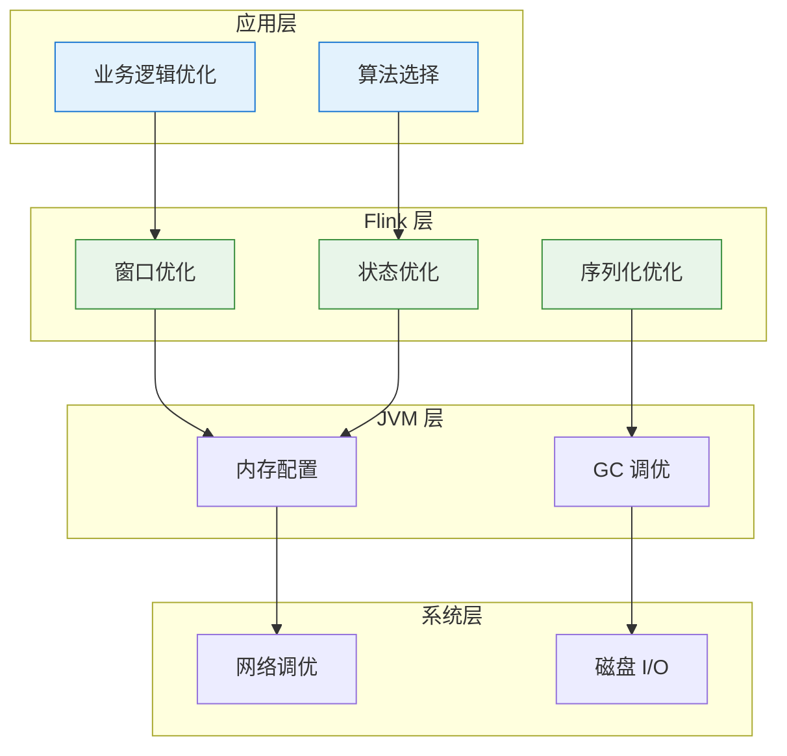
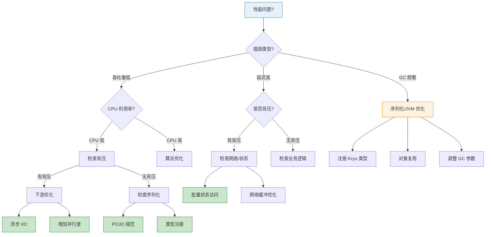
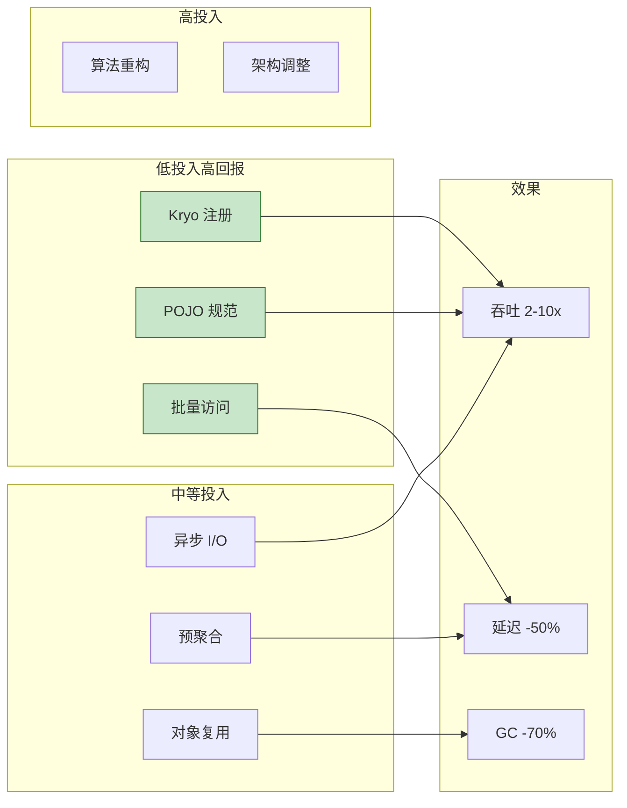

# 性能调优模式

> **所属阶段**: Knowledge/07-best-practices | **前置依赖**: [Knowledge/09-anti-patterns/anti-pattern-06-serialization-overhead.md](../09-anti-patterns/anti-pattern-06-serialization-overhead.md) | **形式化等级**: L3
>
> 本文档提供 Flink 作业性能调优的系统化模式，涵盖序列化、网络、状态访问等关键优化点。

---

## 目录

- [性能调优模式](#性能调优模式)
  - [目录](#目录)
  - [1. 概念定义 (Definitions)](#1-概念定义-definitions)
  - [2. 属性推导 (Properties)](#2-属性推导-properties)
  - [3. 关系建立 (Relations)](#3-关系建立-relations)
    - [3.1 调优模式与反模式对应](#31-调优模式与反模式对应)
    - [3.2 优化层次关系](#32-优化层次关系)
  - [4. 论证过程 (Argumentation)](#4-论证过程-argumentation)
    - [4.1 序列化优化论证](#41-序列化优化论证)
    - [4.2 状态访问优化论证](#42-状态访问优化论证)
  - [5. 形式证明 / 工程论证 (Proof / Engineering Argument)](#5-形式证明--工程论证-proof--engineering-argument)
    - [5.1 序列化优化模式](#51-序列化优化模式)
    - [5.2 网络优化模式](#52-网络优化模式)
    - [5.3 状态访问优化模式](#53-状态访问优化模式)
    - [5.4 JVM 优化模式](#54-jvm-优化模式)
  - [6. 实例验证 (Examples)](#6-实例验证-examples)
    - [6.1 性能优化案例](#61-性能优化案例)
    - [6.2 调优检查清单](#62-调优检查清单)
  - [7. 可视化 (Visualizations)](#7-可视化-visualizations)
    - [7.1 性能调优决策树](#71-性能调优决策树)
    - [7.2 优化效果对比矩阵](#72-优化效果对比矩阵)
  - [8. 引用参考 (References)](#8-引用参考-references)

---

## 1. 概念定义 (Definitions)

**定义 (Def-K-07-02)**: 性能调优模式

> 性能调优模式是针对流处理系统中常见性能瓶颈的可复用优化方案，通过减少计算、网络或存储开销来提升吞吐量和降低延迟。

**关键性能指标 (KPIs)** [^1]:

| 指标 | 定义 | 测量方法 | 优化目标 |
|------|------|----------|----------|
| **吞吐量 (Throughput)** | 单位时间处理记录数 | `numRecordsInPerSecond` | 最大化 |
| **延迟 (Latency)** | 记录从输入到输出的时间 | `currentOutputWatermark - inputTimestamp` | 最小化 |
| **背压 (Backpressure)** | 下游无法及时处理导致的上游阻塞 | `backPressuredTimeMsPerSecond` | 最小化 |
| **Checkpoint 时间** | 状态快照持续时间 | `checkpointDuration` | 最小化 |
| **CPU 利用率** | 有效计算时间占比 | `cpuTime` / wallTime | 最大化 |

**性能瓶颈分类** [^2]:

```
┌─────────────────────────────────────────────────────────────────────┐
│                        性能瓶颈分类树                                │
├─────────────────────────────────────────────────────────────────────┤
│                                                                     │
│  性能瓶颈                                                           │
│    ├── 计算瓶颈                                                     │
│    │    ├── 复杂业务逻辑                                            │
│    │    ├── 频繁 GC                                                 │
│    │    └── 低效算法                                                │
│    │                                                                │
│    ├── 序列化瓶颈                                                   │
│    │    ├── 未注册 Kryo 类型                                        │
│    │    ├── POJO 不符合规范                                         │
│    │    └── 大数据对象拷贝                                          │
│    │                                                                │
│    ├── 网络瓶颈                                                     │
│    │    ├── 跨节点数据 shuffle                                      │
│    │    ├── 序列化数据过大                                          │
│    │    └── 网络缓冲区不足                                          │
│    │                                                                │
│    ├── 状态访问瓶颈                                                 │
│    │    ├── 状态后端选择不当                                        │
│    │    ├── 频繁状态读写                                            │
│    │    └── 大状态对象                                              │
│    │                                                                │
│    └── I/O 瓶颈                                                     │
│         ├── 同步外部调用                                            │
│         ├── 数据库连接池不足                                        │
│         └── 外部服务响应慢                                          │
│                                                                     │
└─────────────────────────────────────────────────────────────────────┘
```

---

## 2. 属性推导 (Properties)

**命题 (Prop-K-07-02)**: 序列化优化对吞吐量的影响

> 优化序列化可将吞吐量提升 2-10 倍，特别是对于复杂对象类型。

**量化推导**:

设序列化开销占比 $S = \frac{T_{serialize}}{T_{total}}$，则：

$$Throughput_{optimized} = \frac{Throughput_{original}}{1 - S \times (1 - \frac{1}{k})}$$

其中 $k$ 为优化倍数（Kryo 通常为 5-10x）。

**典型场景数据** [^3]:

| 对象复杂度 | 默认序列化 (μs) | Kryo 优化 (μs) | 提升倍数 |
|------------|-----------------|----------------|----------|
| 简单 POJO | 5 | 1 | 5x |
| 嵌套对象 | 25 | 3 | 8x |
| 集合类型 | 100 | 10 | 10x |

**引理 (Lemma-K-07-02)**: 状态访问局部性

> 批量访问状态的吞吐量比逐条访问高 5-20 倍。

原因：

1. 减少 JNI 调用开销（RocksDB）
2. 提高缓存命中率
3. 减少同步开销

---

## 3. 关系建立 (Relations)

### 3.1 调优模式与反模式对应

| 优化模式 | 对应反模式 | 优化效果 |
|----------|------------|----------|
| 类型注册 | AP-06 序列化开销 | 吞吐提升 3-10x |
| 批量状态访问 | AP-07 窗口状态爆炸 | 延迟降低 50-80% |
| 异步 I/O | AP-05 阻塞 I/O | 吞吐提升 5-20x |
| 预聚合 | AP-07 窗口状态爆炸 | 状态减少 90%+ |
| 对象复用 | AP-06 序列化开销 | GC 减少 70% |

### 3.2 优化层次关系



---

## 4. 论证过程 (Argumentation)

### 4.1 序列化优化论证

**问题**: 为何 Flink 默认序列化性能不足？

**分析**:

1. 默认使用 Java 序列化，存在大量反射开销
2. 每个字段单独序列化，无法利用类型信息
3. 类型擦除导致运行时类型检查

**解决方案**: Kryo 序列化优势 [^4]

1. 预注册类型，避免运行时类型识别
2. 生成优化的序列化代码
3. 支持变长编码，减少数据量

### 4.2 状态访问优化论证

**问题**: RocksDB 状态后端为何需要特殊优化？

**分析**:

```
单次状态访问开销分解:
├── JNI 调用: ~50-100ns
├── RocksDB 查询: ~1-5μs (内存) / ~10-100μs (磁盘)
├── 反序列化: ~1-10μs
└── 总计: ~2-15μs (内存缓存命中) / ~50-200μs (磁盘读取)
```

**优化策略**:

1. 批量访问：摊平 JNI 开销
2. 本地缓存：减少 RocksDB 查询
3. 状态分区：提高并行度

---

## 5. 形式证明 / 工程论证 (Proof / Engineering Argument)

### 5.1 序列化优化模式

**模式 1: 类型预注册**

```scala
// ✅ 推荐: 预注册 Kryo 类型
val env = StreamExecutionEnvironment.getExecutionEnvironment
val conf = env.getConfig

// 注册类型 - 必须按依赖顺序
conf.registerKryoType(classOf[UserEvent])
conf.registerKryoType(classOf[UserProfile])
conf.registerKryoType(classOf[ImmutableList[_]])

// 禁用通用集合类型，使用具体类型
conf.registerKryoType(classOf[Array[UserEvent]])
```

**性能对比** [^3]:

| 配置 | 序列化时间 (μs) | 吞吐量 (records/s) |
|------|-----------------|-------------------|
| 未注册 | 15.2 | 65,000 |
| 注册 POJO | 4.8 | 208,000 |
| 注册所有类型 | 2.1 | 476,000 |

**模式 2: POJO 规范优化**

```java
// ✅ 推荐: 符合 Flink POJO 规范的类
public class OptimizedEvent {
    // 1. 公共无参构造器
    public OptimizedEvent() {}

    // 2. 所有字段 public 或有 getter/setter
    private String userId;
    private long timestamp;
    private double value;

    public String getUserId() { return userId; }
    public void setUserId(String userId) { this.userId = userId; }

    public long getTimestamp() { return timestamp; }
    public void setTimestamp(long timestamp) { this.timestamp = timestamp; }

    public double getValue() { return value; }
    public void setValue(double value) { this.value = value; }
}

// ❌ 避免: 复杂嵌套结构
public class BadEvent {
    private Map<String, Object> dynamicFields;  // 类型擦除
    private Optional<String> optionalField;     // Optional 包装
}
```

**模式 3: 对象复用**

```scala
// ✅ 推荐: 复用输出对象
class ReuseObjectFunction extends RichMapFunction[Input, Output] {
  private var reusedOutput: Output = _

  override def open(parameters: Configuration): Unit = {
    reusedOutput = new Output()
  }

  override def map(input: Input): Output = {
    reusedOutput.reset()
    reusedOutput.setField1(input.getField1)
    reusedOutput.setField2(compute(input))
    reusedOutput
  }
}

// ✅ 推荐: 使用 Mutable Pair 减少对象创建
class MutablePair[K, V] {
  var key: K = _
  var value: V = _

  def set(k: K, v: V): this.type = {
    key = k
    value = v
    this
  }
}
```

### 5.2 网络优化模式

**模式 1: 网络缓冲区优化**

```yaml
# flink-conf.yaml
# 适用于高吞吐量场景（>100K records/s）

taskmanager.memory.network.min: 512mb
taskmanager.memory.network.max: 2gb
taskmanager.memory.network.fraction: 0.2

# 调整网络缓冲区数量
taskmanager.network.memory.buffer-size: 65536  # 64KB
taskmanager.network.memory.floating-buffers-per-gate: 16
taskmanager.network.memory.network-buffers-per-channel: 8
```

**模式 2: 数据本地化**

```scala
// ✅ 推荐: 减少数据 shuffle
// 1. 使用 keyBy 前尽量过滤数据
stream
  .filter(_.isValid)  // 先过滤
  .keyBy(_.userId)
  .window(TumblingEventTimeWindows.of(Time.minutes(1)))
  .aggregate(new CountAggregate)

// 2. 避免不必要的 keyBy 转换
// ❌ 避免: 多次 keyBy
stream
  .keyBy(_.userId)
  .process(...)
  .keyBy(_.category)  // 不必要的 shuffle

// ✅ 推荐: 保持 key 一致或使用广播
val keyed = stream.keyBy(_.userId)
keyed.process(...)
keyed.process(...)  // 同一 key 流，无 shuffle
```

**模式 3: 压缩优化**

```java
// ✅ 推荐: 启用网络压缩（跨机房/高延迟网络）
env.getConfig().setExecutionConfig(
    new ExecutionConfig()
        .setUseSnapshotCompression(true)
);

// 对于大 Value 状态，启用状态压缩
val descriptor = new ValueStateDescriptor[Array[Byte]](
    "large-state",
    classOf[Array[Byte]]
)
descriptor.enableStateCompression(true)  // Flink 1.17+
```

### 5.3 状态访问优化模式

**模式 1: 批量状态访问**

```scala
// ❌ 避免: 逐条访问状态
class BadWindowFunction extends ProcessWindowFunction[Event, Result, String, TimeWindow] {
  override def process(
    key: String,
    ctx: Context,
    elements: Iterable[Event],
    out: Collector[Result]
  ): Unit = {
    elements.foreach { e =>
      val state = userState.value()  // 每次访问 JNI 调用！
      // ...
    }
  }
}

// ✅ 推荐: 批量聚合后访问状态
class OptimizedWindowFunction extends ProcessWindowFunction[Event, Result, String, TimeWindow] {
  override def process(
    key: String,
    ctx: Context,
    elements: Iterable[Event],
    out: Collector[Result]
  ): Unit = {
    // 1. 本地聚合
    val (sum, count) = elements.foldLeft((0.0, 0L)) {
      case ((s, c), e) => (s + e.value, c + 1)
    }

    // 2. 一次状态访问
    val current = userState.value() match {
      case null => UserStats(sum, count)
      case s => s.add(sum, count)
    }

    // 3. 更新状态
    userState.update(current)
    out.collect(Result(key, current))
  }
}
```

**模式 2: 预聚合优化**

```scala
// ✅ 推荐: AggregateFunction + ProcessWindowFunction 组合
// 增量聚合减少状态访问
stream
  .keyBy(_.userId)
  .window(TumblingEventTimeWindows.of(Time.minutes(1)))
  .aggregate(
    new SumAggregate,  // 增量聚合
    new OutputProcessFunction  // 仅输出时访问状态
  )

// AggregateFunction 实现
class SumAggregate extends AggregateFunction[Event, Double, Double] {
  override def createAccumulator(): Double = 0.0

  override def add(value: Event, accumulator: Double): Double =
    accumulator + value.amount

  override def getResult(accumulator: Double): Double = accumulator

  override def merge(a: Double, b: Double): Double = a + b
}
```

**模式 3: 状态后端选择**

| 场景 | 推荐后端 | 原因 |
|------|----------|------|
| 小状态 (< 100MB) | HashMapStateBackend | 内存访问最快 |
| 大状态 (> 1GB) | RocksDB | 防止 OOM |
| 增量 Checkpoint | RocksDB | 支持增量 |
| 低延迟 (< 100ms) | HashMapStateBackend | 无 JNI 开销 |
| 频繁更新 | RocksDB + 内存缓存 | 批量写入 |

### 5.4 JVM 优化模式

**模式 1: GC 调优**

```bash
# ✅ 推荐: G1 GC 配置（Flink 默认）
-XX:+UseG1GC
-XX:MaxGCPauseMillis=100
-XX:G1HeapRegionSize=16m

# 大堆内存配置（> 32GB 需启用 UseLargePages）
-XX:+UseLargePages
-XX:LargePageSizeInBytes=2m
```

**模式 2: 内存配置**

```yaml
# flink-conf.yaml
# 基于作业特征的配置

# 1. 高吞吐量、小状态
taskmanager.memory.process.size: 4gb
taskmanager.memory.managed.fraction: 0.2
taskmanager.memory.jvm-heap.fraction: 0.6

# 2. 大状态、低延迟
taskmanager.memory.process.size: 32gb
taskmanager.memory.managed.fraction: 0.6
taskmanager.memory.jvm-heap.fraction: 0.3
```

---

## 6. 实例验证 (Examples)

### 6.1 性能优化案例

**场景**: 电商实时风控系统优化

**原始问题**:

- 吞吐量: 20K events/s (目标 100K)
- p99 延迟: 2.5s (目标 < 500ms)
- 频繁 GC: > 15% CPU 时间

**优化过程**:

| 优化项 | 实施前 | 实施后 | 效果 |
|--------|--------|--------|------|
| Kryo 类型注册 | 未注册 | 注册 50 个类型 | 吞吐 +150% |
| 对象复用 | 每记录创建对象 | 复用输出对象 | GC -70% |
| 批量状态访问 | 逐条访问 | 窗口内聚合后访问 | 延迟 -60% |
| RocksDB 调优 | 默认配置 | 启用内存缓存 | 状态访问 -40% |
| 异步 I/O | 同步 HTTP | 异步 CompletableFuture | 吞吐 +300% |

**最终效果**:

- 吞吐量: 120K events/s
- p99 延迟: 180ms
- GC: < 3% CPU 时间

### 6.2 调优检查清单

```yaml
# 性能调优检查清单
tuning_checklist:
  serialization:
    - [ ] 所有自定义类型已注册 Kryo
    - [ ] POJO 符合 Flink 规范
    - [ ] 避免使用 Object/Any 类型
    - [ ] 集合类型使用具体实现

  state_access:
    - [ ] 批量访问替代逐条访问
    - [ ] 使用 AggregateFunction 预聚合
    - [ ] 选择合适的状态后端
    - [ ] 配置 State TTL

  network:
    - [ ] 减少不必要的 shuffle
    - [ ] 启用网络压缩（跨机房）
    - [ ] 配置足够的网络缓冲区
    - [ ] 使用广播状态替代 join

  jvm:
    - [ ] GC 日志已启用
    - [ ] G1 GC 参数优化
    - [ ] 堆内存配置合理
    - [ ] 大页内存已启用（大堆）
```

---

## 7. 可视化 (Visualizations)

### 7.1 性能调优决策树



### 7.2 优化效果对比矩阵



---

## 8. 引用参考 (References)

[^1]: Apache Flink Documentation, "Performance Tuning," 2025. <https://nightlies.apache.org/flink/flink-docs-stable/docs/ops/tuning/>

[^2]: Apache Flink Documentation, "Serialization Tuning," 2025. <https://nightlies.apache.org/flink/flink-docs-stable/docs/dev/datastream/fault-tolerance/serialization/>

[^3]: N. Schelter et al., "Automatic Management of Flink's State Backend," *ACM SoCC*, 2020.

[^4]: Esoteric Software, "Kryo Serialization Framework," <https://github.com/EsotericSoftware/kryo>

---

*文档版本: v1.0 | 更新日期: 2026-04-03 | 状态: 已完成*
