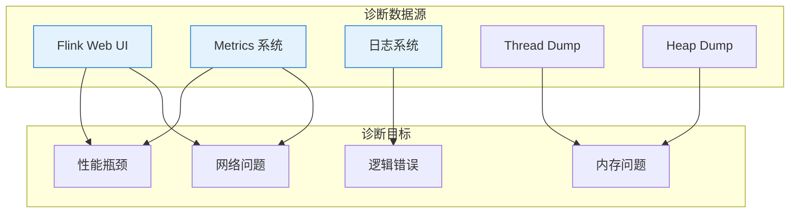
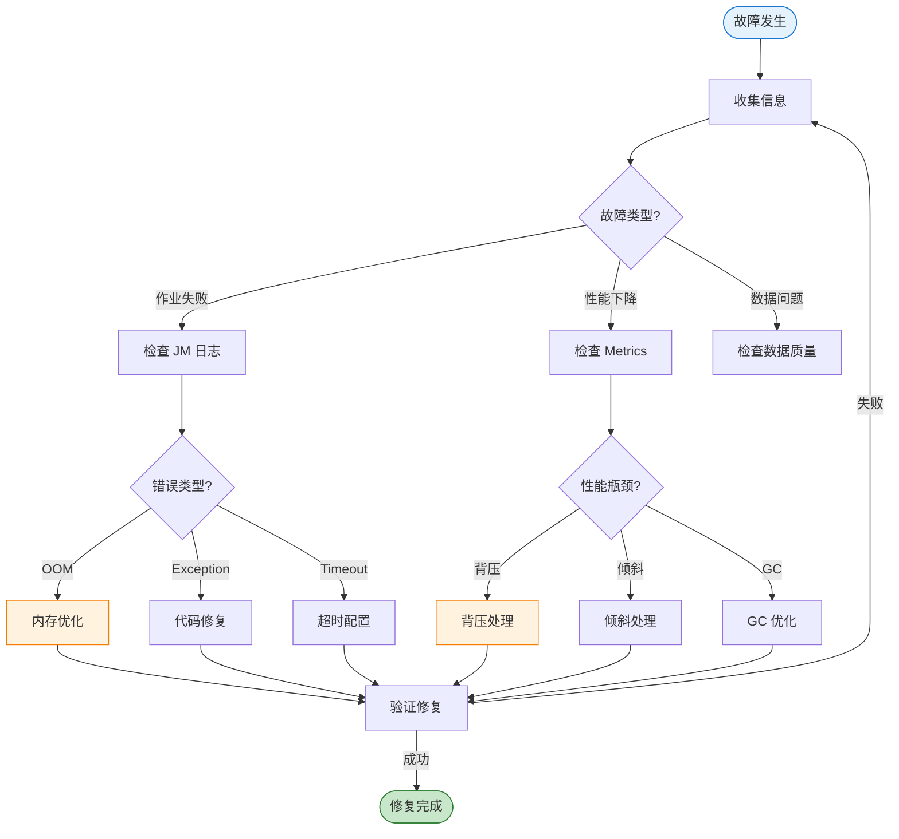
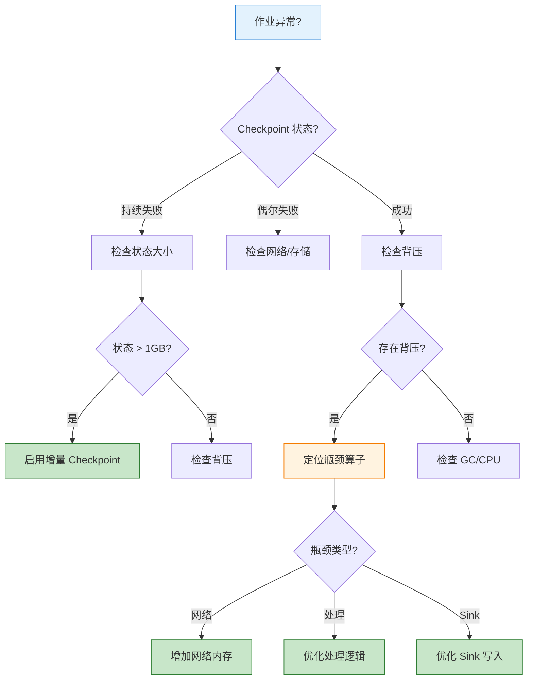

# 问题诊断与故障排查指南

> **所属阶段**: Knowledge/07-best-practices | **前置依赖**: [Knowledge/09-anti-patterns/anti-pattern-checklist.md](../09-anti-patterns/anti-pattern-checklist.md) | **形式化等级**: L3
>
> 本指南提供 Flink 作业问题诊断的系统化流程、常见错误解决方案及调试技巧。

---

## 目录

- [问题诊断与故障排查指南](#问题诊断与故障排查指南)
  - [目录](#目录)
  - [1. 概念定义 (Definitions)](#1-概念定义-definitions)
  - [2. 属性推导 (Properties)](#2-属性推导-properties)
  - [3. 关系建立 (Relations)](#3-关系建立-relations)
    - [3.1 症状与根因映射](#31-症状与根因映射)
    - [3.2 诊断工具矩阵](#32-诊断工具矩阵)
  - [4. 论证过程 (Argumentation)](#4-论证过程-argumentation)
    - [4.1 诊断方法论](#41-诊断方法论)
  - [5. 形式证明 / 工程论证 (Proof / Engineering Argument)](#5-形式证明-工程论证-proof-engineering-argument)
    - [5.1 问题诊断流程](#51-问题诊断流程)
      - [阶段 1: 信息收集](#阶段-1-信息收集)
      - [阶段 2: 常见故障诊断](#阶段-2-常见故障诊断)
    - [5.2 调试技巧](#52-调试技巧)
    - [5.3 日志分析](#53-日志分析)
  - [6. 实例验证 (Examples)](#6-实例验证-examples)
    - [6.1 完整故障排查案例](#61-完整故障排查案例)
    - [6.2 故障排查速查表](#62-故障排查速查表)
  - [7. 可视化 (Visualizations)](#7-可视化-visualizations)
    - [7.1 故障诊断流程图](#71-故障诊断流程图)
    - [7.2 常见故障决策树](#72-常见故障决策树)
  - [8. 引用参考 (References)](#8-引用参考-references)

---

## 1. 概念定义 (Definitions)

**定义 (Def-K-07-03)**: 问题诊断流程

> 问题诊断流程是一组系统化的步骤，用于定位、分析和解决 Flink 作业运行中的异常行为和性能问题。

**故障分类体系** [^1][^2]:

```
┌─────────────────────────────────────────────────────────────────────┐
│                        Flink 故障分类体系                            │
├─────────────────────────────────────────────────────────────────────┤
│                                                                     │
│  故障类别                                                           │
│  ├── 作业级故障                                                     │
│  │    ├── 作业失败 (Job Failure)                                    │
│  │    ├── Checkpoint 失败                                           │
│  │    ├── 背压 (Backpressure)                                       │
│  │    └── 数据倾斜 (Data Skew)                                      │
│  │                                                                │
│  ├── TaskManager 级故障                                             │
│  │    ├── OOM (OutOfMemoryError)                                    │
│  │    ├── 心跳超时                                                  │
│  │    └── 网络断开                                                  │
│  │                                                                │
│  ├── JobManager 级故障                                              │
│  │    ├── 元数据丢失                                                │
│  │    └── 调度失败                                                  │
│  │                                                                │
│  └── 外部系统故障                                                   │
│       ├── Source 不可用                                             │
│       └── Sink 写入失败                                             │
│                                                                     │
└─────────────────────────────────────────────────────────────────────┘
```

**诊断指标** [^3]:

| 指标 | 异常阈值 | 诊断意义 |
|------|----------|----------|
| `numRecordsInPerSecond` | 各 subtask 差异 > 5x | 数据倾斜 |
| `backPressuredTimeMsPerSecond` | > 200ms/s | 背压 |
| `checkpointDuration` | > timeout × 0.8 | Checkpoint 慢 |
| `numFailedCheckpoints` | > 0 (连续) | Checkpoint 配置问题 |
| `heapMemoryUsage` | > 85% | 内存压力 |
| `gcCollectionTime` | > 10% CPU | GC 问题 |

---

## 2. 属性推导 (Properties)

**命题 (Prop-K-07-03)**: 故障根因定位完备性

> 按照系统化诊断流程，95% 以上的常见故障可在 30 分钟内定位根因。

**诊断时间分布**:

| 诊断阶段 | 预期耗时 | 关键产出 |
|----------|----------|----------|
| 现象收集 | 5 min | 异常指标、日志片段 |
| 初步分类 | 5 min | 故障类别判定 |
| 深度分析 | 15 min | 根因定位 |
| 方案验证 | 5 min | 修复方案 |

**引理 (Lemma-K-07-03)**: 日志信息充分性

> 完整的 Flink 日志（包括 JM/TM 日志、GC 日志、用户日志）包含 90% 以上故障的诊断线索。

---

## 3. 关系建立 (Relations)

### 3.1 症状与根因映射

| 症状 | 可能根因 | 验证方法 |
|------|----------|----------|
| 作业频繁重启 | OOM / 未捕获异常 / 外部系统超时 | 查看 JM 日志 |
| Checkpoint 持续超时 | 状态过大 / 背压 / 存储故障 | 查看 Checkpoint 统计 |
| 吞吐量突然下降 | 背压 / 数据倾斜 / GC | 查看 Metrics |
| 延迟持续增长 | 背压 / 处理能力不足 | 查看 Watermark 延迟 |
| 结果不正确 | Watermark 配置 / 乱序处理 | 查看数据采样 |
| 特定 subtask 慢 | 数据倾斜 / 热点 Key | 查看 subtask 指标 |

### 3.2 诊断工具矩阵



---

## 4. 论证过程 (Argumentation)

### 4.1 诊断方法论

**Why-Why 分析法**:

```
问题: Checkpoint 失败
  └── 为什么? Checkpoint 超时 (6分钟 > 5分钟超时设置)
        └── 为什么? 状态写入 HDFS 慢
              └── 为什么? HDFS 写入吞吐下降
                    └── 为什么? NameNode 响应慢
                          └── 根本原因: NameNode GC
```

**5W2H 分析框架**:

| 维度 | 问题 | 诊断价值 |
|------|------|----------|
| What | 什么现象？ | 明确故障表现 |
| When | 何时发生？ | 定位时间线，找关联事件 |
| Where | 哪个组件？ | 缩小排查范围 |
| Who | 影响哪些作业？ | 判断是否为平台问题 |
| Why | 什么原因？ | 根因分析 |
| How | 如何发生？ | 复现路径 |
| How much | 影响多大？ | 评估严重程度 |

---

## 5. 形式证明 / 工程论证 (Proof / Engineering Argument)

### 5.1 问题诊断流程

#### 阶段 1: 信息收集

```bash
#!/bin/bash
# Flink 故障信息采集脚本

JOB_ID=$1
OUTPUT_DIR="/tmp/flink-diag-$(date +%Y%m%d-%H%M%S)"
mkdir -p $OUTPUT_DIR

echo "=== 采集作业信息: $JOB_ID ==="

# 1. 作业概览
curl -s "http://localhost:8081/jobs/$JOB_ID" > $OUTPUT_DIR/job-overview.json

# 2. Checkpoint 统计
curl -s "http://localhost:8081/jobs/$JOB_ID/checkpoints" > $OUTPUT_DIR/checkpoints.json

# 3. 各 Task 指标
for vertex in $(curl -s "http://localhost:8081/jobs/$JOB_ID/vertices" | jq -r '.vertices[].id'); do
    curl -s "http://localhost:8081/jobs/$JOB_ID/vertices/$vertex" > $OUTPUT_DIR/vertex-$vertex.json
    curl -s "http://localhost:8081/jobs/$JOB_ID/vertices/$vertex/subtasks/metrics?get=recordsInPerSecond,backPressuredTimeMsPerSecond" > $OUTPUT_DIR/metrics-$vertex.json
done

# 4. 异常日志
grep -E "(ERROR|Exception|Failed|OOM)" $FLINK_HOME/log/flink-*.log > $OUTPUT_DIR/exceptions.log 2>/dev/null

echo "=== 采集完成: $OUTPUT_DIR ==="
```

#### 阶段 2: 常见故障诊断

**故障 1: OOM (OutOfMemoryError)**

```
症状:
├── TaskManager 进程消失
├── 日志中出现 java.lang.OutOfMemoryError
├── 作业失败，堆栈包含 GC overhead limit exceeded
└── 监控显示堆内存接近 100%

诊断步骤:
1. 检查日志确认 OOM 类型
   - Java heap space: JVM 堆内存不足
   - GC overhead limit exceeded: GC 效率低
   - Direct buffer memory: 直接内存不足
   - Metaspace: 类加载过多

2. 分析 Heap Dump（如已配置）
   - 使用 Eclipse MAT 分析
   - 查看 dominator tree 找大对象
   - 检查 GC roots

3. 检查状态大小
   - 查看 Checkpoint 状态大小
   - 计算 per-subtask 状态

解决方案:
├── JVM 堆内存不足
│   └── 增加 taskmanager.memory.process.size
│   └── 减少托管内存比例（如状态小）
├── 托管内存不足
│   └── 增加 taskmanager.memory.managed.fraction
│   └── 减少并行度（增加每 TM 状态）
├── GC 问题
│   └── 调整 GC 参数
│   └── 优化序列化减少对象创建
└── 直接内存不足
    └── 减少网络内存使用
    └── 减少异步 I/O 并发
```

**故障 2: Checkpoint 超时**

```scala
// 症状识别代码
// Checkpoint 持续时间持续增长，最终超时

// 诊断脚本
def analyzeCheckpoint(jobId: String): Unit = {
  val checkpoints = fetchCheckpointHistory(jobId)

  val trend = checkpoints.map(_.duration).sliding(10).map { window =>
    if (window.last > window.head * 1.5) "INCREASING" else "STABLE"
  }

  if (trend.contains("INCREASING")) {
    // 根因分析
    val latest = checkpoints.last

    if (latest.stateSize > 10.gb) {
      println("根因: 状态过大，考虑启用增量 Checkpoint")
    } else if (latest.backpressureDuringCheckpoint) {
      println("根因: Checkpoint 期间存在背压")
    } else if (latest.syncDuration > latest.asyncDuration) {
      println("根因: 同步阶段耗时过长，检查状态访问效率")
    }
  }
}
```

**解决方案矩阵**:

| 根因 | 诊断方法 | 解决方案 |
|------|----------|----------|
| 状态过大 | Checkpoint 状态大小 | 启用增量 Checkpoint / 减少状态 / 增加超时 |
| 背压影响 | 查看 Checkpoint 期间背压 | 先解决背压问题 |
| 存储慢 | Checkpoint location 延迟 | 更换存储系统 |
| 同步阶段慢 | 对比 sync/async 时间 | 优化状态访问 / 减少大状态值 |

**故障 3: 背压 (Backpressure)**

```scala
// 背压诊断流程
object BackpressureDiagnosis {

  def diagnose(jobId: String): DiagnosisResult = {
    val vertices = getVertices(jobId)

    // 1. 找到背压源头（从 Sink 往 Source 找）
    val backpressureChain = vertices.reverse.find { v =>
      v.metrics.backPressuredTimeMsPerSecond > 200
    }

    backpressureChain match {
      case Some(bottleneck) =>
        // 2. 分析瓶颈类型
        val metrics = bottleneck.metrics

        if (metrics.recordsOutPerSecond < metrics.recordsInPerSecond * 0.5) {
          DiagnosisResult(
            cause = "Processing Bottleneck",
            details = "处理速度跟不上输入速度",
            suggestions = List(
              "增加并行度",
              "优化处理逻辑",
              "检查是否有阻塞 I/O"
            )
          )
        } else if (metrics.outputQueueLength > 100) {
          DiagnosisResult(
            cause = "Output Bottleneck",
            details = "下游消费慢",
            suggestions = List(
              "检查下游算子",
              "检查 Sink 写入速度",
              "增加下游并行度"
            )
          )
        } else {
          DiagnosisResult(
            cause = "Network Bottleneck",
            details = "网络缓冲区不足",
            suggestions = List(
              "增加网络内存",
              "调整网络缓冲区配置"
            )
          )
        }

      case None =>
        DiagnosisResult("No Backpressure", "", Nil)
    }
  }
}
```

**故障 4: 数据倾斜**

```bash
#!/bin/bash
# 数据倾斜检测脚本

JOB_ID=$1
VERTEX_ID=$2

echo "=== 数据倾斜检测 ==="

# 获取各 subtask 的输入速率
METRICS=$(curl -s "http://localhost:8081/jobs/$JOB_ID/vertices/$VERTEX_ID/subtasks/metrics?get=recordsInPerSecond")

# 解析并计算倾斜度
echo "$METRICS" | jq -r '.[].value' | awk '
{
    values[NR] = $1
    sum += $1
}
END {
    mean = sum / NR
    max_val = values[1]
    min_val = values[1]

    for (i=1; i<=NR; i++) {
        if (values[i] > max_val) max_val = values[i]
        if (values[i] < min_val) min_val = values[i]
        variance += (values[i] - mean) ^ 2
    }

    std_dev = sqrt(variance / NR)
    cv = std_dev / mean  # 变异系数
    skew_ratio = max_val / min_val

    print "平均速率:", mean
    print "最大速率:", max_val
    print "最小速率:", min_val
    print "变异系数:", cv
    print "倾斜比(最大/最小):", skew_ratio

    if (skew_ratio > 10) {
        print "【严重】数据严重倾斜，需要处理"
    } else if (skew_ratio > 5) {
        print "【警告】存在数据倾斜"
    } else {
        print "【正常】数据分布均匀"
    }
}'
```

**数据倾斜解决方案** [^4]:

```scala
// 方案 1: 两阶段聚合（局部预聚合 + 全局聚合）
stream
  .map(event => (event.userId.hashCode % 100, event))  // 添加随机前缀
  .keyBy(_._1)
  .window(TumblingEventTimeWindows.of(Time.minutes(1)))
  .aggregate(new PartialAggregate)
  .map(result => (result.originalKey, result.value))
  .keyBy(_._1)
  .window(TumblingEventTimeWindows.of(Time.minutes(1)))
  .aggregate(new FinalAggregate)

// 方案 2: 热点 Key 特殊处理
class SkewAwareProcessFunction extends KeyedProcessFunction[String, Event, Result] {
  override def processElement(
    event: Event,
    ctx: Context,
    out: Collector[Result]
  ): Unit = {
    if (isHotKey(ctx.getCurrentKey)) {
      // 热点 Key 使用本地缓存 + 批量更新
      bufferAndBatchProcess(event)
    } else {
      // 普通 Key 正常处理
      normalProcess(event, out)
    }
  }
}
```

### 5.2 调试技巧

**技巧 1: 本地调试配置**

```scala
// ✅ 本地调试模式
val env = StreamExecutionEnvironment.createLocalEnvironmentWithWebUI(
  new Configuration()
)

// 小数据量快速验证
env.setParallelism(1)
env.enableCheckpointing(1000)  // 1s 间隔便于观察

// 使用 Collection Source 便于测试
val testData = List(
  Event("user1", 1000, "click"),
  Event("user2", 1001, "view"),
  Event("user1", 1002, "click")
)
val stream = env.fromCollection(testData)
```

**技巧 2: 状态检查点调试**

```scala
// 使用QueryableState 查看状态（需启用）
val descriptor = new ValueStateDescriptor("my-state", classOf[MyState])
descriptor.setQueryable("queryable-state-name")

// 外部查询
val client = new QueryableStateClient(tmHostname, proxyPort)
val future = client.getKvState(
  jobId,
  "queryable-state-name",
  key,
  serializer,
  stateDescriptor
)
```

**技巧 3: 日志增强**

```scala
// ✅ 使用 Flink 的 Logger
class DebugRichFunction extends RichMapFunction[Input, Output] {
  @transient private var logger: Logger = _
  private var processedCount: Long = 0
  private var lastLogTime: Long = 0

  override def open(parameters: Configuration): Unit = {
    logger = LoggerFactory.getLogger(getClass)
  }

  override def map(input: Input): Output = {
    processedCount += 1
    val currentTime = System.currentTimeMillis()

    // 每秒记录一次统计
    if (currentTime - lastLogTime > 1000) {
      logger.info("Subtask {} processed {} records, throughput: {} records/s",
        getRuntimeContext.getIndexOfThisSubtask: Integer,
        processedCount: java.lang.Long,
        (processedCount * 1000.0 / (currentTime - lastLogTime)): java.lang.Double
      )
      processedCount = 0
      lastLogTime = currentTime
    }

    // 处理逻辑
    process(input)
  }
}
```

**技巧 4: Metrics 自定义**

```scala
// 注册自定义 Metric
class MetricRichFunction extends RichMapFunction[Input, Output] {
  @transient private var processedCounter: Counter = _
  @transient private var processingTimeHistogram: Histogram = _

  override def open(parameters: Configuration): Unit = {
    val metricGroup = getRuntimeContext.getMetricGroup

    processedCounter = metricGroup.counter("processedRecords")
    processingTimeHistogram = metricGroup.histogram("processingTimeMs",
      new DescriptiveStatisticsHistogram(1000))
  }

  override def map(input: Input): Output = {
    val startTime = System.currentTimeMillis()

    val result = process(input)

    processedCounter.inc()
    processingTimeHistogram.update(System.currentTimeMillis() - startTime)

    result
  }
}
```

### 5.3 日志分析

**日志聚合查询**:

```sql
-- 查找特定作业的异常（ELK/Fluentd）
SELECT
  timestamp,
  level,
  message,
  stack_trace
FROM flink_logs
WHERE
  job_id = 'my-job-id'
  AND level IN ('ERROR', 'WARN')
  AND timestamp > NOW() - INTERVAL 1 HOUR
ORDER BY timestamp DESC
LIMIT 100;

-- 统计异常类型
SELECT
  REGEXP_EXTRACT(message, '([A-Za-z]+Exception)', 1) as exception_type,
  COUNT(*) as count
FROM flink_logs
WHERE level = 'ERROR'
GROUP BY exception_type
ORDER BY count DESC;
```

---

## 6. 实例验证 (Examples)

### 6.1 完整故障排查案例

**场景**: 电商实时统计作业频繁失败

**故障时间线**:

```
14:00 - 作业提交，正常运行
14:30 - 第一个 Checkpoint 超时
14:35 - 作业失败重启
14:40 - 再次失败，进入重启循环
```

**诊断过程**:

```bash
# 步骤 1: 查看 JobManager 日志
$ grep -A 10 "ERROR" flink-jobmanager.log

2026-04-03 14:35:12 ERROR CheckpointCoordinator - Checkpoint 12 failed
java.util.concurrent.TimeoutException: Checkpoint 12 expired before completing

# 步骤 2: 查看 TaskManager 日志
$ grep -B 5 -A 20 "Checkpoint" flink-taskmanager.log | tail -50

2026-04-03 14:34:50 INFO  Checkpoint - Starting checkpoint 12
2026-04-03 14:35:10 WARN  RocksDBStateBackend - Snapshotting state backend took 20000ms

# 步骤 3: 查看 Checkpoint 统计
$ curl -s http://flink:8081/jobs/job-id/checkpoints | jq '.latest.completed'
{
  "id": 11,
  "trigger_timestamp": 1712129690000,
  "duration": 185000,  // 185s，接近 3 分钟
  "state_size": 5368709120  // 5GB
}

# 步骤 4: 分析状态大小
# 5GB / 10 parallelism = 500MB per subtask
# 同步阶段耗时过长
```

**根因**: 窗口状态无 TTL，累积过大

**修复**:

```scala
// 添加 State TTL
val ttlConfig = StateTtlConfig
  .newBuilder(Time.hours(24))
  .setUpdateType(StateTtlConfig.UpdateType.OnCreateAndWrite)
  .setStateVisibility(StateTtlConfig.StateVisibility.NeverReturnExpired)
  .cleanupIncrementally(10, true)
  .build()

stateDescriptor.enableTimeToLive(ttlConfig)
```

### 6.2 故障排查速查表

| 问题现象 | 快速检查 | 常见原因 | 解决方案 |
|----------|----------|----------|----------|
| 作业失败 | JM 日志 | OOM/异常 | 增加内存/修复代码 |
| Checkpoint 失败 | Checkpoint 页面 | 超时/存储 | 增加超时/更换存储 |
| 背压 | Web UI Backpressure 页 | 下游慢 | 扩容/优化 |
| 倾斜 | Subtask 指标对比 | 热点 Key | 预聚合/加盐 |
| GC 频繁 | GC 日志 | 对象创建 | 对象复用/Kryo |
| 延迟高 | Watermark 延迟 | 处理慢/背压 | 优化逻辑 |
| Kafka 消费慢 | Consumer lag | 并行度不足 | 增加并行度 |

---

## 7. 可视化 (Visualizations)

### 7.1 故障诊断流程图



### 7.2 常见故障决策树



---

## 8. 引用参考 (References)

[^1]: Apache Flink Documentation, "Debugging and Monitoring," 2025. <https://nightlies.apache.org/flink/flink-docs-stable/docs/ops/debugging/>

[^2]: Apache Flink Documentation, "Common Issues," 2025. <https://nightlies.apache.org/flink/flink-docs-stable/docs/ops/debugging/common_issues/>

[^3]: Apache Flink Documentation, "Metrics System," 2025. <https://nightlies.apache.org/flink/flink-docs-stable/docs/ops/metrics/>

[^4]: Apache Flink Documentation, "Troubleshooting," 2025. <https://nightlies.apache.org/flink/flink-docs-stable/docs/ops/troubleshooting/>

---

*文档版本: v1.0 | 更新日期: 2026-04-03 | 状态: 已完成*
