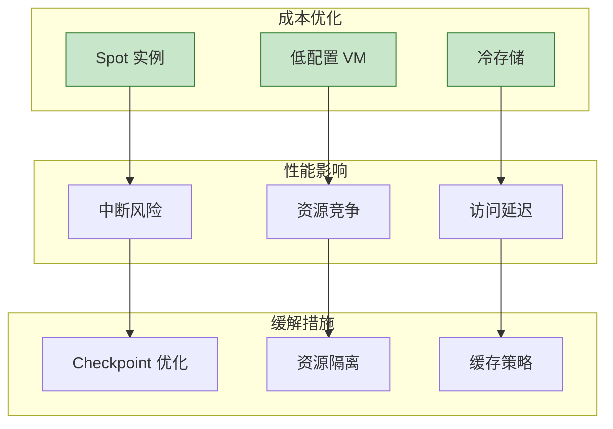
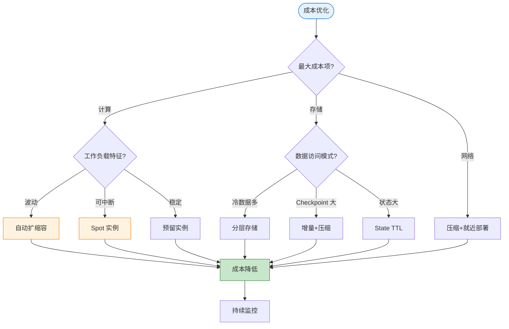
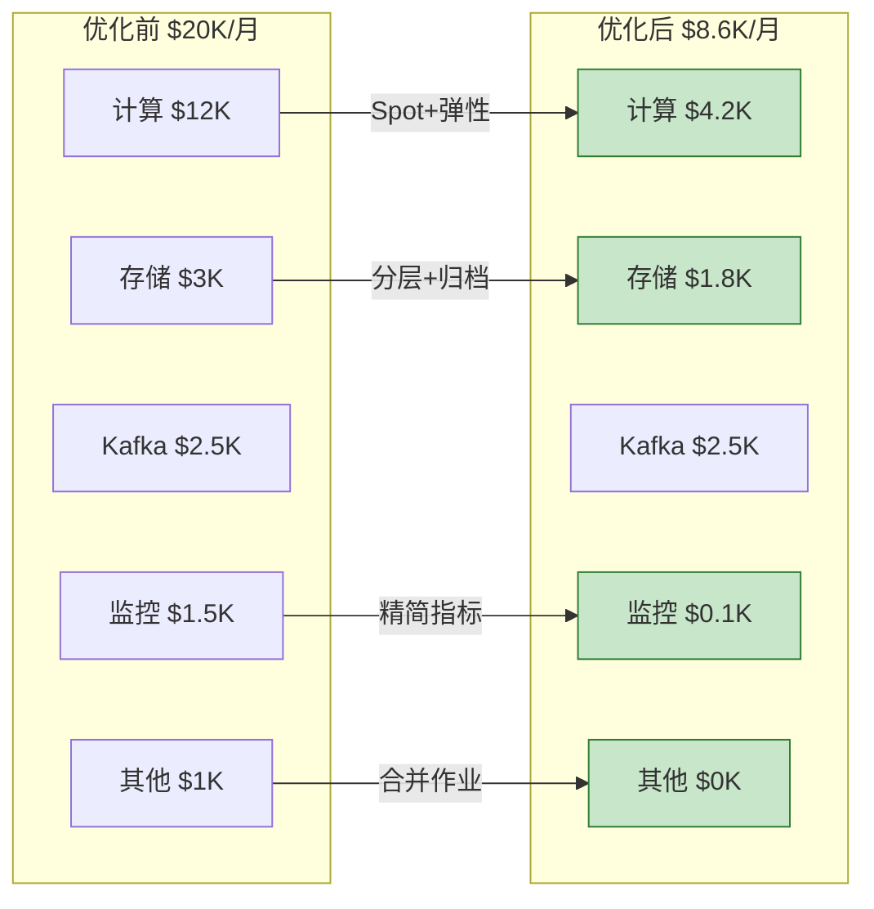

# 云成本优化模式

> **所属阶段**: Knowledge/07-best-practices | **前置依赖**: [Knowledge/06-frontier/serverless-streaming-cost-optimization.md](../06-frontier/serverless-streaming-cost-optimization.md) | **形式化等级**: L3
>
> 本文档提供流处理系统在云环境中的成本优化策略，涵盖资源、存储和计算成本优化。

---

## 目录

- [云成本优化模式](#云成本优化模式)
  - [目录](#目录)
  - [1. 概念定义 (Definitions)](#1-概念定义-definitions)
  - [2. 属性推导 (Properties)](#2-属性推导-properties)
  - [3. 关系建立 (Relations)](#3-关系建立-relations)
    - [3.1 成本与性能权衡](#31-成本与性能权衡)
    - [3.2 优化策略适用矩阵](#32-优化策略适用矩阵)
  - [4. 论证过程 (Argumentation)](#4-论证过程-argumentation)
    - [4.1 资源利用率优化论证](#41-资源利用率优化论证)
    - [4.2 计费模式选择论证](#42-计费模式选择论证)
  - [5. 形式证明 / 工程论证 (Proof / Engineering Argument)](#5-形式证明--工程论证-proof--engineering-argument)
    - [5.1 资源配置优化](#51-资源配置优化)
    - [5.2 存储成本优化](#52-存储成本优化)
    - [5.3 计算成本优化](#53-计算成本优化)
  - [6. 实例验证 (Examples)](#6-实例验证-examples)
    - [6.1 成本优化案例](#61-成本优化案例)
    - [6.2 成本监控仪表盘](#62-成本监控仪表盘)
  - [7. 可视化 (Visualizations)](#7-可视化-visualizations)
    - [7.1 成本优化决策树](#71-成本优化决策树)
    - [7.2 成本优化效果对比](#72-成本优化效果对比)
  - [8. 引用参考 (References)](#8-引用参考-references)

---

## 1. 概念定义 (Definitions)

**定义 (Def-K-07-04)**: 云成本优化

> 云成本优化是通过合理配置资源、选择计费模式和优化架构设计，在保证服务质量的前提下最小化云资源支出的系统化方法。

**成本构成模型** [^1][^2]:

```
┌─────────────────────────────────────────────────────────────────────┐
│                      流处理系统成本构成                              │
├─────────────────────────────────────────────────────────────────────┤
│                                                                     │
│  总成本 = 计算成本 + 存储成本 + 网络成本 + 其他服务成本              │
│                                                                     │
│  ├── 计算成本 (40-60%)                                              │
│  │    ├── VM/容器实例费用                                           │
│  │    ├── 预留实例/Spot 实例                                        │
│  │    └── Serverless 函数费用                                       │
│  │                                                                │
│  ├── 存储成本 (20-40%)                                              │
│  │    ├── Checkpoint 存储                                           │
│  │    ├── 状态后端存储 (RocksDB)                                    │
│  │    └── 消息队列存储 (Kafka)                                      │
│  │                                                                │
│  ├── 网络成本 (10-20%)                                              │
│  │    ├── 跨可用区流量                                              │
│  │    ├── 公网出口                                                  │
│  │    └── 存储网络 I/O                                              │
│  │                                                                │
│  └── 其他服务 (5-15%)                                               │
│       ├── 监控和日志                                                │
│       ├── 负载均衡                                                  │
│       └── 安全服务                                                  │
│                                                                     │
└─────────────────────────────────────────────────────────────────────┘
```

**成本优化维度**:

| 维度 | 优化杠杆 | 潜在节省 |
|------|----------|----------|
| **资源利用率** | 消除闲置、自动扩缩容 | 20-40% |
| **计费模式** | Spot/预留实例、按需 | 30-70% |
| **架构优化** | 分层存储、计算分离 | 20-50% |
| **数据生命周期** | 冷热分层、过期清理 | 30-60% |

---

## 2. 属性推导 (Properties)

**命题 (Prop-K-07-04)**: 自动扩缩容的成本效益

> 自动扩缩容可在流量波动场景中降低 30-60% 的计算成本，同时满足延迟 SLA。

**量化模型**:

设流量为 $L(t)$，固定资源配置为 $C_{fixed}$，弹性资源配置为 $C_{elastic}(t)$:

$$Cost_{fixed} = C_{fixed} \times T \times P$$
$$Cost_{elastic} = \int_{0}^{T} C_{elastic}(t) \times P \, dt$$

其中 $C_{elastic}(t) = f(L(t))$ 是流量的函数。

当流量波动系数 $\sigma(L) > 0.3$ 时:
$$\frac{Cost_{elastic}}{Cost_{fixed}} \approx 0.4 - 0.7$$

**引理 (Lemma-K-07-04)**: 存储分层成本递减

> 将冷数据迁移到对象存储可降低 80% 以上的存储成本。

| 存储类型 | 单价 ($/GB/月) | 适用场景 |
|----------|----------------|----------|
| SSD 本地盘 | 0.15-0.30 | 热状态 |
| 云盘 SSD | 0.10-0.20 | 热状态 |
| 对象存储标准 | 0.02-0.03 | Checkpoint |
| 对象存储低频 | 0.01-0.015 | 历史数据 |
| 归档存储 | 0.001-0.005 | 合规存档 |

---

## 3. 关系建立 (Relations)

### 3.1 成本与性能权衡



### 3.2 优化策略适用矩阵

| 场景 | 计算优化 | 存储优化 | 网络优化 |
|------|----------|----------|----------|
| 流量波动大 | 自动扩缩容 | 冷热分层 | - |
| 批处理为主 | Spot 实例 | 对象存储 | - |
| 低延迟要求 | 预留实例 | SSD 本地 | 压缩 |
| 大状态 | 垂直扩展 | 增量 Checkpoint | - |
| 多区域部署 | 区域选择 | 就近存储 | CDN |

---

## 4. 论证过程 (Argumentation)

### 4.1 资源利用率优化论证

**问题**: 为何资源利用率通常只有 20-30%？

**原因分析**:

1. **峰值预留**: 按峰值配置，大部分时间空闲
2. **故障冗余**: 为容错预留额外容量
3. **缺乏监控**: 不知道实际使用情况
4. **配置惯性**: 配置后不再调整

**解决方案**:

```
优化前: 10 台 × 24 小时 × 30 天 = 7200 实例小时
优化后: 平均 4 台 × 24 小时 × 30 天 = 2880 实例小时
节省: (7200 - 2880) / 7200 = 60%
```

### 4.2 计费模式选择论证

**Spot 实例适用性**:

| 特性 | 适用场景 | 不适用场景 |
|------|----------|------------|
| 价格优势 (30-90% 折扣) | 无状态 TaskManager | JobManager |
| 可中断 | 可快速恢复的作业 | 不可中断的关键任务 |
| 容量不确定 | 有弹性的工作负载 | 固定容量需求 |

**预留实例 vs 按需**:

```
使用预留实例的盈亏平衡点:
- 1 年预留: 使用量 > 60% 时间 → 节省
- 3 年预留: 使用量 > 40% 时间 → 节省

计算:
按需单价 = $0.20/小时
1 年预留单价 = $0.12/小时 (40% 折扣)
盈亏点 = 0.12 / 0.20 = 60%
```

---

## 5. 形式证明 / 工程论证 (Proof / Engineering Argument)

### 5.1 资源配置优化

**模式 1: 自动扩缩容**

```yaml
# Kubernetes Flink Operator 自动扩缩容配置
apiVersion: flink.apache.org/v1beta1
kind: FlinkDeployment
metadata:
  name: autoscaling-job
spec:
  jobManager:
    resource:
      memory: "2Gi"
      cpu: 1
  taskManager:
    resource:
      memory: "4Gi"
      cpu: 2
    replicas: 2-10  # 弹性范围

  # 自动扩缩容策略
  podTemplate:
    spec:
      containers:
        - name: flink-taskmanager
          resources:
            requests:
              memory: "4Gi"
              cpu: "2"
            limits:
              memory: "8Gi"
              cpu: "4"

  # HPA 配置
---
  apiVersion: autoscaling/v2
  kind: HorizontalPodAutoscaler
  metadata:
    name: flink-tm-hpa
  spec:
    scaleTargetRef:
      apiVersion: flink.apache.org/v1beta1
      kind: FlinkDeployment
      name: autoscaling-job
    minReplicas: 2
    maxReplicas: 10
    metrics:
      - type: Pods
        pods:
          metric:
            name: kafka_lag
          target:
            type: AverageValue
            averageValue: "1000"
      - type: Resource
        resource:
          name: cpu
          target:
            type: Utilization
            averageUtilization: 70

```

**自定义扩缩容逻辑**:

```scala
// 基于业务指标的扩缩容
class ScalingController extends RichFunction {

  override def open(parameters: Configuration): Unit = {
    // 监控 Kafka Lag
    val kafkaLag = getRuntimeContext.getMetricGroup
      .gauge[Long, Gauge[Long]]("kafka-lag", () => fetchKafkaLag())

    // 定期评估扩缩容
    val timer = new Timer()
    timer.scheduleAtFixedRate(new TimerTask {
      override def run(): Unit = evaluateScaling()
    }, 0, 60000)  // 每分钟评估
  }

  def evaluateScaling(): Unit = {
    val lag = fetchKafkaLag()
    val processingRate = getCurrentProcessingRate()
    val currentParallelism = getRuntimeContext.getNumberOfParallelSubtasks

    // 目标:lag 在 5 分钟内处理完
    val targetParallelism = math.ceil(
      lag / (processingRate * 300)
    ).toInt

    if (targetParallelism > currentParallelism * 1.5) {
      requestScaleUp(targetParallelism)
    } else if (targetParallelism < currentParallelism * 0.5) {
      requestScaleDown(math.max(2, targetParallelism))
    }
  }
}
```

**模式 2: Spot 实例混合部署**

```yaml
# AWS EKS 混合节点组配置
apiVersion: eksctl.io/v1alpha5
kind: ClusterConfig
metadata:
  name: flink-cluster
  region: us-west-2

managedNodeGroups:
  # 稳定节点组 - JobManager 和关键服务
  - name: stable-ng
    instanceTypes: ["m5.large", "m5.xlarge"]
    minSize: 2
    maxSize: 4
    desiredCapacity: 2
    labels:
      node-type: stable
    taints:
      - key: dedicated
        value: jm
        effect: NoSchedule

  # Spot 节点组 - TaskManager
  - name: spot-ng
    instanceTypes: ["m5.large", "m5.xlarge", "m5a.large", "m5a.xlarge"]
    spot: true
    minSize: 2
    maxSize: 20
    desiredCapacity: 5
    labels:
      node-type: spot
    # 优先级和抢占策略
    priorityClass: low
```

```java
// Flink 配置:容忍 Spot 实例中断
Configuration conf = new Configuration();

// 更快的 Checkpoint 以应对中断
conf.setLong(CheckpointingOptions.CHECKPOINTING_INTERVAL, 10000); // 10s
conf.setLong(CheckpointingOptions.MIN_PAUSE_BETWEEN_CHECKPOINTS, 5000);

// 本地恢复加速重启
conf.setBoolean(CheckpointingOptions.LOCAL_RECOVERY, true);

// 配置重启策略
conf.setString(RestartStrategyOptions.RESTART_STRATEGY, "exponential-delay");
conf.setString(RestartStrategyOptions.EXPONENTIAL_DELAY_INITIAL_BACKOFF, "10s");
conf.setString(RestartStrategyOptions.EXPONENTIAL_DELAY_MAX_BACKOFF, "60s");
```

**模式 3: 资源规格优化**

```text
# 资源成本计算工具
import json

class ResourceOptimizer:
    def __init__(self, pricing_data):
        self.pricing = pricing_data

    def calculate_optimal_config(self, requirements):
        """
        requirements: {
            'min_memory_gb': 4,
            'min_cpu': 2,
            'target_throughput': 100000,
            'state_size_gb': 10
        }
        """
        candidates = []

        for instance_type, price in self.pricing.items():
            if (instance_type.memory_gb >= requirements['min_memory_gb'] and:
                instance_type.cpu >= requirements['min_cpu']):

                # 计算所需实例数
                parallelism = self.estimate_parallelism(
                    instance_type,
                    requirements
                )

                # 计算总成本
                hourly_cost = price * parallelism

                candidates.append({
                    'instance_type': instance_type,
                    'parallelism': parallelism,
                    'hourly_cost': hourly_cost,
                    'cost_per_record': hourly_cost / requirements['target_throughput']
                })

        # 按单位成本排序
        return sorted(candidates, key=lambda x: x['cost_per_record'])

    def estimate_parallelism(self, instance, requirements):
        # 基于经验公式的并行度估算
        memory_per_subtask = max(
            2,  # 最小内存
            requirements['state_size_gb'] / 10 + 1
        )

        max_parallelism = instance.memory_gb / memory_per_subtask

        # 确保满足吞吐量
        throughput_per_subtask = instance.cpu * 20000  # 经验值
        required_parallelism = requirements['target_throughput'] / throughput_per_subtask

        return int(max(2, min(max_parallelism, required_parallelism)))

# 使用示例
optimizer = ResourceOptimizer(pricing_data={
    'm5.large': 0.096,
    'm5.xlarge': 0.192,
    'm5.2xlarge': 0.384,
    'm6g.large': 0.077,  # Graviton 更便宜
    'm6g.xlarge': 0.154
})

optimal = optimizer.calculate_optimal_config({
    'min_memory_gb': 4,
    'min_cpu': 2,
    'target_throughput': 100000,
    'state_size_gb': 20
})

print(json.dumps(optimal[:3], indent=2))
```

### 5.2 存储成本优化

**模式 1: Checkpoint 生命周期管理**

```scala
// 自动清理过期 Checkpoint
class CheckpointLifecycleManager extends Trigger<Configuration> {

  override def open(parameters: Configuration): Unit = {
    val cleanupInterval = parameters.getLong("checkpoint.cleanup.interval", 86400000)

    // 每天执行清理
    registerTimer(System.currentTimeMillis() + cleanupInterval)
  }

  override def onTimer(
    timestamp: Long,
    ctx: TriggerContext,
    out: Collector[Configuration]
  ): Unit = {
    val checkpointPath = ctx.getCheckpointPath
    val retentionDays = 7
    val cutoffTime = timestamp - (retentionDays * 86400000)

    // 清理旧 Checkpoint
    cleanupOldCheckpoints(checkpointPath, cutoffTime)

    // 归档重要 Checkpoint
    archiveImportantCheckpoints(checkpointPath)

    // 重新注册定时器
    registerTimer(timestamp + cleanupInterval)
  }

  def cleanupOldCheckpoints(path: String, cutoff: Long): Unit = {
    val fs = FileSystem.get(new URI(path))
    val checkpointDir = new Path(path)

    fs.listStatus(checkpointDir).foreach { status =>
      if (status.getModificationTime < cutoff) {
        fs.delete(status.getPath, true)
        println(s"Deleted old checkpoint: ${status.getPath}")
      }
    }
  }
}
```

**模式 2: 分层存储配置**

```yaml
# flink-conf.yaml - 分层存储优化

# Checkpoint 存储:使用低成本对象存储
state.checkpoint-storage: filesystem
checkpoints.dir: s3://flink-checkpoints-bucket/production/

# 本地状态:SSD 本地盘(高性能)
taskmanager.memory.managed.fraction: 0.5
taskmanager.memory.managed.size: 8gb

# 启用增量 Checkpoint 减少存储
state.backend.incremental: true
state.backend.local-recovery: true

# 状态 TTL 自动清理
state.backend.rocksdb.compaction.style: LEVEL
state.backend.rocksdb.compaction.level.target-file-size-base: 64mb
```

**S3 生命周期策略**:

```json
{
  "Rules": [
    {
      "ID": "FlinkCheckpointsLifecycle",
      "Status": "Enabled",
      "Filter": {
        "Prefix": "checkpoints/"
      },
      "Transitions": [
        {
          "Days": 1,
          "StorageClass": "STANDARD_IA"
        },
        {
          "Days": 30,
          "StorageClass": "GLACIER"
        }
      ],
      "Expiration": {
        "Days": 90
      },
      "AbortIncompleteMultipartUpload": {
        "DaysAfterInitiation": 7
      }
    },
    {
      "ID": "FlinkSavepointsRetention",
      "Status": "Enabled",
      "Filter": {
        "Prefix": "savepoints/"
      },
      "Transitions": [
        {
          "Days": 7,
          "StorageClass": "STANDARD_IA"
        }
      ],
      "Expiration": {
        "Days": 365
      }
    }
  ]
}
```

**模式 3: 状态压缩与归档**

```scala
// 大状态对象的压缩存储
class CompressedStateDescriptor[T <: Serializable](
  name: String,
  serializer: TypeSerializer[T]
) extends StateDescriptor[CompressedState[T], Array[Byte]](
  name,
  PrimitiveArrayTypeInfo.BYTE_PRIMITIVE_ARRAY_TYPE_INFO.asInstanceOf
) {

  override def bind(state: State): CompressedState[T] = {
    new CompressedState[T](state.asInstanceOf[ValueState[Array[Byte]]], serializer)
  }
}

class CompressedState[T](
  backend: ValueState[Array[Byte]],
  serializer: TypeSerializer[T]
) {
  private val compressor = new SnappyCompressor()
  private val decompressor = new SnappyDecompressor()

  def value(): T = {
    val compressed = backend.value()
    if (compressed == null) null.asInstanceOf[T]
    else {
      val bytes = decompressor.decompress(compressed)
      serializer.deserialize(new DataInputViewStreamWrapper(
        new ByteArrayInputStream(bytes)
      ))
    }
  }

  def update(value: T): Unit = {
    val baos = new ByteArrayOutputStream()
    serializer.serialize(value, new DataOutputViewStreamWrapper(baos))
    val compressed = compressor.compress(baos.toByteArray)
    backend.update(compressed)
  }
}
```

### 5.3 计算成本优化

**模式 1: 作业合并与资源共享**

```scala
// 多数据源合并处理,共享资源
class MultiSourceMergedJob {

  def buildJob(env: StreamExecutionEnvironment): Unit = {
    // 多个 Source 共享 TaskManager 资源
    val userEvents = env
      .addSource(new KafkaSource("user-events"))
      .assignTimestampsAndWatermarks(...)

    val orderEvents = env
      .addSource(new KafkaSource("order-events"))
      .assignTimestampsAndWatermarks(...)

    val logEvents = env
      .addSource(new KafkaSource("log-events"))
      .assignTimestampsAndWatermarks(...)

    // 共享用户画像状态
    val userProfileState = new BroadcastStream[UserProfile](...)

    // 统一处理流程
    userEvents
      .connect(userProfileState)
      .process(new UserEventProcessor())
      .addSink(new MultiSink("user-results"))

    orderEvents
      .connect(userProfileState)
      .process(new OrderEventProcessor())
      .addSink(new MultiSink("order-results"))

    // 共享资源:一个 Job 替代三个 Job
    // 节省:2 × JobManager 成本
  }
}
```

**模式 2: 时间段弹性调度**

```yaml
# 批处理作业的定时扩缩容
apiVersion: batch/v1
kind: CronJob
metadata:
  name: flink-batch-scale
spec:
  schedule: "0 2 * * *"  # 每天凌晨 2 点
  jobTemplate:
    spec:
      template:
        spec:
          containers:
            - name: scaler
              image: kubectl:latest
              command:
                - /bin/sh
                - -c
                - |
                  # 批处理前扩容
                  kubectl scale flinkdeployment batch-job --replicas=20

                  # 等待批处理完成
                  kubectl wait --for=condition=Ready flinkdeployment/batch-job --timeout=3600s

                  # 批处理后缩容
                  kubectl scale flinkdeployment batch-job --replicas=2
          restartPolicy: OnFailure
```

**模式 3: Serverless 弹性计算**

```python
# 使用 AWS Lambda 处理低流量 Source
import boto3
import json

def lambda_handler(event, context):
    """
    处理低频率事件,避免常驻 Flink 作业
    触发条件:Kafka 消息到达
    """

    for record in event['Records']:
        payload = json.loads(record['value'])

        # 简单处理逻辑
        result = process_event(payload)

        # 写入结果
        write_to_dynamodb(result)

    return {
        'statusCode': 200,
        'processed': len(event['Records'])
    }

def process_event(event):
    # 轻量级处理
    return {
        'user_id': event['user_id'],
        'processed_at': context.aws_request_id,
        'result': transform(event['data'])
    }

# 成本对比
# Flink 常驻: 2 TM × $0.10/小时 × 24 小时 = $4.80/天
# Lambda: 1000 次 × 100ms × $0.0000002 = $0.02/天
```

---

## 6. 实例验证 (Examples)

### 6.1 成本优化案例

**场景**: 电商平台实时分析平台成本优化

**优化前成本结构**:

| 项目 | 月度成本 | 占比 |
|------|----------|------|
| EMR Flink 集群 | $12,000 | 60% |
| S3 Checkpoint 存储 | $3,000 | 15% |
| Kafka MSK | $2,500 | 12% |
| CloudWatch 监控 | $1,500 | 8% |
| 其他 | $1,000 | 5% |
| **总计** | **$20,000** | **100%** |

**优化措施**:

| 优化项 | 实施前 | 实施后 | 节省 |
|--------|--------|--------|------|
| Spot 实例比例 | 0% | 70% | $4,200 |
| 自动扩缩容 | 固定 20 节点 | 弹性 5-20 节点 | $3,600 |
| Checkpoint 保留 | 90 天 | 7 天 + 归档 | $1,200 |
| 作业合并 | 8 个 Job | 3 个 Job | $2,400 |

**优化后成本**: $8,600/月 (节省 57%)

### 6.2 成本监控仪表盘

```yaml
# Prometheus 成本指标采集
- name: flink_cost_metrics
  rules:
    # 计算成本指标
    - record: flink:cost:compute_hourly
      expr: |
        flink_taskmanager_numberOfTaskManagers * 0.10  # 假设单价 $0.10/小时

    # 存储成本指标
    - record: flink:cost:storage_daily
      expr: |
        flink_jobmanager_checkpoint_state_size_bytes / 1024 / 1024 / 1024 * 0.023  # S3 标准价格

    # 综合成本告警
    - alert: FlinkHighCost
      expr: |
        (
          flink: cost:compute_hourly * 24 * 30 +  # 月度计算成本
          flink: cost:storage_daily * 30           # 月度存储成本
        ) > 5000  # 超过 $5000/月告警
      labels:
        severity: warning
      annotations:
        summary: "Flink 作业月度成本过高"
```

---

## 7. 可视化 (Visualizations)

### 7.1 成本优化决策树



### 7.2 成本优化效果对比



---

## 8. 引用参考 (References)

[^1]: AWS, "Cost Optimization Best Practices," 2025. <https://aws.amazon.com/architecture/cost-optimization/>

[^2]: Google Cloud, "FinOps Best Practices," 2025. <https://cloud.google.com/architecture/framework/cost-optimization>


---

*文档版本: v1.0 | 更新日期: 2026-04-03 | 状态: 已完成*
